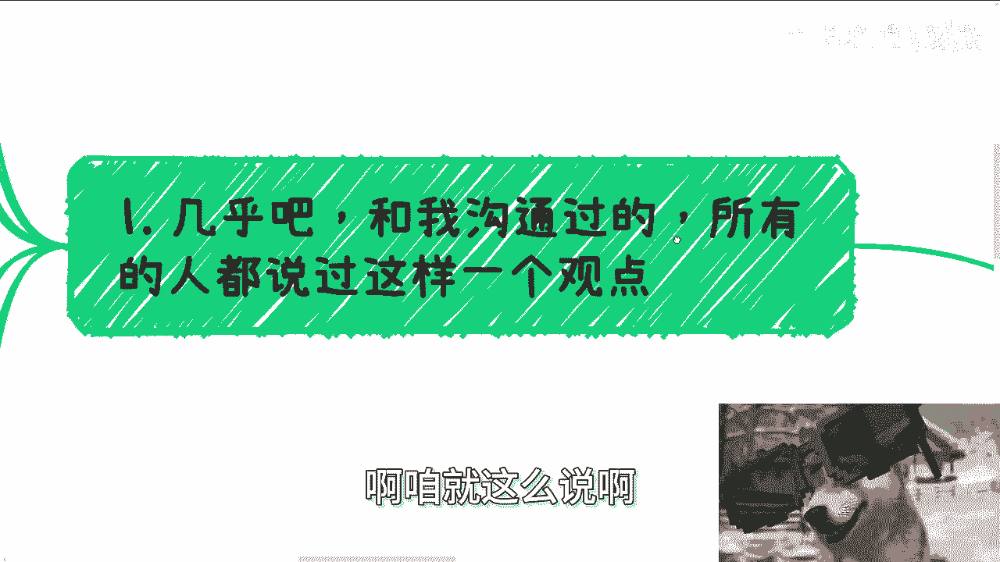
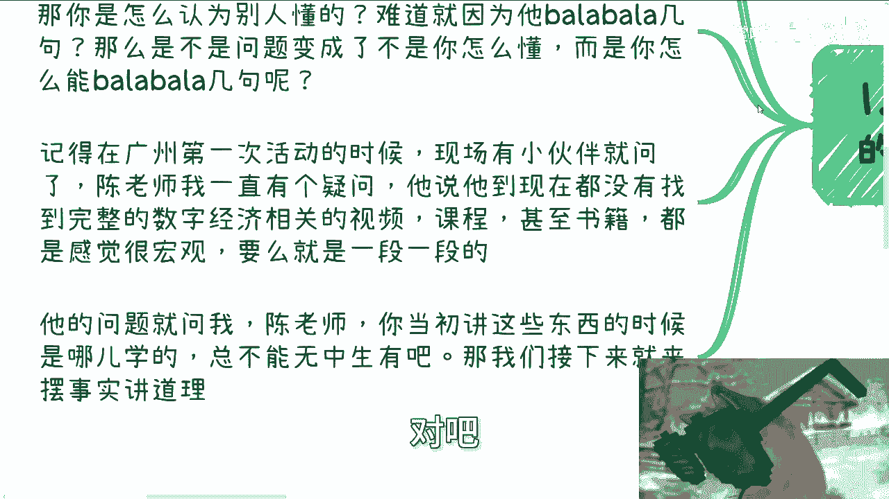

# 大学生建议：先不要当自己是大学生 - P1 - 赏味不足 - BV1kQsDeqEvs

好大家好呃，我再次说一下啊，就是我名字虽然是叫大学生专题，但是就整个内容大学生跟这个叫什么，就没有接触过社会的这种牛马，其实都是可以看的，嗯我昨天那个专题已经哦，我不管你们工作多少年。

但凡你们跟这个社会没有接触，其实就你们跟大学生也没什么大太大差别，啊然后那个叫什么，还有小伙伴让我出一个什么什么职场人的。

这个什么专题啊。

我呢不排斥啊出这种东西，但是呢内容上我觉得是大差不差的啊，但是呢你要是愿意听啊，那我后面可以出啊，那么今天呢也是个很重要的东西，叫什么叫做你大学生之前问我要建议，对不对，好。

那么今天呢就是这个建议是什么。

就是你不要当你自己是大学生，对不对啊，咱就这么说啊。

又又先从故事来讲啊，几乎啊跟我沟通过的啊，几乎所有的人都说过这么一个观点。

他说陈老师我还是个学生啊，我什么都不懂，别人呢怎么跟我沟通啊，我怎么跟别人沟通，我对这些都不了解啊，好没问题啊，这句话一点毛病都没有啊，然后还有人跟我说，你那个我这个狗子眼睛太小，你看我这个放的就很大。

对不对啊，我我都看到了啊，我每次呢都反问我说，我说你不懂对吧，也许这是个事实，但是我说我不明白的是什么，就是你能知道你不懂这句话是对的，这是个事实，但是怎么就认为别人懂了呢，对不对哦，他就跟我说。

爱陈老师，我发现我这个现场碰到的人啊，都都好像很牛逼啊，都好像很怎么样子，那我说你怎么看出他牛逼的，你怎么看出他很懂的呢，把他脑子打开来看了，对不对，你难道就因为他巴拉巴拉巴拉巴拉几句，就他妈懂了好。

那么如果是这样的话，那么是不是我们可以把这个问题变成，不是你怎么变成，就是不是你自己怎么变成一个怎么懂的人，而是你怎么变成一个巴拉巴拉巴拉几句的人，你说是不是啊，那么记得在广州啊。

去年第一次办那个活动的时候啊，就现场有小伙伴问我，他说他说陈老师我一直有一个疑问啊，不知当讲不当讲，我说他妈有屁快放对吧，他说呢他说他到去年都没有找到一个完整的啊，数字经济的视频课程，甚至书籍啊。

甚至比如说自媒体对吧。

他说他空看到的呢都是一些很宏观的，要么呢就是那种西一段东一段的啊，那么他问题就来了，他说他说他一直问我，他说陈老师，你当年可能比他们去年见到我还要早，那么两三年34年啊，就开始做数字经济了。

或者说数字经济了，他就问我，他说陈老师你哪学的对吧，他说我在这个我这个YOUTUBE啊对吧，B站啊。

或者其他各个地方啊，我都没有看到，我说你总不能无中生有吧，好那么接下来我们就来摆事实讲道理啊，首先我的逻辑是什么，首先我的逻辑是我知道我知道当时政府企业，高校都有诉求，这个需求是明确的对吧。

也就是说我们假设就当我们现在打个游戏嘛，对吧，那么打个游戏我们得要有前期的需求嘛，对吧好，那么这个需求是明确的啊，那么另外呢这个数字经济这个词汇，就跟现在的新知识生产力是一样的，也就是你今天站在我面前。

我他妈给你解释一遍，我估摸着你还是不明白是什么意思，对不对好，那么我们第二个音，第二个这个牌是什么，就是我们知道整个普罗大众啊，大家的智商不会差太远，那么也就是说你今天作为一个大学生。

或者作为一个智商正常的人，你听不懂，那么我就这么跟你讲，别人其实也听不懂啊，那么我面临的情况是什么，就是需求是明确的，客户是不懂的对吧，那么我自己也不懂的，无非就这三张牌嘛，对不对，那你们想想看。

如果你们是我也无非就这三张牌嘛，对吧好，那么根据这些因素啊，根据根据这些我们所谓的依据吧，啊就或者来说就是手上已经有的东西啊，如果要来解决的问题的话，是不是我们只能得出两个结论，就是你看啊需求明确。

客户不懂，我不懂这么三张牌，你说我要解决问题怎么办呢，你说好，我让客户懂，概率大吗，概率不大吧，就像就像你们今天站在我面前，我想把你们说明白，这件事情是我控制的吗，不是我控制的。

他妈我又不知道你们脑子里怎么想的，对不对，好，那么第二个第二种选项是什么，就是我把我自己变得很懂，难度高不高高，但是是不是这种解决方案是对吧，好那么这是第二种，第三种是什么。

就是我让客户感觉我是一个懂得人，就是我能够不拉不拉不拉对吧，无非就这三种，对不对，好，那么就刚刚说的那三种里面，除了第一种我们不能控制以外，后面两种我们是能控制的，那么也就意味着我们只能得出两种结论。

第一我要让自己真的去懂这些东西，但是在客观事实面前，什么叫客观事实，身边懂的人又很少，如果我到处去问，可能打草惊蛇，在我就在我还没有找到客户之前，他妈的客户就可能已经被别人抢走了，对不对。

因为你想想看嘛，你认为这是一个比较前沿的东西，到处去问，对不对，那到最后人家把客户都抢走了，人家比你会营销，人家比你做的好，那图啥是不是好。

那么第一咳，第一点里面同样的你要让自己去懂这些东西，我还是那句话，你们大部分人我你们大家都是一样的，我想去很懂一个东西，你想很懂一个东西都会花费大量的时间精力，资金人力，对不对，好。

那么这件事情从赚钱角度来讲，我们的投入产出比，其实一开始来讲就已经不高了，对吧好，那第一种这第一种选择啊，第二种选择是什么，就是我不一定要懂，我只要让客户觉得我能自圆其说，让客户觉得我懂就行了。

简单来讲就是他妈的你们一里面说的那种，我能巴拉巴拉巴拉巴拉就行了，对不对，好，那么第三啊，我们来看普罗大众的逻辑，普罗大众是什么逻辑，就是我不懂就不能做，我他妈非要懂啊，然后去学习网。

网络学习，线下学习，付费学习等等等等等，反正他妈的我都必须懂，不懂他妈我就不能去做，做了他妈的我道德观就不行啊，就感觉他妈的哎我不懂，我怎么能教别人呢，对不对好，那这个是普罗大众的逻辑。

哎对我的狗子怎么不动了啊，好了对吧啊，这是第一个，第二个呢就是我让别人觉得我懂，就很容易被揭穿，就容易被戳破泡泡，其实我跟你讲揭穿也好，戳破泡泡也好，或者你们在这过程当中，给我表达的任何一个词汇也好。

都很虚，对不对，你要关注的是什么，关注的是揭穿什么东西，戳破什么东西，咳对吧，什么叫揭穿，什么叫戳破，哎我就不明白了，在一个所谓大家都不懂的领域里面，双方都是可以提出不同意见的。

就比如说你们日常看我视频，对不对，你们不要上来喷啊，你们可以提出你们的摆事实，讲道理啊，交流嘛，对不对，又不是谁要干掉谁，那你我就问了，你既然不是这么个情况，那你怕个屁呀，对不对啊，第三还有就是说哎呀。

我巴拉巴拉巴拉时候心心里很虚，没底好，那么你仔细看看啊，你巴拉巴拉巴拉时候心心里很虚，没有底，这个核心问题是在于你不在于外界，对不对，那么你心虚，你没底，是你的问题，这是你自己要去改变的。

与整个外界与你碰到的人都没有关系，与客户也没有关系，那么这种想法更更加他妈的离谱好，最后还有一个最最好玩的逻辑就是什么，哎呦陈老师啊，你说你你这说的不脚踏实地啊对吧，你他说你这种做法不太脚踏实地啊。

非常的虚啊，一点都不实啊，好没问题，我就觉得非常的interesting，哎我们做事情是为了目的的，不是来过家家的，对不对，你脚踏实地的目的是什么，你告诉我你脚踏实地目的是什么，你如果告诉我脚踏木。

脚踏实地的目的就是为了脚踏实地，那我没得话说对吧，你但凡跟我说，你脚踏实地的目的是为了某某某一个一个目标，而这个目标最终是为了赚钱的，那么我们是不是要去为了达到目标，那么我做的事情，我给出来的方案。

我看到的方案是不是直奔目标的，脚踏实地，花里胡哨有什么用啊，对不对，哎我一不犯法，二不伤天害理，我觉得达到目标才叫脚踏实地对吧，而不是那种自我感动，闷头学习，有他妈用啊，是不是啊。

第四回到大学生这个话题上面啊，你看啊，我们刚刚一里面说的，他说哎呀陈老师啊，你看啊，前两天评论区也有哎呀陈老师啊，我这个我我还是个学生对吧，我就不懂对吧，人家看我不愿意跟我沟通，咱就这么说。

第一你不说谁知道啊，你花点时间锻炼锻炼吧，拉吧拉吧拉吧拉吧拉，谁能知道啊，只要你自信不说话结巴谁又能知道啊，哎我他妈奇了怪了，就好像我就问你，你凭什么知道别人懂得很多一样。

那不就是别人意识学会画巴拉巴拉巴拉吗，他他妈懂个屁啊，他他妈可能站在你面前是个小学毕业的，知道个屁啊，哎嘛奇了怪了对吧，当然啊也有小伙伴说了，他说哎呀，我自己长得就像学生啧，唉我每次听到这话。

我他妈也是很就想骂，那骂呢又感觉他妈的唉想想算了，人家还年轻，你说是吧，唉大哥大姐长相这事儿就更容易了，你要觉得你长得很像学生，那你自己穿着打扮稍微成熟一点不就过去了吗，这算什么大事呢，对不对哦。

连这个事都能阻碍你赚钱，那你告诉我，还赚个屁呀，是不是啊，那么大家心里还要有数啊，我们大部分时候社交或者跟别人沟通，其实我们大部分碰到的人，跟我们都是一个级别的，你能碰到的人跨级别的概率不不高的。

你明白吗，就你不要问为什么，这他妈就是社会规律，对不对啊，你你我就反过来问嘛，你觉得一个正常人平时社交都是跨级别的，这件这件事情可能吗，既然是小概率，那么大概率是什么，那就同一级别的，不就这么个逻辑吗。

对不对，那么既然同一个逻辑，怎么他妈别人就一定比我们懂得多了呢，唉我也搞不懂哎，哎对不对，就是属于那种上战场，他妈的仗还没打呢，上来就说卧槽对方牛逼哎，牛逼在什么地方不知道哎，就牛逼，浓油来煮茶。

哎哎对吧，那最后你看啊，永远拿学生或者还说工作没几年去PUA自己，你没有用的，因为什么呢，因为我跟你讲事实，事实是什么，事实就是你23年PUA玩24年PUA，24年PUA玩25年PUA。

每次下去都这样子的对吧，因为你心里其实都会有种没底啊，或者有种就说有种怎么说呢，就是说啊比较心虚的这种感觉，或者说一直跟自己讲的，就说哎呀我要我要叫什么，我要做好准备对吧，我我要铺，我要沉淀对吧。

我要铺垫好对吧，我要怎么样子，但问题是你做好准备铺垫，哎呀这个光打的，你要懂呀，对吧就是你想想看啊，你做好铺垫，做好准备，那么什么时候算做好铺垫，什么时候算做好准备，是不是，那你一年一年一年下去。

你你你到22，20 893十几，30 544十都还没做好准备，因为人就是这样子的，你每一年都会觉得做好做不好准备，为什么，因为你没有那个标准，你就好像我们说达到过目标对吧，你跟我说。

比如说这个月我要赚到1000块钱，这是个目标，你跟我说这个月我要做好准备，怎么叫做好准备啊。

对不对啊，啊。

啊就我们家咪咪啊，哎呀对吧，其实就这么回事。

就是我还是回到那个根本点上面，就是你们觉得很多东西是问题吗，是问题，但是你你大部分问题都出在你们自己身上，或者出在你们对于社会不了解的身上，而不是出在这个社会本身的上面，对吧。

就好像你们为什么会你们觉得外面很牛逼，事实是外面很牛逼吗，并不是啊对吧啊行吧啊，就这么着吧啊，然后那个呃职业规划就是你们工作上面好吧，商业规划你们做副业啊，跟别人做一些项目啊，呃涉及到一些合同啊。

合作方式啊，业务模型啊对吧，或者说股权融资啊啊股份分成啊等等等啊，各方面问题的，你们可以整理好对应问题和个人背景好吧，然后我们再来私信走咨询。

