# 大学生建议：先不要当自己是大学生 - 课程 P1 📚

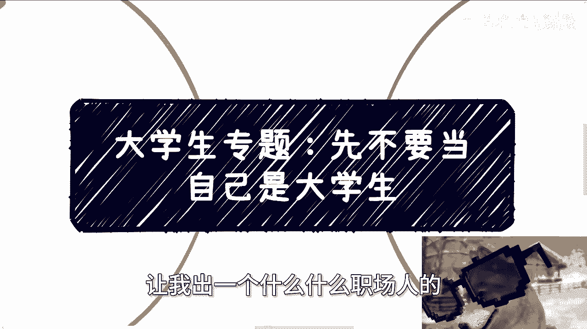

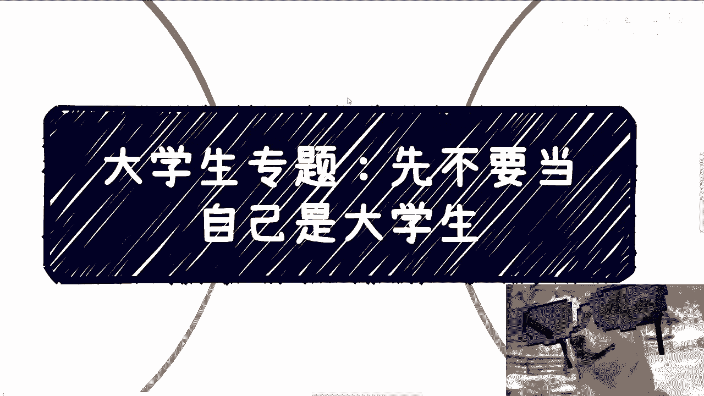

在本节课中，我们将探讨一个核心观点：无论你是大学生还是初入社会的年轻人，在开始行动时，首先要摆脱“学生”或“新手”的自我设限心态。我们将通过分析常见思维误区，并提供清晰的行动逻辑，帮助你更有效地达成目标。

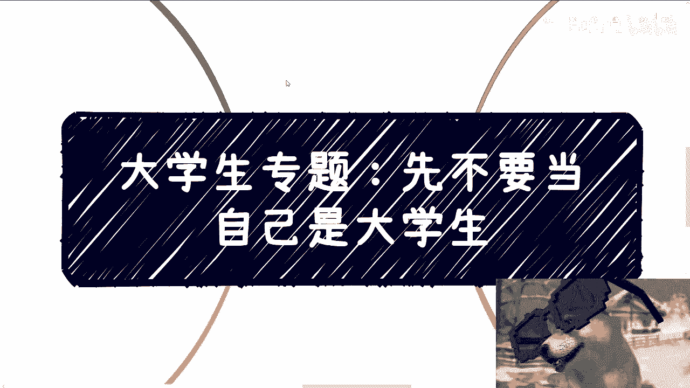

---

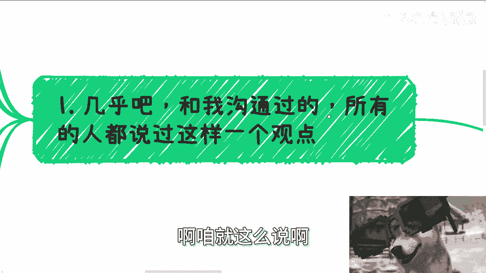

## 核心问题：自我设限的误区 🧠

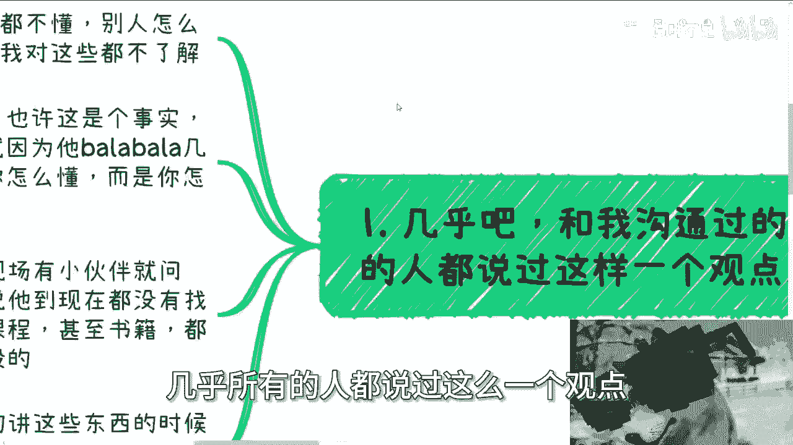

上一节我们介绍了课程的主题，本节中我们来看看阻碍许多人行动的第一个核心问题。

许多人常持有一种观点：“我还是个学生，我什么都不懂。” 承认自己不懂是一个事实，但这背后隐藏着一个未经审视的假设：**别人都懂**。

这个假设的逻辑是：
1.  我观察到对方“巴拉巴拉”讲了很多。
2.  因此，我认为对方很懂。
3.  对比之下，我显得不懂。

如果这个逻辑成立，那么解决问题的关键，似乎就从“如何让自己真正懂”变成了 **“如何也能‘巴拉巴拉’地表达”**。

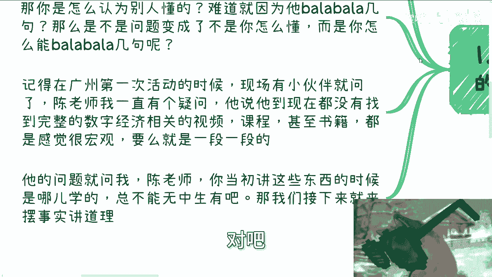

---

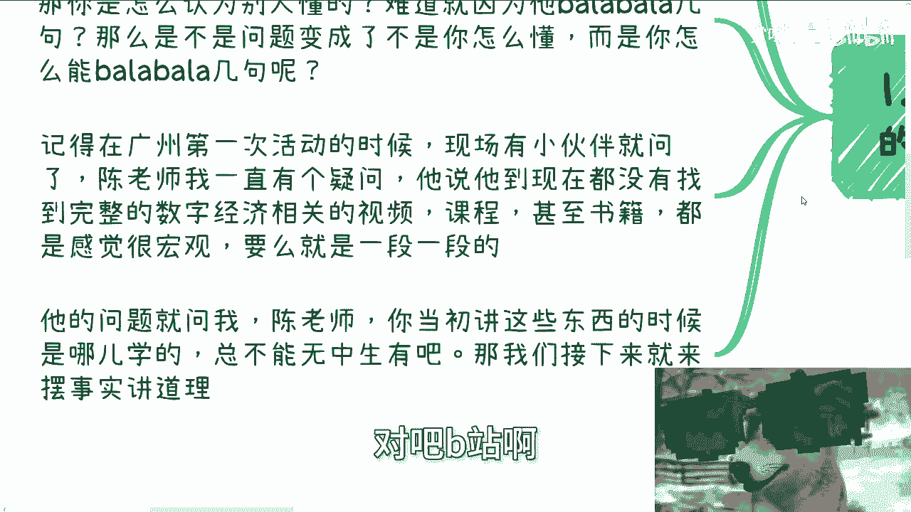

## 案例分析：从“数字经济”说起 💡

上一节我们指出了自我设限的思维模式，本节中我们通过一个真实案例来具体分析。

曾有人问我：“陈老师，你早期做数字经济时，是从哪里学的？我找不到系统的课程。” 当时我面临的情况可以用几张“牌”来概括：

*   **需求牌**：政府、企业、高校对“数字经济”有明确需求。
*   **认知牌A（客户）**：普罗大众（包括潜在客户）对这个新概念并不懂。
*   **认知牌B（自己）**：我自己起初也不懂。

以下是基于这三张牌可以推导出的几种解决方案：

*   **方案A：让客户懂**。这不可控，且难度极高。
*   **方案B：让自己真懂**。需要投入大量时间、精力、资金，在商业初期投入产出比可能不高。
*   **方案C：让客户感觉我懂**。即能够清晰、自信地阐述，实现有效沟通。

对于行动者而言，方案A不可控，因此实际选择集中在B和C之间。

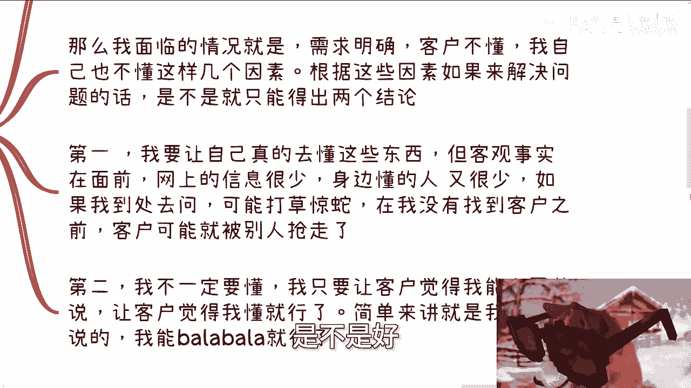

---

## 破除常见思维障碍 🚧

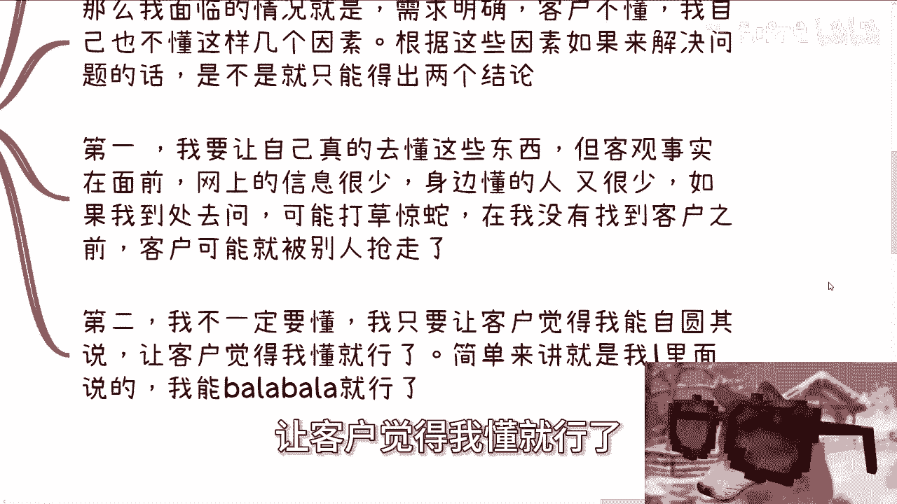

上一节我们分析了可行的路径，本节中我们来看看阻碍人们选择这些路径的常见思维障碍。

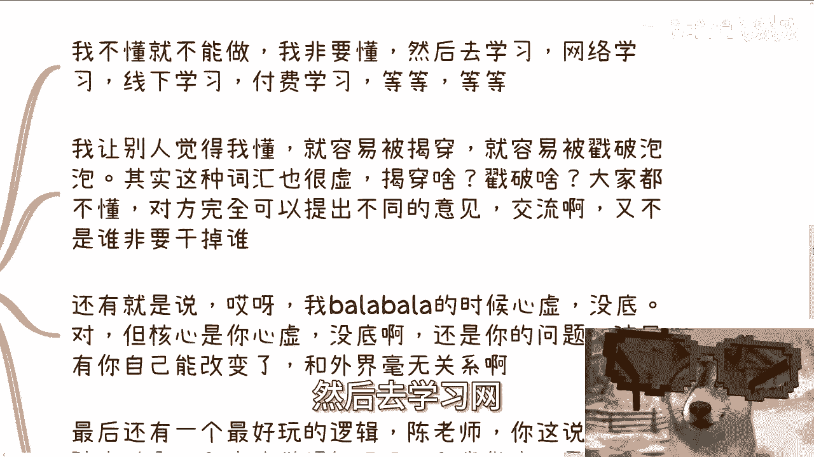

以下是几种典型的、需要破除的思维模式：

1.  **“不懂就不能做”的完美主义**
    *   认为必须完全学透才能行动，否则就有道德压力。这容易陷入无止境的学习准备，而错失时机。

2.  **“怕被揭穿”的恐惧**
    *   担心在交流中露怯。但在一个大家都不甚了解的领域，观点交流是正常的，目标不是“干掉对方”，而是沟通与建立信任。恐惧的核心源于自身，而非外界。

3.  **“感觉心虚”的自我怀疑**
    *   表达时内心发虚。这完全是**内在问题**，需要通过锻炼自信和表达能力来解决，与客户或外界无关。

4.  **“不够脚踏实地”的误解**
    *   认为上述方法“虚”。需要明确：行动的**目的**是达成目标（例如赚钱）。一切策略都应服务于目标。合法合规地直奔目标，才是真正的“脚踏实地”；无效的“闷头学习”可能只是自我感动。

---

## 给大学生的具体建议 🎯

上一节我们清除了思想上的障碍，本节中我们来看看针对“大学生”身份的具体行动建议。

1.  **隐藏“学生”身份**
    *   **问题**：“别人一看我就是学生，不愿和我沟通。”
    *   **对策**：你不说，没人知道。通过锻炼表达能力和调整穿着打扮，可以快速淡化学生气。这并非难事。

2.  **认清社交现实**
    *   你日常接触到的人，大概率与你处于**相近的层级**。跨层级接触是小概率事件。因此，无需预设对方一定比你懂得多。

3.  **停止用身份PUA自己**
    *   不要总用“我还是学生”、“我才工作几年”来否定自己。否则会陷入“23年准备，24年准备…”的循环，永远没有“准备好”的那一天。应该设定**具体、可衡量的目标**（例如：本月赚到1000元），而不是模糊的“做好准备”。

---

## 总结与行动指引 ✅

本节课中我们一起学习了如何摆脱“学生心态”的束缚。

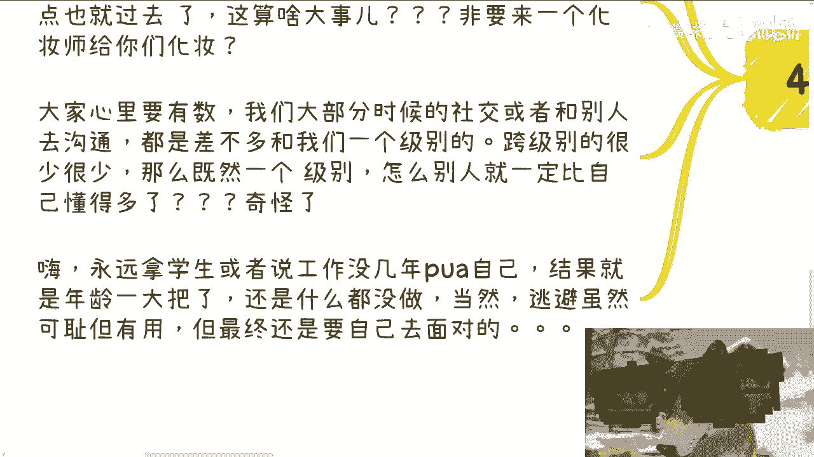

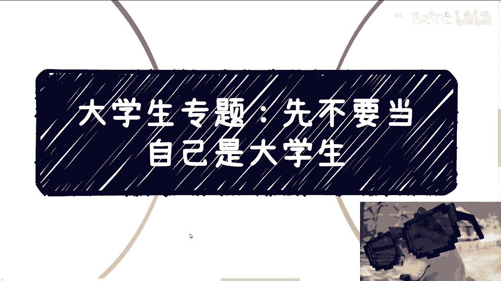

核心在于认识到：许多你认为的外部障碍，其实源于**内在的自我设限和对社会运行规律的不了解**。关键在于将焦点从“我是否足够懂”转移到“如何有效沟通并达成目标”上。

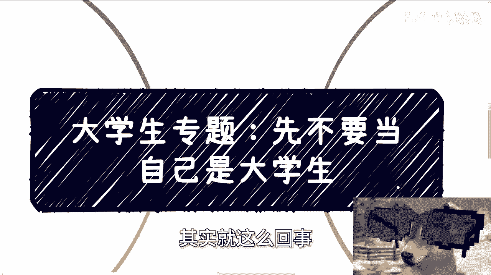

**行动公式**可以概括为：
`明确目标 -> 分析现有资源（需求、认知差距）-> 选择可控路径（提升自我或有效展示）-> 破除内心障碍 -> 立即行动`

如果你在职业规划、商业副业、项目合作、合同股权等方面有具体问题，可以整理好**个人背景和对应问题**，通过私信进行咨询。

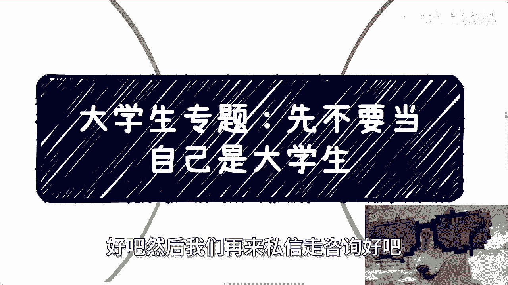

---