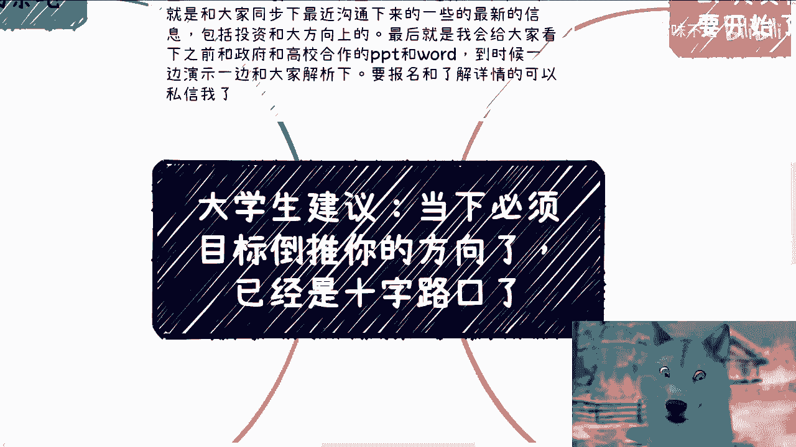
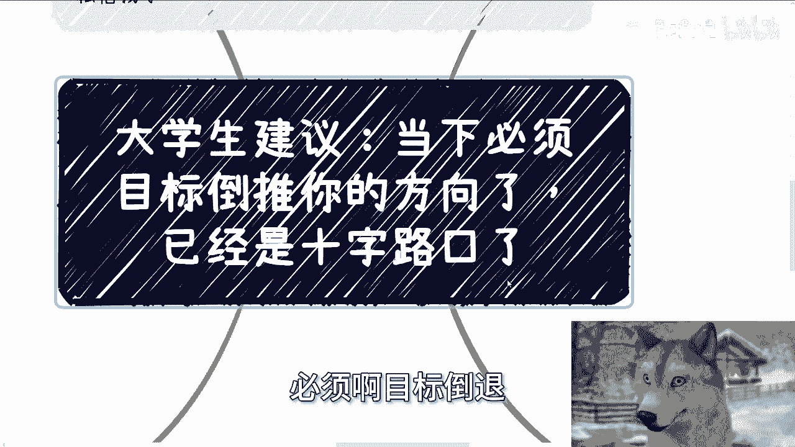
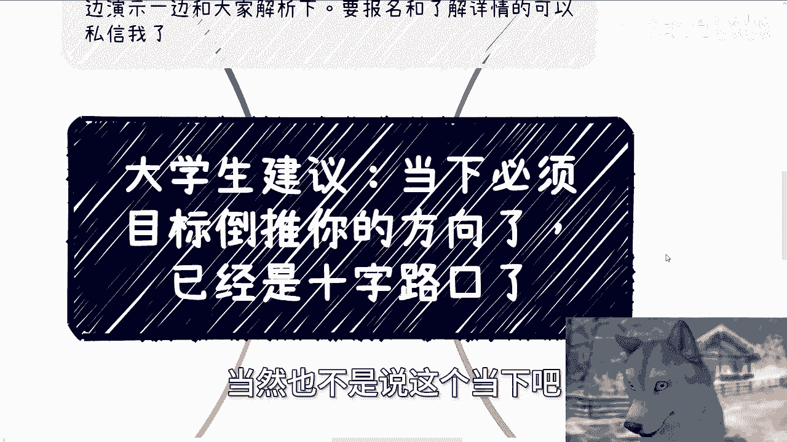
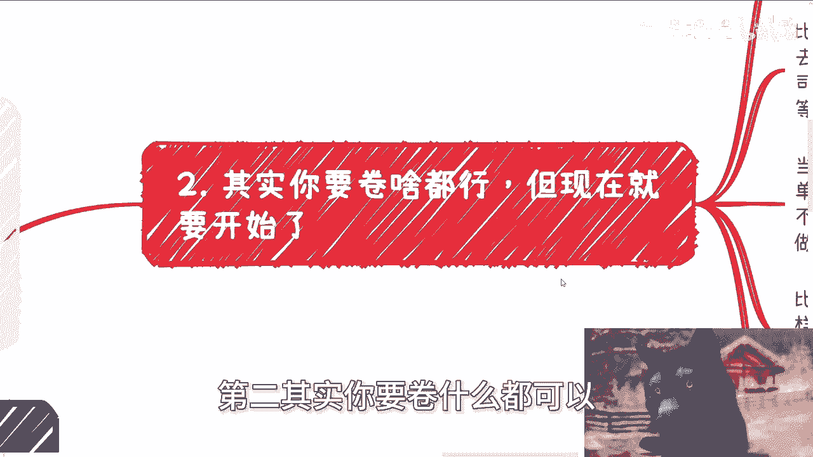
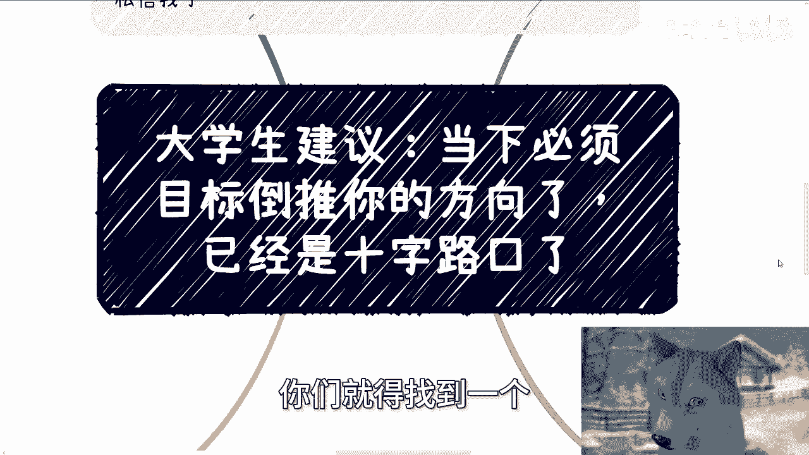

# 大学生建议课程 P1：目标导向与即刻行动 🎯

在本节课中，我们将探讨大学生在毕业关键节点应如何确立核心目标并立即行动。核心观点是：在当前环境下，犹豫不决和“先做A再转B”的策略已不再适用，必须选定方向并即刻开始积累。

## 课程概述 📋

本课程旨在为大学生提供清晰的行动建议。我们将分析当前就业与发展的宏观环境，强调目标导向的重要性，并指出“先积累后转向”策略的潜在风险。课程最后将总结核心行动原则。

## 当下环境：转折空间有限 🌍

上一节我们介绍了课程主题，本节中我们来看看当前大学生所处的宏观环境。

当前的社会与经济土壤，为个人职业发展留下的转折余地已经非常有限。这句话的意思是，大部分人已无法像过去那样，计划先工作几年，再去创业、考公或转换赛道。

一方面，在这种环境下，计划转折的成功概率很低。另一方面，与其计划未来转折，不如从现在开始直接朝最终目标行动，这样更为可靠。如果无法直接行动，那么或许应该考虑放弃该目标。

之所以强调这一点，是因为存在三个不受个人控制的外部因素，压缩了所有人的转折空间。

以下是三个关键的外部因素：

1.  **竞争加剧**：每年应届毕业生数量增多，失业人群也在扩大。市场竞争者只会越来越多，内卷程度日益加深。
2.  **红利消退**：市场上缺乏过去那样充足的热钱、优越的创业土壤或高利润的行业红利。例如，如今已很难再现房地产行业的暴利时代，这是环境变化所致。
3.  **国际局势动荡**：国际上的各种冲突与金融风险事件频发。无论我们事后将其定义为“黑天鹅”还是必然事件，它们都切实影响着发展环境。

这三个因素共同导致了一个结果：社会没有留出足够的时间窗口供个人从容地规划转折。

## 确立核心目标，拒绝焦虑 🧭

理解了环境的紧迫性后，我们来看看个人应如何应对。核心在于：你必须确立一个清晰的核心目标。

作为灵活的人类，选择是多样的：工作、考研、考公、出国、创业等均可。但所有行动应围绕一个**核心目标**展开。如果你的目标是赚钱，那么核心公式就是：**行动 -> 验证 -> 调整 -> 达成**。

如果没有核心目标也可以，但前提是你不为此感到焦虑。最糟糕的状态是既无目标，又持续焦虑。

一旦目标确立，重点就是立即朝着它前进。不要再想“过两年再朝着目标努力”，因为已经来不及了。你必须现在、马上、立刻开始行动。

## 分路径行动指南 🛣️

确立了目标，接下来就需要具体的行动方案。以下是针对不同目标的行动指南。

无论你选择哪条路，原则都是立即开始积累相关“Buff”（增益效果），而不是等待。

### 路径一：职场发展

如果你决定在职场一条路走到黑，目标是进入心仪的公司（如大厂、创业公司、国企央企）。

以下是需要立即开始积累的“Buff”：

*   **硬实力**：提升学校背景、学历、考取相关证书、积累名企实习经历。
*   **软技能**：学习与领导沟通的技巧、培养团队亲和力、维护良好的同事关系。

如果你自觉学历或社交能力不足，无法在此路径上卷动，那么你有两个选择：要么更换赛道（选择其他路径），要么降低预期并停止焦虑，不再幻想后期逆袭。

### 路径二：公务员体系

如果你决定考公并寻求晋升，目标是进入体制并谋求发展。

以下是需要立即开始准备的方面：

*   **准入门槛**：关注对学校、学历有优势的岗位。
*   **体系认知**：学习体制内的语言体系（官腔）、文件报告写作规范。
*   **发展洞察**：了解不同部门、不同地区的晋升前景与快慢。

同样，如果对此不了解或感到不适应，应尽早考虑其他路径，或安心做一名普通公务员，停止不切实际的晋升焦虑。

### 路径三：创业赚钱

如果你的核心目标是赚钱，验证标准是看到现金流。

行动准则是在最短时间内先赚到钱，证明自己的能力。不要用“我还是学生”作为借口。社会不会因为你的身份而放宽标准。

如果你不知道如何开始，正确的做法是：**直接去干，在干中学，在干中积累**。所谓的“先积累沉淀”往往只是自我安慰，与能否赚钱没有必然因果关系。

### 路径四：出国发展

如果你选择出国读书、移民或利用海外资源。

你需要立即开始规划：读书路径、移民政策、赚钱方式以及如何整合海外资源与人脉。如果尚未了解清楚，那么现在就去了解。如果无法了解，或许这条路并不适合你。

## 总结与行动号召 🚀

本节课中，我们一起学习了目标导向与即刻行动的重要性。

总结来说，当前环境留给大学生试错和转折的时间窗口正在迅速关闭。外部因素的叠加使得“先做A再转B”的策略风险极高，大概率会导致目标无限期推迟或彻底放弃。

因此，给你的核心建议是：
1.  **立即选定一个核心目标**。
2.  **围绕该目标，现在就开始积累所有必要的“Buff”**。
3.  **放弃“以后再说”的幻想，采取“As soon as possible”（尽快）的行动原则**。

对于尚未毕业的同学，你们仍有时间优势。请利用好这个机会，选定方向，开局积累。不要再等待，行动就从此刻开始。