# 大学生建议：我很怕和父母、家庭闹僵 - P1 - 赏味不足 - BV1iZxueLEbv

啊大家好，这个昨天啊我们讲了这个父母的傀儡是吧，那正好关于这个话题呢，今天还有个小伙伴私信也跟我们聊了一下呃，就我们今天正好再扩展一下啊，就今天我们关于这个呢，叫做什么叫做家庭关系上的这个问题啊。

什么意思呢。

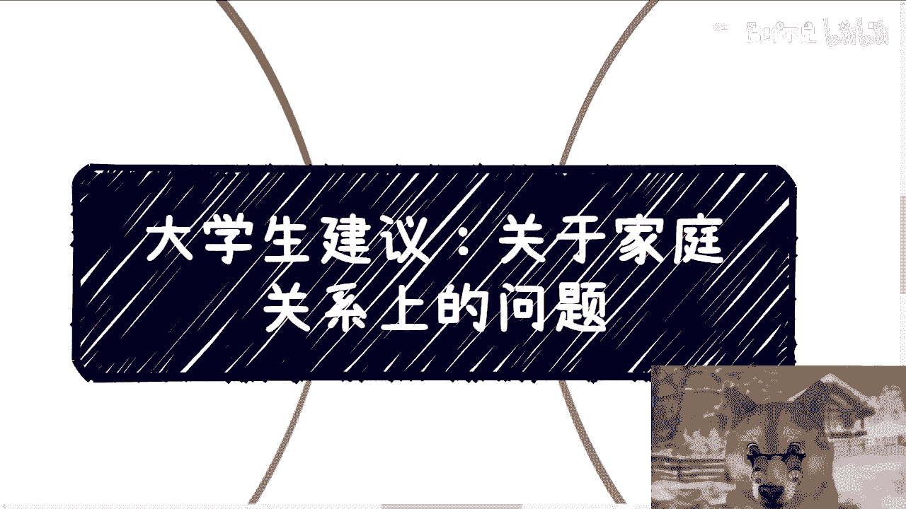

是这样子的呃，就是首先啊在众多的沟通当中，还有个事呢也是让我很匪夷所思的啊，就是这不止一个人跟我提到过，他说他的原话叫什么叫做我不想跟家里闹僵，或者呢不开心啊，甚至断绝关系什么的，这种情况呢。

往往就是说大家已经在，就是说就背井离乡出去读书了嘛，或者工作了对吧，然后父母呢在老家对吧，然后在这当中呢，可能会出现比较多的这种意见的分歧啊，其实啊我每次听到这种观点的时候，我也很茫然，为什么。

因为我听到这种观点，我就有几个疑问，第一就是闹僵，不闹僵怎么了呢，就是他是能帮助你赚钱呢，还是阻碍你赚钱，我不是太明白对吧，就是以前老话叫什么叫将在外军令，军令有所不受对吧，那你闹将不降将怎么了呢对吧。

就我，而且我们以前有句话叫什么叫做除了生老病死，其他的这种感受，其实都是你个人的情绪造成的，也就是说我们实际来讲它到底造成了什么呢，对不对，第二虚伪的和平也是和平，那那怎么了呢对吧。

也就是说你你可以不闹僵嘛对吧，你你你你干嘛一定要闹僵呢，对不对，就是你可以不闹僵的情况下面，做你自己的事情嘛对吧，第三怎么才算闹僵呢对吧，就大家非要啊这个冷战还是怎么样子啊，第四我觉得家庭的很多原因啊。

很多问题啊都是历史遗留原因，那说真的在我看来，你要有问题，早晚都有问题，这跟你就是本次啊，你跟你父母闹闹矛盾，或者说闹僵的这个原因没有关系啊，就算没这个事情以后也会因为别的事情闹僵啊。

所以说其实闹不闹僵这个事我们要明白，本质是双方相互理解嘛，其实不是相互理解，因为你和你父母甚至亲戚之间的矛盾，主要是来自于每一个人的性格，以及其经历不同的时代带来的经验对吧。

最后还有就是说我们说的那种长辈啊，晚辈啊，这种就是说跟我们之间不平等的关系，所带来的啊，你说是因为相互不理解吧，就理解不理解，这个怎么说呢，它是一个结果，它是不是一个原因啊，所以我们就这么说，能沟通。

能相互理解的本质，你会发现你从小到大都能，这是一个长期的家庭的沟通跟相处的一个方式，而如果本质他不能沟通，有矛盾，那早晚都有矛盾，无非只不过就是因为你以前年纪小，可能这种矛盾没这么大啊。

只不过就是说表现形式和其触发条件不一样。

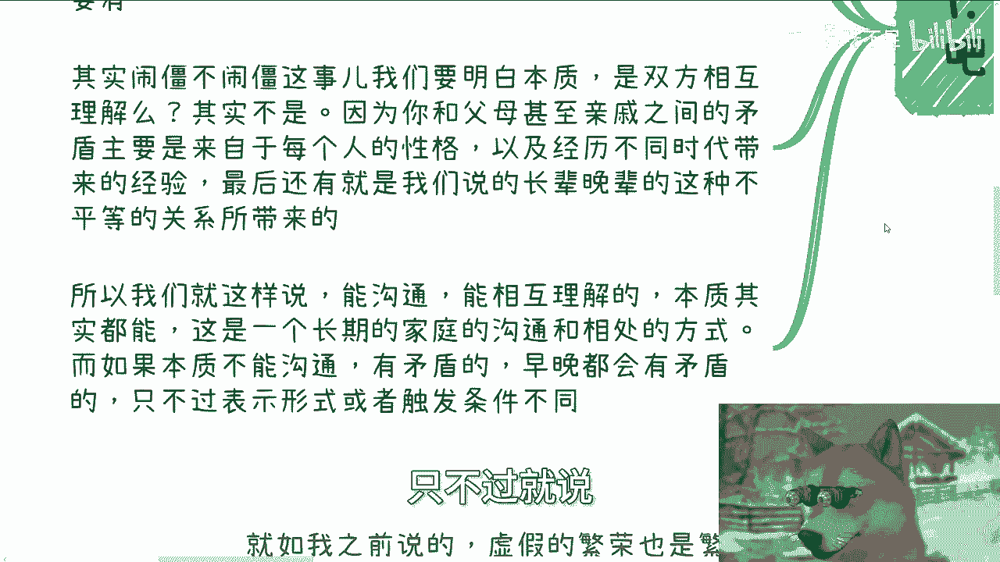

你们想想看对吧啊，第二这就好比啊。

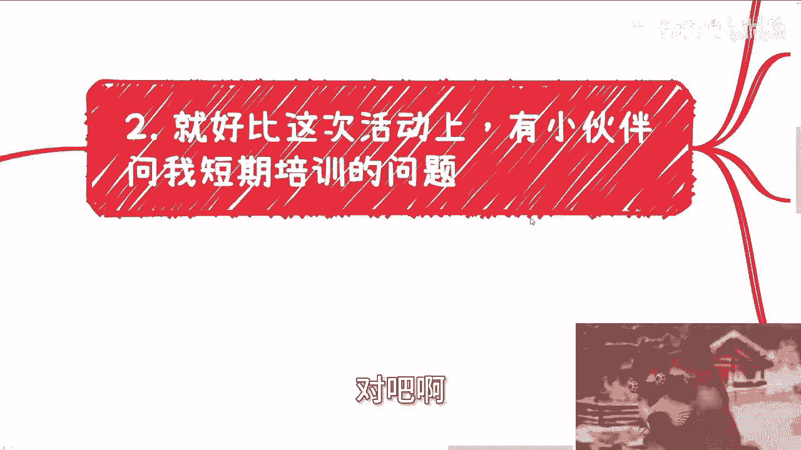

打比方啊，就像这次那个杭州的活动。

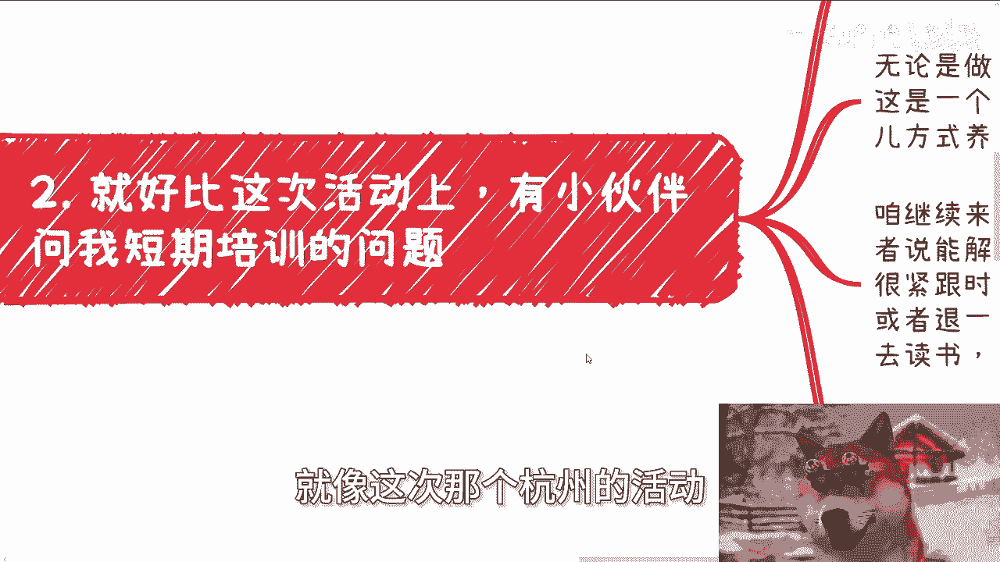

有小伙伴就问我这个短期培训的事情，你看啊这次活动上面我就跟他们说，我说基本上短期的培训都是毫无意义的，为什么，因为短期的东西它更像一个催化剂，就是你你你咱咱咱咱咱就这么说啊，他能让一个好的事情变得更好。

他能让一个坏的事情变得更坏，但是不管怎么样，他是没办法把一个好的东西变坏，把一个坏的东西变好对吧，也就是说它不是一个改变的契机，它更多的是一个催化的契机，那么无论是做事情的方式还是演讲，还是说赚钱等等。

看似这是一个结果，但其实这是一个长期的习惯，和一个做事情的方式所养成的这个这么个过程，导致的这么一个结果，那么咱就来摆事实，讲道理啊，就是就是如果短期能解决问题。

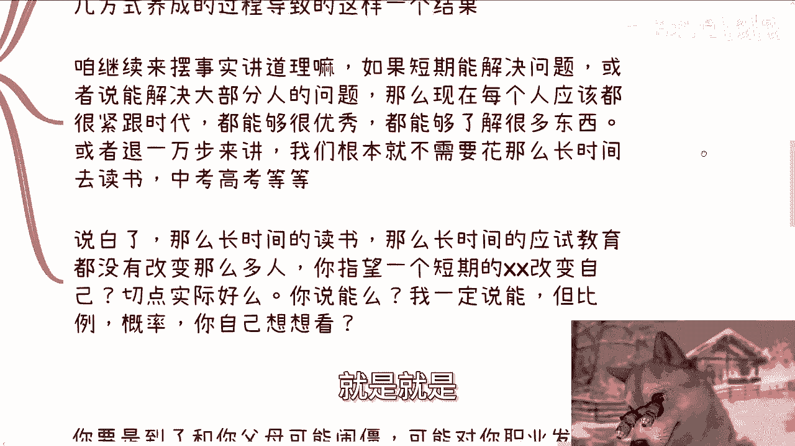

或者来说能解决大部分人的问题的话，那么现在每个人都应该是紧跟时代，每个人都应该很优秀，每个人都应该很了解很多东西对吧，但是退而且退1万步来讲，我们根本就不需要花这么长时间去读书，去中考高考，对不对。

就像我那天现场跟他们说的。

我说如果你们觉得一个短期的培训，短期的一个东西对你们真的有用的话，那你们还读什么书啊，为什么花花花这么多年读书呢，对不对，你们仔细想想看，是不是这个道理，说白了这么长时间的读书。

这么长时间的应试教育都没有改变这么多人，你指望一个短期的叉叉改变一个人，你切点实际好吗，对不对，你要问我能吗，我一定会说能，但是你考虑考虑这比例，这概率你想想看。

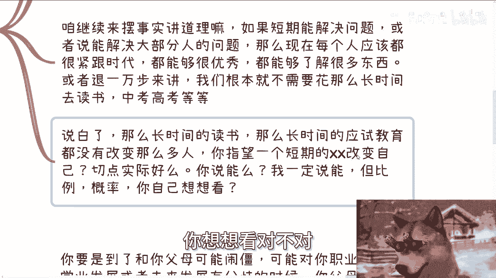

对不对，不能肯定是不对的，但是能你得看比例。

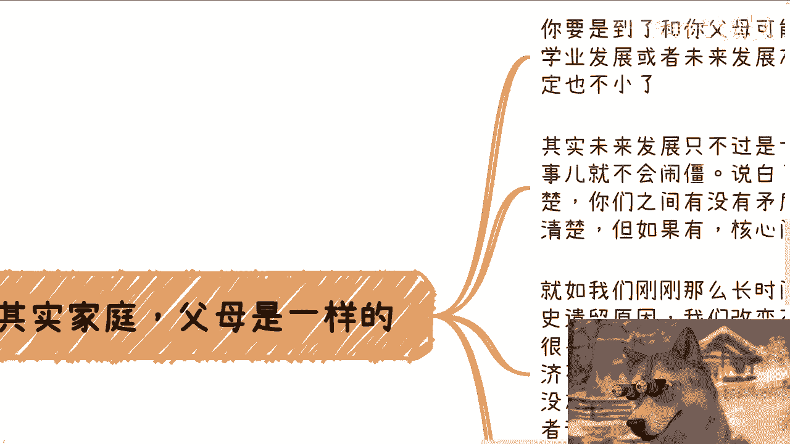

啊那么第三，其实呢呃家庭跟父母。

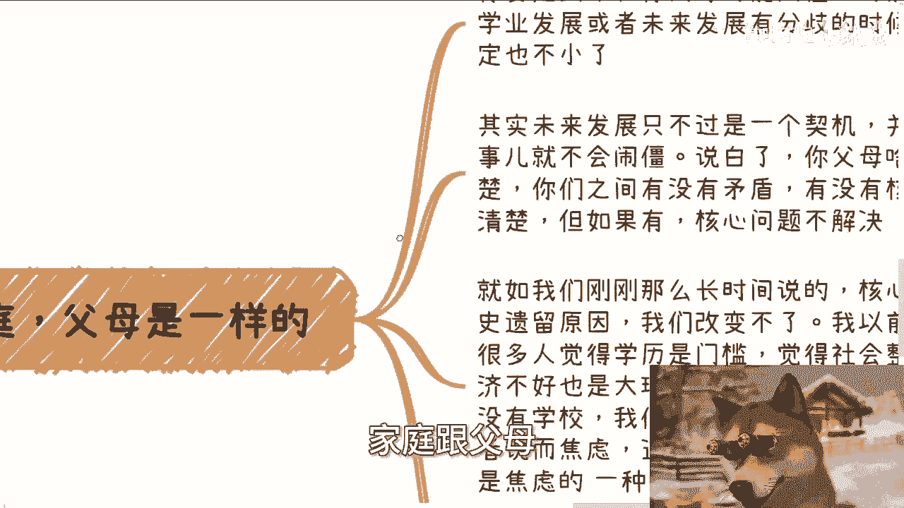

跟我刚刚说的这个例子也是一个道理，你想想看，你都到了，跟你父母可能闹僵，可能对你职业发展，学业发展甚至未来发展有分歧的时候，你父母年龄肯定也不小了对吧，其实未来发展只不过是个契机。

并不是说啊这个没有这个事就不闹讲了，那说白了你父母啥时候诶哈我写错了，就是说说白了你父母什么样子，你自己是最清楚的，你们之间有没有矛盾，有没有核心的问题，你也是最清楚的，如果有核心矛盾，只要不解决。

早晚都是要爆发的，只不过是不同的形式对吧，那你就如我们刚刚这么长时间所说的，核心矛盾往往是历史原因所造成的，我们改变不了的，我以前也举过一个例子，我说现在很多人觉得学历是门槛，对不对。

觉得社会整体土壤不好对吧，其就觉得整个经济不好，觉得整个房价太高，物价太高也都是大环境，对不对，好没问题啊，但是我们你有没有想过，就是如果就算人类社会没有学历，没有学校，没有物价，没有房价。

我相信大部分人也会因为别的事情而烦恼，或者焦虑，一样的道理，你知道吗，这这这它它它就是人类社会的本质，没有这个也会有那个啊，所以说当下你们所面对所有问题，无非只是焦虑的一种形表现形式而已啊。

所以说从本质上来讲，父母只要不干涉，不强行控制，我觉得已经是谢天谢地了，有一说一啊，我是不太指望相互理解的，因为客观的说啊，我觉得本来我们希望父母跟我们相互理解，他就是不切实际的愿望，为什么。

因为你要相互理解，就要基于一个人很宽容，还要基于一个人很能紧跟时代，还要基于一个人很能够从对方角度来考虑，卧槽这他妈要求也太高了，对不对，等你们做父母了，我估摸着大多数也做不到。

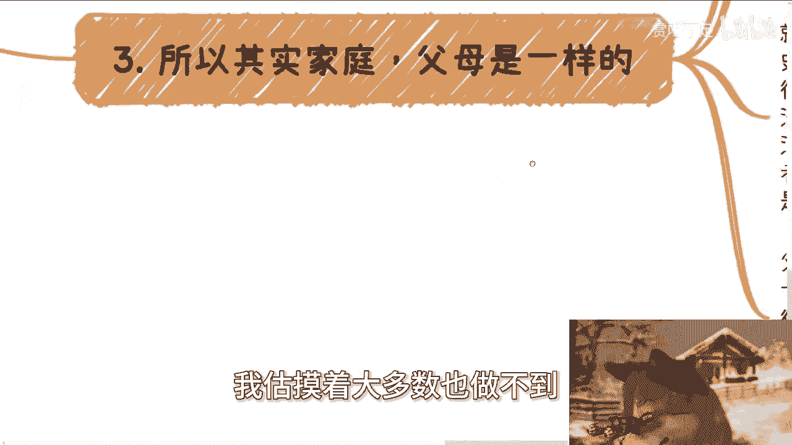

你们想想看是不是，咳咳对吧，所以说其实呢我觉得就不用纠结。

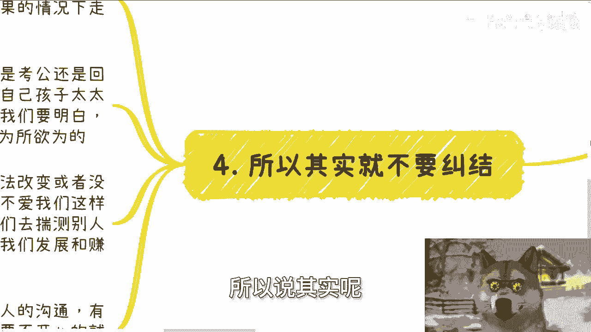

因为就如我之前也说的，我说虚假的繁荣也是繁荣，我觉得自己的人生还是要自己负责的，你顺着父母的意思来就好啦，但是你不真的顺着吗，或者说你在这当中有20%，顺着80%，按照你的情况去走就好了嘛，怎么了呢。

你干嘛一定要去较真呢，对不对，而且说白了父母的出发点都是好的，无论是考公还是回老家，还是说催婚，对不对啊，无非就是想着哎呀自己孩子太太平平，健健康康一辈子，我们也不求大富大贵，对不对。

但是这当中有个最大的问题，他们也许不明白，但是你们作为年轻人啊，我觉得你们得要明白是什么，就是人与人之间，一定不是因为一句我能我是为你好，就能够为所欲为的，对不对啊，这就好像我们以前在我们之前在网上。

或者呃碰到很多人，我们都说了，就是我们总不能因为说哦我已经道过歉了，一句话噢，就能够抹平所有事情，那肯定也不对呀，对不对，所以说一样的道理，我们也不能因为他们没法改变或者没法沟通。

就得出他们很想控制我们，或者他们不爱我们这么一个结论啊，所以我就说白了嘛，我就说啊，我说我们去揣测别人的想法，其实都是徒劳的，因为关键我们也不是就是人心隔肚皮，我们怎么知道人家怎么想的。

哪怕你父母你也不知道啊，对不对，那关键也不影响，关键是我们揣测出来好也好不好也好，它也不影响我们发展跟赚钱，何必呢，对不对，所以说我觉得父母也是人，在社会上，你们所有的沟通无非都是人与人的沟通。

那么我觉得大家的这个逻辑应该是这样子的，有价值就沟通，你开心就沟通，你要不开心就不沟通。

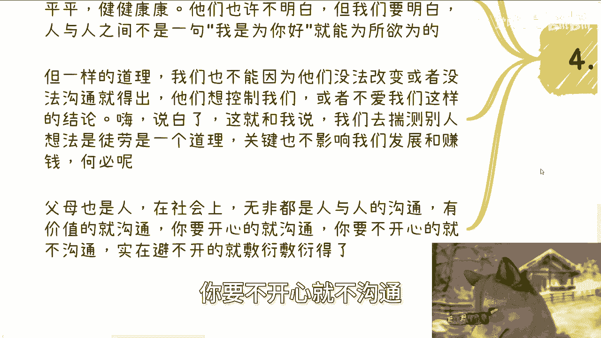

没有价值就不沟通，实在避不开的就敷衍敷衍得了，怎么了呢，对不对对吧。

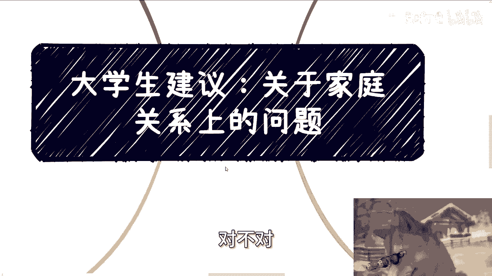

我觉得最徒劳的一件事情是什么，就是去改变别人没有意义的，你就像我给你们讲，我从去年讲到今年，我的逻辑是什么，随缘对不对，就是我每次都说我只阐述我的观点，你要愿意觉得哎有道理的，那你可以参考。

你觉得没道理的，你把我拉黑不就好了吗，这事情不就结束了吗，对不对，那有什么，就但有很多人这么闲的蛋疼的嘛，非要battle对吧，非要讨论一下，没准有什么好讨论的呢，对不对，就是你要叫什么。

就是良性的客观的讨论，只说出你的建议，那完全没问题，你一上来就为了来改变我，那有意义不啦哦，我一上来就为了来改变你，那我要么吃饱了撑的不一个道理呀，对不对啊，行啊好吧，那反正就是说今天我也算是给你们。

就是说家庭这个方面就收个尾好吧，你们要是觉得还有些其他的这个问题啊，或者内容的，你们也可以评论或者私信告诉我啊，然后叫什么，就是那剩下的话就是说职业规划好吧，商业规划呃，职业上面呢就工作。

商业上面就副副业啊，赚钱啊对吧，或者你们的涉及到涉及到一些商业业务啊，涉及到一些商业发展啊，或者说呃涉及到一些这个股权股份啊，合同啊，分红分润啊等等等啊，你们觉得有任何的问题或者相关的一些额。

这个问题的话，你们可以整理好对应的个人背景，和这个个人的问题好吧，我们再来走咨询啊，不要老盯着我这个狗子的这个眼镜啊。

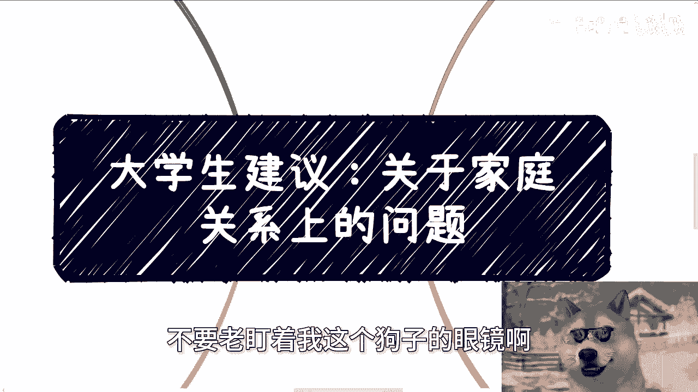