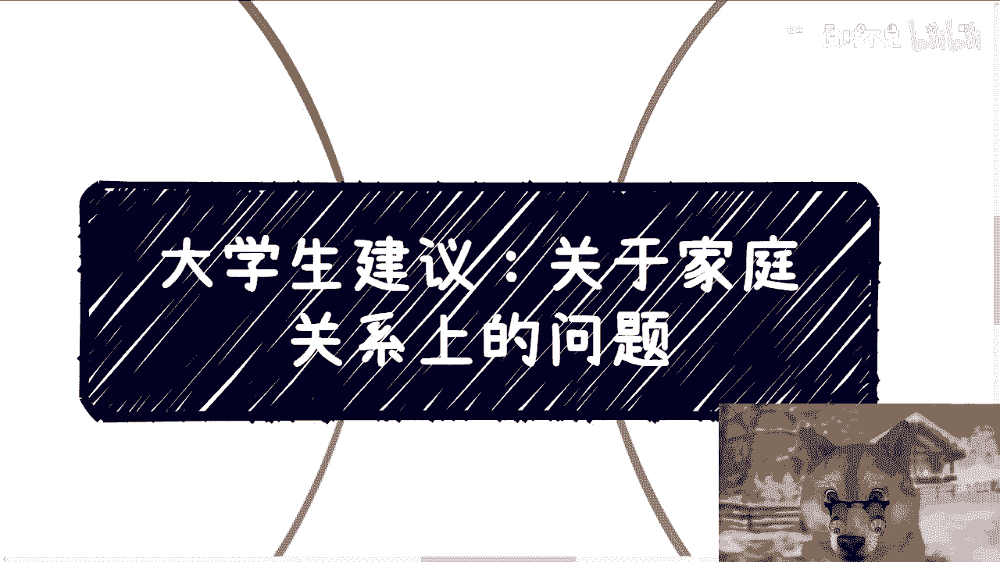
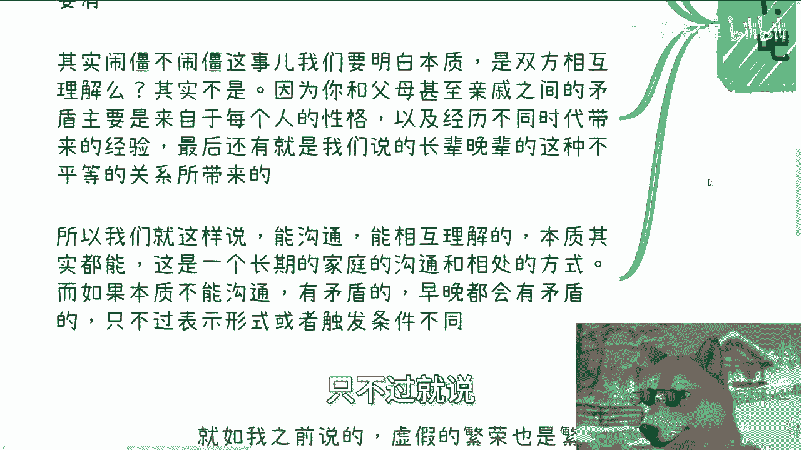
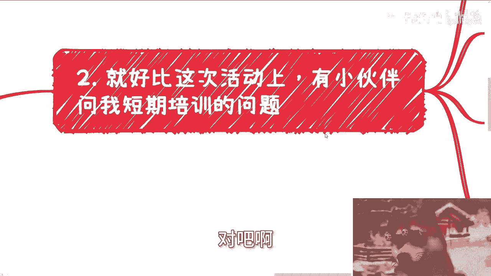
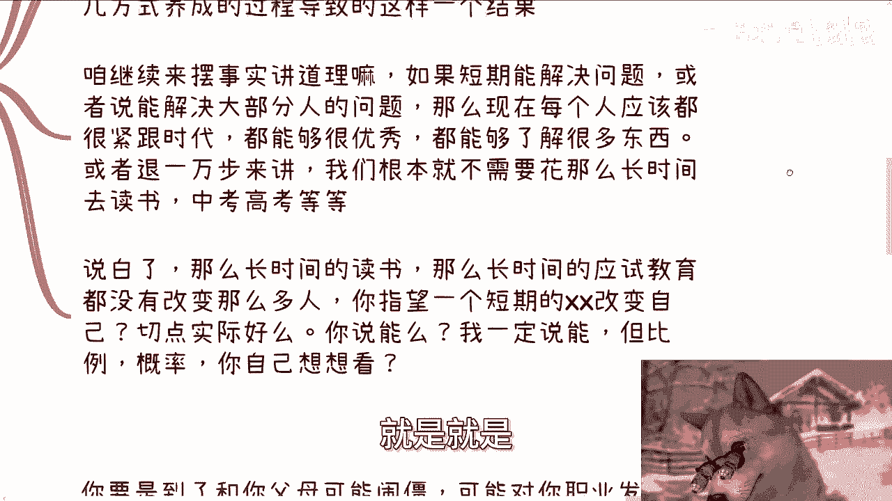
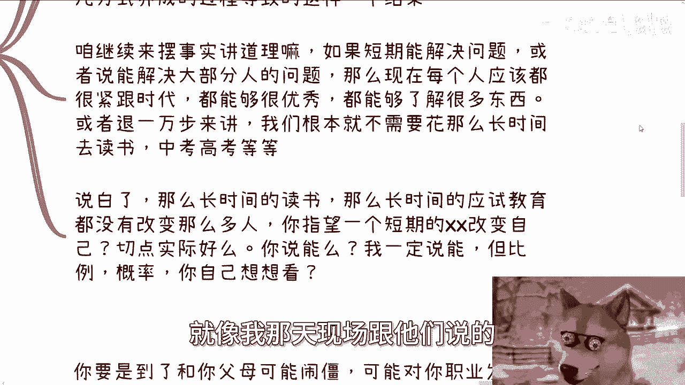
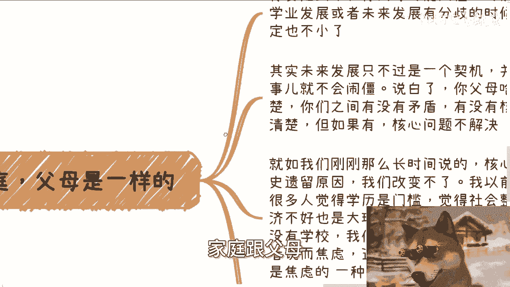
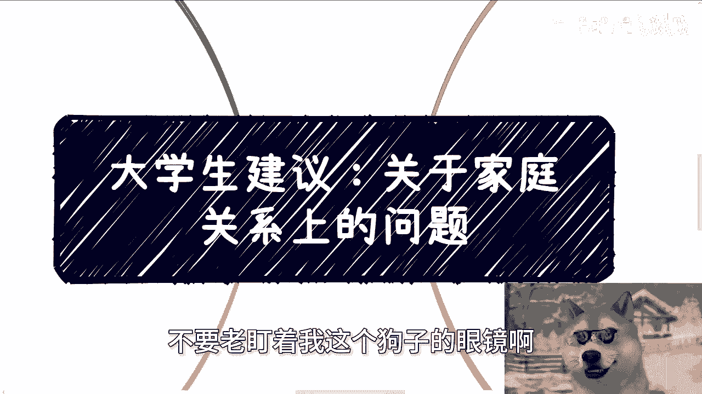

# 大学生建议-我很怕和父母-家庭闹僵---P1---赏味不足---BV1iZxueLEbv



在本节课中，我们将探讨一个许多大学生和年轻人面临的常见困扰：如何处理与父母及家庭的关系，特别是害怕因意见分歧而导致关系“闹僵”的心理。我们将分析这种担忧的本质，并提供一些实用的思考角度。

上一节我们介绍了“父母的傀儡”这一话题，本节中我们来看看与之紧密相关的“害怕闹僵”心理。

## 核心问题：什么是“闹僵”？🤔

许多在外读书或工作的年轻人，会与身处老家的父母产生意见分歧。他们常表达一种担忧：“我不想跟家里闹僵，甚至断绝关系。”

每次听到这种观点，我都很茫然。这引发了几个疑问：

以下是针对“害怕闹僵”这一心理的几个核心疑问：

1.  **闹僵与否的实际影响是什么？**
    *   它是否能帮助你赚钱，或是阻碍你赚钱？古语云“将在外，军令有所不受”。闹僵或不闹僵，对你实现个人目标的实际影响究竟是什么？

2.  **为何不能维持“虚伪的和平”？**
    *   除了生老病死，其他感受多由个人情绪造成。你可以选择不闹僵，在不破坏表面和平的情况下，坚持做自己的事情。

3.  **“闹僵”的具体定义是什么？**
    *   是指冷战，还是其他更激烈的形式？这个标准往往很模糊。



4.  **家庭矛盾多是历史遗留问题。**
    *   许多家庭问题有深层的历史原因。如果存在核心矛盾，即使没有当前这件事，未来也会因别的事情爆发。本次矛盾只是一个“触发点”，而非根本原因。




## 矛盾的本质：理解与沟通的误区 🔄

我们常认为，矛盾的**本质是双方缺乏相互理解**。但更准确地说，矛盾主要源于每个人的**性格**、**不同时代背景下的经验差异**，以及**长辈与晚辈间不平等的关系**。

“相互理解”更像是一个**结果**，而非**原因**。关键在于家庭长期形成的沟通与相处模式：



*   **公式：** **长期沟通模式 → 相互理解（结果）**
*   如果你从小到大都能与家人良好沟通，那通常可以继续。
*   如果本质上是不能沟通、有矛盾的，那么矛盾迟早会出现，只是表现形式和触发条件不同。以前年纪小，矛盾可能不明显而已。

## 类比：短期培训与长期习惯 📈



这一点可以用“短期培训”的例子来类比。

有小伙伴询问短期培训的价值。我的观点是：**短期培训大多像催化剂**。


以下是催化剂的特性：




*   它能让好的事情变得更好。
*   它也能让坏的事情变得更坏。
*   但它**无法**把坏的东西变好，也无法把好的东西变坏。

**代码描述其作用：**
```python
# 假设 initial_state 是个人或事情的初始状态（好/坏），catalyst 是短期培训
def catalyst_effect(initial_state, catalyst):
    if initial_state == "good":
        return "better"  # 好变得更好
    elif initial_state == "bad":
        return "worse"   # 坏变得更坏
    # 不存在从 bad 到 good，或从 good 到 bad 的转变
```

演讲、赚钱、做事方式等看似是“结果”，实则是**长期习惯和做事方式**养成的过程所导致的。如果短期能解决根本问题，那么我们就不需要花十多年时间通过中考、高考来读书和改变自己了。

## 应用于家庭关系：核心矛盾与契机 🧩

家庭关系与我刚说的例子是同一个道理。

当你到了可能与父母因职业、学业产生分歧的年龄，父母年纪也不小了。这次分歧只是一个“契机”。

以下是关于家庭核心矛盾的逻辑：


*   你父母是什么样子，你最清楚。
*   你们之间是否存在核心矛盾，你也最清楚。
*   **如果存在核心矛盾且不解决，早晚会爆发，只是形式不同。**
*   核心矛盾往往是历史原因造成的，难以改变。


这就像很多人觉得学历、房价是社会问题的根源。但即使没有这些，人类社会也会因为别的事情而产生烦恼和焦虑。**当下的问题只是焦虑的一种表现形式。**

因此，从本质来讲，只要父母不强行干涉和控制，已经值得庆幸。客观地说，期望与父母“相互理解”可能是不切实际的，因为这要求对方极度宽容、紧跟时代、善于换位思考——这对任何人来说都要求极高。

## 实用建议：如何应对与相处 💡

所以，其实不必过于纠结。

虚假的繁荣也是繁荣。你的人生终究要自己负责。

以下是具体的行动建议：

*   **策略性“顺从”：** 你可以表面顺着父母的意思（例如20%），但实际80%按照自己的计划进行。不必事事较真。
*   **理解出发点：** 父母的出发点通常是好的（如考公、回老家、催婚），是希望子女平安健康。但需要明白：**“为你好”不能成为为所欲为的理由**。就像不能因为道过歉，就认为能抹平所有伤害一样。
*   **避免错误归因：** 不能因为他们无法改变或沟通，就得出“他们想控制我们”或“他们不爱我们”的结论。揣测他人想法往往是徒劳的，且不影响你自身的发展和赚钱。
*   **建立人际沟通逻辑：** 将父母视为普通人，采用通用的人际沟通逻辑：
    *   **公式：** **沟通价值 = 开心 或 有价值**
    *   有价值/让你开心就沟通。
    *   没有价值/让你不开心就不沟通。
    *   实在避不开的场合，适当敷衍即可。
*   **放弃改变他人：** 最徒劳的事情就是试图改变别人。我的逻辑是“随缘”：我只阐述观点，你觉得有道理可以参考，觉得没道理可以忽略。良性的讨论是说出建议，而非为了改变对方。


## 总结与后续 🎯

本节课中我们一起学习了如何理性看待“害怕与父母闹僵”的心理。

1.  **认清本质：** “闹僵”恐惧常夸大其实际影响，家庭矛盾多源于长期形成的模式和历史原因。
2.  **放弃幻想：** 完全“相互理解”可能不切实际，避免强行沟通或改变父母。
3.  **务实策略：** 采用策略性“顺从”，理解父母出发点但坚持自我规划，以“价值/开心”为导向决定沟通频率与深度。
4.  **关注自身：** 核心是专注于自己的发展与成长，减少在无法解决的家庭矛盾上内耗。

关于家庭关系的讨论就此收尾。如果你还有其他问题，可以留言或私信。

后续内容将更多聚焦于**职业规划**与**商业规划**（如主业、副业、赚钱、商业业务、股权合同等）。如有相关问题，请整理好个人背景与具体问题，再进行咨询。

---



**本节课中我们一起学习了如何以更理性、务实的态度处理家庭关系中的分歧，核心在于分清哪些是可控的自我成长，哪些是难以改变的外部因素，从而减少内耗，聚焦于个人发展。**