# 大学生建议-放弃一切幻想-才能更接近你的目标---P1---赏味不足---BV1Em2NYuEqU_

在本节课中，我们将探讨一个核心观点：为了实现目标，必须放弃不切实际的幻想。我们将通过一个具体的咨询案例，分析常见的思维误区，并学习如何以结果为导向，脚踏实地地行动。

## 活动预告 📅

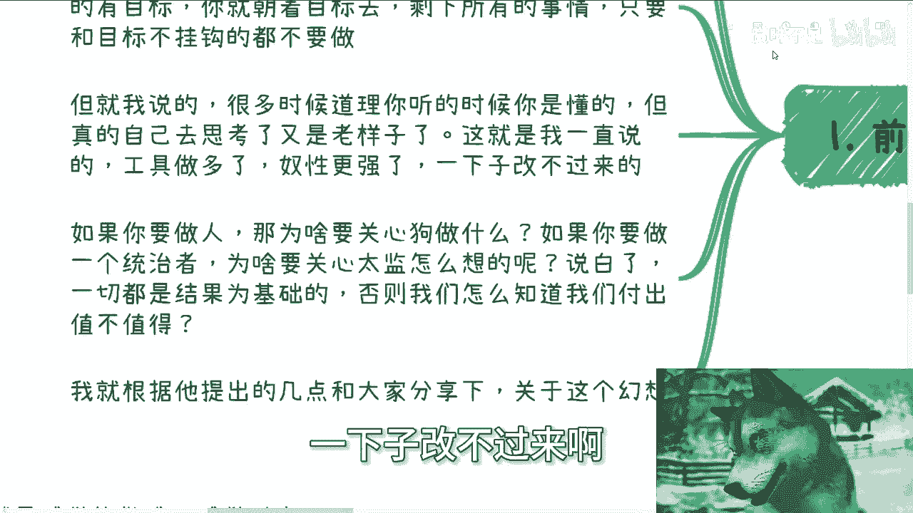

本次活动已确定于本月19日（下周六）在广州举行。活动包含三个主要主题。

以下是活动的主要内容：

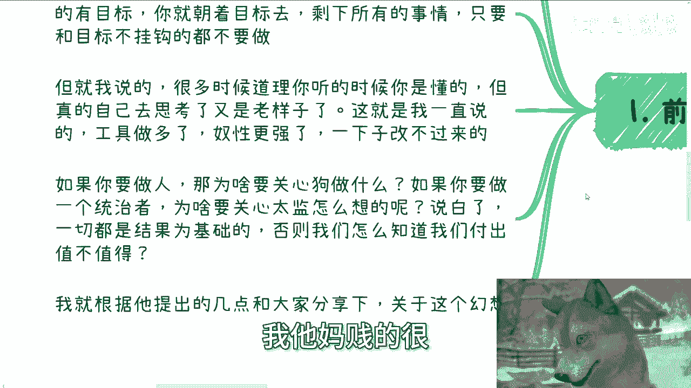

1.  分析不同企业类型（如大厂、创业公司、国央企）的offer选择策略。
2.  同步近期在投资、避险等大方向上的最新行业信息。
3.  展示并解析2021年与政府及高校合作的部分PPT与Word文档。

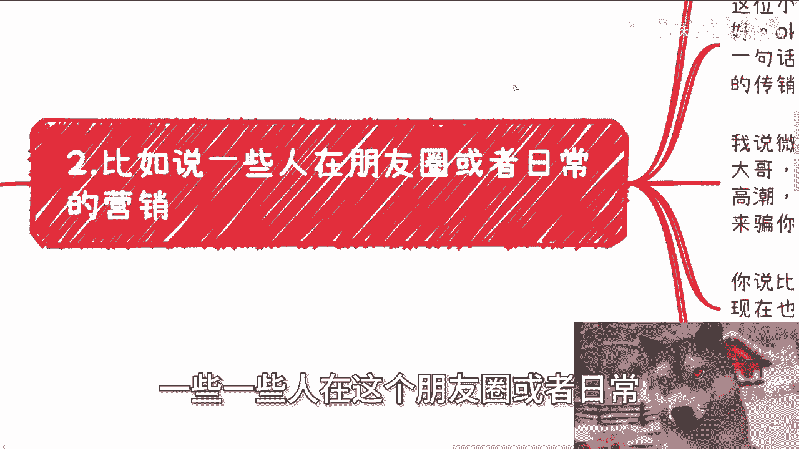

如需报名或了解详情，请私信联系。

## 案例背景与核心问题 💡

本节内容源于一次具有普遍性的咨询。在沟通中，最常强调的一句话是：**放弃幻想**。

如果你有明确的目标，就应直接朝着目标前进。所有与目标无关的事情都不值得投入精力。道理虽然简单，但许多人自己思考时，又会回到旧有模式。这就是长期依赖工具导致自主性减弱，一时难以改变。

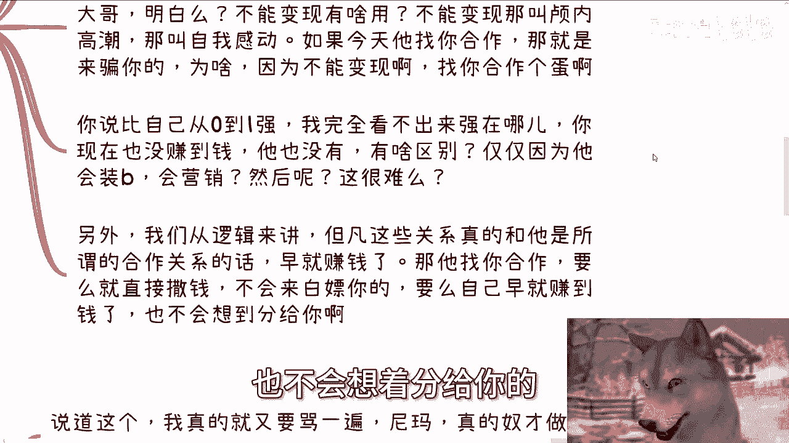

## 核心原则：以结果为导向 ⚖️

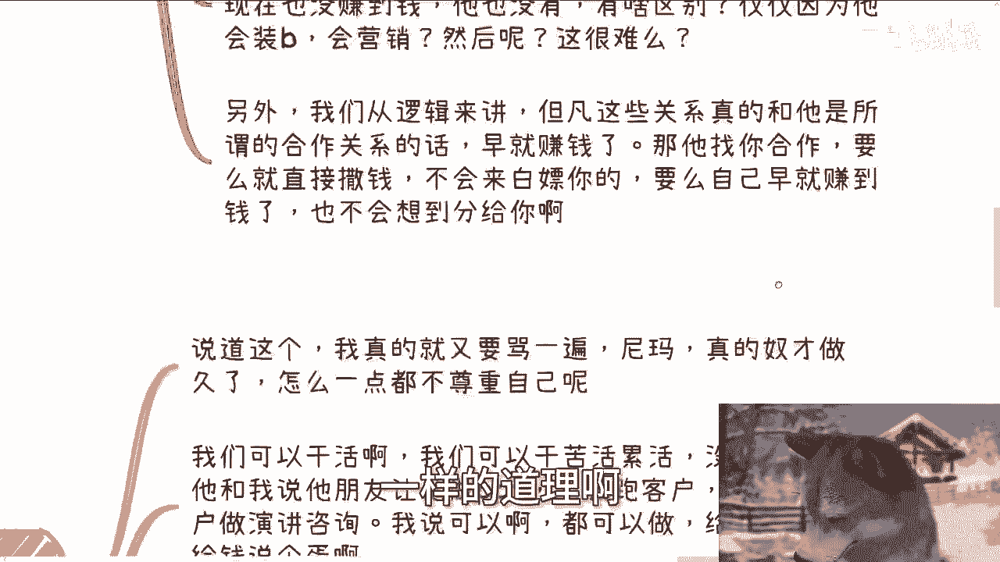

我们需要把话说得直白一些。如果你想成为领导者（这里指主导自己的人生），为什么要去关心“太监”（指无关紧要的人或事）的想法呢？

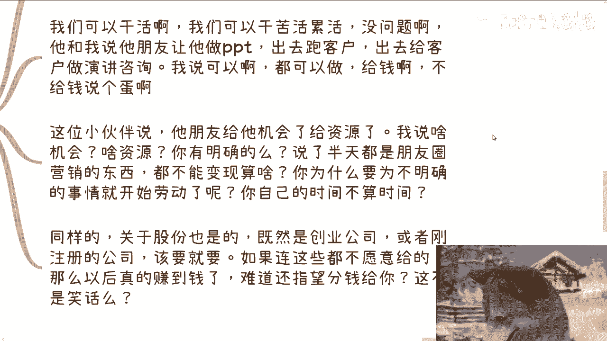

一切应以**结果**为基础。否则，我们无法判断付出是否值得。判断是否做一件事，首先要看能获得什么。如果最终得不到任何名利回报，那凭什么要去做呢？

## 案例分析：识破无效社交与“自我感动” 🕵️♂️

以下是针对一位小伙伴提到的具体困惑的分析。他的朋友经常在朋友圈展示与领导吃饭、企业参观、项目合作等动态。这位小伙伴认为，跟着这位朋友做事，总比自己从零开始要好。

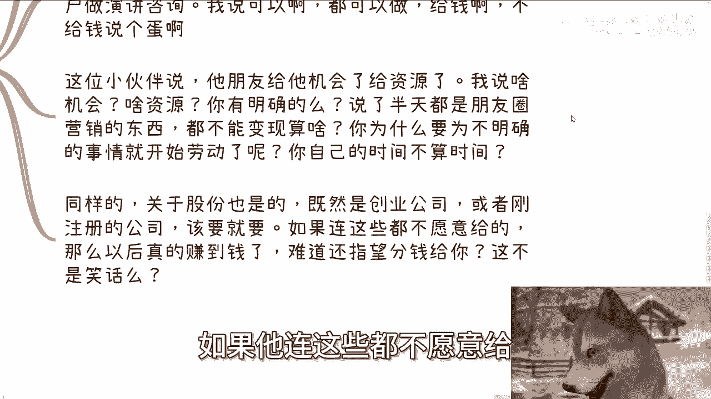

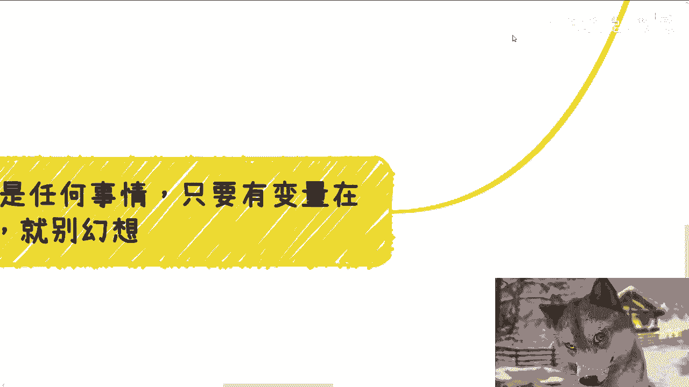

我们对此进行逐步剖析：

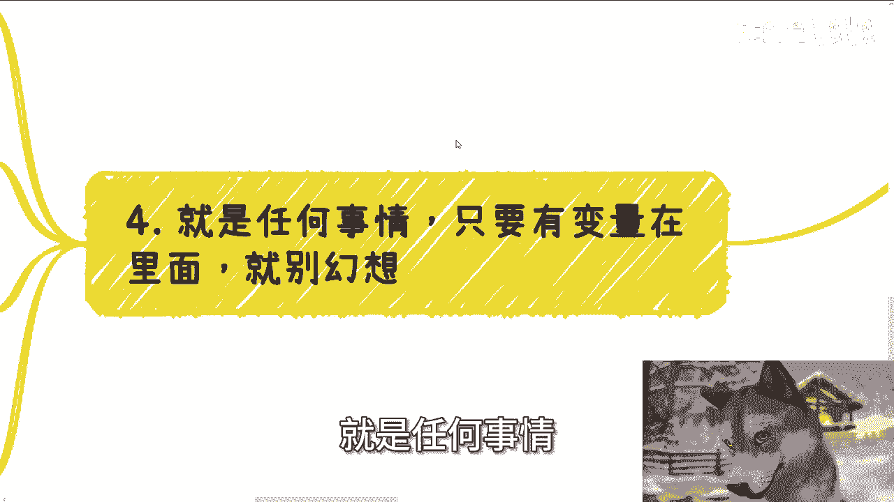

**第一点：警惕“颅内高潮”与“自我感动”**
所有传销、微商和诈骗初期都呈现类似状态。微信加再多好友，朋友圈营销做得再热闹，若不能**变现**，就毫无意义。这就像“狐假虎威”，前提是必须能兑现价值。不能变现的关系，只是自我感动。如果对方找你合作却绝口不谈钱，这本身就非常可疑。

**第二点：逻辑推演合作真实性**
如果那些所谓的关系和合作真能带来利益，对方早就赚到钱了。他若找你合作，要么直接支付报酬，要么自己早已盈利，但通常不会想着分给你。请换位思考，赚到钱的人会轻易分给别人吗？

**第三点：明确劳动的价值**
我们可以干活，可以做苦活累活，但前提是**给钱**。对方若以“给机会”、“给资源”等空话让你付出劳动，却不明确这些机会和资源值多少钱，那就是在浪费你的时间。你的时间就是金钱。同样，在创业或合作中，该争取的股份、分红等权益就要明确争取。如果对方连空头承诺都不愿给，未来真赚钱了更不可能分给你。

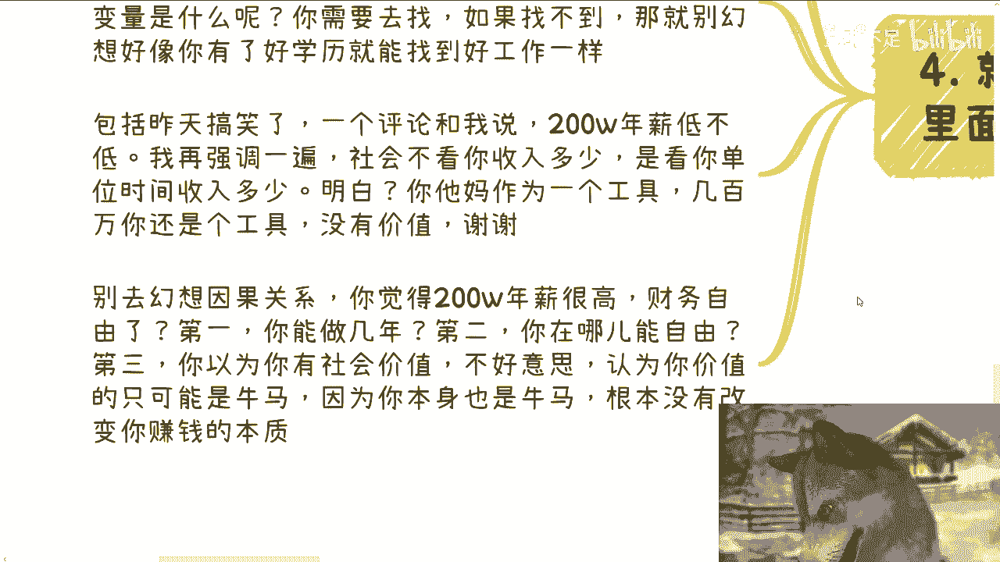

**第四点：警惕变量，放弃幻想**
许多人抱有“感觉能成”、“对方很牛”、“可能学到东西”等模糊的幻想。每当被问及具体能学到什么、积累什么、能否赚钱时，却答不上来。如果连自己都不知道，为何要盲目投入？同理，认为好学历一定能找到好工作，这其中也存在变量（如个人能力、机遇、行业需求），需要主动探索和链接，而非幻想因果关系。

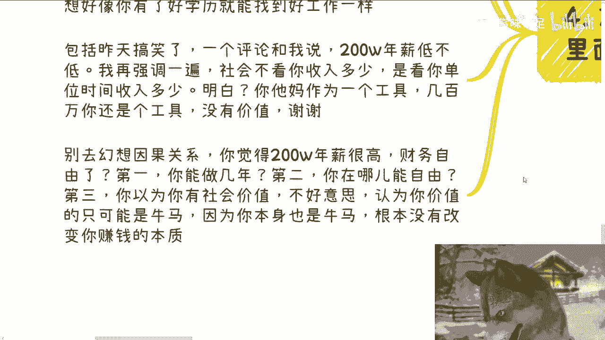

关于高薪的迷思：社会评价不看收入绝对值，而看**单位时间的收入价值**。通过996、007透支健康换取一两百万年薪，并不代表高社会价值，这只是用劳动力换钱的模式，本质并未改变。

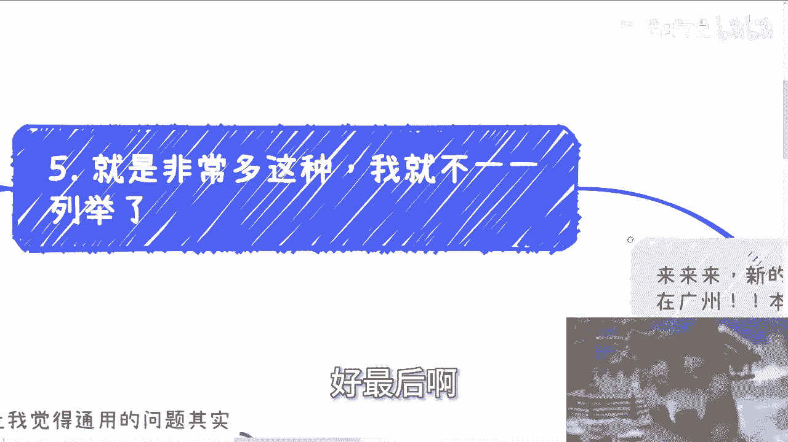

## 总结与行动指南 🚀

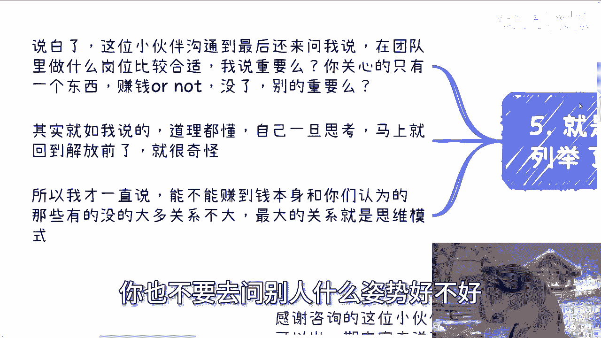

本节课中我们一起学习了“放弃幻想，聚焦目标”的核心思维。

最后，针对案例中的小伙伴询问“在团队中做什么岗位合适”的问题，答案很简单：**只关心一件事——这个岗位是否能帮你赚钱（或实现你的核心目标）**。如果不以赚钱（或目标达成）为衡量标准，而去纠结哪个“跪舔”姿势更优雅，毫无意义。

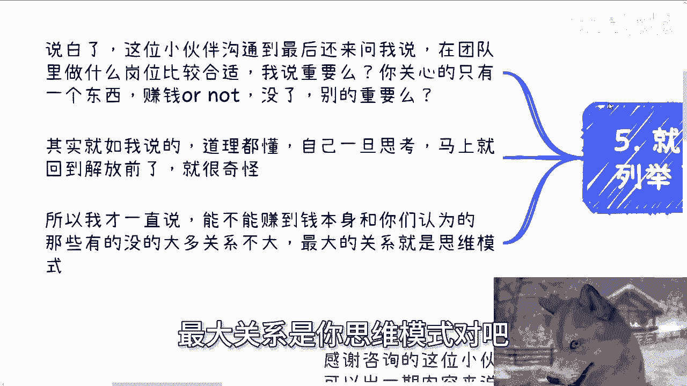

如果都是打工人、工具人，就不要再内部分三六九等，这没有意义。能否赚到钱，与学历、技术等关系不大，最大关联在于你的**思维模式**。

我始终把每个人当作独立的“人”来尊重，但最离奇的是，许多人自己却不把自己当“人”看，总在纠结如何更好地扮演“工具”角色。

所以，请记住：如果没有目标，可以随心所欲。但如果有目标，就必须放弃所有幻想，脚踏实地地朝着目标行动。要么就坚定地执行，要么就不要内耗。不要既无法实现幻想，最后又抱怨别人坑你。很多时候，一个巴掌拍不响，需要反思自己内心是否存在不切实际的贪念。

## 后续支持 🤝

除本次课程内容外，如果你在职业规划（工作发展）或商业规划（副业、赚钱、业务拓展、融资、股权合作等）方面有个性化问题，需要结合你个人情况及当前国内外发展形势获得更接地气的建议，可以整理好你的个人背景与具体问题，再行咨询。