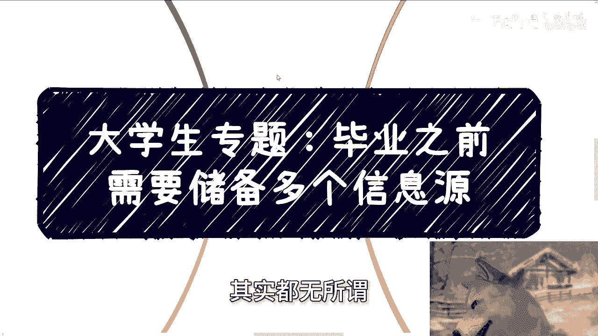
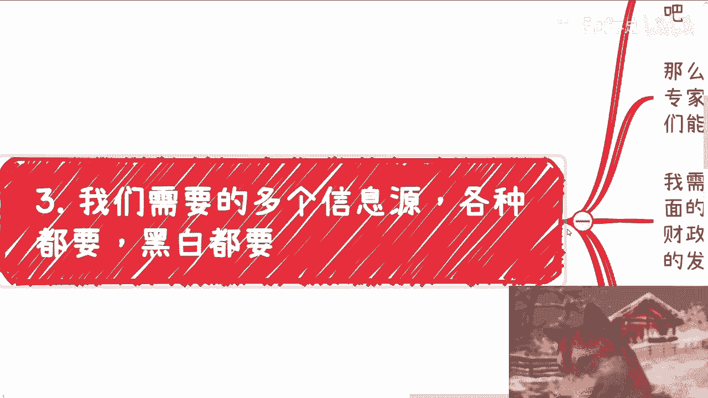
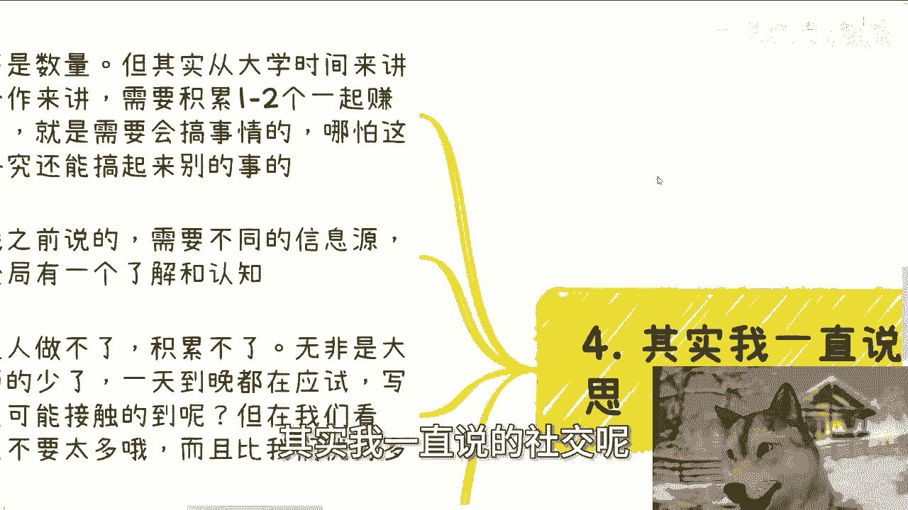

# 大学生建议：毕业之前要储备多个靠谱的信息源 - P1 - 赏味不足 - BV1BEsDeFEU2

好大家好啊，今天这个充电视频啊。

我们就还是来讲这个大学生专题啊，就是呃今天呢主要是来讲的呢是毕业之前啊，就在我看来啊，就2024年这种基金经济情况啊，呃毕业之前需要储备多个信息源，咳咳本来啊这个事啊，你要放在以前呢。

我就不会放到毕业前，比如说你工作个两三年啊，35年啊，其实都无所谓，但现在因为太卷了。

你不放吧不太合适，呃，然后呢第一个啊，就我们先我们先不说信息源这个事啊，最先要的呢是几个经常一起讨论的小伙伴。

因为很多你们呢其实都是一个人做事情，就没有人商量，我跟你们讲啊，小伙伴很重要，呃其实很多问题并不深奥，或者很多坑呢，你不用你们也不用去踩，而且我也说直白一点，很多坑你们也没必要来问我。

那为什么你们想想看，为什么会踩，主要是因为当局者迷，而且自己很容易看不透，同时呢就大家也也也容易这个冲动上头对吧，那有的人要说了，他说啊，但我认识的也是学生啊，也都是牛马啊，也没有太多经验。

其实我跟你讲无所谓的，三个臭皮匠顶一个诸葛亮，什么意思啊，就是很多事情啊，你多找几个人出来喝喝咖啡，讨论讨论，其实你马上就明白了啊，至少就是说他会阻止你，你阻止你去这个冲动消费。

那就比如今天你有个什么项目，或者突然认识了一个人啊，你自己感觉比如说很靠谱啊，或者感觉比如说热热血沸腾对吧，你找几个朋友聊一聊，首先啊并不见得这些朋友他就能一针见血的，我写错了，这边就一针见血的。

能够看到这里面的问题不一定难，但是大家呢其实都会多抛出来自己的一些疑问，对不对，而当你无法直接得到他们，就是从别人这边提出来的疑问的，这个答案的时候，那其实说明你了解的并并不深入对吧，那么你并不深入。

那么你就不要这么上头，对不对，那么记住一点啊，我们大家都知道信息差啊，但是信息差到底是什么，本质就是信息的快慢及准确性，这个和聪不聪明没有关系的，就很多人会说嘛，他说哎呀我去考个好的学校对吧。

或者怎么样子，我我主要是呃那个接触到更更聪明的人啊，或者更优秀的人，我就这么说啊，你要接触优秀的人，聪明的人其本质是没有意义的，对不对，为什么，因为聪明的人跟优秀的人，这是他本身的一种天赋。

或者是他一种呃理解力可能更更高一点，但是就算是一个绝顶聪明的人，如果他得到的信息是封闭的，那么他也只会从这些错误的信息当中，得出一个错误的结论，你告诉我怎么可能会出现一个很聪明的人。

或者来说呃一个一个很优秀的人，咳咳在信息封闭的情况下面，他会从错误的信息得出正确的结论，这他妈不可能的嘛，对不对，所以说本质上你要接触的是什么，你要接触的是那些准确的，或者来说既聪明啊又优秀的。

同时又拥有一线信息源的这些人，而不是单纯你说聪明或优秀，没有用的好，这是第一个啊。

这个是二，我写错了啊，不用在意啊，第二啊。

我们需要是多个信息源，各种都要黑白都要啊，我想了半天啊，就是怎么给你们更好的去描述啊，我觉得我还是拿我自己来举例子啊，我现在手上核心的业务有什么，有数字经济，有数字资产，数据要素对吧。

课程啊，培训啊，软件服务对吧，包括就软件服务，你可以认为认为认为是软件外包嘛，主要针对高校政府企业对吧，这些啊，那么我日常储备有什么呢，第一若干个跟我一样的啊，那种可以在各地区或者各个组织之间。

称之为专家的个体，他们会游走于不同的城市跟机构之间，那么他们能给我带来什么，能给我带来更多，我看不到别的城市的或者别的城市的一些啊，产业园啊，协会啊，相关的信息，为什么。

因为我不可能一天的往往别的城市跑，而且就算跑了，我也不见得能了解他们了解的东西，对不对，那么在我跟他们相对来讲比较类似的，这个职能的情况下面，那么他们能给我我最需要的一些信息，你明白吗。

也就是说如果你就算认识这些人，如果他们能跟你的职能不是特别相匹配的话，其实这些信息对你来讲也没有什么用，就是我们要记住一点啊，我们去了解信息不是大而全的，大而全对我们没有用。

我们还是要去了解一些跟我们自身的积累，或者跟自身想要去做的这个方向有关的信息，那才是最佳的对吧，那么同样的我需要那些软件外包团队，然后我曾经合作的政府里面那些领导啊，基层公务员啊。

他们也能时不时的告诉我，现在一些各地方的财政情况，以及我所在这个领域的一些偏向性，和最新的一些发展对吧，那就好像比如说就好像比如说某某某城市对吧，他们呃基层公务员跟领导就跟我说，哎陈老师。

你去年这个主题对吧，今年政府不关心了啊，或者是说呃可能有这个重点有所下降，那么今年呢重点可能在什么地方，那么有就这些信息，就能帮助我更好的去调整我的方向，对不对，好，然后呢我需要各种做灰色产业的人。

尤其是海内外纯金融业务或者web3业务的，为什么，因为这样我能很清楚的知道，web3跟灰色产业链现在发展怎么样，因为这些产业的发展好坏及目前的趋势，它很大程度会决定明面上产业的发展，现在是什么阶段。

现在基本上中国和国际上，各个国家处于政治冷战状态，那么政治冷战状态很多时候大家还是要金金融，就还是要流通嘛对吧，还是要交易嘛，那么很多水上的交易都会移到水下，咳咳那么这个时候热点都是互通的对吧。

就是你水下的这个交易一旦多了之后，那么水下的很多的行为，就会影响到水上的这个趋势发展啊，当然最重要的还是那些投资者跟这个，投资机构啊，我基本上一每一年呢拜访啊，拜访两次这种机构跟人。

那一方面投资的信息呢肯定是领先于我的对吧，这毫无疑问嘛，啊同时呢投资本身里面的这个机会呢也会更多，那只不过呢就是说需要靠谱的信息源对吧，那么目前国内基本上很多的这种投资，也都集中在香港这边啊。

那么这个我就是抛给你们，以我的这个叫什么定位给你们啊，那么你们反正举一反三，自己可以想想看。

那么第三获取信息跟验证信息啊，我们就这么说啊，所谓真正的获取信息和真正的验证信息，那是两码事，你比如说今天你从某个人这边或者网络上，突然看到一个新的信息，然后你把这些信息跟我刚刚说的那些。

比如说高校老师啊，政府官员啊对吧，或者说跟所在的业务的所在领域有关的这些人，你都去沟通一下对吧，但是对你而言，你提你是第一次这样哈，那么你会去找你的这些关系链去求证对吧，去从他们这边了解到这些信息。

目前的一些情况，那当然这个事情到底最终是真是假，以及这个事情目前的这个发展速度，以及原本的这个逻辑啊，那么你都能够从你的，我们刚刚说的这些多信息源的，这些关系链里面去求求证掉。

但是无论你求证下来是真是假，或者来说目前发展速度多快多多慢，大概率跟你已经没有关系了，为什么，因为你信息获取的渠道就已经决定了，你获取这个信息的速度已经远远落后于别人，对不对。

那么真正获就刚刚我们说的是验证嘛对吧，那么真正获取所谓信息的这个模式是什么，是从你这边的多方的信息源私下获取到的，比如说你在跟他们日常的，比如说一两个月对吧，三四个月沟通的这种吃饭啊，咖啡啊，喝酒啊。

这种过程当中得到了一些信息，那么这些信息可能是某个趋势，比如说乡村振兴，比如说啊某个具体项目，比如说下个月政府要拨款做某个竞赛对吧，那么这些信息其实都是很有效的，而且这些信息就算啊就算是落后的。

那但是呢从这些人给到你的这个过程，从他们口中跟你面对面时候，给到你这个信息，也就意味着什么，意味着他们那边一定是有这种合作的可能性，否则他去也没必要去说了，对不对，因为这种人这些人说出来的话。

他一定是有他的用意的。

他不会去说一个完全没有关系的事情，对不对，无非就是说这个成功率是多少的问题啊。

那么第四其实我一直说的社交难也是这个意思。

就是我们要的是什么，是质量，不是数量啊，但其实从大学时间来讲，我觉得肯定是足够的，哪怕你本科4年也远远足够了，对不对，你从合作角度来讲，你只需要积累一到两个能够一起赚钱，赚过钱的。

那说白了就是能够会搞事情的，哪怕你们现在搞的这个业务搞不成，但是终究你还能通过这些人搞别的事情，对不对，所以我一直跟你们讲，人是很重要的，搞什么并不重要啊，然后关系链嘛就如我之前说的，需要不同的信息源。

让你能够更好的对全局有个了解和认知，咳咳然后另外一方面呢就是听到这啊，还是那句话，不要老觉得普通人做不了，积累不了，因为你们觉得做不了，积累不了，无非就是因为你们参与的少了，做的少了，甚至没做过对吧。

一天到晚都在应试教育，一天到晚都在写论文，做学术，怎么可能接触得到呢，但是你从我们的视角来讲，社会上这种学生或者这种类似的人，这种类似老百姓不要太多，而且这种人都比我们优秀，比我们聪明对吧啊。

那么信息源可以说是所有基础中的基础，当然啊你说毕业后去积累行不行，当然也行，但是你毕业后效率啊，各方面啊，肯定没有在你这个在高校时候来的效率那么高，咳咳咳，而且你要这么想，每个人呢每个时间每个阶段都有。

每个时间每个阶段的这个烦恼，你现在觉得啊这个后面去做对吧，后面去积累或者怎么样子，但等到你真的说那个你工作了对吧，后面的那个时间点的时候，你未来还有烦恼的事情。

那么这个时候最终就可能变成了一个，无限往后拖的这么一个事情对吧。

那你还不如早做早好，而且人的这个怎么说呢，这个关系链啊，人的这个关系链啊，就是都是需要时间，都是需要去试错的对吧，他不是说啊，就是一下子你说啊我们就能够很好的啊，这个识别出来这个人好，或者这个人不好。

或者这个这个人做业务靠谱，这个人做业务不靠谱对吧，没有人知道的啊。

嗯行呀好吧，那么今天这一点啊，这一点我觉得就说这些吧，然后剩下的话就说是打工对吧，就直接规划呃，呃副业啊，你们跟别人做一些什么项目啊，或者做些别的相关的呃，股权啊，分红啊，丰润啊，商业计划书啊。

或者一些业务的一些呃叫什么，就是相关的问题啊，你们如果觉得有必要啊，可以让你们少走点弯路的话，那么你们可以整理好对应的问题和个人背景，好吧。

