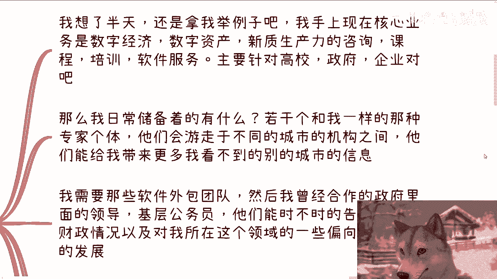
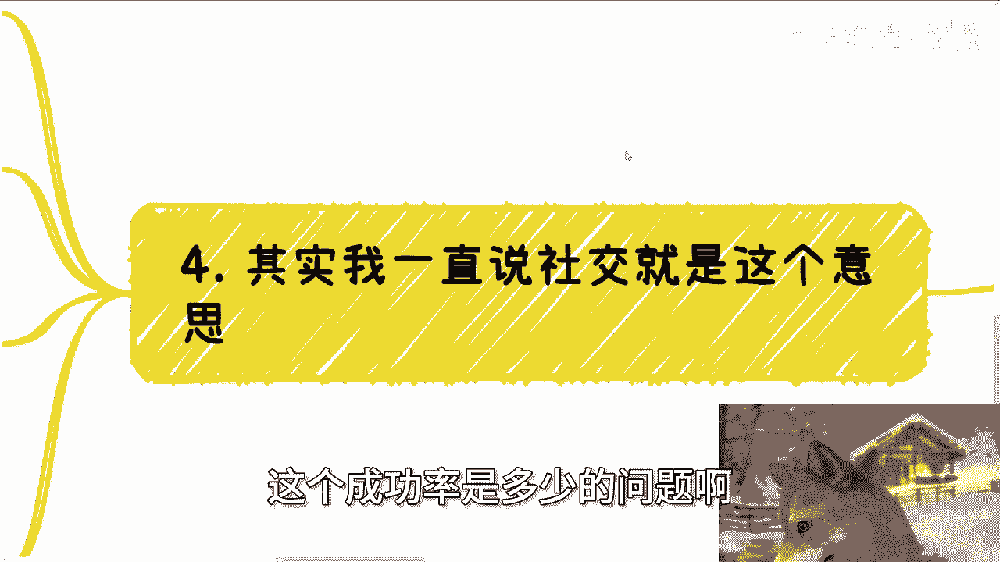
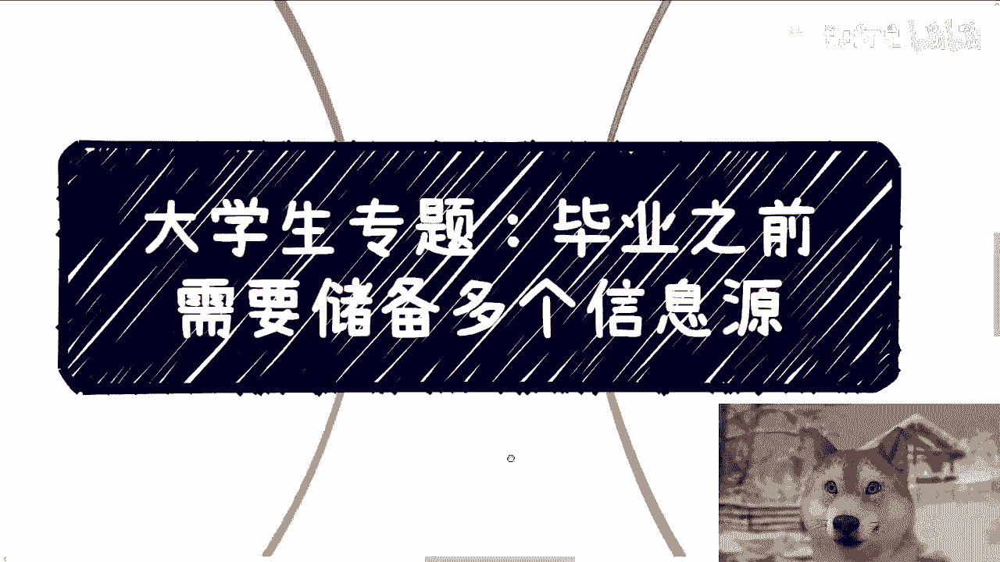
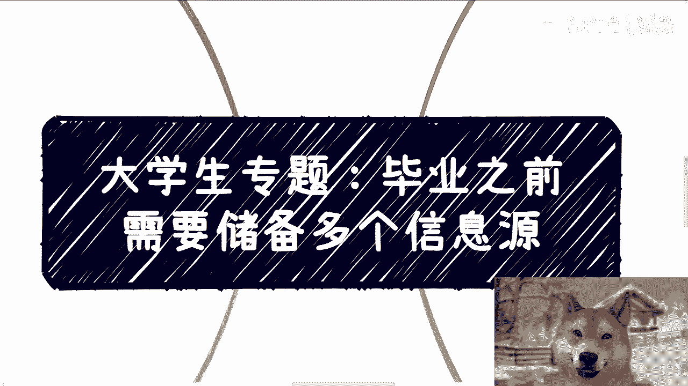

# 大学生专题课程 P1：毕业前建立多元信息源 📚

在本节课中，我们将探讨在毕业前建立多个可靠信息源的重要性。在2024年的经济环境下，这已成为一项必要的准备。我们将分步骤解析如何构建有效的信息网络，帮助你做出更明智的决策，避免因信息闭塞而踩坑。

## 第一节：寻找讨论伙伴 👥

上一节我们介绍了课程主题，本节中我们来看看建立信息网络的第一步：寻找可以经常一起讨论的伙伴。

很多学生习惯于独自做事，缺乏商量对象。拥有可以讨论的伙伴至关重要。许多问题并不深奥，许多坑也不必亲自去踩。当局者迷，个人容易看不透问题或冲动行事。

有人可能会说，自己认识的同学也缺乏社会经验。这其实不重要。三个臭皮匠顶个诸葛亮。很多事情，找几个人出来喝咖啡讨论一下，很快就能理清思路。至少，这能阻止你冲动消费。

例如，今天你遇到一个项目或认识一个人，自己感觉非常靠谱或热血沸腾。你找几个朋友聊一聊。这些朋友不一定能一针见血地指出问题，但他们会提出各自的疑问。当你无法直接回答他们提出的疑问时，说明你对此事的了解并不深入。既然了解不深入，就不应该过于上头。

## 第二节：理解信息差的本质 🔍

上一节我们讨论了伙伴的重要性，本节中我们来看看信息差的本质。

我们需要理解信息差。信息差的本质是**信息的快慢及准确性**。这与是否聪明无关。

很多人认为，考个好学校是为了接触更聪明、更优秀的人。但接触聪明或优秀的人本身意义不大。为什么？因为聪明和优秀是个人天赋或理解力。即使是一个绝顶聪明的人，如果他获得的信息是封闭的，他也只会从错误的信息中得出错误的结论。一个在信息封闭环境下的人，不可能从错误信息得出正确结论。

因此，本质上你需要接触的是那些**既聪明优秀，同时又拥有一线准确信息源**的人，而非单纯聪明或优秀的人。

## 第三节：建立多元信息源 🌐

上一节我们剖析了信息差，本节中我们来看看如何建立多元化的信息源。

我们需要多个信息源，各种类型都要，无论是“白”是“黑”。为了更好地描述，我以自己为例。

我目前的核心业务包括：数字经济、数字资产、数据要素、课程培训、软件服务（主要针对高校、政府、企业）。

我日常储备的信息源如下：

以下是不同类型的信息源及其作用：

1.  **同行专家**：若干个与我职能类似、在各地区或组织间被称为专家的个体。他们游走于不同城市和机构，能提供我看不到的其他城市、产业园、协会的相关信息。因为我不可能天天往别的城市跑，即使跑了也不见得能了解他们知道的东西。在职能相似的前提下，他们能提供我最需要的信息。
2.  **合作方与政府人员**：软件外包团队，以及曾合作过的政府领导、基层公务员。他们能告诉我各地方的财政情况、所在领域的最新政策偏向和发展动态。例如，某城市的公务员可能告诉我：“陈老师，你去年做的主题，今年政府不关心了，重点可能转向了某某领域。”这些信息能帮助我调整方向。
3.  **灰色产业从业者**：尤其是从事海内外纯金融业务或Web3业务的人。这能让我清楚了解Web3和灰色产业链的发展状况。因为这些产业的发展好坏及趋势，很大程度上决定了明面产业处于什么阶段。当前国际处于政治冷战状态，金融仍需流通，许多水上交易会移到水下。水下的交易行为会影响水上的趋势发展。
4.  **投资者与投资机构**：我每年拜访两次投资机构和投资人。一方面，投资信息肯定领先于我；另一方面，投资本身蕴含更多机会，但需要靠谱的信息源。目前国内很多投资集中在香港。

我以自己的定位为例，你们可以举一反三，思考适合自己的信息源。

## 第四节：获取与验证信息 ✅

上一节我们列举了多元信息源，本节中我们来看看如何获取与验证信息。

获取信息和验证信息是两码事。

例如，今天你从某个人或网络上看到一个新信息。然后你拿着这个信息，去找我们之前提到的高校老师、政府官员或相关领域的人沟通求证。对你而言，这是第一次这样做。你会通过你的关系链去了解这些信息的目前情况。无论最终求证结果是真是假，以及该事发展速度、逻辑如何，你都能从多元信息源的关系链中得到验证。

但是，无论验证结果如何，这件事大概率已经与你无关了。为什么？因为你获取信息的渠道决定了，你获取该信息的速度已远远落后于他人。

以上说的是“验证”。那么真正“获取”信息的模式是什么？

是从你的多方信息源私下获取的。例如，在与他们日常一两个月、三四个月的吃饭、喝咖啡、喝酒沟通中，得到的一些信息。这些信息可能是某个趋势（如乡村振兴）、某个具体项目，或下个月政府要拨款举办的某个竞赛。

这些信息非常有效。即使这些信息本身是“落后”的，但从他们口中面对面告诉你的那一刻起，就意味着他们那边存在合作的可能性，否则他们没必要说。这种人说出的话，一定有其用意。他不会说一件完全无关的事，无非是成功率高低的问题。

## 第五节：注重社交质量与尽早开始 ⏳

上一节我们区分了获取与验证，本节中我们来看看社交的核心与行动的时机。

我一直说社交难，也是这个意思。我们要的是**质量，不是数量**。

从大学时间来看，积累高质量人脉肯定是足够的，哪怕本科四年也远远足够。从合作角度，你只需要积累一到两个能一起赚钱、搞过事情的人。哪怕现在搞的业务没成，但终究可以通过这些人搞别的事情。所以，人很重要，搞什么并不重要。

关系链，就如之前所说，需要不同的信息源，让你能更好地对全局有了解和认知。

听到这里，还是那句话：不要老觉得普通人做不了、积累不了。你们觉得做不到，无非是因为参与得少、做得少，甚至没做过。一天到晚忙于应试教育、写论文、做学术，怎么可能接触得到？但从我们的视角看，社会上这种学生或老百姓非常多，而且很多人都比我们优秀、聪明。

信息源可以说是所有基础中的基础。当然，你说毕业后去积累行不行？当然也行。但你毕业后的效率各方面，肯定没有在校期间高。而且你要这么想，人生的每个阶段都有每个阶段的烦恼。你现在觉得可以后面再做，但等到你真的工作了，未来还会有新的烦恼。最终这可能变成一个无限期拖延的事情。

那还不如早做早好。而且，人的关系链都需要时间去培养和试错。没有人能一下子识别出这个人好不好，或者这个人做业务靠不靠谱。

## 总结 📝

本节课中，我们一起学习了在毕业前建立多元信息网络的重要性与方法。

我们首先强调了寻找志同道合的讨论伙伴的价值，他们能帮助你保持清醒、避免冲动。接着，我们剖析了信息差的本质在于信息的**速度与准确性**，而非个人智力。然后，我们以实例说明了如何构建包含同行专家、合作方、政府人员、产业观察者及投资者在内的**多元化信息源**。我们还区分了被动“验证”信息与主动“获取”信息的区别，指出真正有价值的信息往往来自日常高质量社交中的私下交流。最后，我们重申社交应注重**质量而非数量**，并鼓励大家利用在校时间尽早开始积累，因为关系链的培养需要时间和试错。

建立可靠的信息源是应对复杂环境的基础能力，希望本课能为你提供清晰的行动思路。