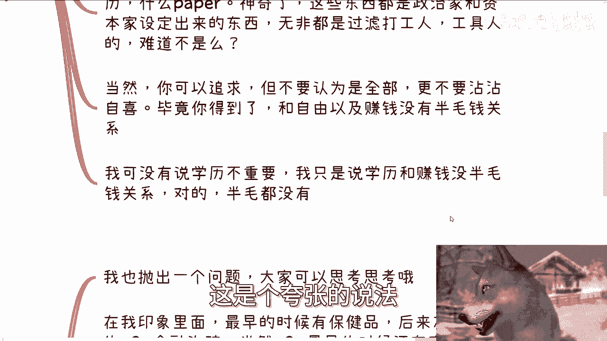
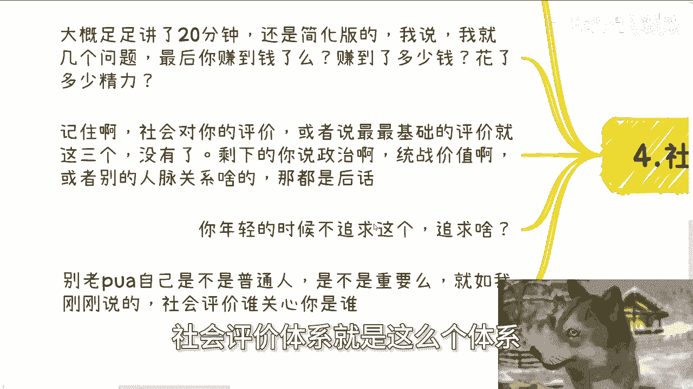
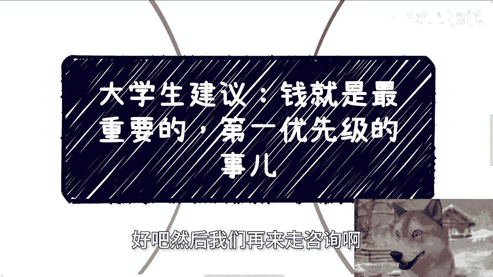

# 大学生建议课程01：💰 钱是第一优先级


在本节课中，我们将探讨一个核心观点：对于大学生而言，赚钱应是当前阶段的第一要务。我们将分析为何金钱如此重要，并澄清一些常见的认知误区。

---

## 🎯 核心观点：金钱是首要目标

上一节我们介绍了课程主题，本节中我们来详细看看核心观点。

许多人可能认为“钱最重要”是一句废话。但对于尚未接触社会、不了解社会运行框架的大学生而言，理解并践行这一点至关重要。明白这个道理的人，未必能在行动上体现；更多人是在多年后才真正明白，但那时往往为时已晚。

社会上有一种声音，劝人“不要总是为了生存而拼搏”。但如果每日忙于生计，又怎会有余力追求其他？许多人谈论未来，但未来的你可能忙于偿还贷款、筹措下个月的生活费。随着年龄增长，人人都会面临类似问题，例如赡养父母。这些问题的核心都离不开一个要素：**金钱**。

人生说长不长，说短不短。一个残酷的现实是：在身体最健康、最有精力享受生活的年纪，人们往往没有足够的资金去旅游、品尝美食。这并非绝对没钱，而是资金量不足。等到忙碌半生后，可能有了些积蓄和时间，但客观条件（如健康、家庭责任）往往已不允许你去“挥霍”。因此，在年轻时积累财务资源至关重要。

---


## 🤔 反思：你的追求与价值


上一节我们确立了金钱的重要性，本节中我们来看看哪些追求可能偏离了核心目标。

我与许多硕士、博士交流时，常问他们几个问题：你们有钱吗？你们自由吗？你们能让自己过上相对优渥的生活吗？如果答案是否定的，那么无论卷出多少成就、获得多少证书，其意义都可能大打折扣。这些成就若不能转化为**个人自由**和**财务保障**，其价值就值得商榷。

社会上的许多评价体系，如学历、证书、论文等，本质上是资本家和政治家为筛选打工人而设定的标准。为他人制定的标准而沾沾自喜，并无必要。你可以追求这些，但切勿将其视为终极目标，更不要因此自满。获得这些，与获得**自由**和**财富**并无直接关系。

**核心公式**：
`个人价值 ≠ 学历/证书`
`个人价值 ≈ 财务自由 + 选择自由`

需要强调：我并非说学历不重要。你可以重视它，但必须清醒认识到，**学历与赚钱能力之间没有必然联系**。

---



## 💡 洞察：赚钱的逻辑与机会


上一节我们反思了传统追求，本节中我们来剖析赚钱的真正逻辑。

回顾过去几十年，每个时代都有风口行业：早期的保健品、拥有官方牌照的P2P金融、被许多人嗤之以鼻的微商、电商、数字货币、直播带货等等。

以下是两个关键问题供你思考：

1.  上述这些领域是否都非常赚钱？并且，它们至少并非全部违法吧？
2.  很多人抱怨当下环境赚钱难。但请仔细想想：以前互联网不发达、通胀较低时，一个项目就能达到上百亿规模。如今互联网极度发达，信息流通更快，为何反而觉得赚不到钱了？

通过思考这些问题，你应该能得出一个结论：不是赚钱机会变少了，而是**大众认知中的赚钱技能（A/B/C/D/E）与实际有效的赚钱路径（1/2/3/4/5）根本是两回事**。赚钱的核心逻辑自古未变，但它绝不是“拥有某些特定标签（如高学历）就必然成功”那么简单。

---

## ⚖️ 实践：社会的结果导向评价

上一节我们探讨了赚钱的机会，本节中我们来看看社会如何实际评价一个人的价值。

社会是结果导向的。我曾遇到一位刚读博的年轻人，他自豪于自己阅历丰富、结识众多大佬。我让他简述经历后，只问了三个问题：
1.  你最终赚到钱了吗？
2.  如果赚到了，赚了多少钱？
3.  赚这些钱，你投入了多少精力？

**社会最初步、最直接的评价体系就是这三个问题**。在此基础之上，才谈得上人脉、政治资源等。没有财务基础，其他都难以稳固。

对于具体实践，设定目标很重要。例如，你开始一项业务，初期投入大量时间赚取微薄利润（如每月五六千），这可以接受。但你必须设定明确目标：最终要赚到**多少钱**，以及需要将时间精力成本降低到何种程度。

**一个评估思路**：
如果一年利润七八十万，但需要投入近乎全年无休的辛苦劳动，这仍是“辛苦钱”，价值有限。理想的状态是，能通过系统优化、被动收入等方式，**用更少的时间维持或增加收入**。例如，部分收入（如20-30万）来自被动渠道，这样你的时间价值和财务自由度会高得多。

现代社会变化飞速。如果不在年轻时（学习能力强、试错成本低）去探索和建立这种赚钱模式，难道要等到30岁后，精力、学习能力下降，家庭负担加重时才行动吗？那时跟上时代浪潮的难度会大得多。

不要过早地用“我只是个普通人”来PUA自己。一个才活了二十多年的年轻人，凭什么就此断定自己一生与财富无缘？社会评价体系并不关心“你是谁”，它只关心**你能创造什么价值**（尤其是经济价值）。你能帮人赚钱，或能拉来投资，你就有价值。除此之外，没人在意你的身份。

---

## 📝 总结与行动建议

本节课中我们一起学习了为何应将赚钱视为大学阶段及年轻时的第一优先级。



我们分析了金钱对于应对未来生活压力、获得人生自由的基础性作用；反思了盲目追求传统社会评价标准（如学历）的误区；洞察了赚钱机会一直存在，关键在于认清真正的赚钱逻辑而非表面技能；最后，明确了社会结果导向的评价体系，并给出了实践思路。

**核心总结**：
1.  **金钱是自由的基础**，年轻时积累财务资源至关重要。
2.  **警惕虚假成就**，不要为他人设定的筛选标准而沾沾自喜。
3.  **赚钱逻辑不变**，机会一直有，需要你主动识别和抓住。
4.  **社会只看结果**，用你创造的财务价值和效率来证明自己。

年轻时不主动追求财务上的突破与保障，更待何时？对于职业规划、商业构想（包括业务方向、股权、融资等）有疑问的同学，可以整理好个人具体情况与问题，进行针对性咨询。



**行动代码**：
```plaintext
if (年轻 && 有精力) {
    priority = 赚钱;
    探索赚钱模式();
    降低时间成本();
    建立被动收入();
} else {
    // 未来难度将指数级增加
    面临更大挑战;
}
```