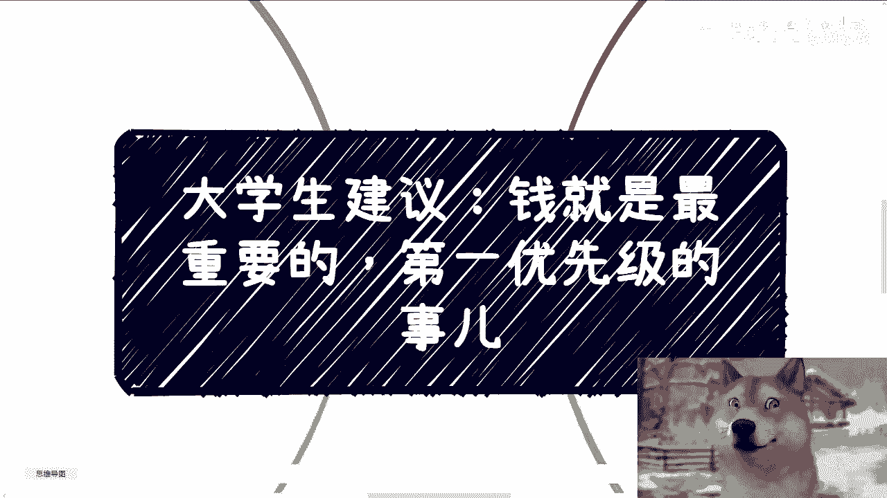
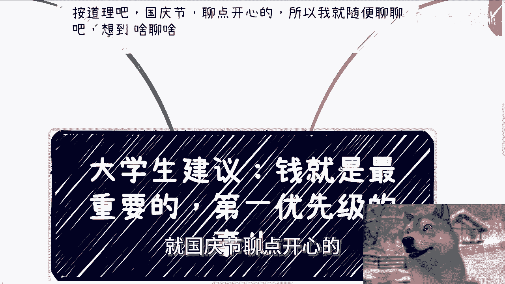
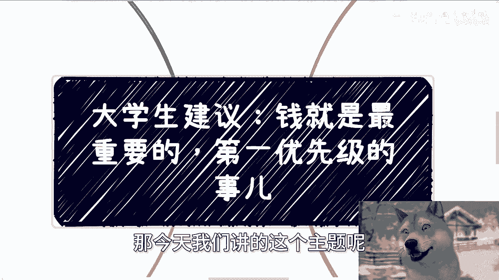
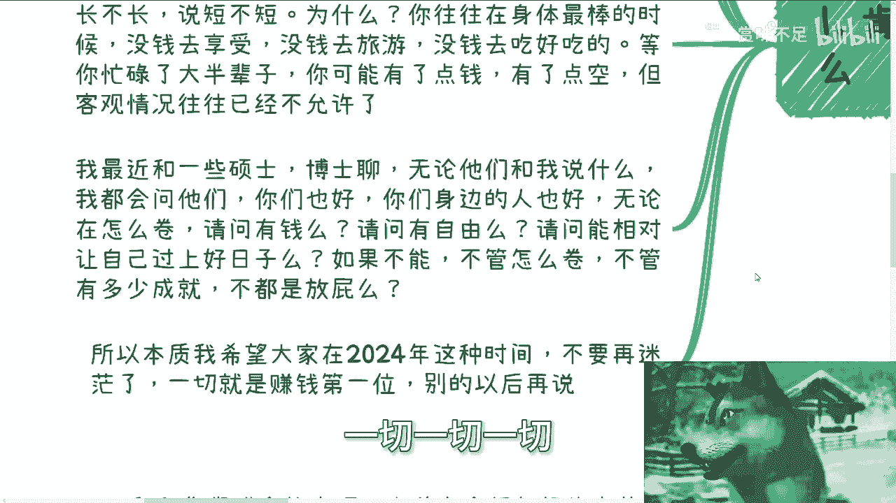
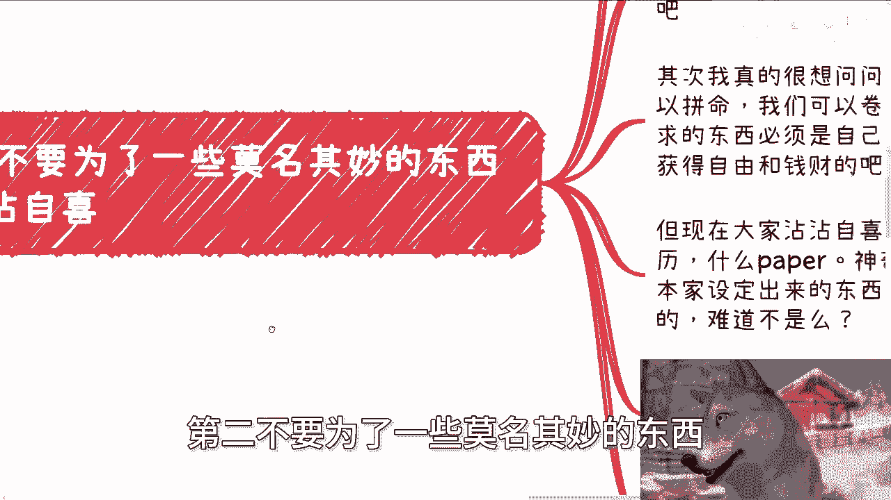
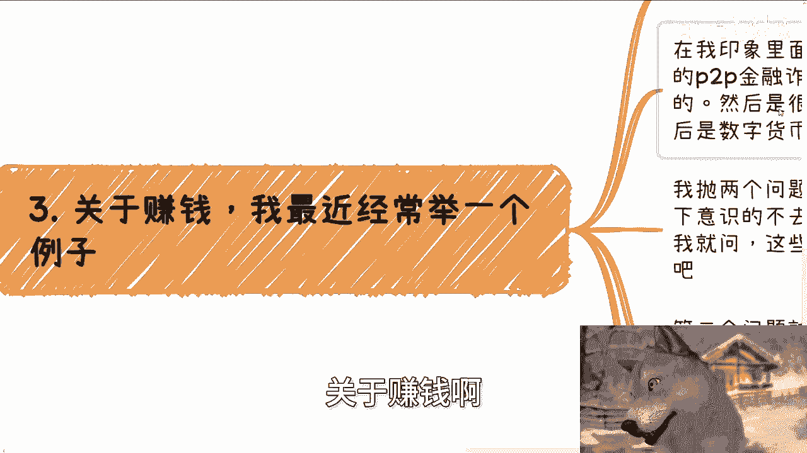

# 大学生建议：钱就是最重要的，当下第一优先级的事儿 - P1 - 赏味不足 - BV1Rw4NecEgm

好大家好啊，额按道理啊，就国庆节聊点开心的啊。

我就随便聊啊，想到啥聊啥啊，那今天我们讲的这个主题呢。

叫做钱就是第一位啊，啊而且是第一优先级的啊，呃肯定有人要说啊，这他妈是屁话是吧，我跟你讲对很多话啊，尤其是对于只要没有接触过社会，只要不了解整个社会框架的，不管是大学生啊，还是说那个牛马啊。

我觉得都一样啊，就是明白的人呢不代表行动上就明白，更何况很多人其实明白呢也是很多年后才明白，但那个时候呢大概率大部分都为时已晚啊，我也顺便说一句啊，这个地方我写大概率大部分是为了严谨啊，你要让我说。

这他妈就是一刀切就是晚了啊，这两天呢听到最多一句话是什么叫做，不要总是为了生存而拼搏啊，不要每天都是忙于生计，你但凡每天都是忙于生计，那我就问你，你还有什么空呢，对不对，很多人跟我聊东西都是说啊。

我们以后怎么样，以后怎么样，以后怎么样，以后你可能忙着还贷款以后，你可能忙着明天的这个下个月的这个生计，下个月的生活费哪里来，你可能忙着这个未来对吧，这个怎么说呢，就是因为年龄大了嘛。

大家面临的问题都一样嘛对吧，可能上有老，下有小，也有可能没有小对吧，但你有老吧对吗，那也就是说你总要忙于很多的东西，但是这当中所谓的东西离不开一个点，就是钱啊，嗯我之前跟你们提过。

我最近跟一个博士朋友在聊嘛，我也经常说，我说我说人生长不长，说短不短，为什么，我说你往往在身体最棒的时候，没钱去享受，没钱去旅游，没钱去吃好吃的，但是你说真的没钱啊，并不是没钱，是大家不舍得对吧。

大家没有这个资金量，等你忙碌了大半辈子，你可能有了点钱啊，有了点空，但是客观情况往往已经不允许你去浪了，明白我什么意思吧，对吧啊，嗯我最近和一些硕士博士聊啊，我说呃无论他们跟我讲什么，我都会问他们。

我说你们也好，你们身边的人也好，无论你们身边的人怎么卷，以及你们怎么卷，我就请问你们有钱吗，请问你们自由吗，请问你们能让自己过上相对好的日子吗，啊我我说这不是我扎不扎你们心的问题。

是这个社会扎不扎你们心，因为还是那句话，你们过得好不好不好，关我吊事，对不对啊，那如果不能的话，那我就在想了，不管怎么卷，不管有多少成就不都是放屁吗，那至少我是这么认为的，你们是不是这么认为，随便啊啊。

所以本质上，我希望就大家在2024年这种时间段，就不要再迷茫了，我们不是在2004年，对不对啊，大家还抱有一些希望啊，抱有说啊，我们他妈创个业对吧，怎么样子，我跟你讲。

拉他妈倒吧啊一切一切一切就是赚钱为第一位。

以后别的以后再说啊，我早就跟你们讲的很清楚，窗口期很短很短，第二不要为了一些莫名其妙的东西沾沾自喜。

什么意思啊，你比如说最近一个博士的朋友给我分享了，他导师PUA自己学生，或者说团队成员的一些东西，无非就是说自己当年得到了什么成就，做了什么，巴拉巴拉巴拉巴拉啊，然后可能马上要出国了什么呀。

我说然后呢搜出国代表什么，代表你很有钱吗，也没有吧，这两者有什么因果关系啊对吧，另外真的牛逼的人，谁用当年之勇来PUA别人啊，你你用当年之勇来PUA别人，可能现在已经没什么好说的了对吧。

而且更何况我有跟他讲，我说就你们导师这吊样子，他要真的牛逼，他现在牛逼啊，有钱吗，我还是那几个问题，有钱吗，自由吗，对不对，我那我跟你们说，我真的实话实说，我那天就是我直接问他。

我说那你们导师现在一顿饭多少钱，一个月消费多少钱，一年消费多少钱，我说句不好听的，有我1/10吗，对不对啊，其次我真的很想问问他们，我说你们有没有想过我们可以拼命，我们可以卷死卷活，但我们图的东西。

我们追求的东西它必须是自己想要的吧对吧，或者来说就是能够让我们获得自由和钱财吧，但现在当大家沾沾自喜的是什么证书，学历，paper啊，或者其他的各种各样的东西啊，anyway啊，但神奇了。

我说这些东西不都是资本家跟政治家，设定出来的东西，就是这些东西其实大家无应该了解，就无非是为了过滤打工人，过滤工具人的，我们为了一个别人制定出来的东西而沾沾自喜，有什么好沾沾自喜的呢，我他妈奇了怪了。

do it do哦，你就是个完全同质化的，一个一个一个一个一个怎么说呢，一个一个物种或者一个工具，你还沾沾自喜，当然啊，你可以追求，好就像就像啊待会我们再说嘛，啊就是说你可以追求，但是不要认为是全部。

更不要沾沾自喜，毕竟你得到了啊，你得到了某个东西，但这个东西跟所谓的自由，跟赚钱没有半毛钱关系啊，我而且我在这地方再跟你们强调一遍啊，我没有说过学历不重要啊，我没有说过学历不重要啊，当然我觉得不重要。

你们可以觉得重要，对不对，我只是告诉你们学历跟赚钱没半毛钱关系啊，对的呃，我真的我我不想跟你们讲，这是个夸张的手法。

真的半毛钱关系都没有啊，好第三关于赚钱啊。

我最近经常举这么个例子，我说我也抛出一个问题，大家可以思考思考，在我印象里面，在我小时候啊，最早的时候有保健品，后来有很有名的p two p啊，就是后面后面被定义为金融诈骗了啊，但是我不得不跟你们讲。

p two p最早的时候是有官方牌照的啊，然后呢是很多人嗤之以鼻的微商啊，然后是电商啊，然后是数字货币，然后是直播带货等等等等等等等啊，每个时代或者每隔几年都有这些东西，对不对啊，好你们要是不了解的。

你们可以自己去往前面翻翻历史好吧，翻翻历史我就不多说了啊，我毕竟是一路看过来的啊，我抛两个问题啊，很多人是不是觉得这些东西都很传销，或者都跟所谓的传销搭点边啊，都会下意识的不去接触，或者哪怕有机会的话。

也不会去接触啊，那么我我第一个问题就问啊，我说以上这些东西是不是都很赚钱，以及以上这些东西至少不是都违法吧，对不对啊，这第一个问题啊，第二个问题就很灵魂灵魂拷问啊，就很多人会跟我说。

他说哎陈老师现在这个时代这个环境很难赚钱，我就很想问，真的吗，真的吗，你有没有仔细思考过这个问题哦，以前互联网不发达，甚至没有互联网的时候，同时还没有通货膨胀的时候，怎么以前一个项目都能上百亿呢。

诶我他妈奇了怪了，对不对啊，而现在互联网这么发达了，大家反而觉得赚不到钱了呢，哎我他妈奇了怪了，你们仔细想看是不是这个逻辑啊，所以说你们必须要得出一个结论，或者必须往前翻历史，你们应该能明白一件事情。

就是事实上并不是大家觉得赚不到钱哦，而是大家认为赚钱的技能是ABCDE，但其实是12345，或者说是789十十一对吧，就是他根本就不是一回事，能明白这个道理吗，啊或者说赚钱的逻辑从古至今他就没变过。

但是并绝对不是你们所想的，拥有了某些东西就能得出这么一个结论的啊，好第四啊，他社会呢就是一个结果导向的地方，就我给你们讲个故事啊，之前有个很年轻的小伙伴啊，当时他应该是博博士刚读吧，然后呢他很骄傲。

为什么啊，因为他相比很多人呢，他做过很多业务，经历过很多事情，认识了很多所谓的大佬等等等等等，然后呢我就跟他说，我说你这样子，你简单的跟我介绍一下啧，他大概足足讲了20分钟，还是简化版啊，我说啊。

我说我说你停啊，我我我我说这样子我问几个问题啊，第一请问你最后赚到了钱没有，第二如果赚到了，请问赚到了多少钱，第三请问赚到了这点钱，你花了多少精力，记住啊，整个社会对你的评价。

或者说第一步最最low的评价就是这三个问题，没有了没有了，别的东西你在乎的都不重要，如果来说你要跟我说啊，政治啊，统战价值啊，人脉关系啊，这是基于钱的基础之上，大家再来谈的，你没有钱。

或者说你没有回答我，这三个问题的资本不要来谈后面的东西啊，什么意思啊，我给你们再解释一下啊，就是很多人会跟我说，他说陈老师我现在做一个东西做个业务啊，他说这个我现在比如说一单赚十块钱对吧。

然后我一天要工，要要要在那边做，就是111个月啊，比如说大概有个五六千对吧，然后我一天呢可能要在那边做7~8个小时，你记住一点啊，你如果一开始起步，你这样做我都觉得没问题，你只要能赚到钱。

我觉得你都是有价值的，但是你一定要明白一点，你做这个业务，你得给你定个目标，这个目标是什么，就是最后你到底赚了多少钱，以及你到底花多少时间赚到这个钱，就是如果来说你的这个花的精力相对都比较多。

但是你赚的这个量级，他没有超过大部分打工的这种，甚至就甚至没有超过大部分打工量级的话，那你这个赚钱是就没有价值的哦，哦OK那我们随便啊，就拍脑袋，现在打个比方啊，就是比如说你365天。

相对来讲你是别人打工时间的一半，比如说你工作可能得工作呃，一一周可能得工作2。5天对吧，假设啊好，然后呢，你说我一年的利润可能是在七八十万这样子，我说实话有吗，有价值价值不大，真的价值不大。

就是你这种价值更多的还是在辛苦钱的级别，明白吧啊你不要觉得就说啊，我我每周工作两天五天，卧槽他妈七八十万好像很牛逼对吧，我折算下来好像就好像是一个，我我要是工作365天，我年薪可能是一个一一百五十万。

160万有用吗，没有用，为什么，因为你这是个辛苦钱，你要不停的去降低你的投入成本，然后呢叫做分散你的投入成本，也就是说你你比如说一年七八十万，对不对，好你可以这样，你可以20万到30万，你可以是辛苦钱。

剩下20万到30万，你可以跟你可以是一个税后的，就是说你是一个被动的收入，唉那我觉得可以，那至少你你的价值比刚刚那个价值来的高啊，那么话又说回来啊，以上我们刚刚讲的所有东西，你不在年轻的时候追求。

你什么时候追求呢，你想想看，就是现在现代社会变化这么快，你不在年轻的时候追求怎么了，你我我说句不好听的，你难道还认为大部分人30岁，那我不说七八十了对吧，30岁离你们不远吧对吧。

你们难道认为你们30岁时候，还能紧跟社社会吗，还能紧跟浪潮吗，还能紧跟整个环境吗，我不相信的，真不相信的，对不对，就你年轻的时候不追求这个，你什么时候追求呢，咳对吧，然后还有一点就是你不要老是PUA。

自己是不是普通人，哎我觉得还是那句话，是不是普通人重要吗，奇了怪了啊，我我就不明白了，一个就是十是18，就是一个，比如说20多岁甚至18岁的这么年轻人，才活了十几十几年，20几年，然后怎么滴了。

把你这辈子打上烙印，棺材板干好，说我赚不到钱，哎我他妈奇了怪了，凭什么，对吧，而且更何况我们这刚刚就说过了，社会评价谁，社会评价体系就是这么个体系。

他不关心你是谁，谁关心你是谁啊对吧，当然啊，我还是那句话，富二代，我们就从整个95%，或者98%的普罗大众里面再再说，谁关心你是谁啊，啊真的没人关心啊，对吧，你说你说价值是什么价值。

就是你能给我带来钱一样的道理，你要么有本事帮我赚钱，你要么就有本事帮我拉来投资，别的没了呀，我关心我关心你是谁吗，谁关心啊，你越是跟那些资本家，越是跟那些政治家，越是跟那些就是生意人，谁关心你啊，对吧。

所以我最后再跟你们讲一句，就是你们现在年轻时候不追求这个，你们追求什么呢，我反正从我角度我是完全不明白的，追求什么呢，好吧嗯好啊，你就这么着吧好吧，国庆节快乐啊，然后职业规划就工作上好吧。

商业规划包括呃你们觉得想做些什么东西，整个业务啊，包括分红啊，股权啊，融资啊对吧，赚钱啊，方向不明确的，你们可以整理好对应的个人问题跟个人背景，好吧，然后我们再来走咨询啊。

