# 课程一：理解领导、家长与老师的局限性 🧠

在本节课中，我们将探讨一个核心观点：家长、老师和领导通常不具备我们想象中的专业性或深度思考能力。理解这一点，有助于我们调整预期，避免不必要的内耗，并抓住与这类人群互动的关键。

许多人倾向于将家长、老师和领导想象成自己理想中的样子，这会导致错误的评估和焦虑。这种幻想会让你抓不住重点。

上一节我们提到了错误的预期会导致问题，本节中我们来看看其具体表现。

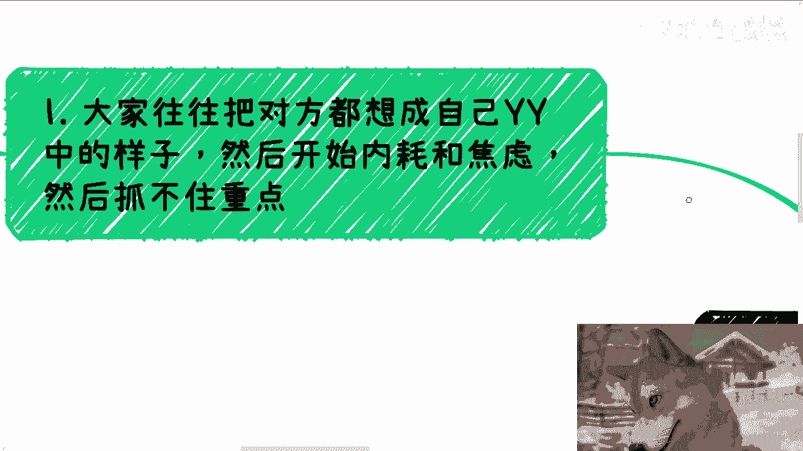

以下是常见的错误预期表现：
*   将对方想象成专业、全面、深思熟虑的形象。
*   因此产生不必要的内耗与焦虑。
*   最终导致无法抓住互动的核心重点。

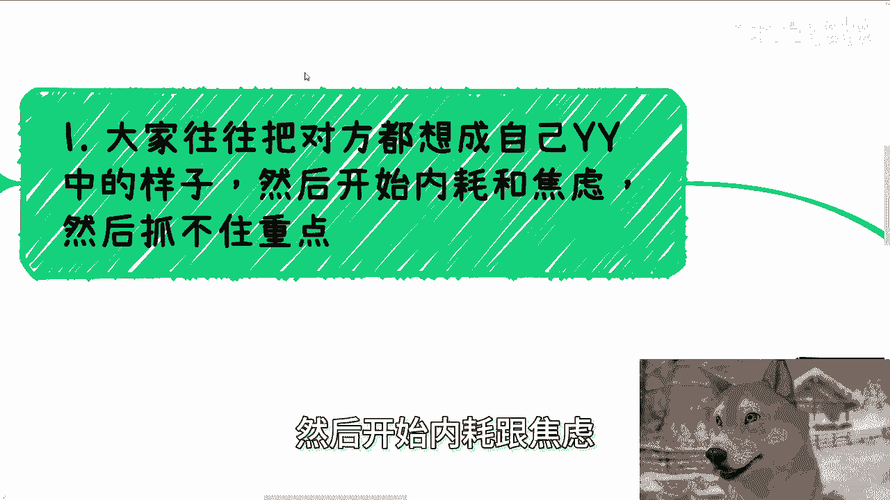

## 核心法则：实力为王 💪

我之前强调过，在绝对的实力面前，一切花里胡哨都是无用的。这个法则在与领导等角色打交道时尤其关键。

**核心公式：实力 > 一切形式**

这个公式可以具体化为两种情况：
1.  **如果你能提供对方需要的核心价值（如完成KPI、项目），** 那么你的学历、性别、长相、应酬方式等都无关紧要。
2.  **如果你不能提供核心价值，** 那么无论你在其他方面做得多么出色，也同样无用。

有人可能会问，既然对方不看重这些，为何还会接受请客送礼？原因很简单：作为既得利益者，对方没有理由拒绝送上门的好处。这与良心无关，是现实逻辑。

## 领导的特质与局限性 🎯

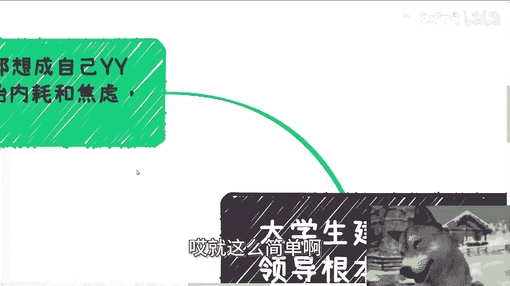

今天我们主要聚焦于“领导”。首先给出结论：领导之所以成为领导，恰恰是因为他们对具体细节和技术的“无知”。如果他们精通细节和技术，反而很难成为领导。

### 领导的本质：管理者，而非专家

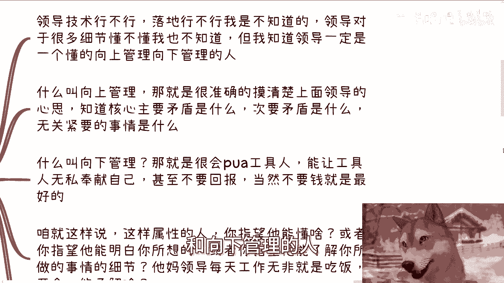

领导的技术能力、落地能力、对细节的掌握程度通常存疑。但有一点是确定的：**领导一定是懂得“向上管理”和“向下管理”的人。** 否则他无法坐稳位置。

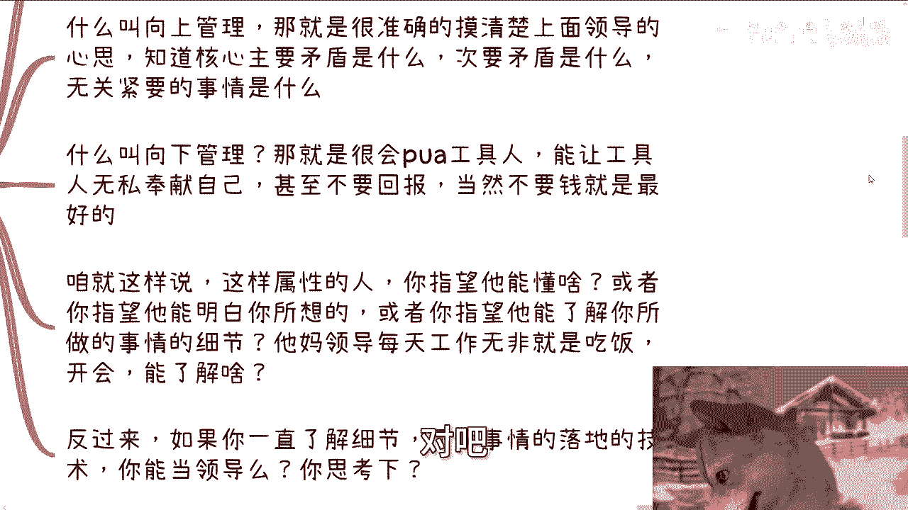

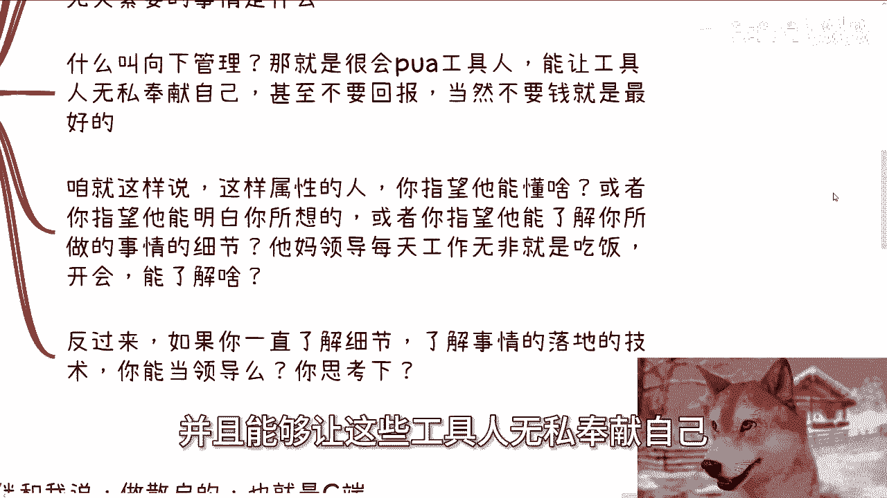

上一节我们定义了领导的本质，本节我们来详细拆解其两大核心能力。

以下是领导的两大核心管理能力：
*   **向上管理：** 精准揣摩上级意图，分清核心与次要矛盾，明确轻重缓急。
*   **向下管理：** 善于驱动下属（“工具人”），使其无私奉献、加班，甚至不计回报。

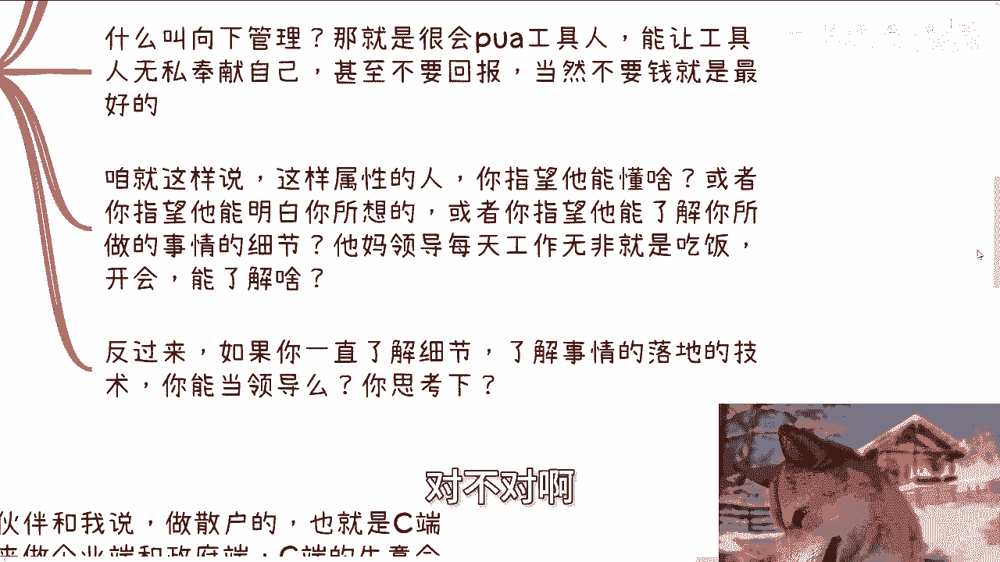

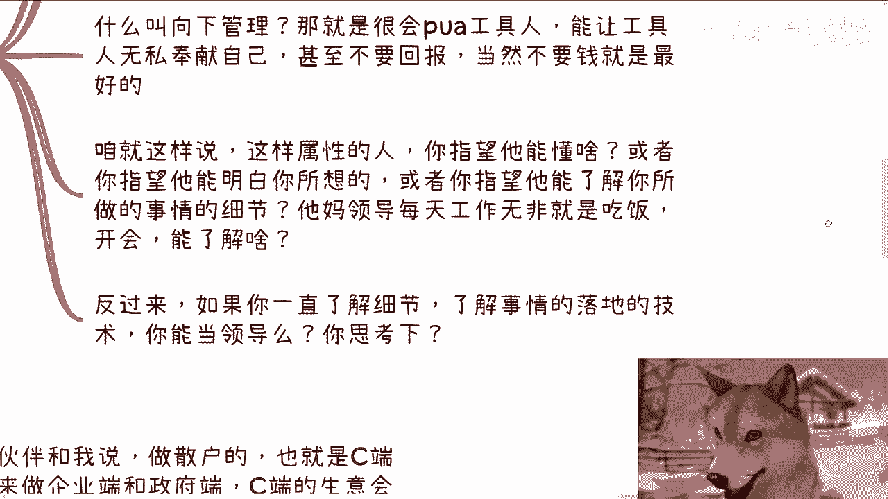

具备这些属性的人，你无法指望他们理解你的具体工作细节或在乎“牛马”的感受。他们的日常工作无非是**吃饭、开会、写报告、喝茶**。反过来思考，一个过于精通细节和技术的人，往往也难以成为领导。

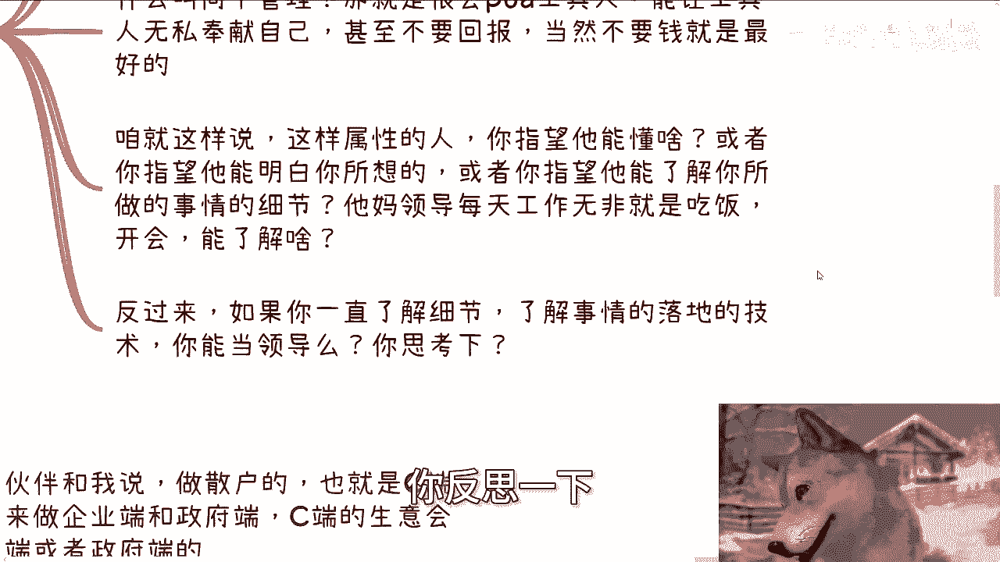

## 实践案例：技术思维 vs. 宏观思维 💼

我们通过一个例子来加深理解。在中国，做具体的技术服务，其价值往往不如做宏观的、战略性的服务。

原因在于：技术服务的好坏由技术标准决定，但预算审批权在领导手中。如果你向领导汇报一个他听不懂的技术方案（例如，申请300万采购特定数据模型），他很可能无法理解其价值，从而驳回或大幅削减预算。

反之，如果你汇报一个宏观的、战略性的方案（例如，与高端资源对接、进行市场布局），即使内容更“虚”，但因为领导能听懂且觉得“有道理”，反而更容易获得高额预算（300万、500万甚至更高）。

**核心逻辑：** 审批预算的职级越高，领导懂技术的可能性就越低。因此，沟通方式必须适配。

### 关于过往经历的误区

有同学担心，自己以前做面向个人消费者（C端）的生意，是否会影响未来做企业或政府（B端/G端）项目，让领导觉得自己不专业。

这是一种过度担忧。一方面，领导根本不懂你具体做什么；另一方面，领导也没空关心你的过去。关键在于你能否提供对方需要的“绝对实力”——成熟的产品、资源或完成项目的能力。

如果对方以“你以前做C端不专业”、“公司成立时间短”等理由拒绝你，这通常只说明一个结论：**关系不到位**。这些理由都是借口。

### 项目申报的关键

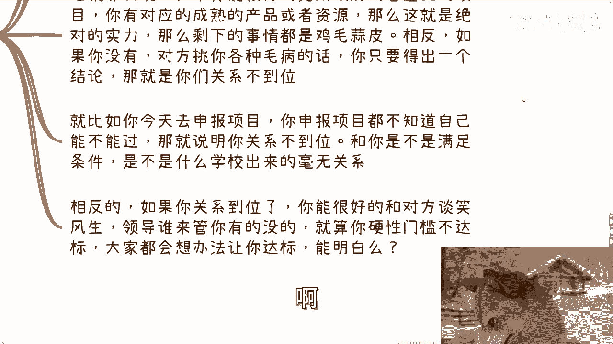

以项目申报为例：如果你不知道自己申报的项目能否通过，这本身就说明**关系不到位**。这与你的学校背景、是否满足硬性条件关系不大。反之，如果关系到位，即使某些条件不达标，对方也会想办法帮你满足。

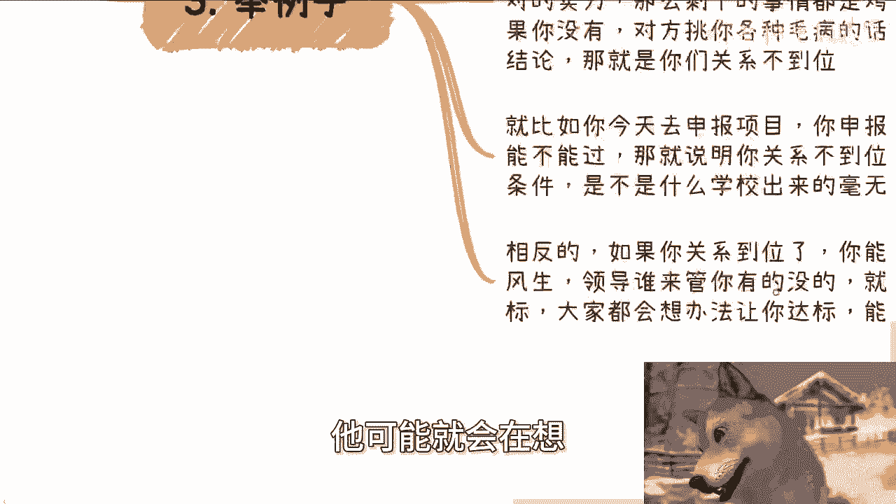

## 残酷的现实与你的选择 ⚖️

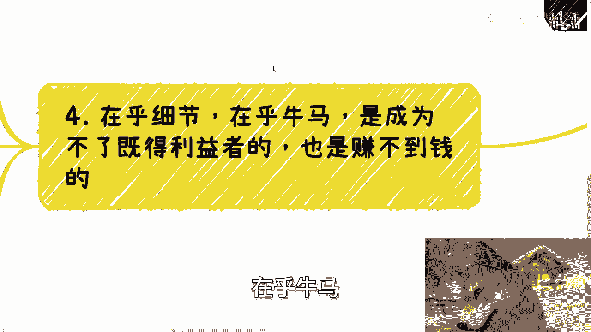

以上所述，尤其是在与国企、央企或政府部门打交道时，是近乎百分之百的现实，没有例外。

### 细节与格局的悖论

过分在乎细节、在乎“牛马”（下属）的感受，是成为不了既得利益者也赚不到大钱的。因为人的精力有限，当你过度聚焦于项目、技术或团队细节时，就会缺乏大局观，无法理解上层想法，从而错失机会。

你可以选择不“跪舔”，但前提是你有足够的资本（个人能力或家庭积累）。如果没有，这就是现实世界的运行规则。

在商业拓展中，要赚钱就必须有人从资本家或政治家的角度进行战略布局，而不是扮演慈善家或“奶妈”的角色。团队中通常需要有人“唱红脸”有人“唱黑脸”，表面的“在乎”与背后的战略是两回事。

---

**本节课总结：**
本节课我们一起学习了如何重新认识家长、老师和领导的角色。核心要点是：不要对他们抱有不切实际的专业幻想；掌握“实力为王”的法则，专注于提供核心价值；理解领导的核心是管理而非专业，沟通时需采用宏观战略思维而非技术细节；并认清社会运行中关于关系、资本与选择的现实逻辑。调整好这些认知，能帮助你更有效地进行职业与商业规划。