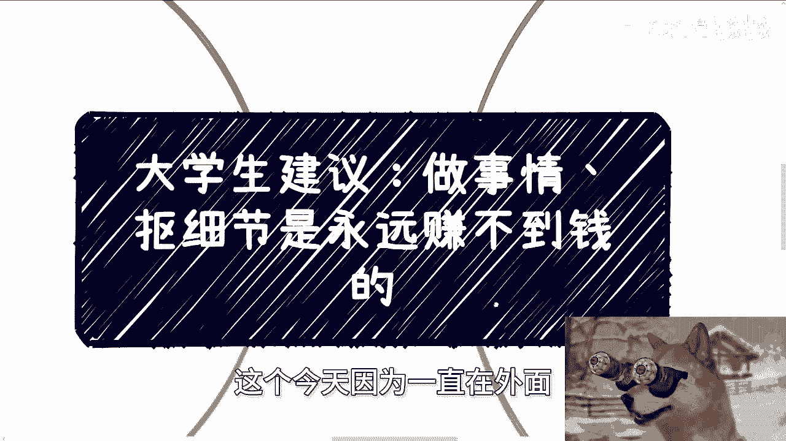
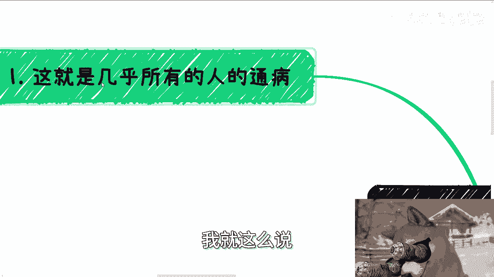
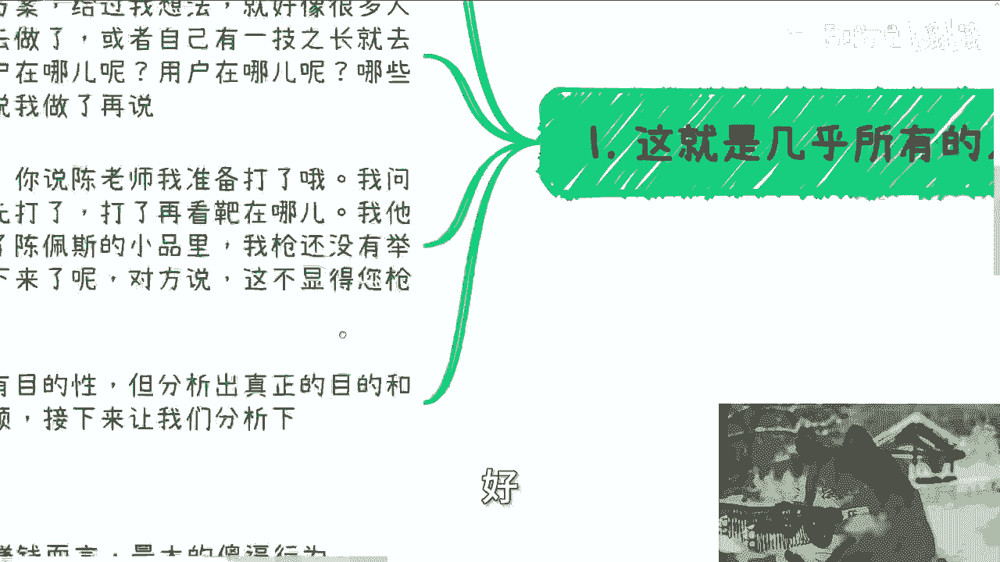
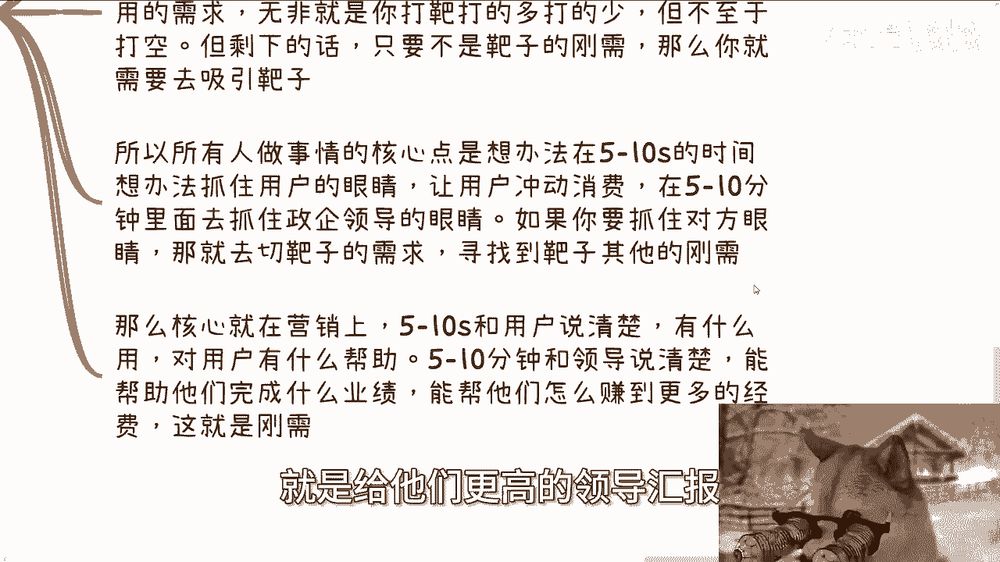
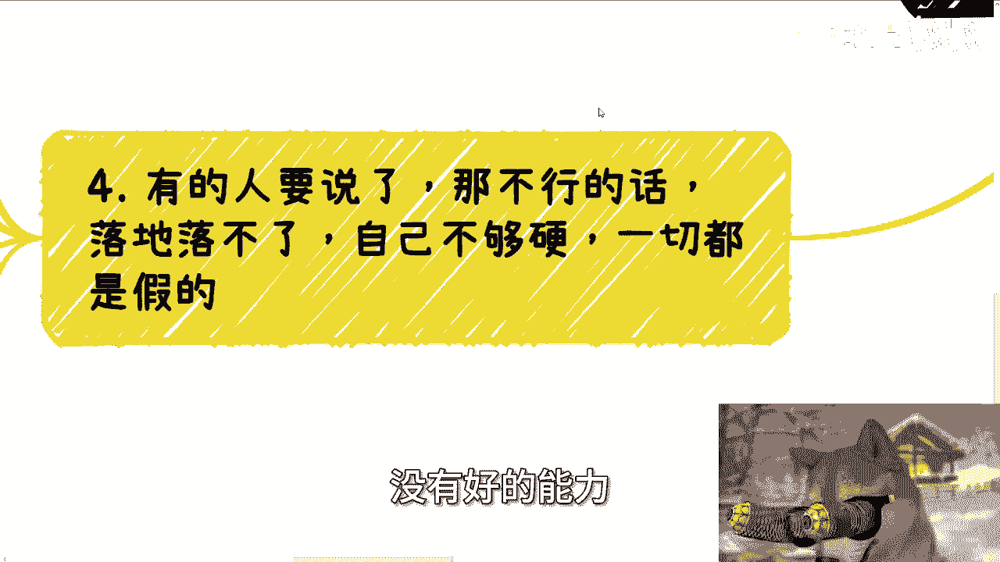
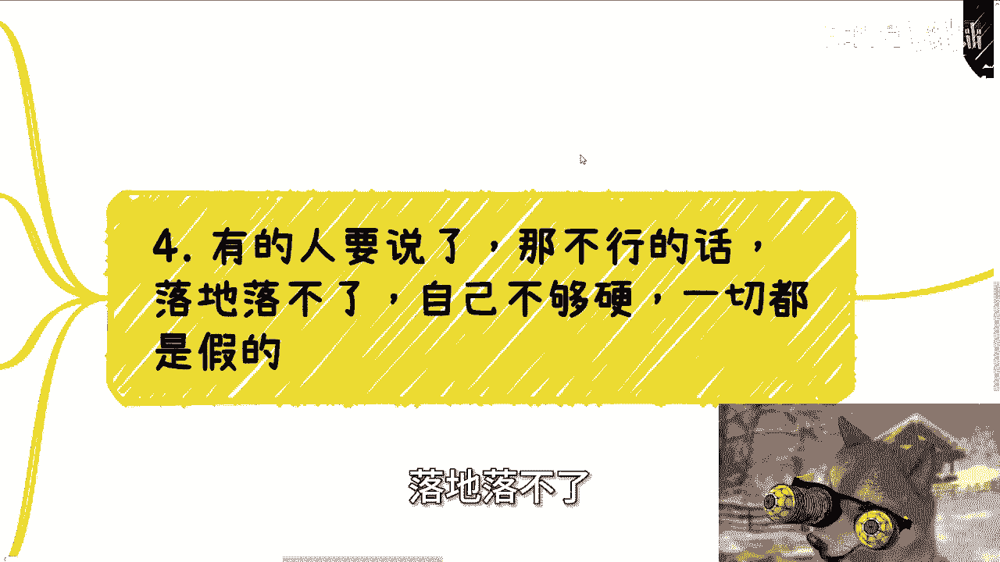
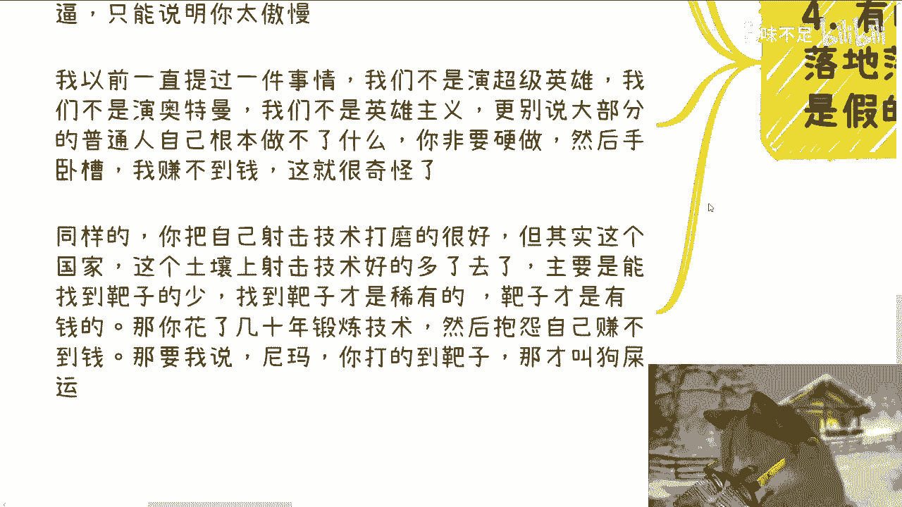
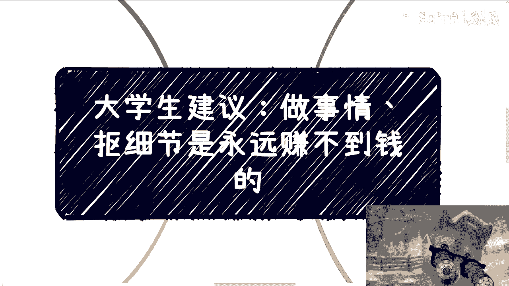

# 大学生建议：做事情、抠细节是永远赚不到钱的 - P1 - 赏味不足 - BV1eHxnezEX8

嗨大家好，这个今天因为一直在外面啊。

所以就晚了，但是呢晚了呢我还是会给你们录的啊。

咳咳对吧，我们还是要有原则的，今天我们讲的这个事情呢叫做事情啊，哭细节是永远赚不到钱的，而且我就跟你们讲，对我他妈就这么直接，而且就这么绝对没什么好说的。

为什么，因为这事情不是我定的，这这社会就这个样子，对不对，你爱信不信啊，嗯好，那么第一啊，我就这么说。

这几乎是他妈的99的人通病啊，当然我先叠个甲啊，你要愿意做慈善，你要愿意做技术，你要愿意抠细节，我尊重每个人啊，随便你们爱咋地咋地啊，关我吊事，对不对，我只阐述我的观点咳，关心细节，研究怎么做事情。

所有在那边打磨你们的技术的人，都是赚不到钱的，这就是我的结论啊，就这么简单啊，你不要来跟我说1980年怎么样，你也不要跟我说2000年怎么样，以前是以前，现在是现在啊，不要一概而论，没什么意义的啊。

有什么区别呢，对不对，好，那么有无数的人给过我方案，给过我想法啊，就好像很多人和我说组个小队去做了，或者自己有一技之长就去做了，然后你问客户在哪，用户在哪啊，然后我问啊客户在哪，用户在哪，哪些人会付费。

他们说我做了再说，哎我先做好，这就好像什么，这就好像你在打靶，你说陈老师我准备打了，我问你靶子呢，你说我先打，打了再看靶在哪，卧槽怎么地啊，跟踪子弹啊是吧，我就搞不懂了啊，哎我说我他妈你牛逼啊。

就让我想到了陈佩斯那个小品，就是卧槽，我他妈枪还没举呢，你怎么就倒下来，然后对方说这不显得你枪法准吗，是不是你们也啊，大部分人都吊，就是属于那种车老师，我我有个id，客户在哪，不知道啊，哎我操。

我他妈做了做了就有客户来，卧槽，怎么他妈地球围着你转是吧，说真的啊，做事情要有目的性，但分析出真正的目的和需求也是非常关键的，这就好像你说磨练打靶的技术要不要紧，关不关键，当然关键了。

但是你找到靶子在哪，更他妈关键啊，你没有靶子，的技术再吊有什么用啊，你想是不是好。

那么接下来我们摆事实讲道理吧，第二不管C端。

B端G端，你怎么吸引客户，首先啊咱就这么说啊，一般来讲政府端，企业端就是我们说的B端和G端，政府端企业端，你别看和别人开会沟通，一会儿开一个小时，一会儿开几个小时，真正别人能听得进去。

你说的也就那十到5分钟对吧，那么一般的散户呢，比如说啊你今天要宣传一个产品或者服务，咱就这么说，我不管你线下宣传还是线上宣传，你从14亿人的这个平均角度来讲，我就问你，你觉得客户能停留在几秒钟。

在你的内容上面，你自己扪心自问一下，对不对，那么按照以前抖音的说法，抖音当时以前说过一个视频，在抖音上面最好的长度是多少，30秒，为什么，因为用户停留时间也就是五秒到十秒，不会再长了，好那么问题来了。

你五秒能给用户说明你的产品跟服务吗，你五到10分钟你有自信，让企业跟政府的老板明白，你的产品跟服务的优势是什么吗，对不对，怎么可能呢啊所以你打磨你的产品，你练习你的打靶的技术，你抠细节有用吗。

也许你是个专家有用吗，有用，这就好像你很好的练习你打靶的能力，当然有用，但是你得知道靶在哪，以及你为什么能打到那个靶，靶的需求是什么，对不对啊，好啧，我们继续来说，我们换个方式来讲，你面向C端。

散户也好，企业政府领导也罢，你想想看啊，你做一个东西，你每天都在那边看，你每天都在那边研究，也许你是这个领域的专家，你可能对你的产品或者服务了如指掌，但是他妈的你的客户也就是你的靶子。

可能都是第一次听你说，对不对，你就几秒钟或几分钟你能说得清楚啊啊，好我举个例子，你今天卖天山雪莲，可以，我就这么说，我作为一个普通人，我很无知啊，我很无知，你今天把天山雪莲他妈的放我面前，我告诉你。

我也分不清，我也分不出真假，你更别说我今天是在短视频或者淘宝，或者从网络上面看上看见你的描述或传播了，你跟我在那边描述有用吗，你觉得有用吗，我不懂啊，我真不懂啊，你觉得你说的很对，你就像有很多人跟我说。

他说哎我很真诚，大哥你很真诚，那是你的事，我怎么知道你真不真诚呢，在我看来每个人都很真诚啊，对不对，好，所以你记住啊，我为什么说我为什么一直强调，你们无论有任何特殊技能，都不如小姐姐跳3分钟舞，为什么。

因为小姐姐跳3分钟舞是靶子们通用的需求，对不对，好无非就是说你今天这个舞跳的好不好，小姐姐身材好不好，无非就是你最终打靶打的多，打的少，但不至于打空，能明白吗，啊这就好像我一直跟他们说。

我说你们实在不知道做什么，你们可以去做男权女权，你们可以去做情感纠纷，为什么，因为男权女权情感纠纷不至于打空对吧，因为这就是人类，但是剩下的只要不是靶子明面上的刚需，那么你就要想办法去吸引靶子。

或者去找到靶子，别的刚需对吧好，那么所以所有的人做事情的核心是想办法，在这5~10秒里面抓住用户的眼睛，让用户冲动消费，在五到10分钟的时间里面去抓住，抓住政府的领导的眼睛，对吧好。

那么就像我们刚刚说的，如果你要抓住对方的眼睛，那就去切靶子的需求，寻找到靶子，其他的刚需，那我在这地方又跟你们提一点，那我很不好意思的告诉你们，非常抱歉的告诉你们，你们所有在学校里面锻炼的技能。

你们所有在牛马岗位上面锻炼技能，你们所有拿到的学历都不是刚需，你们仔细想想看，你们学历高不高，关我用户事诶，你学历高不高，关我政府企业领导吊事啊，对不对，你搞没搞嘞，你低么低嘞。

又不又又又不切中我的痛点，又不是我的需求，关我什么事情，对不对，有用吗，屁用没有对吧，所以说核心在哪里，核心在营销上，5~10秒钟跟用户说清楚有什么用，对用户有什么帮助，五到10分钟跟领导说清楚。

能否帮他们完成多少业绩，能帮他们赚到更多的经费，能帮助他们如何帮，就是给他们更高的领导汇报。

这就是刚需，好嗯说到这啊，有的人要说了，说陈老师，你这话说的不对啊，没有好的学历，没有好的能力。

那就是自身不够硬，自身不够硬，落地落不了。

一切都是假的，诶我跟你讲啊，真的吗，诶我就奇怪了，你知道吗，对于赚钱而言最大的行为是什么吗，那就是什么都自己做，而对于赚钱最大牛逼的行为是什么呢，那就是自己什么都不做，难道不是吗，哦难道你跟我说。

你想赚钱还自己他妈的拼了命付出劳动吗，这叫赚钱吗，那不是在搞笑吗，啊把资本家笑得大牙都掉了，所以你如果要觉得非要自己去落地，非要自己去给对方产品，非要自己去给对方服务，然后自己不够硬，自己能力不行。

就得出一个整个逻辑走不通，得出一个自己必须硬不硬，就赚不到钱的这么一个逻辑，我告诉你，那说明你，那说明太傲慢，懂吗，哦我以前一直提过一件事情，就是妈的我们现实生活啊，大哥大姐啊。

我们现实生活不是演超级英雄，我们不是演奥特曼，我们不是英雄主义，你更别说大部分的普通人，自己根本什么都做不了，还要硬做对吧，然后就在那边说，哎呀，我他妈赚不到钱，哎我他妈就就很奇怪了。

你凭什么觉得你做了就赚得到钱呢，啊为什么好奇怪嘞对吧，同样的，就像我们一开始说的，你把自己的射击技术打磨的很好，但其实你有没有想过，这个国家这个土壤射击技术好的人多了去了，主要是能找到靶子的人少啊。

找到靶子的人才是稀有啊对吧，因为靶子是有钱，把子是出钱方，那你花了几十年或锻炼技术，锻炼射击技术，然后抱怨自己赚不到钱，那我就说了，哎我就奇了怪了，你凭什么觉得你磨练技术就打得到靶子呢，对吧。

而且我就告诉你，如果就是某一天你真的打到靶子，我告诉你，那叫狗屎运啊，那不是因为你设计技术好，明白吗啊当我夸赞你设计制作，或者别人夸赞你射击技术好的时候，那叫讽刺，那不叫赞美。

能明白吗，对吧，我希望啊我在这个里面，我最后提一点，你不要真的把我说的射击当成射击，你也不要真的去靶子当成靶子，请你们具象化的去想一下，映射到很多事情上面对吧，很多东西没法明面上去说。

但是我觉得从这个例子来讲，我已经描述的很清楚了，你们自己去想明白，想不明白，你只要找不到靶子，你想赚钱就是痴人说梦，我不管你射击说的多准，就这么简单，好吗，嗯好啊，那就这么着啊，那么职业规划工作上面啊。

商业规划副业啊，包括你们跟别人合作分红分润合同，估值融资啊等各方面，包括业务问题，你们觉得有任何的疑问的啊，或者希望通过跟我的沟通，给你们少走点弯路的话啊，你们可以整理好对应的问题跟个人背景好吧。

我们再来组咨询啊。

