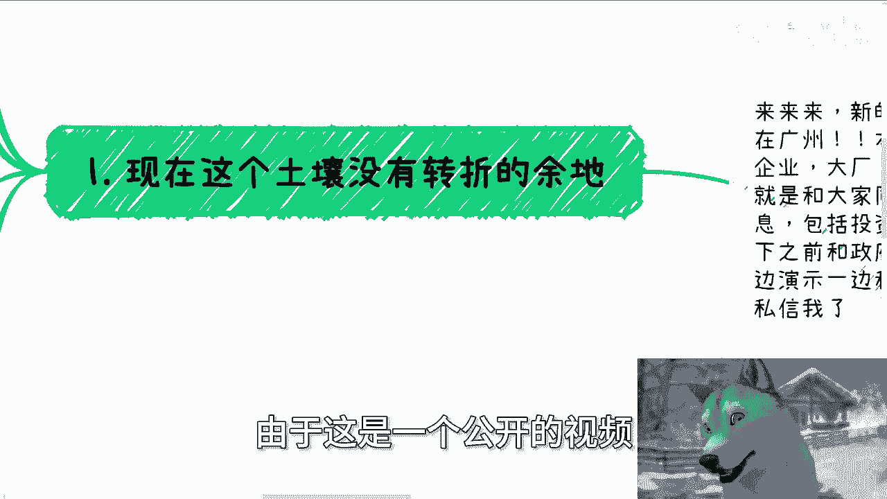
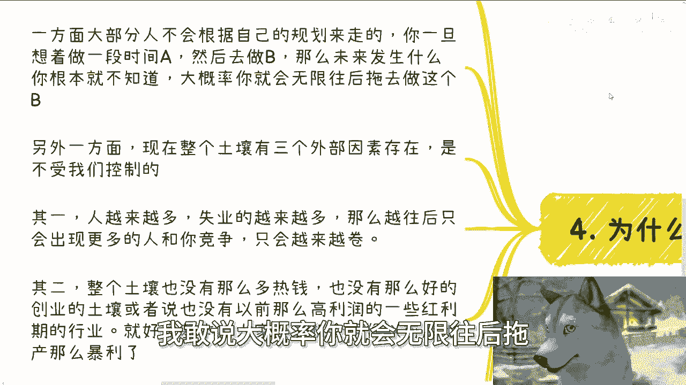
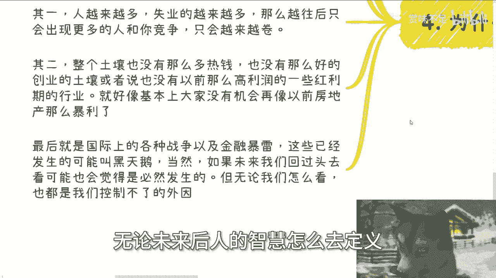
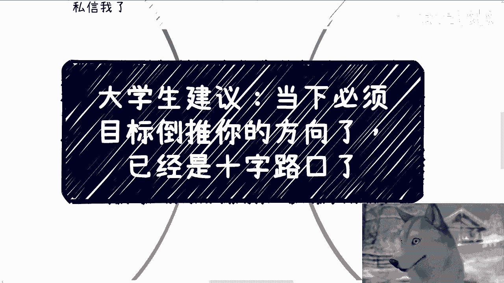

# 大学生建议：当下必须根据目标准备了，要么就一条路走到黑 - P1 - 赏味不足 - BV1i22WYQEBt

好大家好啊，今天我们继续来讲这个主题啊，叫呃大学生的建议对吧，那就当下必须啊。

目标倒推你的方向，我跟你讲就已经是十字路口了啊，当然也不是说这个当下吧。

可能更多的就是说你们就毕业的那个时间点吧，啊不管是今年还是明年还是后年都一样啊，呃首先新的活动已经定了，本月29号啊，在广州好，在广州，那么本次活动呢一方面我和大家说一下，就是面向不同的企业啊。

大厂啊对吧，创业公司啊，国央企的一些offer的选择，另外一个呢就跟大家同步一下，就最近沟通下来一些最新的一些消息，包括呃投资和一些大方向上面的，那最后就是说我会给大家那看一下。

最呃之前和政府还有高校合作的这个PPT和word，好吧，到时候我就一边就直接打开给你们看，一边给你们解析一下好吧，要报名跟了解详情的可以私信我，首先第一个啊，现在呢这个土壤没有转折的余地啊。

当然啊我也不绝对啊，啊总有天才呢可能额能转折啊，或者也总有运气好的人能转折啊，但大部分的人呢，在当下的这个土壤的这个时间窗口里面，它没有转折的余地啊，什么意思呢，意思就是说你想着我先工作几年。

然后去做一个自己的业务，或者来说我工作几年之后，我去考公，或者说我现在做一些事情啊，我做的不行了，再去找工作对吧，等等等等等啊，就说白了你就是先想做A啊，然后转转折去做B或者转折去做C等等等啊。

一方面啊，大概率这种土壤之下你是成功不了的啊，另外一方面还不如你直接现在就开始做，来得靠谱啊，要么你就别做啊，因为整个大环境没有这个土壤和时间，给大家去转啊，为什么我最后第四点会讲呢。

你们要是不想听前面的，你们直接拉到第四点啊，当然啊我们是一个灵活的人类啊，不是一个二极管啊，不是说非黑即白的，也就是说工作也好，考研也好，公务员也好，出国也好，就你创业也好，你想赚钱也好，随便你。

你想干嘛都可以啊，但是你所有的事情里面得要有个核心目标，当然你要没有核心目标也行，那你就不要焦虑，对不对，你不要一天到晚就说我既没有核心目标，然后我他妈还在那边焦虑，那我妈没得办法啊。

啧那么你必须要有个核心目标，你的重点就是朝着这个目标去啊，别说过两年啊，过几年我再朝着这个核心目标走，我跟你讲来不及了，就这句话来不及了啊，由于这是一个公开的视频。

我不可能再往下讲，只能讲到这个程度了，对不对啊，第二其实你要卷什么都可以。

但现在你就要开始很简单啊，每个人都有你自己想卷的方向跟权利，随便你啊，只要你自己觉得能得到你想要的就行啊，当然你觉得你能得到想要的和，最终你能能最终能得到想要的，是不是一个东西，咱不知道啊。

但是默认啊你你你你我尊重你所有的想法啊，但是如果你想得到这个东西啊，或者说你想得到你，你你意淫当中幻幻想当中的东西，你现在就要开始卷了，现在马上立刻now啊，举个例子啊，比如说你要工作上一条路走到黑。

对不对好，那么你就朝你身上不停的去掏Buff，你到底想在什么公司，比如创业公司啊，国央企啊对吧，海其他地方啊，你就不停套Buff，好学校啊，好学历，各种证书啊，各种好的公司经历。

包括你要学会拍领导马屁啊，包括怎么有很好的亲和力，包括怎么和同事和同事处好关系，你现在就要开始卷了，现在就要开始学习啊，而不是说哦过几年怎么样怎么样，当然啊你说你现在学历不行，可能卷不动对吧。

你说我也不会有这么强的人情世故能力啊，我也那个不嗯不太对，人机人这个social，对这个人际社交上面没有这么大的心得对吧，好，我跟你讲很简单，你要么就选别的路啊，就是我接下来说的那些对吧，你要么就不选。

就像我说的，尼玛都不选啊，你别让自己焦虑，反正就就这么着，反正就走一步看一步，也不要再去想着说哦，我要么做一段时间，做一段时间嘛，我再去卷个非全对吧，我再卷个什么东西，我告诉你没有用啊，没有用。

你们这些行为放在以前放在一几年，放在20年可能还有用，现在往后没有用，就这句话懂吗啊，比如你要做公务员，一条路走到黑对吧，那也简单啊，一样的学历优先，学校优先，官腔要浓对吧，要懂得什么是官腔。

要懂得怎么写文件，要懂得怎么写报告，要懂得人情世故，要会来事对吧，你要去懂得怎么样的，是哪些部门可能未来发展更好，哪些部门，哪些地方甚至哪些县对吧，升职更快，当然又回到那个问题上面，你说哎呀。

我学历不行，或者我根本就不了解对吧，什么官腔要浓啊，人情世故啊，什么什么什么部门啊，发展甚至是快不快，我也不了解，很简单啊，你要么选别的路，你要么就别想着往上走，你就温水煮青蛙。

就当一个公务员朝着未来去主对吧，那你也别让自己很焦虑，就这么简单呀，何必呢对吧，你千万不要想着哦，我先进去，哎，我进去了，我再往上卷，不好意思，我告诉你，不好意思，我一刀切你，但凡有这种想法的。

你没这个能力啊，你没这个能力啊，好第三我们继续来讲啊，比如说你要赚钱对吧好，那很简单，请在最短的时间内先赚到钱，我不管你现在多大，我也不管你几岁，明白吗，不要老是用什么，哎呀陈老师，我还没毕业。

我是大学生，不要用这种借口啊，除了你能够PVA你自己还是那句话，社会整个中国也好，全世界也好，谁他妈care你啊，谁他妈管你啊，对不对嗯，请在最短时间内先赚到钱，先看到现金流先证明对吧，你有这个能力。

你要是没有，那就去做对吧，直接去干，一边干一边学一边积累，然后让自己拥有这个能力，看到现金流，当然你要说陈老师，我现在不知道怎么赚钱，我也不知道怎么做，那很简单啊，你要么选别的路。

要么就现在直接开始去做，直接去干，要么就什么都别干就结束了，对不对，也别想着什么，哎呀我先积累一段时间，沉淀一段时间没有用的，你们所谓的积累和沉淀也都是自己在PUA，你自己没有用的，你明白吗。

就是你认为的积累和沉淀跟赚钱，它没有因果关系啊，你要但凡想着积累沉淀，然后去做你你你咳咳，你也别让自己很焦虑，你要么去选别的路，能明白吗啊好再比如你要出国没问题啊，那你就想好你出国啊。

这个读书这个路怎么走，移民这个路怎么走，赚钱这个路怎么走，怎么利用好海外的资源，所见所闻，所接触到的圈子等等等等等，当然你也可以说你说陈老师，我现在不清楚，你不清楚，你去了解清楚啊，如果了解不清楚。

那你就别走这条路，对不对，你你了解不清楚，走了这条路，那那你就随便走走，你就是他妈的走一步看一步随便发展，你也别焦虑，不就这么简单吗，对不对，但是你也千万不要想着说哦。

我要么先先先先国内什么积累一段时间，怎么样子，别用这种东西麻痹自己，你积累个屁，对不对好，那我们接下来说为什么啊，很简单，主要三大原因啊，两个原因吧，两个原因啊，一方面大部分人他没法根据自己的规划去走。

因为你一旦想着做一段时间A然后去做B，那么未来发生什么，你根本就不知道大概率，我敢说大概率你就会无限往后拖去做这个B。

甚至这个B就不做了，你明白吗啊，这是第一，另外一方面，现在整个这个土壤有三个外部因素存在，是不受我们控制的，这三个外部因素，也会让我们说的这个转折空间越来越小，其一人越来越多，为什么，很简单。

每一年应届生越来越多，失业的人也越来越多，越往后这个雪球只会越滚越大，整个市场上面跟你竞争的人只会越来越多，你只会越来越卷，对不对，其二整个土壤也没有以前有这么多热钱，也没有以前这么好的创业的土壤。

或者也没有以前这么高利润的很多红利的行业，这就好像你们现在包括我大家无论再怎么努力，你们他妈能赚到以前房地产这么暴利的钱吗，赚不到了，为什么，这不是我们的问题，这是环境的问题，对对这是其二。

其三就是国际上各种战争以及金融暴雷，对不对，这些发生的啊，我们把已经发生的可以叫做黑天鹅，当然如果未来我们回过头去看，也有可能觉得哦可可能不是黑天鹅，是一些就说那必然会发生的事情，但无论我们怎么看。

无论我们怎么去看，无论未来后人的智慧怎么去定义。

还是那句话，这三个问题我们是控制不了的，但是这三个问题会影响到一件事情，就是没有这么多的时间在给我们做转折了，不现实嘛，明白吧啊所以说就是我个人觉得，如果你们还没毕业，恭喜你们还有机会，你们现在就得选。

你们就得找到一个。

就我刚刚给你们定的这些给你们说的这些目标，你们在这当中得选一个你们想要的，当然也可以也可以，不是我说的无所谓啊，你们定一个目标，你们现在就得开始开局去积累，朝这个方向去走。

而不是说哦我要么过几年不存在的哦，要么你就是把你现在还不了解的，比如说你说我就想考公务员的对吧，我就想怎么样的，这里面有非常多你不了解的东西，请你去了解好，你不要到到最后就是属于那种哎呀了解嘛。

也不了解的，抱怨嘛，要抱怨的对吧，内耗没要内耗的，有什么好说的，没什么好说的，你既然这个专题是很多大学生让我给你们建议，我就是这个建议，As soon as possible，就这么简单。

好好好就这么着啊，然后那个活动好吧，活动在19号在广州报名和了解详情的，可以私信我，然后就是职业规划好吧，职业规划工作上面，商业规划赚钱啊，副业啊，或者其他一些东西上面嗯，你们呃想希望通过跟我的沟通啊。

结合你们个人的具体情况，给你们一些更接地气，或者说更符合当下情况发展的这么一个，这个规划和建议的话，你们可以整理好对应的个人问题跟个人背景啊。

