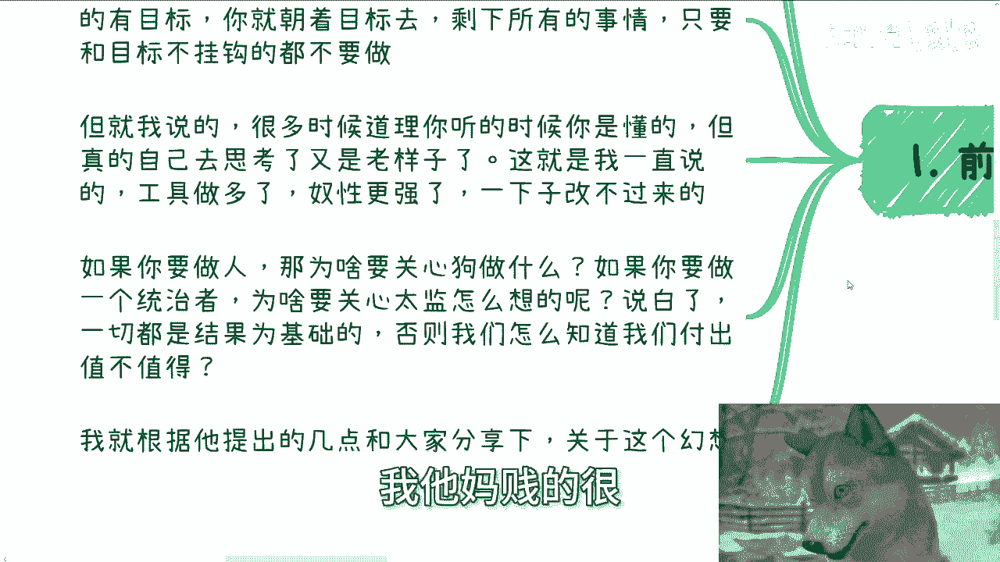
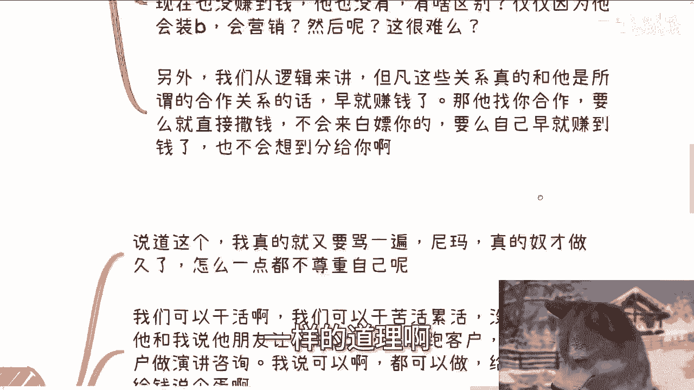
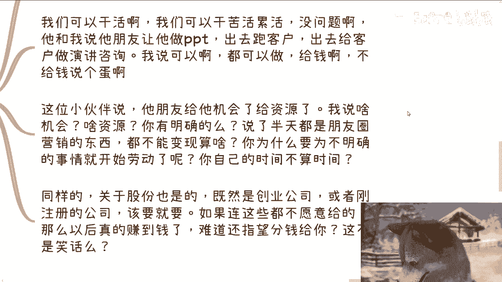
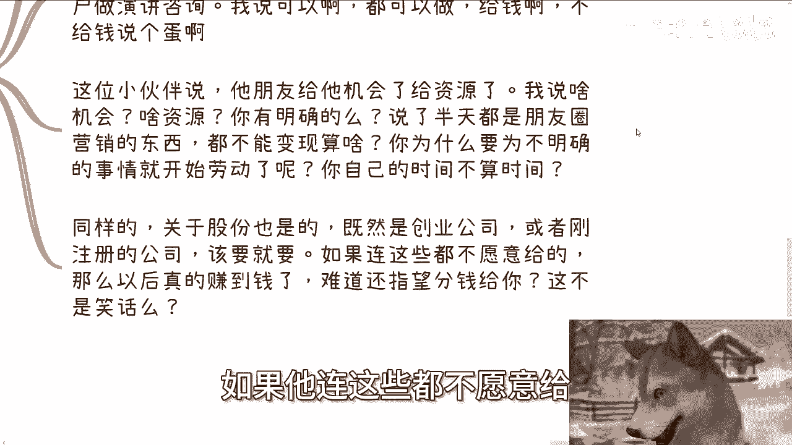
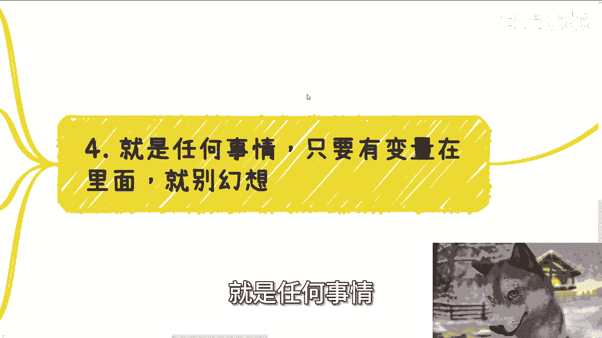
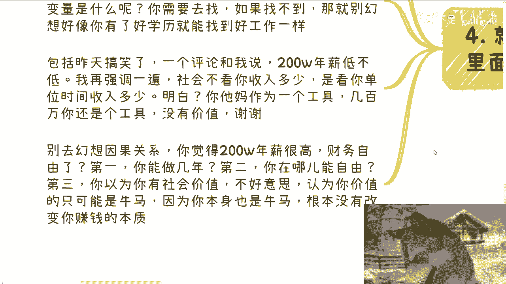
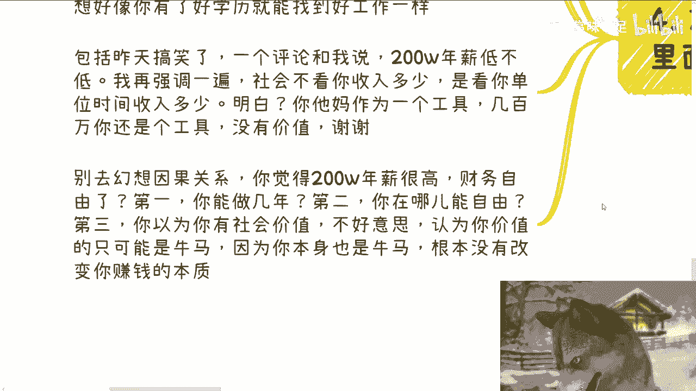

# 大学生建议：放弃一切幻想，才能更接近你的目标 - P1 - 赏味不足 - BV1Em2NYuEqU

好大家好，今天我们来讲的这个呢主题看上去比较虚啊，叫做放弃一切幻想才能接近你的目标啊，呃这个到底什么意思呢，待会详细的内容，反正我会给你们讲啊，啊当然啊你也可以没有目标啊，你也可以一直幻想啊，无所谓啊。

这个呃我只是给你们说一下我的想法啊，那么本次活动已经定了啊，本月19号啊，本月19号就19号是什么时候，下周六吧啊下周六啊，在广州，在广州啊，广州很久没去了，那么本次活动呢三个大的主题。

一个是我会跟大家说一下啊，就不同的企业啊，大厂啊，创业公司啊，国央企的一些offer的选择，另外一个呢就是跟大家同步一下，最近沟通下来的一些最新信息，包括啊投资啊，包括一些避险啊，大方向上面。

最后呢就是我会给大家看一下，就之前2021年我跟政府，还有高校合作的一些PPT啊，还有些word，然后到时候演示就直接给你们看嘛，一边看的时候一边在解析好吧，反正要报名和了解详情的，可以私信我啊。

那么好，那么先说前情提要啊，前情提要呢，就是今天我们得感谢咨询的这位小伙伴啊，让我觉得呢他的问题也非常具有通用性啊，然后呢就出了这么个内容啊，我的沟通中呢其实最多说的一句话是什么呢，就是放弃幻想啊。

如果你真的有目标，你就朝着目标去对吧，剩下的话啊这个所有的事情，只要你跟目标不这个不挂钩的，你就别去做啊，但就我说的啊，很多时候呢道理你听的你听的时候啊，你都你觉得你都懂的啊。

但是自己真的去思考的时候呢，又变成老样子了啊，那这就是我一直说的，就就就工具做多了啊，奴性变强了啊，一下子改不过来啊。

如果那那我我觉得这个话我就说直白一点，如果你要做人，那为什么你要关心狗做什么呢，对不对，或者做一个领导者，那那我们这说统治和领导，并不是说一个组织上面的，就更多的说你希望为你自己活着对吧。

为你自己去做事情的话，那么你为什么要去关心太监怎么想的呢，对不对，能明白吗啊那么说白了一切都是结果为基础的，否则我们怎么知道我们的付出值不值得呢，对不对，这就好像你今天做一件事情，我今天做一件事情。

我们去判断要不要做，那我总归得要先看我是我能得到什么吧，对吧哦，你你说我最后什么也得不到对吧，名啊利啊，我都得不到我，我凭什么做哦，我他妈天生被白嫖啊，我那么贱的很。

对不对啊，那么比如说啊，一些一些人在这个朋友圈或者日常日常当中。

都会有这个营销啊，那这位小伙伴呢提到了他有个朋友啊，日常比如说朋友圈跟这个领导吃饭，那个企业参观这个项目合作那个地方挂牌，对吧啊，那这位小伙伴呢跟他想表达的意思是什么呢，就是啊他觉得啊跟着他朋友做。

至少比他自己从0~1去做来的好啊，OKOK好，我们就来分析一下这个事情啊，他说完我第一句话怎么说的，我我原话我就这么说，我说你知道吗，所有的传销，所有的微商，所有的以前的诈骗也都是你说的这个样子。

你知道吗，你不知道对不对啊，什么意思呢，意思就是说我说微信加的再多，朋友圈营销再多能变现吗，大哥明白吗，就如果不能变现，今天跟谁合影，你想跟谁去做，有吊用啊，就像我以前说的狐假虎威，你得能变现啊。

否则有他妈卵用啊，啊我告诉你不能变现，那叫什么，那叫颅内高潮，那叫自我感动对吧，如果今天他找你合作，就是来骗你的，为什么，因为不能变现啊，那找你合作个蛋呐，啊你们换位思考一下，我今天来找你们合作啊。

陈老师来找你们合作，然后呢说了半天，他妈说半天啊，就无论怎么说，我来找你们合作，我就不跟你们谈钱，然后你跟我说，陈老师这东西怎么怎么变现，我说哎我也不是很清楚，然后呢你们他妈不觉得很奇怪吗，对不对。

你说比自己从0~1强，我完全看不出来强在什么地方呀，你感觉有他妈卵用啊，啊那我当时跟他这么说，我说你现在也没赚到钱，他也没有，对不对，那有他妈什么区别呢，哦仅仅因为他会装逼，会营销哦。

哦装逼和营销很难吗，找些人合影很难吗，你也可以去找啊对吧，我就这么跟你讲，的凑在凑到小米楼下，你就蹲点蹲到雷军出来，或者蹲阿里巴巴蹲，蹲到马云出来，然后的找个狗仔给你们拍张照，有什么难的啦，奇了怪了。

真的是对吧啊，另外我们从逻辑来讲，但凡这些关系真的和他所谓的合作，是合作关系化，或者说大家是有利益关系的话，早他妈能赚钱，对不对，那他找你合作，要么就直接撒钱给你，直接把把他妈钱拍你脸上，跟你说。

哎你来我来跟你合作了啊，比如说这单我给你多少钱，或者这个月我给你多少钱，对不对，他不会来白嫖你的，要么自己早就早就赚到钱，也不会想着分给你的。

你换位思考想一下，赚到钱会想着分给别人吗，来一样的道理呀。

对不对啊，第三，另外关于谈到一些面子上的东西和干活的问题，我跟你讲啊，说到这个我他妈又得骂一遍，哎我真的我跟你们讲，你你就是奴才，他妈做久了，一点自我尊重都没有什么意思，意思就是我们可以干活。

我们可以干苦活累活没问题啊对吧，他跟我说什么，他说他朋友让他做PPT出去跑客户出去，给客户做演讲咨询，我说可以啊，都可以啊，都可以啊，没关系啊，的我给我，我给你洗漱都行啊对吧，洗脚也行啊，给钱啊。

对不对，你不给钱说什么东西了。

哎奇了怪了对吧，这位同学就有小伙伴也说了，他说他说他朋友会给他机会给他资源，我说他妈的，你不要来跟我说空话，你什么机会什么资源明不明确，这个机会给多少钱，那个自愿给多少钱，清楚吗，不清楚。

你说个屁啊啊说了半天，全他妈是朋友圈营销的东西，都他妈不能变现对吧，那我就问他，我说那你为什么要为不明确的时间开始劳动呢，你这时时间不算钱了，不算时间了啊，我早就说过了，就相当于你们很多人做事情。

看到一个什么大佬，看到一个什么有关系的人，就他妈的开始跪下来，有什么好跪的啦，那么奇了怪了对吧，同样的关于股份也是的，既然是创业公司，或者或者来说明显就是刚注册的他妈皮包公司，你该要就要对吧。

你你比如说你说我想要一些额，要要20%股份，要30%股份对吧，我要分红，我要怎么样子，反正那样都是空对空呀，怎么了呢，唉怎么了呢，怎么不能要了呢，对吧，你要我来讲，如果他连这些都不愿意给。

那以后真的赚钱了。

看到钱了，还指望他给你分钱，这他妈不是笑话吗，对吧，能明白吗啊。

好那么诶喂喂喂啊，那么第四个啊，就是任何事情。

你只要发现有变量在这里面，你就不要去幻想什么意思，就是其实很多人有这种想法，就是感觉感觉能做成烂，感觉对方很牛逼，感觉可能能在这里面学习，感觉可能在能在这项目里面能积累对吧，怎么样怎么样，那我就问了。

你学什么东西，你积累什么，你就给我个明确的答案，而且这答案你不应该给我，你是给你自己对吧，你感觉有他妈用啊啊，我怎么奇了怪了，我每次问他们学习什么呢，不知道能积累什么呢，也不知道能赚到钱吗，不知道呀。

那我说都不知道，你咋就就跪下来舔了呢，哎我不明白呢，啊对吧，同样的父母都觉得好学校，好学历就能找到好工作，这是没有直接关系，但的确有间接关系，那么这里面就是有变量存在，那这个变量是什么呢。

你需要去找啊对吧，你需要去探索啊，如果你找不到，探索不到，那就别幻想好像你今天有一个好的学历，就一定能找到一个好的工作一样有意义，吧啦对吧，你包括昨天也很搞笑的一个评论跟我说什么，哎呀呃200万年薪低。

嗯那那个低不低对吧，然后阴阳怪气，他说哎呀，我没见识，是没见识，我告诉你，我再强调一遍，社会不看你收入多少，你明白吗，是看你单位时间内收入多少，做条狗啊，在那边996007赚100万，200万。

你有什么价值啊，你妈搞笑吗，不是在啊。

所以说还是那句话啊，别去幻想因果关系，如果你觉得200万的年薪很高，财务自由了吗，我就问你能自由吗，不能吧对吧，第一我问你，你能做几年，你能控制吗，第二你呢在哪能自由啊，啊996007自由一个。

我看看对吧，第三你以为你很有社会价值，不好意思，认为你有价值的，只只是因为你是牛马或者别的牛马，觉觉得你是价值对吧，就这么简单没了呀，你觉得哪个政治，政治垄断者或者既得利益者，或者资本家会觉得你有价值。

就是个工具人，为什么，因为你没有改变你赚钱的本质啊，你还是在用劳动力换你的钱。

那么搞笑嘞，对不对，好最后啊就是说非常这种啊。

非常多这种我就不一一列举。

说白了这位小伙伴他咕咚到最后他还来问我，他说在团队里面做什么岗位比较合适，我说大哥他妈重要吗，你只要关心一件事情，而且我说不单单是你所有的人，只要关心一件事情，赚钱或不赚钱没了，来问我做什么岗位。

不就好像在在说唉，我他妈的唉这个狗的这个这个跪舔的姿势，怎么个姿势比较合适，的哎对吧，就是我逻辑说到现在跟你们讲的很清楚，你要做一个人，你就好好去关心赚钱，你要做条狗，什么姿势都行，你不要来问我。

你也不要去问别人什么姿势好不好。

对不对，有什么好问的呢，那奇了怪了，真的是对吧，我还是那句话，如果都是打工人，都是工具人，就不要再分369等了，有什么好分的啊，大家都是同，就是大家明明是站在一边的，大家明明是是是怎么说呢。

就是大家明明是同一个这个老板，就是在在老百姓的这个群体里面的，我们之间为什么要去在在互相再去分区，分369等呢，有意义吗，那对不对，其实就如我说的道理都懂，但是他自己一旦思考了嘛，马上就回到解放前。

你知道吗，就奴性十足对吧，所以我一直说能不能赚到钱，本身跟你们认为的那些，比如说学历啊，认就是技术啊没多大关系，最大关系是你思维模式对吧。

啊我为什么强调这件事情啊，就是因为我到现在为止，我说实话，我他妈的，我默认我对每个人看，我都是当他人看的，但是你知道吗，最离奇的是他们自己不把自己当人看，就是我来，我一直在跟他们强调哦，你们要站着对吧。

你们要当个人去做一件事情，他们非要来跟你纠结，哎我我我我我这个做条狗对吧，我这个姿势哪个姿势比较合适，唉我他妈我真的是啊，所以我觉得还是那句话，你要没有目标，那随便啊，也不关我事，你要有目标。

你就放弃所有的幻想，脚踏实地的朝着你的目标去做，你知道吗，就是你但凡没记没有，就是如果你有目标，但是你又不想对吧，就是脚踏实地去做了，或者或者说不想，就是说啊，就是从赚钱这么直接的方式去做的对吧。

你说我非要就是说哎呀，感觉跟着大佬们做做些什么积累对吧，那你去做，那随便啊，但是我还是那句话，这当中你要么就好好做，要么就是不也也不要内耗，不要到最后就是说啊做梦也不好好做的，内耗嘛，非要内耗的对吧。

前面也赚不到的啊，然后到最后还要抱怨人家坑你，那奇了怪了，头上长角的，人家为什么要坑你啊，怎么不坑别人啊，对吧我也我还是那句话，很多时候坑一个巴掌拍不响啊，你心中有多少贪念，你自己想想看。

咳咳咳好吧啊行啊，我就说这么些啊，然后那个19号那个活动啊，在广州你们要参加的或者咨询的呃，了解的你们自己去私信我，然后剩下的话就是说职业规划啊，商业规划就是职业上上面就是工作上面。

商业规划就是呃副业啊，赚钱啊，或者其他的一些呃叫什么，指那个那个你业务的规划上面啊，或者说融资啊对吧，股权啊，或者跟别人怎么合作啊等等等等等，你要是觉得需要跟我沟通啊，然后呃结合你们个人的一些情况。

给你们一些更接地气，或者更符合当下那个国内外发展的，这么一个建议的话，你们可以整理好对应的个人问题跟个人背景，好吧，我们再来做咨询啊。

