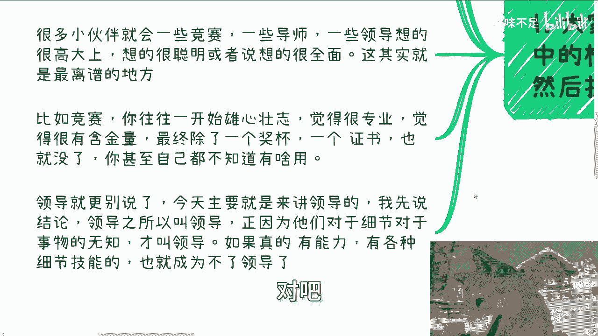
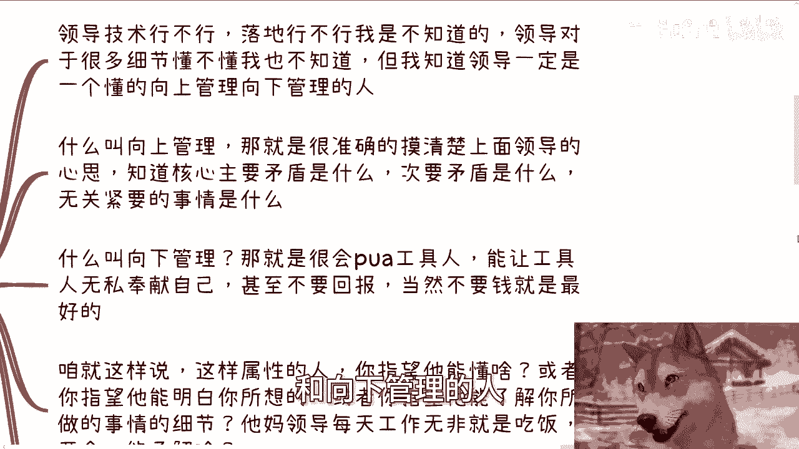
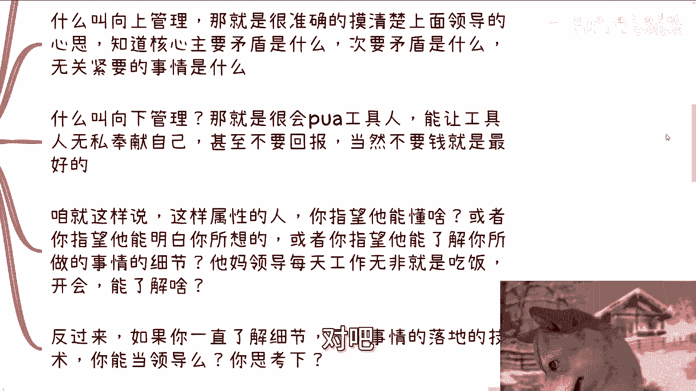
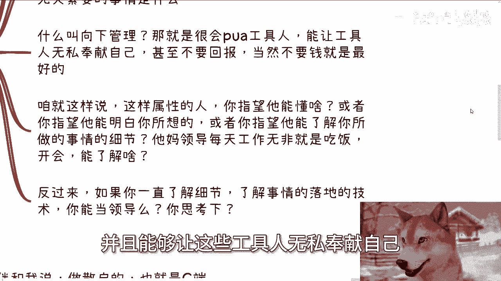
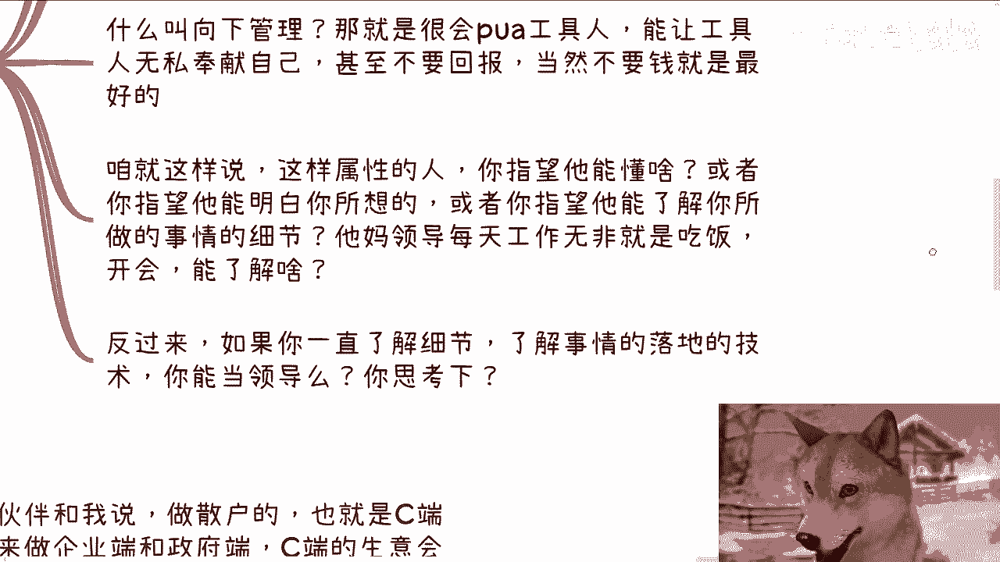
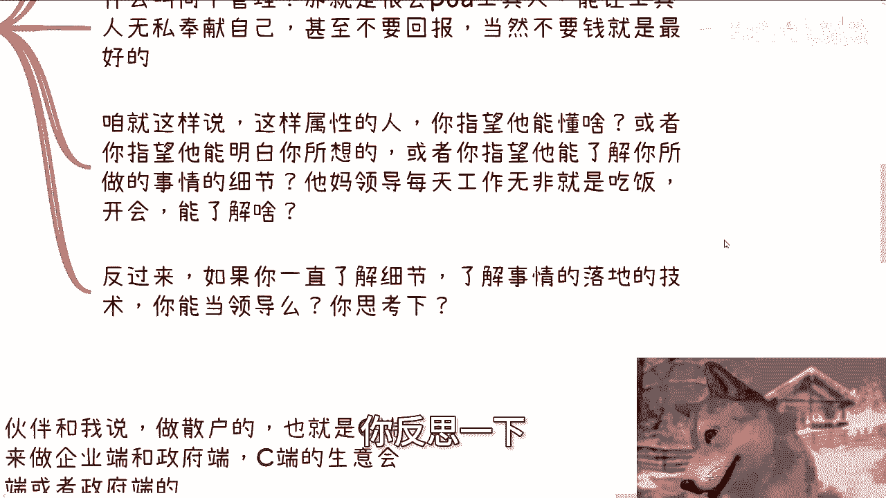
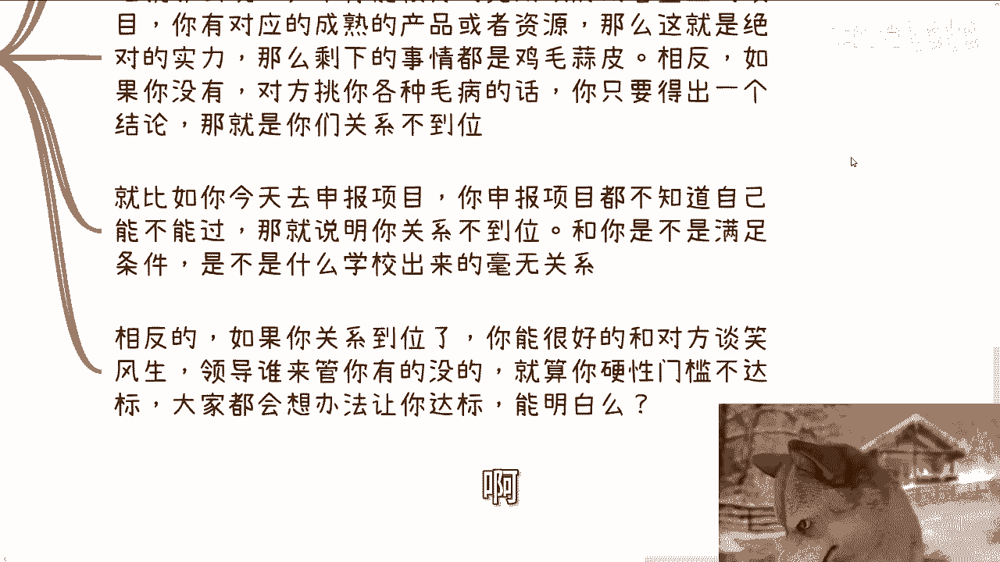
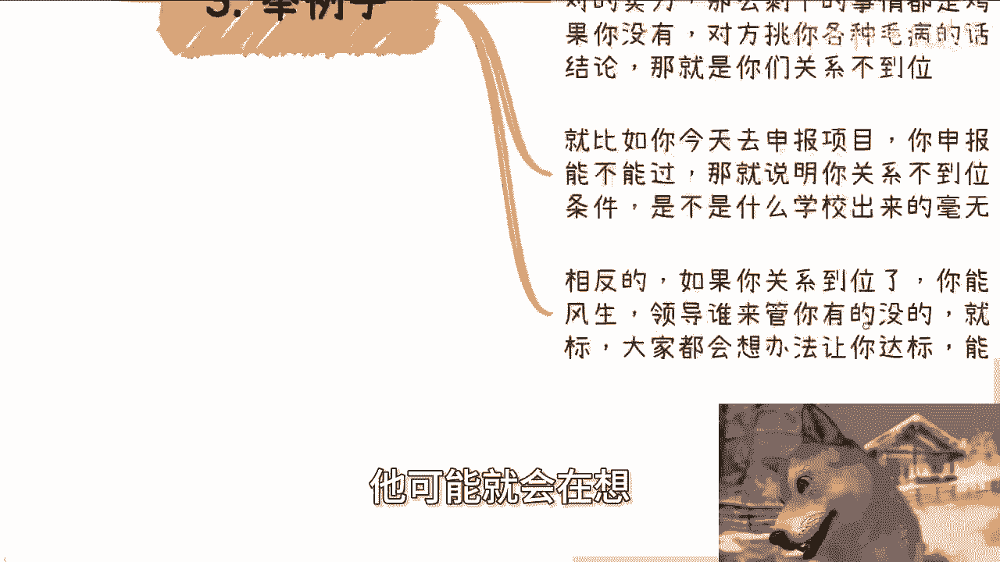

# 大学生建议：领导根本就不会想那么多或者多专业，否则就不会是领导了 - P1 - 赏味不足 - BV1xRseehEy3

啊大家好啊，这个今天我们讲的这个充电的视频呢是家长，老师领导啊，根本不会想这么多呃，他们也没有专业性啊，否则他们就不是领导了啊，也不是家长了，也不是老师了啊，为什么很简单啊。

我先在这个地方先跟你们大概说一下啊，家长生儿育女对吧，要做牛马吗对吧，要做牛马吧对吧，要打工吧啊要照顾老人吧对吧，那什么，否则什么叫家家长啊，是不是就是咳咳年龄放在这，那么同样的我们就说啊，要顾家啊。

要顾上要顾下，上有老，下有小，还要提防着，是不是不要被别人骗对吧等等等啊，他要做牛马，那我就问你让他怎么紧跟市场，你让他怎么紧跟行业，你让他怎么有专业性，对不对，这他妈是人吗，老师哈。

我他妈就更别说了啊，在学校里面，我不管他是什么老师，什么教授，千篇一律对吧，送走一批又是一批这样的学生，那样的学生，要么就是他妈的带带带学生来骗经费的，你指望他能有什么专业性，哎我他妈奇了怪了对吧。

两耳不闻窗外事，一心就想着坑学生，你告诉我有他妈什么专业性，领导就更别讲了对吧，我以前就说过，一天到晚就是只有开会，只有写报告，只有开会，只有写报告，吃饭喝酒的这么一些行为，你能有什么专业性。

我就告诉你们，你们现在就算是个人才，你们去了，你们如果未来是领导，一年后，两年后你们就是个，就这么简单哦咳咳，所以说嘶你们千万不要对家长老师领导啊，有什么很大的这种什么幻想啊，那么你们这种幻想呢。

就会让你们错误的去评估啊客户的需求，那么首先啊。

大家往往把对方都想成自己YY当中的样子，然后开始内耗跟焦虑。

随后就开始抓不住重点，我之前就跟大家说过，在绝对的实力面前，一切的花里胡哨都是没有用的，比如说你今天就是能够帮助企业，帮助政府啊，帮助高校帮助领导能够去完成他们的KPI对吧，也就是说完成他们的项目啊。

那么同样的我不管是因为你的项目，你你的团队特别好也好，还是说因为你的出价特别低也好，还是说因为你跟这些领导的关系特别好也好，我不关心哪一个，但凡对方觉得你是能满足他的需求的，那么你的学历，你的性别。

你的长相，你的你你的应酬，你的所有的行为都是花里胡哨都没有用，那么反之是什么，反之就是如果你没有这些关系，你不能满足对方的KPI，那么你的学历，你的性别，你的长相，你的应酬再做的花里胡哨也没有用。

能明白吧啊当然还有小伙伴很天真的问，那他妈如果既然自己不行，为什么对方还要接受别人的请客或者送礼呢，哎那我觉得很奇怪啊，我就这么问你，如果你是一个既得利益者，你是个领导，别人送你东西，你也没逼人家。

有要白不要啊，有药不要猪头三啊，是不是嘛啊，你以为TMD都跟你们这么有良心啊，对吧啊，那么很多小伙伴呢就会为了一些，比如说一些竞赛啊，一些导师啊对吧，把一些竞赛啊，导师啊，领导啊想的很高大上啊。

想的很聪明啊，或者是想的非常的全面，这其实就是最最离谱的地方，你比如说竞赛，很多人往往一开始雄心壮志啊，觉得他妈的老专业了啊，觉得含金量老高了，你但凡过了一两年，34年五六年，你再回过头来看。

除了一个奖杯，除了一个证书卵用没用对吧。

你甚至自己都不知道有什么用啊，那当然领导就更别说了啊，今天我们主要就是在来讲领导啊，我先说结论，领导之所以叫领导，就是因为他们对细节，对于事物的无知才叫领导哦，如果他们真的对细节，对事物是有知道的。

有能力的，有各种细节能力的，有技术能力的，我告诉你，不好意思，这种人成为不了领导的，唉就这么简单啊。

第二首先啊我们先说领导是什么概念，领导技术行不行，我不知道啊，领导落地行不行，我也不知道，领导对于很多技术细节懂不懂，我更不知道，但是我知道一点，领导一定是一个懂得向上管理和向下管理的人。

否则他成为不了领导，就这么简单，什么叫向上管理，那就是很准确的摸清楚上面领导的心思，知道核心主要矛盾是什么，次要矛盾是什么，知道轻重缓急应该先解决什么，后解决什么对吧。

知道所有无关紧要的事情是什么，那么什么叫向下管理，那就是很会PUA工具人，能够把所有的人都当做工具人，并且能够让这些工具人无私奉献自己。

甚至不要回报，无限的去加班，当然不要钱，那是最好的，咱就这么说，这样属性的人，你指望他能懂什么，或者你指望他能明白你所想吗，你指望他妈的，你他能够在乎牛马吗，啊你指望他能了解你所做的细节吗，不是扯淡吗。

在对不对啊。

领导每天工作无非就是吃饭，开会喝茶还能干嘛，你还单能了解啥。

对吧啊，反过来就像我一开始说的，你一直很了解细节，一直很了解事情落地的技术，你能当领导吗，你反思一下。

我给你们讲，对不对啊，第三我们来举个例子，我之前上周吧我跟一个人咨询的时候，我也跟他说过，我说因为他是个做开发的，做嵌入式的，我就跟他说啊，我说你记住一点，在中国做技术的服务永远不如做宏观的服务啊。

他就问我，为什么我说你有没有想过做系技术的服务，谁说了算，往往技术说了算，你领导要说了算，有有可能吗，有可能的，但是领导说了算，你能报上多多就是多少的预算呢，对不对，你跟领导说，哎领导啊。

我们这个技术多么牛逼，多么牛逼，有用吗，领导听得懂吗，没有用的，之所以宏观东西能报上价，之所以那些高大上的东西能报上价，就是因为领导觉得唉领导听得懂，领导觉得哎好像有道理，但是你拿技术东西，你跟领导说。

哎领导我今天要去要给大家对吧，做一个什么啊，叫叫叫，比如说我随便举个例子啊，比如说我们要采购一套数据啊，然后采购一套模型，能够更好的帮助我们做什么，大大语言这个模型的训练，然后呢你跟领导说。

哎领导我要批300万，领导他妈在想了，你这他妈什么鸟毛技术，30万最多了，对不对，要么就不批对吧，但是同样的你跟领导说啊，我们今天对吧，有一个什么东西啊，这个东西比如说能让我们啊这个呃就怎么虚。

怎么来嘛，能能和谁合作对吧，能谁来给我们做背书对吧，然后怎么让我们能够很了解，比如说海内外的市场，或者能够很清楚的去对接到啊，比如说某些很高端的资源或者怎么样子，没问题啊，你300万500万。

600万800万，他他也愿意出啊对吧，那么我们要明白一点，就是说所谓的费用越高的东西，你是需要职级越高的领导来批的，而职级令越高的领导，你指望他懂技术，不是天痴人说梦吗啊。

那么这次活活动上也有个小伙伴跟我说，他说啊，楚老师，我以前做散户，也就是做C端生意，如果未来做企业端或政府端的生意的话，那么C端的生意会不会影响我未来去做这种，政企的这种服务啊。

我说那你为什么觉得会影响做政企服务呢对吧，他说领导会不会觉得，他以前是做一些很零散的这个业务啊，很过家家就感觉他已经很不专业，我说一方面，领导他妈的根本就不懂你在做什么东西。

另外一方面领导他妈吃饱了撑的啊，来关心你以前做什么事情，太把自己当个人了，你也太把领导当个人了，对不对，咱就这么说，如果你能很好的完成政府或者企业的项目，你有对应的成熟的产品或者资源。

那么这就是我说的绝对实力对吧，那么剩下的事情都是鸡毛蒜皮的，相反如果你没有，对方，只要挑挑你各种毛病毛病，比如说哎呀你现在年纪小啊，比如说哎呀，你现在这个公司成熟呃，成立时间不够哎呀。

比如说你以前做C端散户生意，我们觉得你不够专业等等等，我告诉你所有的借口，你只能得出一个结论，那就是你们关系不到位，这些都他妈是屁话啊，别当真啊，别当真，那么再举个例子，就比如说今天你去申报一个项目。

你申报项目都不知道自己能不能过，那说明什么，那说明你关系不到位，和你是不是满足条件，是不是软件条件硬性条件满不满足，一点屁关系都没有，和你什么学校出来也没有关系，相反的，如果你关系到位了。

你能很好的和对方谈笑风生，对不对，领导谁来管，没有人来管你，有的没的，就算今天你真的硬性条件门槛不达标，大家都会想办法让你达标，能听得懂吗，啊听得懂吧啊啊那么有的人呢可能听到这啊。

他可能就会在想。

陈老师，你太过绝对啊，那我今天就告诉你，在社会上，我刚刚所说的这些就是百分之百的，就是这么绝对，你没有，我跟你们讲这么讲，你但凡只要碰到一些，尤其是国央企，尤其是跟我国政府有关的一些东西。

绝对就是这么吊吊样子，你不会出现第二种可能性的，一点可能性都没有的啊，那么第四在乎细节，在乎牛马是成为不了既得利益者的。

也是赚不到钱的啊，也就是说你总是抠项目的细节，技术的细节，团队细节，人的精力是有限的，你抠这些细节，你自然就不会有大局观，你就不可能更多的去了解上面的人的想法，自然你就无法转到更多的钱。

那当然你也可以跟我说，陈老师，我不愿意去跪舔人家，没问题啊，那我就问你，你现在有有有什么资本，你几斤几两，你如果来说也没有资本，你爸妈也没有积累，或者你自己也没有积累，那不好意思，你只能跪舔人家。

还能怎么样啊对吧，世界不围着你转，咳在乎牛马的，我跟你讲，就别更别说了，你必须清楚的认知到所有人都是合作，和你没有任何感情上或者情怀上，或者来说朋友上的这种这种关系不存在的，你在乎任何个牛马。

你在乎任何工具，你未来只会让你无法往前去走，只会让你更多的失信于你的领导，就这么简单啊，不要跟我说谁谁谁做商业啊，什么哎呀，这个人对吧，某某某品牌很在乎的，我跟你们讲过。

几乎所有的团队都是有人唱红脸唱黑脸，唱黑脸的，在乎又如何对吧，我不关心在乎不在乎要商业拓展，要赚到钱，必须有一个人或者有一个团队，是从资本家或者政治家的角度去布局，去做战略的，而不是他妈的变成一个奶妈。

或者说一个一个一个慈善家的角度，不存在的，明白吗啊不存在的，不要来跟我说啊，以前某某某创业，某某某大佬对吧，怎么样怎么样，他他性格很好，他很在乎，然后呢，然后呢，那又怎么样呢，那照你们这么个说法。

我我这样说好了，我在前面当慈善家，我后面雇个人，雇个人去杀人放火，然后呢在你们看来什么哦，很好的，非常好啊，卧槽nice啊，真的我告诉你们睁开眼睛看看世界好吗，看看社会好吗，对不对，嗯好吧。

那就这么着啊，呃今天我觉得这个想表达的核心我也表达了，反正你们自己多想想好吧，那么剩下的话就说职业规划，工作上面啊，商业规划呃，副业啊，赚钱啊对吧，这个股权啊，融资啊，合同啊啊业务方面啊。

你们等等有任何的不清楚的或者任何问题的，呃，你们整理好对应的个人问题和背景好吧。