# 大学生／刚毕业怎么在社交中给别人留下深刻的印象 - P1 - 赏味不足 - BV1mC4y1f7ze

哦大家好，我是狗子，笑死行啊，我来说一下啊，这个大学生啊，刚毕业的对吧，怎么在社交社交当中啊，给别人留下深刻的印象是吧啊，这每天问我的人老多老多了啊，我跟你们讲啊，首先9年制义务教育加高等教育啊。

成功的让你们每个人在商业上成为了一个婴儿。

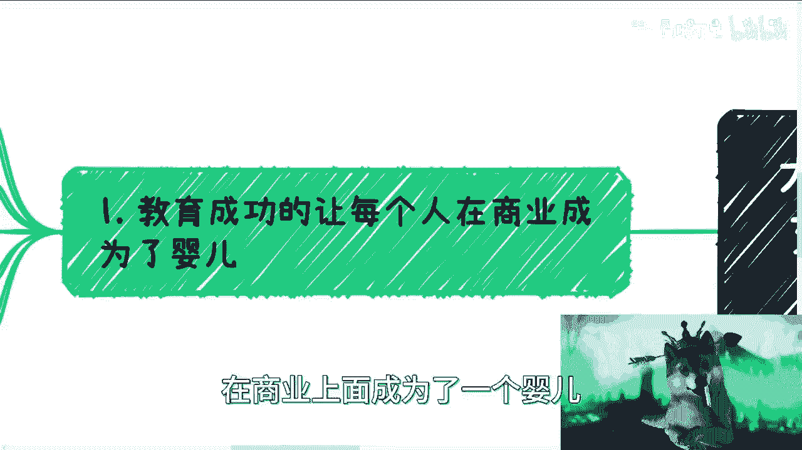

对吧，我跟你们这么说啊，不管你们工作多长时间，也不管你们什么岗位啊，只要你们自己不涉及到商业，只要你们不涉及到整个的商业的上下游闭环，你们就是不懂的，你知道吗啊，别来跟我说他妈的，我在什么公司里面。

什么P7P8了，我就懂商业了，你懂个屁，真的是连公司注册都不知道，还懂商业呢。

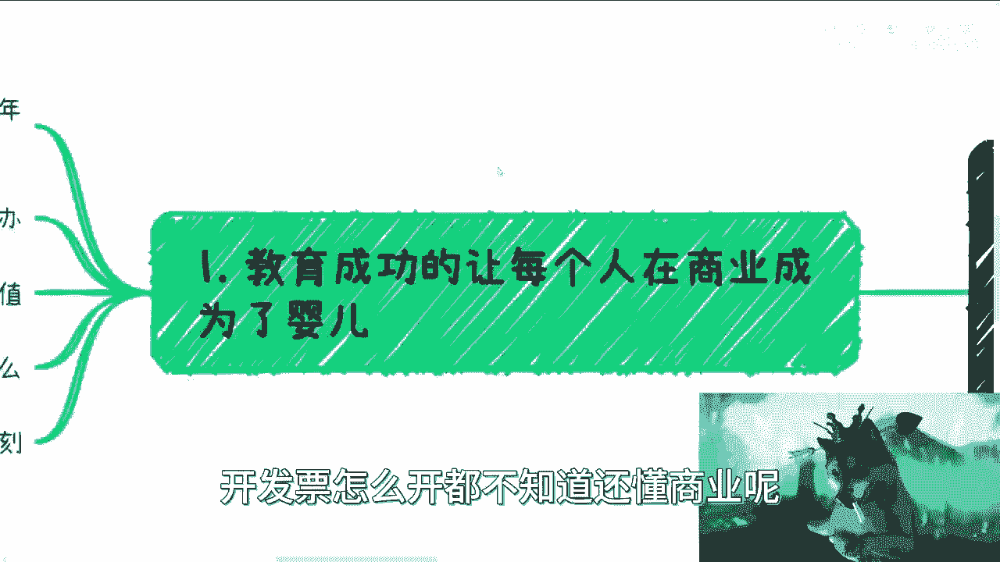

懂啥啊，首先啊，我现在得到反馈最多的就是我是大学生啊，或者我还年轻啊，那么别人不我怎么办对吧。

然后呢说我什么都没有啊，我应该怎么办对吧，然后我不知道自己应该有什么价值啊，我应该提供什么，以及我应该怎么让别人深刻印。

印象深刻，对方好，我们来看啊，首先第一点啊，第一点你需要表达，而且你需要完整的成熟的表达啊，我们叫做放长线，什么意思呢，就是说就像你们问的，就是说我们茫茫人海当中。

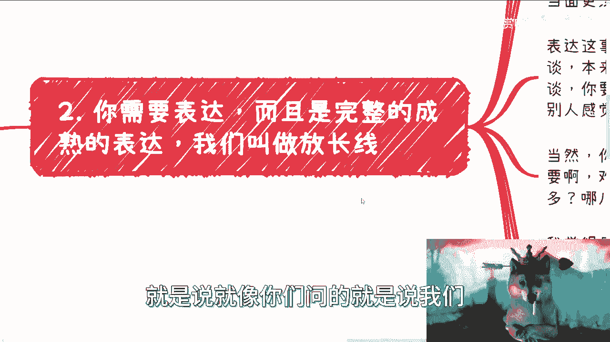

你要让别人对你有印象，对不对，那有印象当中的第一要点是什么。

就是你要有一个完整的自我介绍，这没毛病啊，还有一个是什么，就是你得主动社交，但是你要明白你去社交做介绍，你想啊你跟别人沟通，你的话术，你的语调，你的气场，不同的这种气场跟你在那边朗诵总不一样吧，对吧。

首先就是说你要在气场上，你表达上需要落落大方，需要不胆怯，需要有自信，对你说，你不懂你什么都没有对吧，那你要装的有啊，对不对啊，那你跟我说我不行啊，我装不了，那装不了就别赚这个钱，那拉倒对不对。

你没别的路啊，关键是就就我跟你们讲，我现在过渡下来，我觉得很有趣，就有很多人说我做不了，那你做不了，我能说什么呢，对不对，那要大家就说要你要这么想啊，整个全世界这么多人，他要跟你说，哎我这个做不了。

我这个做不了，我又想成功，有问啦，可能问了对不对啊，很多小伙伴跟我咨询的时候，我跟你们讲啊，语音就因为我我我们不用视频啊对吧，我没有视频干什么呢，就语音我都觉得不自信，你知道吧。

你更别说就是就是这种线下的当面的社交了，我就想都想得出来肯定不行啊，这是第一点，第二点表达这个事啊，其实我觉得更多的在于你是否能够侃侃而谈，就本来大家日常的社交都是来虚的，什么叫来虚的。

就是你跟一个人萍水相逢对吧，你说我在一个会场或者在什么活动认识你们，沟通最多也就23分钟，45分钟你能拾到什么样子，你是上来问他，哎，这个夹板性能怎么优化，你说对不对啊，你肯定就是大家稍微装叫叫商业上。

这么叫做秀秀肌肉，什么叫就是肌肉，就是装装逼，对方什么叫装装逼啊，就是吹对吧，你要能弹，你要会弹对吧，但是你不能把这个泡泡吹破啊，就这个do你得掌握好，对不对啊，但是你要先给别人的感觉。

就是你要open哦，同时你还要让别人感觉到你懂很多的样子，这个就跟就妈的，这个就跟我去做咨询培训是一样的，你知道吗，就是你说有很多人问我，他说啊这个数字经济对吧，那数字经济我们也没看到有完整的课程。

那陈老师你是怎么学的，我说我没有学，我到哪去学呢对吧，我只能说我把我认为的数字经济，我把我从各方，比如说政府啊，资本啊，企业啊，创业者啊对吧，等各方所得到的信息，我把它汇总起来，然后根据我的理解。

我会出一套数字经济的课程，那你说我有说我知道东西一定对吗，没有说我只是做个歇尔，对不对，我没有跟大家讲，我讲的一定是对的，不对不对，你们自己判断对吧啊，那当然你说任何的事情都要有准备。

所以你是谁并不重要，你知道吗，你你别老去PUA自己说，因为我是个大学生，因为我不是个大学生，或者因为我已经浪费了十多年，这没有因果关系呢，难道你是个大学生就一定懂得少吗，或者难道你不是个大学生。

工作十多年就一定懂得多吗，但没有这种因果关系的，我不知道大家这个逻辑性当中，这种因果关系怎么来的。

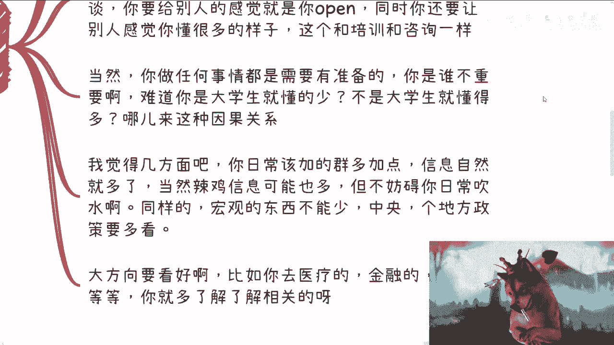

对吧啊，我就告诉你们，我在整个的商业过程当中，我见到过很多年纪很轻的，老牛逼，老牛逼了啊，我自愧不如，我是，对不对，这跟人家是不是大学生一点关系都没有啊，啊那我觉得几方面，一你日常该加的群。

该弄的该该去沟通的人，我为什么跟你们说交流那个社交，就是因为就希望你们这个信息能够获取，面试来的更多一点，虽然的确有很多垃圾信息，但是这不妨碍你日常吹水啊对吧，你要想啊，你在不同的级别。

你在不同的level，你吹的是不同的水对吧，那么你面对一般的那种活动啊，社交啊，这种合作方，我觉得这种垃圾信息足够你吹水了，没问题的呀对吧。

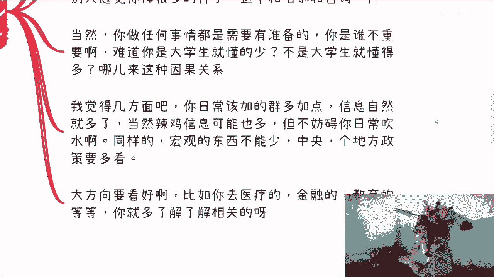

同样的宏观的东西不能少，比如说中央啊，各个地方啊，你政策你要多看报告，你要多看文件，你要多看，你知道吗，就是说我们说的话术，我们说的很多东西，对方为什么我现在越来越跟你们强调数字经济。

是因为我从下半年开始，各地方政府内部的人员也好，领导也好，告诉我的内部都在谈这个东西，那我就会跟你们谈对吧，那这个词不是我造出来的，是中央这边提的对吧，那你同样的你大方向要看好啊。

对方你比如说你要去做医疗，对方你比如说参与医疗，参与金融，参与教育等等等，那你提前得要了解了解到相关的东西吧对吧。

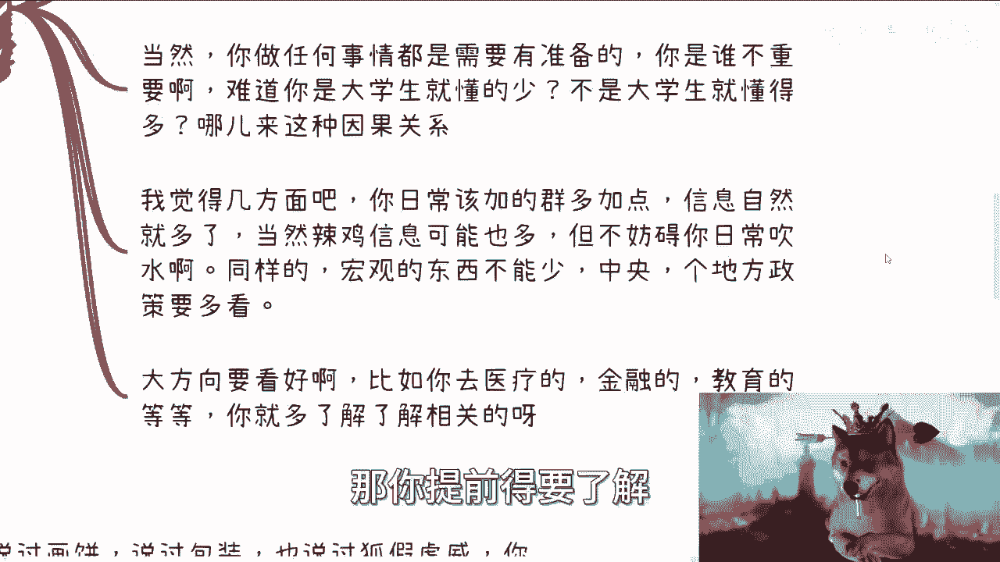

那么这个我们后面来讲啊，会来讲的，那这是第一点。

第二点你需要有资源，我们曾经说过画饼，说过包装，说过狐假虎威，对方这几个关键字，你可以到我的视频里面去搜，对方列表里面你都搜得到的对吧，但是你需要印象深刻，还有一点是什么，你就必须要有资源。

那但是如果你从实际角度来讲，大部分个人是没有资源的，那怎么办呢，你个人最容最容易积累的资源是什么，就是活动对吧。

我把这只猫放大一点啊，就是最容易的就是活动，就是沙龙对吧，你说我自己办过两三场活动，每场来了四五十人，这不就是资源吗对吧，我跟你讲这种资源人家蛮看重的，有一说要蛮看重的啊，这是第一个。

第二个当然从虚的来讲，你也可以不办对吧，什么叫虚的，就说我为什么告诉大家，你们要去多接触人，就是因为你接触多了对吧，你比如说有的人是做技术外包的，有的人做电商的，有的人做医疗的，有的人做游戏的，有的做。

有的人做投行的，有的人做政府产业园的，有的做高效的对吧，有的做医疗的诶循环了，是不是啊，那么你之前出去接触别人，你这不是你之后出去再接触别人，你就可以说自己的业务很多，对方当然你要选择性的说。

你别无脑的跟我一样，巴巴巴巴说出来，对不对，你你你见什么人说什么人话嘛，对不对，你去参加医疗的，你就说唉，我这边可能正好有以前有，有以前是做过医疗的这个外包，或者做过医疗的这个器械。

对方或者做过生物医疗对吧，其实你要告诉他的是，你其实你身边有什么资源，但是你又不能告诉他这个东西是你的资源，就是你不能让对方感觉你是个拉皮条的对吧，但是你为了让对方印象深刻，你不得说一点东西吗。

那你说呗，对方后面有如果有合作，有什么东西，咱们再去说，你知道吧，到底是你去找外包，找乙方去合作，还是说你自己先跟这个乙方合作完，把产品包给甲方，还是怎么说，这个这个后面再讲嘛，对不对啊。

你别考虑这么多啊，啊我就发现就是大家想的太多，就是就你知道吗，就是就是我我这两天咨询，我就跟人家一直说是什么呢，就是你要想的多是吧，你要觉得良心过不去对吧，可以的，你先赚到钱了。

再良心过不去啊啊你知道吗，就最近你们我告诉你们就咨询我的人很神奇，就是那种你明明已经被别人当做什么，就是连工具人都不算，你知道吗，连他妈老黑奴都赚的比他们多啊，就是被别人踩在脚下面摩擦的那种。

然后自己赚不到钱，还要还要这个帮维护别人，还要跟别人说句谢谢啊，哦然后关键你知道是什么吗，赚大头的，比如说赚95%的人，良心很过得去，人家赚的很开心，赚他妈5%的人，然后跟我说，哎呀陈老师。

我良心过不去，我也不知道怎么说法哈，你爱赚不赚啊，要你要我说就是什么，你活该，你赚不到钱。

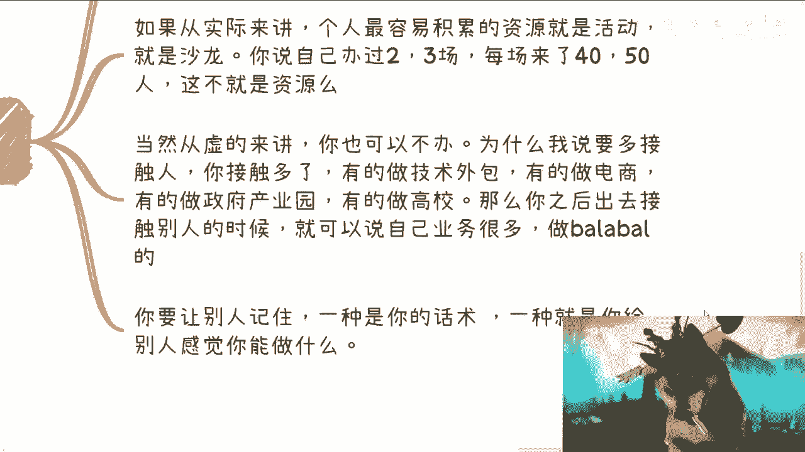

对不对啊，好这第二点你要让别人记住，一种是你的话术，一种就是你要给别人感觉你能做什么，对不对，好这两点啊，第三点你要大概懂得怎么做。

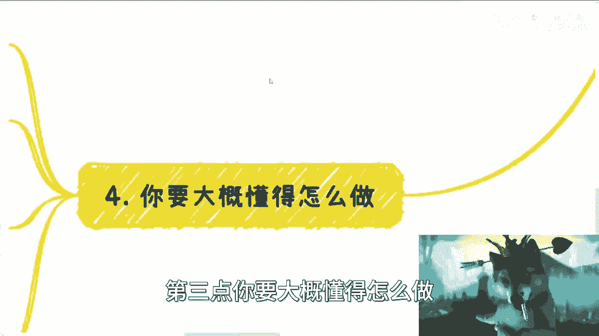

什么意思啊，除了我们刚刚说的一二以外，还有一个很重要的点，就是你要懂得大概怎么做，很多人也会问他说万一聊了两句，穿帮了怎么办对吧，你说比如说就像我们说的，哎呀我我这边能做医疗器械啊，能做这个什么金融。

对方能做什么东西，然后人家肯定会问啊对吧，往下问啊对吧，那么呃对呀，你们都已经读到大学了，你们的逻辑性用你的脑子去想想看啊，那别人穿帮怎么办呢，当然穿帮的前提是你得提前去了解哦，你说我又要去积累关系。

我要让觉得别人觉得我很牛逼，我又不愿意去学习，那你想怎么滴啊，对不对对吧，所以我才已经跟你们讲了，你们去多了解啊，你多去跟别人聊，看看别人是怎么吹的，你管他真的假的，你也照搬吹呗，对不对，你就对。

烟花葫芦总会吧，没看没吃过猪肉，没看过猪跑嘛，对不对啊，你看我这个叫什么啊，没去吃过米其林，我还没在米其林门口逛过吗，我还在我还没在米其林打过工吗，是不是啊，那我的确没打过工是吧啊当然实在点的啊。

还是需要大家自己去了解，比如说啊你说企业与企业合作大概怎么做对吧，这个单词为什么给你不给别人，你去谈怎么谈对吧，你PPT要写怎么写对吧，但这些东西你要大概了解的呀。

比如说你去一个一个领域的某一个领域的活动，那么这个领域的产业的上下游是什么，它里面可能有哪些角色，你总归也得知道的呀，对不对，你比如你是一个金融会议啊，那么你至少要知道一级市场是什么，二级市场是什么。

期货是什么，量化是什么，资产配置是什么，高净值家族产业管理是什么，保险是什么，你等等大概运作流金融，我知道吗，你否则你怎么谈了哦，人家跟你说说两嘴，你跟别人吹哎呀，我这边提供一级市场，二级市场。

然后人家问两嘴，你就不知道了，那你是穿帮的呀，对不啦，就就你也要有付出的，你不能想着说哦，驴老师说对方空对空的，我就是空对空，那你空对空，你得有能力空对空的，你以为空对空这么容易啊。

所以你要让别人印象深刻，还有一个很重要的一点就是你开口聊东西，你要让别人觉得专业啊，当然是不是真的专业，你也看人对吧，我们打怪也是总归慢慢的打了，升级是慢慢升的对吧，你比如说你跟我讲。

我可能会觉得在BULSHIT对吧，但是你让一些活动，一些现场人，你要让他们觉得专业就够了呀，无所谓的呀，对不对，你从商业角度，从任何一个环境角度，不就是大鱼吃小鱼，小鱼吃虾米吗，这叫商业呀，对不对哦。

你们要赚钱吗。

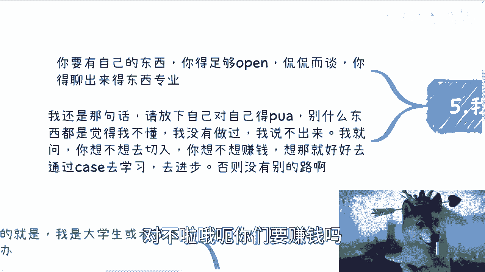

赚钱的上来跟我谈良心，是吧啊。

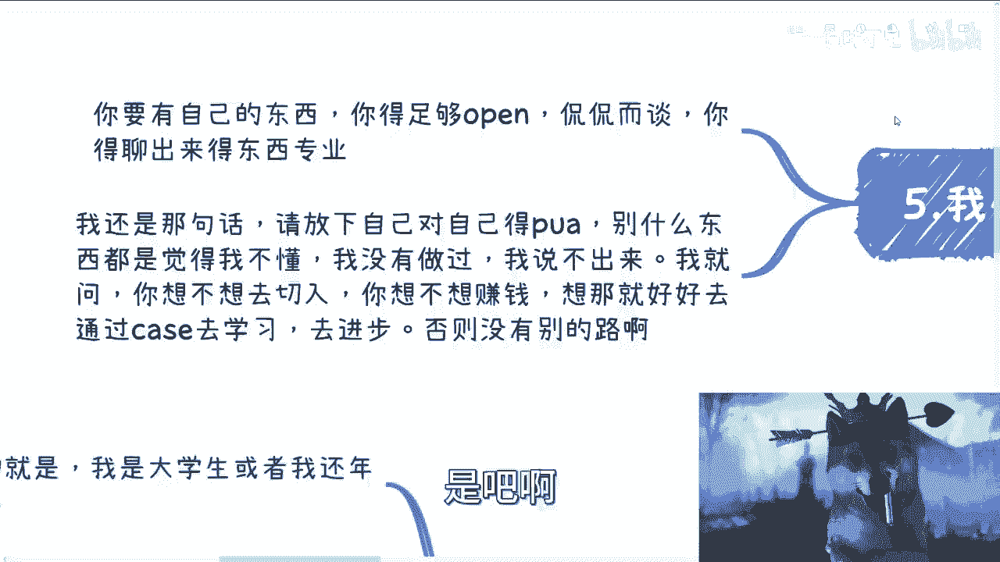

我总结一下啊，我总结一下就是你要有自己的东西，你同时得足够open，你要侃侃而谈，你的气场要足，你得聊得出来点专业的东西，ok perfect啊。

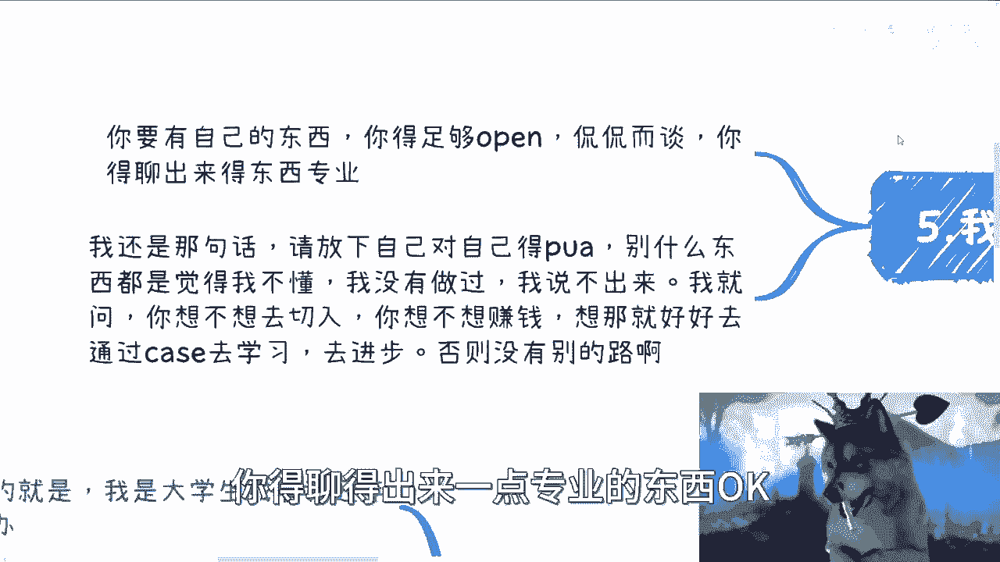

而且我还是那句话，你请放下自己对自己的PUA，别什么东西都自己就跟自己说，哎呀我不懂，我没有做过对吧，我我说不出来，那你别赚钱，有什么好赚的，对不对，我就问你想不想钱，你想不想赚钱。

你想就好好去通过case去学习，你知道吧，去进步，没别的路啊，我跟你们讲啊，真的很搞笑的，之前还有期视频，下面评论区你知道吗，就出来一个很搞笑的评论，他说我以为这个视频是教技术的。

没有想到是教是教大家如何虚的，唉我也是搞笑嘞，你技术能赚到钱的了，你不虚，你怎么切啊，你不虚你怎么切，商业对了，你要但凡就是所有的人，但凡跟我说，你没有别的路，那你就走啊对吧，那我为什么说这些。

不就是因为老百姓没别的路吗，哎我操，真的是，我明明讲真的，每次我看到这种言论，我就我就在想他妈的我我我是我贱。

我真的是贱啊，这就我以为我跟老百姓站在一条线上面吗，老百姓不买我账，对吧啊，还要来还要来嘲讽我啊，这个这个这个人对方不讲实的东西哈，我也是搞笑的，实的东西，实的东西不赚钱啊，谁他妈讲实的东西啊对吧。

就像我一直跟你们讲的，我从来不来跟你们说啊，我我这么想看，我做了这么多视频，我从来没有任何一个视频跟大家讲啊，打工应该怎么打，对不对啊，这专业应该怎么做啊，这领导嘛不是应该怎么拍，没用的呀。

因为不赚钱了没有意义啊，何必呢，对不对，那每个人就活一辈子干嘛呢，我们又不欠他们的，凭什么是不啦啊，行就这么着吧，我看我讲了多久了，哎大差不差啊好吧，我觉得这三点就够了啊，但是呢就是说这只是个开始。

就是你们做完，你们还要有什么有一个PDF的自我介绍，word的自我介绍，好吧好吧，然后你后面就说别人再跟你沟通，你得想好你后面应该怎么去做对接，到底是拉皮条的对接呢，还是说你自己注册一家公司。

做乙方难还是怎么样子，你知道吗，就是整个链路你都要想好，当然你不懂没关系，你可以找一些你趴在那，你可以找一些懂得趴在哪，来来来来来来跟你合作，可以的呀，你不要老想着什么事情都自己做好不来啊。

行那就这么着啊，那个好吧，然后大家要是职业规划啊，然后搞钱副业对吧，然后包括商业啊，包括就是说你们想知道就有些水下的东西，对方包括政策啊，包括其他东西，反正就是说公开上面不方便讲呢，好吧。

你们呃都可以整理好问题，然后整理好自己的背景，自己的一些内容好吧，然后私信我好吧行，那就这么着吧。