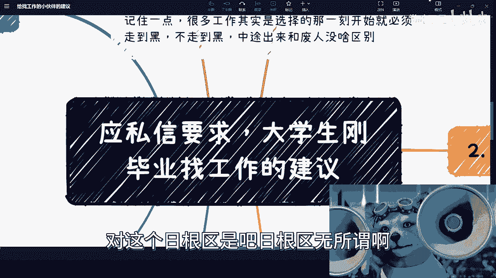
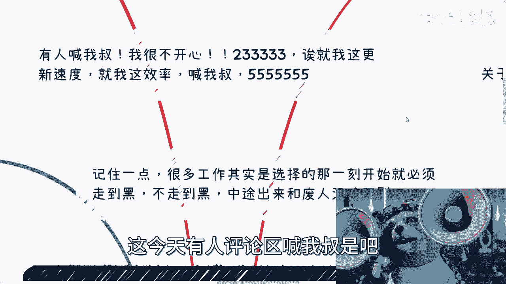
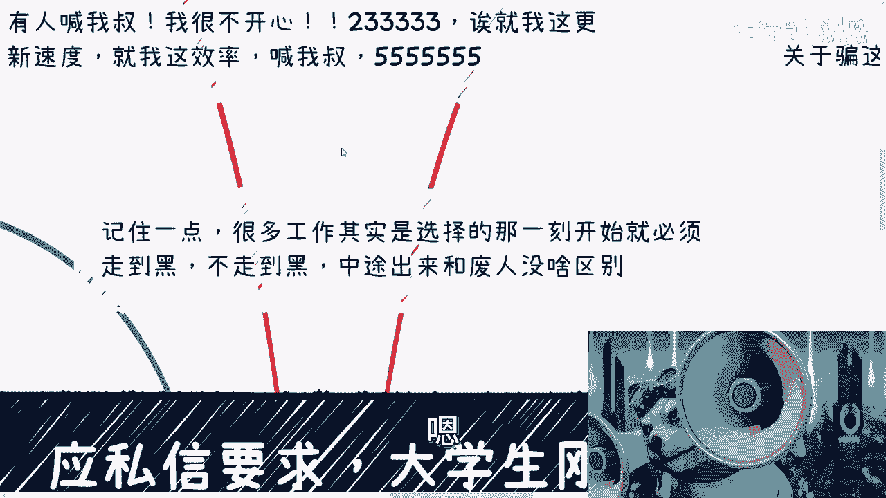
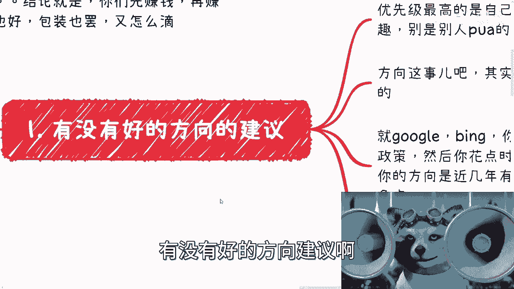
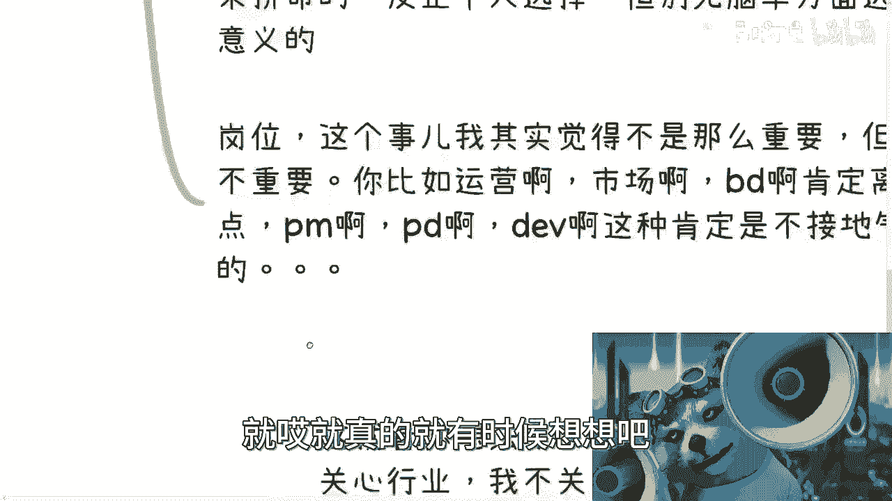
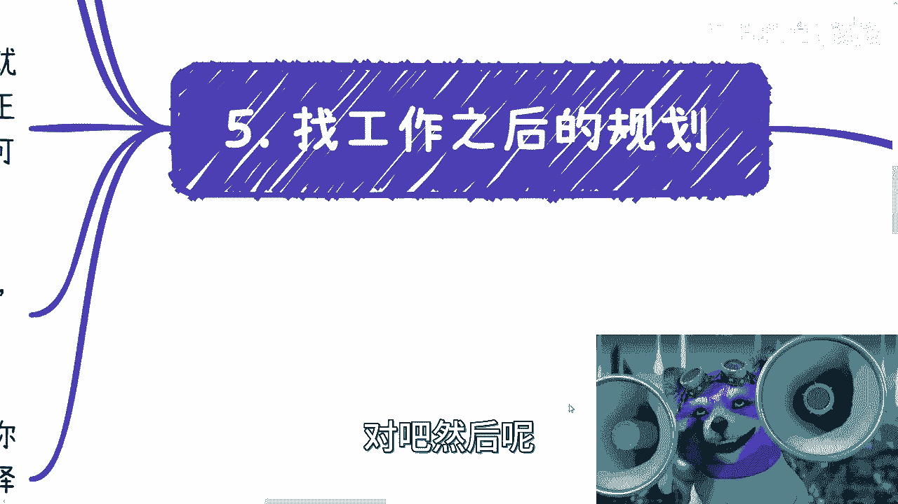
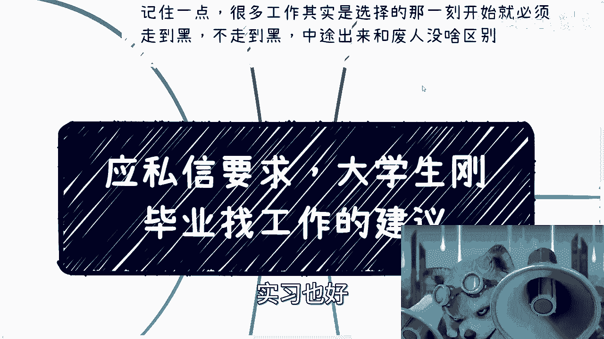
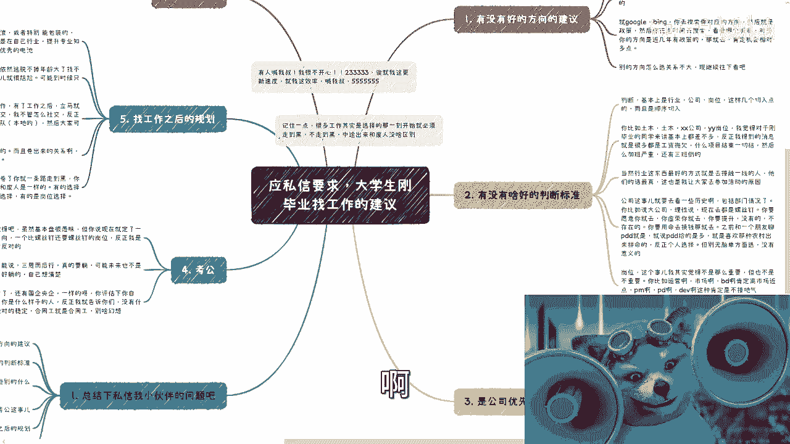
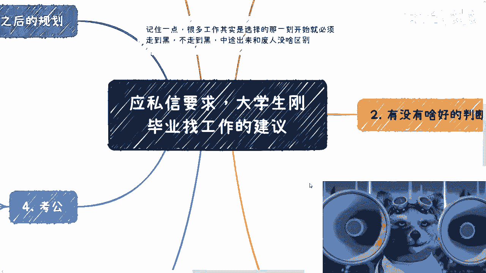
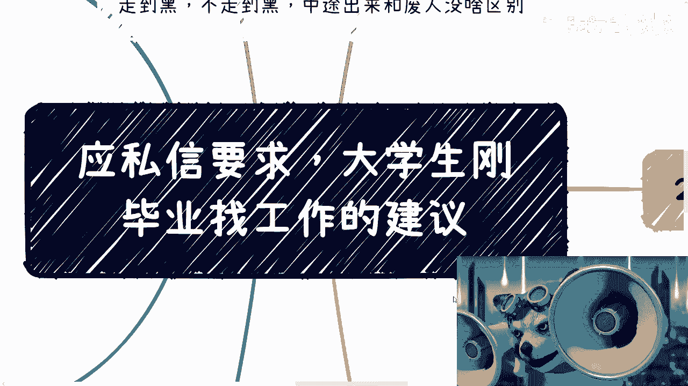

# 大学生／研究生毕业找工作思路整理 - P1 - 赏味不足 - BV1eX4y1p7CA

这个日更区是吧，日更区无所谓啊。

诶等一下啊，我诶可以啊，日更区哎看随缘对吧，这个因为呃私信嘛也有小伙伴在说嘛，他说大学生对吧，准当时问题是说给准大四的这个同学，有有一些建议，我想了一下，其实准大四的同学建议跟找工作了。

我觉得没什么区别啊。

所以索性就就写这个内容啊。

首先呢我有几个事，我在这个地方提一下，今天有人评论区喊我书是吧。

我很不开心对吧，我这就我这更新速度，我这效率喊我叔啊，你看到哪个书有这种效率的是吧，然后这是第一点。

第二点啊，工作这个事是这样子的，就是你要明白当下跟以前不是一件事啊，也就是说很多工作你们一定要三思而后行啊，别就是说啊，就是这个父母说好对吧，周边人说好，怎么样就好对吧，那这个怎么说呢。

就是很多时候你要明白你选的那一刻开始，你就必须走到黑，你知道吗，你不走到黑，你中途但凡出来我跟你讲，你大概率跟废人没什么区别，真的我就没夸张啊。

你知道吧，然后呢我跟你讲，我跟你们说分享个事，最近我还很搞笑的事情，就是很多人关于骗这个事很在意啊，就是问我，他说这个算骗呢，还算包装呢，哎呀我跟你们讲啊，我在这里说个结论，结论就是啊你们先赚钱好吗。

在赚到钱赚赚到钱之前啊，就是你说片也好啊，包装也罢，又怎么定呢，对吧，就我跟你们讲啊，就是大我觉得大大部分人诶，我的字呢哦在这儿啊，就我跟你们说啊，就是如果连这些事情你们都要去纠结的啊。

什么什么到底是骗还是包装这种东西去纠结，有什么好纠结的呢，你知道吗，就是我们是这么讲当下整个经济社会，当下经济整个的情况，你赚到钱再说啊，别来这个去纠结这些有的没的东西，所谓做大事者不拘小节，你知道吗。

就这些事情连小节都算不上，好吧，我真的真的，我跟你们讲，你要汪峰，我以前脾气真的疯了，这种人我直接拉黑了，你知道吧，没什么好说的呀，有什么好说的呢，对吧哦好总结一下这个我要讲的几个问题啊。

第一个他说啊这个有什么方向可以建议对吧，第二个呢有啥好的判断标准啊，第三呢他说是工作背景优先，工资有限，还是说是就比如说这种公司大小优先，对吧啊，然后考公考公这事我本来不想讲，我后来想想算了。

反正差在当中对吧，反正审核应该也不知道啊，然后那个第四个第五个就找工作之后的规划，还有未来规划啊，这几个东西啊，嗯一个个来说有没有好的判断标准呢。

哼哼哼我标标的我自己都忘了啊，有没有好的方向建议啊。

首先我觉得优先级最高的对吧，这个这一点我是很认同张雪峰说的，就是所有东西以你们兴趣爱好为主，好吧，呃你得先明白你兴趣好不明白的，就假装这一条没有就叉掉好吧，就叉掉啊，但是呢别是别人PV的啊。

别别是别人灌输给你的车拆掉啊，假装没有这一条啊，那么方向这个事情呢，我觉得是这样子的，其实啊我觉得在这片土地上面，我是很看重这个趋势政策跟城市的什么意思呢，就是说你们花点时间。

我相信以你们这个大学生的能力啊，花点时间你google一下并一下，你去搜索一下你对应的方向，关键用关键字啊，然后这个对应的政策嗯，关键字空格城市啊，或者什么什么嗯，什么什么什么。

就就就比如说啊关键字空格城市空格政策对吧，那你看吧对吧啊，你花点时间去搜索，看看哪个城市对于你的那个方向，近几年是有政策的，我跟你讲，那就去对吧，那你相对来讲机会肯定多一点，你知道吗。

那别的方向这个怎么选，我觉得其实关系就已经不是那么大了，你知道吗，因为因为本质上就是，你今天去份工作，你要这么想，不管是环境还是你的leader，还是你的这个mental，还是你的上级的上级对吧。

还是说你的公司的这种规划，所有东西其实你都是不可控的对吧，那既然你不可控，你为什么一定要这么纠结，于就是说就是说我们说的这个叫什么，就什么好的方向上面没有什么好纠结的对吧，那当然啦就是我觉得嗯。

你要说就说有有没有区别，有对吧，但是你从这个长时间来讲没有这么大的区别，那么你说有没有什么好的判断标准呢，我觉得是有的啊，判断标准是这么判断的，首先就是从这么几个点大到小，就行业公司岗位对吧。

这么几个点去切入嗯，你比如说啊他说有很多人说哎，我也不知道找什么行业对吧，那我就跟你讲找个通用性强的，那什么叫通用性强呢，你比如说金融对吧，尽管对吧，这个计算机你我我不用管什么计算机什么什么。

你说计算机行业上上行也好，下滑也好，不重点，你再下滑，你计算机的的的整个扩展面，总比你别的很多行业好吧啊，总比你很多别的这种专业也不叫专业吧，就是很多行业出来好吧，因为你有很多行业出来。

他局限的很死很死的，而且而且我跟你讲，行业这个东西是这样子的，就是计算机整个行业，你到时候再去怎么转行，再去怎么拼，你有很多种方式，你知道吗，而且我这么我这么说吧，就是你回头真的要去骗对吧。

真的要去包装你计算机好包装，你跟我讲，就是你现在如果做个实验，你回头包你包给我看看你失业怎么包对吧，你包个屁，我跟你说，你知道吧啊那么你比如说像土木，土木现在几乎跟我聊过所有的人，我这么说。

我接触面不广对吧，但是跟我聊过的人，百分之百都跟我说，他要转行对吧，不管做什么，比如做做做呃，这不管做什么都是转行，那么你就想比如土木吧，土木行业查查公司，查找岗位，我觉得对于刚毕业的同学来讲。

基本上有什么区别啊，对不对，你要么就是公司拖欠，要么就是项目结束在一起结啊对吧，要么就是加班严重，要么三班倒有什么区别呢，没有区别的对吧，那这个就是你你行业方向上面，那么然后呢这个行业的东西啊。

就是最好的方式就是是什么呢，你们再去选择之前，我为什么一直跟你们说参加活动，就是你们去选择一个活动，然后呢去接触这些一线的人，你知道吧，你比如说你要接触互联网，那你就去找拼，多多找找BT，对不对。

找字节，然后别去找那些你看上去卧槽很牛逼对吧，有什么有什么title的对吧，人或什么功成名就的，没有用的，他们都被西方洗得很厉害的，你要去找去找那些年轻的刚入职的，你知道吧。

什么路最好是录制什么刚转正的这种，他最有话语权，你知道吧，你就去找他们多聊一些，你就知道现在一线到底什么情况了，对不对，然后公司这个市场，我觉得你要去看一些历史对吧，包括就是说我说的历史不是国家历史啊。

我说的是公司历史啊，就包括部门情况，你比如说大公司的理性说对吧，你现在大公司基本上都已经是0~1，很完善了对吧，1~61到80都很完善了，你现在去都是螺丝螺丝钉对吧，你当然了。

这个东西遵循自己的个人意见，你要愿意去，你就去，你要觉得虚荣对吧，我就为了虚荣，我就要一个大大公司的title，那你就去无所谓对吧，我跟你讲了，我不建议大家去，你非要承认你去，对不对啊。

你要提升我没有的，你别想了，不存在啊，很很明显对吧，你要跟我说，你要用命去换钱的可以，那你就去拼多多对吧，你比如说拼多多，之前我跟我朋友聊的时候，他就说嘛，他说拼多多hr最喜欢什么，最喜欢农村出来的。

为什么拼命不不跟你逼逼别的什么，你跟他说什么加班可以的，没问题的，加对吧，你拿个帐篷住公司也没问题，住这好了，别逼逼，你知道吧，然后公司评论拼多多最不最不喜欢招的是什么，就本地人啊，对不对啊，矫情啊。

反正我跟你讲个人选择了对吧，但是呢就是说你得想清楚，别无脑去选择对吧，就是别无脑就说啊，我就为了进大公司，我就为了进国企，我就为了进央企，我也不知道就怎么说呢，你要是赌气对吧，你要是觉得要有面子。

我跟你讲嗯，以后这个叫什么叫做出来混总要还的对吧，以后还都是你自己还啊，你有的苦了，我跟你讲啊，岗位这个事呢，我觉得其实就是说本质啊，从大局上面没那么重要，但是呢也不是说完全不重要啊，你比如说运营啊。

市场啊，销售啊，他肯定离市场近对吧，什么那个那个项目经理啊，产品经理啊，开发啊，那肯定是不接地气对吧，就这个地方呢我得提一点啊，就是说的确啊，真的真的我跟你们讲很多项目经理啊，产品经理啊，开发啊。

然后什么运维对吧，就是就是技术岗的，然后还有一些什么什么出解决方案的，你知道吗，就是就常年在公司里面做，他他不跟外面接触的人嘛，我就发现就是就是他们未来真的，比如说呃不想做了，或者想换行了。

或者被优化了，他出来之后我可能说的不太好听啊，就是就跟废人没什么区别，你知道吗，就是你看他一个30多岁的人，他的认知可能跟人家十八九岁大差不差，没什么区别啊，这个行业当中，你说某某东西。

比如说呃开发产品啊，它有经验吗，有的，但是在社会层面的这个社交啊对吧，公司啊，商业啊对吧，包括这个人际关系啊，他还不如人家十八九岁的人，为什么为什么，因为他年纪大了，他也没这个魄力，也没这个锐气了对吧。

你还没人家十八九岁愿意，那个那个来的会冲，你知道吧，就唉就真的就有时候想想吧。

惨也蛮惨的啊，这个是二三呢。

就是公司有限还是公司有限啊，我觉得这个事呢是这样子的，这就看你想法啊，看你的人，就比如说你跟我一样，对你更特别浪啊，浪浪的很啊，这个随便编是吧，你比如说你比如说我根本就不关心行业，我也不关心岗位对吧。

我有能力做到销售量啊，我表示我这个能力，我有自信通过包装去各种各样公司，那我跟你讲，你就公司优先不管的呀，你就到处浪，也管他干嘛了对了，完全没问题的对吧，那你比如说我就是先工作对吧。

马上呢我要开始积累自己的行业经验，就是我的这份工作就是我的副业对吧，我自己需要去积累我的业业务和人脉关系，那你就公司优先了，怎么完全没有问题啊对吧，综合来讲啊，我觉得现在这种市场。

因为现在的市场就两个字就多变，而且而且没有人能预测未来怎么变对吧，那么你既然面临这种市场，什么大厂嘛，都是螺丝钉岗位，小厂嘛可能都不知道做几个月就要倒闭的对吧，你工作优先没毛病，落袋为安嘛对吧。

那当然了，这个东西具体K400K具体分析，但是综合来讲，我觉得不亏，而就是不亏，你随便怎么讲就是不亏对吧，嗯那有人要问了，他说特别好的机会呢，我跟你讲啊，什么叫特别好的机会，除非今天就是一份劳动合同。

写好，写在里面给你写好，你觉得哎这个公司不错，这岗位也不错，给你写好，3年五年不可能辞退，有吗，有的啊，你我跟你讲，有的不是没有的哦，我这么说就告诉你们是有的对吧，那没问题。

那但凡只要是普通劳动合同算了，我跟你讲，都他妈是北，有什么用啊，我跟你们讲，跟我咨询的人哎呀，说的好多了，什么什么学校让他去找当老师，什么5年内多少万，你知道吧，然后什么还有什么，就是哦做个什么岗位。

然后几年内什么升到什么岗位，我说滚都他妈画饼，滚，我说我说他妈到时候跟你说这句话的人，都他妈不知道滚到哪里去了，你妈的还信这种屁话，你说是吧啊，呃然后是考公啊，这是悄悄的讲，悄悄讲。

我觉得啊虽然基本盘很愚昧啊，但你说现在就定一个方向啊，你你你要考公对吧，一个比螺丝钉还要螺丝钉的岗位，反正我是绝对反对的啊，当然这个尊重大家意见啊，尊尊重大家意见，我只能说三思而后行，你真的要躺。

也不是这么个躺法啊，而且我也明确跟你们讲，未来可能不是那么好当的啊，你们自己想明白想清楚啊，绝对不是现在这个年代，绝对不可能再有一个你爸妈那个年代，所谓的铁饭碗，我给你明确告诉你们没有，就这句话啊。

你们随便怎么搞，我不管你们搞到哪里去没有啊，呃然后呢，在这个里面我突然想起来哦，还有一件还有个分支路线，就是国企央企一样的，你评估一下你自己，你是怎么说呢，你上面有没有人，你左边有没有人。

你右边有没有人，你下面有没有人对吧，你什么背景啊对吧，你这个什么你你什么你什么背景对吧，跟跟我那个贾冰那句话怎么说来着，在是吧，你是什么样的人对吧，我就告诉你们没什么对绝对的稳定，你要是个普通人。

就认清楚，别抱有任何幻想，你知道吧，合同工就是合同工。

你知道吗，明白这句话吧，我只能说到这了啊对吧，然后呢嗯找工作之后的规划。

我觉得我要说一下的啊，首先呢我觉得如果不是特别能浪的啊，不是特别能包装的，你要么就想好你去改啊，改成那种特别能浪的，那也没问题啊，呃如果改不了呢，我觉得你就好好打好技术基础。

就是就在你自己所在的行业提升专业知识，就说白了你要去做一个优秀的电池，但是话又说回来，就是说大部分的人，其实普通人从金字塔逻辑来讲，他也不是说所有人都能做一个优秀电池，如果所有人都能做个优秀电池。

那可能大家也没这么焦虑，你知道吧，那那么不过呢就是做好一个优秀电池呢，依然逃不掉年龄大了也找不到工作的可能性啊，所以说呢这件事也很尴尬啊，可能到时候你只能支持变现啊，但是我可以明确告诉你们。

为什么这个地方有三个点，就是因为知识变现也没这么好变现啊，对吧啊，这个同样的，所以我建议啊，无论什么工作，你有了工作之后立马去找小伙伴，立马去社交，我不管你怎么社交啊，我不这个不重要。

你自己就是卖出迈出这一步啊，反正就是最好组成自己的小团队，尤其是在本地的，因为跨地域一开始的这个工作其实蛮难的，而且更何况你对别人还不了解，没必要容易被骗啊，呃然后大家也可以讨论怎么搞钱对吧。

这个我觉得是很重要的，从综合角度来讲，现在当下这个阶段啊，就是嗯两三年吧不要去卷工作，因为卷工作是没有尽头的，而且你你去卷工作，永远有人比你，永远有人比你更卷，你知道吧，这个就跟我们在外面找外包做公司。

做做做项目是一样的，就是我跟外贸说，我说我预算就20万，你知道吗，那么这个时候有人跳出来15万，就有一定有人会跳出来说12万，有人跳出来说12万，就一定会有人跳出来说10万，你知道吗，就你往后卷我。

我说不好听点，你往后卷笑的笑，笑出声的是资本家对你们有什么好处，没有好处的呀，对了，而且卷出来的关系，卷出来的积累不是你们自己的啊，所以这个地方呢我要点一下，刚刚一开始说的这一点，就是很多事情呢。

你卷了你就是一条路，你要么就想好一条路走到黑，但是大部分年轻人你想不好的呀，对不对，我敢打赌两三年内你们肯定要反悔的，你们肯定要后悔的，你知道吗，就是你但凡不走到黑，你中途再出来，你很尴尬的。

你又没有在校生的身份，你又没有行业积累，你又没有商业积累，那你告诉我你出来干嘛对吧，你不但要跟同龄人去卷，你还得跟当年的应届生去卷，你想想我跟你们讲，你们想想你到时候过了几年之后，你再想想看现在的你。

你就相当于跟你们现在的你去卷，这就真的很离谱，你知道吗啊，有的选择呢是公司的选择，有的选择是行业选择，有的选择是岗位选择，什么意思啊，就是说有的时候公司选择了，你也可能要走到黑某一条某一个行业呢。

它可能很难转行，而且他选择面很窄，你也只能走到黑，有的岗位啊也是非常的冷门啊，你就像前两天前两天还有人跟我说什么哦，内部培训，对内部培训就说什么金融公司内部培训。

我说这岗位真的这岗位比螺丝钉还是螺丝钉啊，就就可能在你们公司认跑出去就没人认了，你知道吧，就是现在有很多岗位都是那种四不像的啊，就是你说你在做内部培训，那你跑出去，你说我要转个什么培训讲师对吧。

或者咨询讲师，那你对商业也不懂对吧，你对行业也不懂，那你怎么搞法对吧，你只对你们公司产品懂，那你这个怎么弄没法弄的呀，对不对，然后呢这里还有一个就是未来规划，我觉得未来规划这里呢是这样子的，未来规划呢。

按照啊按照当下的情况啊，我个人啊认为啊所谓的职业规划是没有意义的，就是我觉得安东尼亚这个情况，为什么没有意义呢，就是说你就顺其自然哦，当然不是说规划没有意义，而是说你自己无脑的在里面规划没有意义。

就是说你要仅仅有份好的工作，有份好的机遇，那你就去抓住对吧，那抓住的时候你就抓，你也没什么好规划，不规划的，对不对，然后我觉得你要但凡没有这个机会对吧，那你也没什么好做职业规划的。

你说啊我现在从一个大头兵啊开始做啊，你就说啊做大头兵，做两三年啊，做个leader啊，做leader，这做manager，我就问你这种计划定出来，你别说我不信，你自己都不信，对不对。

你现在我就你现在定重点规划出来，你自己还得问他，哎呀，这两年后我还在不在这公司，这两年后这公司还在不在啊，这两年后这行业还在不在对吧，你怎么怎么弄，你告诉我你这规划做的有什么用呢，对吧。

你们自己去看看全网，我相信现在说我这种职业规划人其实很少很少，为什么没什么好规划的呀，你规划的再好，你归你规划的再完美，你顶挡得住，变化了，挡不住的呀，对不对，所以我觉得我觉得未来规划是什么。

就是你要么就是主业副业一起走，要么就是把主业当副业，你自己去积累关系，对不对，要么就是要么就是说你跟我一样，就是也没有什么主业副业，你就多多条线去搞钱对了，多条线去去去去有收入。

然后去平衡你的风险就结束了呀，然后那我们打个比方，有很多人说他说驴老师，那按照你这说法以后就不工作了，我也没这么说，就如果5年后，6年后的确经济好了或者怎么样的，没问题啊，大家再去毕业吗，对啊再再去。

比如说有红利期对吧，某一个行业我靠特别好，这个这个薪资嘎嘎嘎往上面往上面拉，那你就去就医，对不对，你要是觉得你救不了业，那在嘎嘎嘎的这么一个行业里面，你你你在里面搞一些这个中间商也好，搞些别的东西也好。

我相信你也很能赚钱的呀，没毛病的呀，对不对，就是其实这两个要做的是什么，我觉得就是积累，别的不重要，你知道吧，你拿以前的思路再去想，已经没有用了啊，就是积累，然后厚积薄发，等待一个新的东西出来。

我就这样子的嗯。

对不对，好不啦，我觉得就这样子，就是你们现在就是大四出来，就大四出来实习也好。

大四也好，包括就是研研究生毕业也好，我觉得就是工作本质上都是，这就是我基本上就是这点建议啊，那当然你们因为每个人都有，每个人的特殊情况嘛对吧，有的人你像现在跟我咨询的，有的人就是家里有矿对吧。

有的人家里家里是有生意的，有的人家里是，比如说有这种固定资产或者固定收入的，那每个人情况可能不一样对吧，那么到底怎么去做，怎么样子也OK啊，但是不管怎么样，我觉得就是可以去想，就是我们或者大家开脑洞。

有很多商业模式怎么做，而不是说就是比如说非要跟我说，我得去卷，因为就是就是很多人不是这块料，你非要去卷卷了，这不就浪费自己时间嘛，对不对。

好吧，我觉得差不多吧，就工作上面，反正就是你们做一个选择呢，只要有依据好吗，你不要到时候说就是啊，那这个人说的对吧啊，说这个行业好，那么驴老师说的这个好了，那个人说这个好，我跟你们讲都不要信。

没什么好信的，你们一定要自己去实践，自己去找人了解，嗯对吧，就互联网都发展到今天了，你们找人了解信息还难吗，不难啊，对不对，就唉我觉得就是懒就是懒，你知道吗，好吧嗯行吧，就这么着吧啊。

那那按照以往的惯例啊，我最后说一句啊，就是今天你们听到这个视频的大学生啊，或者来说研究生呃，大部分我敢打赌啊，大部分就是但凡不做好自己规划的未来，你们就是韭菜，你们就是炮灰，你们记住这句话啊。

不用急着反驳我，反驳我没有用的，因为你们是炮灰和韭菜来割你们的，绝对不会是我。

好吧，就这么回事，哎呀行吧，就这么着吧啊这个你要是有任何细节问题的。

