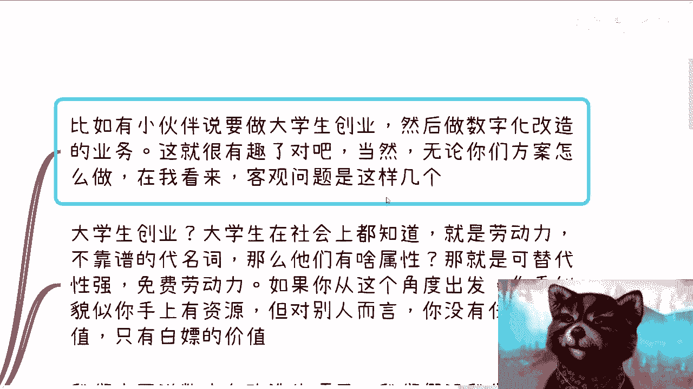
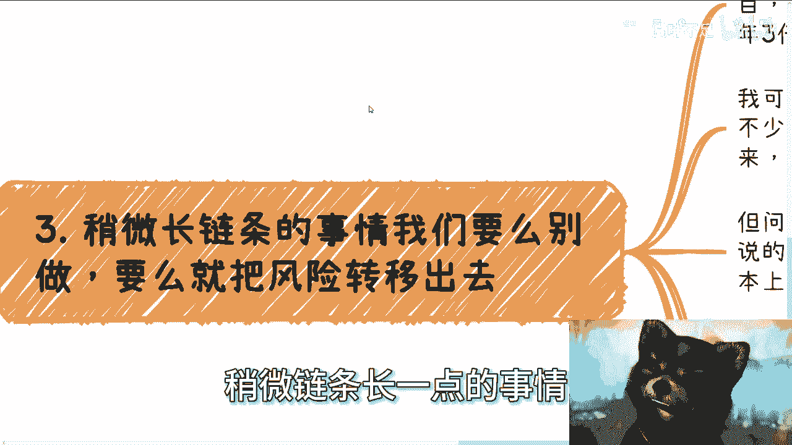
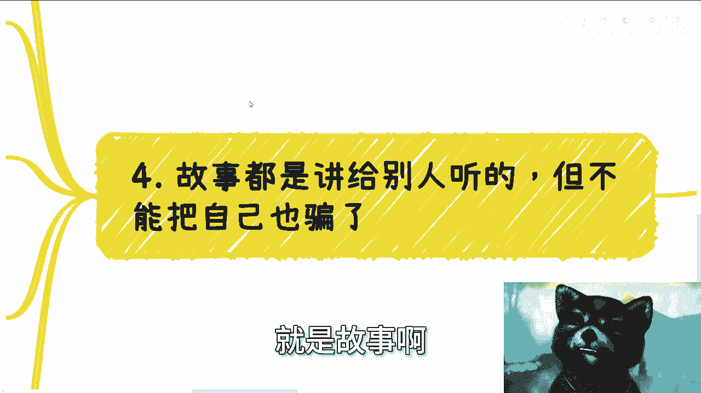
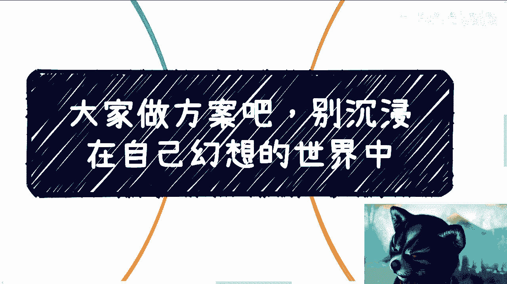

# 大家做计划做方案，别沉浸在自己幻想的宇宙世界中 - P1 - 赏味不足 - BV1LZ4y1n7QC

哈喽大家好，今天礼拜天。

礼拜天是礼拜天吗，哎呀我他妈日子都过混了啊，什么玩意，我点了啥啊。

呃那个昨天刚从杭州回来啊，我跟你们讲啊，这个礼拜六，我不是给那个微软这边讲了一个AI的课吗，礼拜五晚上好像吃的不太舒服，这个急性肠胃炎，我靠他妈昨天人都没了。

还好今天好一点，否则真的唉作孽啊，真的是啊，然后我昨天在杭州这边呢，这个也跟线下小伙伴聊了一下，聊下来呢正好啊正好讲了这么一个内容，叫什么呢，叫做大家都做方案啊，啊不要沉浸在自己的这个幻想的世界。

当中就因为已经好多人了，你知道吗，就是线上啊，线下啊，跟我讲啊，陈老师，我有个id啊，拉拉拉拉讲半天啊，讲半天，嘿嘿就是我这么说啊，我大部分情况都是出于尊重的情况，我是让对方讲完的啊。

我要真的不是这个样子啊，我他妈就打断了，讲什么玩意，滚滚滚滚滚，没个靠谱的，你知道吗。

好那我们来往下讲啊。

第一我们前两天呢说了这个应试教育，对不对，好呃其实我觉得最好的一种方式啊，就尤其是在应试教育当中，这个呃叫什么考试的这一环节啊，最好是什么呢，就让大家出发啊，就是你出方案啊，然后你说你要做什么东西。

就跟那个创业一样的嘛，你出方案啊，然后出来之后呢来走路演啊，然后开始答辩啊，然后因为方案本身呢，就是他很容易看出一个人的认知啊，其实我跟你几分钟就够了，真的叫几分钟就够了，而且啊我跟你们这么说啊。

这个东西有很多人可能会觉得哎，那我如果不创业呢，对不对，我跟你讲没有关系的，为什么，还是那句话，你们未来这么多年，比如说你读书读20多年，剩下我算你100岁对吧，剩下70多年你是跟人打交道的。

你是跟社会打交道的，你要的是一个正常人在社会，人类社会当中的思维方式，不是说我只会做卷子，思维方式，你明白吧，所以说这个事情跟你创不创业一点没有关系，指这个东西，只跟说你在人类社会能不能活下去有关系。

我觉得这个是所有人欠缺的问题，就是他除了做题，除了考试以外，他没有任何生存能力，你懂吗啊，然后有的人要说了啊，现在大学生创业跟社会上协会那种什么大赛啊，什么东西不是很多嘛，对吧，大差不差啊。

我就这样说啊，你们要明白啊，哼就你们要明白很多事情哪这么简单啊，你们所谓的协会，你们所谓的大学生创创业竞赛，有多少东西是走流程，走形式的，有多少东西是把你们当工具人，就是走走走走流程啊，走走方式的对吧。

有多少东西暗箱操作的，你们知道吗，你们不知道对不对，但这些东西有一点对你们没有任何帮助啊，没有任何本质上的帮助啊，就是要么就是无脑的说你们不对，要么就是无就是无脑的说，哎，好好好，对对对，有什么好。

有什么用呢，对吧，我说不好听点，就是你们在上面的人也不接地气，下面的所谓的专家学者也他妈不接地气，那这个做的有什么用啊，大家拍两张照片啊，写个文章向上汇报，发个公众号好了呀，结束了呀，有用了。

有用的有用的，该屁股稳定的稳定了，该拿到钱拿到钱了，对于你们来讲没卵用啊，好那么大学生竞赛跟创业说出来的东西呢，很多都听天马行空，但是这无所谓，为什么你们想想看啊，当时在广州就有人问过。

他说如果很多项目根本没有用，那为什么要我们融资呢，我说想想看啊，只有你们融资了，只有你们融了资，别人才能赚到钱啊对吧，你们只有融了资，你们才会继续往下融啊对吧，或者你们只有融了资才能做韭菜呀对吧。

反正最后做的下来，做不下来，欠款的又不是他们，你仔细你仔细想看是不是啊，我说你们这些大学生去创业了，死活谁关心，有人关心，我妈笑死，真的是有很多人就真的有很多人问过我，他说那为什么他们要让我们融资呢。

自己想想看看，对不对，所以本质上一个方案，无论你真的想做什么事情，还需要你们赚赚钱啊，你方案几分钟，你被别人就是你几分钟，这个方案的本质你就能被别人看出来，而且无论做事还是说去赚钱，你都要接地气哦。

你不要让别人知道你，你想做一件事情也不接地气，赚钱嘛也不接地气对吧，你幻想出来的方案，两者你很有可能什么都做不到啊，我们来举个例子啊，为了脱敏啊，我就不讲实际的东西了，稍微讲稍微抽象一些啊。

然后第一第二个啊，就比如说小伙伴昨天下午在跟我说啊，说了一大堆，说要做大学生创业，说要做数字化改造啊，然后我跟你讲，这就很有趣了啊，当然啊无论你们方案怎么做，在我看来啊，我们就拿这个东西来做前提啊。

客观问题有这么几个，第一大学生创业，大学生在社会上面都知道是什么，就是苦力，都是劳动力，就是免费劳动力啊，而且是不靠谱的代名词，为什么，因为什么都不懂啊，我还是那句话，你们别跟我说，你们什么事要出来的。

你们就不懂啊，还有什么很多人跟我说什么去学校啊，什么我要接触一下社会对吧，我要什么接触更优秀的资源，我没有的，不好意思，没有的啊，不存在啊，不存在的好，如果你从这个角度出发啊，你看似你好像很有资源。

就比如说你说我手上有很多大学生啊，有很多这种技术团队啊，他们能做苦力啊，但是你要明白啊，对别人来讲，你没有任何价值，因为你要跟我谈苦力对吧，那满地都是苦力，我为什么要用你呢，都有都有白嫖的价值。

那为什么为什么我要白嫖你呢，你头上长角吗，对不对啊，我们再来讲数字化改造项目，我们假设我们的项目，就客户的用户画像称之为A啊，A是不是一个是一类对吧好，那么这一类A是不是在你做之前，他们没有数字化。

还是说他们没有能力数字化啊，就好像我说我没有能能力今天做一件事情，什么事情是我没有能力做，还是我没有钱花别人做，还是说我花了钱没人给我做对吧，你要明白在人类社会是市场上面有多大部分，大部分99。

9999999的事情，你花钱是能做的，有什么不能做的对吧，另外这一类A为什么要做数字数字化，数字化做了有什么好处，他能赚到钱吗，能赚什么钱，这些钱稳定吗对吧，如果不能，那我请问这些A为什么要做数字化。

是不是啊，所以说更何况这些A的这些企业，长年累月碰到多少企业，你们现在都是那种刚起步的年轻人，刚起步的小白对吧，你们觉得他们有需求，那我就请问这些老狐狸，这些老不死的对吧。

多多少少都能积累积累下来一些合作方供应商，那为什么他会需要你们来给他做受多少服务呢，对不对，就是说就是说比如说你们给我讲所有的id，我就会觉得你们所有的东西都会默认，他是就是有痛点的。

默认他是会接受你的服务的，默认它是没有人做的，但事实上可能吗，你想想看啊，你想想可能吗，我早就跟你们说过多少遍了，中国是什么国家，14亿人是什么什么什么样的量级啊，啊就是各行各业。

各种就是角角落落的地方，只要你们能想到赚钱的地方，早就被别人渗透过无数次了。

懂吗啊，好第三个是什么，就是当下这个经济环境啊，稍微链条长一点的事情。

要么就是我们不要做，要么就是我们把风移风险转移出去再做，什么意思呢，你比如说昨天杭州我们还聊了一个案例，就我告诉你吧，比如说今天有个实体行业好一个项目，我大概要大家每个人投20万啊。

当然你们不是说一共多少钱啊，你们每个人至少20万就够了啊，回报的话差不多两年三倍，你投不投啊，我可以这么说啊，只要我故事讲得好，添油加醋，整个内容这个故故事讲的很完美，然后未来讲的多么的肯定啊。

我可以打赌头的人不少，真的我可以打赌，就是我比如说我告诉你们，我说哎还有200万的额度啊，只要十个人肯定有人想都不用想的，我管你们以后骂不骂我啊，我他妈赚到钱再说，对不对啊，为什么。

因为20万也不是非常多，有的人拿得出来，同时三倍的诱惑力还是很大的，但是问题在这个地方，这种项目你们如果以后碰到了，我可以跟你们打保票，跟你们讲的人，无论故事说的多么的令人动容。

很多细节他自己都不知道对吧，我随便给你们打个比方，你跟我说三倍对吧，好没问题，这钱怎么投的，我是什么名义投的，投进去有没有什么风险，风险大概在什么地方，为什么是三倍，不是十倍对吧。

然后这个钱是怎么进去的，税怎么交，怎么出来，税怎么交，知道吗，知道个屁，对不对，所以我昨天在杭州就分手了，分享了我的逻辑，我的逻辑是什么，就是我会去思考，我两年内能不能赚到这40万对吧。

或者说我能不能赚到60万，如果能，那我为什么冒着风险，我吗，我他妈20万没地方放吗，我放银行不香吗对吧，如果不能，那说明我不行了，我不行，意味着什么，意味着我拥有无数无无限被，就对别人来讲。

我我是一个韭菜，我根本就不了解更多的信息，我对什么东西都不了解，那他妈我不了解，我还投个屁啊啊，我不了解我投什么，我肯定被骗了，所以我不投，我不管我横竖都不投，就这么简单，对不对，当然啊。

就像我刚刚给你们讲的，要我投对吧，非要我投对吧，可以的，没问题的，我在外面找冤大头呀，哎我投呀，我投20万没问题的，我跟他说两倍，对不对，我当初吃掉一倍，我管你啊，可以啊，但是绝对不能让我投的。

不好意思，不可能啊，你想从我身上赚到钱不现实，对不对啊，那么还有一些现在小伙伴跟我说，什么几年规划，几年规划，我不管你们了解行业多少，我就给你们个结论，几年当下中国的几年，就相当于是什么叫做。

都已经过去多少个风口了啊，我们称之为30年河东，30年河西现在就可能几个月合同，几个月河西不要浪费时间，不要浪费机会，你知道吗，就是在你做几年规划，在这几年去什么留学啊，去干嘛的时候，我跟你讲。

你已经错失了很多机会了，当然不是说未来你没有机会，而是说本来当下的整个经济环境，就会让所有的人的接触到的机会，可能性越来越小对吧，反正你们自己想吧，好然后最后一点是什么呢，就是故事啊。

一定要记住啊，故事都是讲给别人听的，但是不是讲给自己听的哦，就是我其实发现很多人，他其实有很有这种潜力的，就是他讲自己的业务的时候很有感染力，眼睛里都是放光的对吧，但是啊但是就是我们说的市场上做事情。

你给别人画饼和你给自己去讲东西怎么说啊，不是给本人了，给对面这个人啊，就是你给别人画饼，给对面这个人讲故事，怎么说都可以，但你记住你别说着说着把自己说信了啊，这就好像你比如说有人跟我讲。

比如说未来美好的一个非常美好的愿景对吧，比如说我们能提供多少岗位啊，我们能提供多少GBGDP啊，我们能帮你赚到多少钱啊对吧，就好像第二点，我们里面刚刚说的那个故事。

我们能帮助多少企业做数字化改造啊等等等，对不对，那么我也可以说未来数字化改造对吧，很多方案因为我们做的，那么我们可以连接一个数据网对吧，然后我们可以卖这个数据，我们的变现方式千千万，对不对，好没问题啊。

我说听起来很牛逼，对不对，好，但你自己一定要知道很多事情，你讲归这么讲，你动动嘴皮子没有难度的啊，哥哥们，姐姐们，我他妈都要叫妈妈啊，妈妈们，爸爸们是吧啊，就你要明白到真实的环境当中根本就做不了。

甚至根本就跑不通，你知道吗啊，所以对你来讲啊，就是说你为了要找到更多的人合作，为了让对面这个人相信你，为了让对面这个人资源或者投资能够给到你，你别真的自己骗自己啊，你然后讲着讲着讲着。

然后自己真的去搞什么数字改造了你，不是有大病吗，对不对，你明白吗，哦我跟你讲啊，就是说你我不管你是谁，任何一个人做事情都是一步一步来的，我们的优先级最大最高的优先级是什么，是活下去，对不对，第二呃。

最高优先级还有什么，就是我们要尽可能吸引到对方的注意，然后你才有所谓的后续的合作，对不对，你没有0~1，你讲什么后面的屁话呢，对不对，你今天跟我讲一个idea，你理理想再好，你没有金主爸爸投钱。

你没有对方的合作资源，你今天没有办法让自己活下去，你说什么东西呢，对吧，我早就跟你们讲了，商业市场，所以跟你合作吗，是因为你产品做得好，跟你合作吗，是因为你长得美跟你合作吗。

不是啊啊谁跟你们说过是这种原因的啊啊。

对吧，啊要是刚刚这三个原因能能能实现，那早就天下太平了啊，会是这样子的。

吧啦，真的我发现很多人跟我讲讲一个idea，给两个方案当中可能会涉及到什么，涉及到企业，涉及到协会，涉及到散户啊，涉及到一些什么各个地方城市的这种政策，涉及到什么东西，但是但凡我只要再问他一些细节。

一问三不知，那你这种方案做出来干嘛啊，做出来干嘛对吧啊，我每次跟他们说，哎我说你们要去骗投资人钱，他们就跟我说，这要是我们不骗人的，我们不要骗钱的，大哥们，你们这方案给我做出来。

就他妈感觉像骗钱的好吗啊，你你一问三不知，你不骗谁在骗啊，哎我他妈也是绝了，我有时候想想哎，好吧啊，就这么着了啊，这么着嗯，行好吧，你们你但凡有任何商业上的想法啊，也包括有人跟你合作，你们吃不准的啊。

合同不知道的啊，包括职业规划不清楚的啊，包括包括对线下当下情况不了解的好吧，你们啊简单的你们就私信我啊，我也不收你们钱了对吧。

你们要是复杂的，你们整理好好吧。