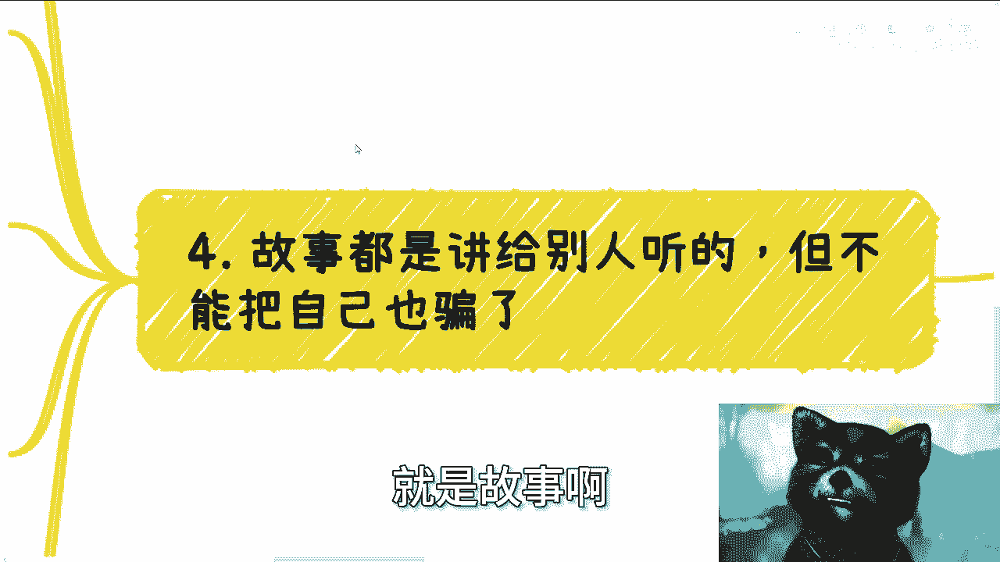

# 课程：如何制定务实可行的方案（避免空想） - P1


在本节课中，我们将学习如何制定一个接地气、可执行的方案，避免陷入不切实际的幻想。我们将通过分析一个常见的“大学生数字化创业”案例，拆解方案构思中常见的误区，并学习如何用务实的思维来检验和优化你的想法。

---


## 概述：为什么需要务实的方案？


无论是创业、求职还是完成一个项目，制定方案都是核心能力。一个务实的方案能快速体现你的认知水平，并决定你能否获得资源支持或与他人有效合作。这与是否创业无关，而是在人类社会生存与发展的基本思维方式。

许多人除了应试，缺乏将想法落地的能力。他们的方案往往基于幻想，忽略了现实世界的复杂性和约束条件。接下来，我们将通过具体分析，学习如何让方案“接地气”。

---

## 误区一：对自身资源价值认知不清

上一节我们概述了务实方案的重要性，本节中我们来看看第一个常见误区：高估自身资源的独特性。

许多人，尤其是学生，在构思方案时，常以“我拥有大学生团队”作为核心资源。他们认为这是一个优势。但在市场看来，大学生通常被视为缺乏经验的初级劳动力。

以下是需要思考的关键问题：
*   **可替代性**：你提供的“劳动力”资源，在市场上是否稀缺？对方为何要选择你，而不是其他更成熟、更便宜的团队？
*   **价值认知**：你眼中的“资源”，在合作方或客户眼中，可能只是基础的、可被轻易替代的要素。你需要思考如何将基础资源转化为不可替代的价值。

**核心逻辑**：如果一项资源（如人力）极易被获取和替代，那么它很难成为你方案的核心竞争力。你的方案必须建立在更具独特性的价值点上。

---

## 误区二：默认需求存在且未被满足

在明确了自身定位后，我们需要审视方案所针对的市场需求。许多人会陷入第二个误区：凭空假设一个强烈的、未被满足的市场需求。

以“为A类企业提供数字化改造服务”为例，在兴奋地构思解决方案前，必须冷静质疑需求本身。

以下是需要验证的前提假设：
1.  **需求真实性**：A类企业真的需要数字化吗？他们是“没有能力做”，还是“不愿意花钱做”，或是“已经有人在做”？
2.  **动机分析**：数字化能为A类企业带来什么具体、可量化的收益（如降低成本、增加收入）？如果收益不明确或不稳定，他们为何要行动？
3.  **竞争审视**：你认为的“蓝海市场”，很可能早已被无数供应商渗透。中国市场规模巨大，任何能想到的赚钱点子，几乎都有人尝试过。你的方案有何不同？

**核心公式**：**有效需求 = 真实痛点 + 付费意愿 + 未被完美解决**。你的方案必须能清晰论证这三个要素同时成立。


---

## 误区三：忽视经济环境与风险链条

当我们初步验证了需求，接下来要评估方案执行的外部环境。当前经济环境下，任何链条过长、风险不明的项目都需要极度谨慎。

许多人容易被“高回报”的故事吸引，例如一个号称“投资20万，两年回报三倍”的项目。感性的冲动会让人忽略背后的风险。

以下是面对此类机会时的理性思考框架：
*   **风险转移**：讲故事的人是否自己承担主要风险？还是将风险转移给了投资者？
*   **信息透明度**：你对项目的关键细节（如资金流向、盈利模式、退出机制、税务处理）了解多少？如果讲述者自己也说不清，风险极高。
*   **机会成本**：问自己一个关键问题：**我能否在两年内，通过自己更可控的方式赚到这20万（或目标利润）？** 如果能，为何要冒险投资一个你不懂的项目？如果不能，则说明你对这个领域的认知不足，更容易成为“韭菜”。

**决策逻辑**：
```python
if 自己_两年内_能稳定赚到目标利润：
    选择 = “不投资，自己赚”
elif 自己对项目细节一无所知：
    选择 = “不投资，避免被骗”
else:
    # 即使投资，也应优先寻找风险共担者或转移风险
    选择 = “极度谨慎，或设计风险对冲方案”
```

---



## 误区四：把讲给别人的故事，当成了自己的信仰

最后，也是最关键的一点，是区分“叙事”与“事实”。为了吸引合作伙伴或投资，你需要编织一个动听的故事（如“构建数据网络，未来变现方式无限”）。这属于沟通策略。

但致命的错误在于，自己对这个故事深信不疑，并以此作为行动指南。

以下是必须恪守的原则：
1.  **故事是手段，不是目标**：讲故事是为了获取启动资源（注意力、资金、合作），实现从0到1的突破。
2.  **生存优先**：所有方案的**最高优先级是让自己先活下去**。没有生存，一切远景都是空谈。
3.  **保持清醒**：要清楚故事中哪些部分是愿景，哪些是当前可执行的、能产生现金流的步骤。永远用现实条件检验每一步的可行性。

**核心提醒**：商业合作的根本，很少是因为你的“想法完美”或“产品惊艳”。初期合作通常源于**你能以最小成本验证一个市场需求**，或拥有**某种关键的现实资源**。沉浸在自我编织的故事中，会让你忽视这些务实起点。

---


## 总结与行动建议


本节课中，我们一起学习了制定务实方案的四个关键点：
1.  理性评估自身资源的真实市场价值。
2.  严格验证市场需求的真实性与竞争状况。
3.  充分考虑经济环境与风险，管理好机会成本。
4.  区分对外沟通的“故事”与对内执行的“事实”，生存优先。

一个经得起推敲的方案，必须能回答出具体的细节：用户是谁？他们为什么付费？钱怎么赚？风险在哪？你的不可替代性是什么？如果你对自己的方案、职业规划或商业合作心存疑虑，一个有效的练习方法是：**尝试向他人解释，并准备回答一连串“为什么”和“怎么做”**。当你能清晰回答时，你的方案才真正脱离了幻想世界。


---
**行动号召**：请基于你现有的一个想法，运用本课的四点分析框架，写一份简短的自我质疑清单。这将是你迈向务实的第一步。