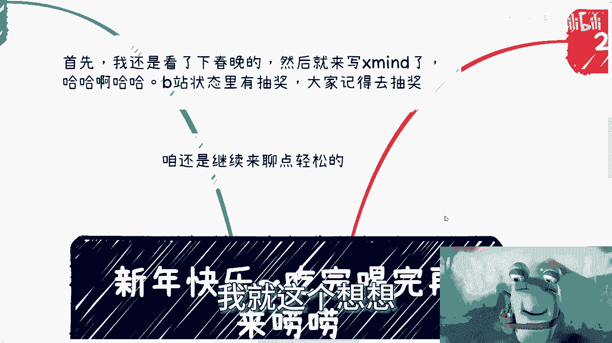
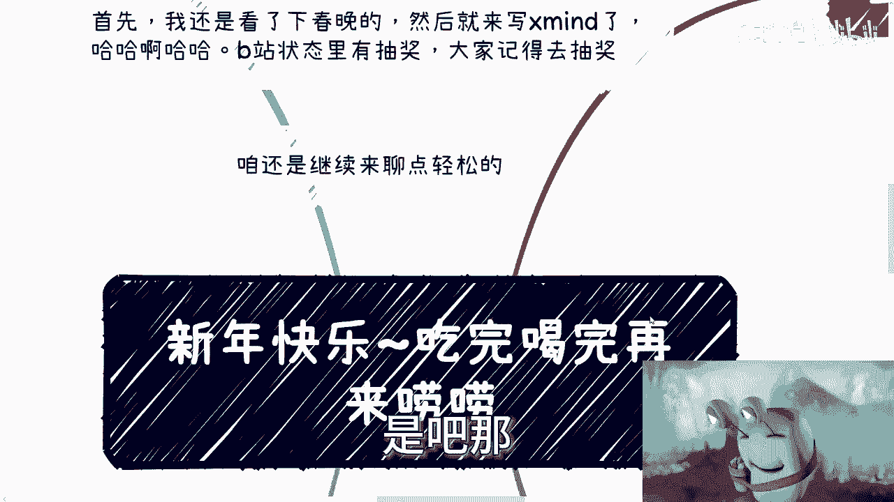
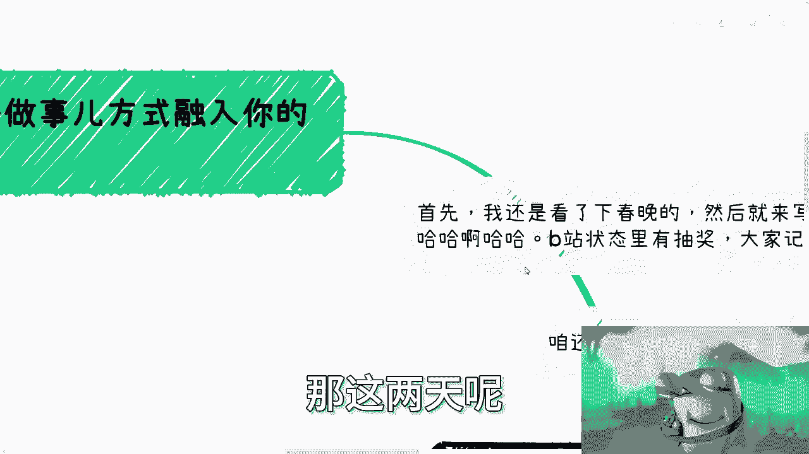
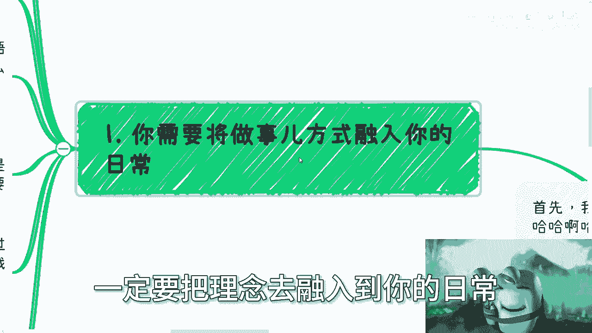
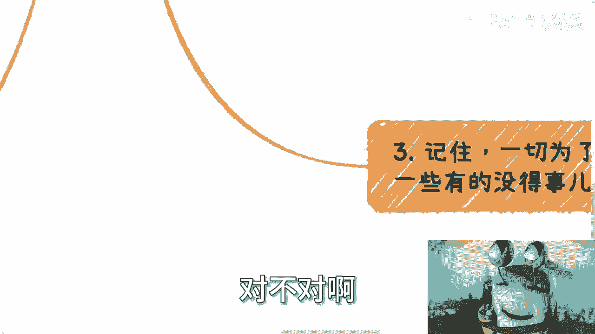
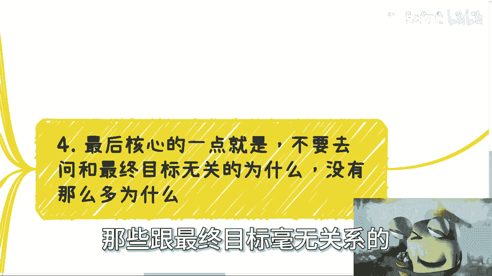
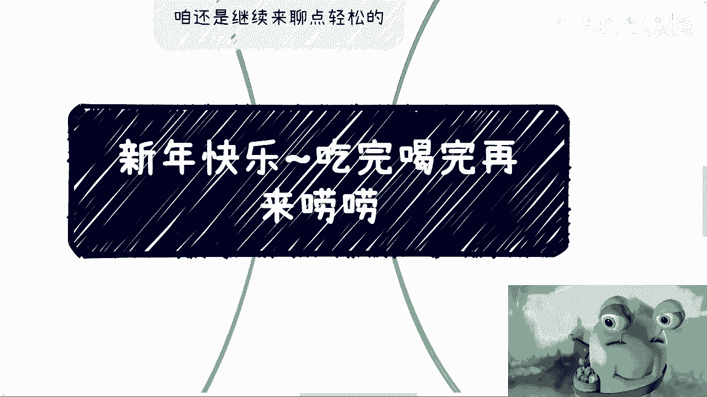

# 大家新年快乐-吃完喝完再来唠唠---P1---赏味不足---BV1wC41167aP









在本节课中，我们将学习如何将核心理念转化为实际行动，避免陷入空想和无效的自我设限。我们将探讨几个关键的行动原则，帮助你更清晰地思考，更有效地做事。



## 概述：核心理念必须融入日常

上一节我们提到了核心理念的重要性，本节中我们来看看如何将其真正融入日常行动。许多人听过很多道理，但如果不通过实践将其内化，这些道理就毫无意义。改变的关键在于行动，而非空谈。

## 第一点：以明确目的为导向

一切行动都应服务于一个明确的目标。无论是为了情怀、赚钱还是其他目的，你的每个行为都应直接或间接地推动你向目标前进。

**核心公式**：
`有效行动 = 明确目标 + 为目标服务的具体行为`

以下是实现这一点的关键步骤：

*   **明确你的目标**：清晰定义你想要达成的结果。
*   **评估行为相关性**：在做任何事之前，问自己：“这个行为能帮助我达成目标吗？”
*   **摒弃无关行为**：凡是与目标无直接关联的思考或行动，都是浪费时间。

## 第二点：拉长时间线看问题

我们往往容易被短期现象或个别案例所迷惑。要避免“幸存者偏差”，并学会用更长远的眼光看待发展。

上一节我们强调了行动的目的性，本节中我们来看看如何建立正确的评估视角。看待问题时，应避免以单一案例或一时得失作为判断全部的依据。

以下是两个需要避免的思维陷阱：

*   **避免“幸存者偏差”**：不要用一个极端成功或失败的例子来代表整个行业或事件的普遍情况。例如，不能因为个别人在互联网行业年薪百万就认为行业一片大好，也不能因为部分人求职困难就认为行业毫无机会。
*   **关注可持续性**：评估一个机会时，要思考其长期价值。例如，一份工作当前收入高但透支健康且没有技能积累，其长期价值可能远低于一份收入适中但能持续成长的工作。

**核心提醒**：如果某个宏观问题（如“区块链未来如何发展”）不影响你当下的具体目标和行动，那么过度纠结它就是在浪费精力。

## 第三点：保持自我，设定底线

在追求目标的过程中，很容易因在意他人眼光或盲目对比而迷失自我。保持独立判断和道德底线至关重要。

上一节我们讨论了如何用长远眼光看问题，本节中我们来看看如何在行动中保持定力。在乎他人评价是人性，但需要控制在合理范围内。

以下是保持自我的关键原则：





*   **明确自身定位与产出标准**：你需要清楚自己是谁，能提供什么价值，并坚持自己的标准。一味迎合客户或市场，最终会失去自我。
*   **坚守道德与良心底线**：追求目标（如赚钱）时，手段必须正当。不能以“用户总会被骗，不如被我骗”之类的歪理为自己开脱。你的产品或服务应提供真实、有益的价值。
*   **理解“在乎他人”的度**：寻求认可可以成为动力，但不能让它主导你的所有决策。君子爱财，取之有道。

## 第四点：停止追问无效的“为什么”

许多人会陷入对因果关系的过度追问中，例如“对方为什么会相信我？”，这些问题常常与达成目标没有直接关系，只会导致行动瘫痪。

上一节我们探讨了如何在行动中保持自我，本节中我们来看看最后一个常见的思维障碍。很多人在行动前，会纠结于一些无法控制且无关紧要的问题。

以下是关于“为什么”的正确认知：

*   **区分相关性与控制力**：“对方是否信任你”与你“最终能否赚到钱”没有必然的因果关系。你无法控制也无法完全理解每一个人的想法。
*   **接受漏斗模型**：在足够大的样本中（如14亿人），任何产品或服务只要你去推广，都一定会有人感兴趣和买单。成功是从大量接触中“筛选”出来的，而不是因为你满足了某个完美的“因”。
*   **实践是唯一的检验标准**：与其空想“为什么没人买”，不如先去接触100个潜在客户。很多“为什么”会在实践过程中自然得到解答，或者被证明根本不重要。
*   **成功是概率事件**：没有人能保证一两次尝试就成功。成功的背后往往是数百次失败。难的不是成功本身，而是承受失败并持续行动的勇气。

**核心代码逻辑**：
```python
# 错误的思维：陷入无限追问的循环
while not success:
    ask_why() # 不停问“为什么别人不选我？”
    feel_afraid()
    do_nothing() # 因恐惧而无法行动


# 正确的思维：聚焦行动的循环
while not success:
    take_action() # 执行计划中的动作
    collect_feedback() # 收集市场反馈
    analyze_and_adjust() # 分析并调整策略
    # “为什么”在行动和反馈中逐步清晰或淡化
```


## 总结

本节课中我们一起学习了四个关键的行动原则：
1.  **以明确目的为导向**，让每个行为都为目标服务。
2.  **拉长时间线看问题**，避免被短期现象和个案迷惑，关注可持续性。
3.  **在行动中保持自我并设定底线**，不迷失于他人眼光，坚持正当手段。
4.  **停止追问无效的“为什么”**，接受商业的漏斗模型，通过实践而非空想来验证想法。



记住，理念的价值在于应用。改变不会发生在空想和无限的自我问答中，只会发生在你迈出第一步，并将这些原则不断融入每一次具体行动的过程中。从0到1的核心是行动，而不是一个完美的理论。