# 大家新年快乐~吃完喝完再来唠唠 - P1 - 赏味不足 - BV1wC41167aP

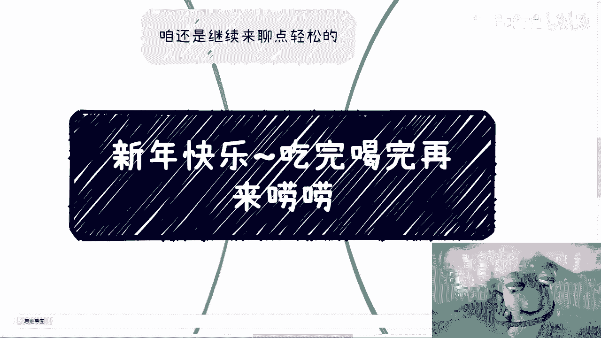

好大家好，我是卷王是吧啊，呃首先我还是看了一下春晚的啊，大概看了两个小品吧，我就这个想想算了。

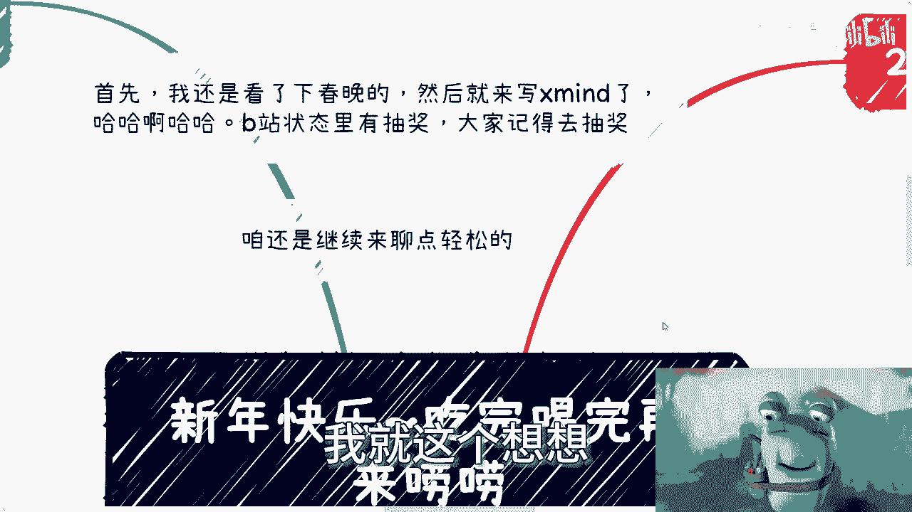

还是再做一个，因为总归有小伙伴不看春晚是吧。

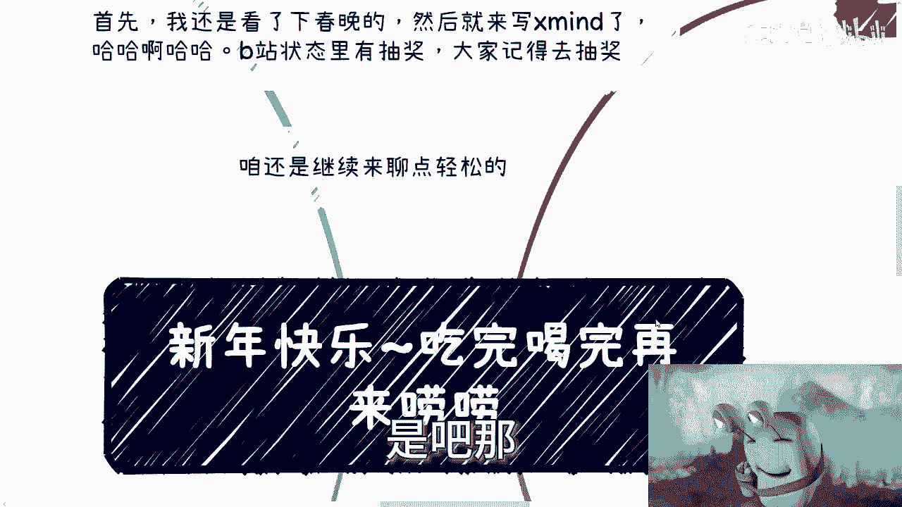

那那还不如来听我讲相声是吧啊，这个首先给大家拜年啊，这个新年快乐，然后呃我们还是聊点轻松的啊。

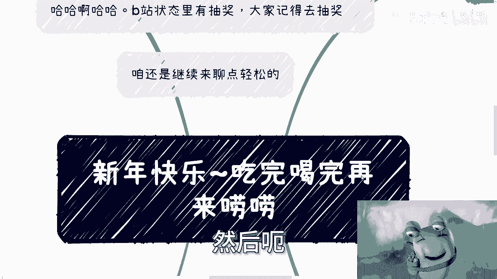

聊点轻松的，那这两天呢我还是看了一些东西的啊。

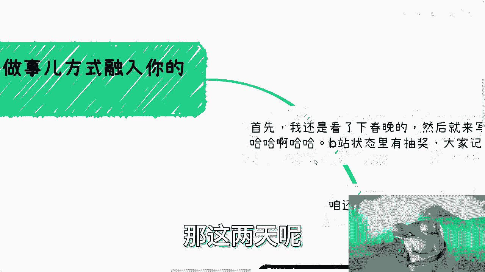

呃并不是在外面吃喝玩乐是吧，呃我觉得首先最大的一个问题呢，就是啊啊随便扯，就是我觉得大家做事情呢，一定要把理念去融入到你的日常。

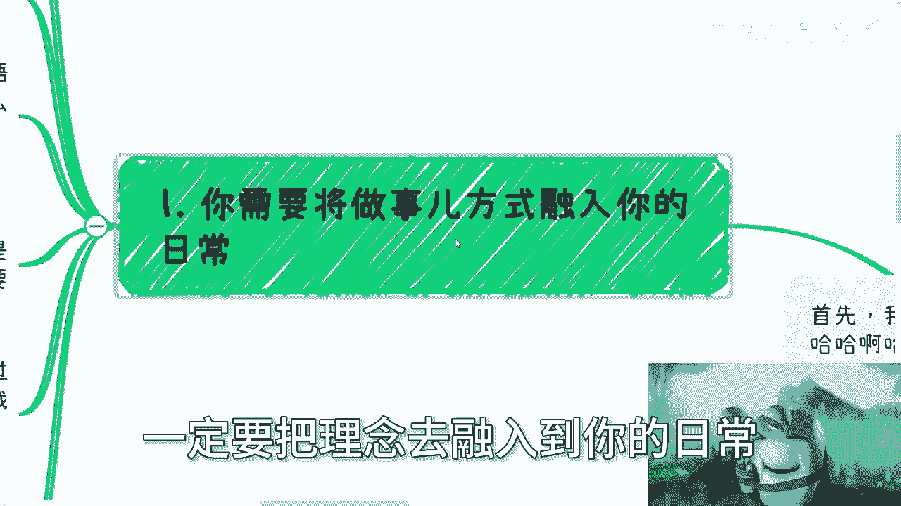

呃这句话什么意思啊，意思就是说呃，那首先啊比如说之前就有人来跟我讲，他说我讲的，我讲的呢跟别人讲的啊，然后呢什么道啊，术啊对吧，我说实话啊，我还是比较客气的啊，一般来讲我也就不说什么，但是你要我说对吧。

别逼逼啊，跟我逼逼这么多啊，什么道啊，树啊，这他妈跟本质就是没有关系啊，不要试图用这种华丽的，或者说乱七八糟的东西去掩盖啊，大家一些不可暴露，不可告人的目的对吧，就是说你只要改变不了我们的现状。

只要不能真正就不能真正给我们带来一些改变，那他妈都是狗屁对吧，你跟我说什么道啊术啊，然后呢有用吗没有用啊对吧，如果今天有一些东西只只有口号啊，只有思想上的灌输，而且只有思想上我们称之为正反嘛对吧。

只有思想上一味的灌输，我跟你讲，那不叫改变，那他妈叫邪教啊，明白吧啊，好一切脱离现实社会的东西啊，无论加以多么高尚的词语去修饰，无论加以多么高尚的这种故事去修饰，都是为了掩盖其本质，你知道吗。

所以说你无论你你要明白一点啊，无论你听到多么让你感觉，有道理的视频或者话语，但凡他不重视，不从实际角度出发，但凡他改变不了真正世界当中的你，但凡他不去遵循这个真正世界的规则。

而不是说这个讲出来一些莫名其妙的道术啊，规则，这他妈都扯淡啊，就是在我咨询过程当中，我跟很多人做再三强调了一点，就是你所有的想法必须目的明确啊，我我不关心你到底是比如说情怀，还是说是为了赚钱。

还是说别的目的，你可以有你的目的，无所谓啊，但不管怎么样，你要明确，也就是说你的任何一个行为，你都要是为了这个目标去的啊，然后就说你今天这个行为，是能得出这个目标的啊，那么但凡不明确就是浪费时间。

就是曲线救国对吧，就说白了是什么，就像就像我跟很多人说的，就是说，你要去做，你一边做一边复盘，一边思考，OK那有很多人也说啊，他说我我不懂得怎么复盘，我不懂得怎么思考，没有关系啊，你也是去做了。

你才能有这个叫什么，就这个思考和复盘的过程啊，你不做，你怎么去去进步啊，你永远就是在这边说啊，我们通过视频，通过别的方式来跟你讲，没有用的，一点用都没有的啊，所以说你们会发现啊。

就是说很多人在听一些东西的时候，他会觉得没问题，OKOKOK啊，他会觉得嗯对的好的，说的没问题啊，然后过了几分钟再沟通一些问题的时候，然后好多人就会回复我说什么说啊，陈老师这个我不懂啊。

这个我也不太了解，而且我也没这么多时间，也没有这么多钱去尝试，对吧好，你会发现就是这种思想在他听的时候啊，或者说你给他一个结论，叫做以目的为导向的时候，他会觉得很对，但是这种思想我们如果不通过实践。

不通过任何一个案例，不通过一系列的案例去融入到，在我用我说法啊，就不融入到你们的DNA里面的话，那么你们是没有办法就是融会贯通的，就是这种想法就是在当下你们听的时候，你会觉得嗯有道理。

但是隔了2分钟你就不知道了，或者说当你碰到一些真正的问题时候，你就不知道了对吧，然后呢我还得去问他，我说你不懂，你不了解，你没有时间，你也没有这么多钱，那么我就问了你，甚至在你完全不了解的情况下面。

那么你是怎么得出这一系列，就就就就这写出来的这一系列的东西呢，你是怎么得出来，你不懂你不了解，你没有时间，没有这么多钱呢，哎你你凭什么认为做这件事情，做这件事情你要了解什么东西，你知道吗。

你不知道你要付出多少时间吗，你也不知道你要付出多少钱，你也不知道，你就得出来说，因为我不知道，因为我不了解，因为我没有时间，因为我也没这么多钱，所以陈老师，你说这个我做不了，哎我就奇了怪了，对不对。

而且更何况我想问的是，这些问题跟你赚钱有关系吗，有没有直接关系，你咳咳咳，我们就这么说，你刚刚所问的这些问题，解决的情况下面能影响你赚钱吗，不解决的情况下面又影响你赚钱吗，如果不影响或者没有直接的影响。

那么我就请问你关心这些东西干嘛呢，对不对，就我们不关心这些想法到底是谁，PUA给你们的，不重要对吧，哪怕你说是是是你父母，你学校怎么样，这都不重要，无所谓，但是这些想法有意义吗，没有啊，纯粹浪费时间了。

对吧好，那当然啊，我这个地方补充一点，就是我们并不是说你所有时间都不去考虑，说我到底啊这个有没有多少时间，或者说有没有多少钱去尝试这些东西，考虑的前提是你得了解对吧，你得去了解，你得去实践。

我不管你是通过搜索的方式，还是通过去落地的方式，你总归得要去了解之后，实践之后你再去问自己嘛，你说哎我到底有没有这么多时间，到底有没有这么多钱，如果来说你最终得出来的结论是不行对吧，那你不做可以。

但是而不是说你什么都不知道，你在PUA自己对吧好，然后这是第一点，第2。1定要有拉长时间线的这么一个想法，就是说什么呢，就是说我们往往不能用两个事情来作为，我们那个做事情或者思考问题的前提。

一个就是单个案例，也就是我们所谓的幸存者偏差对吧，你比如说你说你说啊没有呃，甚至没有什么代表性的案例，作为新手本片家作为前提，那很多人他要是来杠对吧，就比如说啊，我们问现在计算机互联网行业是不是还可以。

是不是一个还可以深耕的行业，你让我咋说呢对吧，我说是，那么总有人跟我说啊，陈老师你看啊这么多人找不到工作，那我说不是，那么他就会跟我说啊，陈老师，你看啊，这边有个人对吧，那个年薪百万，我怎么说，对不对。

就是不管不就是差的也好，好的也好，本质上都是幸存者偏差，然而还是第一点，我们说的正确也好，错误也罢，好也好，坏也好，善恶又如何呢，诶我就问了诶，你比如说上面这个东西啊，比如说你说是不是一个深耕的行业。

然后呢有人跟你battle对吧，有人跟你跟你来辩论啊，就说哎今天有人是做的好的，今天有人做的不好的，那我就请问说好也好，不好也好，是影响你们赚钱的，还是影响我赚钱啊，如果就是这些宏观的问题。

根本不影响你们赚钱，不影响我们赚钱，那我觉得除了我要么就是你们已经财富自由，太闲了，要么就是你们根本就不知道你们自己要干什么，那去想这些问题干嘛呢，没有意义啊，对不对，你就像很多人问我，他说陈老师。

你觉得这个就他们以前一直问我，他说张老师，你觉得国家这个区块链未来怎么发展，我说怎么发展，跟我他妈的蛋关系啊，搞得好像我能左右他发展一样的，另外他好也好不好也好，不影响我们赚钱啊，怎么不明白呢。

真的是啊对吧，好诶啊，然后还有一点咳咳咳咳咳，另外一点就是当你知道一些事情的时候呢，一定要去拉长时间线去看待，去问自己，比如说大家看到别人拿到一个offer吧，或者说去了什么公司，加班多不多啊。

或者说拿的钱多不多，或者说呃类似的任何一个现象，你要去思考啊，能否持续发展呢，是不是说他现在做的这些东西，等到以后年龄大了还能做呢对吧，是不是说这些东西有护城河呢，还是说怎么样子。

你你你别一个劲的就会觉得哎呀这个陈老师，你看我们这边对吧，有人考公啊，考完之后怎么样怎么样，然后呢他25岁，26岁，23岁这样子，能保证他35岁，36岁这样子吗，不能啊。

你甚至半年后都不能保证你管这么多干嘛呢，对吧，我之前视频里面就跟大家说过，就是虽然好像每个人都有这一辈子要去活一样，但是大部分人看问题和思考问题方式，总感觉就是当下哦，我们就称之为叫什么一时的荣辱。

他就会觉得一时的荣辱就是一辈子，就是棺材板要盖上了，我就不知道有什么意义，对吧啊，那么你要觉得你今天一一时的荣辱，一时三刻的荣辱，你要去在乎的话，那么除了浪费你自己时间，我知道我实在不知道还有什么作用。

没有用的对吧好，然后第三点和第四点呢，本章都差不多，就是说要为了目的，不要去做那些有的没的事，我们来举个例子，比如说你今天做了一个事啊，你特别在乎别人的眼光，你特别在乎网络的眼光。

你也特别在乎你的竞争对手是怎么做的，那么我给你讲，你只是在浪费你的时间，或者你已经进入了一个开始迷茫的阶段，当然你千万不要用一些邪教的思维，去PV你自己什么，比如说啊这些用户被别人骗，不如被你骗什么。

被别人洗脑，不如被你洗脑，我们做事情是可以为了赚钱，我们做事情也可以为了情怀，但至少你得做一个正常的人啊，你别去宣传一些，就是就是就是你明明知道对方得到了你，这些东西，这都是些空虚的东西。

对他没有帮助的，你做事情要保有一定的良心好，我曾经跟很多人说过，如果你在乎别人，那么你早晚会迷失你自己，就这件事情就是早跟晚的事情，因为你今天做任何一件事情，不管是to see还是去政府，去企业。

你无论做什么，如果你一旦但一旦啊，这个这个这个这个这个这个叫什么市场做大了，你自然面对你的客户也会越来越多，就比如说你可以是自媒体，你可以是独立工作室，你可以自呃，你可以是自己做了一家企业对吧。

你会面对各种各样的甲方跟乙方，就跟我昨天跟你们讲的，就是我我以前被白嫖对吧，是一个道理，就是你需要明白你自己做什么，你自己是什么样子的，你要产出怎么样的一个水平的东西，而不是说一味的去满足别人。

满足客户对吧，那么基本上你就你就不是你了，当然了，我们说啊人性你去在乎别人，这是天性啊，毕竟我们都希望得到别人的认可，这没有问题啊，这没有问题，但这个需要一个度，需要你自己要有控制能力。

这就好像这就好像以前老话怎么说呢，叫君子爱财，取之有道，你爱财可以啊，那你要控制一个度啊，你总不能跟我说来，我去零元购，我抢银行，对不了，一个道理啊，就不是说法律不法律，今天就算没有法律。

你也不能抢了对吧，这是一个正常一个人，作为一个做正常人的这么一个底线吧对吧，你自己要去明白你到底怎么样的，你不要去看别人啊，你别今天来跟我说啊，陈老师，你看他妈的别人抢银行对吧，一抢两个亿，三个亿。

我也得去抢，那那我就用我的话来讲，用我一直到现在为止所要阐述的观点来讲，你活着，这是你吗，跟你有什么关系啊，你这副躯体，你的这个思想都是别人的，别人干嘛你也干嘛，有什么用啊，对不对啊。

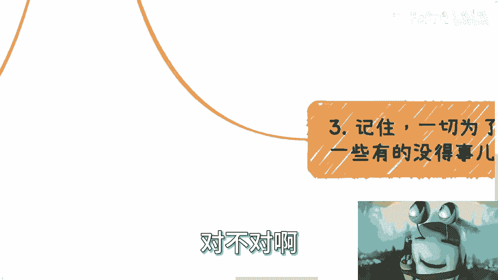

那么最后一个核心点是什么，就是不要去问那些跟最终目标毫无关系的。

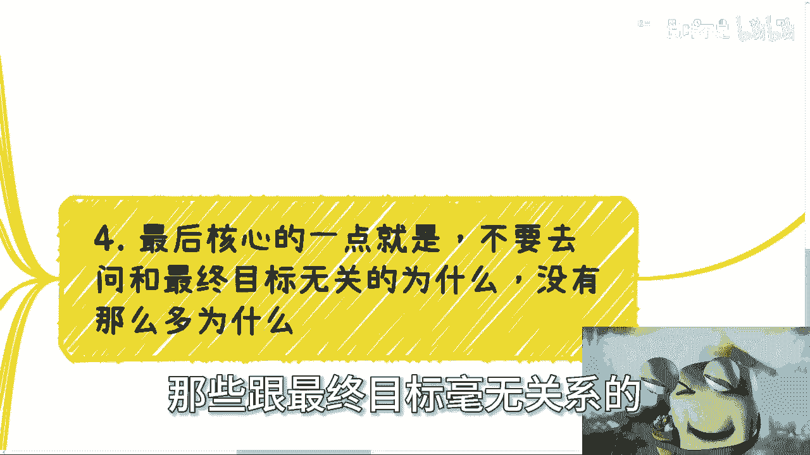

为什么没他妈那么多，为什么你知道吗，就是你看啊，在咨询过程中，很多人会问我这么一个问题，他说陈老师对方为什么认可我，对方为什么相信我，对方为什么愿意跟我合作吧，好首先我会问对方是否认可你，是否相信你。

是否愿意跟你合作，和你是否最终能赚到钱，以及你是否能达到你想做这件事情的目标，它有直接关系吗，有吗，你想想看有没有，对吧，其次你问这么一个问题啊，其次我觉得这样的问一个问题的人逻辑是什么。

我几乎可以认为，他约等于希望碰见其任何一个人，对方都能够认可他，相信他即愿意跟自己合作，他会觉得这个当中有一个因果关系，然而我就这么跟你讲，你今天碰到一个人，两个人，你也许觉得有因果关系。

但是我告诉你啊，无论你今天什么水平，什么背景，你碰到的人基数只要大了，中国有14亿人，你做一个生意，从宏观角度来讲，你就是一个漏斗模型，对吧哦，你跟我说，邵老师，我做了一件事情。

对方愿意相信我是因为我怎么样怎么样怎么样，你觉得有这么一个因果关系吗对吧，比如说我们就打比方讲啊，比如你说哎陈老师，我以前做过高校的案例啊，那么我认为呃只要做高校的相关业务，对方都有都会相信我。

你自己觉得可能吗对吧，或者这么说，你说陈老师，我今天是一个比如说几百万粉丝的大V，那么我认为用户都会相信我，你觉得可能吗，对不对，他没有因果关系啊，但是你要明白，不管你今天是什么水平，什么什么背景。

你做一个赚钱的东西，对啊，咱不管赚不赚钱，就是你做一件事情，他本质就是从14亿人里面漏都漏下来，对不对啊，你跟我说，陈老师，我今天做一件事情，14亿人里面一个人都落不下来，就网络发达的今天。

你觉得我会信吗啊，你觉得我会信吗啊，你说但在当下这么一个中在整个全球的，也不说中国实习是吧，全球这么多人里面，连他妈直播吃屎的人都有，你做什么事情跟我说一个人都落不下来，我不信的对吧。

你放到你把这个结论放到任何地方，谁会信对吧，所以说我跟你讲，我信的是什么，我信的就是你根本没去做，我信的是你不敢去实践，就是你根本没做这件事情，我是信的，你跟我说，我做了我一个人落不下来，我不信的啊。

所以说就说真的你只要想去做一件事情，你把你要做的应该做的去做了啊，别去考虑这件事情做得好不好，就像就像你今天滚个雪球，你在那边考虑，哎我这个雪球得滚多大，我得滚多美，你连0~1都没有，你管他滚多大呀。

你管他滚多美呢，你管你管这个雪球，这根线滚的直不直呢，这是你要去考虑的吗，对吧，你别去考虑对方怎么想的，对方怎么想的，你也不能控制，对不对，而且对方怎么想跟你赚钱有关系吗，啊就像我今天跟你讲。

你比如说你今天卖一个产品，卖7000块钱，8000块钱，你非要问我陈老师，对方凭什么相信我大哥，你要我说是什么，14亿人里面只要有人愿意付七八千万给你，他就是认可你的，你问他为什么认可你。

你觉得他知道吗，我就问你，你觉得他知道吗，他知道个屁，对不对对吧，所以说我就说嘛，就是说你要把握你自己啊，你要是属于那种就是说纯粹骗人的，那就叫哥对吧，你要是能够给予他七千八七千块钱。

8000块钱对等的价值的服务，那么我觉得这个商业逻辑至少是成立的，但是不管怎么样，你我告诉你去问对方，你相不相信我，你为什么相信我，都是婆说婆有理，公说公有理的，这哪里会有一个就是就是你知道吗。

就是我一直会跟他们说那句话，就是我们不是在应试教育，我一直在强调这个问题，就是我们不是应试教育，没有一个就是一定说啊，因为怎么样，所以怎么样不存在的呀对吧，所以说我觉得基本上0~1都是卡在这个地方。

就永远会问为什么，而且他不问我也是问别人，不问别人也是自己问自己，然后自己问自己呢，就就就走走向死循环，怎样死循环之后就永远不动，然后我就问嘛，我说这件事情跟你本身有关系吗，没有关系啊。

那你问它意义在哪里呢，对不对，我跟你说啊，我可以打保票的说，但凡只要问我陈老师，对方为什么相信我，为什么认为什么认可我，为什么愿意跟我合作的，都是没有实现过的啊，或者说实践的次数不够。

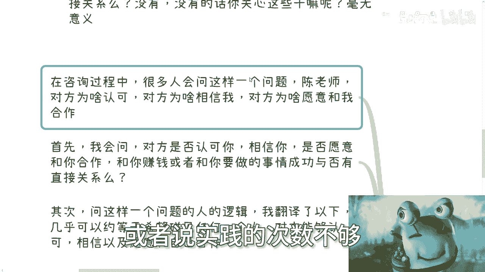

对不对，你要是指望说你今天做任何一件事情。

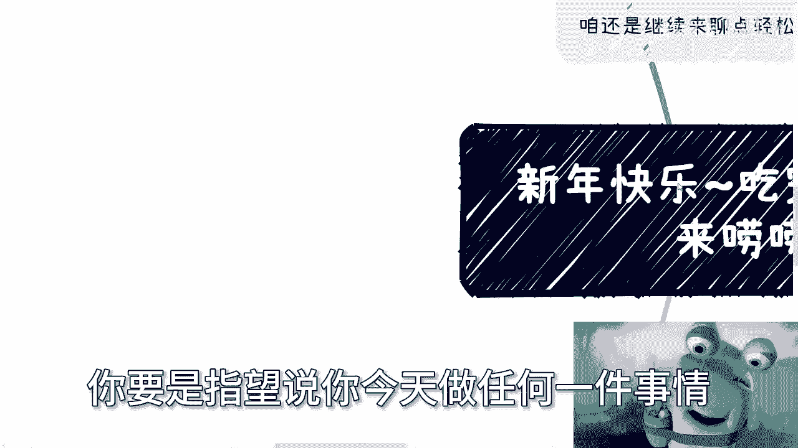

一两次就能成功，那那今天会是这样子吗，你放眼望去放放放眼整个中国会这样吗，啊大家会这么难吗，或者说商业会这么难吗，信息差会这么大吗，不会的呀，所以难就难在这个地方啊，难就难在就是就是成功往往只有一次。

但成功前前后后他失败可能是几百次，几千次，这就是难的地方啊对吧，但是问题在于你，你你会发现其实你只要成功一次就够了，为什么，因为你会从那次成功慢慢慢慢去明白这件事情。

你或者说你会从无数次失败里面会去明白，这里面的你所谓这么多，为什么到底有什么用，或者说要不要那些为什么没有意义的，就是所以说我为什么一直说大家曲线救国，就是我会发现大部分人的想法，他的疑问啊。

他的这个纠结的点，他的困惑跟最终目的他没有直接关系，就好像今天我们从A点走到B点，所有人都不愿意选择走直线，非要在那边绕，当然这在我看来是在绕，但是在他们看来，可能他们觉得这是根直线，这个就是问题。

为什么，因为他没做过，因为他没有概念，但是没有概念就会就就就当然你从我角度，我不理解啊，就是你没有概念的情况下，你还非要用这么多，为什么去框住自己，那为什么呢，我不明白呀，对啊，因为恐惧。

那那那那你到底想不想做嘛，你要我说要我话说，对不，好就这么着吧，然后我待会那个吧，放到凌晨放出来吧，反正大家可以看完那个咳咳咳，春晚在看，哎呀哎行，就这么着吧好吧，大家这个预预祝大家新年暴富暴富。

有啥问题。

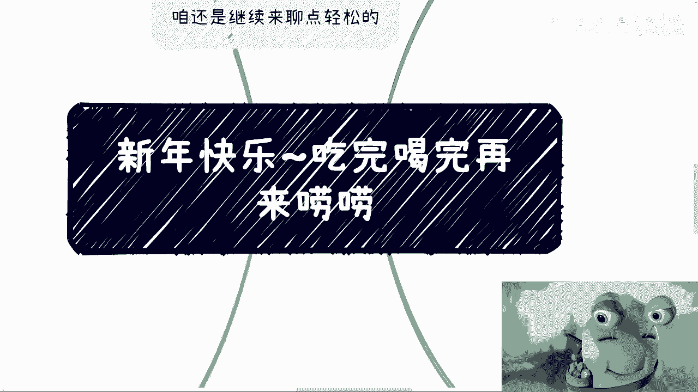