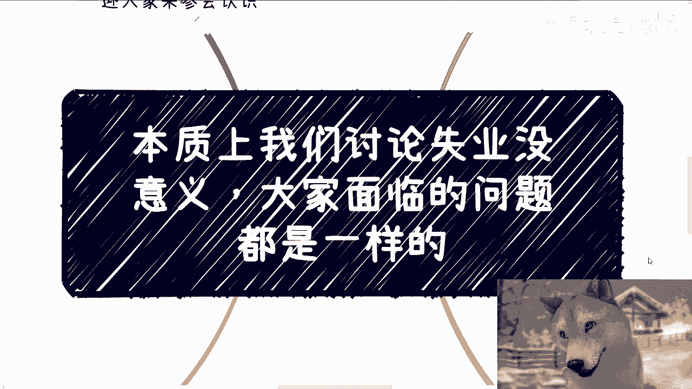
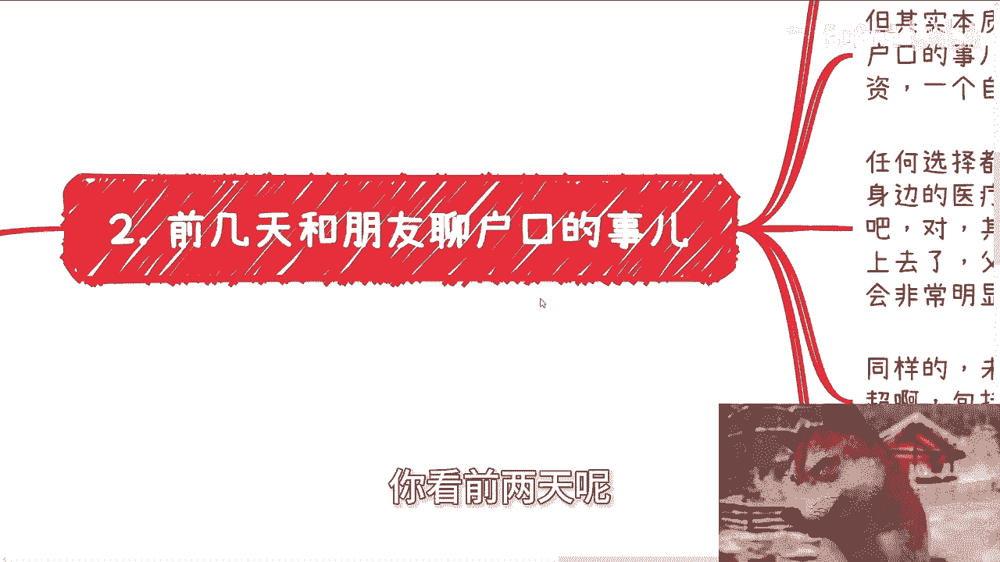
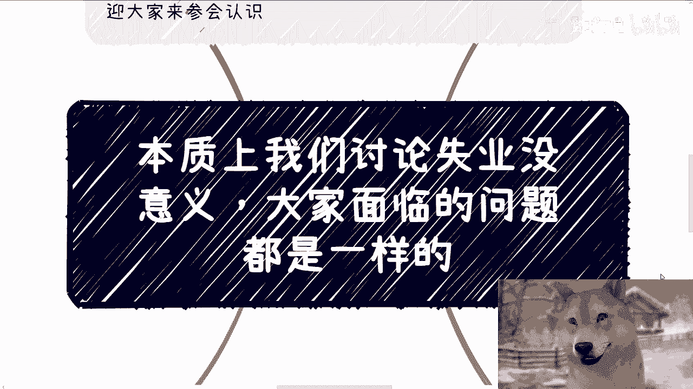

# 课程名称：在自由与收入间寻找平衡 - 第1课

## 概述 📖

在本节课中，我们将要学习一个核心问题：如何在拥有更多自由时间的同时，确保个人收入能够跟上社会物价的上涨。我们将抛开关于学校、专业、年龄等表面的讨论，直击问题的本质，并探讨一些现实可行的思路。

---

## 问题的本质：我们共同面临的挑战

网络上充斥着大量同质化的信息，许多讨论围绕选专业、何时失业等话题展开。但这些讨论意义有限。

我们所有人面临的核心问题其实是一致的：**如何在年轻时拥有更多自由时间，并且让收入增长跟上社会硬性物质价格的上涨**。这远比纠结于结婚、买房、买车或追求体面生活更为根本。

许多人心里明白这个道理，但或因惰性，或因满足于“比上不足，比下有余”的现状，并未采取行动。一个常见的误区是“刻舟求剑”，例如一些父母仍执着于追求“铁饭碗”，或是机械地套用历史经济周期理论。参考历史是有益的，但直接照搬并不可取。

---

## 案例分析：户口与房产背后的多维选择

上一节我们探讨了问题的本质，本节中我们来看看一个具体案例：户口与买房的选择。这不仅仅是居住问题，它涉及三个层面。

以一线城市（如上海）的高房价为例，很多人表示无力承担。他们可能选择偏远区域或周边城市。但这个选择背后需要权衡以下几点：

1.  **一整套生活品质**：这包括身边的医疗、教育、生活和娱乐等配套设施。年轻时可能感受不深，但当自己或家人生病、孩子需要教育资源时，便利性差异会非常明显。这关乎我们能否为家人创造更好的硬性条件。
2.  **未来的投资价值**：房产可能带来的增值，例如周边新建商超等配套设施。不过，这一点在过去十年二十年更可信，未来的确定性在降低。
3.  **下一代的起点**：一线城市户口可能为孩子提供更高的成功概率和更多机会。但前提是家庭本身有足够的经济基础。如果为了户口而让全家生活拮据、负债累累，那么意义何在？

所以，看待问题不能单一化，必须进行多维度的综合权衡。

---

## 现实思考：金钱、责任与人生阶段

我们讨论了具体选择背后的权衡，现在将视角拉回更普遍的现实。金钱的重要性体现在它能解决和预防绝大多数问题。

以一个朋友的父亲因慢性病住院一年半为例。这极大地消耗了家庭的人力、物力和财力。即使朋友有一定经济实力，过程也已非常艰难；对于普通家庭而言，这更是难以承受的重负。这引出一个沉重的问题：在无力负担时，我们能选择放弃吗？通常不能。这凸显了提前进行财务规划和准备的必要性。

另一方面，关于人生阶段，一个普遍的现象是：许多人读完硕士、博士，接近三十岁才真正开始面对社会压力，而此时人生已过去三分之一。更令人无奈的是，如今的“吃苦”往往不一定能带来相应的回报，苦可能越吃越多。

---

## 路径参考：身边成功者的共同特质

面对现实的挑战，是否有可行的路径？本节我们来看看身边一些普通出身但取得成果的人有何共同特点。

我身边不少在30-35岁赚到钱的人，他们有一些有趣的共同点：

以下是他们的几个关键特征：
*   **学历不高，但善于“补票”**：他们并非通过高学历起步，而是在赚到钱后，再去“水”一个学历用于对外展示。
*   **“忽悠”能力极强**：这里指的是极强的沟通和包装能力，尤其在面对企业或政府时。他们能将一个业务的优势放大，甚至掩盖短板，描绘出极具吸引力的前景。
*   **思维跳跃，敢于吹“泡泡”**：他们不按常理出牌，思维非常跳跃。关键在于，他们吹出的“泡泡”中，有相当一部分（例如40%-50%）是能够真实落地的。

与这类人合作时，我的角色常是“托底者”——负责将他们描绘的蓝图扎实地实现出来。这种合作基于**稳定**和**信任**，其次才是金钱。因为双方都明白，重新建立这样安全、可靠、能互补的合作关系，成本很高，投入产出比是负的，因此合作关系反而稳固。

---

## 总结与行动建议 🎯

本节课中我们一起学习了如何直面“自由时间”与“收入增长”这一核心矛盾。

我们首先明确了问题的本质，否定了“刻舟求剑”的旧思路。接着，通过户口与房产的案例，学习了如何进行多维度权衡，而非单一决策。然后，我们审视了金钱在承担责任中的重要性，以及当前人生阶段规划的困境。最后，我们分析了一种非传统的成功路径特征：极强的资源整合与包装能力，配合可靠的落地执行，形成稳固的互补合作。

对于年轻人而言，**年轻本身就是资本**。在当下可能并不理想的环境中，等待“救世主”是不现实的，主动探索和尝试更为重要。

**核心行动公式可以概括为：`识别真实需求 + 多维权衡决策 + 构建互补能力圈 + 在行动中调整`。**

如果你在职业规划、副业探索、商业合作（涉及合同、股权、商业计划等）方面需要更接地气的建议，希望少走弯路，可以整理好你的具体问题和个人背景，进行更深入的交流。