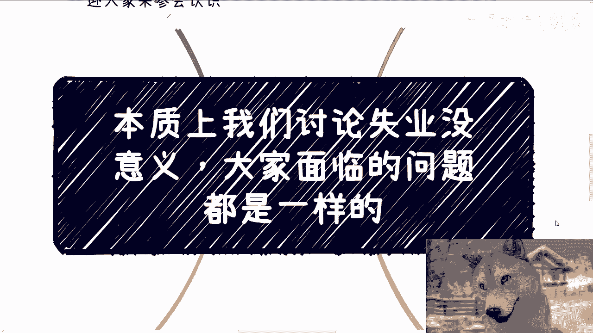
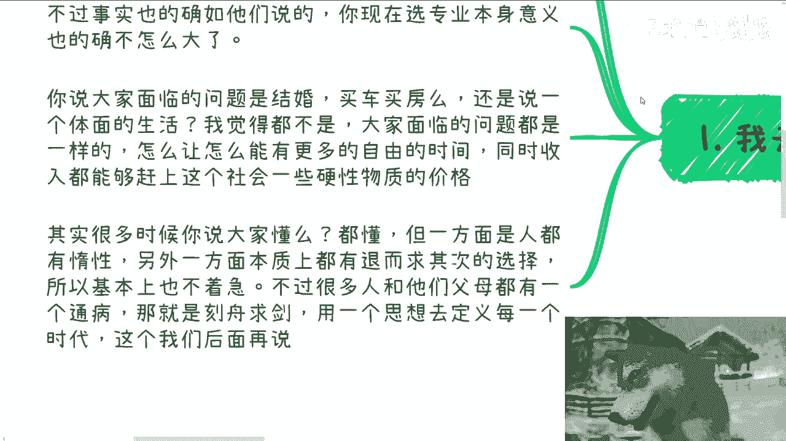
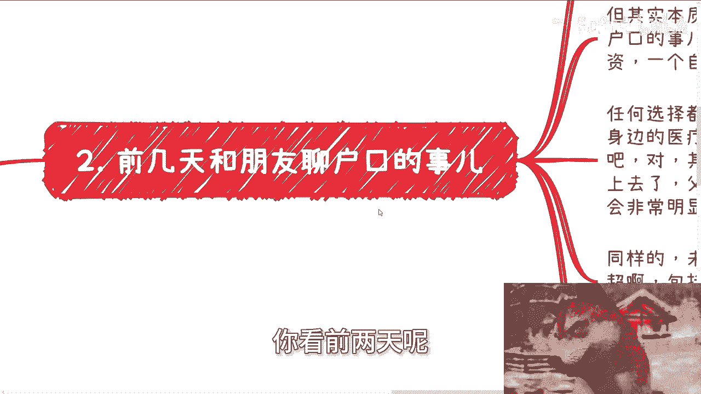
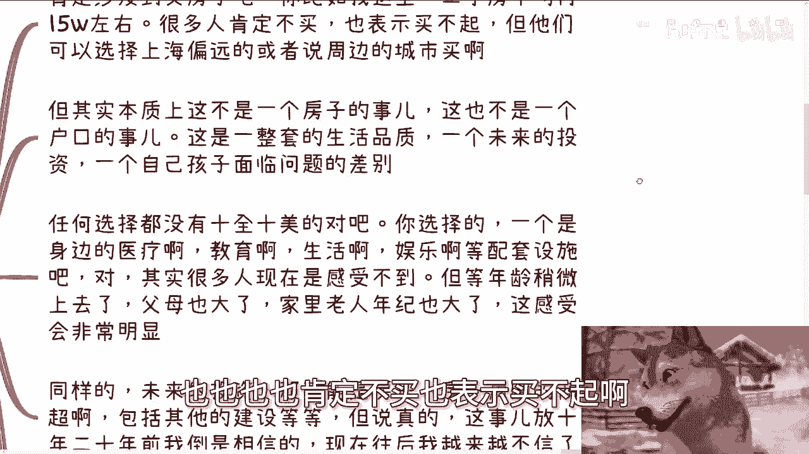
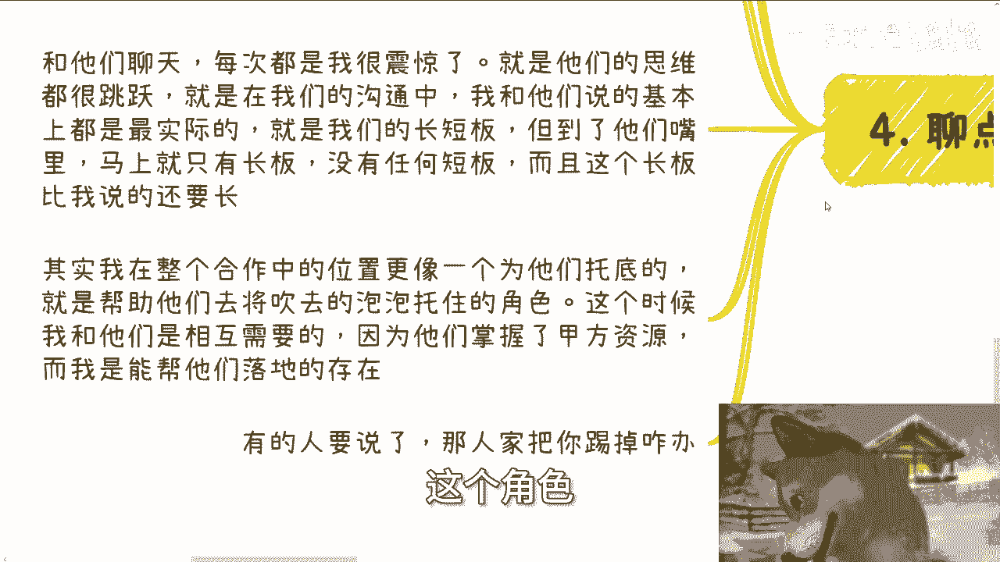
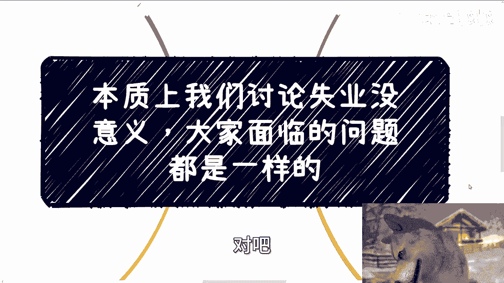
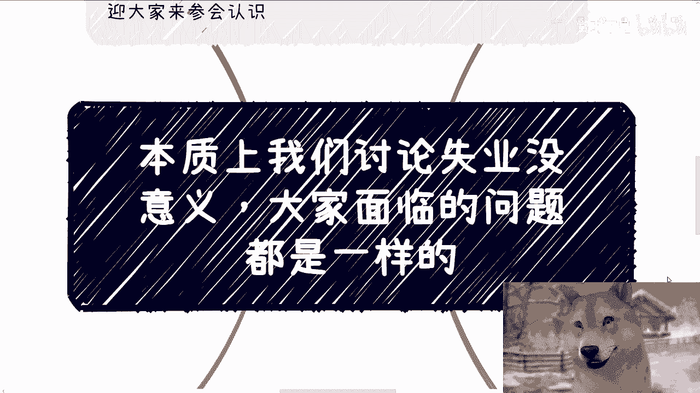

# 大家要解决的是如何在更多自由的情况下，收入能赶上物价的上涨 - P1 - 赏味不足 - BV1BVpweHEoC

好那这个我们还是聊点怎么说呢，聊点本质的东西啊，聊点干的东西呃。

我今天去B站晃了一圈啊，我看了一下就是哎其实大家讲不出什么东西来，都是通稿，所以呢我是觉得其实现在讨论来讨论去，你说什么学校啊，什么专业啊对吧，然后然后啊什么时候你说几岁失业对吧，怎么样子啊。

呃面临这些问这个这个问题呢，其实我觉得没什么意义，因为本质上你们也好，我也好，所有的普罗大众，就从老百姓角度来讲，大家面临的问题其实都一样啊，那么首先我先说一下9月8号在上海啊。

本期是2024年的第二期数字经济大会，那么详细的话呢可以进评论区的报名链接好吧，本次活动呢也邀请了一些资方啊，还有我的一些创业合作伙伴，反正你们来了嘛，也可以多认识认识对吧，以后也不用也不一定找我嘛。

你们可以找他嘛对吧，首先先说第一个啊，就去B站上晃了一圈啊，就我觉得呃都是不同的账号，然后发同样的内容，然后不同的封面点进去都差不多，然后最近就是山东这边，青岛这个事情也比较多嘛对吧。

其实我觉得大家隐隐约约都能感受得到，就是信息的封闭跟一些封锁，包括和谐已经越来越快了啊，越来越快了，就是你包括我现在跟你们呃，就是跟你们说的这种什么不同的账号啊，通稿啊。

就你们以后可能再过个一两年两三年啊，我觉得快的话，比如说两三年可能网络上都是通稿了，你们看得到活人吗，难对吧，为什么，因为活人没什么好说的，活人说了既容易被封，又赚不到钱，有什么好说的呢，对不对啊。

不过就是说从这个选专业角度来讲啊，我觉得事实也如他们所说的，就是你现在选专业本身意义也的确不那么大啊，你说大家面临的问题是结婚，是买房买车吗，还是说面临的是一个需要一个体面的生活。

我个我是觉得其实都不是。

这我们真的所有人面临的问题不是这个问题，我们面临的问题都是一样的，就是怎么能让自己能有更多的自由的时间，并且在年轻的时候啊有更多的自由时间，跟我说，七老80了有什么用呢，对不对啊。

那么同时呢收入还能赶得上啊，这个社会的一些硬性物质的一些价格，对不对，这个是我们面临的问题，而不是说结婚买房买车啊，其实很多时候你说大家懂吧，我觉得多多少少心里也懂，但是一方面呢人都有惰性。

而且另外一方面呢，本质上我觉得可能很多人啊，也有退而求其的选择，就并不是说他家里面有多么大的好的条件，或者怎么样，我觉得可能更多的也是有一些叫什么，往下叫做比上不足，比下有余的各种选择对吧。

所以基本上也不着急，不过很多人呢跟他们父母啊，我觉得都有个通病啊，那就是刻舟求剑，你就像很多父母到今天还觉得啊，你们要去铁饭碗要去怎么样子，这他妈是一个年代吧啦对不对对吧，就是我们有很多人说啊。

我们要去看历史，要看怎么样子，是但是不是让你去照搬对吧，你包括有很多人说哎我们要面临一个经济周期，你妈也搞笑嘞，噢你说大周期10年哦，然后整个全球啊就跟着10年大周期走，而大周期去走会不拉。

那不现实的呀，就是意思是很多东西它是相通的对吧，大家去看一些东西是可以参考的，不是他妈的去刻舟求剑的对吧，就直接完全去挪用你你你你没脑子对吧，你用一个思想去定义每一个时代没有意义的啊。

那么第二你看前两天呢。

我跟那个朋友聊户口的事情，我说户口这东西呢肯定涉及到买房，对不对，那你比如说我这里啊，二手房平均就上海新天地这边啊，二手房平均在15万左右呃，跌完现在也差不多在14万到20万之间嘛。

啊那么很多人肯定买不起啊，也也也也也肯定不买，也表示买不起啊。

但他们可以选择上海偏远，或者说周边的城市啊，或者说这个北方啊对吧，或者其他地方啊去买，但其实本质上你说这是一个房子的事情吗，不是啊，这也不是一个户口的事情，这是几个点，第一个点是一整套的生活品质。

第二个点是未来的投资，那第第三个点就是一个是孩子面临问题的一个，差别对吧，那么你想啊第一个点我们就来这么说啊，任何选择都没有十全十美的，对不对，也就是说你选一个东西，它一定有长有有有有优缺点好。

那么你选择的一个是身边的医疗啊，教育啊，生活啊，娱乐啊等配套设施对吧，那当然很多人这个东西你只要没有面临问题，你只要没有追求，你其实是感受不到的，但你真的等到年龄上去了，或者说父母年龄大了。

家里年老人年纪也大了，你这感受会非常明显对吧，你就我们随便打个比方，你说你孩子要娱乐，你出去吃个饭，你是跑个56km，10km，还是家旁边就有方便你看病对吧，你是打个120，他妈的，120拿个担架啊。

然后就是跟你说好，我们马上赶到了，叭叭叭叭叭叭开开车，然后堵在半路当中，还是说是他妈的，你在旁边就有对吧，你差别很大的，就是你们有没有发现就是很多人啊，就我们日常跟朋友聊天，你说大家都会聊到什么啊。

聊到道德对吧，聊到孝孝顺，聊到很多东西，你说孝顺是嘴巴上说的吗，不是啊，你孝顺是给钱吗，也不是啊，孝顺是什么，孝顺就是我们该尽到的义务，要去尽到对吧，包括父母的义务，包括我们自己的义务。

包括对孩子的义务，那么这个义务具体表现什么地方，你除了软性的教育，软性的有沟通以外，硬性是什么，就是你该要能创造条件时候创造条件，该要能够有满足条件时候要满足条件对吧，有你你你否则呢有什么用呢对吧。

就像我们刚刚说的，你说我们就打，就拿刚刚的那个比方来讲，你说我今天有一个离你家近的啊，但是它很贵，比如说他他今天呃120过来对吧，住病房20万哦，你说那那我一下子拿不出这么多钱。

那我只能退而求其次找一个，比如说56km，10km的，20km的，这叫什么对吧，你虽然啊我们说是你到时候到那个时间点，你可以说哎我就这个能力我已经尽我所能了，但是你有没有想过，你假设你到时候35岁。

你尽你所能了，但是你之前尽你所能了嘛，啊你之前努力过吗，你之前为了后面做过准备吗，没有啊，这叫笑什么，对不对，就很多时候就是说当然啊，我也没说我说的就一定是对的啊，我只是跟你们抛我的这个思想对吧啊。

那同样的未来的投资，比如说你买了一个房对吧，你有个户口，那这个房子未来它周边可能会有商超啊，或者会有别的种建设啊对吧，那说真的啊，但是但是咱话又说回来啊，就是你说这个事情你放到10年前20年前，诶。

我的那个狗子呢怎么又不动了，诶诶诶好好了，就是你说你你说我刚刚说的这事儿，包括就是说未来的商超啊，其他建设投资啊，我觉得这事放到10年前20年前我倒是相信的，但是现在越来越往后呢，我是越来越不信啊。

那第三个孩子啊，其实也是个选择，你说你这么想，你说一个一线城市户口，跟别的城市户口差别大吗，也许大大在什么地方呢，大概就是说一线城市这个孩子能搏出来的概率，能够有所沉淀，有能赚到钱。

能够改变自己生活的概率，可能会比别的城市来的高那么一丢丢对吧，是有这种可能性的，但是你单纯这么去想也没有用，为什么，因为如如果你单纯只是给他个一线城市户口，而你没有足你你你你你的生活很拮据。

你也呃可能有负债，那说白了你也好，孩子也好，都会过得很苦，图什么呢对吧，我现在说的最多一句话就是图什么呢，我不明白呀是吧，所以就是说我们真的去看问题，我们不能单纯看这个东西啊，第三我们来说点家常啊。

今天早上我一个朋友跟我说，他爸走了对吧，怎么说呢，你要从我角度来讲，客观的看待问题啊，不要老用道德去绑架别人或者绑架自己的情况，下面我觉得走的蛮好的，为什么我们接下来看，其实我身边这种事情很多很多。

你说钱重要吗，重要啊，但是可能没那么重要，你说不重要吧，它能解决99%的问题，也能防止很多的问题对吧，我跟你们这么说，他爸他是一个慢性病，住院到现在差不多有一年多的时间。

一年半的时间真的很折腾人力物力财力对吧，我这么说啊，他已经是算有钱的了，他算是赚到过钱的，你放到一普通人身上根本就无能为力，我就直白点跟你们讲啊，也那但是话又说回来，也许我不是他儿子，我说话的确不腰疼。

但很多时候拖着这件事情，你们仔细想看，对谁都没有好处对吧，我我刚刚就说了，我这个朋友还算有点财力的，但一般人呢怎么托得起呢，但是你能拔管子吗，不能吧，对不对，那之前有朋友跟我说。

他觉得啊人活着就应该玩啊，就应该享受，不是来受苦的，我说这他妈是个屁话，谁愿意受苦啊是吧，但现在整体规则是什么啊，你20多年硕士读完啊，30多年三十三十三十岁或者二十八九岁，博士读完，你才刚开始吃苦啊。

但是人生1/3过去了，对不对，而且你这苦吃了还不一定能有效果对吧，所以我这边才说以前吃苦吧，你多少可能还能有些所得，你现在吃苦啊，就要他妈的苦越吃越多，对吧啊，第四啊我们聊聊点有趣的啊。

我身边呢赚到钱的呢其实不少啊，也都是所谓的普通人走过来的啊，说句笑话啊，就是怎么说呢，就是爱信不信啊，就是他们共同特点呢都是学历都不高啊，然后年纪的话呢，差不多在30~35岁当下啊。

同时呢忽悠能力极强啊，极强啊，至少在企业政府端的能力比我强八条大马路啊，呃然后说到学历这个事呢，我也可以提一嘴啊，就是其实学历这个事呢你可以追求，那我可以告诉你们他们怎么做的。

他们就是赚到钱之后去水了一个雪梨，现在也很开心啊对吧，对外炫耀时候可以炫耀他的学历啊，然后也有钱啊对吧，但是很多人逻辑是反过来的，寒窗苦读，为了这个学历，那最后得到了什么呢，nothing对吧。

而且我跟他们聊天啊，每次其实都是我很震惊，就是他们的思维很跳跃很跳跃，就是在我们的工作当中啊，我跟他们说的基本上都是最实最直接的啊，没有任何修饰的，比如说我们有一个产品要卖。

或者我今天有一个什么业务要做，我们的长板是什么，短板是什么，但是你会发现你跟他讲完10分钟不到，到了他们的嘴里，他给你复述出来的时候，马上这个业务他妈的变得只有长板，没有任何短板。

而且这个长板比我说的还要长对吧，那当然你你你我相信啊，你碰到一些很多其他人啊，所谓的这些普通人，他肯定就在那边心里嘀咕了，卧槽这人不太靠谱，这人怎么他妈的张嘴就来对吧，怎么样怎么样，但是其实我们想想。

为什么为什么我能跟他们合作，是因为我很清楚，他们吹的泡泡里面有那么四五十%，唉的确能实现，也不是纯忽悠对吧啊，那么其实我在整个这个活动当中位置更像什么，我就更像一个托底的，因为我没有他们吹的能力啊。

那我只能给他们托底啊对吧，就是帮助他们去将他们吹出来的泡泡，拖住的这个角色。

那这个时候我跟他们其实是相互需要的，因为他们掌握了很多甲方资源，而我只能帮他们去落地，对不对，那这个时候又有人要问了，他说但人家把你踢掉怎么办，嘿哎我们以前就说过，中国做事情是这样子的，第一稳定。

第二和信任对吧，第三才是钱，你明白吗，也就是说我们考不考虑投入产出比考虑的，但是考虑投入产出比之前，只考虑的先考虑的是什么，优先考虑什么是安全，是稳定，是可信对吧，那他把我踢掉是可以踢掉。

那请问他到哪儿再去找一个又安全能合作，能帮他们托底的，能信得过，能托底的人或者团队呢对吧，亦或者来说也许他找得到，他又得花多少精力，多少时间去找呢，值得吗，对不对，聪明人一想就明白，有必要把我踢掉吗。

没有必要，因为投入产出比是负的，是不是，但是你反过来想想看，对我也是一样的，我是必须求着他们吗，也不是啊，我这边合作方多了去了，那多他一个不多少他一个不少啊，大家心知肚明不就好了吗，对吧啊。

你们比我们有机会，只不过就现在这个时间这个土壤啊，非常的恶劣啊，但是不管怎么样，年轻就是资本对吧，那你说很多人年轻的时候不去闯啊，年轻的时候不去不去不去做不去怎么样子，那他妈等到什么时候啊。

啊等到什么时候啊，天那个叫什么天神下凡啊，拯救苍生，那不现实的呀，啊行啊，就这么着啊，然后那个呃角色啊，角色9月8号啊，9月8号那个上海这个活动好吧，报名的话，反正评论区啊。

然后详情的话那个链接里面也都有好吧，然后剩下的话就是说呃你的职业上就工作上啊，职业上的规划，包括商业上面跟别人做副业啊，或者自己去做点什么业务啊对吧，或者说其他的涉及到一些合同啊，分红啊，分润啊。

商业计划书啊，白皮书啊对吧，股估值啊，股权啊等等等，相关的，你们希望跟我的沟通，能够给你们带来一些更接地气的，建议和规划的话，或者说能够得额让你们少走点弯路的话，那么你们可以整理好对应的问题跟个人背景。

