# 大家跟着我一起来搜索找信息，判断项目靠不靠谱吧 - P1 - 赏味不足 - BV17WtjezESh

好大家好，今天呵呵，有个小伙伴私信问我这个什么TH与SU对吧。

青少年创新创业什么模拟峰会是个什么玩意。

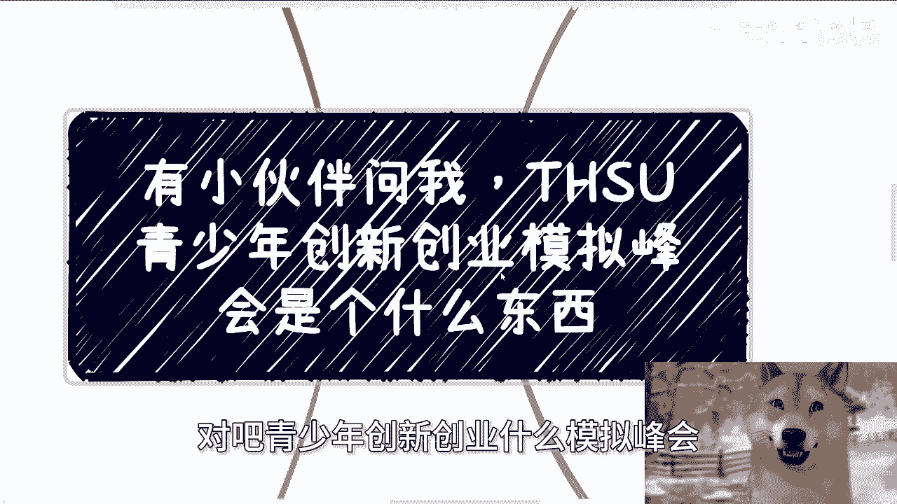

首先啊我也可以跟你们讲一下，你们呢根据我今天这个视频呢，你们也可以了解一下对吧，我是怎么去了解一个东西的啊。

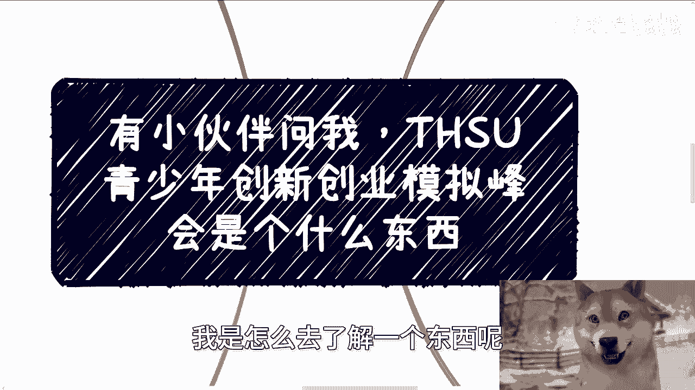

反正很简单，我从头到尾大概花了40分钟吧，对不对，而且还是我一边打游戏一边看的啊。

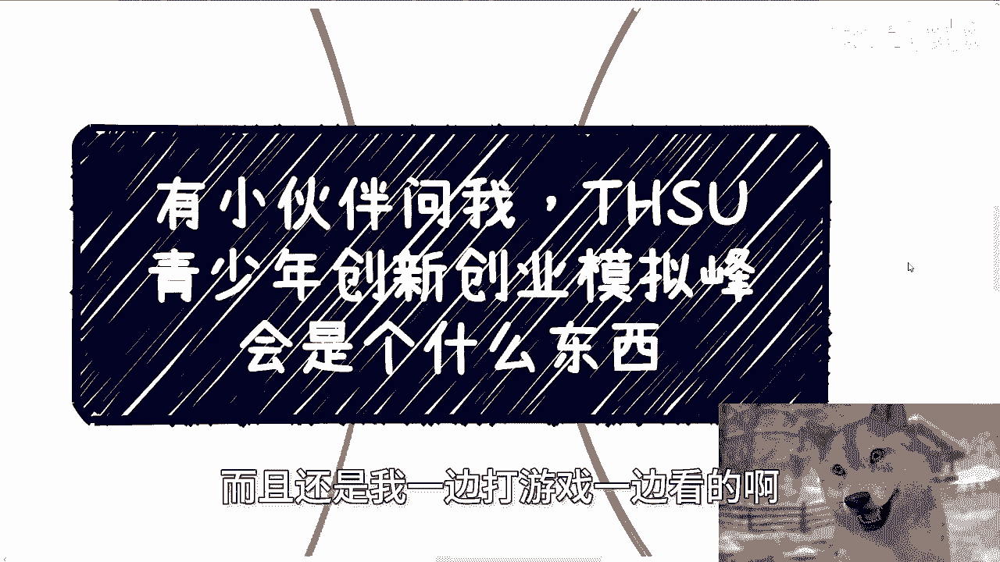

哼你们也可以看一下我是怎么来看这个东西的，首先啊下一期活动已经定了，9月21号就本周六好吧，下午的一点到六点在杭州啊，在杭州，那么本期开始呢定了几个新的主题，一个呢是我会跟大家分享一下。

就是这次上海大会的时候跟大家聊的啊，跟一些院长啊，跟一些其他人聊的政府的最新关注的一些点，一个呢就是我觉得比较重要的，就是我会把之前跟高校呃合作的，那个叫实训平台。

还有给那个政府这边合作的大会的这个方案，我到时候就直接反正投出来给你们看好吧，然后嗯一边看一边解析吧，啊那报名跟了解详情的可以私信我啊，好那么接下来嘿就跟着我，反正就就就这么来看了啊。

你们有空呢也可以自己搜，反正都一样啊，首先啊你还别说啊，我大概搜了一下哎。

哎interesting啊，interesting啊，首先呢我先通过bean搜索了一下，发现这个相关内容呢非常的少，基本上前三页啊，呃所有只要比如说全部的关键字，或者部分关键字匹配啊，结果都一样啊。

结果呢我还不死心，我觉得是不是bin他妈的啊，我就用了百度啊，一般呢我不用百度，因为百度更，对吧啊，啧你们呢也可以用这个关键字去搜索一下啊，神奇的是什么啊，基本上前三页我能搜出来的啊，能看的就两个地方。

一个是上海，一个是天津啊，然后根据这个小伙伴的关键字，以及我看了一系列的信息之后呢，我确定了上海好像不是他说的这个东西啊，那也就意味着这玩意目前搜的出来的，只有在天津啊，那么你们也可以自己搜搜看啊。

那么你们接下来跟着我的逻辑一个个来走啊，首先我们先来看上海啊，首先上海我搜出来的是这么一个东西啊，叫做转发，关于这个叫做第九期，上海市青少年创新创业模拟团队行动啊，那么这个东西呢。

从整个全字符串匹配上面来讲呢，它只能算部分匹配对吧。

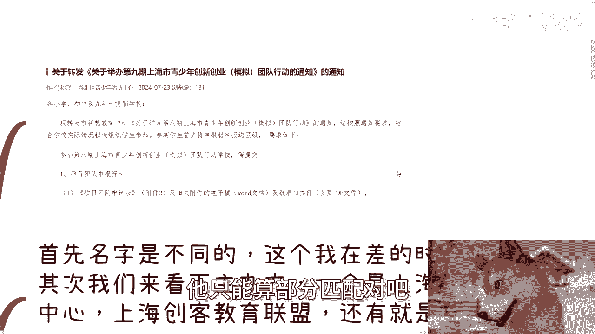

因为他那个私信我的这个人，讲的东西叫做THSU对吧，那整个上海的这个文件里面。

我也没找到THSU这个这个缩写啊，那么它上面是这么写的，首先各小学初中及9年一贯制学校啊，那么也就是说他的受众是小学到高中对吧，诶哦不对，小学初中好，小学初中对高中不算啊，那么发布这个科技教育中心啊。

关于第八期什么什么相关相关啊，什么等等等啊，参加第八期上海市这个相关的行动，学校需提交对吧，相关资料叭叭叭一大堆啊，好那么首先呢在上海这个文件里面，名字是不一样的，这个我在查的时候也是存疑的啊。

当然我我先打个问号，先打个问号啊，其次我们来看一下主办方，一个一共有三个东西啊，一个是上海市科技艺术教育中心，科技艺术教育中心是怎么来的呢，是在该文件里面报名的时候。

联系方啊是科技上海市的科技艺术教育中心，上海呃创客教育联盟呢是怎么来的呢，是在该文件里面的中央部分，会提到整个的活动的组织方，是由上海创客教育联盟来来组织的，还有就是发布房啊。

我们能看到这个上面发布房是清，徐汇区青少年活动中心对吧好，我们一个个来看啊，首先上海市科技艺术教育中心，你看啊，呃举举办单位是上海市教育委员会啊，登记为正常，他的整个的这个信息啊。

你们在指查企查上面是可以看到，他是事业单位啊，是事业单位登记是额，你们在那个因为我没结群了，你们自己去查，反正他是个事业单位，啧，联盟呢其实没啥好说的，因为联盟这个东西呢，额这种东西啊。

无非是数个主体合起来出现了一个社会组织啊，当然你说这个联盟背后有没有主体，我们不知道，就有没有一个就是说真正的啊，比如说商业化的主体怎么样，我们不知道，至少目前明面上是看不出来的啊，但是从百度百科上面。

你们是能搜得到这个联盟的，就是这个联盟本身它只是一个啊，多个高校组成的这么个联盟就没了，好，那么嗯，第三就是我们说的徐汇区的少年活动中心，徐汇区少年活动中心，你们也能看到。

就是他的举办那位是上海市徐汇区教育局啊，那么它在其他上上面的属性也是事业单位啊，那么从上海这个逻辑来讲，我基本上就确定了，这玩意呢，跟这个小伙伴问我的这个东西，应该不是一个东西啊。

因为我两边查下来的信息截然相反啊。

我们再来看天井好，天津天津就非常的interesting啊。

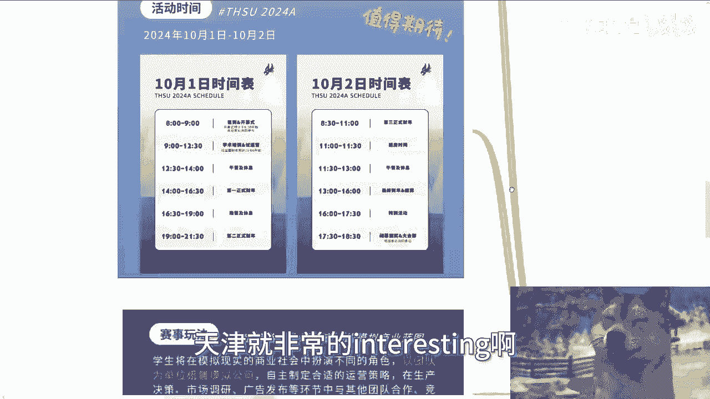

首先报道是这么写的啊，天津市THSU创新创业模拟峰会，OK他全字符串都是匹配的，对不对，好开启报名。

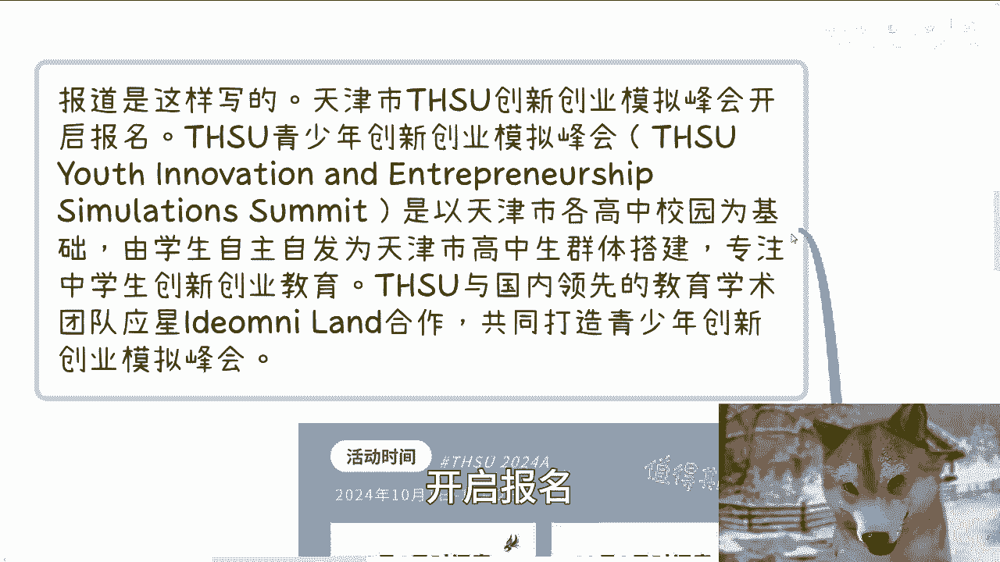

THSU是以天津市各高校高中校园啊，高中校园啊，高中校园为基础，由学生自主自发，为天津市高中生群体搭建，专注中学生创新创业教育，THSU与国内领先的教育学术团队，什么什么什么合作打。

共同打造青少年模拟峰会对吧好，那么这个说法首先我就是存疑的，为什么啊，你今天跟我说，一个挂天津市市的名头的一个所谓的峰会，然后他上来就甩锅说为各高中校园为基础，由学生自主自发诶。

一个高中校园学生自主自发，怎么自主自发啊，未成年人自主自发，你自主自发，我看看，还未成年人组织自主自发了，一个市级的模拟活动，还是个峰会。

还是以市为单位的，啊我我我我有点不太明白啊。

有点不太明白，然后活动时间呢是今年的10月1号到2号。

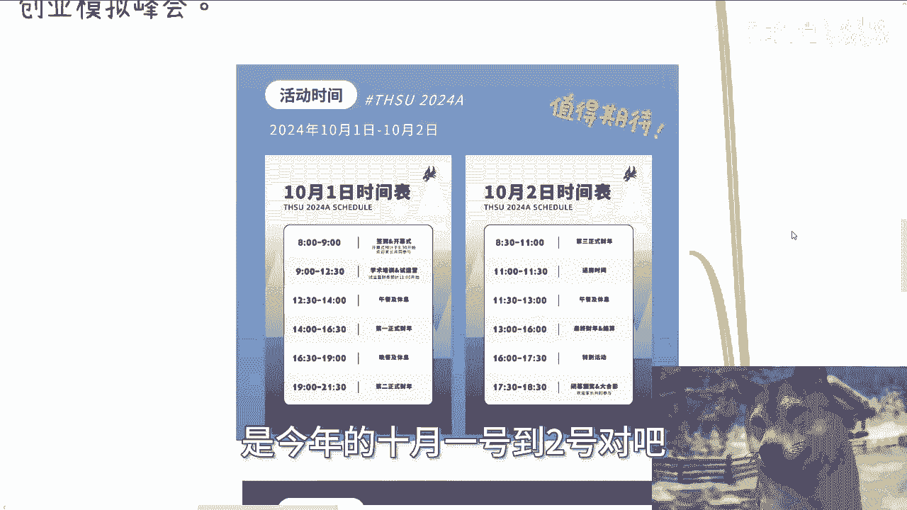

对吧啊，内容你们也看看啊，签到开幕式学术培训啊，然后第一正式财年好，第二正式财年我我就这么说吧，这张海报做的水平，真的还不如B站上的普罗大众，就这啊你敢不敢他妈的写的再他妈简单一点啊。

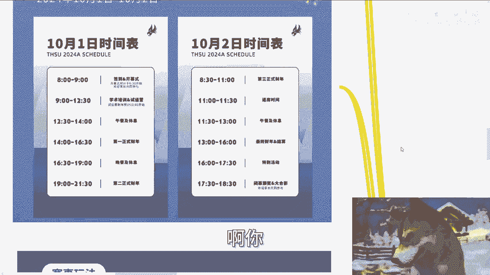

你你敢不敢写得再草率一点，我就说对不对，好赛事玩法啊，学生将在模拟现实的商业社会当中，扮演不同的角色，以团队为单位组建模拟公司，巴拉巴拉一大堆啊，我给你们翻译一下，简单来讲就是我们的模式照搬了。

所谓的头脑风暴，所谓的私董会的模式结束了，只不过我们的受众是那些可能高中生，对不对，然后呢哦你们你们相当于是啊。

高中以高中生群体搭建，专注这个中学生创新创业。

好啊，未成年人对吧，哦好未成年人，你就开始来跟我搞这个什么啊，商业第一财年，第二财年。

哎不看看，现在他妈大学生硕士博士毕业，都他妈不懂你未成年人搞啊。

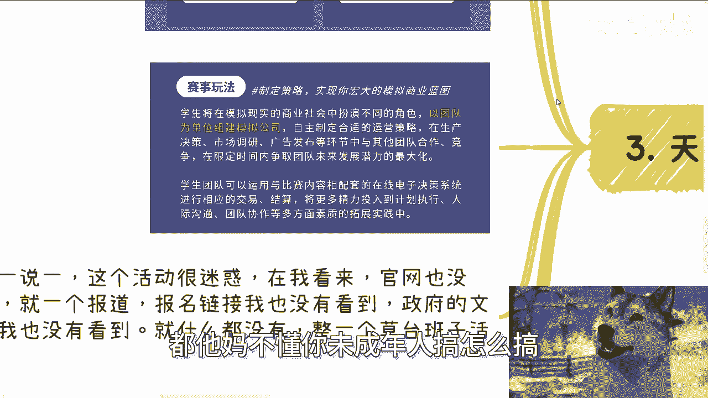

怎么搞搞啥啊，你你看看你们看看这上面写的字啊，自主自自主制定适合运营策略，再生产策略，市场调研，他妈这几几个几个词拿出来，他们懂吗。

有一说一啊，这个活动很迷惑，在我看来啊，我至少我查下来官网官网买没有，就一个报道报名链接，报名链接我也没有看到政府文件，我也没有看到什么都没有。

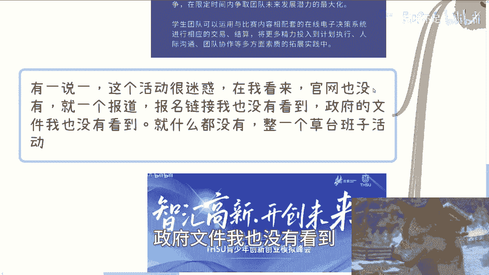

是我我我反，我反正是没查到对吧啊，然后呢哎我还找到了一个这个东西，哎有点牛逼的啊，你看啊，主办单位是天津滨海高新区渤海公益服务中心，指导单位是两个啊，这两个我估摸着我大概看了一下，应该是事业单位对吧。

那么承办单位呢叫做THSU，青少年发展规划团队，这就是个虚的，然后呢叫做硬性学术团队，这也是个虚的对吧好，我跟你讲，这就很interesting啊，首先我们就这么说，任何一个活动主办单位是什么。

是挂名的啊，直到单位是什么，是完全虚的啊，我不知道这个东西是通过什么关系拉过来的，主要的核心是他的承办单位，但是最神奇的是，这个承办单位下面是没有单位的，他他妈两个团队，我就请问单位是什么啊。

哎我他妈奇了怪了对吧，然后这个主办单位也很神奇，主办单位叫做天津滨海高新区，渤海公益服务中心，他既然是个公益服务中心，那你做什么东西啊啊。

我不知我我不明白啊，对不对。

就是我整个逻辑啊，我不说这个东西到底是里面有没有人赚钱。

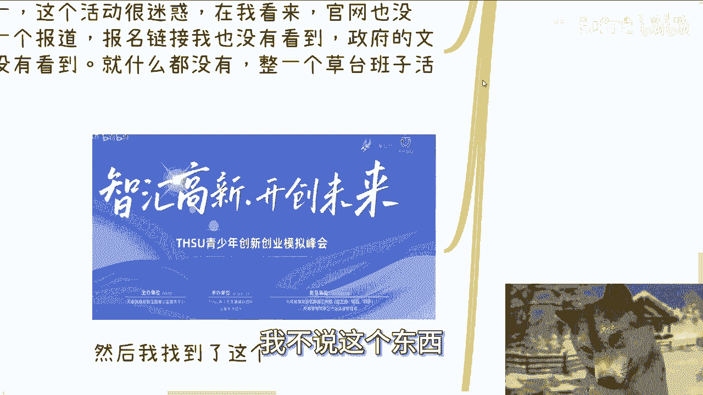

或者有没有问政府要补贴，我也不知道啊，但是我只知道一点，就是主办单位是个公益服务中心，承办单位是两个没有单位的东西，然后一系列的介绍，再加这做的非常草率的海报，哼我只能说一下我整体的感受啊。

首先我的确不了解啊，也没有任何偏向性，就单纯从我的商业逻辑来讲，既然有人提了啊，我就来说一下上海这个东西，我觉得有文件，有申报材料，有理有据，不管最终你说这个证书到底有没有吊用啊，赛事有没有真的作用。

我先不管，但是从整个流程上面是靠谱的，而且也是两家事业单位联合起来来做的啊，那么天津这个，我虽然我不知道问我的这小伙伴，说的是不是天津这个，但反正我的判断逻辑很简单，以我的商业思维，网站公众号文件。

主办单位，承办单位，包括定位逻辑等，你足以看出这玩意是否有啥用，或者来说核心的目的是什么啊，当然有没有价值，我不判断，仁者见仁，智者见智，反正从我的商业角度来讲。

就天津这玩意我就一个评价啥他妈玩意儿对吧。

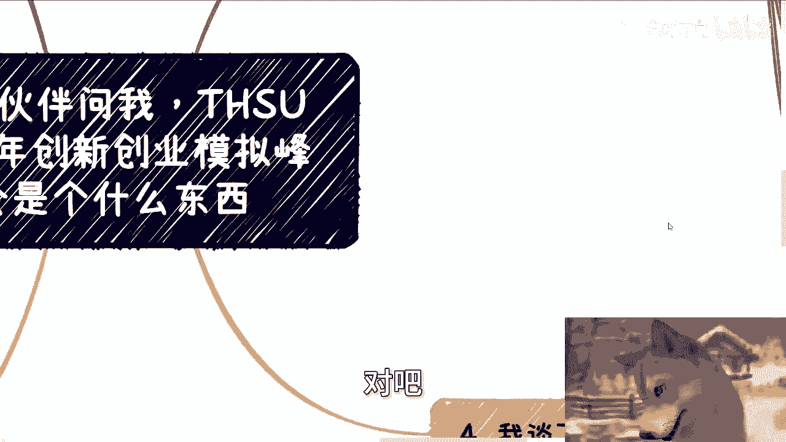

唉还不如他妈的，我们啊B站上很多小伙伴做出来的东西靠谱。

什么玩意，我就那句话我不管啊，就是要么就是这个主办方垃圾，要么就是这个承办方垃圾，要么就他妈指导单位垃圾，哎我管他他妈的，你天津市是是天津市的事业单位，怎么样也好，事业单位就做出这么吊毛吊。

吊吊活动出来妈离谱。

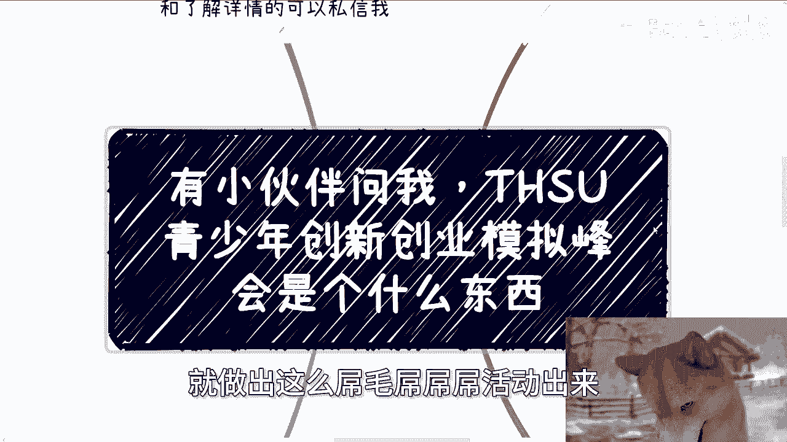

真的是好吧，我觉得啊就是咱有一说一啊对吧，好的，我们要表扬对吧，坏的他妈也不能他妈的，就是就是就就不管对吧，我觉得所有东西你既然拿出来，就是接受人民群众监管的啊，那么这个东西本身做的这么一个草台班子。

这么一个样子，我觉得哼反正你们自己判断吧啊行吧。

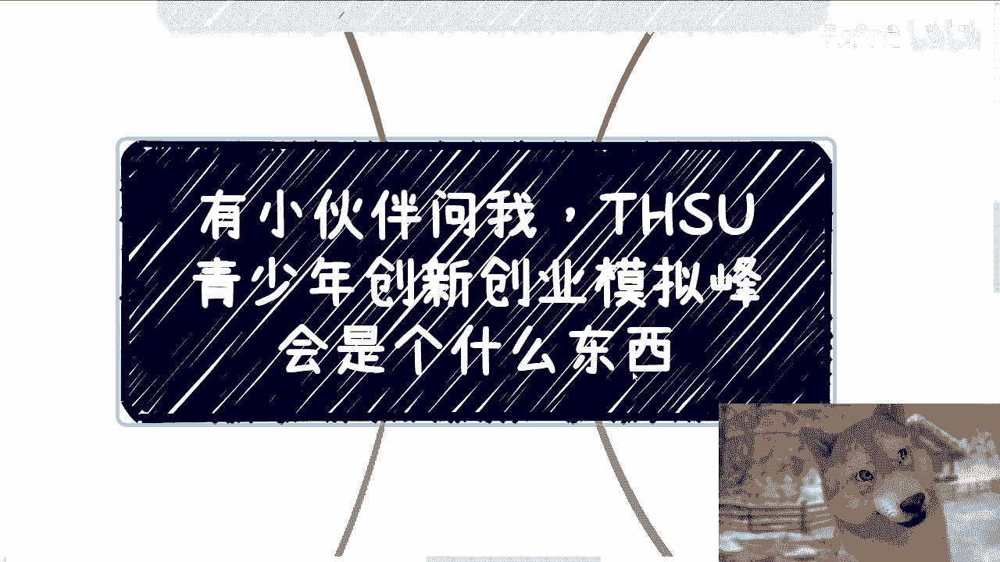

那个活动好吧，活动我们继续举办，继续报名好吧，9月21号，那么剩下的话就是说你们的这个呃工作上面，职业规划啊，包括商业规划啊，包括就是你们跟别人做副业啊，自己想创业做点什么东西啊。

或者业务层面有哪些不清楚的地方啊对吧，你们可以啊，整理好对应的个人问题和个人背景好吧，然后我们再来组咨询啊，你们要是觉得这当中有任何的一些啊，希望我给你们一些具体的建议。

或者说能够啊让你们少走少走点弯路的话，那么你们啊，你们整理好对应的个人问题跟个人背景好吧，我们再来做咨询，好行。

