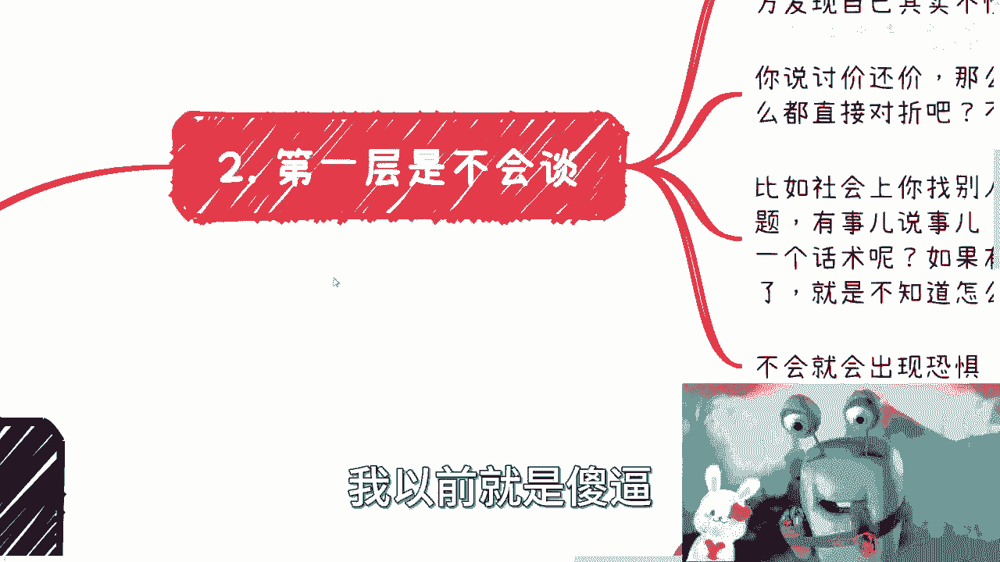

# 课程 P1：克服“不敢谈钱”的心理障碍 💰

在本节课中，我们将要学习一个普遍存在的心理障碍——“不敢谈钱”。我们将剖析其背后的原因，并提供实用的思路来克服它，帮助你在商业谈判、日常沟通乃至个人发展中变得更加自信和主动。

---

## 概述：一个普遍存在的困境

“不敢谈钱”是一个通病，它在商业上表现为不敢报价、不敢谈薪资，在生活中则表现为不敢讨价还价、不敢主动交涉问题。其本质是“不敢沟通”。

很多人并非不想赚钱，但当需要为价值定价或争取利益时，却常常退缩。这背后是一系列复杂的心理和认知因素。

---

## 第一层原因：不会谈

上一节我们介绍了“不敢谈钱”的表象，本节中我们来看看其第一层原因：**不会谈**。

“不会谈”源于对相关领域缺乏了解和经验。因为不了解，所以不知道如何开口，更害怕开口后暴露自己的无知，从而陷入恐惧和停滞。

以下是“不会谈”的几个典型场景：

*   **谈薪资Offer**：不了解行业薪资构成（如月薪、年薪、股票、年终奖等），不清楚合理的谈判范围，因此不敢开口。
*   **日常讨价还价**：不清楚商品合理的价格区间，不知道如何有技巧地还价，要么不敢开口，要么开口就离谱。
*   **社会交涉**：不知道如何开启对话、使用合适的话术和语气，遇到对方态度恶劣时更不知如何应对。

所有这些都指向一个核心问题：**社会阅历和实践经验不足**。学校教育和日常工作环境往往无法提供这些锻炼机会。

**核心公式**：`不会谈 -> 产生恐惧 -> 不敢行动 -> 恶性循环`

---

## 第二层原因：不敢谈

了解了“不会谈”的技术层面原因后，我们深入其心理层面：**不敢谈**。

“不敢谈”的深层次心理原因主要有以下几点：

1.  **潜意识的自卑**：可能源于成长经历，即使意识上认为自己已克服，潜意识里仍会影响行为。
2.  **自我能力怀疑**：觉得自己能力不足，担心对方不会相信自己。
3.  **害怕失败**：恐惧谈判破裂、被拒绝或搞砸关系。

其本质是**没有明白一个简单道理**：沟通是解决问题的正常途径。只要事先做基本的市场调研，了解大致情况，提出合理的报价或要求是完全可以的。

**你需要明白**：
*   谈判对象往往也是“打工人”，他们也有自己的KPI和压力，你无需过度畏惧。
*   如果你是业务方，在创造价值层面，你可能比对方更有优势。
*   害怕执行出问题？**“天要下雨，娘要嫁人”**，问题出现后再解决即可，恐惧只会让事情停滞。

---

## 错误的认知：认为“我不需要懂”

除了“不会”和“不敢”，还有一种阻碍进步的认知：认为 **“我不需要了解这些”**。

有些人觉得，自己不是负责人，或者有团队合作，就可以把报价、合同等事情完全甩锅给别人，自己只专注技术或执行。

这种 **“甩锅心态”** 是极其危险的。在商业世界中，你可以不亲自操作，但**必须了解**关键环节。否则，极易在合同、股权、分润等细节上被坑，导致前期所有努力因小失大，最终与合伙人一拍两散。

**核心认知**：`你可以不负责，但不能不了解。`

---

## 如何解决：增加阅历与主动实践

那么，如何从“不敢谈”变得“敢于谈”且“善于谈”呢？关键在于**增加阅历和主动实践**。

沟通技巧的核心是“见人说人话，见鬼说鬼话”，这需要大量的观察和练习。面对政府领导、商会前辈、草根合作伙伴，沟通的方式和语气截然不同。

以下是提升的关键：

*   **多看多聊**：接触三教九流，观察不同人的沟通方式。
*   **主动尝试**：从小事开始练习讨价还价、主动交涉。
*   **接受失败**：失败是最好的老师。没有足够的失败经验堆积，就无法锤炼出真正的沟通能力。

**最终路径**：`主动实践 -> 积累失败经验 -> 总结反思 -> 提升沟通能力 -> 建立自信`

---

## 总结与行动建议

本节课中我们一起学习了“不敢谈钱”这一普遍心理障碍。

我们剖析了它的三层原因：
1.  **不会谈**：因缺乏知识和经验而产生的技术性障碍。
2.  **不敢谈**：因自卑、怀疑和恐惧而产生的心理性障碍。
3.  **不想懂**：因逃避责任而产生的认知性障碍。

解决之道在于转变心态：**沟通是解决问题的正常手段**。通过主动学习市场知识、勇敢进行实践、并坦然接受过程中的失败，你可以逐步积累阅历，打破恶性循环，最终在商业谈判和个人发展中掌握主动权。

记住：**你害怕的往往只是“未知”，而行动是消除未知的唯一方法。**

---
*（注：文中的个人活动通知等内容已根据教程要求略去，仅保留核心教学部分。）*