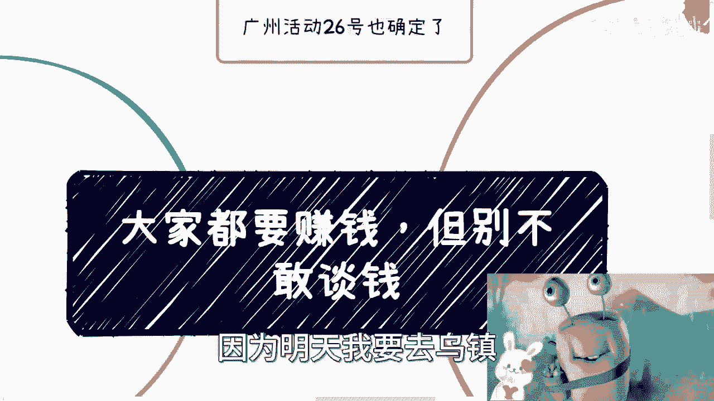
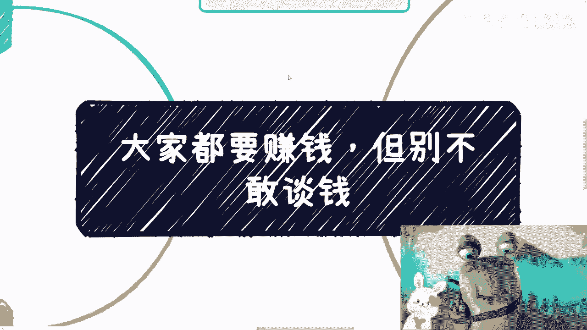
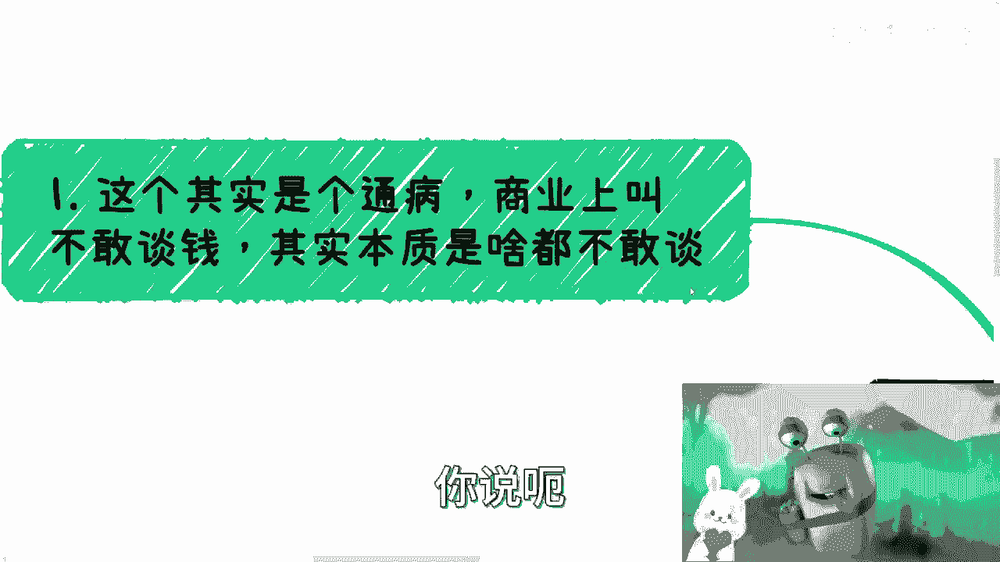
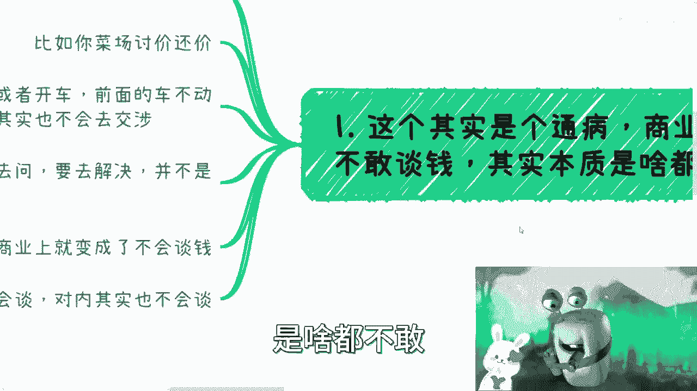
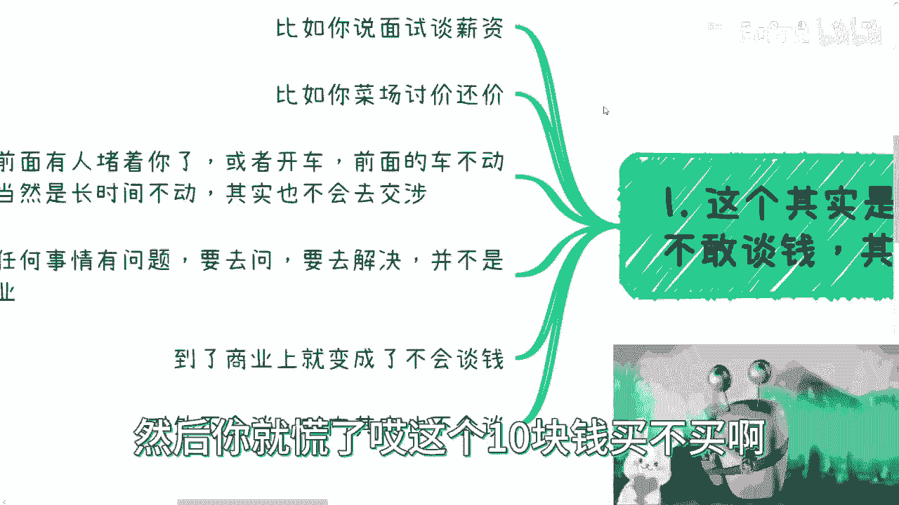
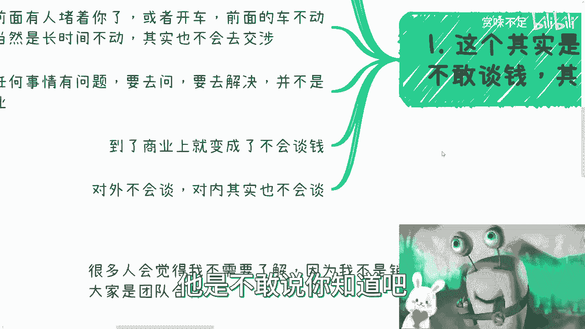
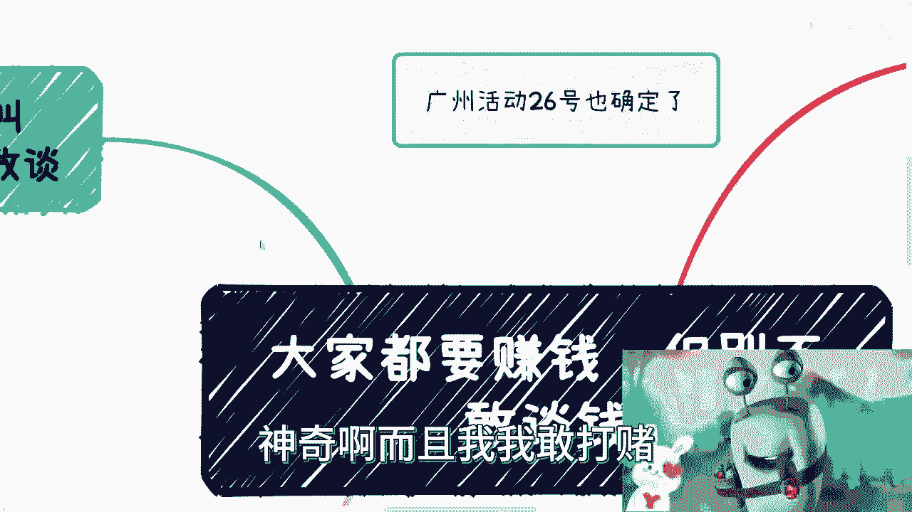
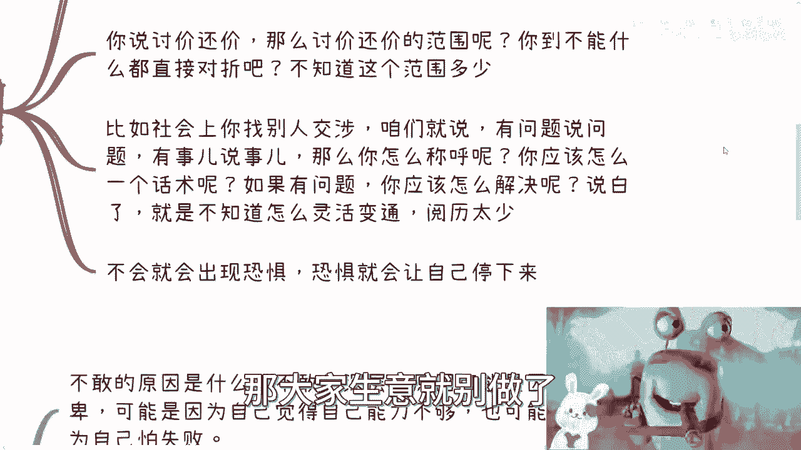
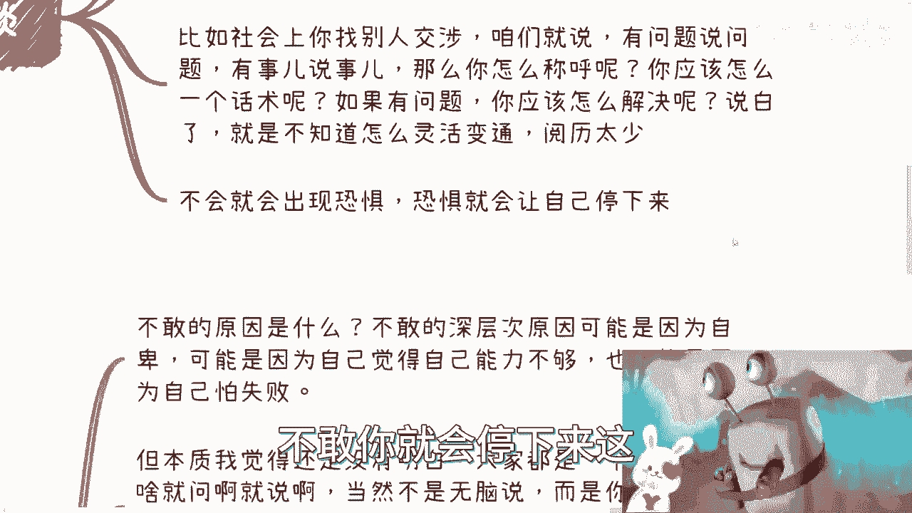
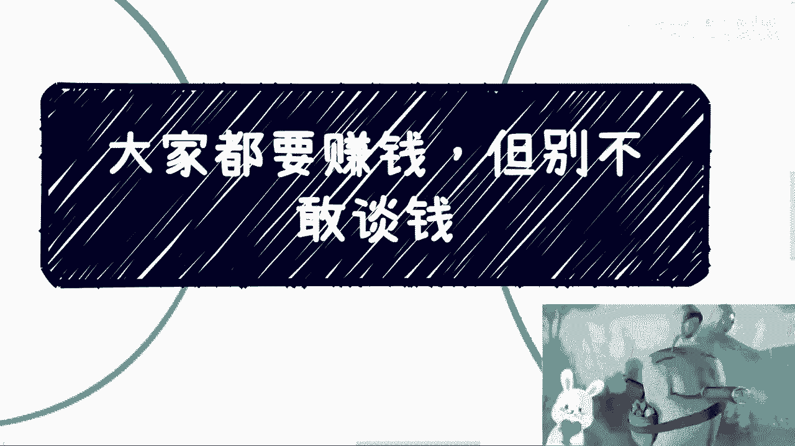

# 大家都想赚钱，但大概率大家也都不敢谈钱 - P1 - 赏味不足 - BV14e411D7G8

啊大家好啊，今天礼拜100加礼拜二，明天呢嗯哦不对，就礼拜三啊，我过日子过分了，嗯明天呢我可能不一定会更新，因为明天我要去乌镇参加一下那个元宇宙大会。

最近不是都在乌镇嘛对吧，这个明天一早我他妈七点多的高铁我去好，那么首先先说一下啊。

那个26号广州的活动场地我也订了，然后目前已经开放报名了好吧，大家要是来的话，大家反正欢迎报名呃，目前来讲的话呢，就是现场流程很简单，就是我会分享一个topic。

就是关于web2和web3这边的叫什么数字经济，然后呢剩下时间呢，我觉得大家反正现在嘛就有什么东西，你们问好吧，反正只要你们不录音，不要举报我哈，都都可以啊，嗯嗯好吧，详情看我那个B站的状态。

好吧好，那么本期那个内容呢，我们来讲的是大家都要赚钱，但不敢谈钱，我跟你说这个事情是这样子的，我敢打赌你身边100个人里面95个人，96个人都是这样子的啊，你别看大家说你问他想不想想，你问他敢不敢不敢。

他也不一定说不敢，但是他肯定是不会也不敢让他这样去谈，他就怂了，你懂吗啊，好哎。

我觉得我觉得我这个形象啊形象过于单调，让让我让我有点让我让我搞一把，有点的气息对吧。

哎你看这样就好了，你看啊，首先啊你说呃其实这个呢是个通病。

就我们在商业上叫做不敢谈钱，但本质是啥都不敢呃。

你们看啊啊比如说你说面试谈薪资啊，他也不敢谈呃，唯唯诺诺对吧，呃比如说你菜市场讨价讨价还价啊，他也不敢开口啊，在那边犹豫半天啊，你这个到底怎么样呢，人家说你买不买买不买，然后你就慌了。

哎这个十块钱买不买啊。

买买买买买对吧，就这样啊，然后还有呢，比如说前面有人堵着，你对吧，或者开车，或者说前面的车不动啊，那当然了，就是他是那种比如说长时间补充一般的话，你等等吧，我觉得也没什么，这也没什么毛病嘛，对不对，好。

但是呢你比如说有些什么问题，前面堵住了，或者就不走，长时间不动，那你想吧，你得上去交涉，对对，不是说你上去吵架啊，我就说你上去问问看什么情况啊对吧，大概什么情况什么样子啊，有什么问题怎么解决啊对吧。

你包括就像疫情的时候也是一样的，你有任何东西你不能停在那边对吧，你得去沟通，但是你会发现很多人啊他不是内向外向的问题，他是不敢沟通，当然你说为什么，我觉得我不知道，就是可能是综合原因啊。

然后你比如说社会上任何事情呢。

有事情有问题，你要去问，你要去解决，而且并不是说只是商业，对不对，你到了商业上呢，就就其实就是一个东西展现，叫做不会谈钱啊，然后呢你会发现他对外不能不会谈，他对内其实也不会弹啊。

你比如说他对外报价不会报他对内，比如说大家分润怎么分，他也不知道，而且他不是不知道，他是不敢说。

你知道吧，呃呃就这个里面原因很很很神奇哦。

而且我我敢打赌，就是你们现在听这个视频的人，你们多数也是不敢的啊。

甭管你们承不承认啊，反正我跟你们承认，我以前是不敢，我以前就是。

哎就这样子啊，就是第一层它就是不会弹，因为为什么什么意思啊，叫做你比如说弹offer，他就是不会弹，因为他这方面对整个行业他就不了解，他也不知道这offer里面有哪些道道对吧。

他的offer整个package的组成部分是什么，他不知道啊对吧，而且他也担心就是说谈了啊，他他自己因为不知道嘛，他谈了怕对方发现自己其实不懂啊，你问人家问了对吧，你觉得就是这个offer的报价对吧。

大概怎么样，定价怎么样，你不知道啊，你说我到底是定个月薪呢，还盯着年薪呢，那年薪这个package里面哪些是股票呢，哪些是分，哪些是那个年终奖呢，对吧，你不敢说啊对吧。

而且你不敢说的很多原因是因为你不了解，那这是第一个，第二个你说讨价还价。

你比如说讨价还价，他一方面啊叫做叫做什么，他就是不会弹。

他什么叫不会谈，就是你比如说十块钱，你讨价还价多少范围呢，你总不能跟人跟人家说来五块钱哎，一块钱对吧，就是你们可能在短视频里面看到过那种，什么讨价还价，什么砍价牛人对，砍价先人是吧。

哎呀这种东西就是有吗，你说有的，但是你这个东西不符合常理啊，对不对，你不能拿一些幸存者偏差的东西来讲嘛，对吧，那日常你比如说买你买个青菜对吧，买个什么买，买个那个那个那水果对吧。

你总要跟人家讨价还价吧对吧，那怎么讨呢，它范围是多少呢，是几毛几毛桃还是几块几块讨呢，对不对啊，那么同样的你比如说社会上你找别人交涉啊，咱就说啊你说有问题说问题，有事说事，那么你比如说啊。

你怎么称呼对方呢，对吧，你应该怎么一个话术沟通呢，你应该是什么语气沟通呢，对不对，然后如果有问题，你应该怎么解决呢，那如果对方对你就是比如说你态度很好，对方一上来就对你态度很恶劣对吧，或者怎么样子。

那你应该怎么解决呢，对不对，就是所有东西啊，它其实都是一个灵活变通，那我总结下来其实就是阅历太少，你知道吗，就是因为这种阅历，你想啊你在家里面也没法锻炼对吧，你在学校里面好啦，都是应试教育你。

你没有办法锻炼的，那到了社会上可能很多人就是爱工作对吧，然后比如说同事对吧，怎么样，你也不会碰到一些就是那些事情，就像我为什么跟你们说，商业跟应试教育不一样对吧，就像很多人问我。

他说爱吕老师这个合同应不应该这么签，我说没有什么音，不应该这么签，你先告诉我你要干嘛，对不对，就如果合同都有这种音，不应该怎么签的话，那大家生意就别做了。

那每个人做这生意都一样了，对不对啊，那么我跟你讲啊，就是第一层你不会你就会出现恐惧恐惧。

你就会让你不敢不敢，你就会停下来。

这些东西都是恶性循环，你知道吧，这第一个哎，我发现最近他妈的最近很多人叫我爹是吧，我觉得也有点道理。

真的我唉真的操碎了心啊，然后第二个呢我觉得第二层是不敢啊，什么意思呢，就是说他不敢的原因是什么，不敢的深层次原因我觉得有那么几个，但我不知道哪哪几个啊，就是第一我觉得一种是因为自卑。

但这种自卑呢不是说你问他你自不自卑啊，我不自卑，但不是说他自不自卑，而是说他的内心深处，可能比如说小时候啊或者其他的一些原因对吧，就导致他的自卑，你不是说他现在意识不意识到自卑，他可能意识到对吧。

但他觉得我已经克服了，但是其实深层次潜深层次他的潜意识，他可能还是有这一层因素在啊，那么第二个呢可能就觉得自己能力不够，那么对方为什么会相信我对吧，那第三个呢因为自己怕失败，我觉得主要就这三个原因。

但本质呢我觉得还是没有明白，就是我觉得本质是大家没有明白，就是说都是一个人对你有啥你就问，当然不是无脑的问，而是说你简单了解市场，了解哈，一定东西，就像我们前几天说的那个人与人的合作对吧。

不是说你跑上来说刘老师，我们合作吧，这就没意思了，你要说清楚对吧，我们怎么合作对吧，你你出什么，我出什么，那你包括这个叫什么呃体呃，那个叫什么，就是报价也好，怎么样也好，其实都一样的对吧，你做下调研。

简单了解一下市场，你就报啊，你就开价有什么不能的呢，对不对，你只要不是太离谱，你说人家市场价50万，开1000万，那他妈你是对吧，你要是市场卖50万，你开60万，我觉得也没问题啊，有什么问题呢。

你爱合作不合作不合作拉倒吗，对不对，那你比如说一个软件，大家做外包对吧，你可能同样的需求均价是20万，那你就开呀对吧，你觉得你想多赚点，你就开个20，25，你想稳一点就20，你想稍微积累积累关系的。

你就你当然你评估一下成本嘛，你不能倒贴嘛，对不对，那话又说回来啊，你说这个单子如果必定是你的了哦，只不过是钱上面没谈妥，那你倒贴一点就倒贴一点无所谓，你知道吧对吧，因为你要看对方是谁啊。

就这个东西就没有一个定论了对吧，你说对方是一家民企啊，那可能怎么做，那对方是国企呢，你怎么做，对不对，对方是外企，你怎么做对吧，那对方可能都不是企业，对方比如说一些研究院怎么样，你怎么做。

那这个东西都是kiss by kiss的啊，那么第二个就是说你说为啥不敢，因为你虚对吧，很多人说哎呀，我心虚对吧，那我就问你，那说白了谁不虚呢，拎一个人出来，他不是我看看对吧，因为为什么。

因为你每个人你再牛逼，你总有短板的呀，你会不失误了，对不对，你你跟他聊，你跟他怎么样，你去戳他短板呀，他会不虚伪了，但是问题是你没逼你没事情做的时候，你是吃饱了撑的，戳人家短板，对不对对吧，我什么意思。

我意思就是说人都是虚的，你咋知道他不虚呢，对不对，你在什么都不知道的情况下，你先表示我很熟，那干嘛呢，那何必呢对吧，你有看到过刺猬跑出去，先把自己肚子露出来看我这个很柔弱对吧，没有的呀对吧。

你面对往往你要明白，你面对的往往也是打工人，他也不是股东，他可能比如说是个是个VP或者是个空降的CEO，但是他也不是股东，他也是工具人，他最多就是薪资比你高一点的工具人，对吧，他也是做自己的工作。

满足自己的KPI，你虚啥呢，有啥好试的呢，对吧，而且更何况我觉得如果你是谈自己的业务，那他妈你比他强多了，他还是个打工人，你已经跳出这个范围了，对不对，好，那么还有一个呢。

我觉得就是怕开了价执行出了问题，哎呀我跟你讲这种事情都不是问题，为什么我以前做活动的时候，我就跟你们讲过，你说活动要报备吗，要的那你不报备有没有问题啊，有那你说万一有人举报你警察来了怎么办呢。

那来就来呗，对不对，我就说了，天要下雨，娘要嫁人，你拦得住吗，你拦不住的，那出了问题再解决嘛，你怕啥呢，对不对对吧，你就像我那天说的，来，路上碰到个警察，警察问你来拿出身份证，你问他你警号多少，对不对。

那你怕什么呢，你怕说明什么，说明你虚你虚说明什么，说明你真的有问题对吧，那没问题，你解有问题解决啊，对不啦，那你说我给你啊，给你，那你要干嘛呢，警察说我登记一下，那你登记一下，对不对，那比如说大会。

他说你有没有报备，没报备没报备，你我补一下好了，我怎么报备啊，我现在是不是出点罚金，对不对，那有人比如说他说有人举报，你好好，那举报我什么东西，那你先长看，我管我办，你在旁边监督对了。

你人都是沟通出来的，你怕啥对吧，你没啥好怕的，因为你要明白，你越怕你只会让事情停滞不前啊，你要往前沟通才能解决啊，就我发现其实大部分人就是中国的这个教育啊，他其实做到后面，他就怕他怕什么。

他就怕没做过的，但问题是你活一辈子，你活到现在，比如说20多年，30多年，妈的有多少时间你没做过啊，那你这辈子别做了，对不对啊，那么很多人会觉得很多人会觉得我不是，那第四点啊，还有最后一层。

他就说很多人他从内心角度，他就觉得我不需要了解，为什么，因为他觉得我不是个小说，我为什么要报价对吧，而且大家是个团队合作，那为什么我我我要去懂这些东西，对不对啊，我也可以把中间甩锅给别人。

就是很多人的理念啊，他不是说为了把一件事情做好，他是为了甩锅对吧，那你想想看你的出发点，如果就是为了甩锅，那你做的好个什么玩意，儿，你做的好个锤子，对不对啊，那这事我跟你说啊。

只要你做商业很多事情你管不管无所谓，就是是不是你负责无所谓，但是你要了解你，否则早晚早晚是要被喷的，早晚是要被坑的呀对吧，你今天不备课，只是你运气好，你说报价合同注册公司报税对吧。

包括就是那个那个各种各样的问题啊，你可以不管，你可以不懂，但你得了解啊，就是我跟你们讲，我身边做业务做得好的，就是那种就是就是名不见经传的啊，就是那种比如说一年也是做个大几10万或者，100多万的。

做得好的人很多，但最终我跟你讲，都是因为合伙人都是因为这些细节上的，就公司层面，商业层面问题，不是因为它的业务问题，因为一些小毛小利最终一拍两散，前功尽弃的这种太多了。

你明白吗，而且而且还是那句话嘛，就是说你你想啊你想啊。

你要会弹，你要跟别人会谈，你要在社会上碰到各种各样的人，你会谈你碰到三教九流，碰到什么样的人，你知道说见人说人话是见什么人说什么人话，这个其实是很讲究的，而且也是很考验你的阅历的，对吧好，那你想想看啊。

我其实就这么问你们，你们想想看我这么多视频的话术，我这么做视频的语气，你觉得我给政府领导讲课的时候是这种语气吗，那肯定不是啊，对不对对吧啊，你觉得我给他们那些，比如说微商或者其他人讲课，说是这种吗。

那也不是啊对吧，那你觉得我给他们就还有很多，比如说那种什么什么什么商会里面，什么什么各种这种协会里面的这种老老老老，老帮瓜对吧，上海叫老帮瓜，什么意思啊，就是就是老头子对吧，或者怎么样啊。

你这给那种老头子讲课，这么讲的也不是啊对吧，那包括就是比如说今天跑过来，你说给你介绍个合作伙伴啊，他跑过来就是比如说啊叼着香烟对吧，拿着啤酒就跑过来跟我说，哎兄弟啊，来这个先干一杯啊，这个吹一瓶。

我问你，你如阁下该如何应对啊，对不对，就是很多时候就是你面对南北方差异啊，各种各样的人啊，你得知道怎么去应对，你得知道怎么做，那怎么做的前提就是说你得看的足够多，你得聊的足够多，你得弹的足够多。

那那就再退1万步来讲，你足够要有足够多的失败去堆积这些东西，唉你想想你没有示范，你怎么出来这些东西怎么出来，那么他生出来就懂了啊，谁教你啊，是不是啊。

好吧咳咳行，那就这么着吧啊大家有任何的问题好吧，就是你们的职业规划啊，你们的这个副业啊，你们的这个未来的发展啊，包括你们觉得想要了解一下，现在的这个接地气的情况啊，无论无论你们什么需求啊，你们都可以聊。

你们都可以总结，总结完你要觉得我这么说吧，你要觉得简单，你就直接私信我，我都回答哦，不用出钱啊，你要觉得复杂对吧，大家聊一下的，那你就走咨询好吧。

