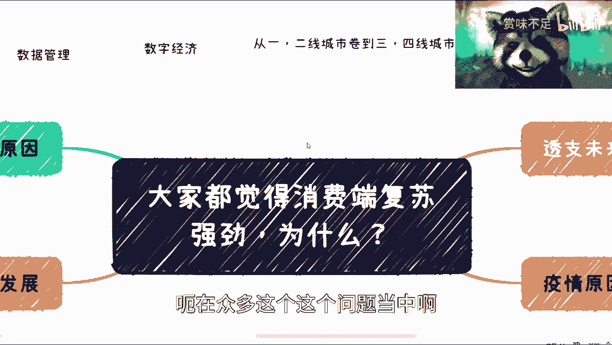
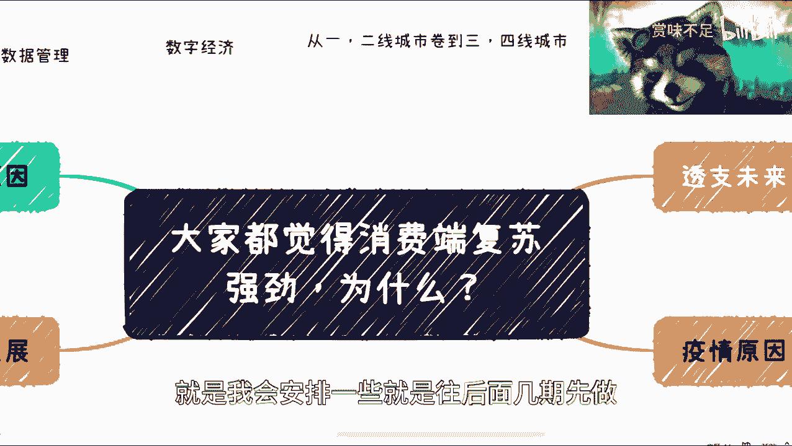
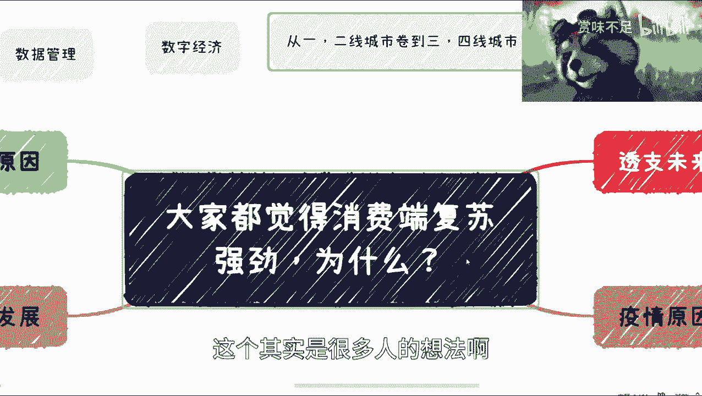
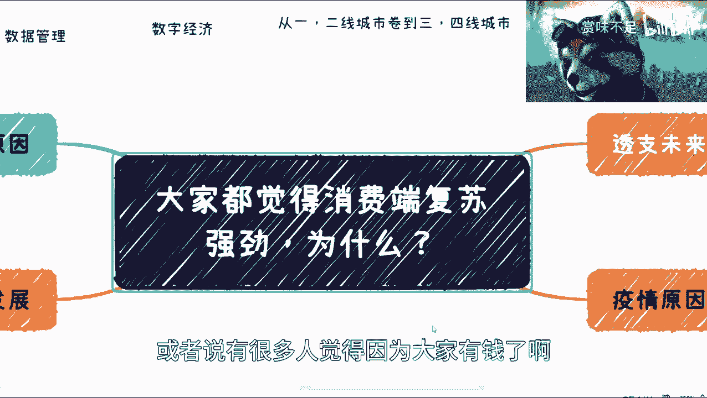
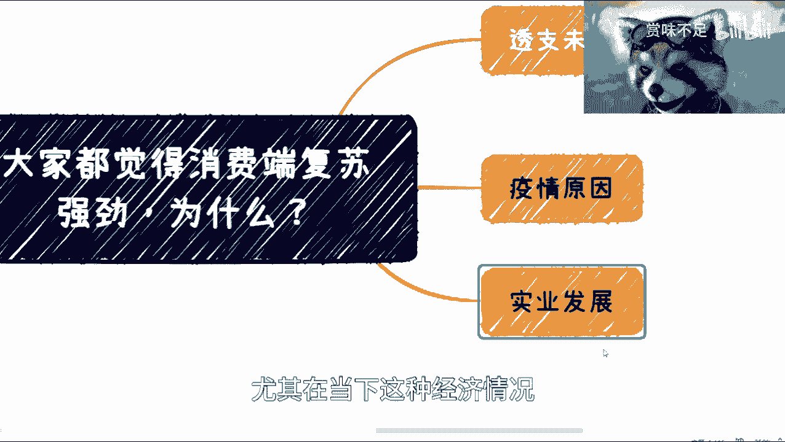
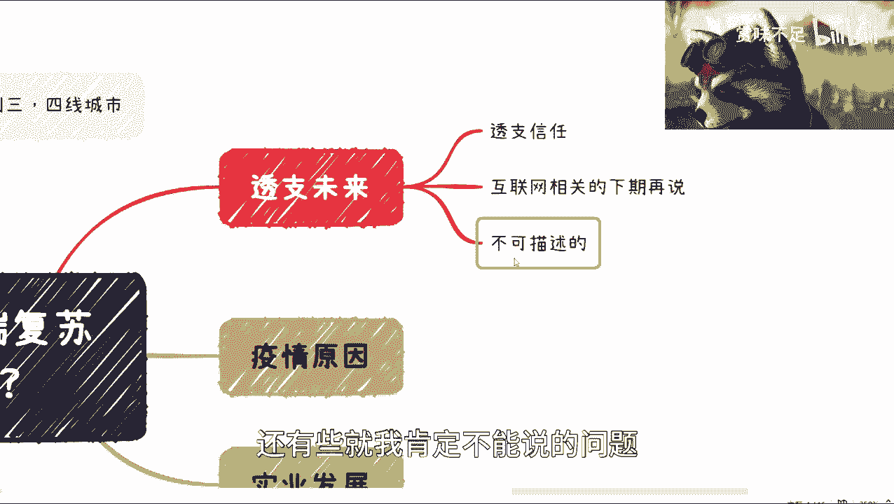
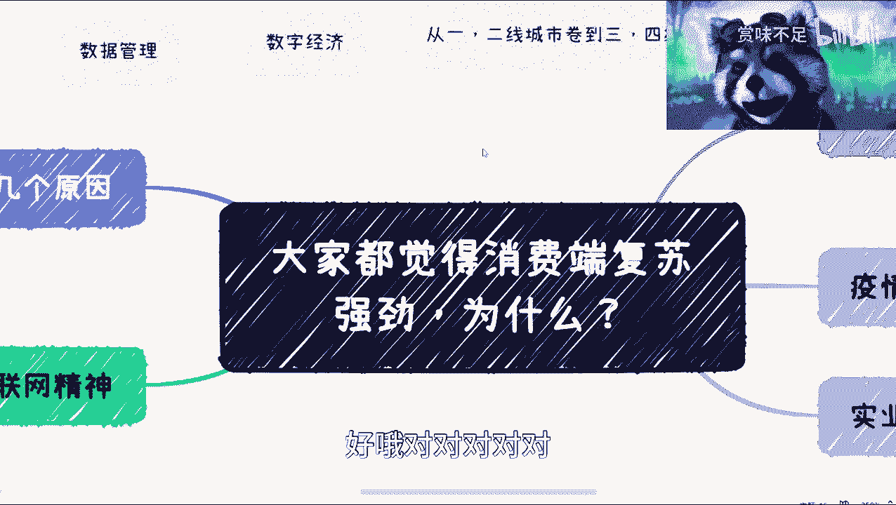
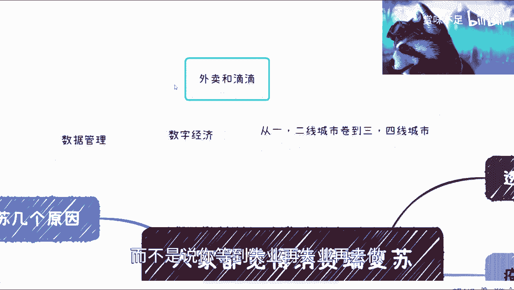

# 课程01：消费端复苏的真相 🧐

在本节课中，我们将探讨一个普遍的观点——“消费端复苏了”，并分析其背后的复杂原因。我们将从多个维度拆解这一现象，帮助你理解表面繁荣之下可能隐藏的经济现实。

---

## 概述

近期，关于消费市场强劲复苏的讨论很多。许多人看到餐厅排长队、旅游景点人满为患，便认为经济已经全面回暖。然而，这种直观感受可能具有误导性。本节课我们将深入分析，消费数据“复苏”背后的真实驱动因素是什么，以及为什么这未必是经济健康的信号。

## 视频观看现状

我注意到，观众对我视频的平均完播率只有三分多钟。对于时长约十分钟的内容，希望大家能尽量看完。这不仅是对创作者劳动的尊重，也能帮助你更完整地理解复杂的议题。

## 后续内容预告

在观众提出的众多问题中，我已筛选出部分，并计划在后续几期节目中详细探讨。例如：
*   **城市迁移话题**：关于从一、二线城市“卷”到三、四线城市的想法，其背后原因复杂，我将在未来专门分析。
*   **数字经济信号**：近期关于数据管理与数字经济的新闻是一个非常重要的信号，我也会单独做一期内容来解读。

## 核心论点：消费复苏的驱动因素

现在，我们进入本期核心内容。我的结论是：消费端数据表现强劲是事实，但其原因并非简单的“疫情结束，大家有钱了，所以去消费”。真实情况要复杂得多。

以下是几个关键驱动因素：

### 1. 疫情的催化作用

疫情确实是一个原因，但它主要扮演了“催化剂”的角色。
*   一方面，它催化了整个消费端发展态势的转变。
*   另一方面，它在短期内**促进**了这种看似强劲的反弹。但这是一种被压抑需求的短期释放，而非可持续的增长动力。

### 2. 实体经济发展的需要

当前经济环境下，**实体经济的发展是刚需**。无论从政策还是现实层面，实体经济都需要被提振。

而互联网行业在过去二十多年的发展中，其最初的“普惠”精神并未完全实现，反而在一定程度上走向了**垄断**和**价值透支**。我们可以用一个简单的公式来理解这种“透支”：

> **初期**：投入 `100` 元 → 产出 `90` 元价值（创造价值）
> **现在**：投入 `100` 元 → 产出 `1` 元价值（价值衰减）

这种模式导致经济“外强中干”。因此，必须弱化虚火，夯实实体基础，否则内部将越来越空虚。

### 3. 民众的心理与行为变化

老百姓的消费行为主要受以下几种心态影响：

*   **对未来无感知**：部分民众心态单纯，认为疫情结束，手有闲钱，消费是理所当然。
*   **放弃未来规划**：这并非悲观，而是一种基于现实的客观判断。当人们深入了解医保、养老等各方面的压力后，许多人选择不再为遥远未来储蓄。
*   **寻求即时发泄**：当前年轻人压力巨大，需要释放渠道。而“衣食住行”中，像餐饮、KTV、酒吧等消费，恰好提供了这样的发泄出口。相比之下，疫情前流行的看展、小众娱乐等消费则大幅萎缩，因为人们觉得“钱要花在刀刃上”，而这些活动带来的乐趣不足以支撑其消费。

## 其他相关现象

此外，还有两点值得关注：
1.  **灵活就业门槛**：很多人提及去做外卖员或网约车司机。这并非人人可做、能坚持的出路，更不是解决失业燃眉之急的普适方案。它应该是一种主动的职业选择，而非被动的应急措施。
2.  **抱团与资源共享**：我制作视频的目的是希望与大家分享信息，对接资源（如投资渠道、产业园信息、政策关系等），实现抱团取暖。这远比向个人收取少量费用更有意义。

## 总结

本节课我们一起学习了如何辩证地看待“消费端复苏”现象。

**核心要点总结**：
*   消费数据回暖是多重因素（疫情催化、实体需求、民众心理）共同作用的结果，**不等于**普遍富裕或经济根本性好转。
*   互联网的部分模式存在价值透支问题，发展实体经济是当前要务。
*   民众消费集中于少数发泄型领域，是压力大、对未来信心不足的体现。
*   我们看到的往往是水面之上 `20%` 的显象，而真正需要探究的是水面之下 `80%` 的本质。

请记住，餐厅排队的人潮，可能并不代表大家更有钱了，反而可能是一个反映深层社会心态的**反向信号**。学会洞察数据背后的逻辑，才能更准确地理解我们所处的时代。