# 大家都说消费端复苏了，我并不那么认为 - P1 - 赏味不足 - BV1xM4y1k7mf

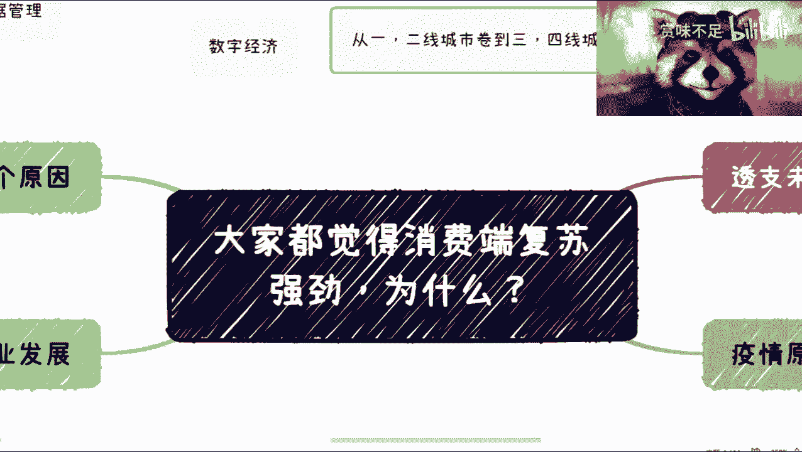

好啊我是赏味不足，那么就很感谢大家，最近对于这期那期失业视频的这个，这个叫什么热衷啊，呃我收到了无数的私信跟回复，然后我也说一嘴啊，就是我看了一下，就是大家虎完播率只有三分多钟。

我觉得这个大家对于我这种只有10分钟的视频，还是这个能看完就看完，好吧啊，这个也是对广大B站up主的一种尊重啊，我这个10分钟视频都看不完，然后让别人做了十几十几分钟，几个小时，这视频咋看呀。

你说是吗啊，呃在众多这个这个问题当中啊。

我现在选了有，就是我会安排一些就是往后面几期先做。

因为我觉得就好多，可能大家对一些东西还不是很了解，就是这个关于一线城市，二线城市转到卷到三四线城市呢，这个其实是很多人的想法啊。

但这个呢我觉得原因很多，这个我后面再来说好吧，然后昨天的话呢就是说也发了一个很震撼的，那个叫什么，就是新闻大家也都知道，就关于数据管理跟数字经济的，这个呢是非常非常重要的一个信号啊。

这个回头我也会单独再讲一期。

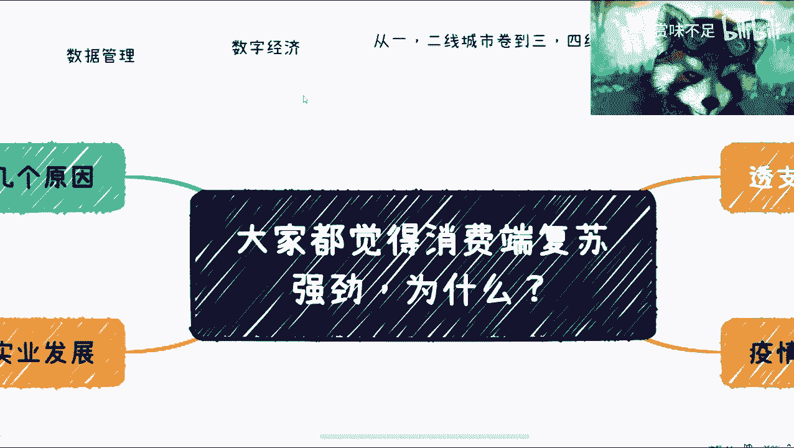

那么这一期的话呢主要是跟呃，这个我看到很多人很多朋友啊，就是说啊他说啊我们都觉得消费端复苏了啊，为什么，然后呢，其实我在疫情结束之后呢，也有身边有很多朋友会这么说啊，呃我先说结论啊，就是说消费端。

因为这个大家看只有3分钟的生命周期是吧哈，我先说结论啊，就是说首先并不是消费端复苏强劲，复苏强劲是事实吗，是事实，但是复苏强劲这件事情的原因，我们是要去了解的，并不是因为简单的疫情结束，大家去消费了。

或者说有很多人觉得因为大家有钱了啊。

并不是啊，并不是绝对不是啊，绝对不是，那么主要有几块啊，我觉得疫情是一个原因，这也没有错，但这个是一个催化剂的一个关系啊，一个催化剂有关系，当然可能也就是呃一方面是催化了。

整个就我们说这个消费端的一个发展情况啊，另外一个就是说呃，就是在短期内促进了这么一个强劲的一个。

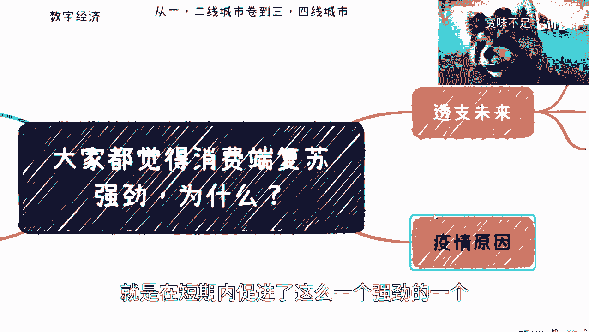

主要原因呃，然后呢这个第二点呢就这个实业发展。

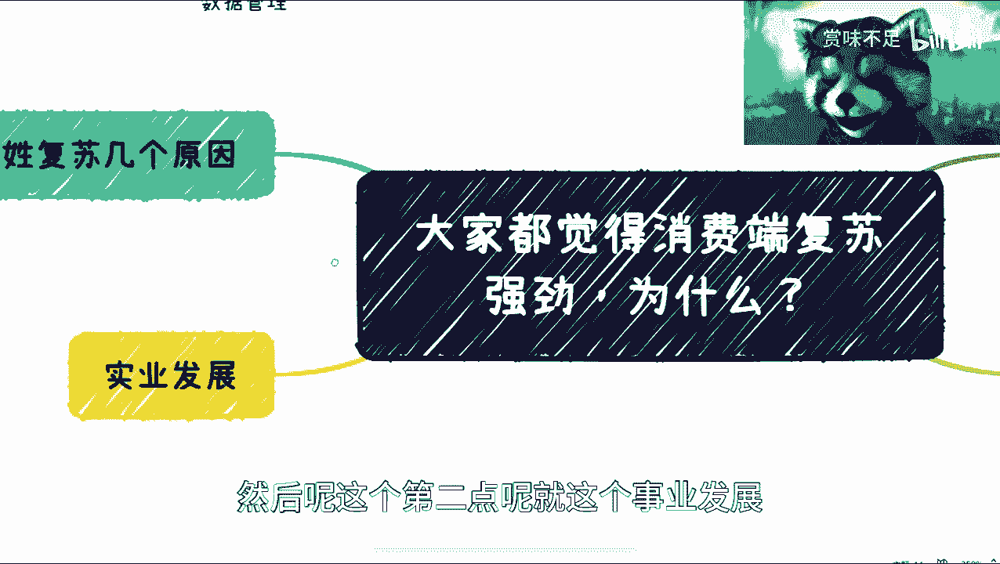

因为其实，后面我还会再出一期，说的是什么呢，互联网，但我不知道那期会不会被和谐掉，因为呃这个内容比较的唉比较比较尖锐啊，就是互联网呢其实应该是一个普惠精神啊，我们在这个地方应该写我我我回头再加啊，好吧。

我回头再给大家单独开一期。

就互联网精神啊，应该是普惠的，呀呀呀呀，完了完了完了完了完了完了，嗯稍等啊，我调出来了一个一个东西啊，普惠对吧，普惠啊，那但问题是什么呢，互联网到目前为止发展了将近20多年对吧，他普惠你说做到了吗。

我我明确跟大家讲，他没有做到啊，就你们不要来跟我说，什么OFOR什么美团饿了吗，这个这个是他背后都有原因的，他没有做到，然后呢，我觉得他不但没有做到，他还做到什么呢，就是寡头和垄断。

就垄断和那个就是透支，你知道吗，有就说直白点是什么呢，就是说我今天投入，比如说我今天投入100块钱，我就该产出100块钱的价值，对不对，那互联网其实是什么，互联网这两年产生价值。

就是我可能一开始投入100块钱，产出90块钱价值，到今天我投了100块钱，就产出了一分钱价值，你知道吗。

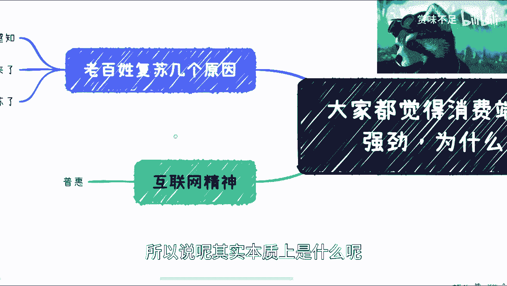

所以说呢其实本质上是什么呢，是失业是需要发展的，尤其在当下这种经济情况。

失业是需要发展的，不管从政策还从各个方面都需要发展的，而他就要被弱化掉，而且被极度弱弱化掉，为什么，因为你不能再虚下去了，再虚下去，整个外强中干，你里面越来越干对吧。

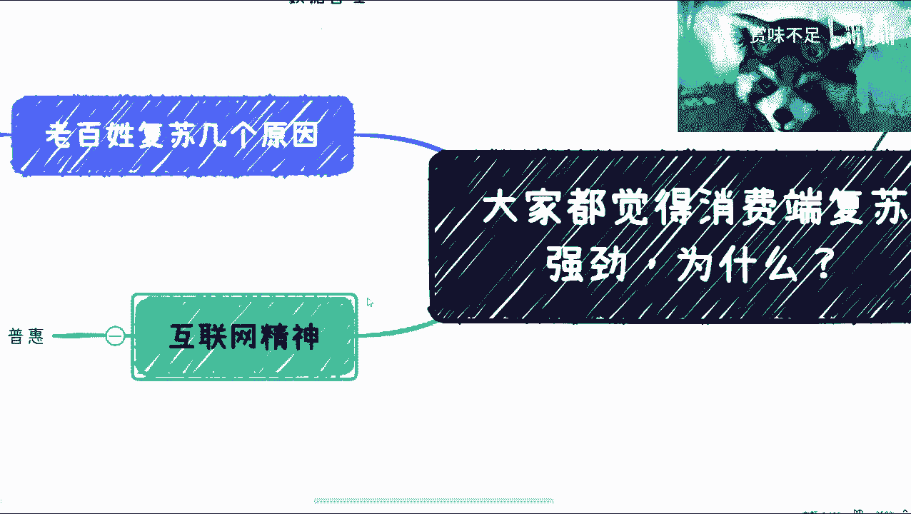

然后老百姓复苏呢，我觉得有几个原因，第一个原因呢是诶，我看大家看得见吗，看得见，几个原因，就是大部分老百姓呢对于未来他没有感知，他就比较单纯对吧，他就说啊我这个疫情结束了对吧，我要出来消费消费对吧。

我手上有几个闲钱，没毛病啊，我觉得没毛病，第二呢有很大一部分年轻人他应该明白了，就是我已经不想去想未来了啊，这个不叫悲观，因为我觉得有很多人会用悲观这个词，我告诉大家，这不叫悲观，这叫客观。

因为你们但凡去了解一下各方面，包括医保啊，包括其他各个方面对吧，就是各个细节方面，他都会让你感知到一点，就叫做大家都不想去想未来了。

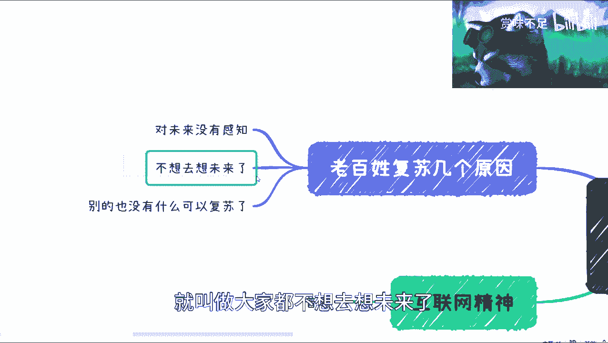

就我这个地方写的就都是在透支未来，透支未来本质是什么，透支信任互联网相关，我以后再说对吧，还有些就我肯定不能说的问题。

他妈说了，我这个对吧，视频肯定就要下架了对吧，然后呢还有一个呢就是说本质上您想啊，衣食住行，老百姓现在压力大对吧，年轻人压力更大，那么你要去就是发现你的压力对吧，那么我们想想看你你去唱K也好。

去去那个喝酒也好，各方面其实他都属于消费类，它都属于消费类，你会发现有有那个别的还有什么吗，现实别的已经没有什么可以复苏了，你你去看那个什么密室逃脱对吧，就是这种娱乐类的，比如说电子竞技对吧。

或者其他的，就是疫情之前有很多东西它是有有市场的，或者有有这种空间的，我们不说有很大空间，他有空间的，比如说什么联名展啊，或者别的东西，你去看看疫情之后还有没有没有了，为什么。

因为吃还有这种叫做啊唱歌对吧，这种方面他是可包括喝酒，他是可以发现，来来来来作为你的发泄的这个渠道的，然后来这个进行这个消费复苏的，但剩下的其实很多人已经已经没有感知了啊，已经没有感知。

就是觉得唉这个东西呃这个我钱也不多对吧，我得花在刀刃上对吧，然后他也不能给我带来太大的这个，这个乐趣对吧。

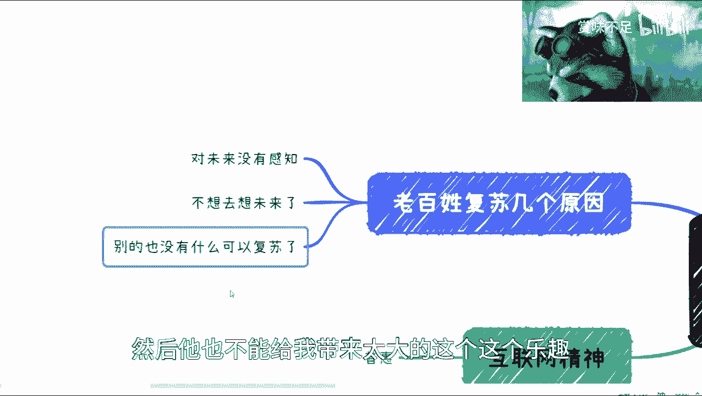

所以说呢其实这个呢我觉得是一个综合原因啊，并不能说现实，比如说啊有很多人就觉得啊，游戏很多小众化了对吧，或者怎么样。

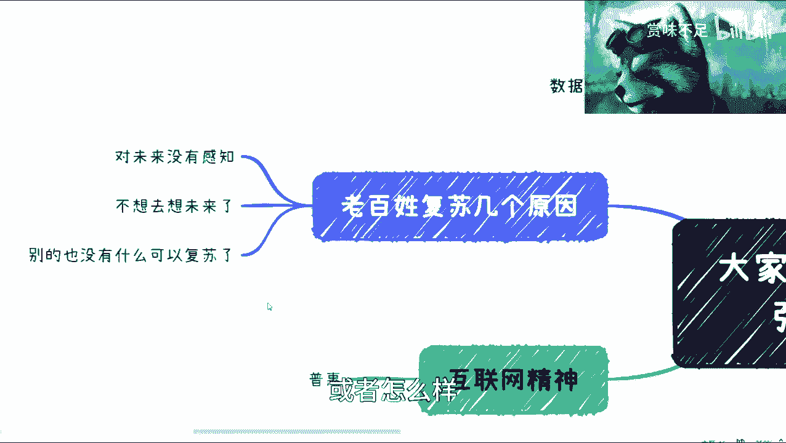

这个其实就是很多综合的因素，包括互联网的因素啊，包括疫情的因素啊。

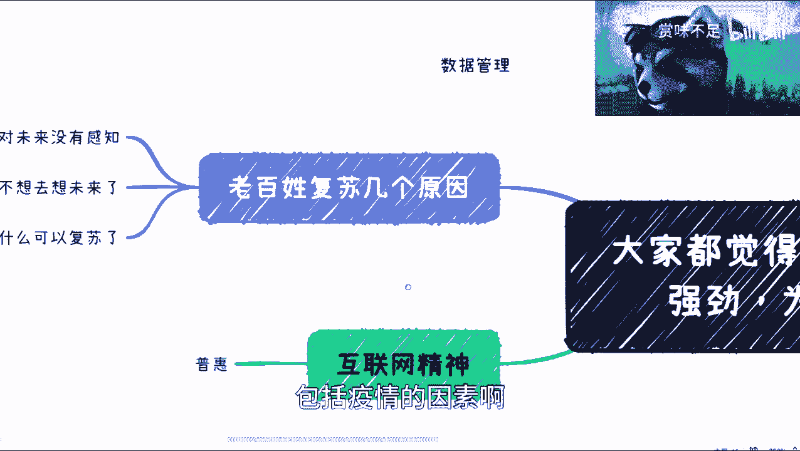

包括大家手上没有钱了对吧，包括大家就是现在可能嗯，卷的越来越厉害了对吧，包括就是大家可能对自己的未来都很担心对吧，好啊对对对对对。

然后昨天还有一个事情，还有一个事情就说什么那个做外卖，我外卖和滴滴的对吧，这个我也是后面会单独开一期，就是说这个东西呃，真的不是你说想去做就去做的，你做是可以做，但是我说实话大部分普通人可能做不来啊。

而且坚持不下来，而且呢，就是说它也不是一个解决燃眉之急的一个，一个事情，就是说你你要做，你现在就可以做，而不是说你等到失业再去失业再去做。

对吧啊啊啊对，回头我再给大家做一期，就是说呃就是关于我这个介绍的好吧，因为我这边的话就告诉大家有哪些资源，包括投资啊，包括不是我要投资啊，我给大家对接一些投资方案对吧，这个包括一些什么产业园啊对吧。

包括政府一些关系啊，这些都有对吧，就我觉得大家现在这情况抱团嘛对吧，否则我做这个视频没有意义啊对吧，然后还有很多人说我要收费，我收我能收几个钱，我凭良心说对吧，我说每个人收你们200块钱啊。

我就我就吃这个饭，哈哈好吧嗯行，那么我反正这一期就讲到这吧好吧，我就希望大家能明白啊，就是说呃你们一定要记住一点，就是所有你们眼睛看到的东西，都是水面上20%的，而我们要探知的是水销量80%的东西啊。

20%的东西说明不了任何本质啊，就是呃回到今天这个来讲，就是消费端的复苏，你看到很多人去吃饭，吃饭排队并不代表大家很有钱，也并不代表整个经济就恢复了啊，这反而是一个非常反向的一个信号。

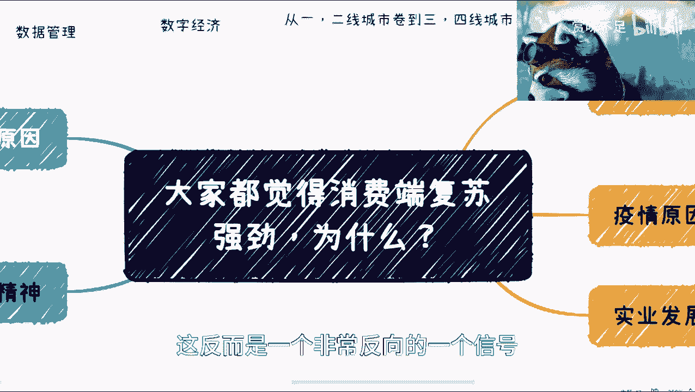