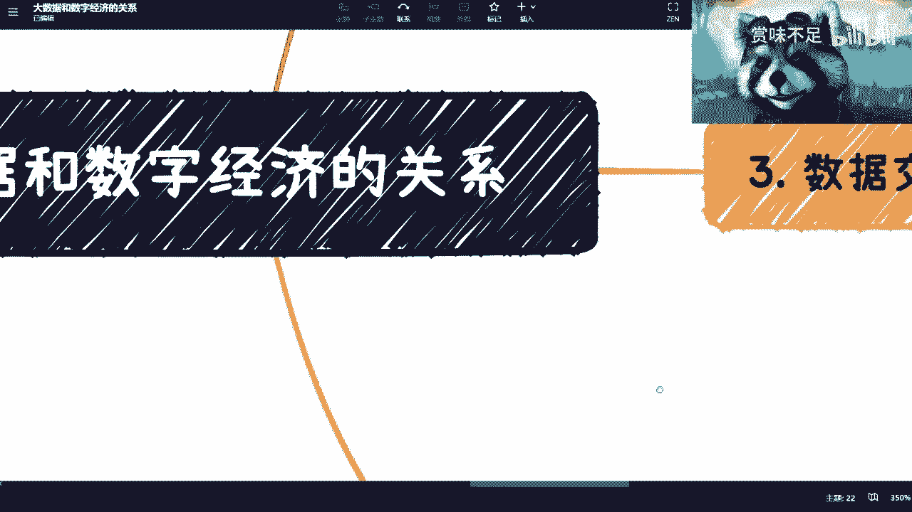

# 大数据在数字经济时代的发展 - P1 - 赏味不足 - BV1Lh411g7js

好啊，大家好啊，这个之前因为有一些小伙伴一直跟我说啊，就说我挖了一个大数据的坑是吧，然后也没填啊。

那我今天来填一下好吧，大数据对吧，跟数字经济的整个关系啊。

呃首先啊你看啊，首先啊是这样子的，这个我来说这件事情啊，并不代表大数据就业就有很好的未来啊，这完全不划等号啊，别到时候就说陈老师说大数据对吧，好牛逼啊。

我们要去就业了，然后一群失业对吧，找不到工作是吧，首先呢这并没有代表他是一个很好的未来。

为什么呢，因为首先我们来看啊，根据之前说的对吧，互联网呢，其实本质上它是一个回归正常的一个状态，就不是再是一个说啊，大家吹的很猛对吧，神坛上的工作对吧，然后薪资虚高是吧，不好意思，现在没这么多钱啊。

这个全球整个经济情况也不允许国，国内这么做啊，那么另外一方面呢，它属于哎哟我去这啥玩意诶对吧，就是另外一方面呢，它其实就我之前也说过了，他其实是属于进入下一个阶段，而不是说没有前途啊。

它只是进入下一个阶段啊，这低一点，那么你们可以理解为它就是个漏斗，什么叫什么叫漏斗呢，就以前鼎盛时期对吧，比如说大数据有啊，很牛逼对吧，然后大家都往里面扩招啊，一大群人巴巴往里面冲对吧。

但是呢你说互联网一方面回归正常之后呢，他那个这个漏斗这个越漏越小了嘛，对不对，那么岗位自然就缩紧了，那么所谓进入下个阶段是什么呢，就是最终你说这个漏洞里面有多少，漏出来了对吧，漏出来之后。

他们只要就就要进入下一个阶段的这个开发了，这个叫什么，就是业务铺业务啊，对吧等等等等等搞，那么这些你们想想看，就是我为什么说他不能代表一个就业，就业方向呢，是因为还是那句话嘛，就是说现在市场上面。

说是说有这么多大数据公司，但是有多少大数据公司，他能明白他他要做什么对吧，有多少大数据公司他是真的知道，就是说下一下一步他要做什么，但还有很多不知道，那不知道哪来的胆子啊，哪来的引力啊，啊对吧啊。

那么这是第一个，第二个呢就是你看啊，这个数字呢是要走治理的对吧，他们但凡呢跟这个大企业或者跟政府有合作呢，他们现在也应该都知道对吧，第一个呢就是你要组治理的对吧，包括数字安全可信，这个肯定要做的。

然后是数据清洗确权使用对吧，因为现在大数据很多做的呢是有就是0~1，它有了，但是你说它有没有用起来还真少啊，还真的少，那么当然也有很多人说啊，那这个监控啊对吧，什么东西啊，那这个是什么。

就你治安也好对吧，这个这个叫什么，就是这个社会稳定性上面，那这个我觉得肯定是优先级最高的，但是你大数据本身你不可能只用在这个上面的，你有用的地方多呢，对不对，那版权啊对吧，民生啊，就业啊。

什么地方不用大数据啊对吧，但是你要用起来了吗，还没有吧对吧，那从目前看呢，就是从目前情况来看啊，数据呢是可以交易的啊，数字应该是可以资产化的，只不过呢就说对应的这个条条框框呢，还没有出来对吧。

或者都在尝试啊，就是都是啊都是这个萌芽阶段啊，萌芽阶段这个我也不能说我我知道未来怎么样，我也不知道是这个走一步看一步是吧，然后呢打我觉得呢你们就这么想，如果是打工的话呢，其实去哪都一样。

就比如说今天有一家公司是做这个互联网，大数据的，有家公司呢是做以后数字经济大数据的，对你们来讲，但凡你们去打工不都哪都一样吗，对吧，就是你们，我不管你们现在本科还是硕士还是海归对吧，不重要。

反正等到了一定年纪了，总归有年轻人会把你们卷死的，一样的，没区别的，你想就是我觉得你们想透彻一点，是不是，所以说呢就是我觉得更多的点，你们别去关心大数据有没有未来啊。

你们要关心的是有未来跟你们有什么关系，对不对，就真的要赚钱，你们要去现在去寻找真正切入大数据，就我说的这些方向的这个合作对吧，或者说呃你找一些合作伙伴对吧，就他们未来是拿到这种单子的。

那我觉得你能赚钱啊，否则你你谈什么东西啊，我今天给你讲这么多废话。

你知道吗啊，就你理解不理解没有用啊，你赚不到钱呢，对不对，那第二点呢就是数据清洗可信，就现在呢就像我说的，就是说0~1对吧，但是一之后呢其实没有被真正用起来，接下来呢就是1~100，那么1~100呢。

其实你看哦可信对吧，信任他肯定是第一步，那么你比如说我举个例子，比如说你看呃，全国现在很多地方都在做一个东西，叫叫做大数据目录上链，对吧啊，那么就是这就是一个尝试啊，那我觉得这些很简单。

就是你先去明白他为什么要去做目录上脸，对不对，它上链的意义在什么地方，第二就是说，你先你就算不明白他意义在什么地方，但凡你能拿到单子，我就问你是不是能赚钱，对不对，就这么简单嘛对吧，当然了。

你要是不能明白他为什么要去做这件事情，那么我就觉得你可能就很难去理解，往后就就很难去预测往后的发展，对不对，这是第一点，第二点是清洗这件事情呢，其实是本质上我是觉得跟训练GPT是有点像。

哎我这个字写的输入法太垃圾对吧，就有点像，就是说你会根据比如说细分行业啊，领域啊，或者不同企业啊，做不同维度，然后是整理和使用对吧，脏数据过滤等等，就是这个事情都是一样的。

就是GPD是一个大而全的一个数据集对吧，来做的，他相对来讲没有一个，就是那种就是细分领域的这么一个训练，那么其实现在很多企业都在做这个事，那大数据也是一样的啊，大数据现在就是说你要用，你要用的话。

一定是会切到不同的那个细分点，否则你怎么用啊，啊对吧，那这个是二三呢，就数据交易交易这边呢是这样子的，首先啊你看啊数据交易本身涉及到了很多方面，最重要的是定义确权对吧，就是说你总不能什么数据交易吧。

或者来说什么数字都叫数字吧对吧，你既你既然比如说做大数据做清洗，做这个数据的一种整理，那么你想啊整个这个逻辑是什么，就是全网对吧，每天这么大数据量，是不是所有东西都能叫数据，肯定不是啊对吧。

有多少是垃圾数据啊，是不是呃出动吗，对啊对吧，就是有多少数字是算数据对吧，那么这是第一个，第二个，就是说你确定了那些算数据的东西以后呢，你要去看怎么样的数据是可以交易的，因为你相当于两层漏斗嘛对吧。

你两层漏斗漏下来之后，你总不能说哦，比如说我100个G录下来有大概20个G，那你总不能说20个G都能交易吧对吧，那么你还得去定义，那么这个事情呢其实就是在呃未来的怎么说呢，可预见的范围内吧。

就他肯定会肯定会做这件事情对吧，而且呢你你会发现这个所谓的数据交易呢，他一开始肯定是转账，就它不会涉及到金钱交易，但是它会涉及到整个数字的转移对吧，因为毕竟啊就是整个数据交易当中。

一定会涉及到一个很神奇的，就是来说一个非常宏观的非常重要的东西，就是定价权对吧，就是谁来定价，怎么定价，如何服众对吧，这都是个问题，但是不管怎么样，这是个大的趋势啊，毫无疑问啊，这个事情从前年开始吧。

应该就就已经是这么个定定性了啊，这第一点第二点呢，数据交易本身也不可能是个开放平台对吧，就是说你说阿猫阿狗都来做，那不现实是吧，他一定会需要有资质的这个交易中心来做的啊，这毫无疑问，那当然了。

这里面可能也会涉及到什么交易牌照啊，什么交易资质啊，啊各种各样的东西啊，那个每个地区可能做法不一样啊，这个大家可以自己去了解啊，然后另外一方面呢，就当下你说能不能做好呢，我觉得先不去说它对吧。

有很多人就是上来就喷是吧，哎呀这个东西做不好的对吧，就跟职业教育一样的，哎呀你我跟你们讲，还是那句话，你们要么就滚啊，你要但凡不管在这个土地上面就别喷，对不对，有什么好处呢是吧，没有意义的嘛，对不对啊。

那这个呢，那数据交易本身你会发现可能有b two b对吧，b to c1c to c对吧，当然了，这里面我估计c to c是比较难的啊，啊b two t也比较难啊，当然我不能说完全打死啊。

但是b two b肯定是呃百分之百要做的，你说后面两个吧，我去吃不准啊，从目前看我也没看到，也没看到太多的可能性啊，那当然模式很不同啊，未来是不是都开放我也不清楚，但这个是一个方向，大家可以考虑考虑。

另外一方面呢就是说交易这件事情是必然的啊，你们不用去这个这个质疑这件事情，因为什么呢，因为你要这么想，所有的技术不是为了技术，包括AI也不也一样的，所有的技术并不是为了技术。

所谓的技术最终的点还是要从金融角度出发，那是服务于人类，服务于金融的对吧，因为你从金融角度来讲，你只有流通了，你才是有价值的，你所有东西价值价格再高，如果没有流通，然并卵对吧。

所以说呢你数字作为数字资产的一种，自然是肯定是要被交易的，这也是一个就是大势所趋对吧，毫无疑问。

那么你看啊这个数字我们讲完了对吧，是一方面。

那数字还能变成资产，就在这个地方呢，我们要去区分就是数据是数据，资产是资产，这个就要看官方怎么去定义了对吧，资产在金融层面或者生产层面，肯定是会更丰富的，什么意思呢，我举个例子对吧。

比如说今天两家企业是相互有一个数据交易，那么这个是属于企业的资产，从这个属性上面，但是它的交易上面，你们会发现他纯粹的就是个数据交易对吧，就比如说一个数据集的交易，它本身就是个数据。

他已经除了交易完了之后啊，它不会再存在更多的属性在这个数据里面了，就是说这个数据本身它就是一个数字，他不会再有任何这种这种这种附加的这种呃，价值啊，或者别的东西在里面，它是一个很纯粹的一个买卖。

你知道吧，这个叫做数据交易，但是资产交易是什么意思呢，就是比如说今天有一个数字资产对吧，你要这么想，所有的数字资产在互联网上面，它其实都是个数字，就这个毫无疑问啊，它都是由数字演变过来的啊。

你不能说它不是个数字对吧，但是它的属性上面又是超越了数据，什么意思呢，你比如说这个资产它可能除了OTC，也就是场外交易，比如说点对点交易对吧，就除了点对点交易，还能够二级交易，因为你想啊。

你一个企业的企业数据放在二级市场的交易，是不合适吧对吧，这大概率就是违法的是吧啊，然后另外一方面，你比如说还可能能进行资产的抵押，因为它是资产嘛对吧，那这呃既然是资产，那它就可以抵押吗，对就可以贷款吗。

或者说它的整个资产的产权啊，股权啊是可以拆分的对吧，这就是有可能的，但是这件事情在数字上面是不可能的对吧啊，你跟我说今天有一个企业的数据，把这个数据啊进行抵押来贷款，把这个数据的产权或股权进行拆分。

你觉得合适吗，根本不数字没这个属性了，你明白吧，所以说呢就是说这是两件事情啊，这两件事情，那么从目前来看呢，就是说呃这两件事情呢，跟呃联盟链应该都脱不了关系，但是呢就是呃看怎么个做法。

就是嗯大概率吧这一层只跟链有关。

这一层必须要跟智能合约有关啊，就就这么个大方向来讲，就这么个情况啊。

然后是总结啊，总结总结是什么呢，就是说首先呢总体来讲你说大数据重要吧，重要的那你说重要的是大数据本身吗，其实也不是，就我刚刚也说了嘛对吧，你会发现重要的是大数据，接下来怎么去做好它的应用。

怎么去做好它的数字化，怎么去做好它的数据交易，怎么去做好它的数字资产化对吧，包括数据的确权，这个是重要的，你说大数据本身重要吗，嗯嗯重不重要也不重要，因为什么呢。

因为反正互联网第一阶段都已经做的差不多了，你重不重要，反正我觉得现在大数据在各地，应该已经属于一个很成熟的一个产业，对啊，这是第一点，第二点是这个当中呢，也不是说所有企业都有机会去做的。

或者知道怎么做的，就我刚刚说的，就是说你们如果说有觉得要有没有前景，那你们就得去判断你们去的这家企业，在这个上面能不能做出点有贡献的东西，但是在我的角度来讲呢，你们但凡只要去打工的，其实没什么太大区别。

不要纠结这件事情，就我跟你们说，你们去打工又不是搞的搞的，又不是你们去做CPU对吧，又不是做COCOFER对吧，又不是什么重要的位置，你要说重要位置吗，你们不会被替代，那大部分打工都会被替代一点。

你问我有没有前景，我怎么回答呢，你说是不是啊，那么重要的呢，是抓住这个这个叫什么大数据的下一代运作，啊那么在这里面你看嗯to c to b to g都是的，就是求个人对吧，去企业求政府其实都一样。

哎呀我跟你讲这个事呢，这个事儿呢就跟那个职业教育是一样的，你知道吗，就是我跟你们讲了，未来10年职业教育是个很大的方向，职业教育很多钱，但是问题是你们赚得到吗，对不对，就有多少人能赚的到，这是关键。

你不要老问我有没有未来啊，我觉得都有未来的对吧啊，这个你们得要自己去想啊，你们得得为什么一直跟你们说要积累关系，积累资源，这两年开始积累对吧，去探索东这些关系积累不是一蹴而就的，你不可少则35年。

多则78年，你要去积累的对吧，你这天上掉一个苹果，为什么掉牛顿头上。

不是不掉你头上了，对不对，一样的道理嘛啊对吧。

所以说这个事啊，一直我觉得呢，就是很多人那个道理大家都懂对吧，什么什么机会是给有准备的人对吧，怎么样子啊，这说的不太溜啊，你知道吧，但是问题是我就让你们去准备了，我就让你们当下就去准备了。

你们作为大三大四研一研二，我的这么多时间去准备了，谁听我的，没几个人听我的，对不对。

唉就就就就这么着是吧，OK那反正这一节呢我觉得就这么个情况好吧。

我觉得但凡能听懂的呢，你们不管是就业还是创业。

还是说做一些呃皮条对吧。

我觉得都是可以的，这就是个大事啊，你说这个大事嗯，到底能这个叫什么。

多久能做完，我觉得从从我刚刚讲的整个方向来看啊。

就是他时间肯定不会短，因为短期内没这么快啊。

因为这当中又涉及到了这个数据的清洗，又涉及到了这个金融化的一些东西，但是呢我觉得这个我们不能拿现在的呃，就不能拿以前互联网的那20年的时间来评估，现在嘛，因为毕竟以前没有互联网对吧。

大家都很多人没有了解，那现在有互联网的加持，二十二十多年，将近30年的积累对吧，又有AI，我觉得很多东西可能想的呃，呃发展的可能会比我们想的快啊，就是这么个情况，唉呀就这么着吧好吧。

然后如果大家对于那个数字，那个那个资产，或者来说数字经济有更多的这个想咨询的，你们也可以私下咨询我好吧。

