# 大数据与数字经济的关系解析 📊 - 课程 P1

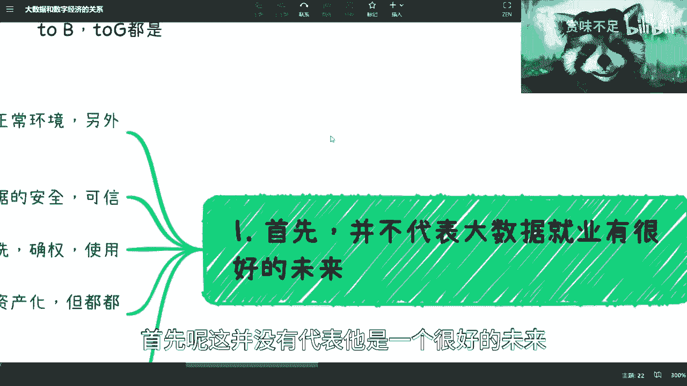

在本节课中，我们将探讨大数据在数字经济时代的发展现状与未来趋势，分析其核心价值、面临的挑战以及潜在的机遇。课程将帮助初学者理解大数据如何从技术概念走向实际应用和资产化。

## 概述：大数据与就业前景的澄清

首先需要明确，讨论大数据的发展并不等同于其就业前景一片光明。这两者不能直接划等号。

互联网行业目前正回归正常状态，不再是薪资虚高、被过度吹捧的神坛工作。全球及国内的经济形势也不支持过去的模式持续。

大数据领域本身并未失去前途，而是进入了发展的新阶段。可以将其理解为一个“漏斗”：在鼎盛时期，行业大量扩招，许多人涌入；当行业回归理性后，岗位需求自然收紧，漏斗变窄。

所谓进入下一阶段，是指最终留存下来的从业者将专注于更深层次的业务开发与拓展，例如业务落地和数据应用。

## 大数据发展的核心挑战与方向

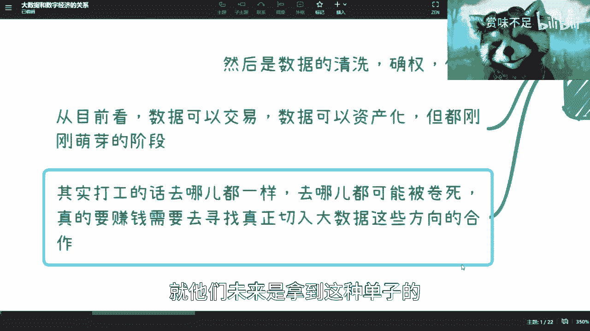

上一节我们澄清了大数据领域的整体态势，本节中我们来看看其发展面临的具体挑战和几个关键方向。

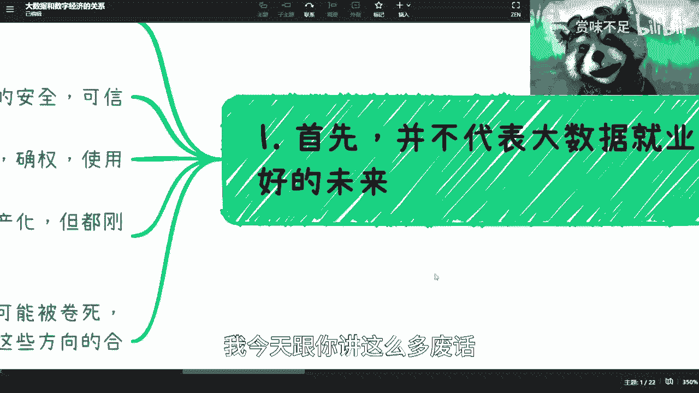

当前市场上有许多所谓的大数据公司，但其中真正明确自身目标、知道下一步该如何发展的公司并不多。缺乏明确方向和盈利模式，是制约其发展的首要问题。

以下是未来大数据发展的几个核心方向：

*   **数据治理与安全**：这是与大型企业或政府合作的基础。首要任务是确保数据安全、可信，并进行数据清洗、确权，规范数据使用流程。目前许多大数据应用完成了从0到1的搭建，但真正有效用起来的案例还很少。
*   **数据清洗与价值挖掘**：这与训练大语言模型（如GPT）有相似之处。核心在于针对不同细分行业、领域或企业，进行多维度的数据整理、脏数据过滤和专项应用开发。通用的大数据集（如GPT的训练集）缺乏细分领域的深度，而企业大数据应用必须切入具体场景才能产生价值。
*   **数据交易与资产化**：这是将数据价值金融化、促进流通的关键环节。数据可以交易，数字可以资产化，但目前相关的法规和框架仍在探索和萌芽阶段。

## 深入解析：数据交易

上一节我们列出了大数据发展的几个方向，本节我们重点深入探讨“数据交易”这一复杂但至关重要的环节。

数据交易本身涉及多个层面，最重要的是对交易标的进行**定义**和**确权**。并非所有数字信息都能称为可交易的数据，需要经过筛选和界定。

整个过程可以看作一个双层漏斗：
1.  第一层：从海量信息中筛选出有价值的“数据”。
2.  第二层：从有价值的数据中，进一步界定哪些“数据”可以进行交易。

在可预见的未来，建立数据交易规则是必然趋势。数据交易初期可能更侧重于“数据流转”而非直接的金钱交易，因为其中涉及一个宏观且重要的问题：**定价权**。即由谁来定价、如何定价才能服众。

此外，数据交易不可能是一个完全开放的平台，必然会由具备资质的交易中心来主导，并可能涉及交易牌照等资质审核。

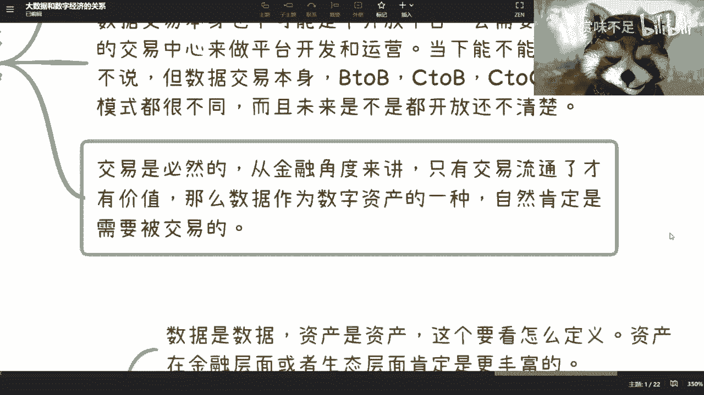

从交易模式看，**B2B（企业对企业）** 模式是确定且会优先发展的。**B2C（企业对个人）** 和 **C2C（个人对个人）** 模式目前看来难度较大，未来是否开放尚不明确。

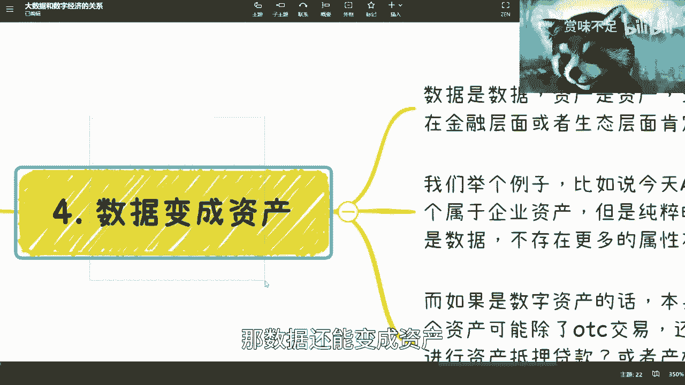

必须认识到，交易是必然趋势。任何技术的终极价值都要服务于人类和金融活动。从金融角度看，只有能够流通的事物才具有市场价值。数据作为一种数字资产，其交易流通是大势所趋。

## 区分：数据交易 vs. 数字资产交易

在理解了数据交易的基础上，我们需要进一步区分“数据交易”和“数字资产交易”。这是两个相关但属性不同的概念。

*   **数据交易**：交易标的是“数据”本身。例如，两家企业之间进行一个数据集的买卖。交易完成后，该数据集除了作为被交易的商品外，不附带其他金融属性或价值。它是一个纯粹的买卖行为。
    *   **公式/核心描述**：`数据交易 = 数据集本身的转移`

*   **数字资产交易**：交易标的是“数字资产”。所有数字资产本质上也是数字，但其属性超越了普通数据。它可能具备以下特征：
    *   可进行场外点对点（OTC）交易。
    *   可能进入二级市场流通（企业数据直接进入二级市场通常不合法）。
    *   可以作为资产进行抵押贷款。
    *   其产权或权益可以被拆分（如股权化）。
    *   **公式/核心描述**：`数字资产 = 数据 + 资产属性（可抵押、可拆分、可二级流通等）`

目前来看，数据层的确权、登记可能与联盟链技术相关；而数字资产层复杂的权属和交易逻辑，则必然需要**智能合约**来实现自动化、可信的执行。

## 总结与行动建议 🎯

本节课中，我们一起学习了大数据在数字经济背景下的定位、挑战与发展方向。

总体而言，大数据本身的技术基建阶段已相对成熟。更重要的是其后续的**应用、治理、交易和资产化**过程。对于从业者而言，关键不在于大数据技术本身是否重要，而在于如何参与到这些价值实现环节中。

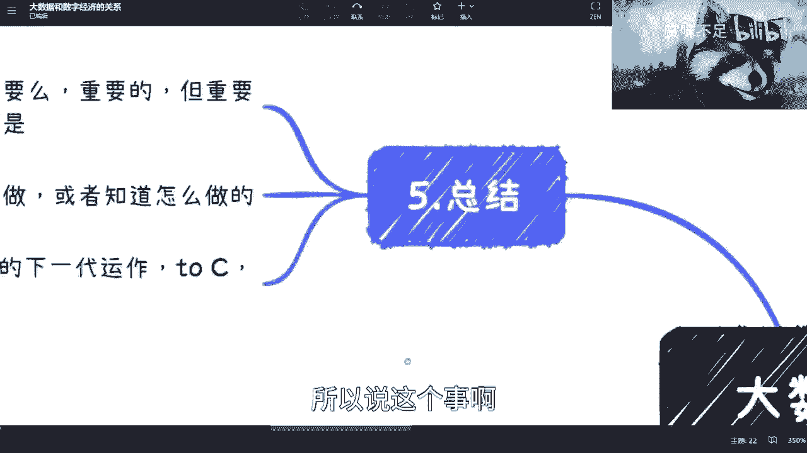

对于以打工为目的的求职者，进入大数据行业与其他技术行业差异不大，都需要面对市场竞争和更新换代。纠结于行业是否有“前景”意义有限，因为大部分执行岗位都存在可替代性。

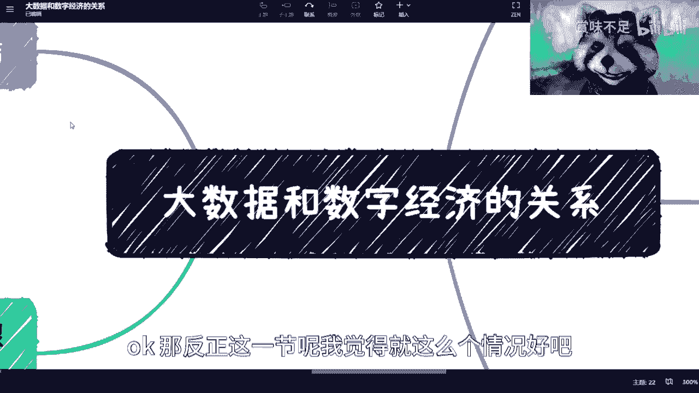

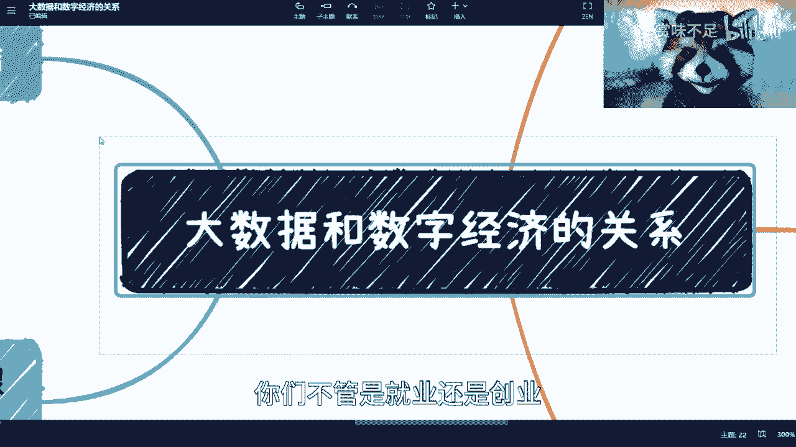

真正的机会在于抓住大数据价值化的下一代运作。无论是面向个人（To C）、企业（To B）还是政府（To G）的服务，都存在可能性。这就像职业教育领域，大家都知道是方向，但关键在于能否赚到钱。

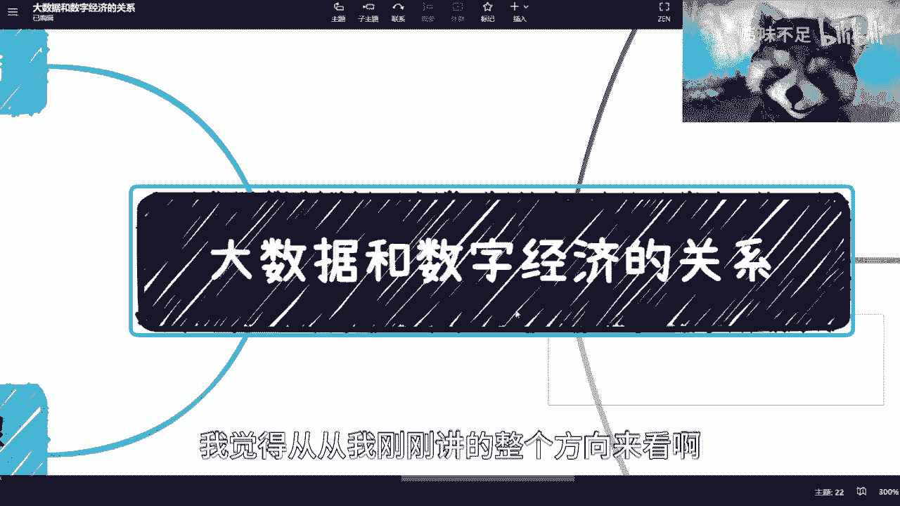

**核心建议是积累关系和资源**。从现在开始，用3-5年甚至更长时间去探索和积累相关领域的人脉与认知。机会留给有准备的人，而准备需要时间。对于在校生（大三大四、研一研二），更应充分利用时间进行前瞻性布局。

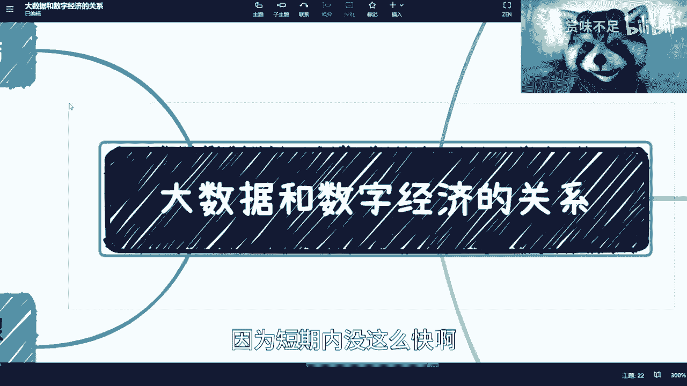

大数据与数字经济的结合是一项长期工程，涉及数据清洗、金融化设计等多个复杂环节。虽然不会一蹴而就，但在互联网多年积累和AI技术加速发展的背景下，其演进速度可能会比想象中更快。

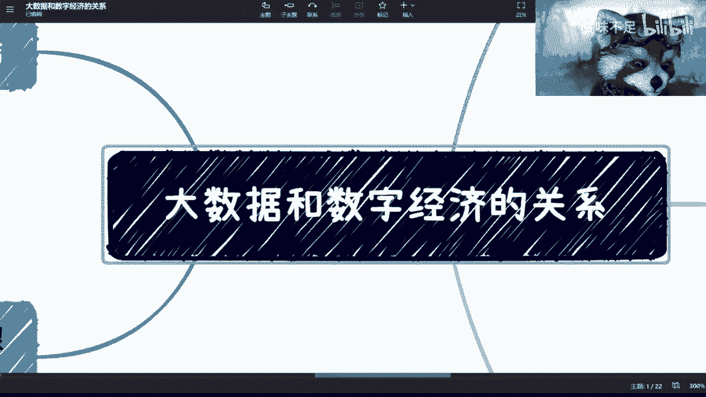

无论选择就业、创业还是作为中间人寻找机会，理解这一趋势都至关重要。