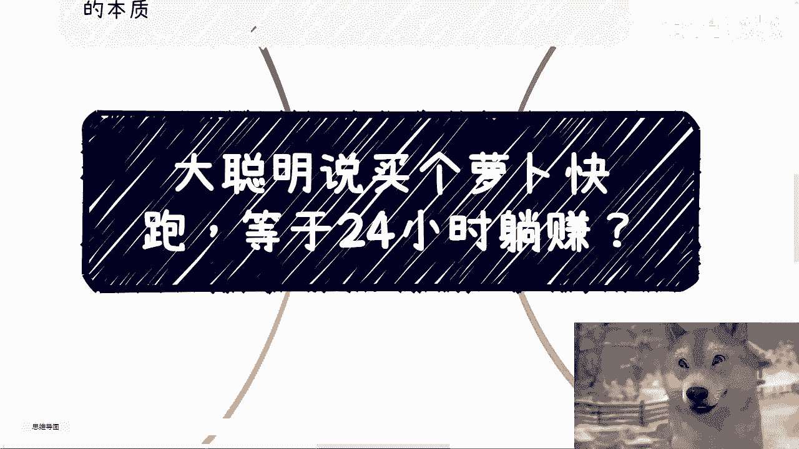
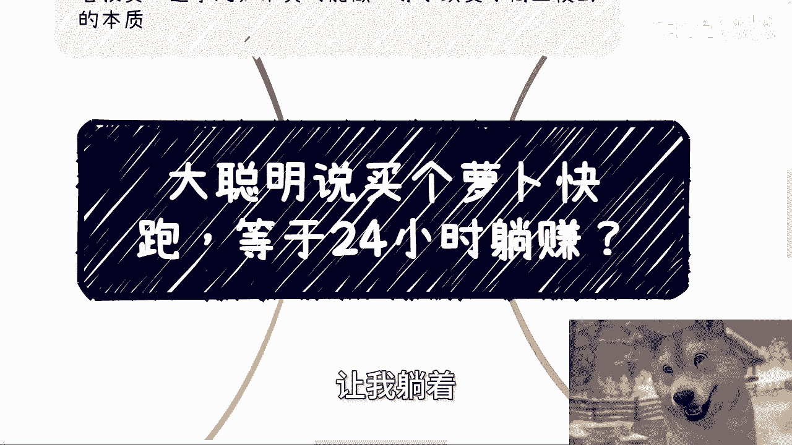
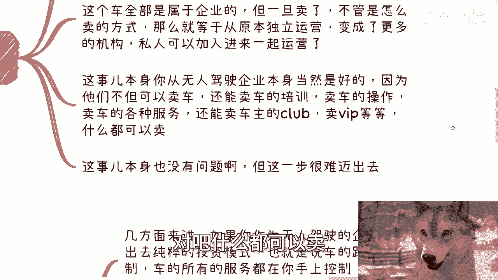
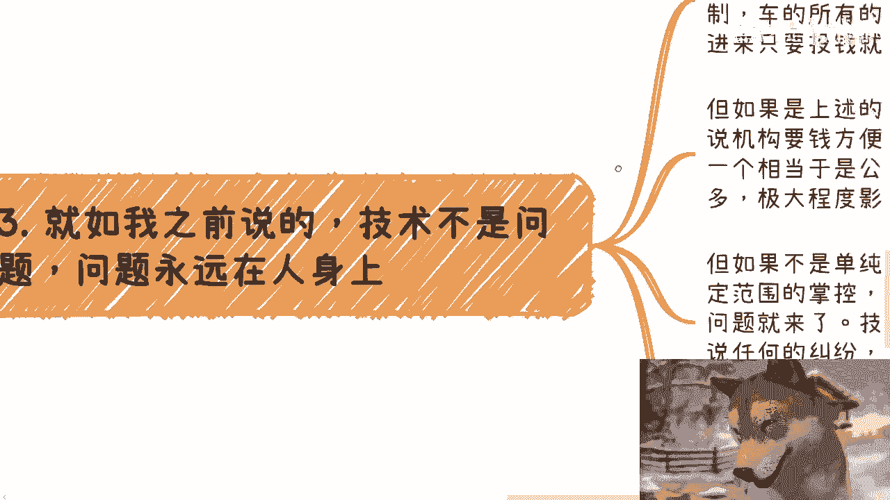
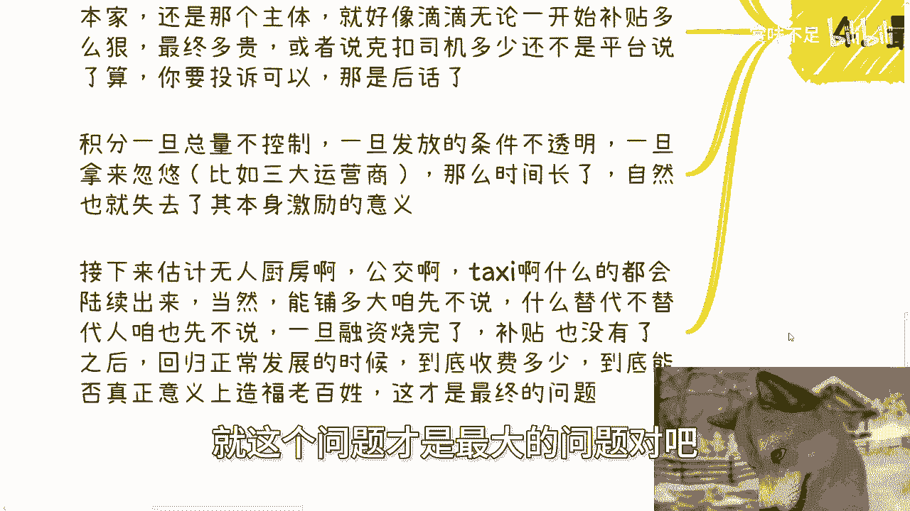
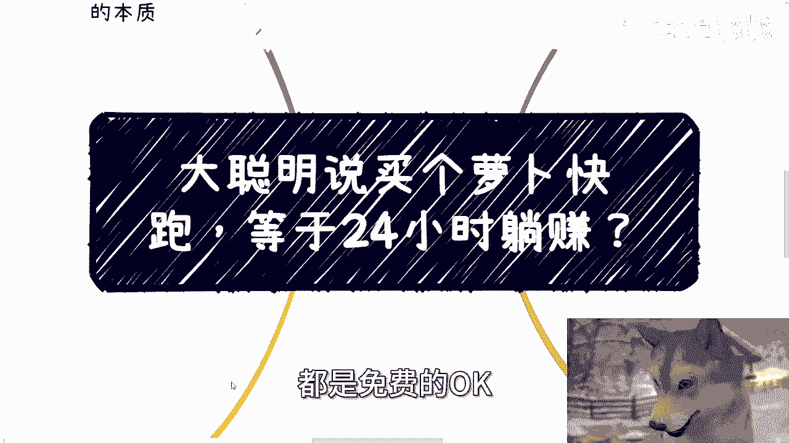

# 大聪明说买个无人驾驶的车，可以24小时躺赚？ - P1 - 赏味不足 - BV19E421A7Kh

好大家好啊，这个前两天萝卜快跑叫什么无人驾驶，出来之后也不是出了嘛，就是就是那个新闻又又火了一次之后啊，就我微信上就会看到有人说这个买一个啊，然后呢让他24小时给我打工啊，让我躺赚。

卧槽，我不由得感叹啊，他妈的比资本家都要资本家，他妈的资本家都没都没这么犀利啊，呃首先我先这么说，我今天打开B站，卧槽满屏萝卜快快跑，搞得我他妈的都有呃，保卫萝卜PTSD啊。

我想想保卫萝卜好像最后我只玩了三三个吧。

也没玩完啊，嗯然后呢，就是说关于这个24小时躺赚的这个事情啊，我觉得是一个呃商业模式的一个改变啊。

我们主要来讲一下这么一个东西，首先呢我先跟你们讲个故事啊，就早在2017年18年的时候呢，其实很多团队就会做做过很多项目啊，叫做出租车挖矿啊，汽车挖矿或者是滴滴挖矿啊，这种项目很多，这事的逻辑很简单啊。

就是首先啊咱先不要去管他什么web2，web3的事情，我们不说具体的，我们先说商业逻辑啊，就这个逻辑很简单，就是说司机接单，乘客打车都可以获得对应的数字资产啊，那当然你可以理解为是积分嘛，无所谓啊。

而这个资产呢本身跟其司机是否健康驾驶，乘客打车的频率啊，包括乘客的一些就是评价啊，包括就是乘客的一些行为都挂钩，那你说司机是否健康驾驶，这东西简单啊，你通过传感器，通过别的方式其实都可以来获得嘛。

对吧好，那么这些资产呢可以在积分商城兑换物品，那当然啊，我们说的兑换物品，应该是那个积分直接兑换的啊，不像说现在他妈的三大运营商那种什么积分，卧槽什么给什么几万个积分，然后其实积分都是假的对吧。

然后几万个积分加什么人民币让你去买，那他妈你还不如让我直接用人民币买呢对吧，还他妈的假假装好像让我很便宜对吧，哦那么这种积分呢，另外一方面呢还可以存着，那么根据一定的经济模型。

可以按照比例来兑换运营公司的股票，比如说啊，比如说你们购买了萝卜，快快跑的这么一个车对吧，那么你们呃就是满足了一定条件之后，你们相当于是额持有百分，我举个例子啊，比如说持有0。0001%的这个萝卜。

快跑的这个股票，然后你们可能拿着这个钱可以啊，拿着这个资产可以分红对吧，或者说进行二级市场的这个交易啊，那么这个事呢听上去啊逻辑很不错啊，但是我非常遗憾的跟你们讲啊，这概念到今天说说难听点。

讲了10年也有了啊，嗯嗯这么说啊，技术上其实没有什么难点，激励机制本身做也可以做的很好，但是你会发现此种经济模式到今天为止，没有一家公司做做得很好，没有任何一家公司做的很好，为什么我们最后再来讲。

首先我们先来说说购买车这个事啊，当然啊我们不是仅限在萝卜快跑这一个公司，未来任何一家无人驾驶或者无人叉叉的，这么公司是否会卖他的服务或者产品，我们都说不准，但如果一旦卖了。

这个就属于商业模式的本质上的变化，为什么，因为如果你卖了，那么相当于你卖的这个产品或者来说服务，他就有归属了，那么本来这个车属于那个无人驾驶器，企业本身的，但如果一旦卖了，不管怎么卖的方式，比如呃。

那么就等于从原本的独立运营变成了更多机构，更多私人可以加进加入进进来的一起运营对吧，你你我们先不说他是不是加盟啊，无所谓啊，那么这是本身你从无人驾驶企业那个来讲，那当然是最好的，为什么。

因为他们不但可以卖车呃，他们不但现在可以卖服务，还能卖车，还能卖车的培训，卖车的操作，卖车的各种各样的服务对吧，卖呃，卖什么什么什么什么，这种有无人车的车主的这种俱乐部对吧。

卖VIP可以衍生出来卖各种各样的东西，甚至他们可以有呃，一级代代理分销分销商，二级代理分销商对吧，什么都可以卖。

我跟你讲这事，本身没有问题，但是这一步很难迈出去，为什么呢。

因为就如我们之前说的，技术永远不是问题，问题永远出在人的身上，你几方面来讲，第一如果你作为无人驾驶的企业，你要拓展出去，如果是纯粹的投资模式啊，也就是说车的路线，车的控制，车的所有的服务都在你手上把控。

别人参与进来，仅仅是投钱，那么这种叫做纯纯粹的投资模式，那如果仅仅是纯粹的投资模式的话，企业肯定是愿意找土老板，或者说机构或者基金要钱更方便，为什么，因为你一个像你，你你问机构要钱，相当于是私募对吧。

或者说就纯粹的走投资，你如果来说是出去卖对吧，卖车卖服务，卖什么东西，你就相当于是个变相的公募对吧，但问题是你一旦公布了，你会发现你的面向对象有可能是个人，有可能是企业，有可能是一些。

就别着各各种各样的阿猫阿狗，那你烦的事会一大堆，极大程度的会影响你企业的运营，那么这个时候如果他真的这么做啊，那么我们可以这么讲，他已经不是一个无人叉叉的企业了，他完全从一个无人叉叉的企业。

变成了一个纯粹的一个一个一个变相公募的，一个一个怎么说呢，金融企业啊，但如果不是单纯的投资啊，那么我们就会发现有另外一个问题，就是购买车的人，他需要自己能有一定的范围的控制对吧，比如说车子的路线啊。

或者说车子的服务啊，或者别的东西啊对吧，那么问题就来了，技术上都能实现，但一旦出了问题，或者来说任何的纠纷，就如我们说呃，有人说东西掉在车上没有啦，有人呕吐在车上了，要清洗啦，车上的设施损坏了。

要维修啦等等等啊，你想想看啊，原本这些问题都是无人驾驶的企业主，就是这家企业主体来负责的，那么我们退1万步来讲，就算最终你告到法院对吧，你说得不到解决，那么至少冤有头债有主，你知道找谁对吧。

但如果一旦开放购买或者投资，那么你就会发现OK除了你以外，除了受害者以外，剩下的人就会进入一个踢皮球的么，那个那个阶段，因为你到时候这个责任明确不了了，你怎么明确呢对吧。

你比如说我今天花70%的钱投资了，投资一辆车，或者我是全贷款对吧，去买了一辆车，或者我是我是全资购买一辆车对吧好，那么我就说啊，今天这辆车撞人了，我说是公司的问题，我说是萝卜快跑跑快跑的问题。

萝卜快跑说是我的问题，是你呃路线设计有问题，是你的这个操作有问题，你到时候怎么弄呢，怎么滴哦，我受害者躺在医院里面，然后你们俩先去打一架，你们俩要么先到先到那个民事诉讼，刑事诉讼先先先去打个官司。

这怎么怎么搞啊，对不对啊，那么第四最后再来说这个激励模式啊，当然有人就要说了，他说二级交易本身他就需要资质，我跟你讲，所有需要资质的东西本身都不是问题，你没有，你可以找人借，你可以找人合作。

这些在法律层面，只要规范出来的东西都不是问题，问题是法律里面没有规范出来的东西，你明白吗，好那么我们就说啊，这种项目很多，最终为什么一个都没有走出来，因为技术永远不是问题，在于企业，在于个人。

咱就拿积分来讲，积分其实是一个非常好的模式，但为什么到今天积分没有人性，甚至很多人积分过期都不要对吧，你比如说昨天联通给我发了个短信说啊，我们这两天要到期了对吧，我一看我的7万多个积分对吧。

噢然后我就点进去了，什么鸟毛玩意啊，哦积分其实都是假的，然后没有哪个东西是我用积分能换的，一定是积分加钱才能换对吧，因为你会发现啊，所有的东西无论怎么样的模式，最终说了算的是企业是资本家以及那个主体。

那就好像滴滴一开始无论如何补贴多狠哦，无论多狠，那么最终这个价格多贵，或者说克扣司机，克扣乘客，给乘客的，这个这个这个这个这个这个成本上加了多少，这不还是平台说了算的吗，你要投诉。

你说我打12345投诉可以吗，可以那是后话对吧，你投诉什么时候反映给你，你投诉什么时候解决，你投诉最终怎么样解决，谁知道啊，啊那么你就像积分一样，积分一旦总量不控制，一旦发放的条件不透明。

一旦拿出来忽悠，比如说三大运营商啊，那么时间长了，自然就失去了本身激励的意义，那现在我觉得大部分老百姓看看你，我不管是不是三大运营商吧，看你这个弄出来的积分，这他妈跟骗子有没什么区别，对不对。

那么接下来估计啊，比如说无人厨房啊，公交啊，taxi啊，都会陆续出来，为什么，因为这些东西对资本家，对企业本身是完全有利的，大利好，你明白吗，那当然老百姓在说啊，当然能铺多大，咱全不去说什么。

你说替代人不替代人，咱也先不淡说，但是最终的我们所有人要关心的问题是什么，就是一旦融资烧完了，一旦补贴没有了，一旦这个业务回归正常发展的时候，他到底收费多少钱对吧，到底真正意义上能否造福百姓。

到底就是说从整个的未来的长远的这个滚呃，业务的滚下来，是不是真的能够就是说我们达到叫做降本增效，或者说能达到真正的什么效率高啊，又能够什么降低老百姓成本啊，这样子就这个问题才是最大的问题对吧。

所以说就是我们就说啊，你会发现所有的东西很多业务逻辑，从逻从理论上来讲走都走得通，但是我一开始就我们叫做什么，叫做放长线钓大鱼，就是我们一开始去补贴，我们一开始哪怕给老百姓的服务都是免费的哦。

OK很多人涌了进来。

那么问题来了，最终如果我想盈利对吧，那么我一定要提高单价，我不提高单价，我怎么盈利呢，对不对，所以说你就会发现这里面的悖论就在这个地方，就是一开始为了铺市场，他就要烧钱，就要拿补贴对吧，政府也要业绩。

这个是一个必然的一个一个一个社会规律，但是所有的人除了前期能够通过资本，通过就是股票啊，通过投资来赚钱的这些人以外，剩下的还有很多人想赚钱，那他怎么赚呢，他想通过真正的业务落地的时候来再赚钱。

那业务落地之后怎么赚钱呢，我们就说啊，你要么就是薄利多销，你要么就是提高客单价对吧，那你要么就是既薄利多销，而既多销又提高客单价，对不对，那你想想看，如果你是主营业务的这个人。

或者你是一个这个这个这个这个企业的这个，这个创始人的话，如果啊我就说你今天量已经铺的足够大了，你现在会怎么办，你其实只有一条路是什么，那就是我除我要么就是很好的做一个激励模型。

能够让他有那个自己造血的能力，对不对，如果你没有激励模型，没有一个很好的造血能力，那么你只能无限的去压榨在整个产业链里面的，不管是我们就拿滴滴来讲，就不管是司机也好，乘客也好，对不对。

那否则你怎么盈利呢，对吧，但是这个问题比如说企业的调价对吧，企业服务的调价这些，尤其是很多新兴的行业，你说法律上规定了没有，没法没法规定他怎么规定的，对吧啊，那么有的有有有的大聪明啊，又要说了。

他说他说那那没关系啊，你你涨价到时候总归还会有，又不是你一家独大，总会有别的竞争对手，以更低的价格把你取而代之，是没有错，但你有没有想过取而代之的过程，烧的是谁的钱，烧的不是纳税人的钱吗。

啊取而代之的过程，万一不能取而代之呢对吧，我们比如说100个人，100家企业里面有有99家企业倒闭了，一家企业把它取而代之了，这付出得多大的成本啊，我说的不好听点，你得剥削多久老百姓啊。

你得剥削多大程度的老百，多大比例的老百姓啊，啊你有没有想过这些问题啊，啊行啊，我们就先说这么多啊，好吧，OK那剩下的话就是职业规划啊，呃职业规划，商业规划嗯，包括你们比如说做一些什么事情当中。

涉及到的股权，股份分红分润啊，合同啊，包括商业计划书白皮书啊，包括就是你们现在未来有哪些，比如说职业上的规划啊，或者商业上的规划，或者有些offer啊，或者怎么样，你们希望通过我的一些视野。

或者通过我的一些认知，能给你们一些更接地气的呃建议或者规划的话，那么你们整理好对应的问题啊，我们再来走咨询好吧。

哎呀我也蹭个热点啊。