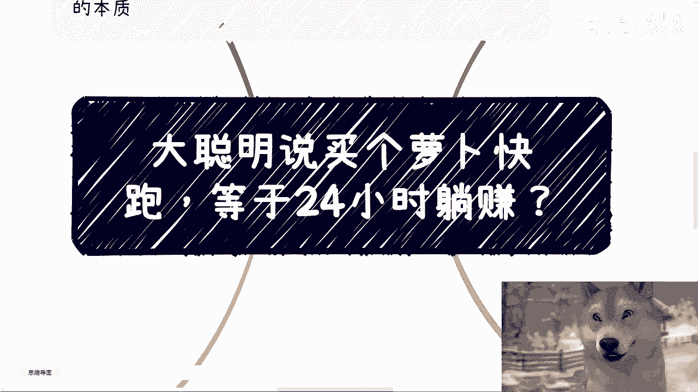
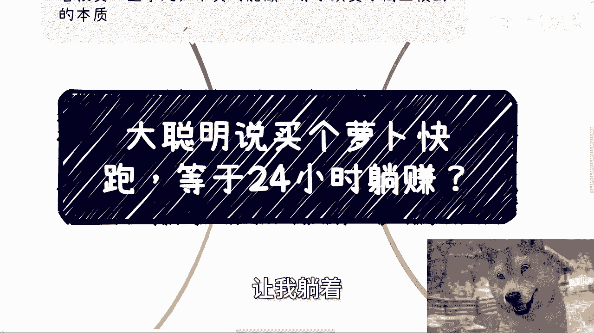
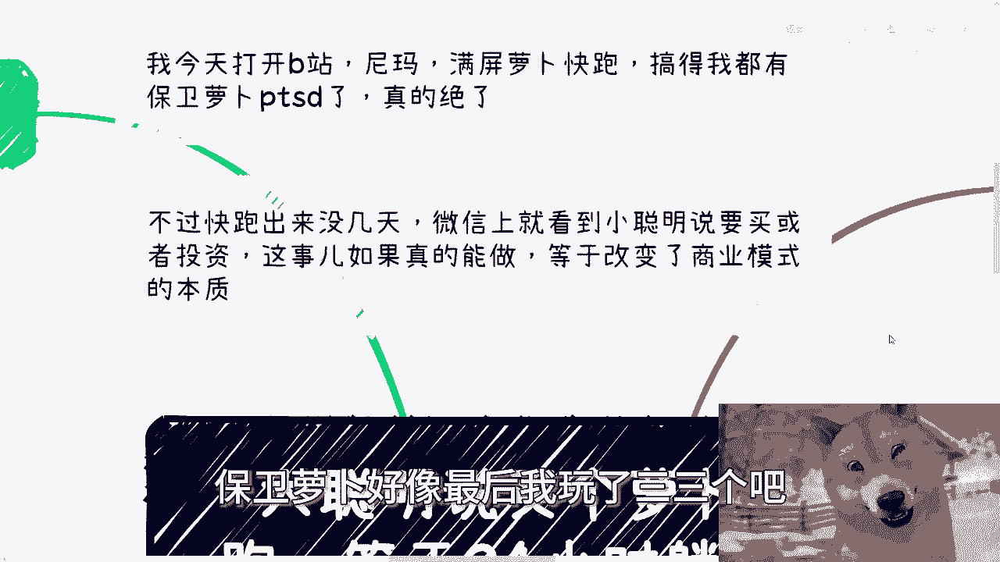
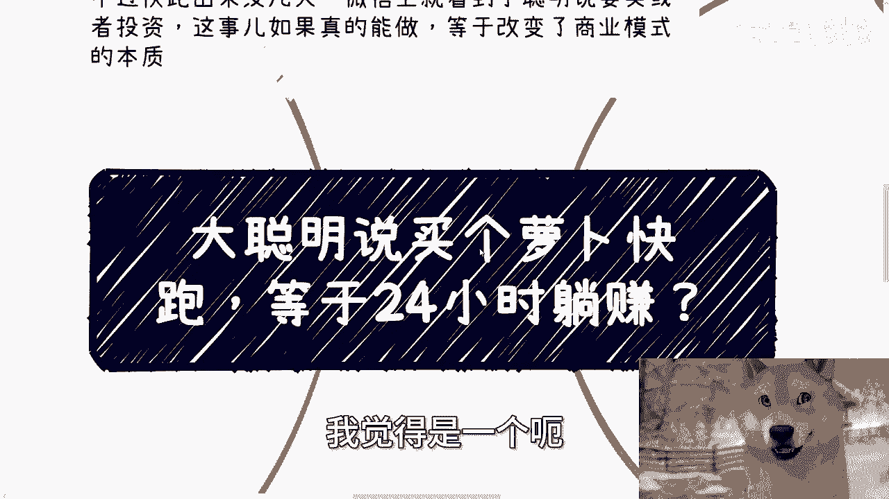
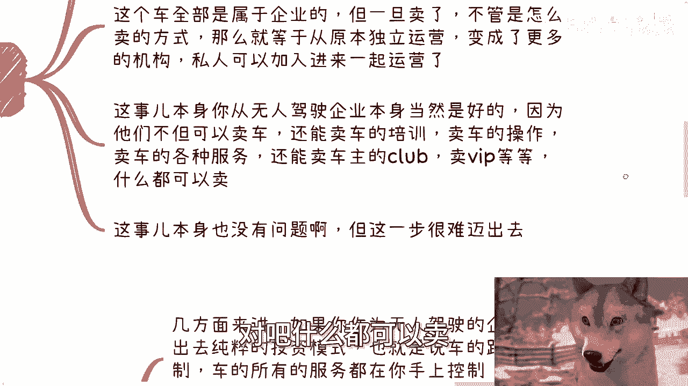
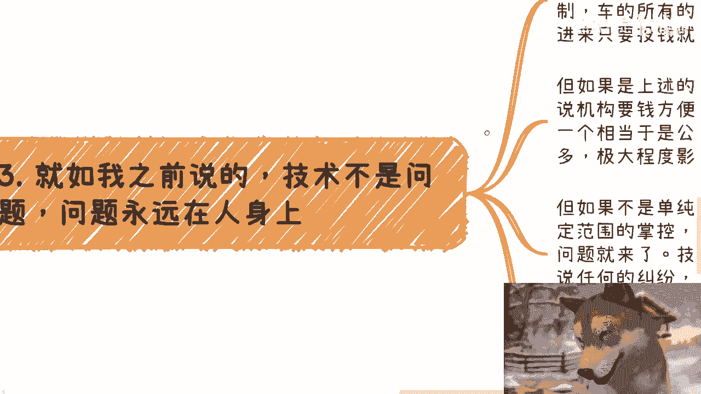
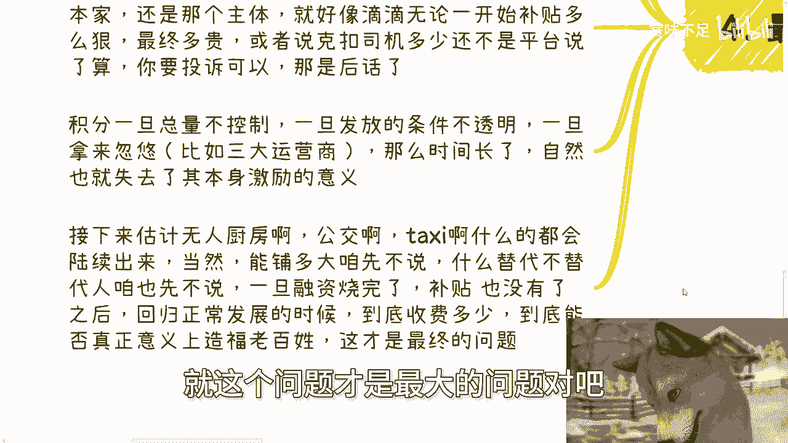
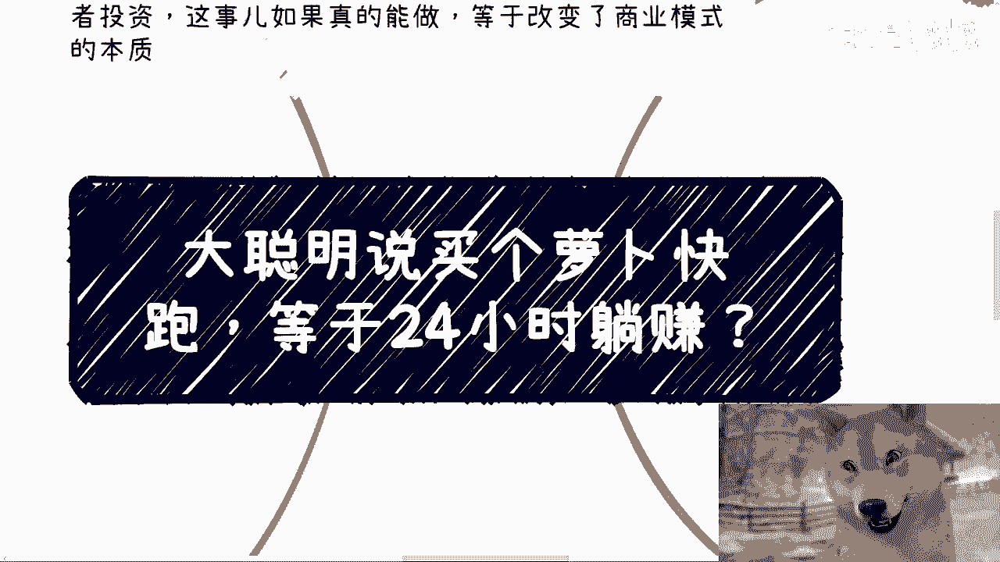

# 商业分析课 01：无人驾驶“躺赚”模式真的可行吗？🚗💰





在本节课中，我们将深入探讨一个近期热门话题：购买无人驾驶汽车并让其“24小时打工”以实现“躺赚”的商业模式是否可行。我们将从商业逻辑、技术实现、激励机制和潜在风险等多个维度进行分析，帮助你理解其背后的本质。



---



## 商业模式演变：从“出租车挖矿”说起

上一节我们提到了“躺赚”的概念，本节中我们来看看其背后的商业逻辑演变。早在2017至2018年，市场上就出现过类似“出租车挖矿”、“汽车挖矿”或“滴滴挖矿”的项目。

其核心逻辑并不复杂，我们可以暂时抛开Web2、Web3等技术术语，专注于商业模型本身。

以下是该模式的基本运作方式：

1.  **司机接单**和**乘客打车**的行为都可以获得对应的数字资产（可简单理解为积分）。
2.  这些资产的获取与**司机是否健康驾驶**、乘客的打车频率、评价及行为等数据挂钩。司机健康驾驶数据可通过车载传感器等方式获取。
3.  这些资产可以在积分商城兑换实物商品。这里指的是**纯积分兑换**，而非当前某些运营商“积分+现金”的混合模式。
4.  另一方面，资产可以储存起来，并依据特定的经济模型，按比例兑换运营公司的股票。例如，购买“萝卜快跑”的车辆并满足条件后，可能持有该公司`0.0001%`的股份，从而获得分红或进行二级市场交易。

这个模式听起来逻辑自洽，但一个残酷的事实是：此类经济模式提出近十年，至今没有一家公司能成功运营。技术并非瓶颈，激励机制也可以设计得很完善，其根本原因我们将在最后探讨。

---

## 车辆所有权转移：商业模式的本质变化

如果无人驾驶公司开始向个人或机构出售车辆或服务，这将意味着商业模式的根本性转变。

原本车辆完全归属于无人驾驶企业，进行独立运营。一旦开放销售（无论何种形式），就意味着运营主体从单一企业转变为多元化的机构或私人参与者。



对于无人驾驶企业而言，这看似是绝佳的商业拓展机会。他们不仅可以卖车、卖服务，还能衍生出售卖培训、操作指导、车主俱乐部、VIP特权，甚至发展多级代理分销体系。



然而，这一步跨越非常困难。技术永远不是核心问题，问题永远出在“人”和“规则”上。

---

## 核心矛盾与潜在风险

那么，这种“躺赚”模式面临哪些具体挑战呢？主要矛盾集中在责任归属与激励机制两方面。

### 责任归属难题

如果采用纯投资模式，即投资者只出钱，路线、控制、服务全由公司把控，企业更倾向于向机构或基金募资。因为向公众销售相当于变相公募，将引入大量不可控的个体投资者，极大增加运营复杂度。

如果购买者能对车辆路线、服务有一定控制权，问题则更加复杂。一旦发生纠纷（如物品遗失、车内污损、设施损坏甚至交通事故），责任将难以界定。

**公式：`责任模糊 = 企业责任 + 车主责任`**

原本责任主体明确（无人驾驶公司），开放购买后，公司、车主、受害者之间极易陷入“踢皮球”的困境，导致问题解决效率低下，法律诉讼成本高昂。

### 激励机制的失效

有人会说，二级交易资质可以合作解决。但真正的难题在于法律尚未规范的灰色地带。

积分激励本是一个好模式，但为何如今大多形同虚设？因为积分发放的总量、条件、兑换规则最终解释权都掌握在企业手中。

**代码示例：一个失效的积分系统**
```pseudocode
if (用户获得积分):
    积分数量 = 随机生成或设置极高门槛 // 条件不透明
if (用户兑换商品):
    实际支付 = 积分 + 大量现金 // 价值感丧失
```

就像早期网约车平台，无论初期补贴多丰厚，最终定价权和抽成比例仍由平台决定。如果激励机制不透明、总量失控、兑换价值感低（如某些运营商的积分体系），长期来看就会失去激励作用，被用户视为“骗局”。

---



## 行业展望与根本悖论

接下来，无人厨房、公交、出租车等领域可能陆续出现类似模式。这对企业是大利好，但我们需要关心的是：当融资烧完、补贴停止、业务回归常态后，真正的收费会是多少？能否真正造福百姓？能否实现长远的降本增效？


这里存在一个根本的商业悖论：

1.  为了抢占市场，初期必须烧钱补贴。
2.  市场做大后，企业需要盈利。
3.  盈利路径无非是：**提高客单价** 或 **薄利多销**（同时压缩产业链各环节成本）。

**公式：`盈利 = (客单价 × 销量) - 成本`**

如果企业无法设计出能自我造血的良性激励模型，就很可能走向无限压榨司机（或对应服务提供者）和乘客的道路。而新兴行业的服务定价，法律往往难以即时、细致地规范。

有观点认为，涨价后会有竞争对手以更低价格取而代之。但这取代过程本身消耗的是社会资源（包括投资人的钱和用户被剥削的价值），且无法保证成功。可能100家企业中倒闭了99家，才成就了1家，这其中的社会成本是巨大的。

---

## 总结

本节课我们一起学习了所谓无人驾驶“躺赚”模式的商业逻辑、历史演变及其面临的本质挑战。我们分析了从“出租车挖矿”到车辆所有权转移的商业模式变化，并重点剖析了其核心矛盾：**责任归属的模糊性** 与 **激励机制的可信度**。



关键在于，许多业务逻辑在理论上都走得通，但最终决定其成败和社会价值的，是运营主体的长期意图、规则的透明度以及对各参与方（投资者、使用者、公众）利益的真实考量。技术推动变革，但商业模式的可持续性和公平性，仍需经历市场和时间的严峻考验。