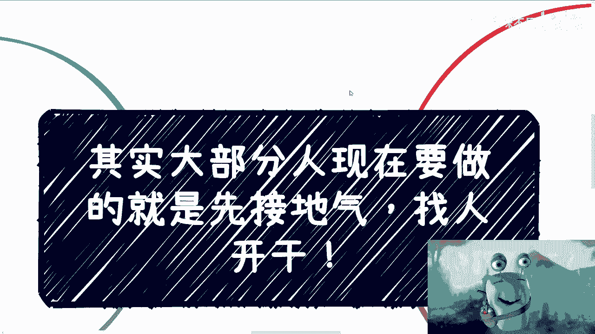
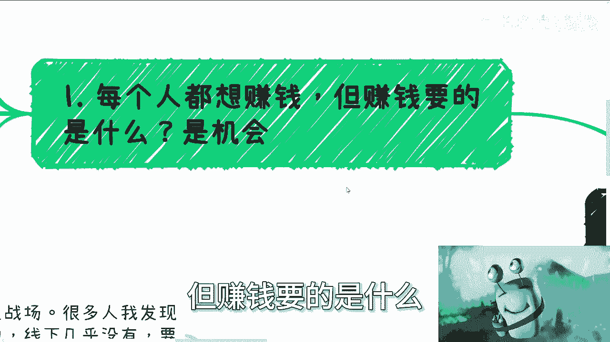
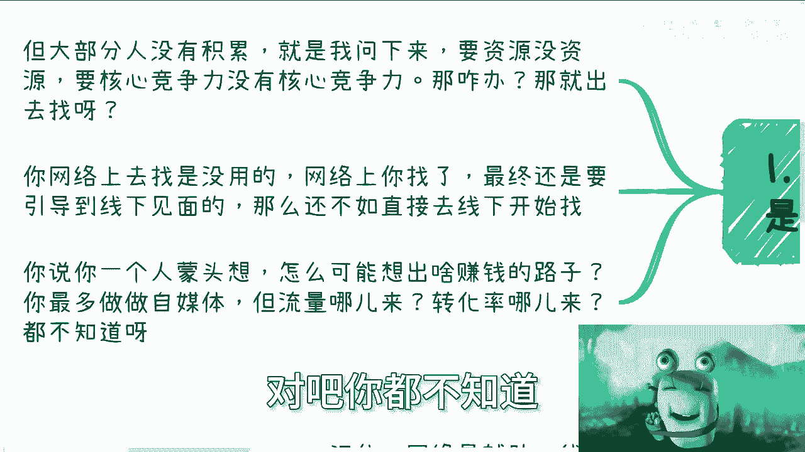
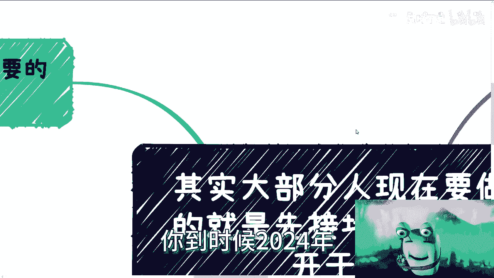
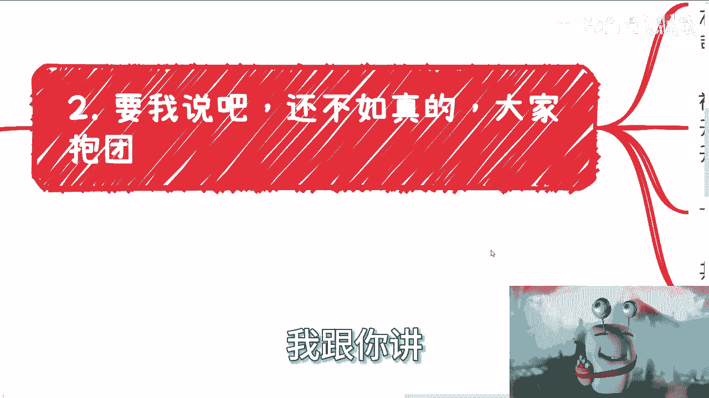
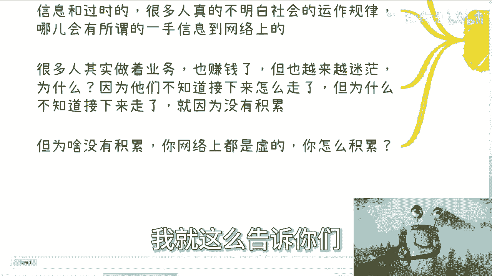

# 课程 P1：从接地气到组队练级 🚀

在本节课中，我们将探讨在当前环境下，个人如何通过“接地气”和“组队合作”来寻找并抓住机会。我们将分析常见的思维误区，并提供一套简单可行的行动框架。

---

上一节我们概述了课程的核心目标，本节中我们来深入理解“接地气”的具体含义。

许多人渴望赚钱，但赚钱需要机会。然而，大部分咨询者常表示自己“两手空空”，缺乏资源和核心竞争力。关键在于，所有人都从零开始，都是“杂牌军”。没有积累是普遍现状。

你不能永远停留在“没有”的状态。用最简单的逻辑思考：如果你没有，就去寻找。网络上的信息最终需引导至线下见面才能产生价值。与其独自空想，不如直接从线下开始行动。一个人很难凭空想出赚钱的路子，即使尝试自媒体，也会面临流量和转化率的现实问题。

时间飞逝，若到年底回顾却一事无成，将是巨大的遗憾。

---

理解了接地气的必要性后，本节我们来看看如何通过“组队”来创造机会。

与其独自扑腾，不如抱团合作。这有诸多好处。以下是组队合作的具体优势：

*   **能力互补**：团队中可以汇集开发、设计、运营、销售、商务等不同技能的人才。
*   **效率倍增**：社交网络呈几何级数增长。一个人一周接触50人，五人团队就能接触250人。
*   **业务拓展**：团队可以同时开展多条业务线。例如，一条线包装企业服务（B端），另一条线共同经营面向消费者的生意（C端）。
*   **提升信誉**：以团队或公司名义洽谈合作，比单打独斗显得更正规、更可信。

这个过程就像打网络游戏，大家都是1级（`LV1`），组队练级效率更高，生存能力也更强。

---

明确了组队的好处，我们接下来需要解决组队过程中常见的顾虑。

针对组队的疑虑，主要有以下几点解决方案：

*   **股权分配**：初期无需追求完美方案。可以采取相对平均的分配方式（例如五人各占20%），核心目标是推动项目前进，而非纠结细节。务必签署正式的股份合同。
*   **财务管理**：可以委托代理记账公司处理，成本不高，由团队成员平摊即可。
*   **信任问题**：信任无法凭空建立，需要在行动中验证。通过实际合作来筛选伙伴。如果被坑骗，就将其视为学习的成本，此人不再合作即可。这远比原地踏步要好。
*   **行动哲学**：很多时候，我们的直觉（第六感）是对的，但“雷”之所以会爆，是因为我们抱有幻想。正确的做法是只看证据和实际投入产出（`白纸黑字`），放弃不切实际的幻想。

---

解决了内部组队的疑虑，本节我们将目光转向外部，辨析线上与线下的主次关系。

最大的误区在于颠倒了线上与线下的主次。无论做什么，**网络永远是辅助，线下才是主战场**。

许多人将巨大精力投入线上制作，却几乎不做线下积累，这是致命的错误。原因如下：

*   **信息质量**：网络上流通的多是二手或过时信息。真正有价值的一手信息和赚钱机会，几乎不会首先出现在公开网络，而是存在于人的关系链中。
*   **积累实质**：业务可以坐着做，钱可以赚着，但人会感到迷茫，因为缺乏面向未来的积累。孤身一人难以规划前路。而网络上的连接大多是虚的，无法形成有效的、可持续的积累。
*   **合作基础**：真正的合作至少需要线下见面。网络上难以建立深度信任。

从宏观角度看网络生态，可以概括为一个公式：**45%（看笑话）: 45%（落井下石）: 10%（其他）**。绝大多数互动并非为了建设性目的。因此，将主战场放在线下是更务实的选择。

---

本节课中，我们一起学习了在当前环境下破局的关键路径。

我们首先指出，大部分人起点相似，不应纠结于“没有”，而应主动“接地气”，从线下寻找机会。接着，我们论证了“组队练级”的优势，它能整合资源、放大社交网络、并提升信誉。针对组队的股权、财务和信任问题，我们提供了务实的解决思路，强调在行动中学习和筛选。最后，我们辨析了线上与线下的关系，明确指出**线下才是积累与机会的主战场**，网络仅作为辅助工具。

总结来说，当下的行动指南是：停止空想，拥抱线下，寻找伙伴，快速组队，在实干中学习和成长。