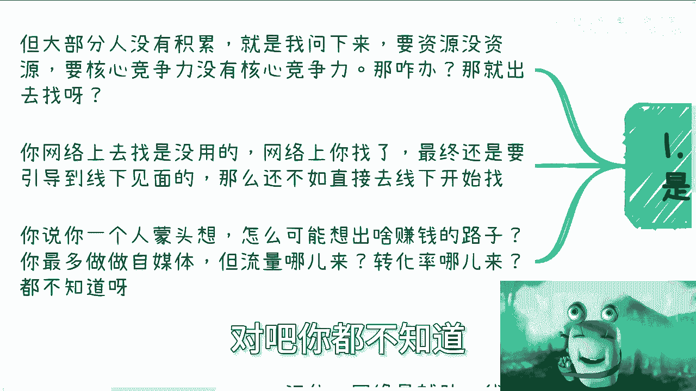
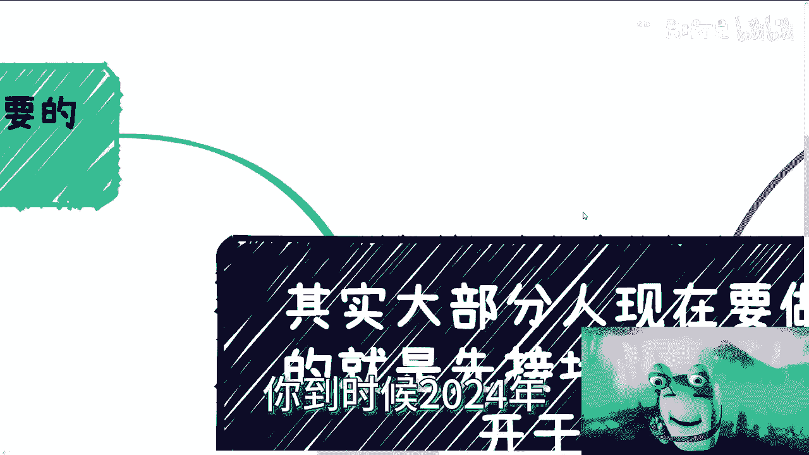

# 大部分人现在要做的就是先接地气，然后组队练级 - P1 - 赏味不足 - BV1f64y1N7dn

啊，嗯咳咳我们开门见山啊。

呃这一期这个内容呢，我主要是觉得真的就是所有人不要犹豫啊，就是真的就是说内心啊，我觉得现在大部分的人啊，不要搞那些有的没的都没用，现在我觉得唯一要做的是什么，就是先接地气，然后找人开干啊。

什么意思啊，我是这么觉得，我觉得每个人都想赚钱，但赚钱要的是什么。

是机会，对不对，但是大部分人你想啊，每个人就是你比如说咨询我的人，有些人就说我两手一摊，我什么都没有对吧，然后说我手上牌稀烂，但是我我就这么跟你们讲，你们一定要明白，其实所有的人都是杂牌军。

都是草台班子，没有谁稀烂不稀烂的，都稀烂的，你知道吧，就是说但是大部分人呢他没有积累，就问下来，你比如说要资源没资源，要咳咳咳，核心竞争力没有核心竞争力，那怎么办呢，你想啊，你没有。

你用最简单的逻辑来讲，你没有，你怎么办，你说我今天打个比方，你说我今天这个这个这个要出去打仗啊，要出去战斗了啊，你说我没有神功怎么办呢，我去练，那我就问你们，你练不练得成呢，你不知道啊，对不对。

那你没有，你不能永远两手一摊，跟我说没有，你也不能永远两手一摊，跟自己说没有，对不对，那你没有，你出去找啊对吧，你网络上找没有用，你网络上找来，最终还是引导教你要引导到线下去见面的。

你还不如直接线下开始找对吧，你说你一个人闷头想，你怎么能想得出赚钱的路子呢，你想不出来的呀，你最多做做自媒体，但是问题是你做自媒体，你流量哪来的，转化率哪来呢对吧，你都不知道怎么搞啊。

你到时候2024年一晃眼12月份了。

你回头一看哦，我什么都没做，对不对，我跟你讲。

要我说你还不如真的还不如真的大家抱团哎，有什么不好呢，你想想啊，你看很多人现在他没有方向对吧好，那其实也容易啊，有开发，有设计，有运营，有销售，有商务，什么都有啊对吧，那如果来说大家都是LV1级。

那就一起报个团呢，报个团不好吗对吧，注册公司干，我觉得这就是个很好的方式，真的你管他372 11先干哪对吧，你社交一下你，你首先你看啊，大家抱团，你社交一下子关系它就是几何倍数的增长，你一个人一周。

比如说社交50个人，那你五个人就是200多个人，对不对，然后大家你同时开启条线一条，就是自己可以包装的，比如说一个企业的业务对吧，然后你做C端的生意，因为你们几个人做一个团队，做一个C端生意。

有什么不能做，这不是分分钟的事情嘛，对不对，一个就是大家各自扩展之后去做B端的生意，你多条线往前走，这机会不大吗对吧，其实你想啊，你想啊你出去你一个人是担保的啊，你说你没有企业。

但是你同样的你比如说你说陈老师，我跟你谈个合作，你你然后你拉个拉个会议对吧好，然后一下子比如说有五六个人来，那至少从我感觉上，我也会觉得你是一个正规的这个这个业务啊，对吧哦。

你比如说你跟我谈永远都是一个人啊，然后你你要什么没什么，你怎么谈啊，对不对，怎么谈啊，你就像打网游一样的，你大家都是LV1级，那大家组队练级吗，是不是啊，那么你说的这个呢有很多人就说信任问题。

哎我跟你讲啊，是这样子的，所有事情做，你不能面面俱到，你面面俱到，你还怎么做啊，是不是对吧，我跟你讲啊，你该做的做到位，什么意思呢，大家相互分分配的股份，签好合同对吧，结束了呀对啊。

虽然啊我们说啊股份的均分，它是一件非常的事情，什么叫均分，就比如说你们五个人分别是22222对吧，那就非常的二对吧，但是你作为一个刚起步的，一个一个一个一个团队或者怎么样子，你可以不管这些事情啊。

对不对，你只要一碗水端平了就好了，你管他那么多呢，你要的是往前走啊，不是拘泥于这些有的没的对吧，然后另外一方面就是说财务报账，你找个代理公司就好了，一年没几个钱了，你们平摊一下也就过去了是吧。

然后信任问题也不是问题啊，为什么，因为你想想看啊，所以你不能解决问题都不是问题，因为你不能解决，你去想它干嘛呢，你想他除了内耗有什么用呢，对不对，你信任问题，你要觉得你能判断这个人不行的，你就不合作。

你要觉得能不能判断你就过滤筛选对吧，你要觉得不能，你就用实际行动来学习，什么意思啊，就是你就组队啊做啊，然后他坑了你，对他骗了你，他怎么样，OK这个人以后不合作，你就用实际行动来筛选好了，怎么办呢。

总比你原地踏步好吧，不进则退啊，你就算被坑了，他也是必经之路对吧，你比如说毕竟像我这种人，我就是悟性低的，我就属于所有的学习啊，我都是被坑了之后我才明白的，我才死心的啊，我这样说啊。

很多时候我就告诉你你的感觉，第六感，第七感可能都是对的，但是呢你之所以会把一个雷养大，是因为你抱有幻想，你知道吧，就很多时候明明很多事情不会发生的，很多雷雷不会爆的，但是为什么会爆，就是因为你抱有幻想。

你懂吗，就是你看我现在的状态是什么，就是我跟你们讲一就是一，二就是二，看证据看什么，为什么，因为我现在的状态，就是曾经所有的幻想都破灭之后的状态对吧，就是我只我只关心白纸黑字。

我只关心所有的真正的投入的东西和，产出的东西，别的什么的我都不关心，为什么，因为我曾经都抱有幻想啊，都他妈没卵用啊啊好，然后第四点就是最大的误区，记住啊，无论你做什么事情，网络永远是辅助。

线下才是主战场啊，很多人我发现搞反了，就是线上他花了巨大的精力啊，做视频，做宣传，做什么东西，线下几乎没有，就他没有搜索也没有，就是说这种积累我跟你讲要命了，哎真的要老命啊，你懂吗，真的要老命了。

就是这就是浪费人生，浪费人才，真的我每次我都跟他们这么说，然后线下你积累不了任何东西，因为什么，因为你想啊，你得到的信息都是二手的信息跟过时的，你你怎么说呢，就是说你真的明白的时候，你就会发现。

怎么会有可能有一手的信息到网络上，怎么可能会有一手的信息，你今天就算是政府，官网或者其他地方弄出来的信息，也不可能是一手的，为什么，因为网络是死的，人是活的，你背后的关系链才是真正的信息啊。

你放到前面来，他妈的哪来谁，谁会把赚钱信息，或者说他能够赚钱信息放到网上来，他他妈脑子有毛病嘛，对不对对吧，你你退1万步来讲，你比如说今天我有一个数字经济的东西，我一定是先去找我的合作伙伴，对不对哦。

我不找我的合作伙伴，我发到网上，我说来大家跟我一起做，这倒不是脑子有毛病吗，对不对啊，很多人其实我跟你讲，做业务呢是坐着的，钱也是赚着的，但是他越来越迷茫，为什么，因为他们不知道他接下来怎么走。

因为人要往前走啊，你不进则退啊对吧，而且他很多时候赚着钱的是辛苦钱对吧，那他为什么不知道接下来怎么走，因为他没有积累，他放眼望去就他一个人孤身一人，他怎么怎么往前走好。

那么你最后想想看他为什么没有积累啊，因为网络上都是虚的，你怎么积累呀啊你怎么积累对吧，就像我跟你们讲，退1万步来讲，如果你要跟我合作，你至少过来跟我见一面吧对吧，你你网络上能积累出啥对吧，我说不好听的。

网络上除了你能积累出来一堆喷子，你还能积累出啥，因为我就这么告诉你们。

网络这个东西啊，你怎么看啊，我不是说各位不好啊，但是宏观角度你得有客观的判断，什么意思啊，就是网络上一定是4。5，4。51这么一个逻辑，什么意思呢，就是45%的人是来看你笑话的。

45%的人是来落井下石的，还有1%的人，他可能是关心你的，没了，这就是网络，这就是人性，你不用去想，就是跟你做什么，你什么地位，跟你是谁一点关系都没有，就是4。54。51这关就这关系没了，你知道吗。

甚至是什么，甚至是甚至是就是嗯0。1%为你好的，99。9，一半是看笑话的，一半是落井下石，没有办法，人家就这个样子，你懂吗啊好吧，所以说我真的觉得就当下这种环境，与其大家就是在那边一个人扑腾啊。

一个人扑腾，还不如组队扑腾，真的我真的觉得这是有好处的啊，不管结果好还是不好，你被坑了也是好的好吧好就这么着啊。

