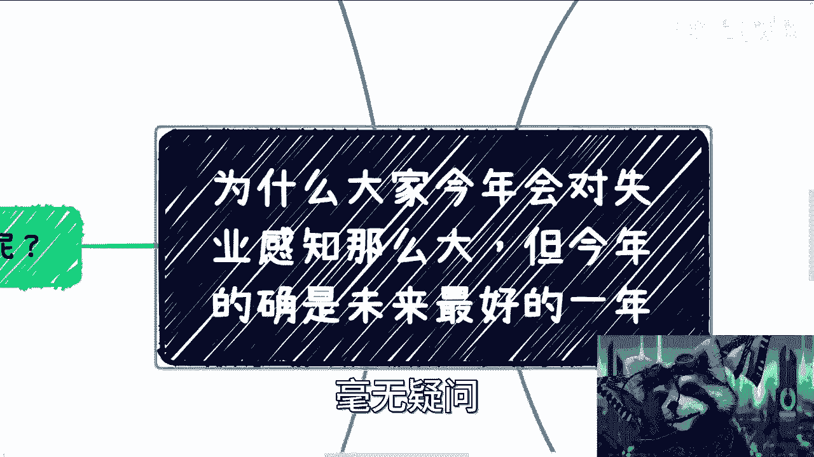
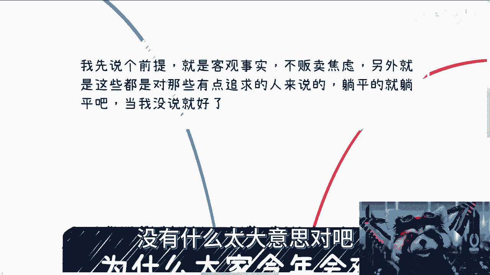
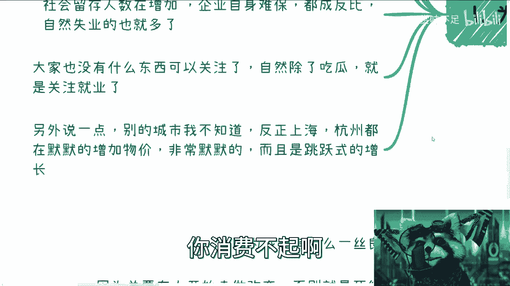
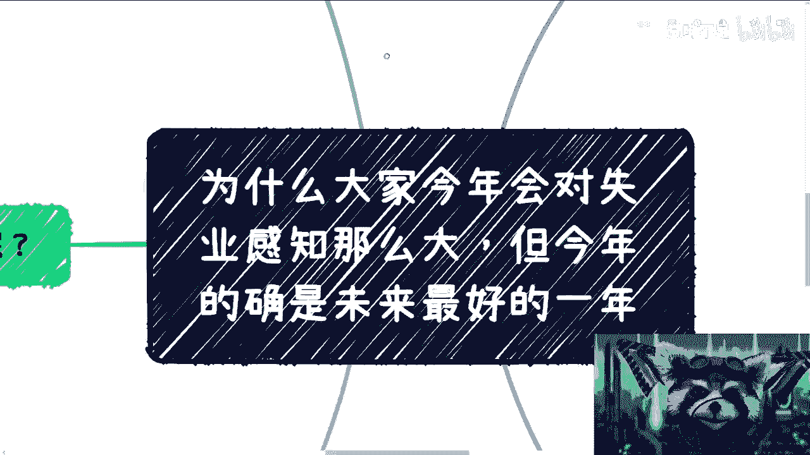
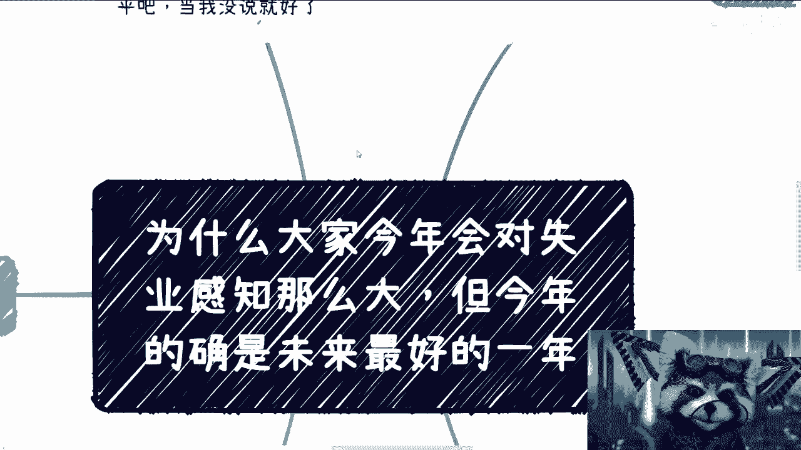
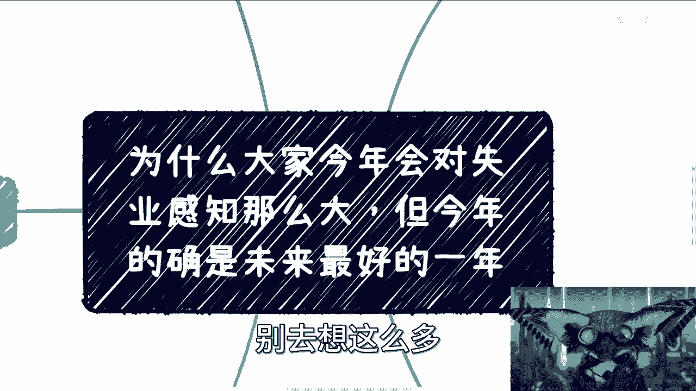

# 失业是事实，今年是未来几年最好的一年也是事实 - P1 - 赏味不足 - BV1Y14y1S79z

好啊大家好啊，这个介于最近因为我前面这个话筒居然还会跳，好牛逼啊啊这个这妈的算了。

他跳吧哈，鉴于最近这个还是有很多小伙伴新来的啊，就是新关注的对吧，我就把这个问题正好再抛出来再说一下，因为今天早上呢正好我也刷到过视频啊，就我们群里面有小伙伴说对吧，看到一个小姑娘这个哭的很惨啊。

然后说什么失业啊，然后不仅仅说自己失业啊，我听了一下，反正就是说父母也失业，我全面的再说一下吧，好吧就是为什么今年呢会对这个感知那么大，同时呢我也要告诉大家，今年的确是未来最好的一年啊，毫无疑问。

首先我先说个前提啊，就是我所说的所有东西只是客观事实啊，我从来不贩卖焦虑，而且另外一方面，我觉得现在也没什么好贩卖的对吧，因为我觉得我是我贩卖，就算我贩卖焦虑，我贩卖出来焦虑甚至也没有现实这么残酷是吧。

然后呢，我这边所想的所有的观点，只对那些有追求的人来讲是有用的，躺平的人就躺平，就当我没说就可以了好吧，别不要来杠啊，没有什么太大意思的对吧。

大家明白一点啊，大家都是底层的劳动人民对吧，这个相互之间有什么好杠的呢。

是不是啊，我们是同一个站这个同一个战壕里的啊。

一定要明白啊，首先第一点啊，网络上有句话叫什么叫做铁拳，到了自己身上才会明白痛，你知道吧，才会有真的感觉，这个啊说实话的确是一个很重要的点，就是什么呢，就是说前两年之所以没有这样子。

的确是也没有这么多失业的人，这毫无疑问啊，那现在就是说也的确有非常多人，慢慢慢慢入市的啊，得到了这么一个东西，那么自然而然啊，有很多人就也没有发泄口嘛，那他只能到网上来说嘛对吧。

第二个呢就是说这个DEBUFF已经叠满了，什么叫DEBUFF叠满呢，就是有很多人也会问钱到哪里去了对吧，我这边这边随便跟你们聊PDD，哎呦，我这个地方还有那个新能源啊，新能源电动车，对不对啊。

你比如说PDP啊，新能源电动车对吧，互联网啊，疫情各种补贴对吧，被薅的就是没有钱，你知道吗，事实就是没有钱就这么简单对吧，我对互联网的观点还是那句话啊，就是说，投入的真正的金钱和它产出的价值。

完全不成正比，就这么简单啊，就这么简单，我不否认它的价值啊，我不否认它的价值，但是这个价值绝对不成正比啊，这第二点第三点呢就是说疫情也过去了对吧，很多个人和家庭呢也找不到借口了。

也就是说可能很多个人失业啊，前两年就已经失业了，但是呢他们会觉得这个是跟疫情有关的，和很多这种个人关系都有关系啊，各种因素都有关系，但是到今年为止就没有借口了啊，那么自然而然很多人也都会觉得说啊。

我为什么找不到对吧，或者说好像有这么一个问题啊，那么还有一点呢，就是说社会留存人员的确在增加啊，这毫无疑问对吧，这个新闻社会新闻都已经说了对吧，都鼓励大家到社区里面啊，这个社区大妈对吧，社区大大爷对吧。

这种岗位去就业了，那你可想而知，社会流程人员的确在增加，由于经济的情况，企业的确自身难保对吧，我还是那句话，大家不要抱怨说自己为什么找不到工作，你们不是最难的啊，目前来讲企业家是最难的啊。

资本家是站在外卖最开心的，就这么简单啊，企业自身难保啊，这个整个企业的head count，跟社会流程人员其实是一根曲线，往上一根曲线往下都在成反比，自然失业的也就多了，这毫无疑问嘛，对不对啊，然后呢。

另外一方面就是说大家呢也不像以前说啊，都忙自己的事情，你知道吧，大家也现在没有什么很多东西可以关注了，自然除了吃瓜以外，就业就关注就业了啊，那么关注就业，自然而然也就会关注到很多失业对吧。

这个事情没有办法的事情嘛，对不对啊，那么另外说一点呢，就别的城市我不知道啊，反正最近我去过的，比如上海杭州南京啊，都在默默增加增加物价对吧，尤其是吃的啊，增加物价非常默默的啊，就几个月给你跳两块钱。

几个月给你跳两块钱对，就这个样子，你消费不起啊。

对不啦，那今年感知为什么这么大，就是因为你所有的叫做开源节流对吧，叫做叫做叫做投入产出对吧，你只有投入了对吧。

没有产出，那怎么弄啊对吧，那老百姓怎么办呢，是不是啊。

第二个就是说从我个人角度来讲呢，我觉得劝大家放弃幻想啊。

真的就放弃幻想，现在已经没有任何可以幻想的，什么意思呢，就是说你卷也好，不卷也罢对吧，反正30多岁就要被丢弃了，电池的命就这么简单啊，当然呃这个东西不打包票啊，没有我从来不会说什么一刀切。

大家都不行对吧，总归有人行的，但是我在这个地方说了，不要抱有这种幻想，就是所有事情做好最坏的打算对吧，不是最好啊，不是最好，对不对，就这么简单啊，好了，那有人要说了啊，驴老师外卖焦虑对吧，我跟你讲了。

我一开始就说了啊，我现在贩卖焦虑根本就不够，这些东西有什么好贩卖的对吧，我跟你们讲的东西还不如人家他妈的，现实生活当中面临的残酷的多，你说是吧，这第二点第三点好了，又有人要说了对吧。

当下老百姓没有办法对吧，他说我就是个普通人，我只能选择工作，这句话没有错对吧，但是大家也不是说30多岁就不活了对吧，30多岁就财务自由了，或者30多岁，30多岁就退休了，也没有呀。

我这里劝大家放弃幻想的意思是什么意思呢，意思就是说你工作能做就做，顺其自然，如果有好的机会，你就顺杆往上爬，对不对，该跪舔跪舔，该那个应酬应酬该去叫什么谄媚谄媚，就这么简单，对不对。

你不好的工作你就洒洒水，别去卷对吧，别去他妈拼了老命，996有什么意思呢，对不对啊，你从现在开始，就是我觉得从2023年，现在这个6月份，你们看到这个视频开始对吧，你们就要去积累自己的赚钱的闭环。

我不管到底是摆摊也好，手艺也好，还是做小生意也好，直播带货也好，我不管怎么样，就是说你大家需要在这个社会当中，寻找到自己的一席之地，不管这个一席到底是多小或者多大，不重要。

总比就是说你30多岁这个电池丢掉之后，你一点收入没有来的好吧，对不对啊，无所谓啊，不要去想着就是说啊，这个这个这个价值怎么样怎么样，怎不不重要，你先生存，你说对不对，所以说你总比你作为电池被丢弃之后。

开始积累来的好吧，就是说你作为电池被丢弃之后，你根本没有时间来的再来积累的对吧，我跟你们说的，就说你们现在20多岁找我咨询的，我还会跟你们说说，我跟你们说，你们但凡什么三十七八岁再来找我。

我跟你们说就等死，真的没有什么好说的，有什么好说的呢，对不对，你要我说就是你精力也不够，你钱钱也没有对吧，你家里还要上有老，下有小，你我能告诉你怎么办啊，能怎么办呢，就所有东西都是要积累的，能怎么办呢。

对不对啊，就我觉得做事情啊，我们就是要做好，做好最坏的打算，我跟你们讲，有很多时候都是自己作出来的，对不对啊，你别幻想自己就是那个铁锤锤不到的，那个没有意义的呀，对不对，而且工作这个东西是这样子的。

就是就像我说的好就好不好也就那么着了对吧，咱们就睁一只眼闭一只眼对吧，我们别老是抱寄希望于，就把自己的生存啊和希望寄托在别人身上，什么叫寄托在别人身上，就是我们但凡做电池就是寄托在别人身上。

寄托在一个第二天，可以直接让自己滚蛋的工作身上，你觉得有意义，未来没有意义的呀，对不啦，当然了，就是说为什么很多人会觉得对吧，好像我这个观点很不对，或者为什么很多家长会觉得很不对。

就是因为他们把前面20年，前面30年的东西来做来做参考，但是你想想看有意义，未来没有意义的呀，对不对，你鼎盛时期猪都能起飞，对不对，但是你现在回归正常了，那你自己不靠自己，靠谁啊，靠别人啊。

对不靠别人不可能的呀，然后考研我跟你们讲了，大部分不是说考研没有用对吧，就是大部分考研没有用啊，你拖了两三年，你可惜改变不了什么呀，我跟你们讲，你现在觉得市场不好对吧，你两三年之后还是不好的呀。

不会有改变的呀，我跟你明讲好了，你两三年后你再来喷我好了，如果好的话，你过来喷我，没关系的，随便喷啊，我他妈可以我我可以这个随便说啊，我说我我跟大家道歉啊，是我认知不足对吧，怎么样怎么样，你看好了。

没有任何好的迹象呀，对不对，然后你别来问我考公，你你这个东西我不方便讲啊，你们自己去了解了解，你们自己知道周围各地方的国企央企，还有公务员去问问情况啊，国企央企指的是那些非编制的对吧。

全职员工公务员就是那种那种有编制的，你们自己去了解了解对吧，别了解一两个人拿幸存者偏差来跟我讲，你们面面上多去了解了解对吧，我自己不评价，你们自己想好吧，然后呢，我跟你们讲未来呢，我觉得客观说啊。

我我不能说，就说我不是那种叫做叫做贬义的看衰啊，我就是就是客观的跟你们讲，我就觉得这是看衰的，就必然的，就大家别去抱有太乐观的想法，因为首先从经济上面来讲，我没有看到任何新的增长点对吧。

我看到的还是不停的爆雷，还是不停的就黑洞往里往里面吸钱吸血，说白了吃到最后还是老百姓的钱啊，老百姓来背锅对吧，那当然我觉得大家都在找啊，大家不是说不找到，大家都在找，但至少现在还没有找到。

第二所有存量市场都已经卷不出水了，因为没有办法，人太多了，对不对，你甚至卷不出任何东西来，就刺刀见红，没有没有办法了，然后其实我跟你讲，很多老人和资本家是提供不了价值的，你明白吗，因为老人嘛对吧。

那没办法嘛，资本家其实都是这个这个钱生钱对吧，空对空的，它也产生不了直接价值对吧，虽然我们说经济的本质是流通，但流通不能仅仅只是在上层流通，或者只是在一个小众范围里面流通。

那你否则这样的话你就会变成什么，就会变成现在这个样子，你知道吧，当然话又说回来，年轻人也的确不行，为什么，因为只要么只想着做更好的电池，要么就是只想着啃老，没有实际的产出跟价值。

或者说没有更多的拥有自己价值观的这些人，很少很少，你问他你想做什么，不知道，你问他你感兴趣什么，不知道对吧，你问他怎么样，他就会告诉你，我不想怎么样，我只想生存对吧，我当下也没有办法。

就是那种就是说两手一摊，我反正也没办法，唉对吧，然后当然了，这个市场也的确扭曲啊，我也给你们讲，市场也的确扭曲，都是急功近利的对吧，而不是说去看本质，去看到底解决什么问题，去看到底产生什么价值对吧。

经典的就是说只看现在，不看未来，这个就是当下，那当然就是说我之所以看衰的原因，就是说我一呢我没有看到任何好的一些增长点，在什么地方，第二就是，我认为这些东西也不是一时半会就能解决的，问题啊。

这没有什么范围焦虑不焦虑的，就事实现实现实就是这个样子啊，然后第四个呢就有人一直就评论区啊，就是一直也有人问我，他说那我现在为什么要去做这些视频，为什么要去说这些，我我在这个地方统一说一下。

第一我认为我还有那么一丝良心对吧，我想去做，第二因为任何事情的改变，总要有人去做改变的对吧，哦永远没有人去做改变，永远有人做改变了，就被这些人去阴阳怪气，那永远就不会有改变，否则就是循环有什么意义了。

没有意义的呀对吧，那我还是那句话，大家要明白，我们是一个战壕的人，我们为什么要相互攻击呢，对不对啊，因为我跟你讲，我不会不接地气的跟你们说对吧，让你们动不动的就去投钱开店，什么做什么加盟对吧。

开什么药店，我跟草他妈的真的莫名其妙，我就不点名了，真的真的我跟你们说，就有些营销的人，有些资本对吧，有些就是那种就是收割的人，简直他妈就是不要脸啊，还有什么呢，就是说白了我也知道。

因为就算我今年这么说了，还是会有很多人不停有，但是有人听了就行了，我觉得我做到我想做的就可以了，就这么简单，对不对对吧，就像咨询一样的，我从来不强迫别人咨询，你们想想咨询你就咨询。

不想资源拉倒无所谓的呀，对不了啊，我有说过哈，你们不咨询银行，我拉黑你们什么点踩我拉黑我，不然没用的，无所谓的呀，对不是，萍水相逢再说了，我还是那句话，我们是一个战壕的，大家要认明白啊，真的是啊对吧。

然后未来情况是什么，未来情况就是当下的本科本科硕士的整整体，包括9年制义务教育，整体的教育的确有很大的问题，这毫无疑问啊，这个问题是线，就是整个问题长尾效应很长，而且当下的整个网络状态。

给别人带来的扭曲的价值观也越来越多啊，不管是给小孩还是给家长，还给老人很多很多啊，然后互联网从业者的这个落差会很大很大，这没有办法，因为他们以前过日子过得太舒服了，我还是那句话啊。

他们不明白世界运作规则是怎么样的，就感觉卧槽，我他妈应届生，我他妈就应该是几百万年薪，我做互联网就应该几百万年薪，他们以后会明白的对吧，然后还有一点呢，就是说以后啊法盲各种盲只会越来越多啊。

什么什么极端的行为啊，啊然后这些什么什么叫什么，就是不懂得法律来保护自己的对吧，然后不知道到底是触犯了什么法律啊，对吧等等等，就这种法盲会越来越多啊，然后这个越来越固化，而且很快这个主体主语我都不敢写。

你看到没有对吧啊，还有一点呢就是我就这么跟你们讲啊，就是没有人会来托底的啊，放心吧，放弃幻想啊，只有我们自己能拯救自己，不要来想着托底这个事情，底他妈都快没有了，还拖啥啊对吧。

所以啊我觉得是这样子的啊。

所有人的关注点呢，我希望啊第一这关注点不要只在工作上哦。

只在工作上没有用的啊，格局要放大，第二点就是说要去关注紧急，要去关注全球啊，要去关注，就是说自己的核心竞争力，而不是自己在公司里的核心竞争力，因为你在任何公司里面，你只是电池，你没有啥核心竞争力的啊。

然后第三点呢就是不要好高骛远，不要眼高手低啊，我所说的就是，就是我比如说我在这个第二里面所说的，说哎这个这个叫什么积累自己的赚钱闭环，不是一定要他妈的几百万，几10万甚至几万无所谓的，你赚几百也可以。

赚几千也可以，几十块钱也可以，你得有自己的商业闭环，你知道吧，就自己商业闭环就说你得有能力去赚钱，而不是有能力去拿工资，因为你拿工资不叫有能力，你拿工资其实就是别人的施舍，你不可控啊。

对不对，我还是那句话嘛，今年他说你有能力，你就有能力，明天他说你没能力，你就没能力，不就这么简单吗。

卷不动的，我跟你们讲，卷不动了，就这么回事。

啊然后还有人跟我说什么呢，说现在的生育率，哥哥们，姐姐们，现在生育率跟我们这两年有有蛋关系啊，有关系，未来没有关系的，以后的事情以后再说啊，我觉得我们现在能能能把握住这两三年，把握住35年已经不错了。

对不对，我跟你们说，就是我为什么会把这个窗口，把这个合集作为窗口期，我现在也是就是越来越感受到了，就是就真的就是这两年要做出改变，不做改变以后就没有这个机会了，就你们以后再想做改变，可能就对吧。

就那种机会越来越少，我不能说没有，那就机会越来越少，就这个样子好吧，所以说唉反正，从现在开始吧，好吧嗯，普通人与普通人之间没有这么大的差别，包括我跟你们说了，我找了很多小姑娘来来做分享的，对不对。

然后有很多人就说了，他们是PHD，他们怎么样，已经不是普通人了，没有啊，在我看来他们就是普通人，我认识他们都10年了，从小看到大的，就我觉得他们的点就在于比别人勤奋，比别人行动力快就结束了好吧。

那我觉得大家就从现在开始行动起来就结束了，别去想这么多。

