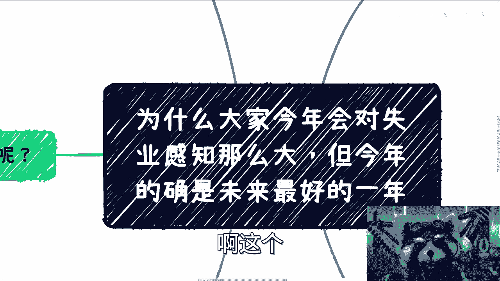
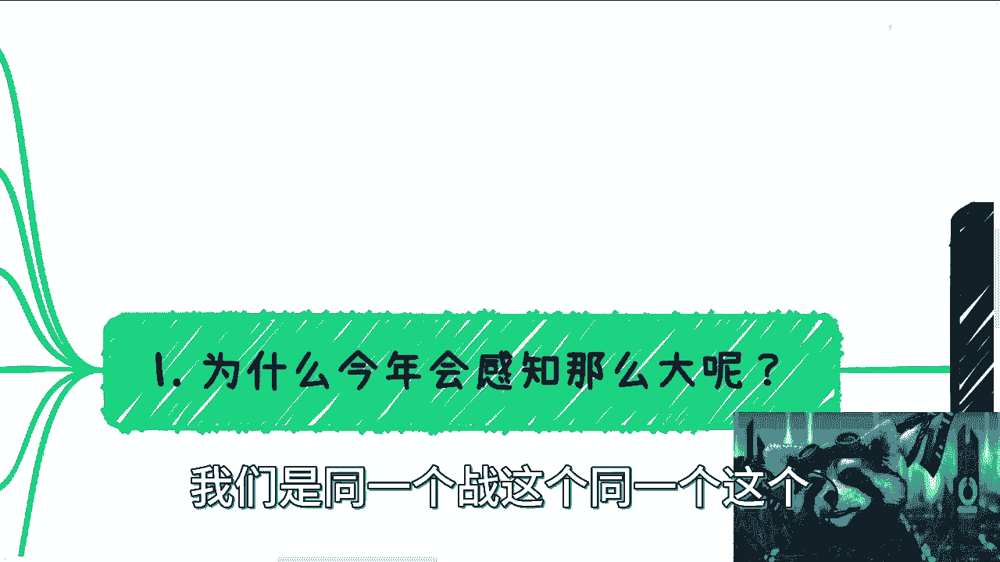
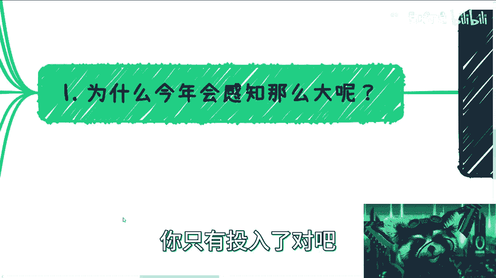
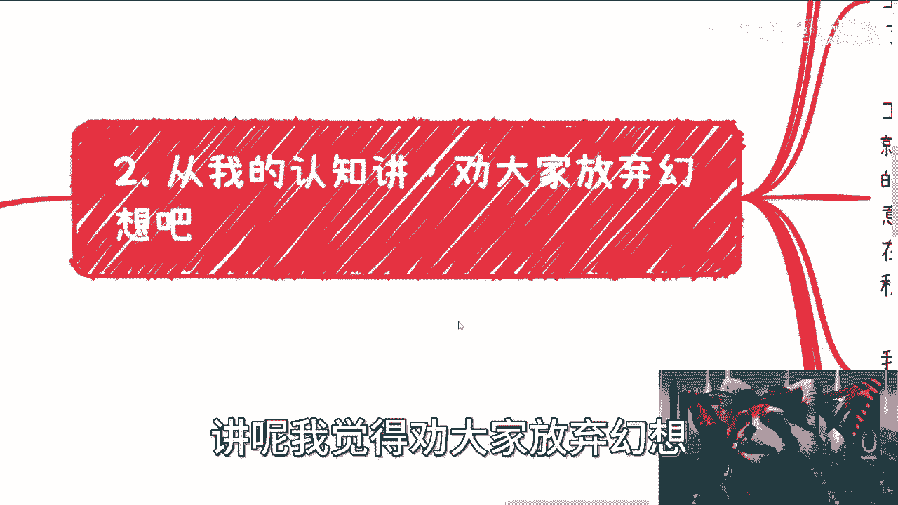
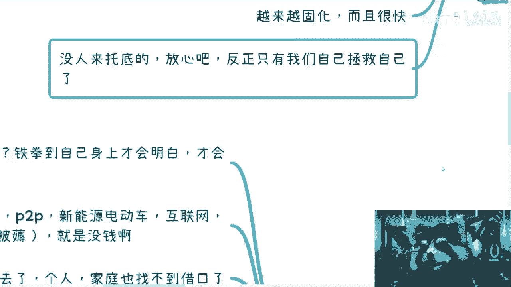
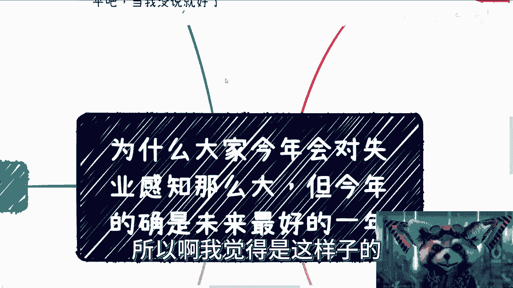
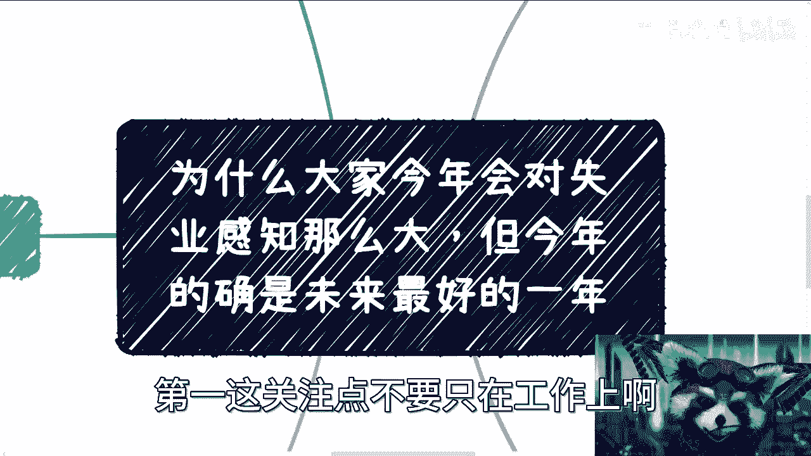
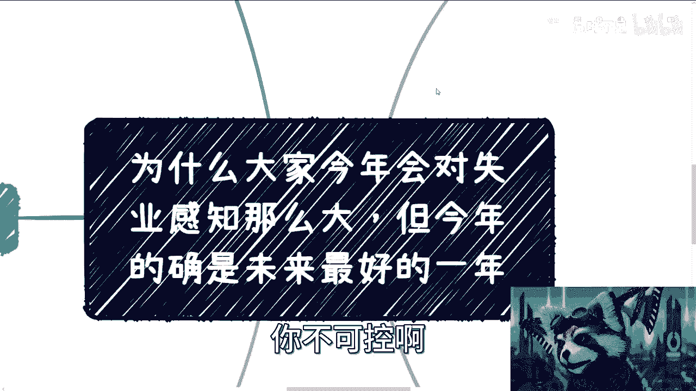

# 失业是事实-今年是未来几年最好的一年也是事实---P1---赏味不足---BV1Y14y1S79z_




在本节课中，我们将客观分析当前社会普遍感知的就业压力，探讨其背后的原因，并为个人提供务实的应对思路。课程内容基于对经济环境和个人发展路径的观察。




---

## 概述

本节将首先阐述一个普遍的社会感知：失业现象是当前的现实，并且今年可能是未来几年中相对较好的一年。我们将从几个层面分析为何今年大众对就业困难的感知尤为强烈。

上一节我们介绍了课程主题，本节中我们来看看具体原因。




以下是导致当前就业感知强烈的几个关键因素：




1.  **个体体验的普遍化**：前两年失业问题未如此凸显，因为受影响个体较少。如今更多人切身感受到失业压力，网络成为主要的情绪宣泄口。
2.  **经济资源的消耗**：大量资金流入了特定领域（如拼多多、新能源电动车、互联网行业、疫情补贴），这些投入与产出的社会总体价值不成正比。可用资金减少是客观事实。
3.  **“借口”的消失**：疫情等因素过去后，个人和家庭难以再将失业归咎于外部偶发因素，问题本质更清晰地暴露出来。
4.  **劳动力供需失衡**：社会待业人员数量在增加，而企业因经济压力自身难保，正在缩减岗位（`企业招聘需求 ∝ 1/社会待业人员数量`）。企业家面临巨大经营压力。
5.  **关注点的集中**：当其他社会热点减少时，公众的注意力更集中于就业问题，放大了对失业现象的讨论。
6.  **生活成本上升**：以上海、杭州、南京为例，生活必需品价格在持续缓慢上涨，加剧了“开源节流”中“源”的困境。

---

## 核心观点：放弃幻想，务实行动

上一节我们分析了外部环境，本节中我们来看看个人应持何种心态。

核心建议是：放弃不切实际的幻想。在当前的职场结构中，多数人被视为可替换的“电池”，年龄歧视（如35岁门槛）是普遍存在的现实。这并非绝对，但应作为最坏打算来规划。

以下是基于此心态的具体行动建议：

*   **对工作顺其自然**：有好机会就努力争取（包括必要的职场社交），普通工作则不必过度内卷（如拼命996）。工作的稳定性不可控。
*   **立即构建个人“赚钱闭环”**：从当下（2023年）开始，利用业余时间探索并积累不依赖单一雇主的收入能力。形式不限（如摆摊、手艺、小生意、直播带货），核心是建立**从技能/产品到收入的完整链条**。这比失业后再从零开始要主动得多。
    ```text
    个人赚钱闭环 = 可市场化的技能/产品 + 获取客户的渠道 + 完成交付的能力
    ```
*   **重新评估教育与考试**：
    *   **考研**：对于多数人而言，为逃避就业而考研，两三年后可能面临同样的市场困境，且年龄优势丧失。
    *   **考公/进国企**：不宜仅凭个别案例做决定。建议广泛了解当前非编制岗位及编制内岗位的真实情况，自行判断。
*   **调整关注点**：
    1.  不要将全部注意力局限于找工作本身。
    2.  关注宏观经济与全球动态，培养在市场中通用的**个人核心竞争力**，而非仅适用于某家公司的“伪竞争力”。
    3.  脚踏实地，从赚小钱开始实践商业闭环，这比空想更重要。

---

## 对未来的客观展望

上一节我们讨论了个人策略，本节中我们来看看对中长期趋势的客观判断。

以下是几个基本判断：

1.  **缺乏新增长点**：目前经济中未见能广泛带动就业的新兴增长点，同时一些领域仍在持续消耗社会资源。
2.  **存量市场极度内卷**：所有现有市场都因参与者过多而利润微薄，竞争呈“刺刀见红”状态。
3.  **价值创造环节脱节**：经济循环在关键环节受阻。部分资本空转，未能有效转化为普惠价值；同时，许多年轻人或因只想做“高级电池”，或因迷茫，缺乏创造实际价值的行动力。
4.  **系统性问题持续**：教育体系的长尾问题、网络扭曲的价值观、互联网行业从业者的预期落差、法律与经济常识的匮乏等，都是需要长时间调整的深层问题。
5.  **自我负责**：不应寄望于外部力量“托底”，个人必须主动寻求生存与发展之路。



---





## 总结与行动呼吁




本节课中我们一起学习了当前就业环境严峻的成因、个人应持有的务实心态以及具体的行动方案。


**总结如下**：
1.  当前就业压力是多种经济与社会因素叠加后的集中体现。
2.  个人需放弃将全部希望寄托于单一职场路径的幻想。
3.  **立即行动**，在干好本职工作的同时，探索并构建哪怕微小的个人商业闭环，这是应对不确定性的关键。
4.  普通人的差距更多体现在**行动力与执行力**上。从现在开始，关注自身能力的真正提升，而非仅仅关注工作职位。


改变始于认知，成于行动。普通人与成功者之间的差距，往往就在于是否更勤奋、行动更快。请从现在开始，为构建属于自己的那“一席之地”而行动。