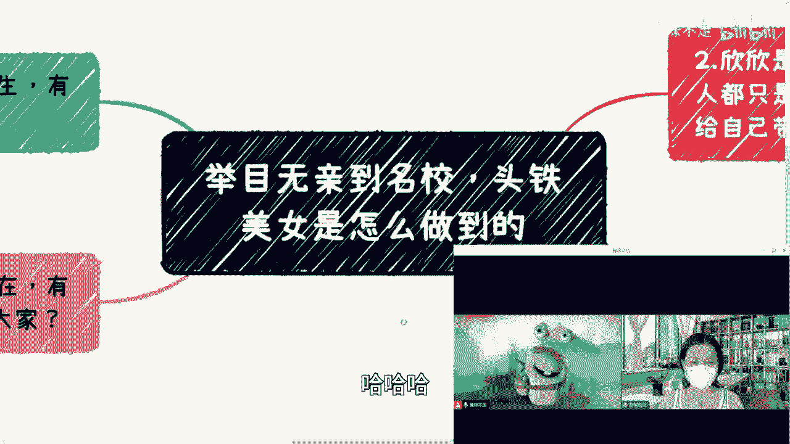

# 课程名称：从交换生到硅谷工程师：一位程序员的成长与行业洞察 🚀

## 概述
在本节课中，我们将跟随嘉宾“甜菜星星”（网名）的分享，了解她15岁独自赴美做交换生，并最终从名校毕业、进入硅谷科技公司的经历。课程将涵盖留学初体验、成为KOL的心得、学习方法、当前中美科技行业现状以及对AI、游戏等前沿领域的看法。希望通过她的故事，为初学者提供关于学习、职业规划与行业选择的直观参考。

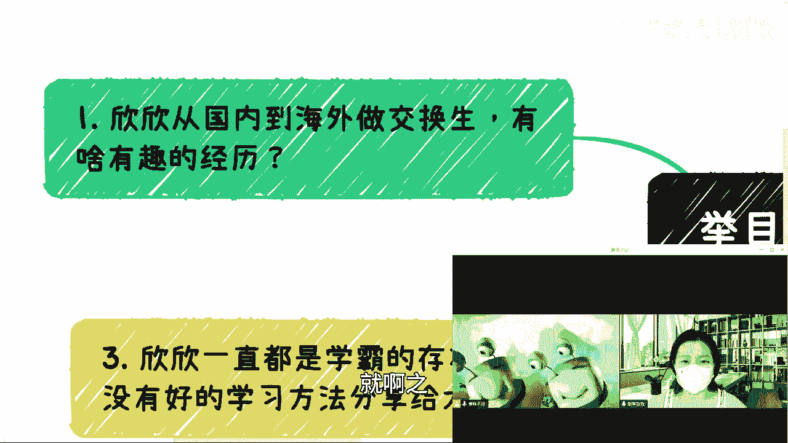

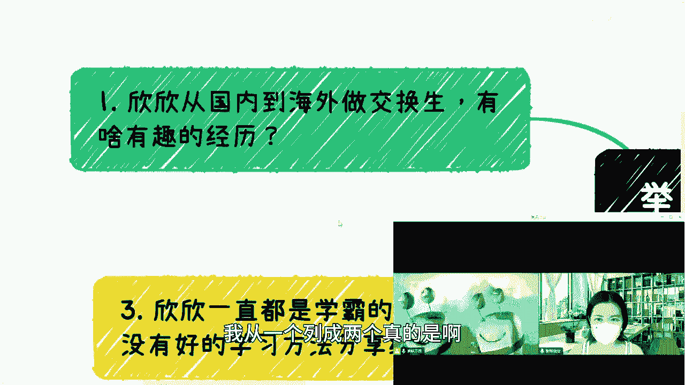

---

## 一、 留学初体验：从“知青下放”到文化适应 🌎

上一节我们介绍了课程概述，本节中我们来看看星星的留学初体验。

星星在初中时通过学校游学项目访问美国，对精英私立高中的氛围心生向往。高中时，她抓住机会成为交换生，独自前往美国中部一个偏远小镇。该镇人口仅3000人，她所在的年级只有十几名学生，初到时颇有“知青下放”之感。

她寄宿在一个白人家庭，该家庭还从杭州领养了两个女孩和一只狗。文化差异从生活细节开始显现。

以下是她在生活和文化适应方面遇到的具体情况：

*   **饮食习惯**：美国家庭没有固定用餐时间，饿了就吃。冰箱里的食物（如胡萝卜）甚至是与宠物共享的，这导致她在初期因饮食不习惯而体重下降。
*   **作息观念**：美国家庭作息随意，困了就睡，这与国内规律的生活节奏不同。
*   **教育体验**：她就读的公立高中学术要求相对宽松。在数学等课程上，她感到游刃有余，甚至能与高年级学生一起上微积分课，并成为同学们求助的对象。
*   **语言提升**：星星在国内就读外国语学校，英语底子较好。她认为提升口语的关键在于大胆交流，利用在美生活的一切机会与人免费聊天。

对于语言基础一般的学生，美国也提供语言学校作为过渡选择。

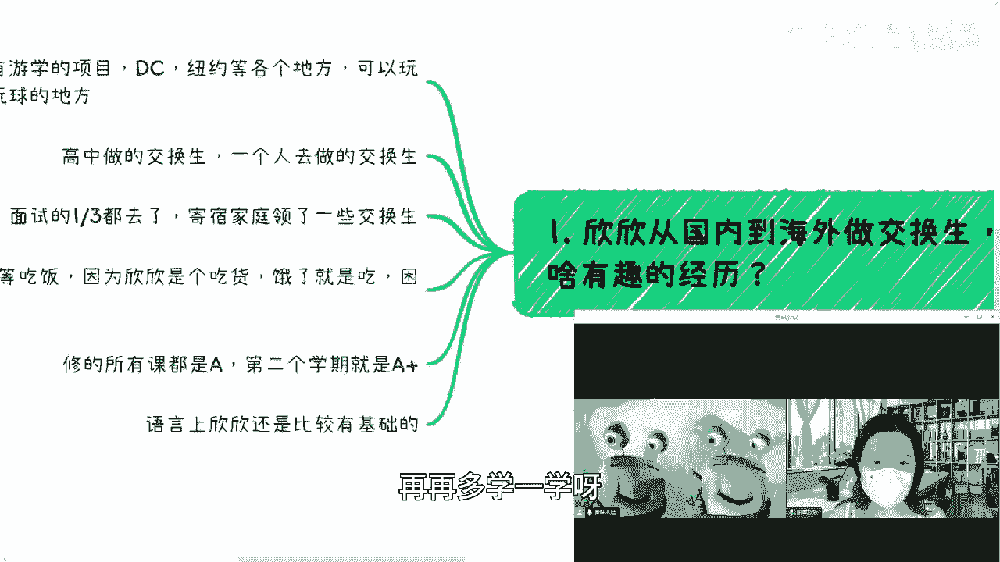

---

## 二、 成为KOL：从个人爱好到意外走红 ✨

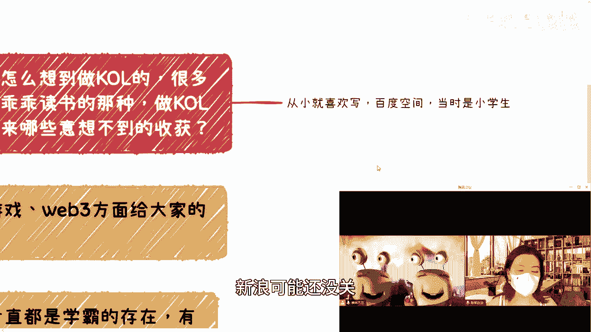

上一节我们了解了星星的留学经历，本节中我们来看看她如何利用网络成为知识分享者（KOL）。

星星从小就喜欢写作和分享，小学时便在百度空间写博客。2012年转战微博，分享在美生活。大学初期，她因在Google实习第一天因贪吃生鱼片而错过领取电脑的趣事发博，意外获得大量关注，随后被MCN机构发现并签约，从此开始有意识地创作内容。

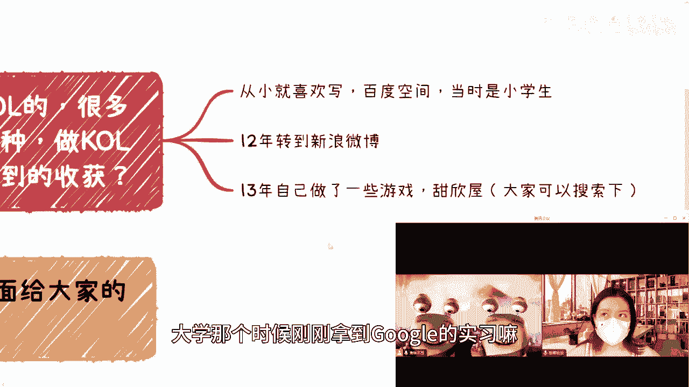

她认为自己的“人设”独特——一个不按常理出牌、热爱技术的女生。母亲从小为她报的兴趣班（如编程、航模）也多偏向传统认为的“男生领域”，塑造了她不同的思维和兴趣。

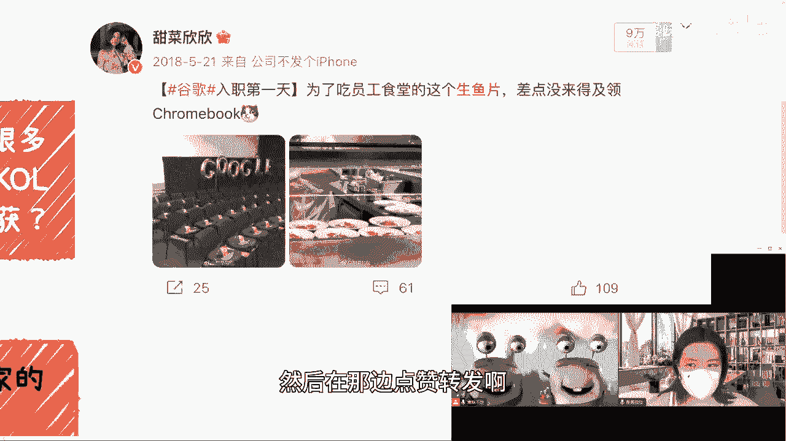

以下是关于从零开始做内容创作的两个核心问题与她的看法：

*   **如何开始并找到方向**：只要开始创作，就超过了99%的消费者。坚持更新是关键。过程中需根据反馈不断调整方向。成功的内容创作者往往善于利用自身独特优势，星星的优势在于技术相关的专业知识与生活结合的趣味表达。
*   **如何面对负面评论**：当影响力达到一定量级，难免会遇到不友好言论。她建议关注那些能够帮助他人的、占多数的正向反馈，对于无理的负面评论选择无视。如果涉及现实利益，则需要更严肃地对待。

---

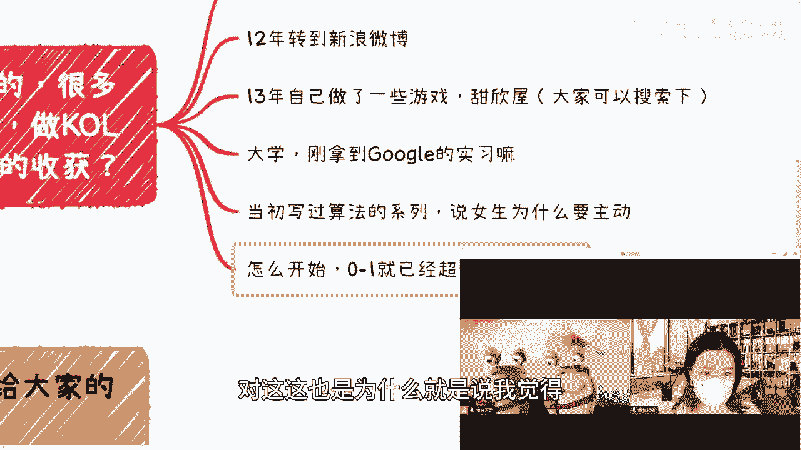

## 三、 学习方法与职业选择：弯道超车的思维 💡

上一节我们讨论了个人品牌建设，本节中我们来看看星星关于学习和职业规划的心得。

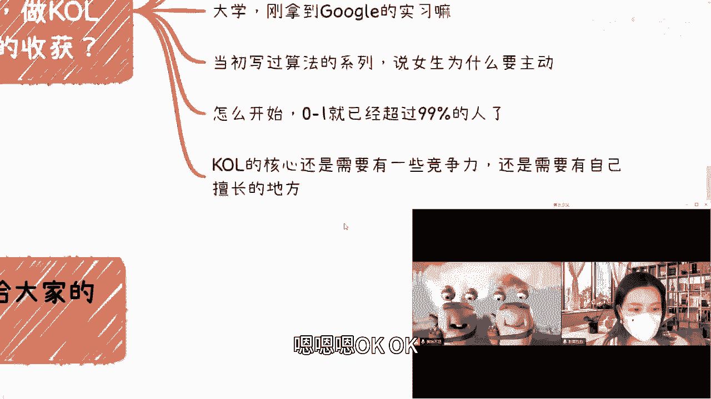

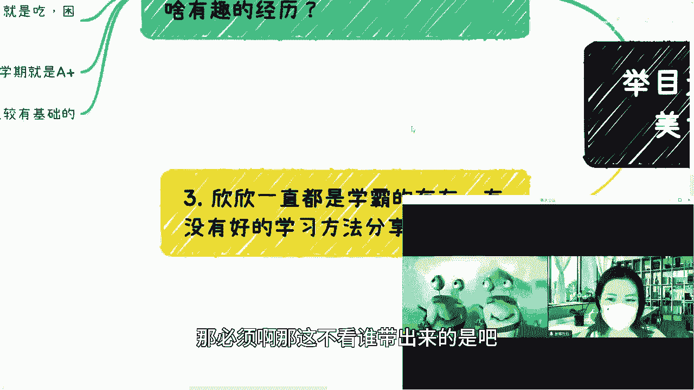

星星自称并非传统学霸，甚至被诊断有注意力缺陷（ADHD）。她认为，在无法像他人一样长时间专注时，“选择”比“硬扛”更重要。

她庆幸自己选择了计算机科学，原因有二：第一，这是一个在全球范围内都相对容易获得不错报酬的行业；第二，她本人对此有浓厚兴趣，兴趣能驱动专注和深入。

她分享了几个关键的“弯道超车”思路：

*   **把握机会**：美国大学允许转学，她积极尝试并成功了。她不是最厉害的，但更愿意尝试各种可能性。
*   **差异化竞争**：大学时，当多数同学专注于刷高GPA时，她将大量精力投入刷编程题和找工作，最终成功获得Google等公司的offer。她认为背景和能力很强的人很多，主动规划是关键。

---

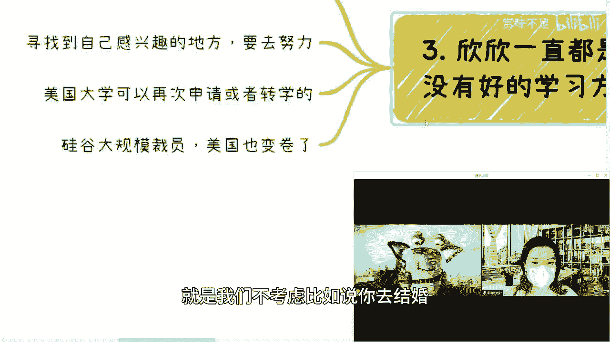

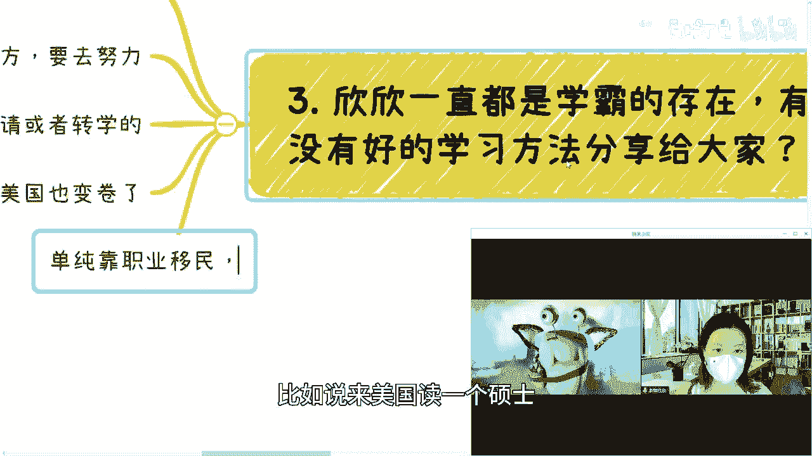

## 四、 行业现状洞察：中美科技职场对比 🔍

上一节我们探讨了个人成长策略，本节中我们从宏观角度看看当前的行业环境。

星星指出，美国科技行业在2022年底开始经历大规模裁员，就业市场急剧收紧。以往“无脑读计算机即可留美”的时代已经过去。目前硅谷职场也出现内卷现象。

对于考虑出国发展的人，她提醒需要关注两大现实挑战：

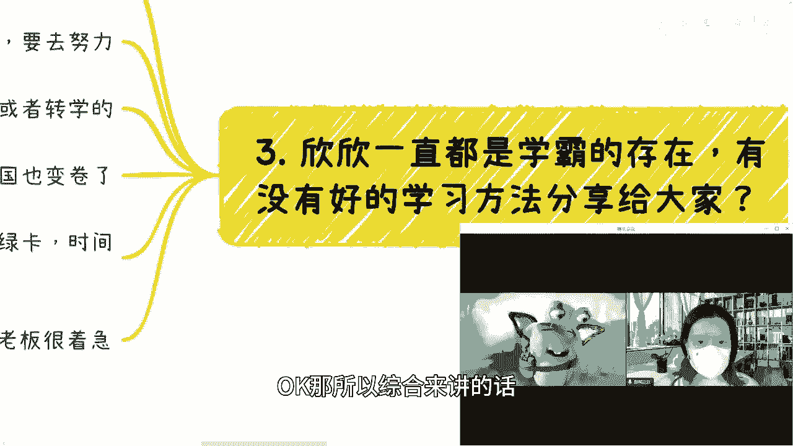

1.  **就业竞争激烈**：应届毕业生需要与被裁的、拥有多年经验的从业者竞争，求职难度大增。
2.  **移民路径漫长**：通过职业移民获取绿卡，目前排期乐观估计需6年，悲观可能达10年，且期间不能失业，堪称“地狱级难度”。

关于国内外职场对比：

*   **工作强度**：美国普遍不加班，但法律上实行“at-will”雇佣（雇主可无理由解雇），理论上也存在因公司状况导致的加班情况，但非普通现象。
*   **薪酬比较**：考虑汇率和储蓄投资，美国程序员薪酬仍具优势。但国内挖人时，若无法对标薪酬，则吸引力不足。

对于“卷不动”学历或感到迷茫的人，她建议可以拓宽视野，考虑加拿大、日本、欧洲等其他国家的机会，或者先通过旅游体验不同文化，再决定是否长期留在海外。

---

## 五、 未来风向：AI、游戏与Web3的冷思考 🤖

上一节我们分析了严峻的就业形势，本节中我们探讨几个可能的技术方向。

星星对当前火热的AI、游戏、Web3领域分享了她的观察：

*   **人工智能（AI）**：当前处于兴奋与泡沫并存的阶段。ChatGPT的成功在于产品体验好。她认为最终能沉淀下来、解决真实需求的应用才会留存，目前很多创业项目是“为投资人打造”的，缺乏真实场景。中美在创新竞争环境上有所不同，硅谷相对更尊重原创和规则。
*   **游戏行业**：独立开发门槛变高，行业存在同质化、流量驱动等问题。新的技术（如AI、区块链）正在为行业注入活力。她观察到，美国传统游戏开发者从最初的排斥到开始主动了解和探索这些新技术与游戏的结合。
*   **远程工作**：疫情后，硅谷大公司倾向于让员工返回办公室。通过平台接单的远程工作一直存在，但收入通常无法与正式雇佣相比。她建议，在主业之外，可以尝试开发自己的产品，而非再次出售时间。

---

## 六、 总结与寄语 🌟

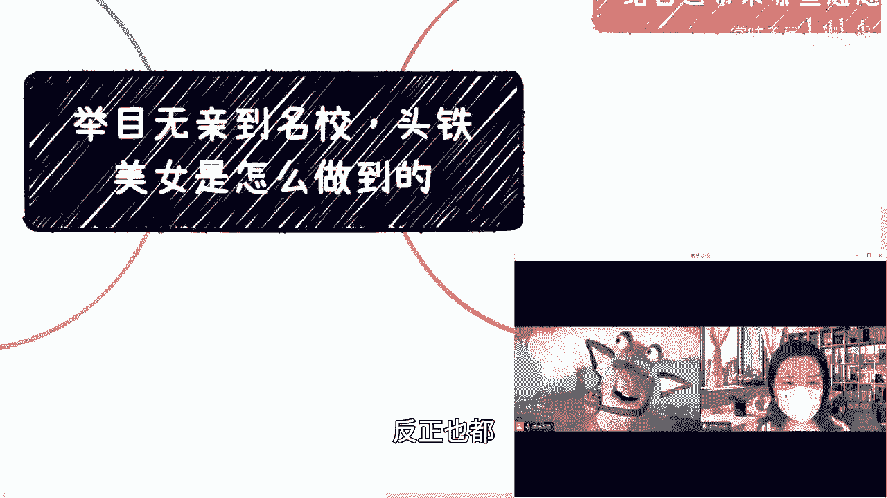

本节课中，我们一起学习了甜菜星星从交换生到硅谷工程师的成长路径。她的经历揭示了几个关键点：**主动适应环境**、**利用网络放大个人特长**、**在学习和职业上选择比硬拼更重要**，以及对行业趋势保持**清醒的观察**。

当前，无论是国内还是海外，科技行业都面临着新的挑战。对于有志于此的年轻人，她的故事提醒我们，在夯实技能的同时，更需要开阔视野、灵活应变，并找到真正热爱的方向。

最后，星星也表达了对国内观众的想念，并希望未来能在做出一些成绩后回国发展。她的经历说明，成长的道路充满意外与选择，而真诚的分享与持续的探索，是应对变化的最好方式。

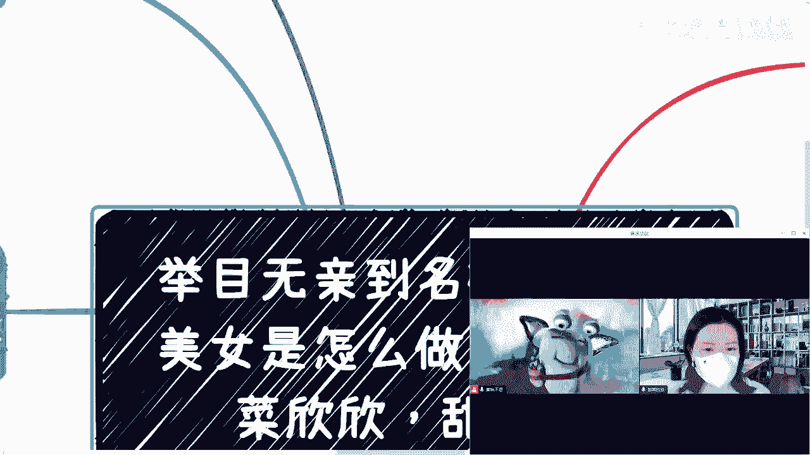

---
**（注：教程根据提供的对话内容整理，保留了核心经历与观点，并按照要求进行了结构化编排和语气调整。）**