# 头铁美女甜菜欣欣：15岁独自润美国，从举目无亲到名校毕业 - P1 - 赏味不足 - BV1sh4y1L7nT

好好好，这个感谢大家来到新的一期啊，就是今天我们是邀请了啊，这个远在美国硅谷的小姐姐，大家就右下角可以看到啊，我把这个放大一点，放大一点，满足大家的这个需求啊需求，然后为什么我今天不是小熊猫。

是因为小姐姐不让我弄小熊猫是吧，就变成了这么这个这个怎么说呢，就就衬托出我们小姐姐很美丽的。

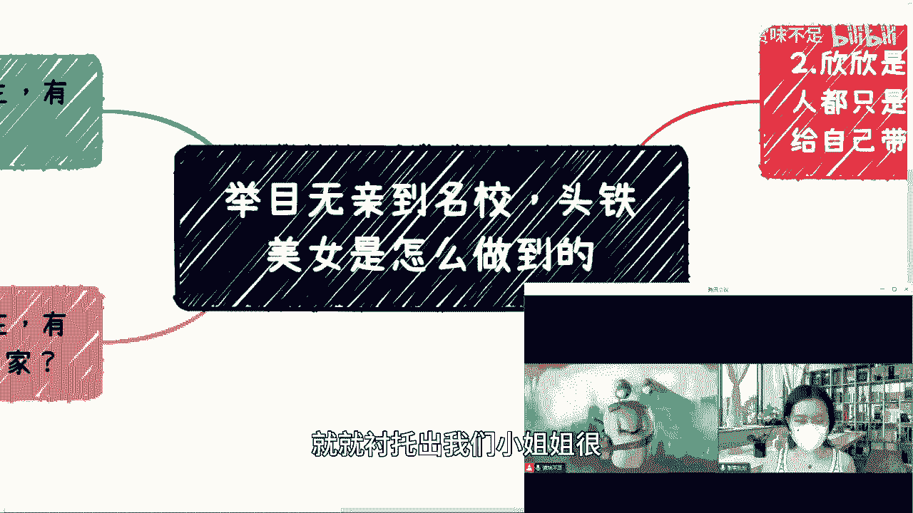

这么一个形象啊，是吧嗯那我就很可爱了对。

然后呃，Ok，然后这个我们就之前跟星星这边。

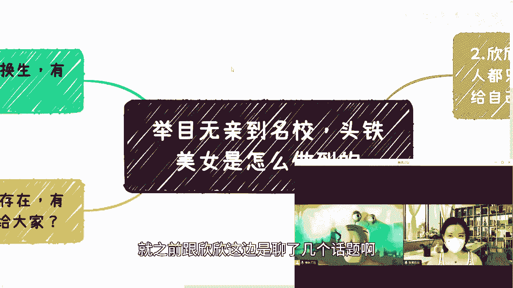

是聊了几个话题啊，就是大家可以到诶，是不是星星，就是大家可以到这个微博上，到小红书上可以看一下，就是星星以前的这个经历啊，各个方面啊，就我们就不在这里就多去说了啊。

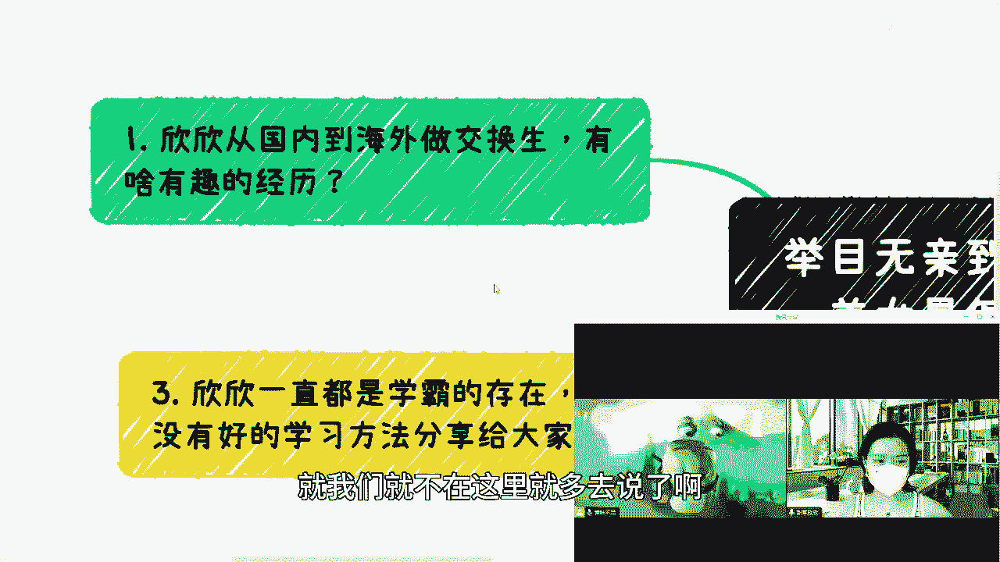

然后今天的话主要是从这么几个点会呃。

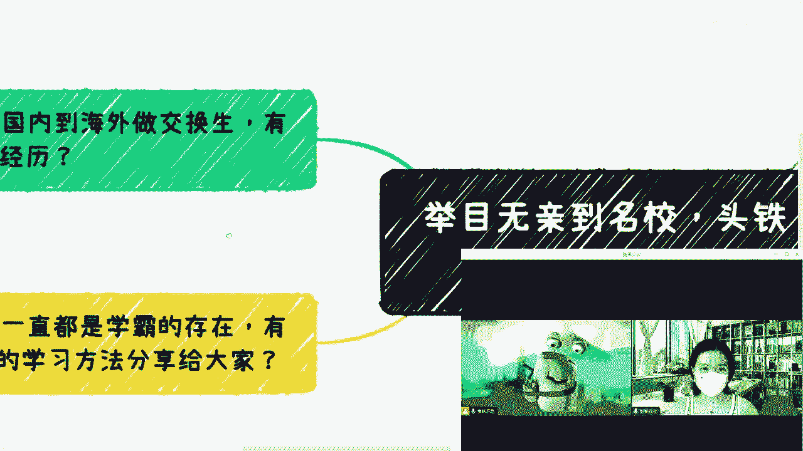

就是星星会给大家来做这么一个分享啊，呃那我们就一个个来说啊，就是哎这个星星星给大家有什么，就是打个招呼啊，或者要要要介绍一下的吗，啊行啊行啊对，就大家好，我是星星，然后你们可能会在呃微博。

小红书或者知乎上面见过，我就是我的id叫甜甜星星，然后我自己的话我是十几岁的时候来美国啊，然后在啊也是在美国就是在各大读的本科啊，然后毕业以后就是在google工作了几年啊。

那我从小到大的话可能就是比较皮，比较爱玩吧，然后嗯我很小时候就对编程感兴趣啊，所以我在高中的时候就写了我的两个小游戏对，然后把它放在自己的个人网站上，叫甜心屋嗯对，然后之后大学里的时候就是玩微博嘛。

然后就当时可能比较迷糊，就是嗯就是写一些段子呀，然后就是这个在呃科技行业啊，然后包括在美国一些日常，然后就火了，然后也是那段时间就是认识我们的赏总对，然后毕业以后的话就继续搞技术。

然后也非常神奇的跟商总在好多方面都有，就是行业的这个角度有一些交集，就是包括呃web three，然后包括游戏等等等，对就啊。

就之后再再展开吧，嗯就先这样对对对对对，就反正我们星星非常的优秀啊，优秀到我已经裂开了，你看到没有，对不对哦，我从一个裂成两个。

真的是啊，怎么就变成两个了，对啊就就没事，待会可以变成三个啊，就是啊我们就一个来说啊，第一个是啊，因为星星以前年轻的时候对吧，你现在也很年轻啊，小时候啊小时候从国内到海外就做过交换生啊。

然后在这个当中可以跟大家分享分享，有什么有趣的经历啊对吧，这个所见所闻啊等等等，嗯好啊好啊。

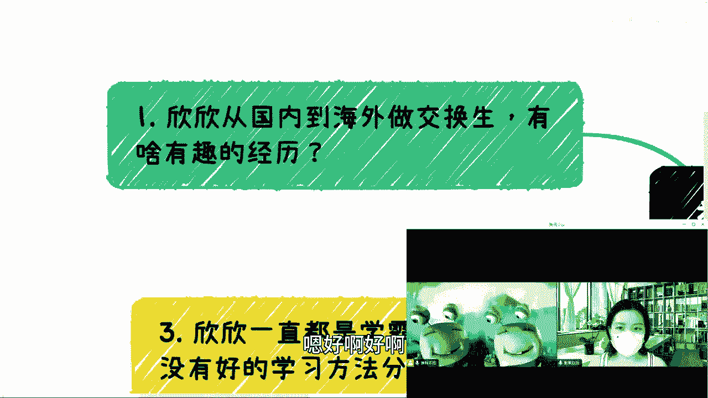

就是我当初为什么想要做交换生，或者说来美国呢，嗯因为我初中的时候，我们学校里面有一个游学的项目，大概就是去波士顿这种私立的高中去转了一圈，嗯去体验了一下这个美国的呃校园的氛围。

然后包括当时打卡就打了什么DC啊，纽约啊，加州的各种地方什么的，然后在那个波士顿的呃中学呢，嗯就他们那种美国的精英私立就真的还挺好的，就是宿舍也非常豪华，校园也非常非常大。

有那种就是特别绿油油的那个这个可以玩飞盘，然后可以玩球的地方，就是反正就有点像你们在美剧里看到的那种，就是很fancy的这种高中生，然后我就心生向往嘛，就觉得哇塞好洋气，好酷啊。

嗯所以所以高中的时候有这样一个机会，我就去了啊，然后我去的话呢是一个人，就是去了一个嗯middle of nowhere，就是美国它最中间的那一块就中部，然后嗯比较村的一个地方吧，然后下了那个飞机。

就是我们还要再换一架更小的飞机，然后又要这个呃开半个多小时的车，然后才到我们那个村，就我们那个村是真的村，就不是像有些留学生说的那种，就是昵称叫村，就是因为一般留学去的那些城市，一般都有几10万人口吧。

就比如说后来我去的，比如说三路易斯三种地方，但是我们那个村是真的，就是他整个人口就只有3000，就什么概念呢，就是你适龄儿童，你从幼儿园到12年级，他一共只有300个人。

然后我的那一集就是我过去是读11年级，就相当于是国内的呃，高二吧，就那一个年级就才十几个人吧，就是我过去的时候都惊呆了，就是有一种知青被下放的感觉，知道吧对哦，不过既来之则安之吧。

我当时就是住在我们就一对白人夫妇，就这个寄宿家庭家里面对，然后嗯，我觉得我觉得看你们想听什么样的方面吧，就是我倒是有挺多故事都可以讲，我觉得海外去的话，我觉得现在是这样子吧。

就大部分人可能去的时候几个方面吧，一个就是说啊唉我觉得就可能几方面，一个就是说生活上面对吧，你比如说这个因为技术是比较多的嘛，其实那是不是跟这个这个当地的人，当就当中有没有什么需要注意的。

或者说有什么可能有些一开始有些担心害怕啊，或者等等等嘛，然后还有的话我觉得可能就是打工对吧，就是赚钱对吧，那那可能这方面到外面啊，但是你当时去交换生，其实也就是一段时间嘛，回头就回来了嘛。

呃我大学里有打工吧，就是这个也可以聊对呃，高中的话，对我们那种，就是其实交换生的门槛会比较低一点，就是嗯嗯，我记得我们那一届就是interview的13，到一半左右可能都去了。

然后我们那一届比较有名的就是那个徐娇，就是演长江7号的那个小男孩的那个女生，对对对，但是我们去的完全就是不同的州，不同的学校，就看这个寄宿家庭是在哪，那我的那个寄宿家庭，他们是从杭州有领养两个小女孩啊。

然后看到我也是杭州的，就把我一起领回去了，然后他们还领了一只狗，就是真的是两个人，就是那对夫妇就把全家大大小小都领回来了啊，然后我刚回去就是哦我刚过去的时候，他们还跟那个小狗狗讲。

意思是说嗯不要冲星星汪汪汪的叫，就是这样不太好，然后就会冲你汪汪叫来着，就是就是他们真的就是会把狗当做家人一样嘛，就是就是我那个住家爸爸，就是跟那只小狗长谈了一晚上，你知道吧，就是叫叫他不要冲着星星教。

就是教育他就教导他，然后后来果然就是那只小狗狗就没有再叫我，而且就我后来跟那只狗狗也处的挺好的对，然后就是我觉得吧就是嗯我因为高中就来美国，所以像文化各方面就是融入的还是比较快的，就是包括语言方面。

然后也包括就是一些思维方式对，就是我觉得美国一个就是自由散漫嘛，就是比如说我刚刚在寄宿家庭的时候，就是我就我就一直等着他们开饭对吧，作为一个吃货对啊，然后就一直等他们，就是好像也没有吃晚饭。

也没有吃晚饭，好像不行了，我快饿死了，快饿死了，然后后来我终于忍不住了，我就去问住家妹妹，我说话说我们平时都几点钟吃饭了，然后她说饿了就吃呀，冰箱里有东西哦，然后我真的是看。

然后就去冰箱里面拿了点什么什么胡萝卜，那个胡萝卜其实是给他们家里的宠物猪吃的，就是全家都不吃蔬菜，只有我吃蔬菜，所以我就跟那个宠物猪一起吃那个胡萝卜，然后然后然后还吃什么啊。

对就那个胡萝卜真的就是我和猪在吃哦，就是那种其实有点像小仓鼠啊，他们叫给你PX呀呀呀，然后呢他们这个还吃啥吃那个意大利面，就是或者有时候就是麦当劳的那个外卖，点一个呃，就是呃不是外卖。

就是这个pick up去取一个之类的，然后我就我就特别想想想吃中餐，然后我就过去两个星期吧，我就瘦了十斤左右，就真的是吃不好，哦对，当然我觉得大部分人就是应该不会遇到，我这样的问题。

就是我们主要还是因为那地方太村了，就一般正常你去的你留学，你去工作的地方一般都是有中餐厅的嗯对，然后文化上的话就一个就是啊他饿了就吃，还有就是困了她就睡，所以就是我我当时就真的就是。

我整一个作息就不太就是非常的random，非常非常的随意对，而且就是大家好像印象里面哇，美国教育是不是很高端，其实不是的，就是我要我要这个去掉，打碎一下这个滤镜啊，就是嗯我觉得吧，当然有可能。

因为我在中国的这个学校，还是比较就是比较厉害一点，所以像他们美国的这种公立的校学校，我就是真的是随便虐，就是我当时嗯修的所有课都是A，而且我后来第二个学期就是混成老油条了，我就把所有课都刷到了A家。

然后数学课的时候，就是就是美国人数学真的好差好差，然后我就是一个高21年级的小朋友，然后就跟一帮这个高三的，最厉害的那些学长学姐，就坐在一块儿上那个微积分课嘛，然后呢就他们同学都喜欢坐在我旁边。

因为我们上课的时候，老师其实讲的并不多，就他也会说你这节课就给大家做习题之类的，我们就坐在那边做习题，然后呢做习题也是可以讨论的，所以我就左边一个帅哥，右边一个帅哥，然后两边都在往中间看。

不知道题怎么写，所以这个这个以后对你，我跟你讲对吧，这个什么啊，这个饿了就吃，困了就睡对吧，然后这个上课旁边都是帅哥，就未来就以后都会变成大家出国的动力，我已经看出来了。

我还以为你想说的会变成我的黑历史，对哦当然我觉得就是教学质量的话，可能还是比不上中国，可能稍微比较好的一些地方吧，就是像他们物理啊，然后像化学就是完全不行完全不行，就就我真的在那边就是横着走对。

横着走对，就像我现在左边这两个东西横着走啊，对对对对对，就真的如果说不是那种私立的，就是大部分中国小朋友会去的这种学校的话，就是在公立校大概就是这样子，这也是为什么就是在美国。

其实大部分人都会想办法去呃，读私立的学校，或者说像比如说纽约和加州，就有些地方他可能学区房就是学区会特别好，大家就会抢着去买房，这个跟中国其实也有点异曲同工之妙，OKOKOK哎我我顺便问一句。

就是就是你当时过去，或者你本来就是就是英文，应该底子就语言上底子应该比较好嘛对吧，对这个其实是个很好的问题，就是我自己的话可能没有那么具有代表性，因为我读的是一所外国语学校嘛。

就是我们当时是每天都有至少一节英语课，而且老师特别注重口语的嗯，然后以及呢我在去之前，当时在准备托福，我托福又是狂背单词，然后狂练习什么的对嗯但是我觉得也没有关系，就是如果说大部分人在国内没有这么好的。

一个叫英语教学的资源的话，就是你过去了，你就你就撒开了，跟人家聊呗，因为在国内就是什么英语，这个陪陪聊是要交钱的，然后在这边跟别人聊天是不用钱的，而且你就是比如说去超市排队啦或者干嘛了。

你就是可以跟旁边的人爱，就这样顺顺便就聊起来了，然后反正这个白聊不要钱，就使劲跟人家聊对吧，我觉得可能是因为我是个话唠，所以我英语就是口语，我来美国以后提升挺快的，嗯嗯嗯对。

OKOKOK那这个当中是不会还他如果不太行的话，是不是还有什么语言学校，什么东西啊，啊也是也是有的也是有呀，就语言这种东西怎么说呢，越小其实学得越快吧，我自己是没有那种非常强的struggle。

就是哎呀这个节目会之类的哦，当然也有一些可能比较晚，比如说工作才来美国的，那可能确实对他会可能要自己看YOUTUBE啊，什么再再多学一学呀。

OKOK行，那我们把这个把这个就过了啊。

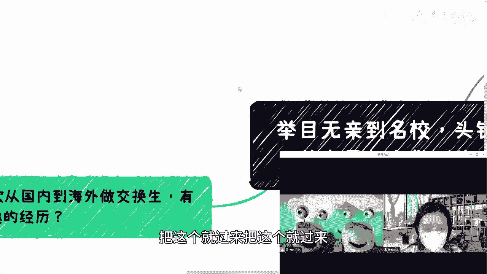

这就过了嗯，好呀好呀，然后对，然后刚刚星星一开始也介绍了啊。

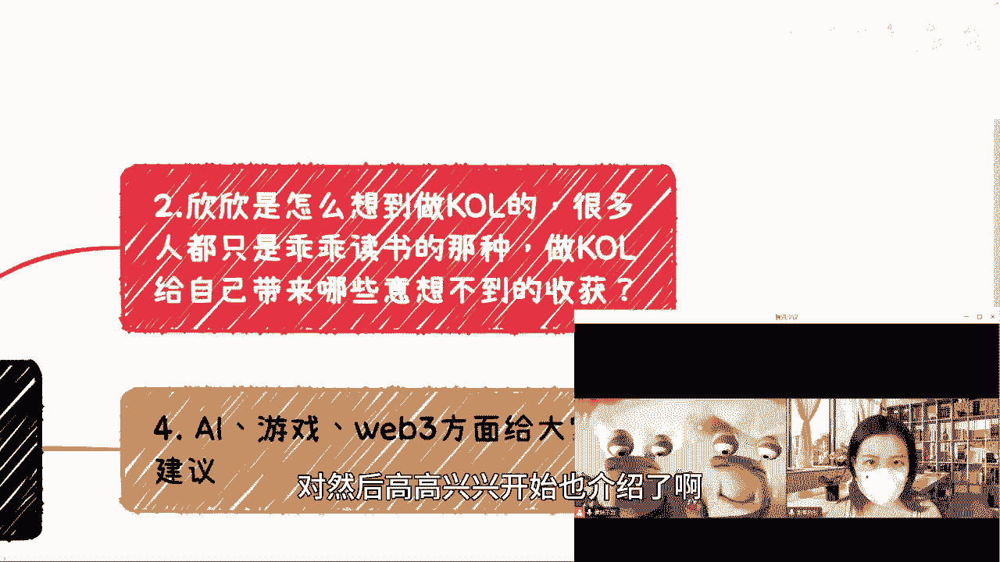

就是说啊就大家肯定都不肯，不仅仅啊再比如说微博啊，小红书啊，就BCDFG啊，这上面能找到这个这个甜菜星星这个id是吧，但是有更多地方肯定都能找到，那呃星星在之前的话也不在之前吧。

就是可能小时候啊就是比较有，因为我知道我了解，就是人小时候就很有表演欲嘛对吧，好像是这么回事嗯对然后对，然后怎么想到去后来做一个KOL，或者说呃很多人很多人其实一直往上走，因为我最近咨询的人也比较多嘛。

就是他们都是那种就是说哎我就好好读书，然后到高中，然后就填个志愿，然后好好读本科，然后好好读硕士，然后他其实就是呃可能说的不好听点，就是在我看来，可能很多人还是那种就比较死读书的嘛，然后等等等。

但是就是说在嗯一方面是星星之前，怎么会想到去做KOL的，然后这是第一个，第二个就是说啊做KOL之后，就是这个前后会给自己带来哪些，意想不到的收获，嗯好啊好啊，就是我从小就挺喜欢写的。

就是我嗯小学的时候就开设了第一个博客，是在百度，对，那时候百度空间就是非常远古的一些互联网的，果然是有点有点年纪了，哈哈哈哈对，就是当时就是一个小学生，而且当时嗯我觉得网络也才刚刚。

就是在中国普及的多一些吧，就这很多人也不知道我是个小学生，我就那边写童话对吧，写着自己骑着乌龟去上学，然后还真的会有人给我评论，你知道吧，就是所以我可能就反复的，比如说我写一个东西。

然后就会知道我收到什么样的评论，就是他是一个正向反馈的过程，然后我也知道说写什么东西，可能大家会感兴趣啊，包括些什么东西，可能会翻车等等等哦，那再往后的话呢，嗯百度空间它关了啊，哦当时对对。

就是当时关掉了一批吧，就呃包括新浪，新浪可能还没关。

但网易啊什么的对，就慢慢就关掉了，然后我就转到了微博。

那个时候差不多是12年对，然后12年的微博氛围还是挺不一样的，就上网冲浪呗，然后到处看呗，啊看着看着那时候刚刚到美国，然后自己也会发一些嗯。

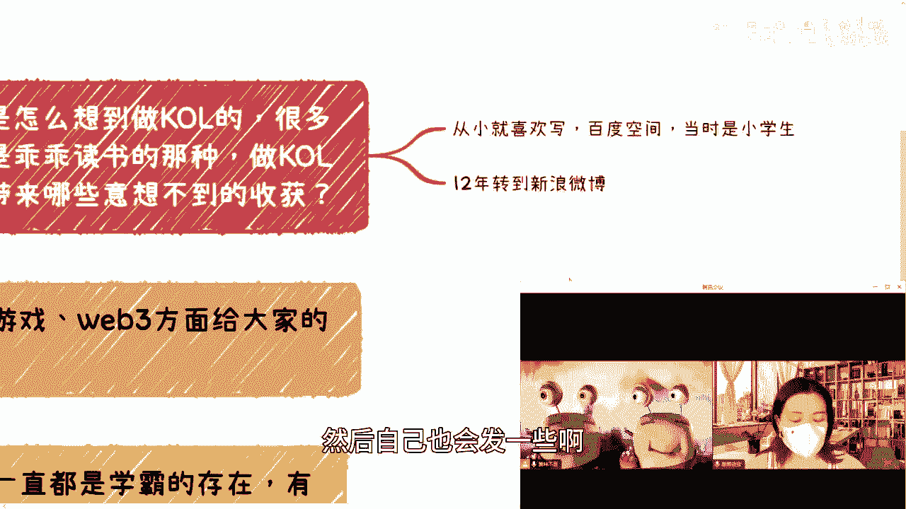

然后还有原先就是呃嗯，一起跟过来的一些朋友吧，然后然后然后在之后那一年就13年的时候，我我是因为做了一些小游戏嘛，然后想给大家玩，所以我就自己创立了一个网站，然后就把游戏放在上面给大家玩啊。

就是甜心屋的话，确实是很多人都很能认识我的一个一个路径对，然后我觉得我自己的话，可能人设确实比较独特吧，就是我自己也觉得我比较头上长角，就是嗯放到学校里就真的是不是很听话的那种，就是比较皮对啊。

但当然我我觉得就是跟我们家就是教育，各种也有关系，就我妈其实她比如说给我去报兴趣班啊什么，她没有特别把我当女孩子，她给我报什么航模啊，篮球啊，呃还报什么围棋啦，就是都是可能包包括编程。

就是都是可能男生学的比较多的，就可能比如说编程班嗯，只有四个女生，然后20多个都是男生的这种这种兴趣点对啊，然后篮球这个是真的不太会玩，因为因为容易被球砸到，但其他的我还是挺喜欢的，对对对嗯对。

然后再扯啊对啊，就是这个这个这个有我我我，我还是怀疑是不是你的这个这个叫什么，就是呃物物物体识别算法可能没做好啊，对对对，其实我是个AI，对对对，然后然后就时间就快进到可能大学吧。

大学那个时候刚刚拿到google的实习嘛。

嗯然后就发生了一件很很无厘头的事情，就很新鲜的一件事情，就是我实习的第一天，我是想要去呃传说中的那个google的免费食堂，我要去领生鱼片的，我超级喜欢吃生鱼片，然后呢那个生鱼片的队伍特别长。

然后我就一直拍拍拍拍拍嗯，最后就排到了，而且还确实挺好吃的，但是等我就是排完再回去的时候，我们那时候实习生每个人要领电脑嘛，然后因为我晚了，所以就没有领到电脑，就光顾着吃了，然后就很懵对。

然后我就当时把这件事情发到了微博上面，然后就就3号就有很多人就在那边，然后在那边点赞转发嗯。

然后也是那个时候就是有MCN找到我嘛，就是说嗯我们在做这个，就是想要去签约一些科技的博主，然后问我感不感兴趣，嗯所以就在那个之后的话，我就每天对吧，这个这个白天学习工作，然后晚上回到家就在那边使劲想啊。

我今天要更新什么，然后也慢慢的对，在微博上面就积累了一些这个follower嘛，嗯然后呃给自己带来了什么样意想不到的收获，我觉得还挺多的哦，比如说当时我有写一个算法的系列嘛。

就是呃讲比如说啊为什么女生要主动，就是说我们有一种就是呃叫做stable matching的，这个算法，就是说女生主动，然后就会得到这个最好的结果，大概是这样的一个一个呃idea这个中心思想对嗯。

然后当时写了那篇以后，就有主编找到我说，你敢不敢兴趣出一本书，就是会有很多机会主动来找我，然后包括就当时一站到底呀，然后一些就是节目对都有找过我，而且就是你出去就是就either fun fact。

就是你跟别人讲说你有这样一个有趣的经历，别人就会觉得嗯你很特别，他就会记住你，然后我就可以在这个之上，可能就是认识更多的朋友啊，然后可以得到呃更多的一些这个这个小惊喜。

嗯嗯嗯嗯嗯嗯OKOK那那kl这个作当中，我觉得就聊下来，反正蛮多人怎么说呢，我觉得他们可能大部分人吧有两点可能诶，我想想啊，可能有三点就是就是第一个是什么呢，就是说他总觉得就是就是这个内容上面。

就他不知道讲些什么东西，就是嗯对就说就说就说可能是比如说升华啊，或者说是一些专业性啊，或者怎么样子嘛，那我觉得从就说星星觉得从比如说kl这边，这个他们从0~1嘛，我觉得基本上第一步迈出去可能比较难嘛。

然后我觉得这可能是这个大，就几乎可以说大部分人所面临的一个问题，然后还有一点呢就是说，就是就是可能我觉得大部分人还是会比较在，因为kl这个也不是KOL吧，就是做在网络上有很多的一些自我的产出。

或者来说这种观点之后，媒体对就是这种产出之后，其实你也知道嘛，就反正就是总有人赞同你，总有人反对你嘛对吧，那么在这个事情里面，就是比如说星星觉得对于那些啊，这个不友好的言论啊对吧，负面的严重啊。

就可能怎么个看法，我觉得这两个吧嗯好啊好啊，都是非常棒的问题。

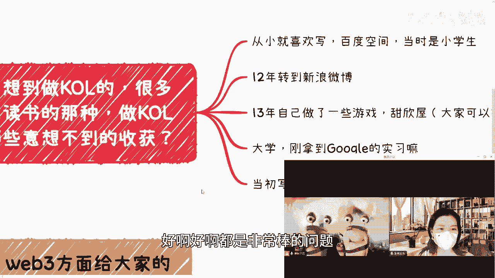

对呃就是首先第一个就是说怎么开始，然后怎么样可能找到自己的方向哦，其实网上大部分的人都是消费内容，不生产内容的，所以只要你开始生产内容，你开始写，你开始拍摄，你就已经超过99%的人了，这是真的啊。

然后特别是如果说你每天都更新，或者哪怕你一个星期更新一次，那那就更厉害了，因为这件事情真的非常难坚持啊，然后当你开始了以后的话，嗯你就会收到feedback吧，就是他哪怕你没有互动，没有点赞。

这也是属于一种feedback，那你可能就要就再再重新调整一下方向等等等，呃它是一个不停迭代的过程，那当然我觉得就是如果说呃，从一个上帝视角去看的话，大部分火的人其实他也是利用了自己的优势。

就是比如说像我的话，可能就是专业知识这一块哦，然后包括很哦，不不不，这个这个我还是得承认，就是说我一开始也尝试着剖过，就是那种写真啊，就就不是那种写真，就是比如说自己今天在纽约街头，然后咔嚓拍一张照片。

这种就是就是没法活，但是我一聊技术，哪怕是段子，哪怕是鸡汤，或者说正儿八经的一些干货，就是就会火，对这这这个是我我还是实话实说对，这也是为什么就是说我觉得现在来看。

这是一个非常清晰的道路，但当时并不是，我当时其实还是尝试了一些不同的内容的，包括就是海外生活啊什么的，对对对，就是我觉得可以去思考一下自己的擅长的，或者说不一样的地方是什么，对嗯然后关于第二个问题的话。

我觉得也有一些发言权吧，因为呃当你输出，然后可能到一个量级的时候呢，就人是很难收到百分之百的好评的，那哪怕他只是1%的这个不好的评价，你放到一个数量级里面，其实还是相当有一部分的哦。

那其实我一开始我也会特别的焦虑，就是遇到一些不友好，然后甚至非常负面的评论嗯，就是包括什么，比如说有些人会觉得说啊，因为我是个女生，然后搞技术，所以会受到这么多关注，或者有些人也会说啊。

这个信息是不是很水啊，他整天都在网上写东西，他是不是没有有时间去写代码等等等，就是有些想起来真的是非常无厘头啊，就是我还遇到什么，就有人说啊，这个星星是不是P图P的，他妈妈都不认识啊，我说对啊。

就是不认识啊，对就是一开始我也会很郁闷，嗯当然我觉得就是时间长了也就习惯了，而且我会觉得这些嗯其实对我来讲影响并不大，因为我知道我在做正确的事情就可以了，我能够收到比如说99%的好评。

我知道说这些东西能够帮助到一些人，我觉对我来讲就可以了，呃那呃至于剩下的那些的话，我会无视呃，当然就是我也遇到过一些，就是可能在现实生活中说我坏话的人，那就是我觉得现实生活中的话。

可能就是情况会更复杂一点，比如说我是不是触及到别人的利益了，那这种我觉得会影响到我，我可能会更加就是呃严肃的去去看去对付，对嗯嗯OKOKOK但不管怎么样。

我反正就看到的这个，大家对星星的反馈都是很正向的对吧，然后整个群里面，群里面大家都嗯非常的就喜欢拍一拍吧，拍一拍之后就是告诉你别吃了对吧。

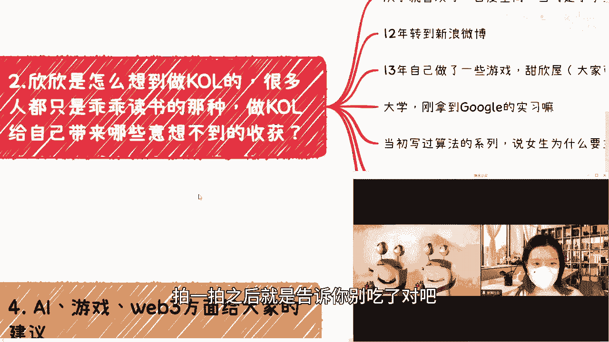

再吃就要胖的不行了啊，对对对对对，就是我觉得我的粉丝也挺皮的，那必须啊。

那这不看谁带出来的是吧，哦哦哦哦哦然后OK那我们继续往下啊，就是啊，OK我们从刚刚呃就是我我不管大家是到啊，网上已经看过了星星之前经历，还是说之前就是刚刚新兴的一些描述的情况啊。

那么我们都知道就是说啊星星的读书对吧，学校啊，然后呃包括父母其实对啊，他的一些这个教育啊，引导啊等各个方向，我觉得都还是非常好的，但是这个事情呢就我们说啊，就是整对于整个基本面来讲。

其实很多事情我们可遇不可求嘛，所以说呢我觉得就是星星在这个地方，我觉得有一个是可能大家很想知道的，就是说嗯就我这边列的虽然是教学习方法嘛，但是我是觉得嗯我们这么说，就是如果啊从呃上帝视角来讲。

假设就是你一路上面没有啊，这么这么多好的机遇，或者说可能你父母没有这么开明对吧等等等，那如果来说是一个相对比较普通的一个走，一路走过来的话，就是从你现在回过头去看呃，你觉得有哪些比如说好的方式方法啊。

或者思维思想啊，或者说就就各种各样的东西啊，就就可以分享给大家，让大家借借鉴一下，好啊好啊，就是首先我，我其实自认为我并不是特别学霸的那种吧，因为啊就是可能有些朋友看了我的内容。

就就会看到那篇就是我被确诊说有ADHD嘛，它其实是一种注意力缺陷对，然后呃当然就是一般来说有这个ADHD的哦，小朋友吧，就是一般来讲学习可能会稍微吃力一点对，那对我来讲的话。

也可能是因为就是嗯我比较幸运，就是包括在国外可能容错率会稍微高一点对哦，那我知道说我可能不能非常集中注意力，去钻研一件事情，或者说我可能会在数学，或者在各种地方，犯特别粗心的毛病等等等的时候，呃。

我就是会呃不仅仅去努力，我也会去想，就是我要怎么去选择，嗯那我觉得我一个比较大的非常庆幸的选择，就是我选择了计算机，就是有两有有两个原因吧，就一个原因就是说呃，计算机它确实不管在美国还是中国还是那种啊。

就是可能你有一些技术，你就能还混的不错的啊这么一个行业，嗯这是第一点，第二点就是说我恰巧比较感兴趣，然后我觉得特别是像我这样的人来说，就是如果你特别感兴趣的话，就是会非常的专注。

然后会非常就是想要把这件事情做好，嗯所以呃我觉得嗯，这个做什么是非常重要的一件事情，哦对哦，然后可能还有一些比较小的这种转折点吧，就是啊因为我自己的还是比较喜欢折腾嘛啊，就比如说啊。

就是我们美国大学是可以再次申请，或者是可以转学的，那很多人他不想或者说他不知道可以转学，那他可能就就是比我更厉害，但是他对吧，他他都没有这么做，就是我很清楚我不是那个最厉害的。

但是可能就是我什么都会尝试一点啊，然后就就刚好比如说就试出来了，这么一两件事情，嗯对对这个是我的一个想法啊，就包括在大学吧，我觉得还是嗯就类似的这种弯道超车的思路。

就是比如说当很多呃我的同学再去刷GPA，然后为了就是想要拿A去选一些，比较简单的课的时候，我当时就拼命的在刷题，在拼命的找工作，嗯然后最后面进的google，但说实话就是其实挺多人背景。

然后包括能力都是很强的，嗯OKOK，那那这个就是回到就是，可能很多人都都比较关心的问题了，就是就这个这个反正你看吧，就是这个也听听就各方的这个说法嘛，就是说嗯现在国内几乎啊我们说你你比如说像。

尤其是这两天不是那个张雪峰，事情比较比较比较吧，比较火是吧，所以说其实整个的这个事情呢，其实大众啊我们看下来基本上就是关心两个点，第一个点呢就是说这个出国不出国对吧，就说出还是不出。

然后呢这个出了之后怎么个情况，然后当然了，就是说这个我其实也跟他们说嘛，就我说啊可能硅谷现在情况怎么样啊对吧，这个这个情况也不是说特别好，我觉得呃我觉得就是这个星星从宏观角度吗，因为你人在那边嘛。

就宏观角度你可以跟大家说说说，简单说一下吧，就是说你在那边感觉，比如说就就就拿cs来讲吧，比如说你有工作卷不卷啊对吧，然后整个环境卷不卷啊，我觉得这个是一方面，另外一方面就是我们刚刚说的。

你你刚刚说的那个叫什么，就是就是啊学历上，就是很多人他其实就是卷不动的，他说我我往上卷，就是我我可能这个卷不到一个很好的学校，比如说双飞啊对吧，或者怎么样子，但我卷不到，那如果从心理角度来讲。

你觉得就是假设啊我也卷不动了啊，我也卷不上去，那就是呃别的有没有一些更好的一些啊路啊，或者更好的一些想法，这样子嗯好啊好啊，那那先回答第一个问题吧，就第一个问题呃，你如果在今年之前和在今年问我。

这个答案可能是完全不一样的，就是今年之前啊，我就先说一下发生了什么吧，就是说我们是硅谷区，去年年底开始裁员，大规模裁员哦，才到1月份，就光是今年1月份就裁了15万人。

就就其实美国的科技行业他一共也就这么点人，然后他一下子弹了这么多，就是当时真的是哀嚎一片，然后直到才到现在吧，就是过去这个月可能也有好几万人失业啊，就是整一个感觉就是嗯美国也变卷了。

而且就是因为现在经济下行嘛，就是像往年可能比如说一些大厂，你可以很舒服的就是朝九晚五，然后甚至像某些这个令人发指的公司对吧，就是你每天只要上223个小时的班，都是存在的，但是现在的话就是各家都在卷。

然后特别多的人失业，这是一方面，就是这个是对于所有人来讲的啊，然后第二件事情呢，就是呃现在这个美国的移民牌，其实是非常非常久的，就是我们不考虑。

比如说你去结婚或者你去搞那个啥啥啥啊，就是光是你靠靠靠靠职业移民对吧，嗯呃就是呃职业移民的话，现在你如果是正常，比如说来美国读一个硕士。

然后你呃找到一份工作呃，然后开始拍绿卡，就是中间每一环都有可能出错啊，就是你可能找一个人，他可能找不到工作，有可能就是公司不让办绿卡等等等等等，好等你排上这个队伍了，开始排期了。

现在的话预计呃乐观奖是6年，悲观奖是10年，而且你中间就是你不能不能失业，不能干嘛干嘛，就是真的就是地狱级难度，对就是然后要是问我前几年的话，前几年啊，我感觉我还是赶上了这个行业，一个红利的尾巴了。

就是我我至少毕业的时候我那么水好吧，我确实我我觉得就是跟跟更厉害的人比吧，就是我确实没有那种吊打全场的对吧，那我当时也是拿到了像google啊，UBER呃，还有就是华尔街的offer。

UBER当时还没有上市，就真的是非常非常顺，非常非常好，我就刷了100多道题，这个LEO的题我就我就找到工作了，而且还还还有还由得我挑，就是什么样的都有对吧，嗯但是现在的话就是很多刚毕业的人呃。

这一届他们是要跟刚刚被裁的，都有至少34年工作经验的这帮人在竞争，然后就非常难对，就是今年就是超级多人，就是可能学费都赚不回来，他们就得回国了，所以就是往年的话就大家就无脑读计算机，然后就可以留下来。

但现在的话对，就是美国人民真的是处在水深火热当中，对我靠，那回来，那不是国国内更加卷了吗，是不是那卷成狗了啊，对对就是当然就是其他国家的移民啊，什么就你认的话不会像来美国这么难嘛。

呃所以也可以去考虑一些别的国家，比如说加拿大，日本，或者有些人会去欧洲这样子对，但是我觉得就是国内也有这个非常好的，这个东西嘛，就啊也不是说一定要出国，就是特别是如果大家在啊。

就是比较喜欢国内的这种热闹啊，烟火气息啊，就是嗯我觉得先出去旅游体验一下对吧，当你这个吃不到好吃的中餐，然后或者新鲜劲过了，你可能就想回去了，都是有可能的，这个我觉得还是得看着对，OKOK对。

我刚刚突然想起来一个点啊，就是就是海海外有996007吗，这个我还真的研究过，因为当时我有一个朋友，他是在一家小公司，是在一家startup，然后这家公司可能是快倒闭了，所以那老板很急。

老板急的这个结果，就是逼着他们这个周末也要干活，然后晚上也要加班，那我就帮这个朋友去查劳动法，结果发现其实呢跟中国还嗯怎么说呢，就半斤八两吧，就是呃美国这边是叫at will，就是呃老板什么时候想找你。

他甚至可以不给你赔偿，嗯对啊，那他如果觉得你不加班对吧，嗯那他就把你炒了，当然加班呢理论上呢是要给工资的，但是呢如果是一个全职，就是你如果是个实习生，你本来就是拿时薪的，那可能算加班费没有问题。

但如果你是一个全职啊，然后他们其实也不太会给你这个对嗯，但怎么说呢，跟国内还是有一点点不一样吧，就国内，我觉得就是可能有一些是非常普遍的现象，嗯那在美国可能不加班是一个普遍的现象，对好鼓掌鼓掌鼓掌鼓掌。

靠谱靠谱啊，对对对对对，那啊对，然后然后还有一个我其实一直觉得呃就是海外，也不是海外，就先拿美国来讲吧，就是硅谷那边就是说正常的啊，我们就说同等的学历，同等的能力，同等的就是这个机遇的情况情况下面。

他的年薪应该是高于国内的吧，呃那毕竟这个汇率放在那儿嘛，呃就是哦那个知乎还是哪吧，不是有一个叫陈平不等式吗，就算出来好像是三还是多少，就是啊你在国内赚一人民币呃。

sorry赚三人民币等于在这边赚一美元嘛，哦当然我觉得对于计算机，特别是像美国这边就是给钱，如果说给的比较多的话，其实一块钱还是一块钱，因为嗯你大部分的钱还是会呃去投资，或者就是你会存下来。

而不是消费掉对，所以如果说国内来挖人对吧，我们一般都是要要求薪薪酬对标的，因为很明显这个你呃work life balance，就是你工作时间没法对标，那你至少得有点诚意对吧，嗯那那那感觉就比较难了。

问啥啥都没有，现在哎呀太惨了。

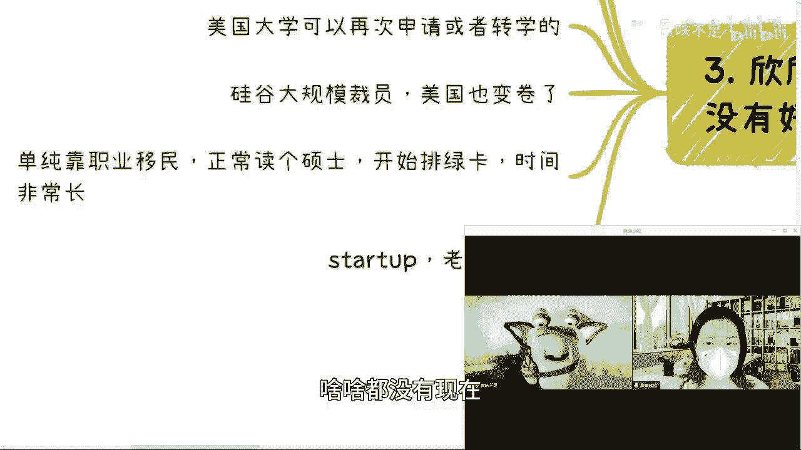

那所以综合来讲的话。

就是现在往后其实不管是啊就是国内啊，就就不管是就是说美国现在就是说情况怎么样，就是已经比如说从新鲜的角度来讲，就或者从整个大局角度来讲，反正已经这个计算机，反正也也也也肯定就不行了嘛，嗯对对呃。

就他跟别的专业相比，特别是跟文科。

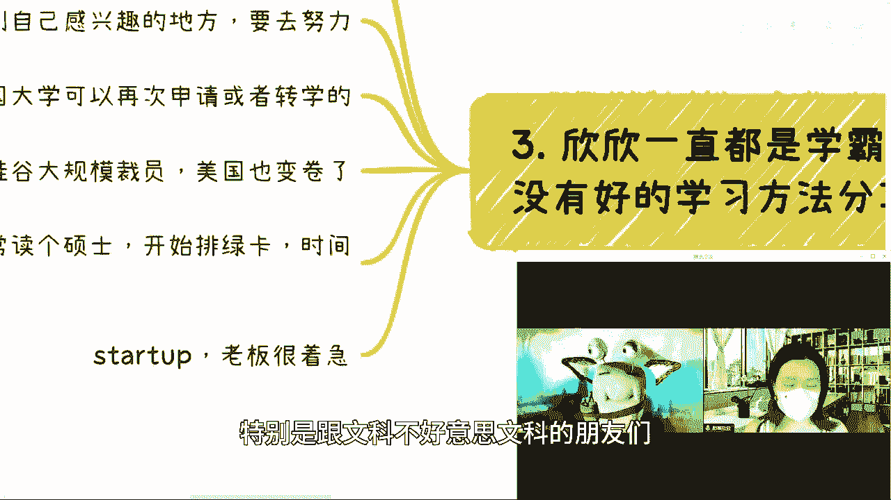

不好意思，文科的朋友们，但是跟文科相比肯定还是稍微好混一点的，但是你如果跟之前比的话，他确实已经进入了困难模式了啊。

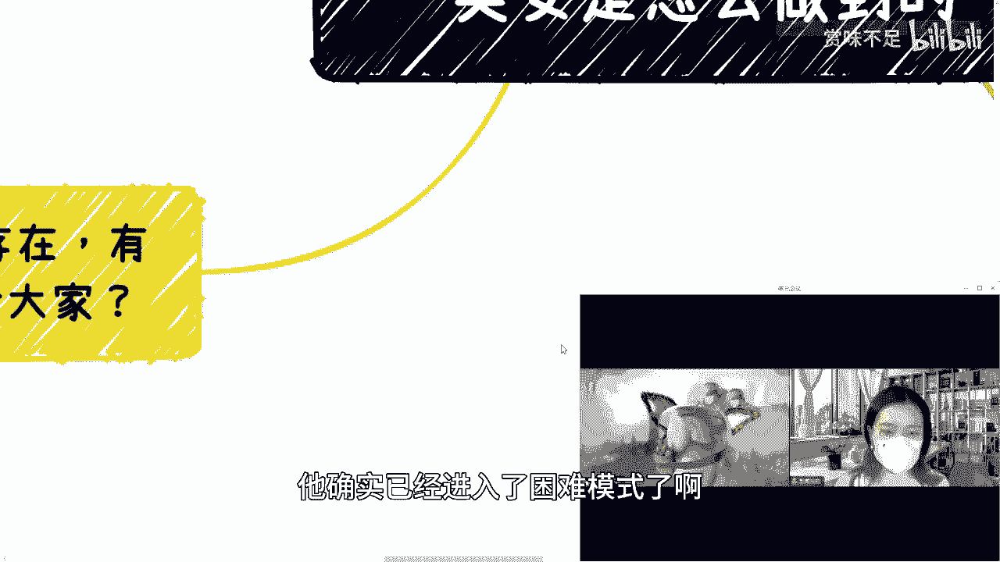

那未来的话，可能就真的是一些比较稀缺的人才啊，包括AI这样的比较新的领域吧，嗯还有一个就是可能比如说你读一个PHD，PHD的，这个还是比较受受尊重，然后也是比较需要的啊。

当然这个博士去业界可能又是另外一回事，总之这个所有的路径可能难度都加大了很多，诶那我我我顺便问一嘴，那个如果现在那边比如说真的打个比方失业了，然后做了可能找不到工作，四五个月，五六个月，那会去干嘛呀。

就是不需要担心这个永居身份的情况下吗，啊对对对呃，这个呢其实我周围还见到不少的实力，嗯这个我觉得要看大家吧，有些人嗯就是在科技行业呆了很久很久了，那他可能就就刚好退休了啊，哦哦哦可以可以。

就是或者就是先先休息一段时间啊，都是可以的，那那这这部分人很少，大部分人呢就是啊，首先大部分人还是就是没有没有绿卡，没有身份，就是可能你两个月找不到工作，你就得回国了的这种状态，那确实很焦虑。

那有绿卡的话呢，也可以去做别的，比如说现在开UBER啊什么的，就是也遇到一些吧，对对或者就也有直接去创业的，但说实话你大环境如果不好的话，你创业也是会比较难一点，对这个嗯就是得自己想办法了。

然后大家想的办法都不一样，OKOKOK好，那就是回回到我们第四个，第四个是这样子的，就是接下来就是从这个，我觉得就接下来往后说吧，就接下来这个发展上面几块吧，一个是AI，一个是游戏，一个是web3。

这边就是星星，可以这个讨论一下，好啊好啊，就是你想你这个程序没写好，就是就是你现在要从三条分叉当中选一个，就是系统提示嗯，对就是就是我觉得可能就是先先从这个美国啊，姑啊硅谷啊。

然后从这个海外的角度来讲吧，就是我们可能都得都可以说一下，就是说AI的未来发展，从你现在看怎么个情况，然后还有啊游戏啊，web3啊，这样嗯好啊好啊，但是我对这一波AI的理解，因为我在哥大的时候。

我也做了一些科研嘛，就是当时就很奇怪，哎呀AI怎么还没有落地，怎么还没有这个商业化呃，或者说还没有就是像现在这样，就真的是走进千家万户的这种呃，这种to c端的这个成功吧。

嗯可能其中一个原因还是因为当时的AI，就是太太粗糙了，就是比如说其实像这个图像生成，当时是那个干嘛，就是干这种算法，它生成的东西就是要么特别糊啊，然后要么就是就是跟画画一样啊，就是嗯质量就不太行。

然后也没有像现在这样，就是特别大的一个数据作为支撑，所以当时也只是可能学术圈子，然后小部分人的这么一个一个使用对，然后或者说做一些特别简单的任务，然后包括就是上一波这个人脸识别啊什么的啊，然后自动驾驶。

反正到现在都还没有这个非常好的解决啊，就是大概是这样子啊，那这一波的话呢，我们就是硅谷这边的嗯一些技术的朋友吧，就我们的共识大概就是说，因为呃就是为什么是大大的语言模型，这边先做了一个突破。

是因为NOP就是这边的数据可能比，就是视觉方面要更多一些，嗯嗯嗯嗯啊，然后以及就是呃一些这个催化剂，然后包括就是我觉得ch拆GPT，它这个产品做的真的是挺好的对啊，所以会起来这样的一波啊。

那嗯我个人感觉的话，就是现在AI还是处于一个大家都非常兴奋，然后非常害怕的一个阶段，嗯然后之后的话就是这个hp之后，如果说能够真正沉淀下来一些，就是大家真的会去使用的东西的话。

那那可能才会比较就是能够证明它的价值吧，对就就肯定是会有一些留下来的，但是就就是大部分是留不下来的，嗯好好好好，对对对对对，我表示对，我表示星星这个看法还是比较客观的啊，这个这个这个毕竟大部分聊下来。

真的都是无脑吹，你知道吗，我就表示不太行，这个东西对对，而且就是呃其实包括几年前吧，我就有这样的观点，就很多东西其实你根本就不需要AI呀，就是啊我今天还在这个看项目，然后然后我就是看到。

比如说AI去生成这种产品介绍的图片，就是类似这种已经看了好多家了嗯，就是硅谷这边的初创公司啊，然后包括像这个啊，就是我们最近看的有一个项目，就是说要把嗯可能几个物件一起，就是比较自然的，就是渲染。

就是放置在同一个场景里面去，然后然后就来了一个是这个灵魂拷问，就是说你这些东西的位置，比如说今天我的穿搭对吧，我衣服应该放在哪个位置，写字应该放在哪个位置，那一般人的想法可能就是说我去训练一个模型。

然后我去判断，就衣服我今天就是喜欢放在正中间，我鞋子我就是喜欢放在底下，但是这件事情为什么不直接用模板来做呢，就是我就规定说啊，这个衣服就是在这个这个图片正中心的位置，我要是鞋子。

我就是放在比如说画面这个，1/3的地方对吧，然后为了避免每张看上去都一样，那我再随便加一个这个随机的这个数值，那不就解决了嘛，嗯然后还有其他挺多挺多的，就是嗯包括就是可能看上去挺好看的。

但是就是根本没有需求的，或者说看上去确实挺好看的，但是他们就是嗯hack出来的，就是你可以认为是专门给投资人看的，然后他可能融到钱了，他就不知道去做什么，就是都有都有对，OKOK对。

就现在这个市场上面噪音还是挺多的，蛮好的，那这样说的话，其实就是我是觉得美国现在都这样子，那那国内就更别说了，真的一塌糊涂，简直就是嗯我觉得美国这边就至少硅谷这边啊，初创企业的话。

可能竞争的还是稍微比较良心一点吧，就是嗯他不会，比如说你三班倒的，就是去去抄一个你对手的东西，然后抢在对方之前去发布哦，或者说这个故意去买对方的通稿，去说对方的坏话，这种是不太有的对。

就大家至少还是玩的都是能够摆在台面上的，然后也会比较尊重这个原创，OKOKOK那游戏游戏啊，游戏这个行业已经存在这么久了，那游戏有什么，你觉得未来有什么，就就这么说吧，因为3A的那种东西。

就是大部分人肯定也做不了嘛对吧，那如果从这种一般角度，不管是他参与啊，还是创业啊，还是什么什么方面，就是有什么切入点的这个商品啊，对对对，就是游戏的话嗯，我觉得还是一个门槛比较高的东西。

就是现在独立开发者就真的是越来越不好做了，就哪怕是有AI，因为所有人都能做，那他就没有门槛嘛对吧，那那就又变成了所有人都在竞争，都在挤去抢机会的一个东西，然后游戏的话其实有很多。

我可能大家都比较嗯失望的点吧，也是被说了很多年了，比如说啊，这个很多时候他不是看一个游戏多好玩，而是看你给这个游戏买了多少的量，有多少的流量流进去对吧，然后或者说啊这个游戏好像现在玩来玩去。

就是这么几种，这个游戏机制就没什么创新，大家觉得抄一个以前的都是啊，然后这个非常产业化的这个去去赚钱就行了，就是就是他没有一个一个创新在里面等等等，对，那我觉得就是说像AI包括像关系，就是这些新的东西。

它会给这个行业带来一些新的这个活力吧，然后嗯我不知道的话，我觉得美国这边，其实游戏从业者还是比较传统的。

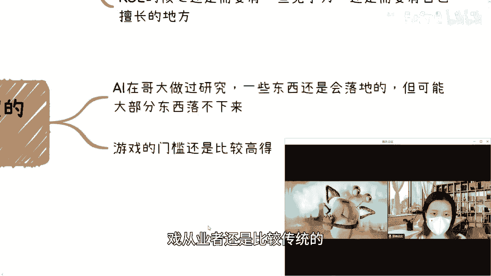

就是呃比如说我去年，我去年在那个game developers conference，就是呃在旧金山的这个游戏开发者大会，我当时跟他们讲说这个这个web three怎么样。

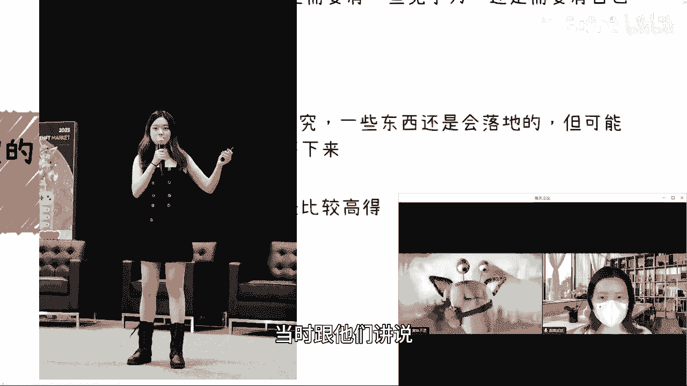

怎么样怎么样，然后那些游戏studio都非常的不屑，然后甚至有一个游戏开发者就就是想跟我争，他就说他又说，他已经在游戏行业待了25年了，他认为这个游戏上区块链没有任何的价值吧，拉巴拉巴拉讲了一大堆对。

但是我今年我又去了游戏开发者大会，就有人主动的来问我对吧，他就知道说我玩NFP，然后他又会说啊，那你觉得我们这个游戏可以怎么样怎么样，然后说哎这个能不能留个联系方式，看看我们以后怎么样，可以向你请教。

或者合作哦等等等，就是明显整个游戏行业还是慢慢的，会去拥抱一些新的东西，然后包括比如说我今年去跟他们讲说啊，AI可以去生存游戏的很多东西对吧，那现在也有些人是不相信的，当然不相信的话对吧，你来试试试看。

这个直接使用一下就知道了对啊，那这个游戏行业还是慢慢的在打开吧，就是不是说可能游戏行业本身的这个创新，而是说它跟新东西的一些结合啊，这是我一个比较浅的理解对OKOKOK哎呀。

现在其实大家这个找方向都还是比较，都还是比较难的，就是嗯其实现在现在你看国内啊，国内其实大家做吧，就是就就说直白点都是面临着，比如说啊这个工作，就上面的这些就是好的工作啊，好的公司啊，可能就那么些。

那么大家可能往上卷吧，也转不动，然后剩下的么就年纪也不算年纪大的吧，就是三十三十三十五左右的吧，反正最近优化掉也比较多，然后大家也都在嗯可能有的在做调整，有的就还是在找工作。

但是方向上面就是寻找就还是比较难的，就是对，然后就是跟到说到这个就刚刚我还想到一个点，就是说呃海外现在就你知道啊，就工作上面remote的这种工作会多吗，非常好的问题，就是我把它分成两大块吧。

一块就是正经的这种大公司，它正式雇佣你的工作，就是比如说像这个前两年啊，google或者呃meta他们嗯，就是说员工你可以在家里或者在某一个角落，世界某个角落远程的工作，就这种。

还有一种就是像有一些这种在线啊，去接单的平台啊，就具具具体我就不说了，就不打广告了，嗯就就这种也是可以接的哦，那就是首先说这种前面这种雇佣的这个，远程工作吧，嗯这个其实硅谷现在的风气啊。

总的来说可能是因为疫情，这两年就是各家公司真的没有拿出事，就是特别特别啊，像以前那样惊艳的产品，然后大家也能够想到说啊，在家工作是不是大家都在摸鱼对吧，所以嗯其实就是包括大公司，可能迫于股东的压力。

他都是会就是想办法让员工尽量回来，而且就是有时候会使一些手段嘛，嗯嗯对，那那其实如果你在2021年左右，就是你你如果在一些这个交通比较便利的，这个这个街区，你买房的话，那应该涨了挺多了，对啊对。

就是有这样的一个趋势啊，那如果说是这种远程接单的话，它其实一直都有，但是呢这种平台的话，我个人感觉就他可能赚的不会特别多吧，嗯嗯嗯嗯呃，就肯定是没法跟就是那种正儿八经的这个这个。

employment相比的对，就是我我个人也会觉得说如果能找到工作，能够找到一份，那就挺好了，就没有必要，就是下班以后还去就是借借外包去做这个事情，就是下班以后我觉得就不要为别人工作了，你可以自己去。

比如说做一款app或者做一个游戏，做一个什么东西，做一个产品出来，嗯就是你当你自己的老板，而不是又把自己的时间给卖出去啊，去换钱，对，就是风险上可以稍微搭配一下对，嗯然后第一份工作的话。

嗯这个就看大家了，就是嗯人生确实是会有一些时候，比较比较艰难吧，就是包括我自己也是嘛，就是在可能大学的时候，就我是我有段时间是呃同时打了三份工对，然后而且那那那个学期就是有特别特别多的课。

然后就真的是一口仙气吊着，然后每天在在在做各种事情对，OKOK哎呀。

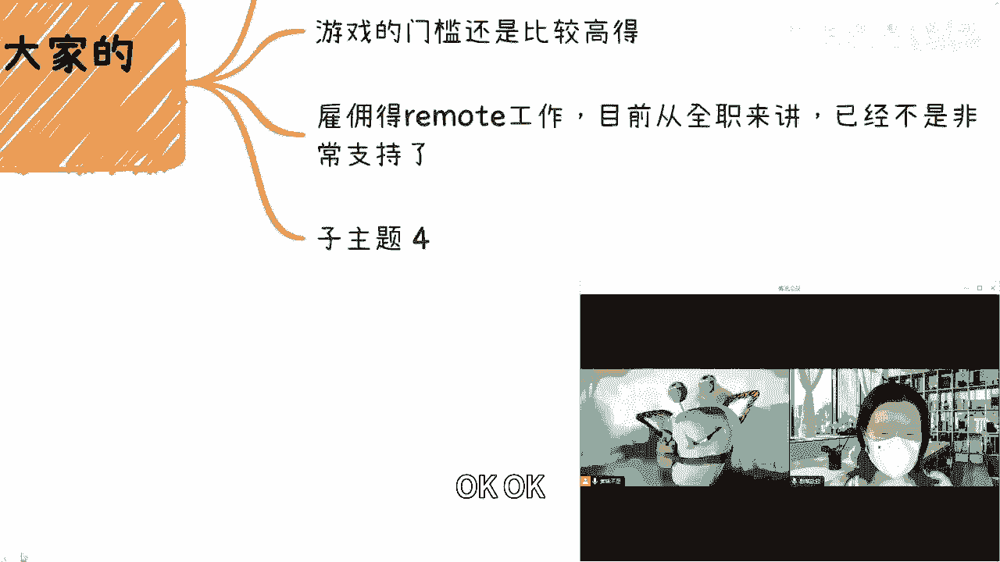

总体来讲反正也都都不是很容易不是很容易。

那，对啊那那我觉得OK啊，那就是我们这个内容我觉得差不多，那那从我个人角度来讲，这个啥啥时候回来呢，呃这是个很好的问题对吧，我粉丝都这个打趣我写我的段子，说我下星期回国是吧，嗯我我觉得其实包括我。

然后包括可能嗯我的朋友，我的团队其实嗯为事业还是牺牲了挺多的，就是像我的话已经好几年都没有回中国了，对啊嗯对对，就是还是希望如果真的回来的话，可以就是等做出点东西以后吧，就哪怕是短期的。

因为因为现在中国其实啊因为一些原因吧，就是像数据啊，然后各方面其实不是很能够畅通的，就是传输就是其实在中国会很不方便工作，对嗯嗯嗯OKOK行啊，那反正就等你回来，等你回来，这个起码涨个十斤啊。

那那那那我不想长十斤，哈哈哈哈哈哎呀这个要符合你对吧，这个他们怎么叫你来着的，对吧对吧，这个女人叫我胖青是吧，胖青哦，我是最胖的是吧，对对对对对对对，你要对吧，要要要要要做到大家的这么一个。

这么一个呼声呀，对我我就真的很不懂，就是每次我要是发我的照片什么的，大家都会说胖了，就感情他们已经说了几年了，我难道一直是线性增长的吗，万万一真的是呢，那我早就变成球了，好吧嗯，OKOK好呀好呀。

那反正就是内容我觉得差不多呀，那星星最后还有什么要跟大家说的不，最后的话就是希望大家可以多多支持，咱们沈总啊，然后这个多多那个什么一键三连是吧，哎呀不得了不得了。

竟然没有想到这么硬的广告在最后是吧是吧对。

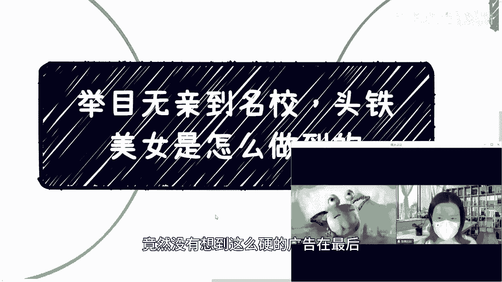

然后也可以顺便关注一下我啊，这个这个打在屏幕下方好吧，对对对对。

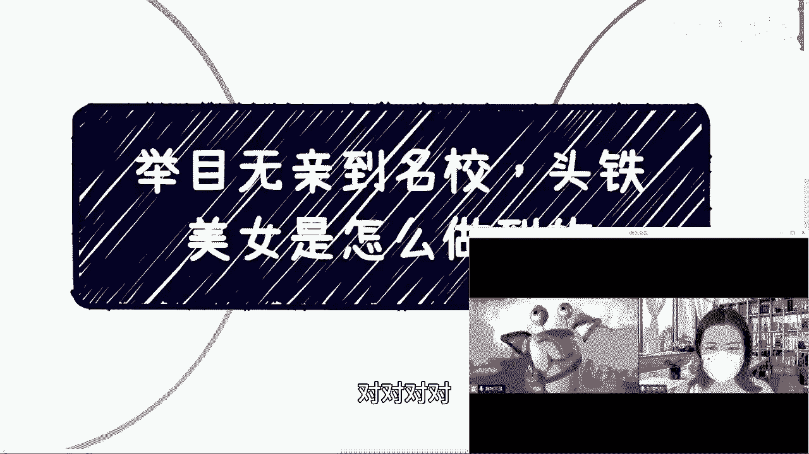

太硬了太硬了，我来打我来打，我来打嗯，很好很好对，多谢多谢大家。

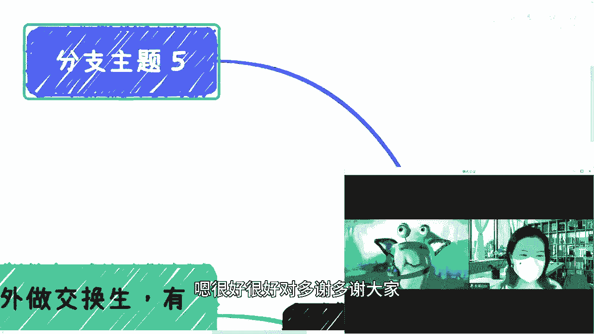

大家能看啊，有几个我来我来我来我来我来看看，打到这里哎呀怎么都是分支主题啊。

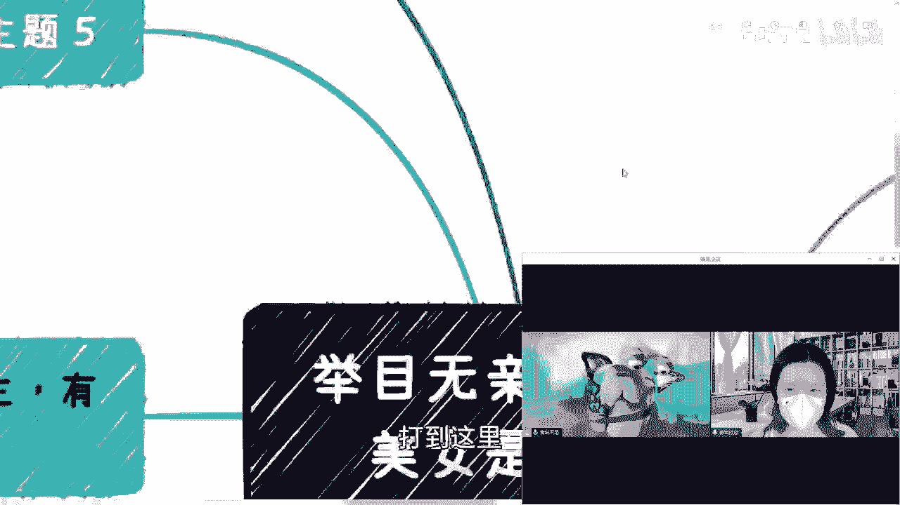

怎么这么垃圾啊，嗯嗯没事儿没事儿，对甜菜星星啊，然后是甜心屋。

好了，那我给你讲，大家我觉得看完要要膜拜，要么拜，我觉得还好吧，我可能就是比较知道一些奇奇怪怪的这个知识，是是是这个有些知识，我们我们我们我们私下沟通，私下沟通嗯，可以的可以的嗯好，那我们就先这么着。

反正大家有什么呃想法的，反正回头就是也可以都写在评论区嘛，然后如果未来啊就就比较成熟一点的，就比如说如果未来有一些AI啊，游戏啊，web3啊，或者其他的一些这种嗯。

就具体的比如说出就是打个比方要去美国对吧，去硅谷的一些就是目前想法有些具体的东西，如果未来啊想清楚了说啊，我这个呃想要有些问题咨询一下或者怎么样子，反正也都可以联系我，或者对吧。

你们就可以直接到这个对吧，就星星这边的QL媒体下面去留言对吧，反正嗯都可以啊，自主一点，好那就这么着，那我就点了点点点停掉了嗯，好的拜拜拜，我挥什么手，我挥手他也看不到啊。

