# 课程 P1：为什么身边的人不理解我？ 🤔

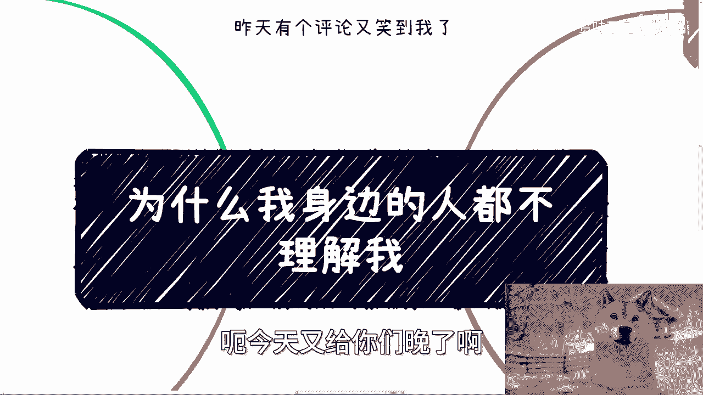

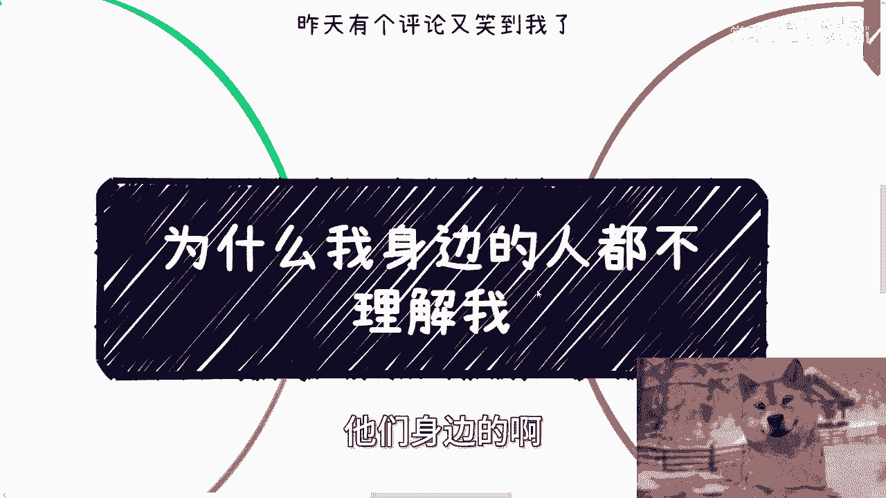

在本节课中，我们将探讨一个常见困惑：“为什么身边的人不理解我？” 我们将分析追求他人理解的误区，并指出在做事过程中，真正重要的不是被理解，而是找到认可与合作。课程将帮助你建立更务实的心态，专注于目标与资源整合。

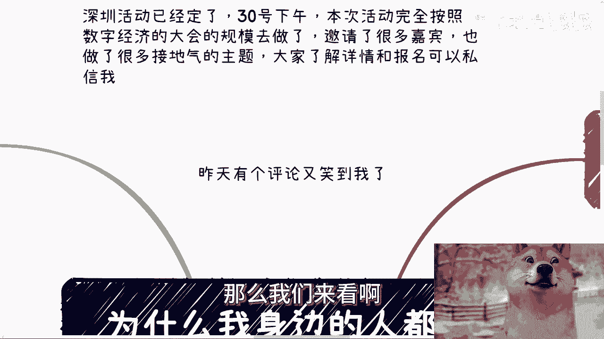

---

上一节我们概述了课程主题，本节中我们来看看追求他人理解背后的几个核心误区。

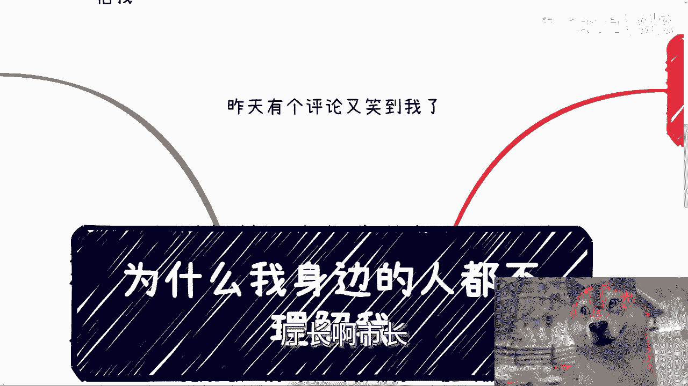

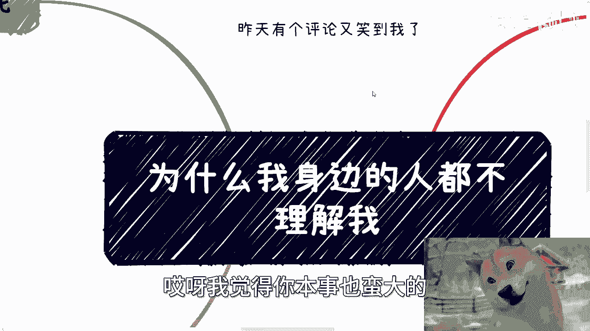

## 误区一：追求理解对做事无益 🚫

做事时，追求身边人的理解并不能帮助你成功或带来实际收益。我们需要的不是泛泛的理解，而是**认可我们的人、能合作的人、能提供帮助的人以及能创造价值的人**。情绪价值对做事者而言并非必需。

如果你身边有许多人理解你，那往往意味着你们属于相同的群体。这并不值得高兴，反而可能说明你尚未跳出常规思维。

**核心逻辑**：
```
做事成功 ≠ 需要被理解
做事成功 = 找到合作者 + 获取资源
```

---

理解了第一个误区后，我们进一步探讨其背后的心态问题。

## 误区二：渴望理解是内心脆弱的表现 💔

渴望他人理解，常常源于内心不够强大、优柔寡断。做事者需要坚定的信念。

例如，许多人想寻找竞争不激烈的“增量市场”。但现实是，任何有价值的赛道竞争都很激烈。如果你找到了一个人少的好赛道，那么能理解你的人自然也是少数。此时，你又希望得到多数人的理解，这便形成了一个**悖论**。

因此，在心态上需要做出选择：要么彻底接受现状，要么坚定地走自己的路。摇摆不定只会导致内耗，浪费时间与精力。

**悖论公式**：
```
期望条件A（赛道人少） + 期望条件B（理解者多） = 矛盾
```
现实中，A和B往往不可兼得。

---

除了个人心态，外部合作中的误区也值得警惕。上一节我们讨论了内心建设，本节中我们来看看如何识别不靠谱的合作者。

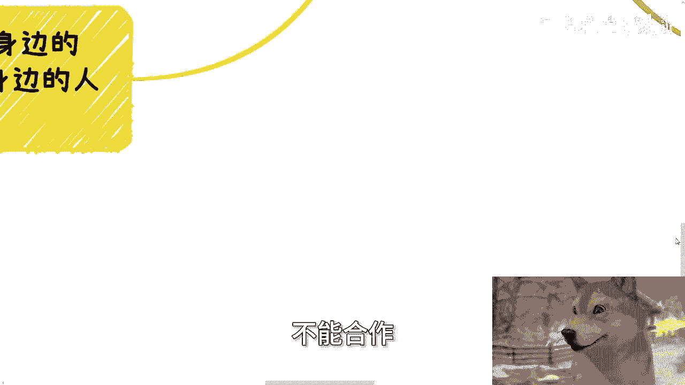

## 误区三：警惕“纸上谈兵”的合作者 🎭

在寻求合作时，许多人身边有所谓的“大佬”或“合伙人”。但如果他们只会向你索要案例和方法，这说明两点：
1.  他们自己缺乏实操经验和基础能力。
2.  他们所谓的“资源关系”并不到位，或根本不想为你所用。

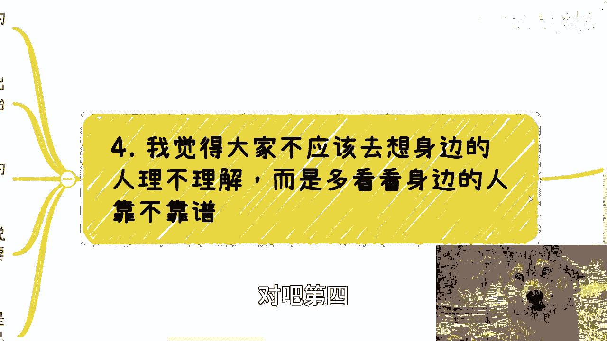

以下是不靠谱合作者的几种表现：
*   **只提问，无贡献**：不断向你索取方案，但无法提供任何实际资源或帮助。
*   **关系虚浮**：声称关系深厚，但具体到合作时，任何资源都无法落地。
*   **价值不匹配**：对方可能很优秀，但其价值与你的事业无关，不愿为你投入。

与这类人合作前，必须先通过实际互动夯实关系，否则合作无法展开。

**合作有效性判断**：
```python
if 合作方.提供具体资源 == False:
    print("关系尚不牢靠，需进一步夯实")
elif 合作方.价值与目标不匹配 == True:
    print("需评估合作必要性")
else:
    print("具备初步合作基础")
```

---

最后，我们需要将关注点从“被理解”转移到更实际的方向上。上一节我们学会了识别合作者，本节我们来总结行动的核心。

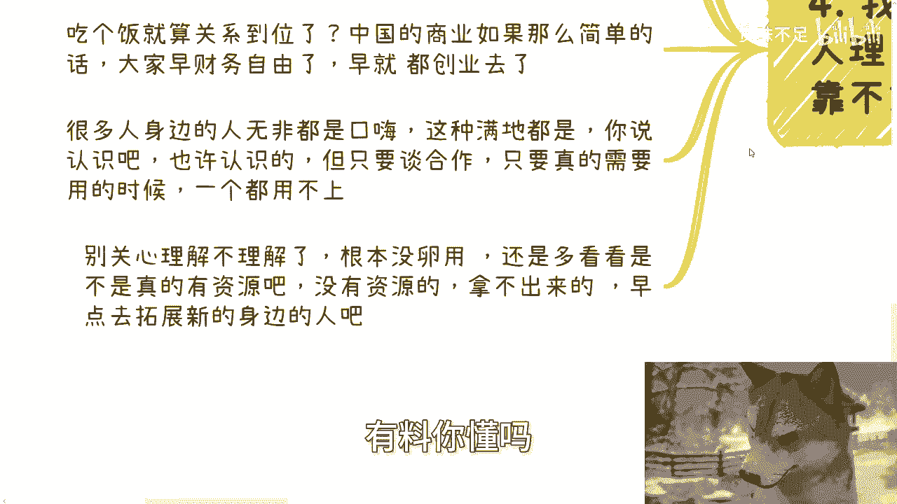

## 核心行动：关注靠谱度，而非理解度 🎯

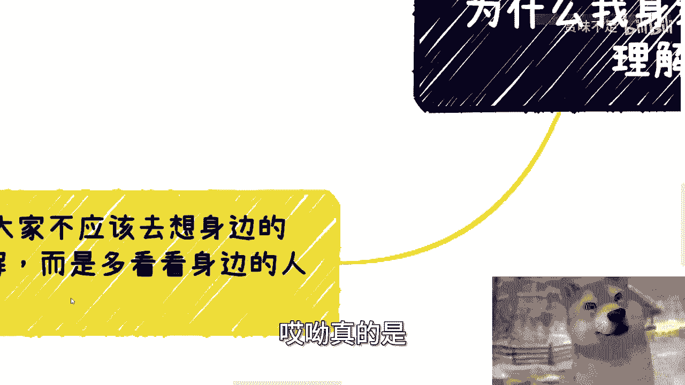

不要浪费时间纠结他人是否理解你。你应该重点评估身边人的**靠谱程度**。

许多年轻人容易被“大佬”的光环迷惑，如年纪大、有阅历等。但真正的评判标准应是：**对方能否为你带来实际价值（尤其是经济价值）**。

如果所谓的“大佬”在需要时无法提供任何资源，那他就不是你的有效人脉。及早识别并更换合作对象，是高效做事的关键。

**价值评估标准**：
```
有效人脉 = 能带来实际价值（如资源、机会、金钱）的人
无效人脉 = 仅存在名义关系，无法提供任何价值的人
```


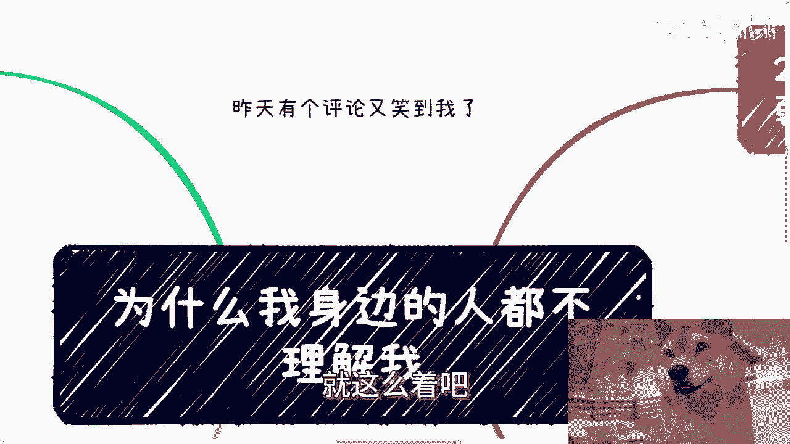

---

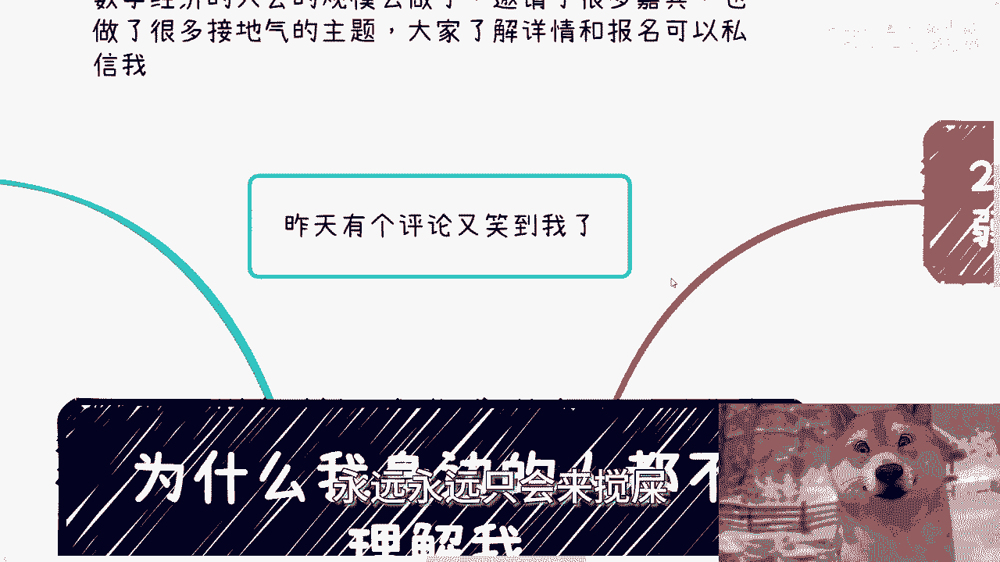

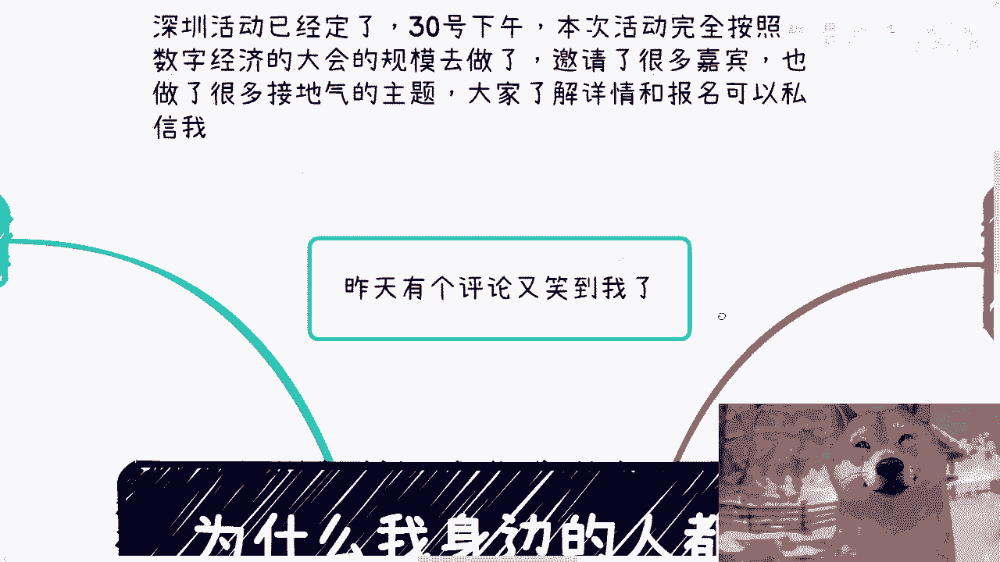

## 课程总结 📝

本节课我们一起学习了关于“被理解”的四个核心观点：
1.  **追求理解无助于做事成功**，应寻找认可者与合作者。
2.  **渴望理解是内心脆弱的表现**，在做事时需要坚定信念，避免摇摆。
3.  **警惕只会空谈的合作者**，关注关系的牢靠性与资源的可落地性。
4.  **将焦点从“被理解”转向“找靠谱”**，以能否带来实际价值作为评判人脉的核心标准。


记住，做事者的道路常是孤独的。将精力集中在目标、资源和真正的合作上，而非他人的眼光与理解，是走向成功的关键一步。