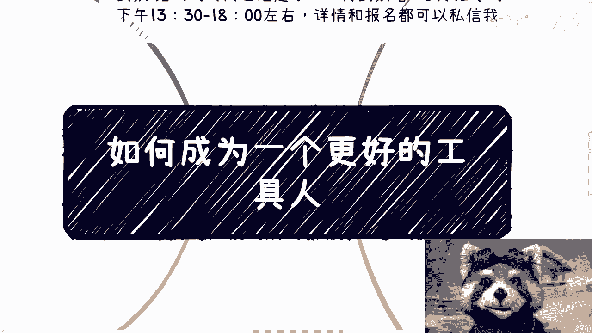
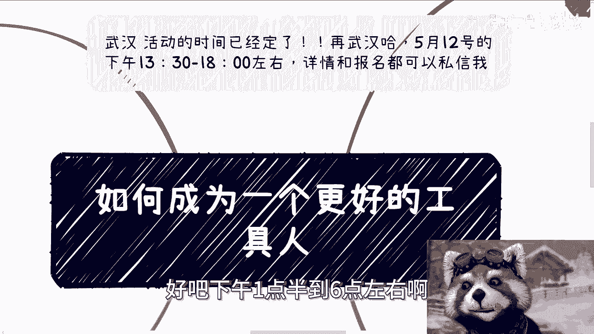
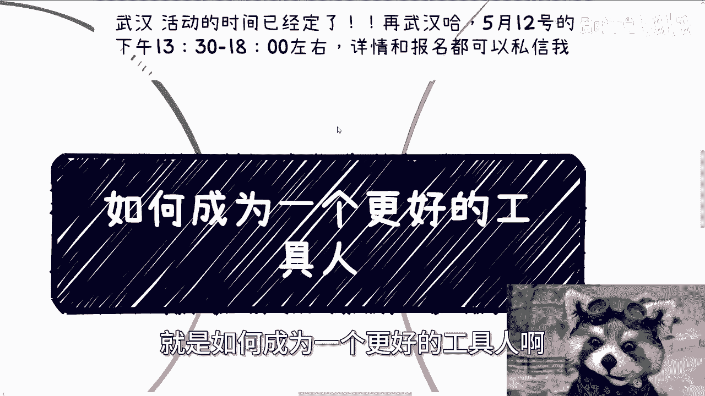
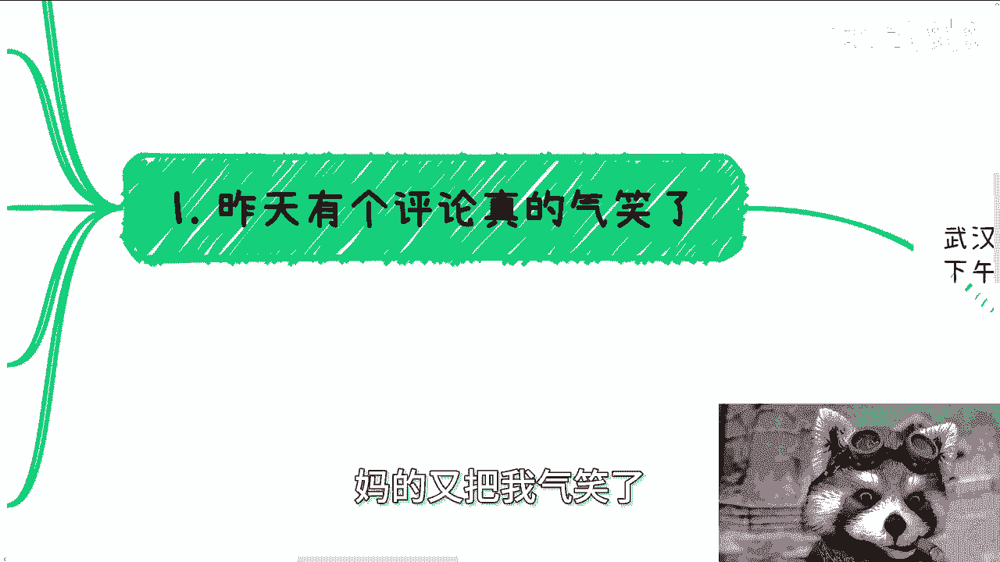
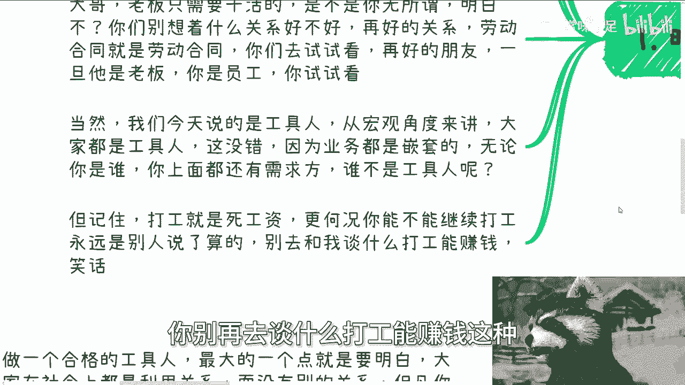
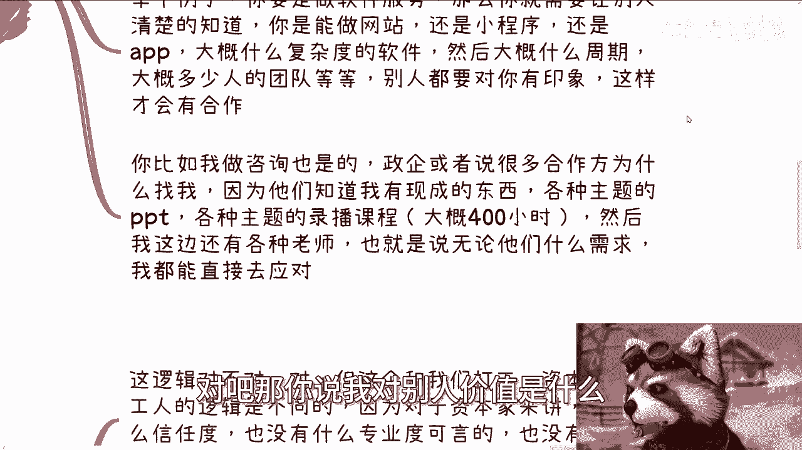
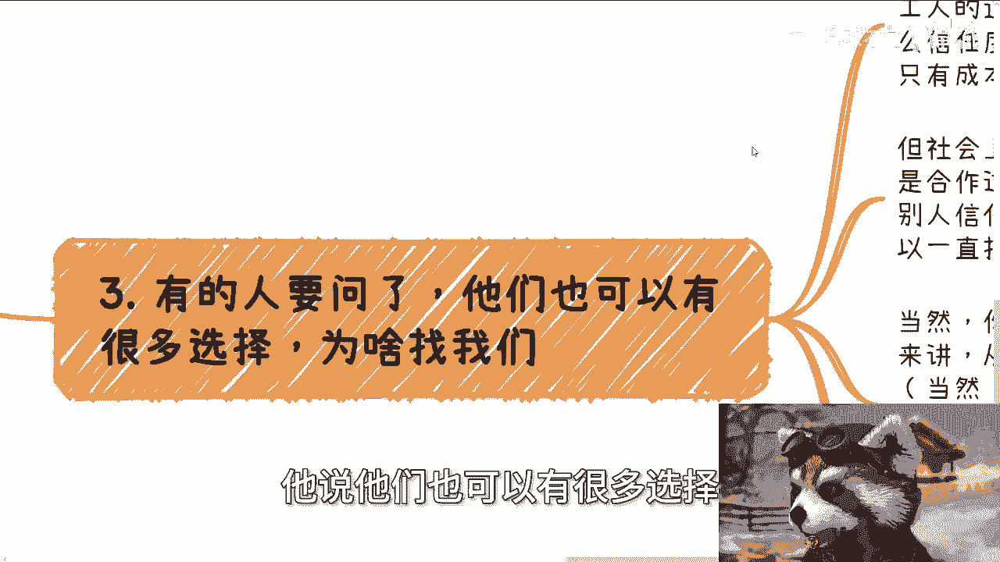
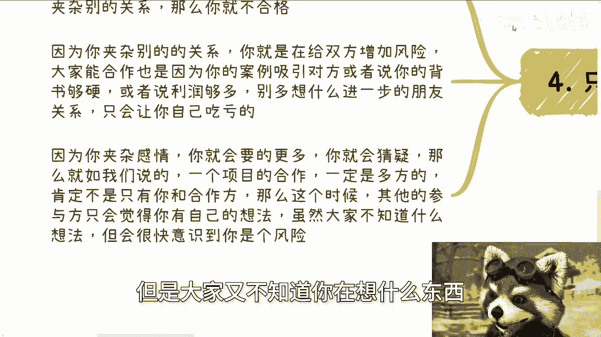
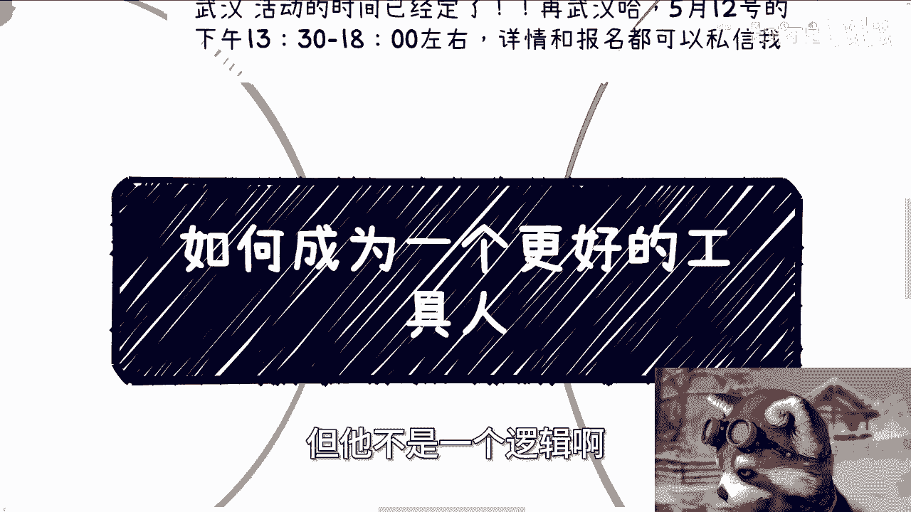

# 如何在社会层面做一个更好的工具人 - P1 - 赏味不足 - BV1GZ421j7so

大家好呃，我刚刚今天开始在玩那个叫什么，就是鸟山明的那个漫改啊，就当重装机兵玩啊。

这游戏做得不错，有一说一样呃。

首先那个武汉活动已经定了啊，在武汉5月12号好吧，下午01：30到六点左右啊。

然后详情跟私信都可以啊，不是不是详情跟报名都可以私信我啊，那么今天讲的这个主题呢对吧，你们一看就觉得这个不应该我讲是吧，但是呢这个逻辑呢我还得给你们讲一下啊，就是如何成为一个更好的工具人。

呃首先是这样子啊，昨天有个评论我跟你讲，妈的又把我气笑了。

真的又气笑了，他妈这我都不知道怎么效仿啊，就原评论说原评论那个讲小说的人，我也懒得找了，但意思就是说他觉得呢工作都是在呃，他说工作就是在赚钱啊，为什么赚钱呢，因为老板需要他这样一个工具人啊。

钱从哪来呢啊，钱是从老板给的工资来的，能得到什么呢，能得到同事跟了解公司的业务，我就觉得哎呀就是人才啊，也是人才啊，我跟你讲，真气笑了啊，啥叫资本家，啥叫打工人啊，你怕不是这个有什么。

就是老板或者创始人的把柄啊，那为什么赚钱竟然是因为老板需要他，这样一个打工人我也是服气的啊，嗯这个事情我觉得我就不用我再强调了吧对吧，就是资本家跟老板啊，只需要干活的，是不是你无所谓啊，你明白吗。

就是说你别去想着关系好不好啊，我跟你们这么说啊，再好的关系，劳动合同就是劳动合同，什么意思啊，意思就是说你去试试看啊，你去试试看，你俩就算一穿开裆裤长大的朋友，一旦他是老板，你是员工，你去试试看啊。

你看你俩关系怎么发展，真的你你你别搞的，就是说哎呦我的，我跟他关系很好的啊对吧，怎么样怎么样啊，没没没没用啊，我就告诉你没用啊，你有本事，你真的你不信你试试看啊，当然啊，我们今天说的是工具人。

什么意思呢，就是说从宏观角度来讲，大家每个人都是工具人啊，这没有错，你什么意思啊，因为你今天就算不在打工上面，你在社会层面业务都是嵌套的，无论你是谁，无论你官多大，你上面总有就我们叫做山外有山。

人外有人，你上面总有你更上面的人，对不对，那么你上面总有甲方甲方的，甲方的甲方甲方甲方永远都有甲方对吧，那么你放到一个更大的格局来讲，谁不是工具人呢，对不对，那谁都是啊，但是你记住一点。

打工就是死工资啊，更何况你能不能继续打工，永远都是别人算的，不可能是你说了算的，所以说你别再去谈什么打工能赚钱，这种就是202024年的这种呃。

叫什么地域笑话对吧，没啥好说的，你要是觉得呢打工还能赚钱。

那那那那那就没得谈了对吧。

你请你把我拉黑啊，哈哈啊，然后第二呢就是说你能稳定的呢，就是我们来说怎么成为一个更好的工具人啊，呃第一点你能稳定的提供一个服务或者产品。

什么意思啊，意思就是记住，无论怎么样，你在社会上是需要有一个自己的标签，当然啊，这个标签跟我们之前说的title说的那些案例，其实它不是一个东西啊，这个标签是在别人刻板印象里的。

也就是说你到底给别人提供的是个什么印象，那么这个印象具象化是什么，就是你是你，你到底能提供一个怎么样的服务或者产品，而且在这个领域里面呢，可能什么乱七八糟需求你都能接，或者来说你接不接得了，无所谓啊。

别人知道你就算接不了，你也能找到对应的人能解决这个问题，这就够了啊，那么举个例子，比如说你能举办活动，对不对，那么你不单单只是能举办活动啊，你得是一个类似于像会务公司的这么一个角色。

那么你可能除了有陈述的活动策划方案，比如说啊我今天晚上我就跟你说，我可能下周就有个活动，我需要有一个活动策划方案，你总不可能跟我说啊，陈老师，我现在开始写对吧，我现在给你帮你做，那他妈我找你干嘛呢。

对不对，我要去找的一定是他有若干个成熟的活动方案，直接拿出来用的对吧，那么除了活动方案以外，你可能还需要有什么，你要你要能提供礼仪，提供茶歇，提供酒店啊，提供现场的搭建，你要能呃你你你你都需要能提供。

而且无论多紧急的问题你都能解决，这就是你给我或者给别人的这个印象，你明白吗，这个是主要的哦，你不要就是跟别人说啊，我就能办活动，你妈你能办什么活动对吧，你什么方案，什么策划方案，你到底能提供什么资源。

这个才是最重要的啊，然后举个例子啊，还有举个例子就是你要做软件服务对吧，那么你就需要让别人清楚知道，你是能做网站还是小程序，还是都能做，还是app啊，然后你大概是什么复杂什么复杂度的这种软件。

然后大概你完成这种软件是什么周期，或者说你现在有哪些软件的模板，你是直接可以套的对吧，大概多少人的团队等等等，那么你就需要别人对这些东西都有印象，那这样的话别人有任何的需求，他第一时间就能想到你。

对不对，那么你比如说我做咨询也是一样的，比如说政企或者说很多合作方为什么找我，因为他们知道我有现成的东西，比如说我有各种主题的，对数字经济，区块链，元宇宙啊，对数字资产啊，反正他们只要对我有各种主题的。

包括什么数字化额数字会计对吧，然后什么什么数字经济，数字科技啊，科技金融对吧，那各种主题BBT，然后各种主题的录播课程，我现在大概有400个小时，都是之前给高校做的啊，然后呢我这边还有各种老师。

也就是说无论今天他们什么需求，我都能直接去应对，他说要直播我能做，他要录播我也能做，他要PPT我也能做，他要老师我也能做，他说哪怕明天就得去做，OK我也难做，就这么简单对吧，那你说我对别人的价值是什么。

就这个价值啊，他不需要知道别的东西。

你说你说他需要知道啊，陈老师团队有多少人吗，不需要他需要知道啊，陈老师陈老师以前做什么工作吗，也不需要知道，他需要知道这些干嘛呢，他需要这些知，他需要知道这些对他这个解决问题，对他赚钱有帮助吗。

没有那他妈他何必去知道呢，对不对啊，第三有的人要问了啊，他说他们也可以有很多选择。

为什么找我们，我跟你讲对这个逻辑对不对啊，但这个跟我们打工跟资本家跟打工的逻辑，它是截然不同的，因为对资本资本家来讲没有什么信任度，也没有什么专业度可言，也更没有性别啊，也没有说你长得好看不好看。

没有的，只有成本可言，当然我这个地方指的大部分人啊，你要是比如说手上有些特别好的那个，屠龙之技对吧，或者说你你的确有些不错的关系，那你可能是有有有这种，就是与众不同的地方的啊，当然对于大部分人来讲。

你就是资本家只看成本的，不看别的东西的啊，别的都放屁，真的都放屁没有用的，你别啊真的我跟你讲，你到社会上啊，你别去跟别人讲什么，哼，我他妈google啊，我是google了，我清华北大毕业的对吧。

我MMIT毕业的，没啥好说的，真的你去试试看就知道了啊，没啥好说的啊，那么，当然我这个地方补充一句，就是你们不要就是说用那种刻板的思维说什么，哎呀那我们跟一个专科的人比。

我们跟一个本三本的人比总有优势吗，那他妈搞笑了，你们跟三本人比，你往往下比有啥好比的啦，对不对，我就跟你这么说啊，社会上只关心什么，只关心你能不能给他赚钱，你只关心你能不能满足他的需求啊。

来来他妈提这些有的没的啊，你但凡跟一个能跟他满足需求的人，能给他赚钱的人，说这说这些什么学历，什么鸟毛东西都没用，明白吗啊，不要来搞这些，有的没的啊，你们大部分人没有什么专业度可言啊。

也没有什么别的东西可言，只有成本就这么简单啊，但是社会上的合作我跟你讲不一样，社会上的合作呢主要看是不是合作过，或者说你有没有类似的同等的经验，可以让别人信任啊，那么你只要有过一次合作。

这种合作就可以持续下去啊，那当然啊就是说你有你说有成本比你低的，怎么办，我跟你讲啊，其实对于合作方来讲，大家从做生意的格局来讲，并不会去在意一些小钱，当然啊成本如果低很多，比如说低50%，低于70%。

那这个东西另说另说啊，那么另外一方面呢，行业大家无论做什么行业，行业本身都是有一些均价的啊，不会说差太远，因为甲方也不是啊，不会差太远啊，大家会进行对应的沟通啊，如果来说沟通无果。

那说明就是说不是你跟对方合作关系的断裂，而是说你根本就看不上对方的单子了，你你从你心里你觉得对方单子太低了，你知道吗，或者说对方就会觉得你成本很高，那就说明你们的供需关系，已经是不在一个层面上了对吧。

那也就是说你得去寻求社会上更高的这种，叫什么，就是说呃更高单价的单子其实是这么个逻辑啊，你说我我跟他关系断裂没有断裂啊，只是大家不合适呀，有啥断裂不断裂的啦，对不对啊，好那当然啊。

并不是每个合作方都会选择我们，但这没有关系啊，这也不是我们要关心的事情，我们要关心的，那你就这么想吧，你能保证地球上所有的关系链，跟你都站成关系吗，不能那就担心他干嘛呢，对不对，那我们要关心的就是自己。

能不能踏踏实实的积累下来。

属于我们自己的单子供应商，也就是我们第二点这个地方写的，就是说我们要积累的只要只有若干个啊，我不用多啊，只要若干个，当他面临问题，当他需要有解决单子的时候，或者当他需要有些单子能够去做的时候。

他能够第一时间想到你就可以了呀，别的重要了不重要的呀，你记住一点，你在别人这边的印象就是你能解决什么问题啊，别人绝对不会因为哦你是清华毕业的好，我想到你不可能的，你别想了啊，然后也不会因为哦你什么专业。

我想到你不会的，为什么你，你们可能对对，到了社会上之后，你们认识多少人，没有什么太大认知啊，你你知道吗，所有做单子的所有就是大家要赚钱的人，你微信里面躺着多少人啊，凭什么对你有影响么，搞笑对不对啊。

然后第四点就是说案例跟信任啊，就是整个社会层面啊，你要成为一个好的工具人，只有案例的信任跟金钱的信任。

什么意思呢，就是说做一个合格的工具人啊，最大的点你就要明白，大家在社会上都是利用关系啊，就没有别的关系，除呃但凡你夹杂别的关系，我跟你讲，你就不是一个合格的工具人，因为当你夹杂合呃，夹杂别的关系的时候。

你就是在给双方或者说多方增加风险，大家能合作，只是因为你的案例能够吸引住对方，或者说你的背书足够硬，或者说你的利润足够多，或者说整个案例的利润足够多对吧，你别多想着什么，进一步有什么朋友关系。

大家甚至还还什么，好像你好我好，大家好对吧，我跟你讲，你这种想法只会让你自己吃亏，比如说你被白嫖，或者说你明明能够赚到更多钱，然后因为打了感情牌，被别被别人压榨你的成本，对不对啊，那么因为你夹杂感情。

我跟你讲，你就会要的更多，而且要的更多的是一些感性上的东西，那么感性上的东西你就会猜疑，那么就如我们说的一个项目的合作，一定是多方的，肯定不是只有你跟合作方两方，对不对，那么这个时候其他的参与方。

只会觉得你有自己的想法，而且这个时候，大家根本就不知道你的想法是什么，因为你可能自己只是夹杂了一些感情，你也不知道你的这个想法是不是真的，你也不可能跟大家去说，但是所有的人就因为会感受到。

你会有自己的一些想法，但是大家又不知道你在想什么东西。

所以就会觉得你是个风情，你明白吗，哦所以就是说你但凡要做好一个很好的工具人。

其实大家都是利用关系对吧，你你你对于别人，别人对你，大家无非都是相互的，就我以前说的相互的拼图能否两两拼，三三拼，拼起来之后能够完成某个单子，大家分钱，其实就这种逻辑对不对。

但是你说如何成为一个更好的工具人，其实本质上的原因，而本质上的归根结底点就在于说，当大家做一件事情的时候，我能不能想到你就这么简单，没有了根源的原因，就是我能不能想到你，你知道吗。

但是你你们自己去想想看，当你们想到一个人的时候，是因为什么，一定是因为你今天我们打个比方，你今天有个单子，他告诉你，比如说这个单子做就做两个月，这个单子金额是100万，卧槽你很着急哦，你很着急。

然后呢你就去问那这个单词需要什么呢，对吧好，那么他告诉你啊，他说我们需要ABCDEFG这些条件对吧，那这个时候我就这么说啊，你们只是现在没有这100万的单子，如果你们有这100万的单子。

同时你们又觉得得到的信息里面的内容，跟数字经济有关的，你们一定会第一时间来找我，就这么简单，对不对，就这么简单，你们不会说哦，这个钱我不想让陈老师赚啊，这个钱就是说我想多赚一点对吧，或者说什么赚多赚少。

你们不会想的，为什么，因为所有的真正的想赚钱的人，他只关心一点，就是我到底如何能够最快的把这个单子接下来，然后至于你说哎我到底是陈老师能赚多一点，还陈老师能赚少一点，没关系，你我们再来谈，对不对。

因为对于你来讲，我只是一个选择之一哦，如果来说我说我的100万对吧，我要90万，好谈不拢，谈崩掉了，那没关系啊，你去找别人都一样的，你知道吗，只不过就说别人可能不会像我一样，给你们这么直接的哦。

跟数字经济挂钩的东西，但是同样的，如果你们今天有一个单子是做别的东西的，你们也不会第一时间想到我，你明白吗，就这个就是你要给别人心中留下的标签的，最最重要的点，而且你们千万不要想着说我什么标签都留什么。

一顿操作猛如虎，告诉他，哎你看我以前什么学校毕业的，我哪个国家留过学对吧，我既能做A也能做B也能做C，我跟你讲不可能的啊，你给的信息越多，别人只会想不起来，没没有可能性的，因为为什么。

因为人都是一个个体，别人得到的信息都是非常复杂化多元化的，这就好像比如说我这边能做专利的人很多很多，100个能做专利的，但是如果哪天我真的缺专利了，你说我会想起谁吗。

我一定会想起那个让我知道他只有做专利的，他只会做专利，同时他非常专业这么一个标签的人，对不对啊，没有没办法的，我跟你讲，真的好吧，所以说就是说你们要明白，就是打工更多商业虽然都是工具人。

但他不是一个逻辑啊。

好嗯继续打游戏啊，那就先这么着啊。

那个武汉活动大家报名继续报名好吧，5月12号呃，然后就是接下来就是说商业啊，商业规划，职业规划啊，然后融资啊，股权啊啊丰润啊，分红啊对吧，商业计划书啊，包括你们现在有哪些新的合作啊。

包括你们手上有哪些牌对吧，你说我有哪些offer或者其他的，你要这个希望通过我的视角啊，通过我的视野，能够给你们带来一些更好的规划的，那你们可以整理好问题啊。

