# 如何在社会层面做一个更好的工具人---P1---赏味不足---BV1GZ421j7so

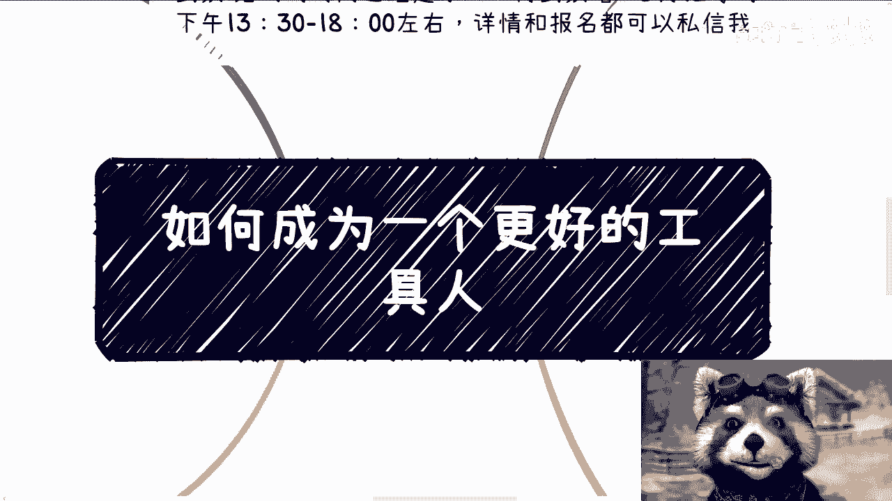

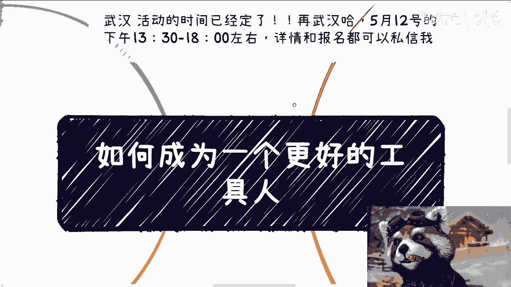

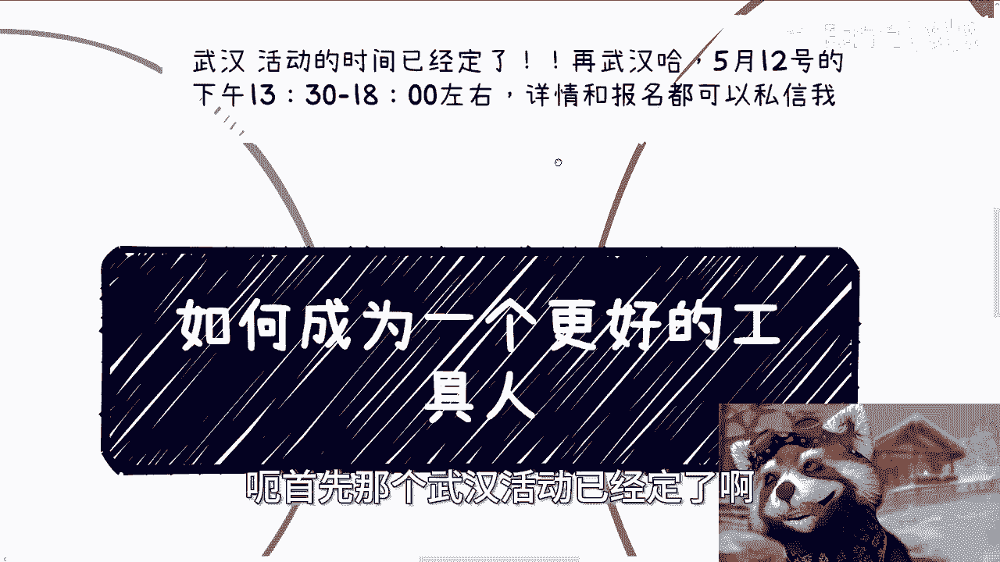

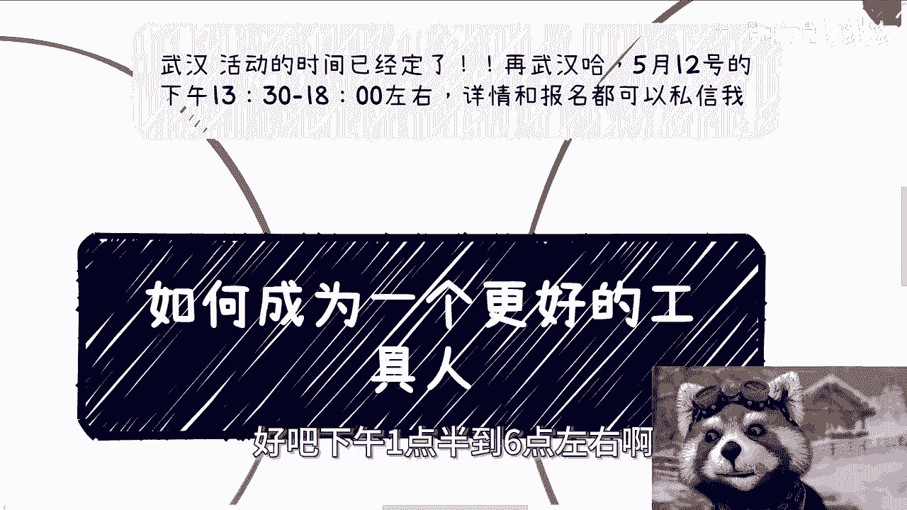

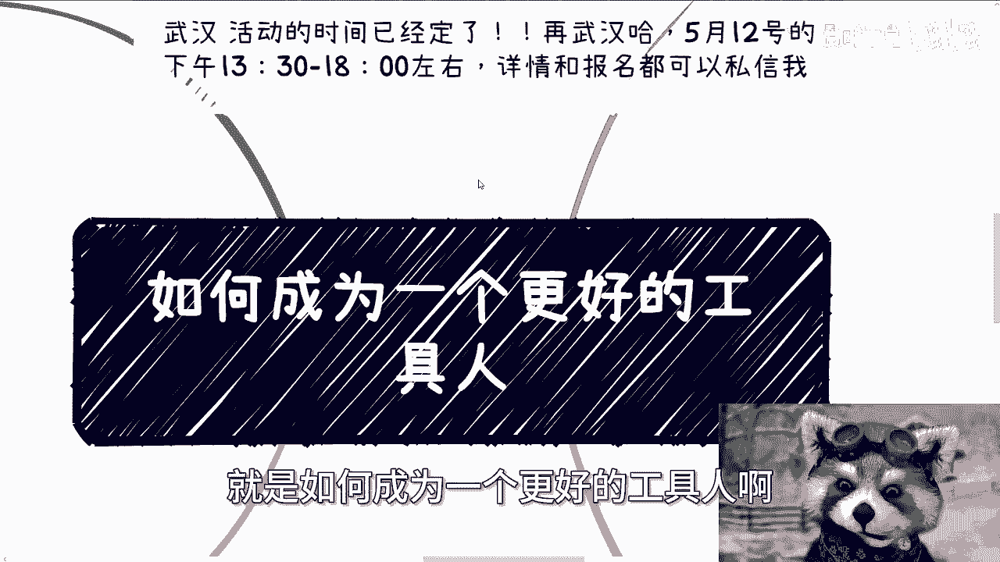

在本节课中，我们将探讨“工具人”这一概念在社会层面的实际应用。我们将分析打工与商业合作中“工具人”逻辑的本质区别，并学习如何通过建立清晰的个人标签、积累案例与信任，来成为一个更高效、更被需要的合作者。

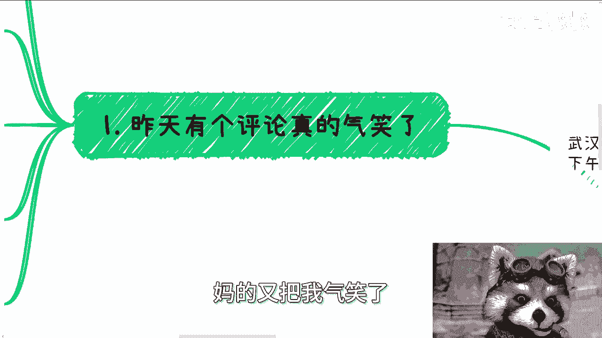

---

## 概述：工具人的两种逻辑

首先需要明确，“工具人”在社会宏观层面是一个普遍现象。每个人都在社会协作网络中扮演特定角色，服务于更上层的需求。然而，打工场景下的“工具人”与商业合作中的“工具人”，其底层逻辑截然不同。

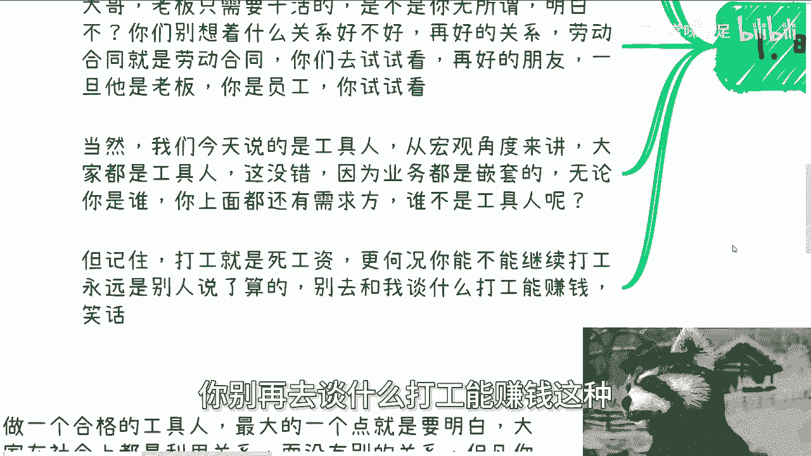

上一节我们介绍了“工具人”概念的普遍性，本节中我们来看看这两种逻辑的核心区别。

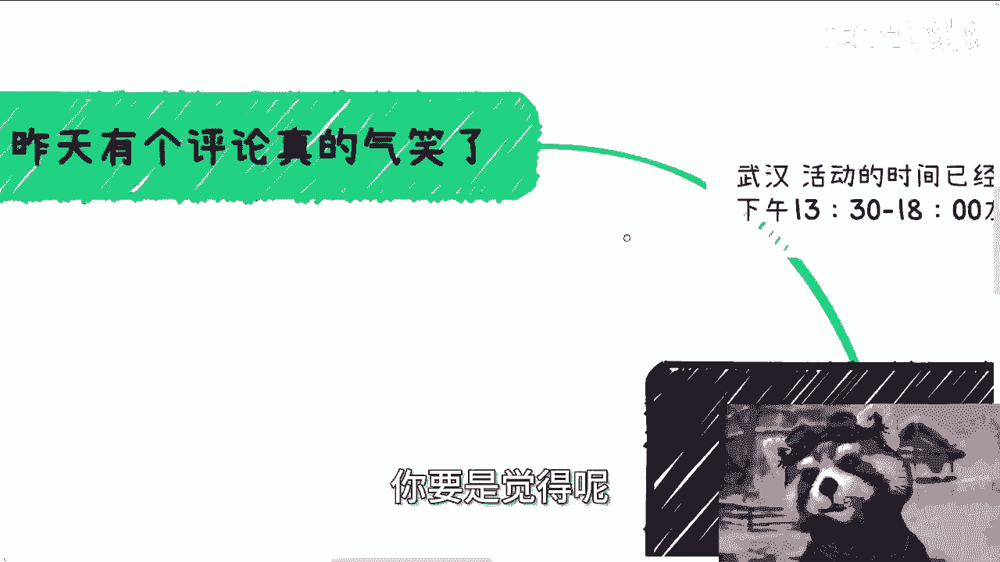

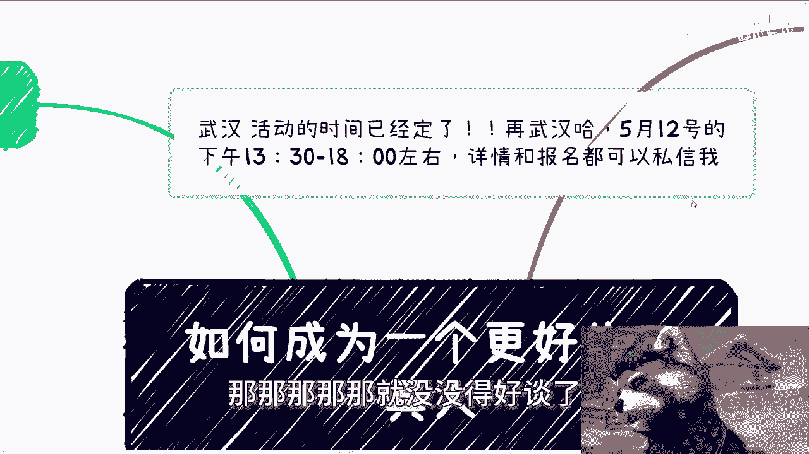

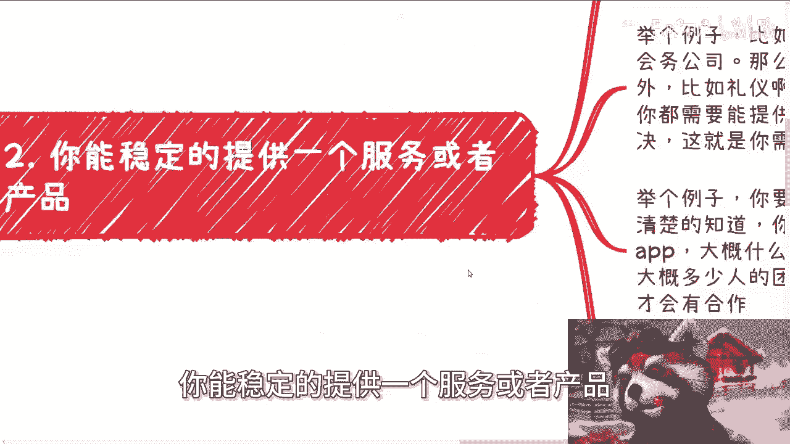

打工场景中，关系本质是**雇佣合同**。资本家或老板的核心考量是**成本**。谁能以更低的成本完成工作，谁就会被选择。个人的情感、学历或过往关系在成本面前都显得次要。劳动合同界定了这种纯粹的利益交换关系。

而社会层面的商业合作则不同。合作的基础是**价值交换**与**信任建立**。大家因为你能解决特定问题而与你合作，这种关系可以持续并带来更多机会。

---

## 核心策略：如何成为一个更好的工具人

要成为一个在社会协作中更高效、更被需要的“工具人”，关键在于塑造清晰的个人价值并建立可靠的信誉。以下是具体的行动策略。

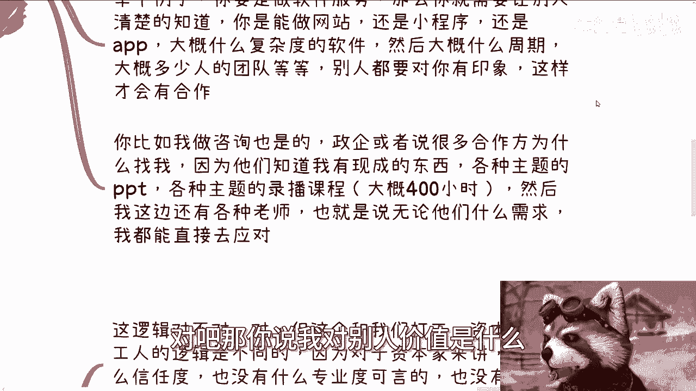

### 1. 提供稳定的服务或产品

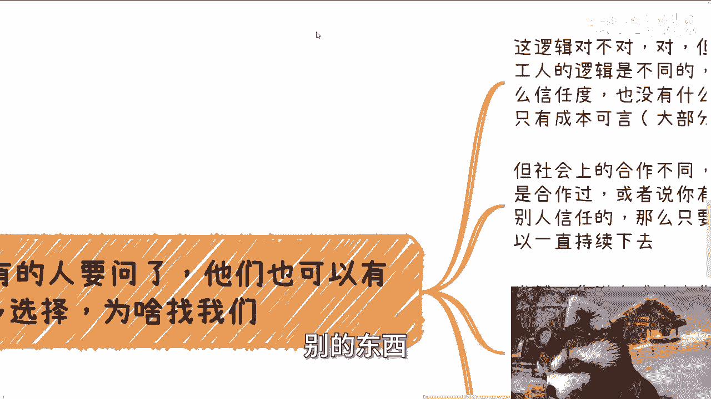

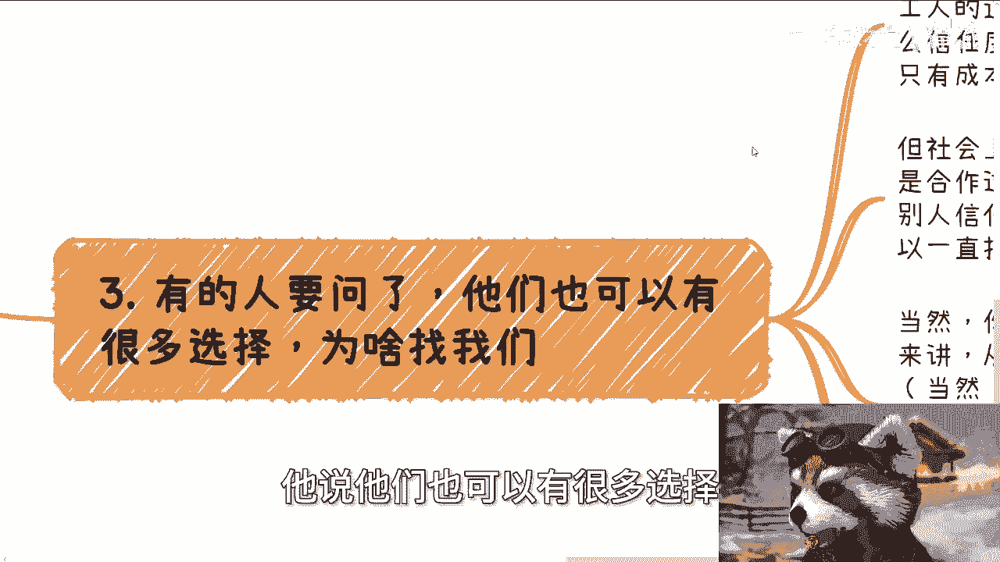

你需要在社会中拥有一个清晰的“标签”，即你在他人心中的刻板印象。这个印象具体化为你所能提供的**服务**或**产品**。

以下是建立标签的关键点：
*   **领域专精**：明确你能解决哪一类问题。例如，是举办活动、提供软件服务，还是专业咨询。
*   **解决方案成熟**：你应拥有该领域内成熟的方案、模板或资源库，能快速响应需求，而不是从零开始。
*   **资源整合能力**：即使某些环节非你亲为，你也应能快速找到对口的合作方解决问题，成为可靠的资源节点。

**公式**：你的社会价值 ≈ 你能提供的 **解决方案** × **响应速度**

### 2. 积累核心合作方

你不需要让所有人都认识你，关键在于积累若干个核心合作方。当这些合作方遇到特定领域的问题时，能第一时间想到你。

以下是积累合作方的要点：
*   **质量优于数量**：专注于服务好少数能带来高质量合作的伙伴。
*   **成为首选**：通过可靠的表现，让你在他们心中成为解决某类问题的“默认选项”。
*   **超越成本竞争**：在商业合作中，一旦建立信任，对方不会单纯因微小成本差异而更换伙伴，除非成本差距巨大或供需关系已不匹配。

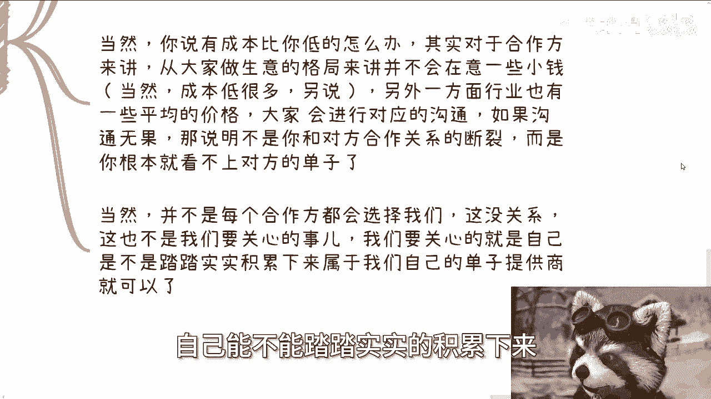

### 3. 依靠案例与信任

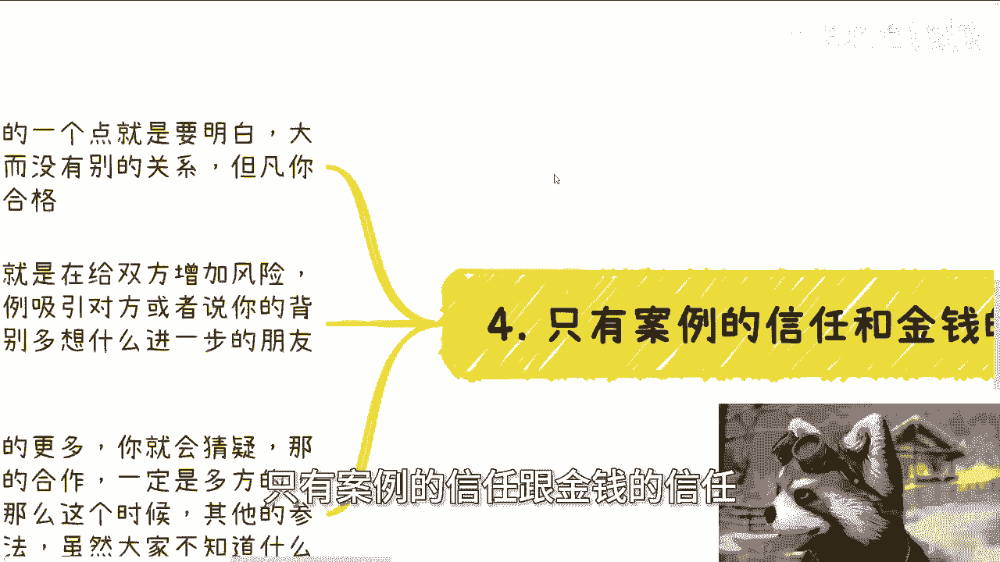

在社会合作中，维系关系的核心是**案例信任**与**金钱信任**，而非情感。

以下是维护健康合作关系的原则：
*   **纯粹利用关系**：认清合作本质是价值互换，避免掺杂过多私人感情，这能减少猜疑、压价和被白嫖的风险。
*   **用案例说话**：过往的成功案例和行业背书是你最好的名片。
*   **聚焦共同目标**：合作各方应聚焦于如何高效完成项目并分享利润，清晰的利益关系比模糊的情感纽带更稳固。

---

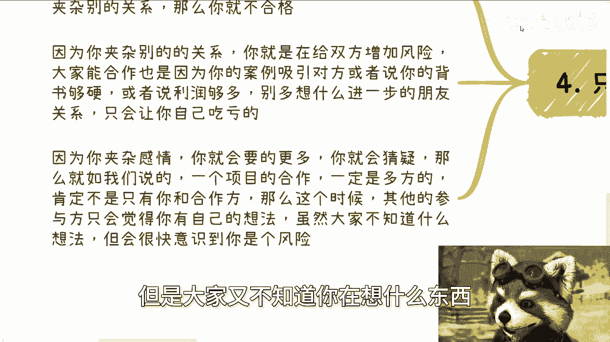

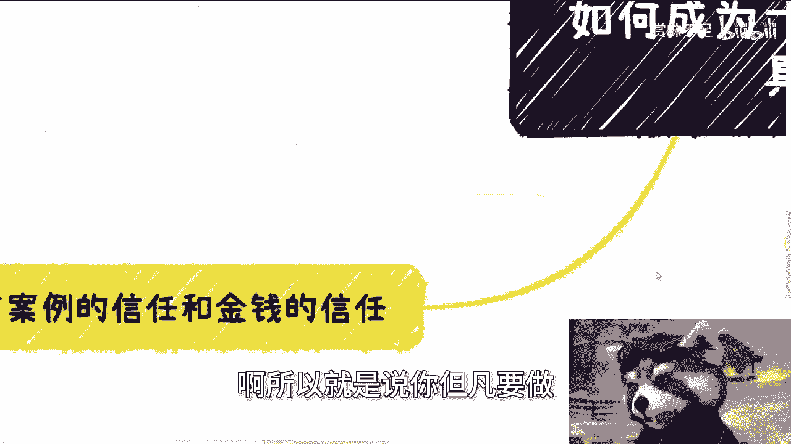

## 总结与行动建议

本节课中我们一起学习了在社会层面成为“更好工具人”的核心逻辑与方法。

**核心总结**：
1.  **区分逻辑**：认清打工（成本优先）与社会合作（价值与信任优先）的本质不同。
2.  **打造标签**：专注于一个领域，塑造清晰、专业、能提供完整解决方案的个人印象。
3.  **深耕关系**：积累少数核心合作方，用可靠性和成功案例建立深厚信任。
4.  **保持纯粹**：维护以案例和利益为基础的清晰合作关系，避免情感因素干扰商业判断。

最终，成为一个更好“工具人”的根源在于：当别人需要解决某个特定问题时，**能否第一时间想到你**。这需要你持续地在自己选择的领域内深耕，并用实际行动积累信誉。

---

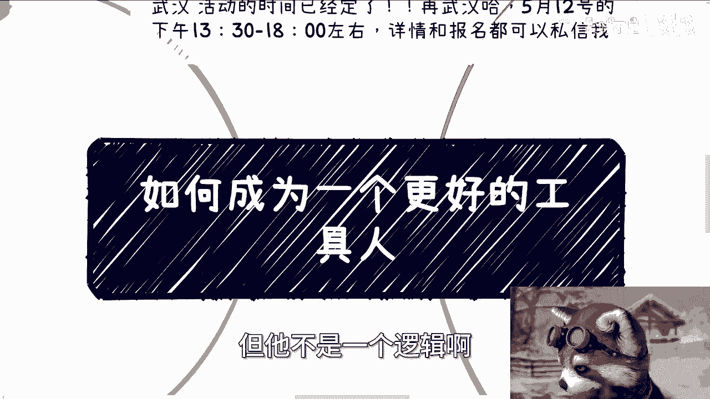

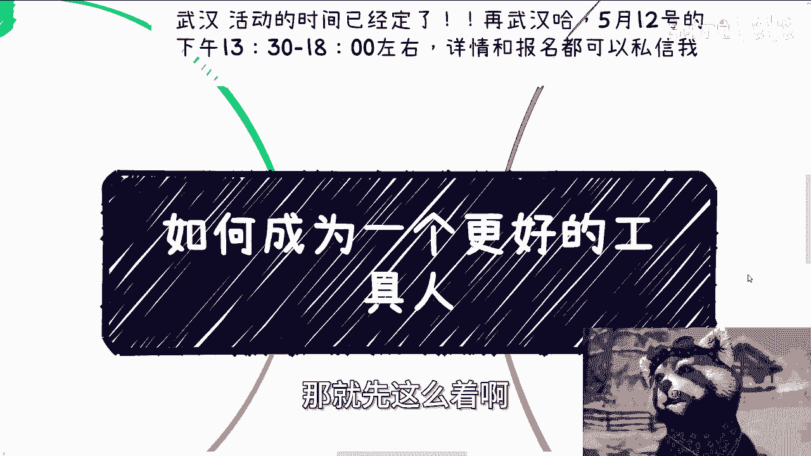

**附：武汉活动通知**
武汉线下活动已定于5月12日下午1:30至6点左右举行。详情与报名请私信。

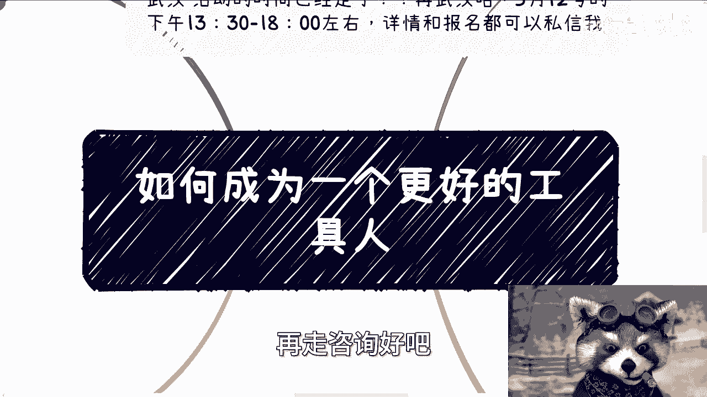

后续课程将涉及商业规划、职业规划、融资股权、商业计划书等话题。如果你有具体问题、合作资源或希望获得规划建议，可整理好问题后进行咨询。