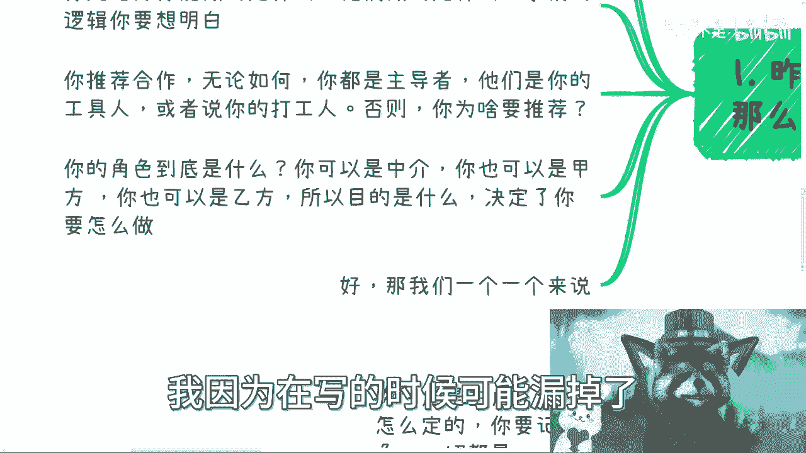
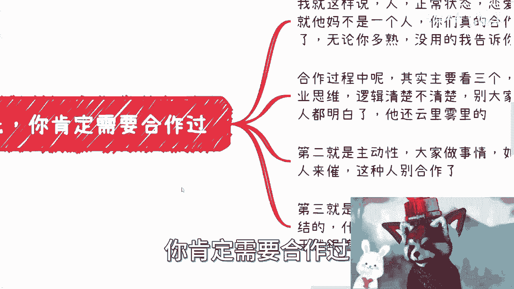
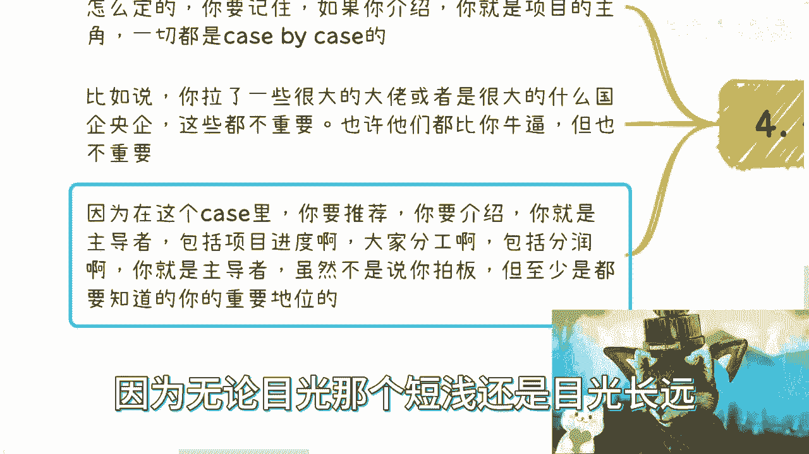

# 如何很好的推荐别人合作或者说和别人达成合作 - P1 - 赏味不足 - BV1Ug4y1X7Z4

哈喽大家好啊，今天礼拜礼拜四礼拜二，我本来是打算跟大家打一下，这个广州活动的广告的，但是我没有想到两天我就满了，我这是我，我对我刚跟产地方沟通了一下，比较尴尬哦，呃然后呢我在这个地方说一下。

就是我想了一下，我已经跟小伙伴说了，让他们已经在去找了，就是啊我想了一下，就难得来一趟嘛对吧，来一趟，那不能因为场地就搞得，就比如说大家有很多人见不到，或者有些东西聊不了啊，这样子我呢已经跟小伙伴说了。

就是会让他们在26号再找个场地啊，如果大家这个广州这边，还是有兴趣来参加活动的呢，就是你们可以继续报名啊，然后呢我们就会放到26号好吧，放到26号啊，因为25号满了好吧。

OK嗯嗯我待会会发再发个状态说一下啊。

那么今天这个内容呢是这样子，就如何很好地推荐合作。

或者说跟别人达成合作啊，因为上一期我们讲的是判断人，对不对哈。

好那么我们来讲这个东西啊，哎我的小浣熊怎么没对上呀，哎呀啊无所谓啊。

首先第一个啊，昨天我们说完认识人，那么推荐合作有那么几个前提啊。

第一你看啊，你跟这些推荐人或者介绍人有没有合作过对吧，你没有合作过，你怎么知道靠不靠谱，我跟你们说啊，就这个东西真的，你们但凡做过的人一定会明白啊，就这个事情就跟谈恋爱是一样的，就是一个人他正常状态。

恋爱状态他肯定是不一样的，我跟你讲商业也是一样的，你千万别觉得啊，你说哎我跟这个人比较熟了，比如比如说认识56年了，78年了啊，我跟他比如说共事对吧，就是比如说以前工作对吧，这个做了多久啊，怎么样子。

我跟你讲没有用的，就是你们但凡做过，你们就会知道有很多人在商业上面，这他妈的就简直是判若两人啊，判若两狗啊，你先想好，第二点呢就是说你先想好你能做什么，他们做的是什么对吧，事情的逻辑你得想明白。

第三就是你推荐合作，那无论如何，你得是主导者对吧，你说好，我我我推荐一个合作，不管是两个人，三个人的对吧，你说你你你介绍别人认识，那到最后啊把你踢掉了对吧，那你也很不开心啊，那么你要明白你是主导者。

他们不论是谁，一定是你的工具人，或者说你的打工人，否则你为什么要推荐，对不对哦，我推荐我帮别人做嫁衣，我妈脑子有毛病，要么好好，那么下一个就是你的角色到底是什么，就是你可以是中介，你也可以是甲方。

你也可以是乙方哦，那么所以呢你目的是什么，一定要想清楚，哎呀这个东西，这个东西我好像漏了啊，没关系啊，待会我会直接跟你们讲啊，我因为在写的时候可能漏掉了啊。

好那么我们一个来说，首先第一点你肯定需要合作过。

什么意思呢，你看啊我就这么说，人啊，正常状态，恋爱状态，商业状态，就他妈的不是一个人对吧，你们真的合作过，懂得自然懂啊，我跟你讲，无论你多你多熟，我他妈告诉你都没用啊，合作过程当中呢，其实主要看三个。

第一这个人的商业思维逻辑清楚不清楚对吧，你别就说哦，好像这个大家在那边讨论，比如说你说可能啊不因为你们三个人是，比如说你们三个人四个人啊，那很有可能你们三个人四个人还有团队对吧，下面的小伙伴啊。

你别到最后就是说啊大家开完会了啊，其他人都很明白啊，这个人还在云里雾里，哎这种就别了啊，别了，这第一个第二个呢就主动性对吧，我们以前也说过，就是大家做事情，如果他还是跟打工一样，别人来催的。

哎我跟你讲也别合作了，这种就是就是我们在以前在外企啊，他们讲的什么叫ownership对吧，就叫做自驱力，对主人翁已经是什么ownership，对他妈连ownership都没有，你做个屁啊，对不对。

然后第二个第三个就对于钱的认知和格局，就是很简单，就是说我跟你讲，总结下来就两点，第一你他对钱他不能太纠结对吧，你说哦大家可能这个单子打个比方啊，比如说这个单子就他妈的5万10万哦，你一共就这点钱。

你还在这跟我纠结个10%，500%分之多少有意义了，没有意义，这就像什么，你知道吗，这就像比如说这次我来广州对吧，我的合作方我现在也不是我合作方嘛，这次能够促成我在广州这个活动，是一个大一的小姑娘对吧。

你说一样的，比如说我来我请他吃饭啊，我我是跟他在那边纠结，就说哎那个300块钱啊，200块钱啊，这个哎呀，这个东西太贵了，再贵了50块钱，那他妈人家就会觉得我他妈的你脑子有毛病，对不对，那这是第一点。

第二点就是说他不能对钱太着急，就是你在过程当中，大家第一优先起事情，先把事情做好对吧，你说啊，就像我们以前说的，对钱着不着急，应应不应该着急，要要着急，但是你要分得清楚什么叫对外，什么叫对内。

就像我们以前说的，你画饼，你去忽悠你，对外忽悠，请你对外忽悠，你要表达你的情绪，请你对外去表达，你不要对我们自己人表达什么意思，就是你既然大家做一个项目，我们就是自己人啊。

你自己人就得你要有什么话说什么，你得真的怎么样就怎么样，你别把外面这套搬到自己升升上来啊对吧，就我们有很多人说的，他吹牛逼在那边吹吹吹，后来把自己绕进去了对啊，那么这是第一点。

第二点呢就是记住所有的方案跟分润和分工，你得先想好，那我发现啊真的很多小伙伴做事呢，他是没有方案的，那当然他会跟你讲，哎吕老师，那我不懂哎，我跟你讲，你不懂，那你慢慢学，或者你慢慢去了解。

或或者你可以找人去沟通，对不对，那你没有，你既然没有的话，你你做你做啥，你撮合啥，你拉啥皮条呢，对不对，就是你但凡没有这事，你先别做啊，你做了后面都是就你会发现你没有，然后呢你又去做，做了呢。

后面都是风险，然后呢你又很抑郁，这不就是个恶性循环吗，对不对，你别担，我跟你讲啊，你别担心你自己会不会或者想不想的全面，这就我昨天那个视频跟你们讲的，就是说你问问题，那是你的权利。

你想方案也是你的权利哦，难道他妈的我今天拉拉拉两个国企合作，就因为他们是国企，我是老百姓好，那么我就自己觉得的，我是，我就不能出方案，我出方案他们肯定否掉，那凭什么为什么啊，合作大家既然是合作。

为什么不是平等平起平坐的了哦，还有这种道理的，对不对，就是我跟你说，你一旦想主动合作，或者你想撮合一件事情，你方案一定是你出的，你别指望别人出啊对吧，包括方案里面的细节，包括分工，你都得你出啊。

你指望别人出，怎么可能呢，哎你们想想看，这就像什么，这就像你们出去买东西对吧，哎你们想想，看到菜市场在别的地方买东西都怎么买的，都是来我买把葱，我买把这个胡萝卜买，把这个青菜对吧，哎这个东西定价。

比如说他定三块五对吧，你跟他说哎老板三块钱行不行，两块钱行不行，你没有这种跑过去，老板全哥青菜，你说你说吧，你说多少钱，有没啦没有的呀，对不对，因为从做生意角度来，大家都懂的，生意是有利润的，对不对。

那么他定三块五就说明他一定是有溢价的，对不对对吧，那么你这个时候为什么要讨价还价，就是因为大家平起平坐，每个人都在争取每个人的利益才讨价还价，你不能跑过去说，你什么都不知道，你跑过去来老板，你说吧。

那老板跟你说，他他妈你让我说20块钱，不是你说对不对，就是就是你很奇怪，你知道吧，你一开始逻辑就不对对吧，你从一开始你说你作为撮撮合方，或者你想介绍大家认识的，那么你要明白你是主角，不是说就大家来对吧。

来喝个咖啡吃个饭，然后到底怎么做呢，哦不知道你们聊，那你照你这么说，他妈的不挑你单挑谁单啊，他妈不跳，你在那活该，这叫对吧，那么嗯其实这个就跟我以前说的一样，就是说你出去跟企业谈。

或者你跟我谈都一样的对吧，你说刘老师我们合作一下，你但凡这句话我怎么合作，我怎么知道我要和合不合作，我要怎么知道合作什么东西啊，我是要合作吗，我是求着你吗，没有呀，对不对。

那同样的道理就是说你说我合作没问题，我都open的，那你得告诉我我们合作什么东西，你干嘛我干嘛，大概有多少利润，你能出多少，我能出多少，对不啦，但你不是来问我，你问我干嘛，又不是我要做。

这跟不跟我有什么关系了，就很奇怪呀，你说是不了，我跟你讲，真的很多人跑过来说，陆老师我也想合作，那我就等了，你倒是说呀对了，你让我说嘛，我又不想合作，那跟我有什么关系啊，对不对，就我跟你讲啊。

很多小伙伴也说了，他说我想不清楚对吧，他说我也不知道应该怎么想，那我跟你讲啊，你想不清楚就是别去别去着急介绍或推荐，你就先从两个人的事情开始做，就是比如说你跟我对吧，或者你跟别人就两个人关系简单一点。

你上来就搞三角关系，就或者四角关系都别搞，你知道吧啊好，那么我刚刚说还有一个漏掉的，我来说一下啊，就是你的角色你一定要明白，就是你要定位清楚，在这当中没有对和错的，你得定位清楚。

就是你到底是中介还是甲方还是乙方，什么意思啊，就是说如果你是中介，那么你就定好，你告诉大家啊，我就是介绍方，这位是甲方好，这位是乙方对吧，大家怎么合作啊，我应该怎么分析，我拿渠道费对吧。

还是说我拿什么费用，对不对好，那如果你想做甲方或乙方，那么你给对方表达的是什么，首先第一点你要隔绝甲方跟乙方的信息啊，哦你让两方信息都透明了，那他妈要你有何用啊，对不对哦，你如果想做甲方。

那么你要跟乙方就是说啊，我就是甲方，我就是怎么样子，你就把甲方资源都说成你的，怎么滴了呢，对不对，怎么滴了呢，你最终要把信息隔绝掉对吧，该签合同，你跟甲方签外包合同不就结束了吗，对不对，那同样的。

如果你说我不要的，我要做乙方对吧，也可以的，那你就隔绝乙方跟甲方的信息，然后你就跟甲方开始说，你你把乙方的资源都说成你的，这不这不就是这样子的吗，对不对啊，当然啊，当然啊，还是那句话啊。

就是说你要明白一点啊，你在外面做切，我就这么说吧，你不能自己有很多人是这样的，我你说他吕老师，他说刘老师，你这么讲的，我跟你讲，你千万不要什么，你千万不要什么，跑到甲方这边说，哎那个我是乙方的谁谁谁。

那不是吗，对不对，就是你要真的这么做，你要把乙方隐隐隐藏好啊，保护好啊，对不对，你想啊，你你在那边跟甲方透露了乙方是谁，或者说你跟别人透露了乙方是乙方，早晚要知道他妈不找你，他妈的打官司吗，对不对。

就是我的意思就是说商业上你可以这么做，但是你要做的好，你要把信息隔绝好，你但凡格局不好，那那肯定干你啊对吧，你别到最后就说哎，刘老师，你当时怎么讲的好了，现在搞得我里外不是人，那你里外不是人。

是你不行啊，你里外不是人啊，对吧哦，你自己想想看，你做这件事情的目的是什么，不就是为了拿到更高的利润吗，你有更高的利润，就有更高的风险啊，你想赚更多的钱，又不愿意又不愿意去那个叫什么。

又不愿意去承担风险，那你搞屁啊，对不对啊，那么最后就是我们的角色啊，你呢一定是主角，你呢也别管别人是谁啊，也别管最后的方案怎么定，你要记住啊，如果你介绍你就这个项目的主角就是你的。

你们的合作是项目白项目的，你知道吧，case by case的，也就是说你拉了一些大佬或者国企，央企，这些不重要，因为他们也许比你都牛逼，但是在这个项目里面，你是组织者，那么你就是老大，你管他们是谁呢。

哦项目当中，难道还因为你是一个什么政府官员哦，那个人因为什么哦，然后在这项目里面我还跪舔你，大家都自己人，什么叫自己人啦，对不啦，就是我们一起合作，这叫自己人对吧，你要说啊，我还得跪舔你哦。

那边嘛我还得看你脸色，那他妈合作个屁呀，别合租，你知道吗，早晚得散伙，早晚得他妈的大家闹矛盾，一个道理啊，那么我跟你讲，这种事情都是相辅相成的，就是你想让别人不跳单，可以的，那么你得让他们明白。

你的脑子很清楚，你你其实是有一个主导权的，你是有这个领导力的，你是能够在这里面把大家事情想清楚的，那么我跟你说，不管是你要这么想啊，正经的人，他会心服口服，他认为我是愿意跟你合作的。

你要说那些心里有小九九的对吧，背后就是那种想给你穿小鞋的小人，那他可能也碍于就是说你的这种思维，逻辑比较清晰对吧，或者说你你这种气场，他也不敢在这里面有什么小动作，对不对，因为所有人做事情是一样的呀。

就是我们说所有人做事情，他最最根根本点，如果他是赚钱的话，那么他的根本就在于说，如果我尽量给你穿小鞋，对不对好，那么我会去考虑一件事情，就是我到底是跟你合作赚钱赚的多，还是我给你穿小鞋，我得到利益多。

对不对，如果你给他树立的是一个你，你你是一个脑子很清楚的，商业逻辑比较清晰的对吧，他跟你作为朋友比，作为敌人，未来的收益要高得多，那他为什么要给你穿小鞋呢，对不对，他为什么要挑你，单单没有必要的呀。

对吧，因为无论目光短浅还是目光长远。

他赚钱这个逻辑他脑子里肯定懂的对吧，他自己想想哦，我今天跟你有机会跟你合作对吧。

我哪怕就赚了2万块钱，赚3万块钱，那么我也许啊，我我比如说这个这个这个背刺你一下对吧，我能赚个56万，但是很有可能就这一次以后就没有合作了，但拉黑了，那还怎么合作了，对不对，每个人会考虑的呀。

那你反过来说，那有些人就不会考虑他就他妈没脑子的，那都没脑子了，还care他干什么呢，对不对，真的我跟你讲啊，很多人想想问题，我真的觉得就就很神奇，你居然今天前两天有一个评论也是的，他就跟我说。

他说他说啊这个嗯老百姓赚钱很难对吧，然后呢，那么就要保护自己的资产对吧，然后就说到我说的抗风险性对吧，那怎么样怎么样，我说你说的都对呀，哥哥，所以我才用了这么多视频。

将近200多300多个视频来告诉大家，大家应该怎么去高效的赚钱，而不是说一天到晚在那边想着说哎呀，为什么我赚不到钱，或者说我赚的钱这么少，或者说我应该怎么去理财，我说这不是我们要去想的呀。

我说我们连钱都还没赚到，你想这些东西干嘛对吧，这是我们应该操的心吗对吧，他就他就跟我说，我辛辛苦苦一年就赚了10万块钱，那我怎么守住这个财，那我说守个屁啊，你应该考虑的是。

为什么辛辛苦苦才赚了10万块钱，对不对，你要提升你的效率嘛，这就是问题吗，没有办法的，这是个客观事实，怎么办呢，对不对，就是不要老是去想外界的问题啊，你说在那边想各种各样问题，然后自己停滞不前的。

而且就像我说的，我们每个人都为自己考虑就好了，你问为别人考虑干嘛，你们又不是活菩萨对吧，嗯好吧啊行嗯，反正就这么着吧，啊就这么着吧，哎呀好，然后广州这边呢，我大概这周吧我会有一些定论，好吧。

就是26号那场，反正25号这场就满了，我待会再发个这个消息跟大家说一下，好吧行。

那就这么着吧。