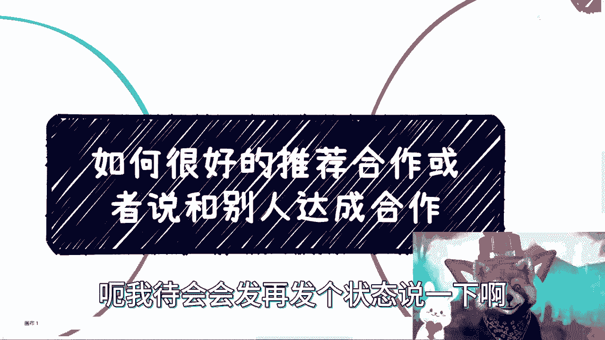
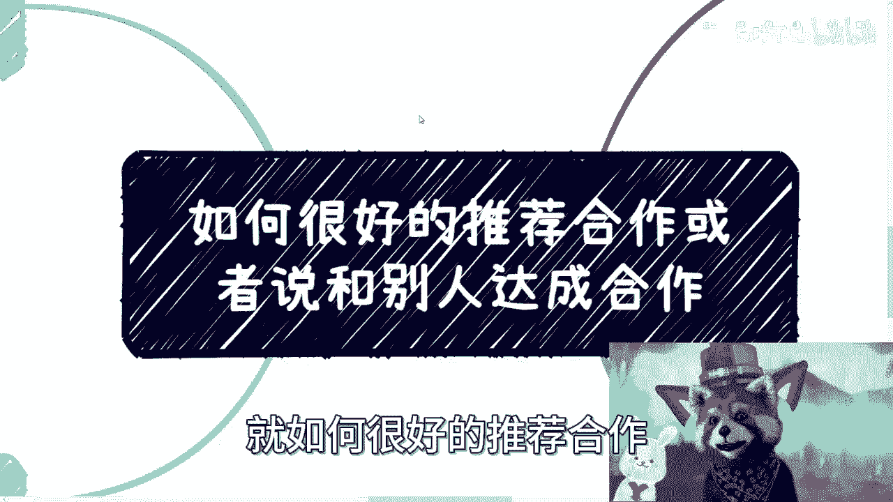
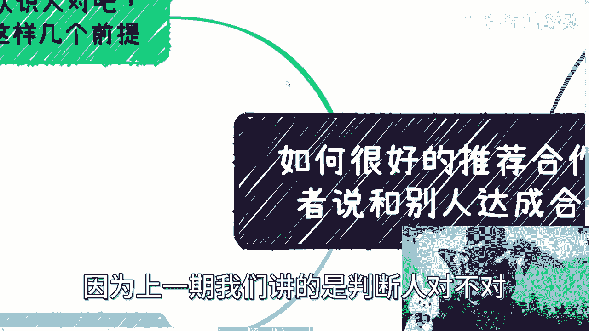
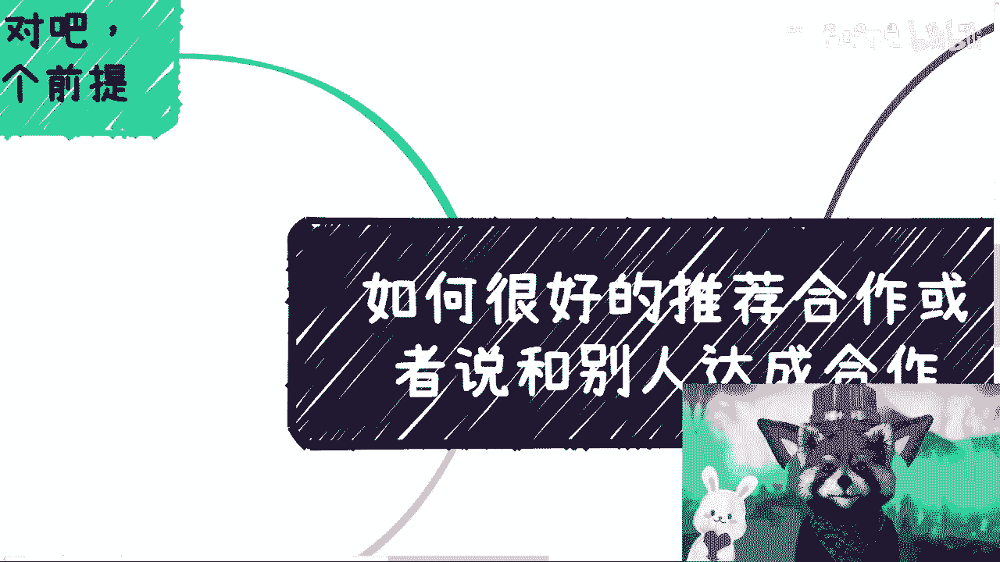
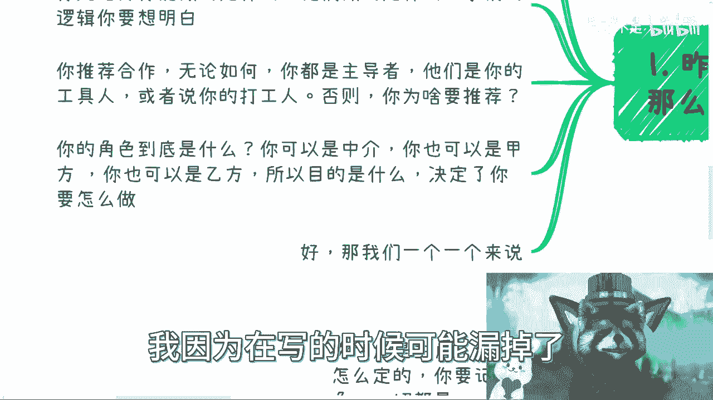
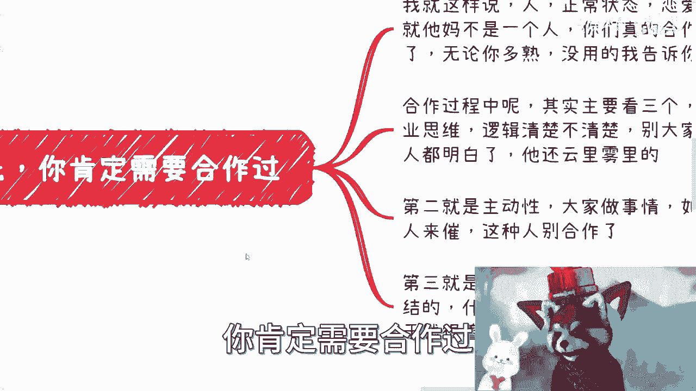
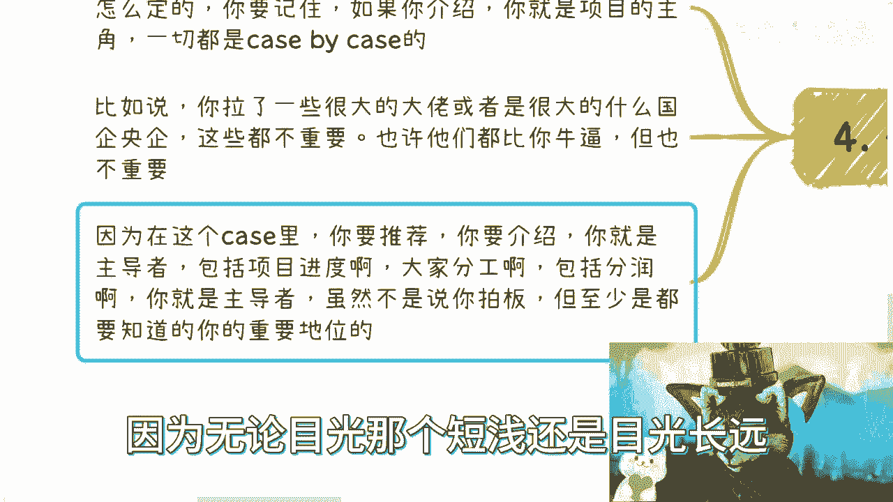
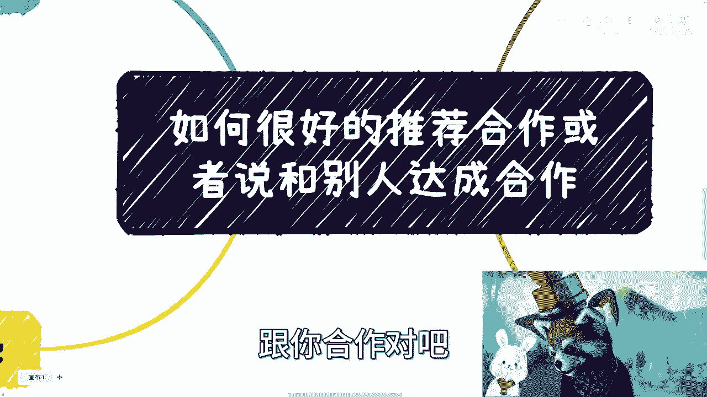
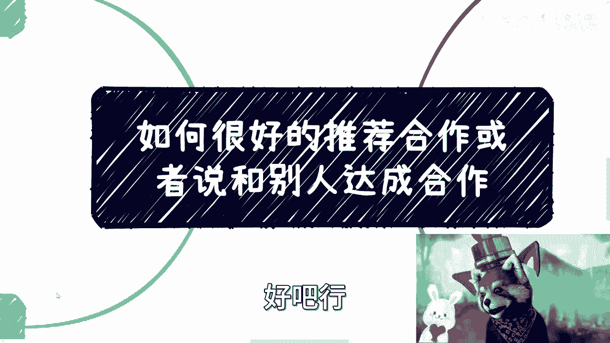

# 合作指南 P1：如何有效促成合作 🤝

在本节课中，我们将学习如何有效地推荐合作或与他人达成合作。上一期我们讨论了如何判断人，本节我们将聚焦于促成合作的具体前提和策略。

## 课程概述

促成合作有几个关键前提需要首先明确。以下是几个核心要点。

### 合作前提一：必须有过实际合作

首先，你需要与潜在的推荐人或合作方有过实际合作。没有合作过，你无法判断对方是否可靠。商业合作与日常交往或恋爱状态截然不同，很多人在商业环境中的表现会判若两人。合作过程中主要考察三点：
1.  **商业思维逻辑是否清晰**：确保在讨论中，所有人都能理解项目逻辑，而不是云里雾里。
2.  **主动性（Ownership）**：合作方需要有自驱力，不能像打工一样需要别人催促。
3.  **对钱的认知和格局**：
    *   **不能太纠结**：在小额利润上过度计较百分比没有意义。
    *   **不能太着急**：合作中应优先把事情做好，对内要坦诚，不要把对外“画饼”或忽悠的那套用在自己人身上。

### 合作前提二：预先规划方案、分工与分润

其次，记住所有的方案、利润分配和分工，都必须由你预先想好。很多人在没有明确方案的情况下就急于撮合，这会带来巨大风险。作为合作的发起人或撮合方，你有权利和义务提出初步方案。合作是平等的，不要因为对方是“大佬”或大机构就怯于提出自己的想法。这就像在市场买菜，定价权（方案发起权）在卖方（项目主导方），而买方（合作方）可以在此基础上讨价还价（讨论修改）。如果你说“我想合作”，那么你就需要告诉对方“合作什么、怎么做、利润如何、各自付出什么”，而不是等待对方来问你怎么做。

### 合作前提三：明确并坚守你的角色定位

最后，你必须清楚自己在合作中的角色定位。角色没有对错，但必须清晰，通常有三种：
*   **中介**：明确告知各方你是介绍方，并约定好你应得的渠道费或佣金。
*   **甲方或乙方**：如果你想成为甲方或乙方，关键在于**隔绝信息**。
    *   做甲方：将乙方资源包装成自己的，与最终客户签合同。
    *   做乙方：将甲方资源包装成自己的，与执行方签合同。
    *   **核心公式**：`更高利润 = 更高风险`。想赚更多钱，就需要承担信息隔绝带来的风险，并做好风险管控。

### 核心原则：你必须是项目的主导者

无论合作方是谁，在这个具体的合作项目中，作为组织者的你，就是主角和老大。合作是**项目制（Case by Case）**的。你需要通过清晰的思维、逻辑和领导力，让正经的合作者心服口服，让有心怀不轨的人不敢轻举妄动。因为对于理性的人而言，与你长期合作带来的收益，远高于一次“背刺”的短期利益。你需要树立一个形象：**作为朋友（合作者）的未来收益，远高于成为敌人**。

## 课程总结

本节课我们一起学习了促成有效合作的三个核心前提：
1.  **基于实际合作经验**判断对方的商业可靠性。
2.  **由主导方预先制定**清晰的方案、分工与分润计划。
3.  **明确自身角色**（中介、甲方或乙方）并做好相应的信息管理。

同时，我们确立了根本原则：在具体合作项目中，**发起者即主导者**，必须通过展现清晰的商业逻辑和领导力来稳固自己的核心地位，确保合作顺利推进。