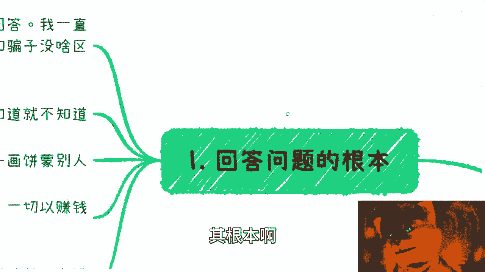
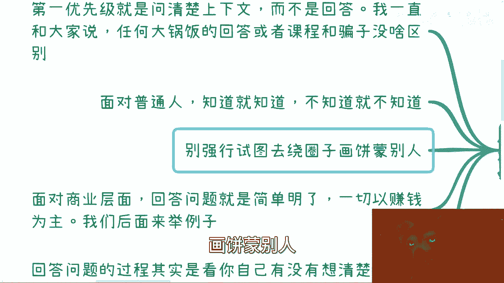
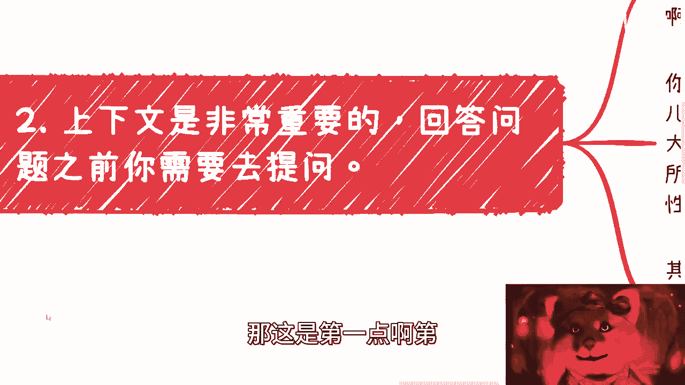
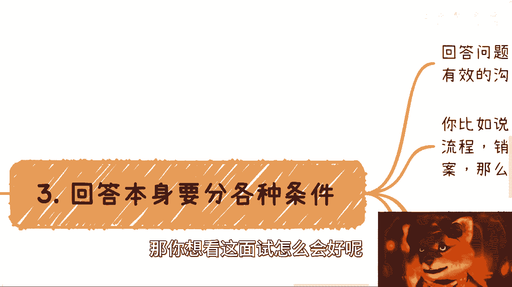
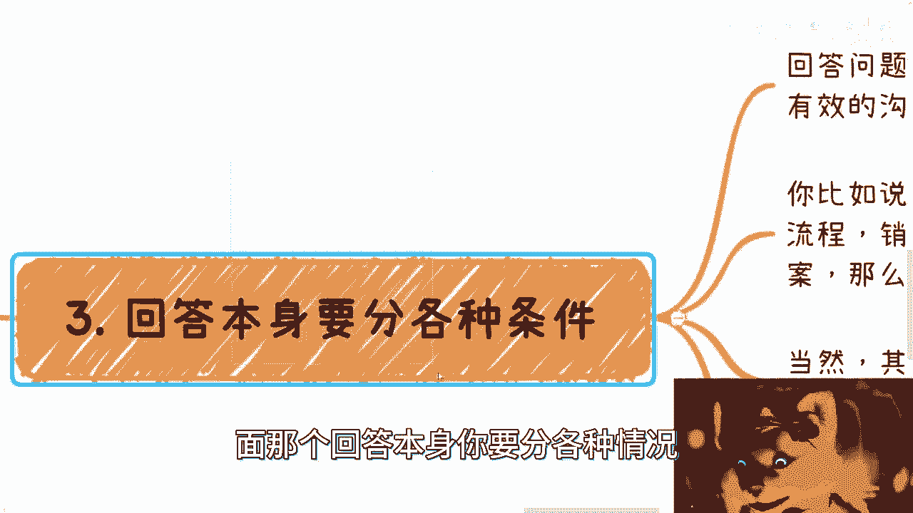
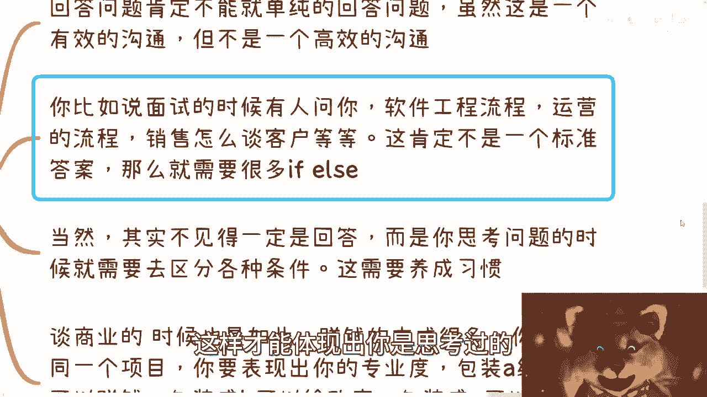
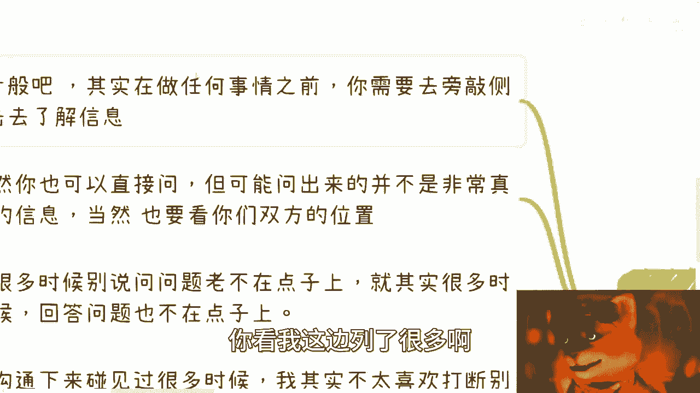
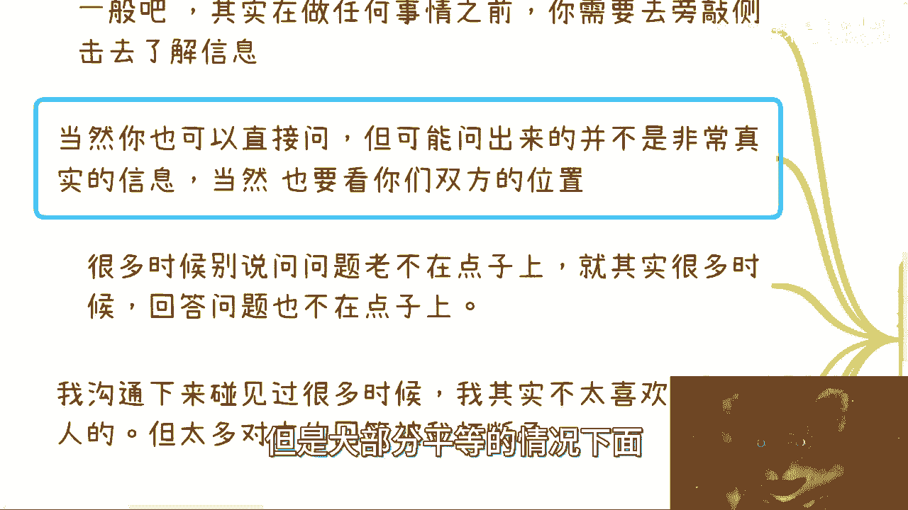
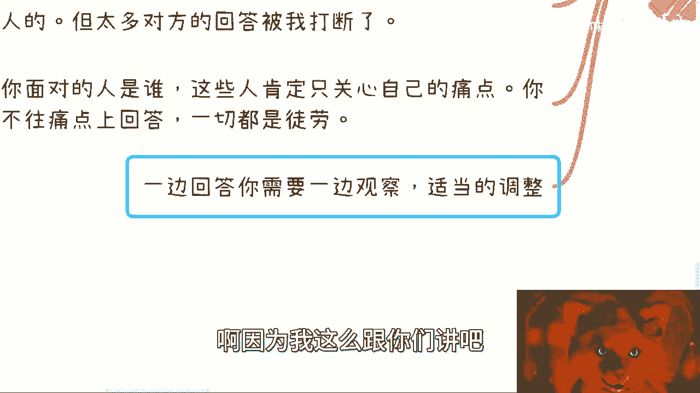

# 如何正确的回答问题（如何提问的姐妹篇） - P1 - 赏味不足 - BV1tm4y1h7Dp

啊大家好啊，对我知道你们看到这视频的时候，肯定又在想了，吕老师又来卷了是吧，对因为今天晚上有个小伙伴跟我提了这个点，我觉得他特别好，但是我不录了，我就觉得如坐针毡，浑身不舒服，还把他录了算了对吧。

所以就是就你看我弄了一个小姐妹是吧，就就姐妹篇，哎哎我这个真的我跟你们讲，这个这个这个女的这个眼睛特别好看。

哈哈哈哈对吧，因为之前我们说了如何提问题是吧，那自然的啊，今天晚上小伙伴也说，他说呃我觉得可以出一期如何正确的回答问题，哎我想了一下，也有点道理啊。

呃然后呢我在这地方写了一个大前提啊，本内容不包括任何画饼的内容，因为画饼的回答跟我们现在所说的这个回答，就不是一回事啊，所以这个回头呢就我先把这个前提下去啊，别大家到时候觉得啊是不是对所有人都这样好。

那么回答问题呢，我觉得是这样子的，其实根本啊。

首先我认为回答问题最最优先级的地方在哪呢，就是问清楚上下文啊，直接回，你知道吗，我跟你说这个事情也是一样的，就是我一直跟大家说啊，你你会发现这个外面任何大锅饭的回答，或者课程跟骗子是没有区别的。

我跟你们讲，你们怎么判断一个人靠不靠谱呢，很简单，就是你去问他问题，我就这么跟你讲啊，无论你问的中文的细，你肯定是有你漏掉的东西的，也有对方想知道你没有说的东西的，那么对方怎么看他靠不靠谱呢。

就看他是不是一开始来问你问题，你知道吗，他但凡给你到达如流对吧，开始吧，在那边一顿输出猛如虎，我跟你讲，这他妈跟骗子没什么区别，为什么呢，因为他跟你这跟你这么操作猛如虎，跟别人去操作猛如虎啊。

没有区别的啊，但是他这个回答对你有意义的，没有意义的，你知道吗，就所以他根本就没有过脑子，没有更好，更就没有根本的去思考你的问题。

你说这种人怎么会靠谱，对不对，那这是第一个，第二个呢，我觉得你面对普通人，或者面对正常的一些这个流程，比如说面试啊或者其他东西啊，你知道就知道，不知道就不知道，你别试图在这个地方，你别强行试图去绕圈子。

画饼蒙别人。

你知道吗，你看我就是的对吧，就是我出去面试也好，包括你们问我问题也好，你你你会发现点我不知道，我就告诉你，不知道我就会告诉你，唉这个事情超纲了对吧，我的确不懂对吧，我说我我也怕我说了，就是误导你对吧。

或者怎么样子，或者或者到时候我说了，人家真的很专业的人来喷我是吧，你看我但凡不知道的，我就说我不知道，我也不说我是吧，就这么回事，你试图去绕圈子，蒙别人没有用的，我跟你讲，就是早晚都是要被知道的啊。

没没有太大意义的，而且就是说这个看你要干什么，你要就像我刚刚一开始说的，你要但凡今天想要去，就是说画饼去这个找个就业对吧，就就个值，我觉得这倒无所谓的对吧，但是你要说这个你想啊这个做自己品牌的。

或者你就是啊要要要要跟别人商业合作的，或者怎么样子的，我跟你说啊，有一说一，有二说二，实事求是就好了啊，那么还有呢面对商业层面呢，我觉得回答就很简单明了，就是一切是以赚钱为主的。

这个后面我们会来举例子的啊，回来举例子，我们到时候再说好吧，然后还有呢就是回答问题这个过程当中呢，其实呃你得看你自己有没有想清楚，因为呃有没有这个思考过程，因为什么，因为你可以今天不是来诶。

我看看回答问题啊，对对对，就是你回我怎么弄完了就回答问题，这个事情是这样子的，你回答的过程当中呢，别人无论别人问你什么啊，你在说的时候，其实别人也在思考，就是你到底有自己有没有比较清楚，你知道吧。

因为往往我们说一个稍微有点经验的人，去看一个回答的时候，他可能不见得当面戳穿你啊，但是你但凡是属于那种，你没有自己自己就没想清楚过的，或者你就没有思考过的，或者你就没有实践过的。

或者你就没有任何的经验的，其实对方很多人他是听得出来的，他只是可能不像我这么直接，头发直接没直接指着你鼻子骂你，你说是吧，但是呢就是说他可能也就知道啊，你这个人就不太靠谱，你知道吧。

所以说呢就是你们一定要明白，就是说提问是一回事，回答其实也是一回事啊。

但是这个里面道道营养多的是吧，那这是第一点啊。

第二点呢就是上下文呢我跟你讲是非常重要的，回答问题之前你需要去提问啊。

需要去提问，我们来看啊，比如说啊你说这个你领导问你KPI怎么定，那很简单啊，你要但凡天天问我对吧，我不管你是谁啊，你问我我就会来，我先来问对吧，我不会来回你的，我先来问。

那我得要知道现在行业什么情况对吧，我得知道bu什么情况对吧，我得知道团队什么情况对吧，我得包括你的这个领导，你的领导的领导，你们的想法是什么，包括我们这个叫什么bu的，一个大的一个战略方向是什么。

因为很简单啊，你你每一年每个季度对吧，大家方向都不一样，每一每一个人的KPI都不一样对吧，那么那么我都不知道，否则我怎么知道咋定我的，打错了啊，就是否则我怎么知道怎么定呢对吧，就是我如果定了。

我其实就是个孤立的对吧，我就在solo对吧，那么而且你很容易被别人说你没有团队归属感，而且我跟你说，很多时候很尴尬的就是你领导是不管你的，管谁管你死活，你说是吧，你就订啊，定完之后呢。

他到时候还得说你哎呀，你你这个定的对吧，一点嘛都都没有大局观啊，定的吗，没有高度对吧，没有格局对吧，没有什么什么跟团队人家都脱钩的对吧，你还得跟他说，还得被他PUA，何必呢对吧，先先出这个出手为强。

你知道吧啊这是第一点，第二点，你比如说啊，你说比如某人有人问某某某行业好不好，是不是个人发展，你回答这玩意儿也是一样的，你回答这玩意你肯定不能直接回答对吧，你肯定当然某些公共场合。

你比如说我前天直播对吧，或者你说你就这个非常笼统的问我，那也可以啊，我也笼统的回答，但是这个回答跟你的个人肯定关系不大对吧，你比如说我做我到现在做所有咨询都是一样的，你们去就你们跟我做过咨询的。

你们都会就自己都知道啊，就是你们就算给我清楚的背景城市，个人的性格或者写清楚很多东西，我依然会问你们很多东西，就是我所有的咨询一上来都是我提问的啊，不是说哎呦你们给我个什么question list。

我就根据你们这个list开始答了，没有的，我，我跟你讲，有很多人什么都不告诉我的对吧，就给我一个question list，我怎么打法，我怎么知道是吧，哦我你说我但凡跟你说。

开始开始就是一顿操作猛如虎了对吧，然后我连你城市在哪里也不知道，我连你这个人几岁我也不知道，我也我连你擅长什么也不知道啊，我就回答了，那你这不是扯淡吗，是不是中国各个地方各个省市。

各个区每一个人做什么事情，然后每一个人的这个事情跟当下结合都不一样，你怎么可能是我就是完全的就是同一个solution，这个不现实的呀。

你说是不是，那还有那我跟你们讲，其实这一点在面上也很重要，因为为什么我之前有过那个面试的视频的，你们可以去看看，我跟你们讲啊，面试当中我一直非常主导的是什么，因为我自己面试过程当中，我就试验过很多遍。

但屡试不爽是什么呢，就是你一定要自己去掌握主动权，你不要老觉得啊什么你去面对吧，是是是别人提问，你回答不是的，我跟你讲，不是的，就是面试这个过程也是双方的一样的啊，他问你一个问题，那我你从我角度来讲。

我为什么要玩，不是我跟你抬杠对吧，而是说哎我的确对你这个公司不理解，我也的确对你团队不理解，我也的确对对很多东西不了解对吧，那你问我，我也会觉得你这问题问的本身就很，对不对，因为在上一期的那个里面。

我们也说过，就是如果对方问你个问题，我不管是技术问题还是什么问题对吧，你你要帮我把上下文补充清楚，你不补充，我觉得我就得来问题，对不对，所以说你要你不能一味的回答，而是说你要去提问。

这样的话你就会掌握整个的面试的主动权，你知道吧，很多时候你掌握主动权，慢慢慢慢你会发现节奏是被你带着的，那么节奏被你带着的，你就可以有办法取证，就是就是规避你的短处，发挥你的长处，你知道吗。

否则的话你说老是让对方提问。

你在那边啊啊这个回答不出来，然后你你老是说话，我不知道，我不知道，那你想看这面试怎么会好呢。

对不对啊，那第三个呢就是后面那个回答本身。

你要分各种情况，什么意思呢，就是第一啊，你回答问题肯定不能是单纯的回答问题，就比如说啊我们说啊，这个就比如说啊，就比如说你们来找我谈商业合作啊，我就问你们，我说那你们现在优势是什么对吧。

好你就跟我说你现在优势是什么对吧，就可能就直接回答说啊，我的优势就是说我能招生对吧，或者你说我我我我可能有政府合作的经验，或者怎么样，但是你说这个回答是回答吗，是回答就是他是个有效的沟通，没毛病啊。

我也知道了，但是这并不是一个高效沟通，什么意思呢，就是说你在回答的时候，你想想看，我问你这个问题，很有可能是我想知道整个面，你你就是你比如说你的优势除了这个以外，还有哪些，还有哪些更突出的优势。

然后有哪些你有别人没有的对吧，或者说更具象化的优势，你要把这个面讲出来对吧，或者说你在不同的受众，不同的场合下面，你可能有不同的长处或者不同的短板，你得告诉我对吧，但是我这里说了。

为什么不是个高效功能，是因为你回答完了之后，很有可能我就会感觉我还有很多疑问，我还会继续问，那么这个事情就变成了一问一答，一问一答就很浪费时间，那当然了，你说他是不是有效，我认为有效的。

但是它不是个高效的方式啊。

那这是第一点，第二点是你比如说有人面试时候啊，诶我怎么这么老打老少打字啊，有人问你，他说诶我鼠标了啊，有人问题，他就说哎你看啊，软件工程流程怎么一般怎么样子的对吧，你在软件过程当中怎么做开发的对吧。

怎么怎么做测试的对吧，然后运营的流程啊，销售怎么谈客户的对吧对吧等等等，你会发现啊，你去回答这个问题，你可能面试的时候紧张对吧，你说我就回答了，但其实你想想看，这肯定不是个标准答案对吧。

就是你这时候可以做两件事情，第一种就是你去问他对啊，你说哎你们平时这个这个项目节奏紧不紧啊，对吧，是不是一直996啊对吧，是不是，是不是那个一直这种项目周期改变了对吧，那不是你要去challenge它。

而是说你是了解情况，你才能回答这个问题，当然你要觉得你问不方便对吧，那也可以，那么你就自己去定很多if else，什么叫f else呢，就是你就告诉他，那在这个大公司里面啊。

在这个针对企业的客户当中对吧，在项目这个这个需求不不怎么变的情况下面好，我可能是这么流程，在针对政府客户对吧，在项目需求一直变的情况，我可能是这么个流程啊，在这种小项目对吧，小团队里面啊。

我可能是这么个流程，你自己得要给他提问，F4，你知道吗，就这个是一个标准的一个回答的模式，这样才能体现出你是思考过的。

当然啊我还是那句话啊，你你你这些东西讲出来是有依据的啊，或者是你有实践过的，别人老是这个道听途说，这个我跟你讲，你讲出来就会让你适得其反，你原本想讲的是蛮多的，你你道听途说，你会让对方觉得你就在扯淡。

哼你知道吧啊那么这个是一个，当然你看啊，其实不见得一定是回答，而是什么呢，你今天就算不回答，就比如说今天不是一个这种这种问答的形式啊，你在做任何实践的时候，你的思考问题的时候都是要去区分各种条件的。

就是把整个框框都框出来，然后在那边写fl就是哪种情况我可能怎么样，哪种情况我可能怎么样。

我跟你讲，这就是需要养成的习惯啊，然后还有呢，你比如说谈商业的时候也是这样子的，虽然我们说啊，你说这个赚钱的，这个这个赚钱这件事情是最终的目的对吧，没有错啊，但是你想想看，你跟别人去，比如说你跟我谈。

我问你啊，你想干嘛，你你来的目的是什么对吧，或者你觉得这个你想跟我怎么谈对吧，你总不能老是跟我说来这个吕老师，我们就为了赚钱屁话，他妈为了赚钱，你还用回答的是吧，那所以说你要怎么回答呢。

你要展现出你的专业性，比如说你要告诉我对吧，具体的你的优势或你的想法，比如说你觉得你现在这个项目对吧，怎么包装是给企业可以挣钱的，怎么包装给政府是可以挣钱的，怎么包装给学校怎么挣钱的对吧。

你怎么包装是通过给哪个部门，哪个厅局，哪个私是可以赚钱的对吧，然后呢你怎么包装对吧，这个东西是比如说啊，有的是在项目上可以挣钱的，有的在在会议上可以挣钱的，有的是可以在这个这个C端可以挣钱的。

你得把你的逻辑都讲明白对吧，那么你才说啊，我们在想说哎，在这里面我能怎么帮你，或者我的资源能怎么帮，你，能怎么挣钱，对不对，否则我跟你讲，你但凡不是这种回答，我我昨天我那天不是说了吗，提问你提问的不好。

就给你一次机会，我跟你讲，你回答回答不好，也他妈一次机会，因为在我觉得正常的所有的这种商，就是资本家眼里或者商人眼里，你回答不好就代表你没有思想，你没有想过，你根本不知道自己要什么，拉倒就是枪毙掉。

你知道吧啊，那么最后一点是什么呢，就是我觉得最核心的点是在于，你得知道对方要什么，就是我们一直说投其所好，投其所好，嘛对吧，你回答问题，你肯定得要知道对方要什么，否则就我跟你说。

你你可以跟别人很直接的阐述你想要什么，没问题的，但是这个不是重要的问题，这个不是重点。

你知道吗，重点是你得知道对方要什么啊，你看我这边列了很多啊。

首先一般啊我们在做任何事情之前，包括我现在去谈任何的客户之前，我都会旁敲侧击去了解问理解信息，我不管是通过他的合作方上下游，还是通过一些网络上的公开信息，我都会去了解，因为你只有理解了。

你才能知道他到底有什么问题啊对吧，包括就是说我我跟你们这么讲吧，我在很多的商业合作的时候，我在之前我就已经知道对方的痛点在什么地方，我就知道他们内部可能出了什么问题对吧，但是对方是不知道的。

对方就会觉得卧槽他妈的陈老师老牛逼了对吧，就好像这个一语中地是吧，然后就很想合作对吧，但是其实我是做过功课的，我不是没做过功课。

你说是吧，我跟你们讲任何事情都是一样的，你都得这么去做，你知道吗，这是第一点，第二点是当然你也可以直接问对吧，就像我也直接可以问对方，但是你可能问出来的这个对方，可能不是真实的信息啊对吧。

谁会没事情做说啊，我跟你可能第一次见对吧，第二次见，然后你问他阿姨现在有什么问题对吧，他就非常直白的告诉你啊，我们现在公司里面，或者我们现在在业务上面有什么很直接的问题，不一定答对吧。

当然你得看你们的位置，如果你是一个甲方爸爸，他是个乙方对吧，然后他又就就非要非要抱着你这棵大树对吧，那我觉得是可以的，但是大部分平等的情况下面。

你可能问不出什么真实的问题来呃，真实的信息来，对不对，那第三个呢就是很多时候呢我跟你说啊，我之前那个视频也说过，就是问问题呢老不在点子上，但其实很多时候啊回答问题也不在点子上。

是什么呢，你看啊，我跟很多人沟通下来一样的，我本身呢不是特别喜欢打断别人，但是太多的时候呢，对方的这个回答是被我打断的，为什么，因为很简单，就是我会问他，我说你有什么优势啊对吧。

或者说你你告诉我你以前做了什么对吧，或者说我就说啊，这个你觉得在你要比如说对方跟我说，他想做培训或者做直播对吧，或者或者做做做做土木对吧，或者做做建筑设计对吧，我就会问他，我说因为我也不了解。

或者说我可以假装我不了解啊，我就问他，你觉得在这里面你怎么赚钱对吧，好但是我就是我想知道他怎么赚钱的，这句话的潜台词是什么呢，就是你到底有什么优势，你的护城河是什么，你有哪些就是就是竞争力比较强的东西。

你有哪些资源对吧，就是别人没有的，或者说呃你对市场理解怎么样对吧，市场现在是好还是不好的，竞争激不激烈对吧，我想知道这些事情，然后他就跟我怎么回答，他就跟我说哦，这个啊这个就是说哎我有个亲戚对吧。

跟我说啊，他是做这个东西的，然后呢我这边也认识了一个人对吧，他可能有那个货源对吧，我呢之前也做过一些短视频，做过一些自媒体，然后呢跟我有什么关系啊，这跟赚钱有什么关系，我完全听不出来啊。

就是就是你只是在阐述一个事，事实或者阐述一件事情，但是这件事情跟就是我问的问题，跟我想关心的东西毫无任何关联，我毫无任何瓜葛，因为在这些信息里面，我毫无没有任何地方能够让我看出来，你是能够赚钱。

就莫名其妙，你知道吧啊所以就是这种事情就是很多很多，然后还有什么呢，就是你我跟你讲，你面对的人是谁，这些人呢，呃你想啊可能是你的领导对吧，可能是你的商业合作伙伴，可能是这个这个这个这个你的上下游对吧。

你的你的你的这个产业链的上下游，我跟你说所有的沟通你只要出了学校，一般啊，我们说所有的沟通都是只有利益关系的对吧，那么这些人只关心自己的痛点，你不你不往上痛点上去回答，一切都是徒劳的。

而且他一定会打断你，我觉得一个一个一个合格的资本家，合格合格的商人，他一定会打断你，因为你在浪费他的时间是吧，所以呢我跟你讲啊，其实啊你一边回答一边要去观察，因为其实也很简单，就你只要说的不在点子上。

只要说的他不关心的，他肯定就看手机啊，他肯定就是就是那种啊开始开始磨洋工对吧，就给你泡泡茶啦，玩弄弄了对吧，你但凡说他痛点了，我跟你讲这件事情很有可能，比如说5分钟10分钟就解决掉了，没这么多屁话。

你知道吧，所以说呢你得一边回答一边去观察啊，包括就是说的面试啊，包括其他东西都一样的，因为啊因为我这么跟你们讲吧。

就是你别老是觉得啊，你别老是觉得，这个如果大家出来都是为了挣钱呢，他的痛点一定是挣钱，并不一定的，因为就像我们刚刚说的，你面对的人他的等级不一样，有些人等级很高的话，那么他可能会关心的是。

里面非常就是跟钱非常近的，或者说跟赚钱比较近的那些逻辑点，那如果有些人等级很低对吧，虽然他可能也是为了挣钱，但是他可能自己脑子都不清楚，那么你要你如果来说去想，他自己脑子都不清楚的话。

你要你要比他清楚吗，你要能找到他痛点吗，那可能他你都找不到，因为他自己都找不到对吧，所以说呢就是很多时候就是你会发现提问也好，回答也好，就是它是一个相互试探吗，就是说你通过提问。

你能够明白这个人靠不靠谱，因为他的回答会让你觉得靠不靠谱，那同样的他提问了，你的回答也会让他觉得你靠不靠谱对吧，其实本质上都是一样的啊，但是核心点是什么呢，就是所有的东西就是一定是要细对细，细节对细节。

哪怕我跟你讲，今天就是空对空，虚对虚也是细节，对细节的，你知道吗啊，但凡你们去做过什么项目申报，或者做过一些这个专利申请啊，或者做过别的东西，你要明白，就是哪怕经验很多东西对你来讲是虚的。

你在操作过程当中，一定要把这个虚的东西拿下来，或者说要落地的，或者说要要要审批到经费的，你也一定是要落到细节的，只不过这个细节并不是你想的说啊，一定是一个什么写代码，或者是一个是一个很实的东西，好吧行。

我卷完了好吧，就这样吧，呃呃对，然后那个提一句啊，就是有任何的这个副业对吧，或者这个叫什么商业合作啊，或者就是职业发展的，反正你们都可以私信我。

