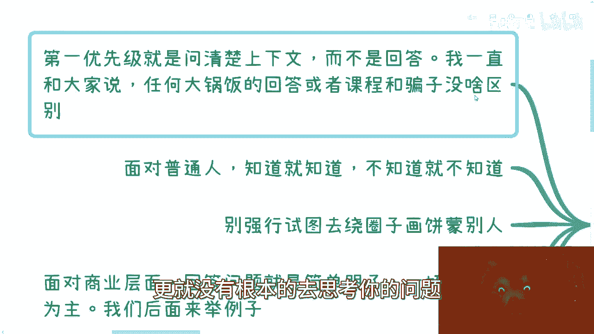

# 课程：如何正确地回答问题（如何提问的姐妹篇）- P1 🧠


在本节课中，我们将学习如何有效地回答问题。正确的回答不仅关乎信息传递，更关乎沟通效率、专业形象的建立以及目标的达成。我们将从核心原则、具体策略和实用技巧三个方面展开，帮助你掌握这项关键技能。


---



## 核心原则：回答前先理解上下文 🔍


上一节我们介绍了课程概述，本节中我们来看看回答问题的首要原则。回答问题的最高优先级是**问清楚上下文**。直接回答而不了解背景，往往会导致无效甚至错误的沟通。

判断一个人是否靠谱，一个简单的方法是看他如何回答问题。如果对方不先询问细节就开始长篇大论，这种“一刀切”的回答与骗子无异，因为它没有针对你的具体情况进行思考。

**核心公式**：
```
有效回答 = 充分理解问题背景 + 针对性输出
```


---

## 回答问题的基本态度 🤝

理解了上下文的重要性后，我们来看看回答时应秉持的基本态度。面对普通人或正式流程（如面试），应做到实事求是。

以下是回答时应遵循的两个基本点：


1.  **知之为知之，不知为不知**：知道就明确回答，不知道就坦诚说明。试图绕圈子或蒙混过关没有意义，迟早会被识破，且会损害信誉。
2.  **区分场景，明确目的**：在商业层面，回答应一切以达成合作、实现盈利为核心目标。对于个人品牌建设或长期合作，坚持有一说一、实事求是则是更佳策略。

---


## 关键策略一：主动提问，掌握主动权 🎯


仅仅被动回答是不够的。一个高明的回答者懂得通过提问来引导对话，澄清模糊点，并掌握主动权。

以下是需要主动提问的几种典型场景：


*   **场景一：领导询问KPI制定**：不应直接给出数字。应先提问，了解行业现状、团队状况、上级的战略方向等信息。否则，制定的目标容易脱离实际，显得缺乏大局观。
*   **场景二：被询问行业或个人发展建议**：不能给出笼统答案。必须通过提问了解对方的城市、年龄、技能、性格等具体背景，才能提供有价值的建议。
*   **场景三：面试过程**：面试是双向的。当面试官提出一个模糊的问题时，应通过提问来补充上下文。例如，可以问：“您能具体说明一下这个项目当前的团队规模和使用的技术栈吗？” 这不仅能帮你更好地回答，还能将对话节奏引向你熟悉的领域。

**核心代码逻辑**：
```python
def answer_question(question):
    if context_is_unclear(question):  # 如果上下文不清晰
        clarifying_questions = ask_for_clarification()  # 首先提出澄清性问题
        context = get_context(clarifying_questions)  # 获取清晰上下文
    return generate_targeted_answer(context, question)  # 基于上下文生成针对性回答
```


---

## 关键策略二：结构化回答，覆盖多种情况 📊


一个优秀的回答不是简单的“是”或“不是”，而是结构化的、覆盖多种可能性的论述。

以下是实现结构化回答的方法：


1.  **超越单一答案**：避免只给出一个点。例如，当被问及“你的优势是什么”时，应系统性地阐述多个维度的优势，并指出最具竞争力的独特之处。
2.  **使用条件分支（If-Else）**：对于流程类或方案类问题，展示你思考的全面性。例如，回答“软件开发流程”时，可以区分：“在大型企业级项目中，流程通常是…；而在小型敏捷团队中，我们则会采用…”。这表明你的知识源于实践，且懂得灵活应用。
3.  **商业回答体现专业性**：在商业洽谈中，回答“如何赚钱”时，不能只说“为了赚钱”。应具体阐述：针对企业客户、政府客户、学校等不同对象，分别通过何种模式（如项目、会议、C端产品）实现盈利，并说明你的核心资源如何支撑这些模式。


**核心思想**：将回答视为一个**决策树**，根据不同的输入条件（上下文），导向不同的输出结果（回答内容）。


---


## 核心心法：洞察对方真实需求 🎯


所有回答技巧的终极指向，是**满足对方的真实需求**。直白地陈述你想要什么并非重点，重点在于知道对方要什么并投其所好。

以下是洞察对方需求的几种途径：

1.  **事前调研**：在正式沟通前，通过公开信息、合作方等渠道了解对方公司或个人的背景、可能面临的痛点。这能让你在回答时一语中的。
2.  **直接提问与观察**：可以直接询问对方的需求，但对方未必会透露全部真实信息。因此，更重要的是在回答时观察对方的反应。如果对方开始看手机、心不在焉，说明你的回答未触及痛点。
3.  **紧扣“痛点”回答**：学校外的沟通大多涉及利益。无论是领导、合作伙伴还是面试官，他们只关心自己的核心诉求（痛点）。你的回答必须直接或间接地指向如何解决这些痛点，否则就是在浪费对方时间。
4.  **细节对抗细节**：无论是虚是实，高水平的沟通都建立在具体的细节之上。哪怕谈论战略、愿景，也需要用可落地的细节来支撑，才能让人信服。

---


## 总结 📝

本节课中我们一起学习了如何正确地回答问题。我们首先强调了**理解上下文**是有效回答的基石。接着，我们探讨了**实事求是**的基本态度和**主动提问**以掌握对话主动权的策略。进而，我们学习了如何给出**结构化、覆盖多种情况**的回答，以体现思考的深度和全面性。最后，我们揭示了回答的最高心法：**洞察并满足对方的真实需求**。


记住，回答与提问一样，是一场双向的试探与沟通。一个经过思考、结构清晰、直击痛点的回答，不仅能解决问题，更能为你建立专业、可靠的个人品牌。