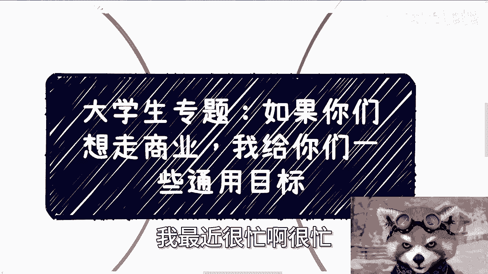
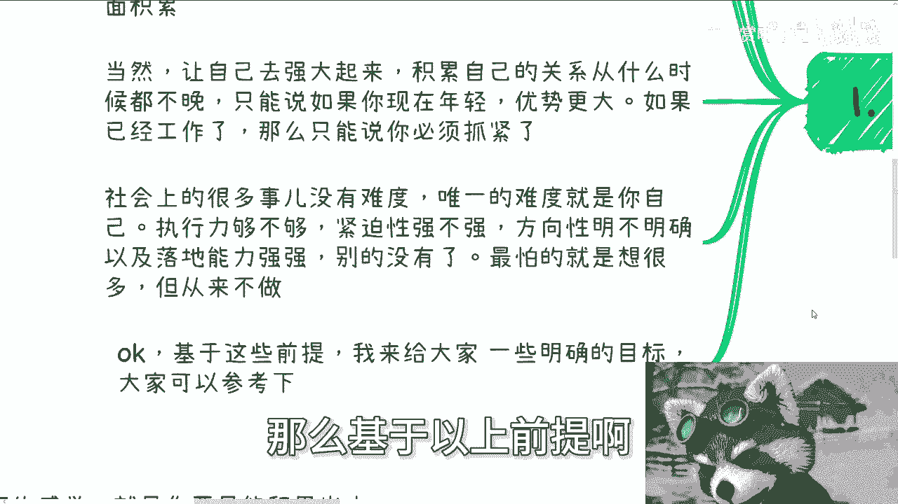

# 商业入门指南 第1课：设定你的通用商业目标 🎯

在本节课中，我们将学习如何为踏入商业领域设定清晰、可执行的通用目标。无论你是学生还是职场人士，这些目标都将帮助你建立稳固的商业基础，并指引你积累宝贵的实践经验。

上一节我们介绍了课程背景，本节中我们来看看具体的行动目标。

## 设定你的核心商业目标

基于实践经验，以下是每个希望进入商业领域的人都应努力达成的两个核心目标。

### 目标一：建立并行的成熟业务组合

你需要拥有多个能够持续产生收入的成熟业务，并且让它们并行发展。无论你的业务方向、角色或客户类型是什么，关键在于“多个”和“能赚钱”。

以下是构建业务组合的“361”模型，这是一个理想的收入结构：

*   **60% 稳定基础业务**：若干个能提供普通级别收入的稳定业务。
*   **30% 短期快钱业务**：一些短平快、能快速带来收入但稳定性不高的项目。
*   **10% 长线风险业务**：那些可能带来高额回报，但也伴随较高风险（如合作方不熟悉、关系不硬可能导致亏损）的长线项目。

这个模型可以用一个简单的公式来概括你的业务收入目标结构：
**理想业务结构 = 60% 稳定业务 + 30% 短期业务 + 10% 风险业务**

在社会上，结果是最重要的衡量标准。你的商业价值最终体现在你成功运作的案例数量和赚取的利润上。

### 目标二：打造精炼的商业简历

你需要一份对外展示的商业简历，这与你求职用的工作简历完全不同。商业简历的核心是精炼、突出重点，让人在几秒钟内就能抓住关键信息。

一份有效的商业简历通常包含两个核心内容：

1.  **精准的头衔**：清晰说明你的业务领域和服务客户。例如：
    *   面向C端（消费者）：可突出个人影响力，如“XX领域KOL，粉丝量XX”。
    *   面向B端/G端（企业/政府）：应突出专业资质和行业地位，如“XX标准制定参与者”、“XX协会顾问”。
    *   **注意**：毕业院校信息并非必需，若需展示，最多列出一个即可，过多反而显得学生气过重。

2.  **精选的案例**：只展示与你目标客户或合作方最相关的成功案例。你需要“见什么人说什么话”，针对不同的对象准备不同侧重点的简历版本。

## 从“新手村”到更广阔的世界

达成上述目标，尤其是建立起“361”业务组合，仅仅意味着你完成了商业入门的第一步，相当于在一个领域“转职”成功，进入了更广阔的世界。

此时，你会发现：
*   赚钱的效率和模式仍有巨大优化空间。
*   关系网络和行业头衔需要进一步拓展。
*   需要学习和探索的商业模式与知识还有很多。
*   商业道路上的“坑”是踩不完的，每个坑都需要亲身经历才能深刻理解。

本节课中我们一起学习了踏入商业领域初期需要设定的两个通用目标：**建立多元并行的成熟业务组合**和**打造精炼专业的商业简历**。达成这些目标是一个扎实的起点，能帮助你完成从理论到实践、从学生思维到商业思维的转变。记住，商业之路漫长，保持初心、扎实积累、勇敢实践，才是走向成功的关键。