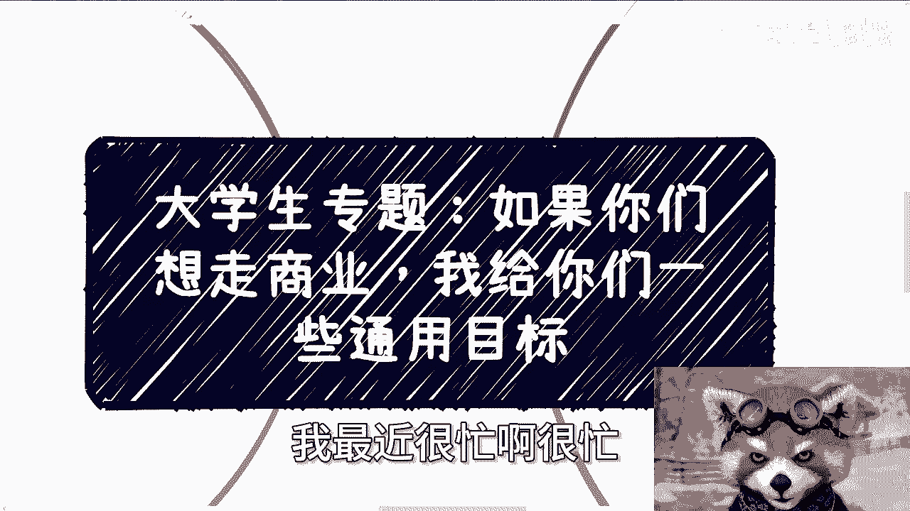
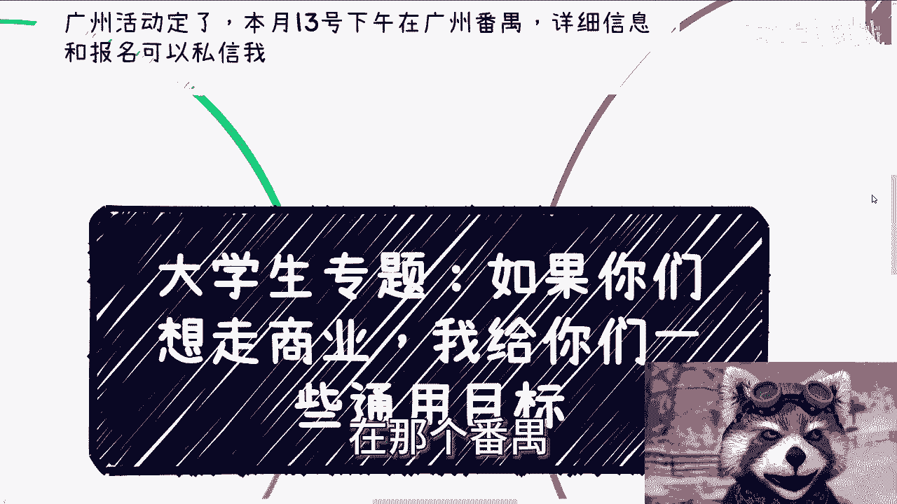
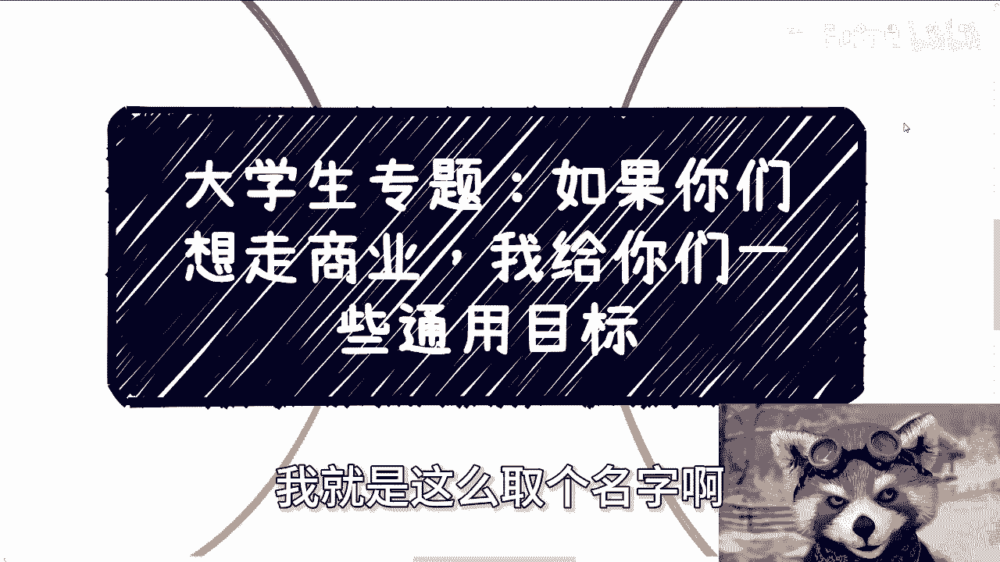
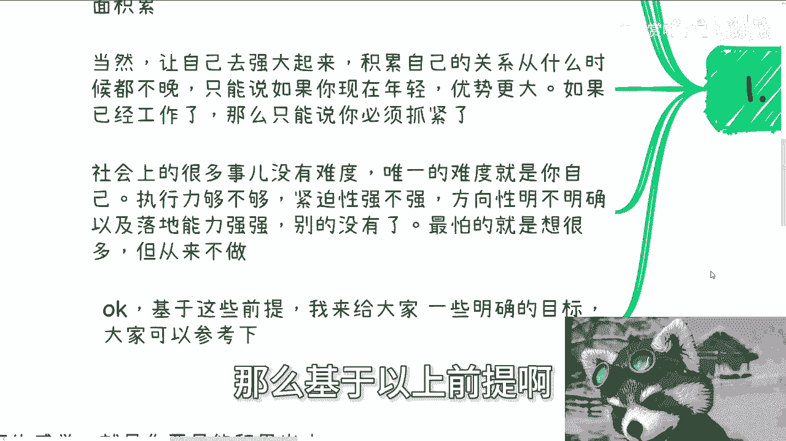
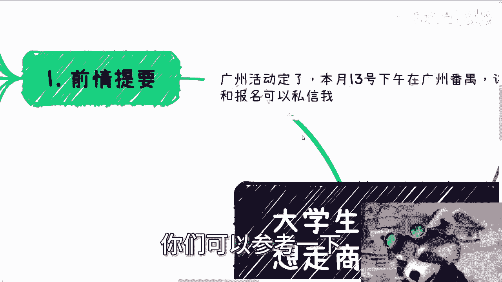
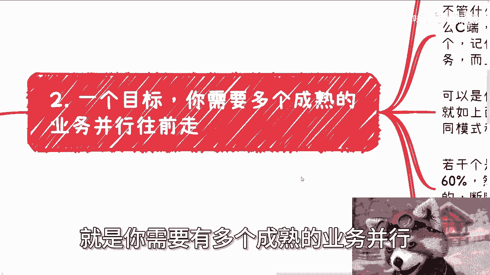
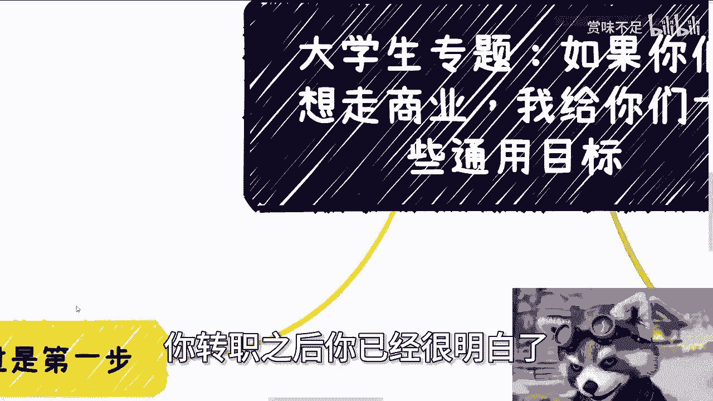
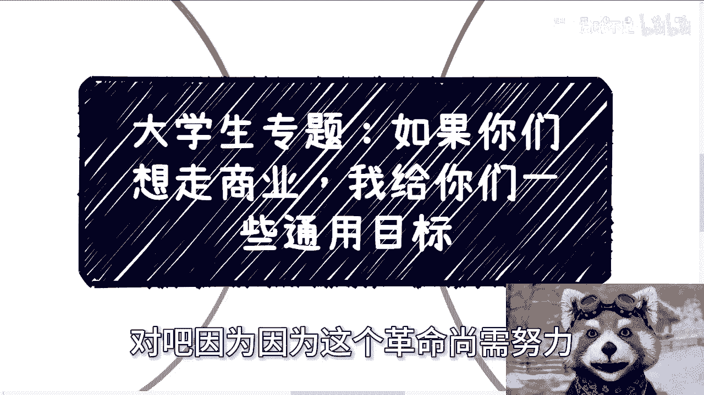
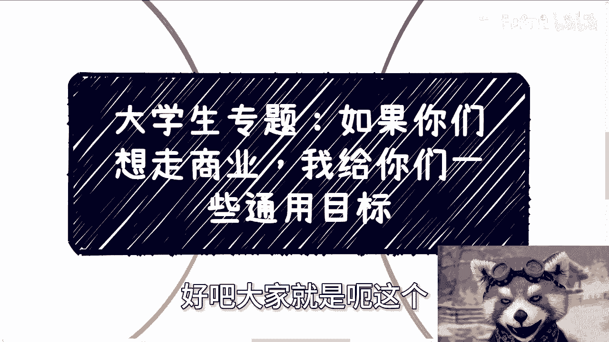
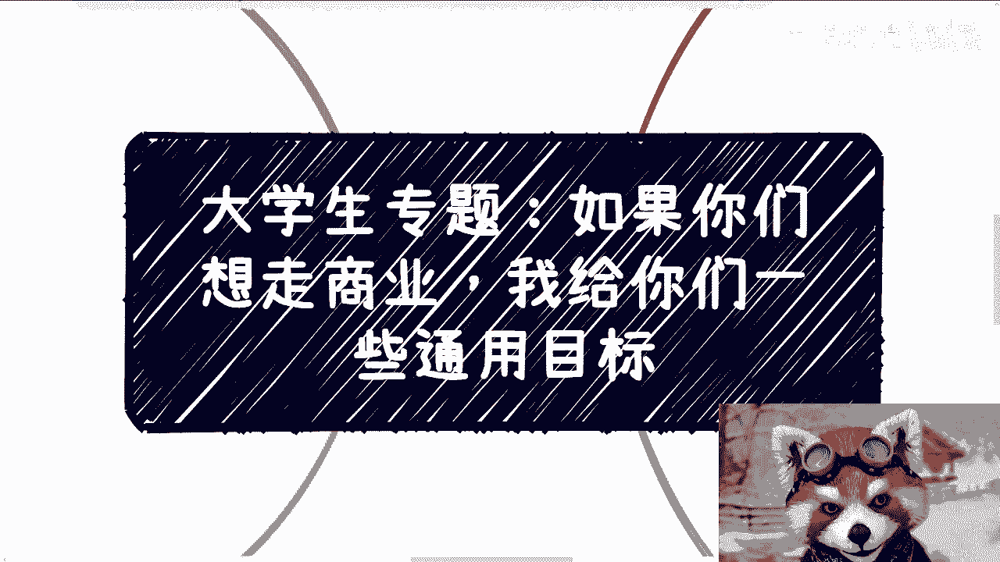

# 如果你们走商业，我给大家一些通用的目标 - P1 - 赏味不足 - BV1Wx421U7nV

好大家好呃，我靠最近很忙很忙。

所以我稍微偷懒了一下哈，呃首先呢那个广东啊，广州的活动继续报名啊，13号下午好吧，在那个番禺呃。

详细信息跟报名都可以私信我啊，那么今天我们来讲的呢，这个是算是大也其实也不算大学生专题啊，我只是这么取个名字啊。

就是意思是什么呢，就是说如果你们想走商业啊，我需要给你们一些通用的目标呃，因为前情提要是什么呢，就是说呃我觉得说到现在呢就是能明白的啊，因为我咨询下来，我觉得有些基础的东西能明白的都明白啊，不明白的呢。

我觉得说再多也不明白，那简单来讲就是说如果你是学生呢，你在学校期间还是有不错的时间窗口，让你出去积累的啊，有一说一，因为你在学校里面的生活啊，生存啊成本都不会太高啊对吧，你食堂啊或者加个住宿啊对吧。

你其实是还是不错的，有这个机会，那同样的也会有更多的时间，让你到外面去做积累啊，或者怎么样啊，当然啊让自己越来越强大起来，积累自己的关系，从什么时候都不晚，你不要觉得比如说啊我现在毕业了对吧。

或者怎么样的，我就晚了或者怎么样啊，没有啊，我觉得只能说什么呢，如果你现在还年轻，那么优势更大啊，如果已经工作了，那我觉得就是说你必须抓紧，那么社会上很多事呢，我跟你讲没有难度的啊。

没有难度也没有门槛的，它的难度和门槛远远低于呃，你去应聘，你知道吗，但是唯一的难度是什么呢，就是你自己的执行力够不够啊，紧迫性强不强，方向性明不明确以及落地能力强不强啊，别的没有了。

就最怕的就是说很多时候就是说你想很多，但是从来不做对吧，那那那那那还说啥呢对吧，你包括今天就是咨询的，这当中有位小伙伴我就跟他说，就是就讨论了半天，你知道吗，然后我就跟他说。

我说我说你就属于既要又要还要对吧，那既既要又要还要，那还讨论啥呢，没法讨论呢，谁都想制教育海妖啊，对吧好，那么基于以上前提啊。

我来给大家说一些呃通用的目标啊，你们可以参考一下。

我觉得基本上每个人都要做到的呃，第一个目标呢，就是你需要有多个成熟的业务并行。

并且往前走，我举个例子啊，比如说你现在开始做商业，两年后你要得到什么对吧，因为我有很多人说我要做了，但是两年后我到底做成什么样子，我不知道对吧好，那我的意思是什么，不管你是什么方向。

也不管你在业务里面做什么样的角色，也不管你的客户画像是C端，B端，G端还是什么什么乱七八糟端啊，不重要啊，你需要的第一点是什么，你需要的是要多个，记住就是多个能赚钱的，能够不定期给你赚到钱的业务。

而且是多个啊，同时是在你手上的，就像我们刚刚说的，你可以是主导，你也可以是蹭的，无所谓啊，这不重要，不管你是怎么个参与法，只要各凭本事啊，就从结果来讲，你必须要有多个赚钱的业务在你手上，那就如上面说的。

只要你能够参与就行，而且这几个业务呢最好就是不同的模式，跟不同的切入点，就如同我之前所说过的，比如说361，什么叫361，就是若干个相对稳定的，属于普通收入级别的，占60%，然后有一些短平快的快钱。

但是并不是特别稳定的，断断续续的可以占30%，然后还有那种长线的，可能钱一下子会很多，但是也有一定风险的，当然记住啊，这个地方的风险不是说一定值，只是说法律风险啊，而是说你觉得这个人你可能不熟啊。

你可能就关系不硬啊，或者怎么样子啊，也就是说它有一定风险，你是赚不到这个钱，甚至你会亏钱的，那么占10%，那么这个就是你的目标啊，其实我觉得两年呢呃算长的了啊，就之前呢基本上都是积累。

那简单来讲就是说你要是做商业，最终呢就是你到底是有多少个呃，案例做下来赚了多少钱，就是你只能用结果说话，因为在社会上面除了结果没有别的东西，就是大家都说啊，我们要看过程。

过程是一个很好的成长的一个东西对吧，不能只看结果怎么样，这些都是鸡汤哦，你可以听，但是你要明白，你在社会上面跟别人沟通，别人只会看结果，没有人有空来听你的过程，你明白吗，就不管你的过程多么惊天地泣鬼神。

还是说多么的可楚楚可怜，没有用啊，这个是第二点，第三点，第二个目标是什么，就是丰富你的商业简历啊，你对外一定是要有个介绍的，我们就称之为商业简历，商业简历一般包含两个内容啊，我跟你们讲啊。

很多人听到简历就想到那种又臭又长的，找工作的简历，我跟你们这么讲，你们很多人，其实找工作简历写的都他妈是一坨屎，真的啊，真的就套模板，绝对不是套什么模板，套模板就他妈把自己套他傻了，你知道吗。

就是你们千万别把商业简历写成工作简历，否则别人的心里只会觉得你是，而且是中的战斗机啊，为什么，因为唉因为这就像这就像你是两个角色啊，你就好像告诉别人哎老子是要做商业的，但是老子还是个学生对吧。

或者说就是老老子没有商业思维，老子还是一个学生思维，那你说人家会怎么想，你，人家除了觉得呵呵，你看看猴戏一样，还能怎么说呢对吧，那呃一个是什么呃，一个是呃一般包括两个内容，一呃叫什么核心点是不要太长。

今呃今精简，然后要精要，然后别人呢几秒钟就能看到重点，剩下的呢就是他愿意看，他就看他不愿意看，那也不影响大局啊，那么几个东西，一个呢是你的头衔，就是你是做什么业务的，面对什么客户要精准定位。

比如说啊比如说啊你说我就是要C端割韭菜的，那么你就得写啊，各种各样的什么，我是什么kl对我有多大影响力对吧，有多少粉丝，老牛逼了对吧，那你要是想要去做政府端，企业端的项目的，那么就比如说你是什么顾问啊。

写了一些什么国国家标准啊，团队团队标准啊，还是说行业标准啊，你参加了什么组织啊，担任什么职务啊对吧，然后呢呃很多人关心的一点是什么呢，就是毕业学校要不要写，我这么说，你要写可以，但你最多写一个。

你最好就别写，没什么好写的，你明白吗，然后呢你你你如果来说什么，你国内是什么学校，国外是什么学校，你只要写大于等于两个，在这上面一看就啊，就这么简单啊，我可以给你打保票，我可以一刀切就。

那另外一个是什么呢，就是你的案例，你曾经做过的积累过的案例，这些案例非常重要，你就说你你你可能做过很多案例，但你不要什么案例都写出来，就跟上面说的你的头衔是一样的，你面对的客户是谁，你想吸引什么样的人。

你想跟谁合作，见人说人话，见鬼说鬼话，你到底见什么样的人，展现怎样的title，展现出来怎样的案例，你得做好准备，你不要拿一个东西去吃遍天下，这是不可能的啊，这是不可能的好，然后最后一点是什么。

当然你记住，这只是第一步，你明白吗，就是说这就好像是一个转职的过程，就是你把之前的技能点点满了，或者你的经验值已经到顶了，你其实积累出来我们说的361的这个业务啊，那么这也仅仅是第一步。

你相当于又回到了新手村，因为你进入了另外一个世界，你明白吗，但呃你到那个时候，你就会发现，你的赚钱的性价比肯定还有很很多的提升空间，你的关系链啊，你的头衔啊也肯定还要往前再走。

你的商业模式也还有很多东西需要去探索，你懂的东西肯定也是有限的啊，因为你真的能做一些东西，我还是那句话，并不是因为你多牛逼，而是因为你在这过程当中，可能天时地利人和的抓住了某些机会，仅此而已啊。

不是说你多牛逼，所以说你还有非常多的东西要去学，你还有非常多的路要去走，你还有非常多的关系要去跪舔，而且我跟你讲，坑这个东西在社会上面啊，踩是踩不完的啊，哪怕你天赋异禀，你能保证的。

只不过就是说每个坑你踩一遍就懂了，但是你不可能出现你不踩就懂得，这种情况不不太现实的哦，所以说本质上你踏踏实实扎扎实实的，就是每个坑你去踩，总归会有额外的付出对吧。

所以说这些事情你总归还是要去经历一遍的，当然啊我相信你真的能做到，我刚刚说的36月的第一步的时候呢，我说的这些基本上你应该都能明白，那我觉得接下来每个人的路，就看每个人的运气跟天时地利人和了。

因为很多东西基础的你转职之后，你已经很明白了。

那么这个时候我相信啊，你的目标啊，你的一个一个短期目标，长期目标已经不需要在别人给你了，那你比如说你说我也好，其他人也好，我们已经没有东西可以给你了，更多的是什么，你可以来寻求我们的合作。

这是可以的对啊，但是呢就是说到底你的赚钱的性价比能有多高，或者你这个路能走多远，你的摊子能铺多大，这个东西就看天时地利人和啊，但是本质上啊就是说你嗯怎么说呢，就是我觉得走到第一步能走出来。

这才是最重要的，已经很哎走出来应该说是最难的，因为在这当中，就像今天我跟一个咨询小伙伴说的，我说在这当中你要去改变的东西很多，你可能你的三观会不停的碎，你三观不停地重塑，而且你还得能要保持你的初心。

保持你的自我，还得保持你的一个基本的，就我之前跟你们说的，基本的这个这个这个是非观的判断，这就很难对吧，因为因为这个革命尚需努力对吧。

大家大家要走的路还很长，就像我跟你们说的，你们要去走商业，要去了解社会，你们就会了解很多你们以前没有了解过的东西，甚至能够打破你们三观的东西，但是就算啊我们退1万步来讲，如果你们真的能走出来。

能积累出自己361，但是这个时候你们已经迷失了，你们自己已经跟你们当时的自己不一样了，或者说你们被别人同化了或者黑化了，那我反而觉得这件事情本身又没有人，就失去了它本身的意义，你知道吗啊好。

那我觉得这话就仅就言尽于此了，言尽于此，不能再往下讲对吧，再往下讲就要擦边了对吧行啊，那就这么着好吧，然后广州这边的活动继续报名好吧，大家就是呃这个了解详情的。

或者报名的可以继续找我，然后呢就是说呃商业商业职业规划发展，然后比如说什么融资啊，项目计划书啊啊，然后你们要是手上有什么牌，觉得希望通过我的视角来帮你们看看怎么打的，或者更合适的。

或者说有些选择自己摸不清楚的啊，你们觉得有必要的话，你有必要的话，你们整理好背景，你们整理好详细的问题好吧，然后你们可以私信我在做咨询啊。

