# 如果你只能看到你认为的实，那么你永远只能赚辛苦钱 - P1 - 赏味不足 - BV1xm421W7Hs

好大家好呃，首先武汉活动定了啊。

5月12号下午01：30到六点左右好吧，然后要报名的继续报名，然后我们今天来讲的呢是本来啊。

这个主题叫做实和虚的这个问题啊，后来我想了一下，这个主题有点虚，这个主题不是有点虚，有点抽象啊，所以我就把它改掉了，我说你如果只能看到你认为的十呢，那么你永远只能赚辛苦钱啊。

我觉得这个结论可能会比较比较，比较比较具象化一点啊，那么首先第一点呢，我觉得大家在学校里面跟工作上。

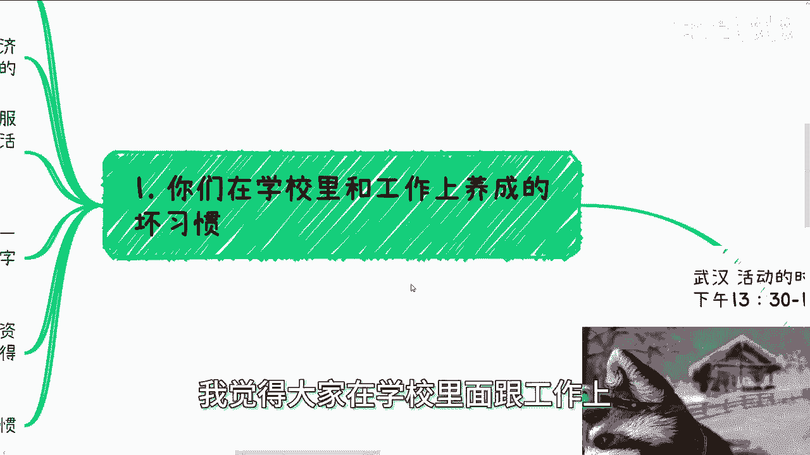

其实养成了一个巨大的一个坏习惯啊，就是你们养成最大的坏习惯呢，就是所谓去思考问题的时候，就是不管你们可能今天呃，就是就是思考什么样的问题，或者说你跟我去讨讨论怎么样的问题，就是你潜移默化的会去想的是。

这件事情落地了之后是什么样子的，以及实现的价值是什么，以及达到的效果是什么，就是这种思考方式并不是你想去这么想的，而是你的潜意识就是这么去想的啊，那么这个呢其实是怎么说呢，就是说可能以以往的教育啊。

或者其他各个方面所导致的这么一个问题啊，那么前几天呢，我跟一个朋友在线下沟通的时候呢，沟通了一些就是说最近数字经济的培训啊，包括就是说他能切的一些东西，我是这么说的，我说如果你要做呢。

你可以整理一些你能讲的东西啊，当然我后面也说了，我说我们也可以做一些数字经济的服务啊，或者说整合一些服务商进来，就我们自己不做，我们让这些服务商做，对不对，然后呢在这些活动当中呢。

这个啊或者在接下来的活动当中呢，提供给中小微企业一些数据合规啊，数据入库啊，数据库表啊对吧，数据资产的一些服务。

这个东西我曾经也讲过啊，就是说最近中央到各地方，省市区的政府都很关心这个东西，你们但凡去了解一下，你们就知道了，对吧啊，呃这个时候呢我跟你这么讲，我讲到这里的时候，我知道对方在思考什么是呃。

就是说他呢才想的，就是说他因为我刚刚不是跟他说。

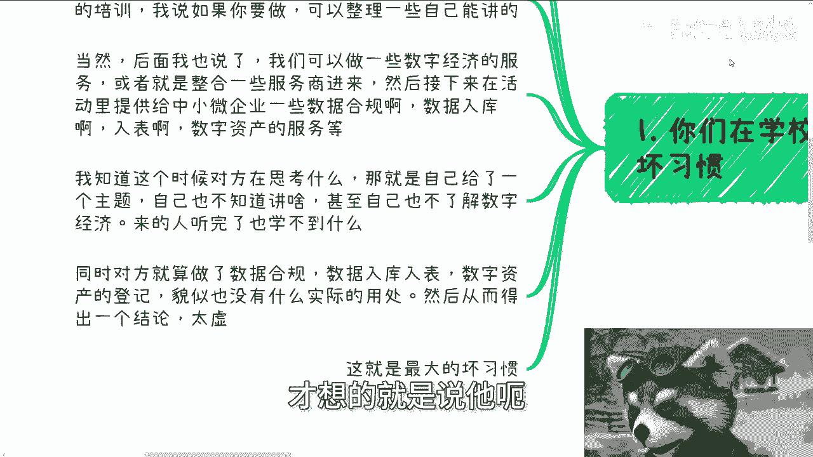

你你整理一下自己能讲的嘛，对不对，那么他就在那边想啊，他说诶那我需要给自己一个主题啊，然后呢我也不知道自己能讲什么，甚至呢，他也觉得自己甚至都不了解数字经济是什么，对吧，然后同时呢他又觉得。

比如说我把它加入到整个的一个啊，一个一个一个一个活动当中，或者整个的一个培训当中去了之后，他认为来的人呢听了也学不到什么东西啊，那么同时呢对方就算做了数据合规，数据入库，数据库表。

数据资产的登记等等等对吧，那么貌似也没有实际的用处，这个就是他脑子里在想的，那当然我敢打赌的是这个东西不是他单纯在想，你们所有人都这么想，对不对，只是你们不像他可能直接问我对吧好。

那么从而让你们内心可能得出个结论，就是太虚啊。

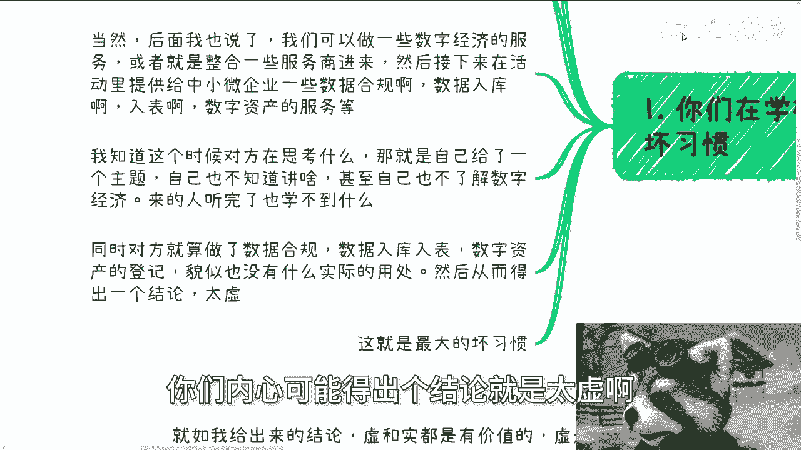

那么我跟你们讲这件事情，就是你们最大的一个坏习惯，但凡你们这个习惯改变不了。

你赚得到钱，但是你永远只能赚辛苦钱，就这么一个结论好，那么为什么啊，我们接下来往下讲，你就知道为什么，首先啊我们换个问题问，你觉得我现在比如说今天啊。

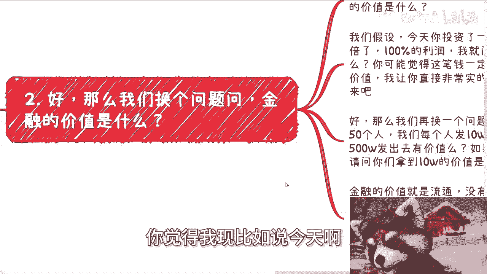

我就问你，我说你觉得金融的价值是什么，就金融的价值是什么，我就问你们觉得金融的实的价值是什么，金融的虚的价值是什么，你们想想看啊，你们如果一下子想不出来，其实也算答案啊。

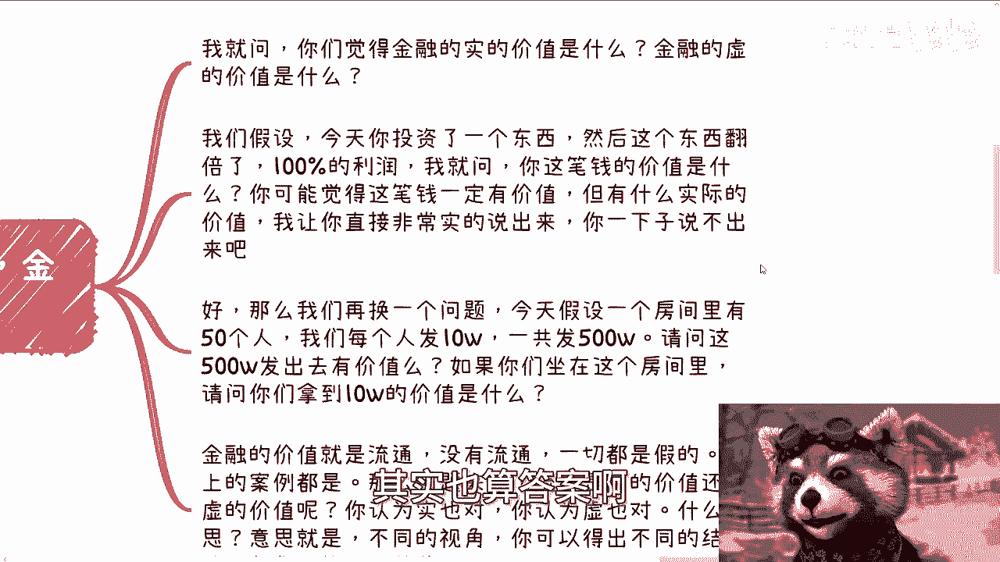

就你们可能就摸不清楚对吧，好我我默认啊，其实大部分人都摸不清楚啊，好那么我们假设啊，我们假设今天你投资了一个东西，然后这个东西翻倍了，百分之百的利润对吧，我就问啊，你这笔钱的价值是什么。

我不管你投入多少，比如说你投入1万啊，100万一个亿啊，随便你啊，那么我就问你，当你这个利润翻了一倍的时候，我就问你，你知道你这笔钱的价值是什么吗，你不知道，我敢打赌，你不知道啊。

你可能心里面会觉得这笔钱一定有价值，因为你投资了，而且它涨了对不对，但是我就问你，你既然来谈实跟虚对吧，就像我们刚刚说的核心问题就是实跟虚对吧，那我就问你这笔钱的实际价值是什么，你知道吗，你不知道啊。

我让你非常接地气的实际的说出来，你知道吗，你不知道，但是你知道它有价值，那么我们再换个问题啊，我们假设今天一个房间里面有50个人，每个人发10万块钱，一共发500万，对不对，好，请问我就问啊。

这500万发出去，如果我是政府，我就问啊，这500万发出去对我有价值吗，这第一个问题啊，第二个问题是，如果你们坐在这房间里面，你们每个人拿到10万块钱，那我就请问这10万对你们有没有价值啊。

或者说我们就按照刚刚那个说法，这500万实的价值是什么，虚的价值是什么，而对你们个人来讲，实的价值是什么，虚的价值是什么，你知道吗，你不知道，当然你知道的是什么，你知道的是，OK我能拿到10万块钱。

我也想去花，对不对，好那么你会发现这个行为就是价值。

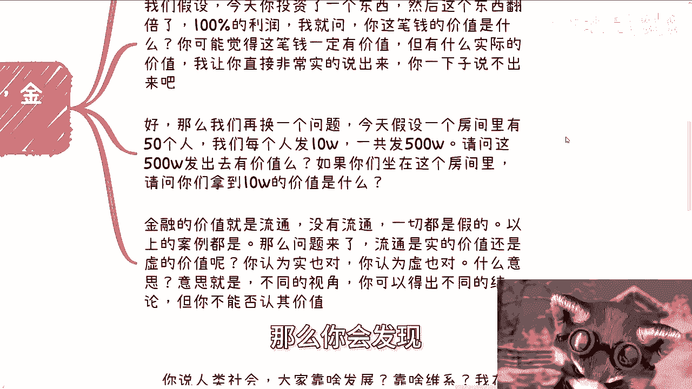

你懂吗，就是金融的价值本身在于流通。

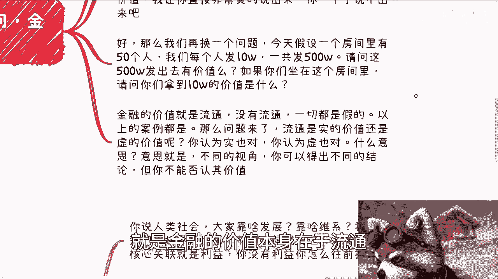

你没有流通，一切就没有价值，你明白吗，就是我今天给你们发500万，每个人发10万，如果你们每个人都不投资，都不去花，都没有任何的出金入金，那这500万发了有什么用呢，这500万跟扔水里有什么区别呢。

我他妈扔水里还能被别人捡到呢，对不对。

就是以上的案例其实都是这个问题，你知道吗，那么问接下来的问题又来了，流通，如果大家认可啊，金融的价值是流通的话，那么我就问你们流通是十的价值还是价值，那这个时候我就跟你讲结论，就是实，你认为实也对。

你认为虚也对，为什么，因为你认为实和认为虚的时候，你可能站在不同的视角，你知道吗，所以说你能得出不同的结论。

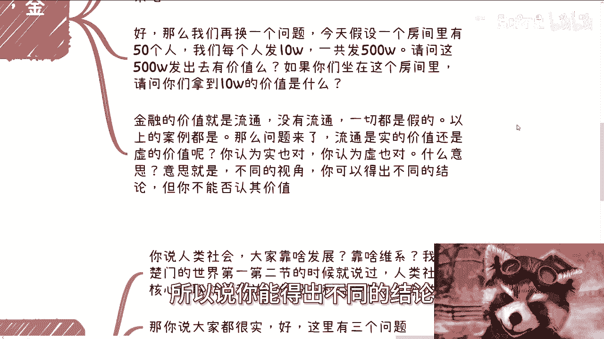

那么所以我们回到一这个地方，就是你再回想一下，你看问题的时候，你不能单纯从你的视角来判断它和实和虚。

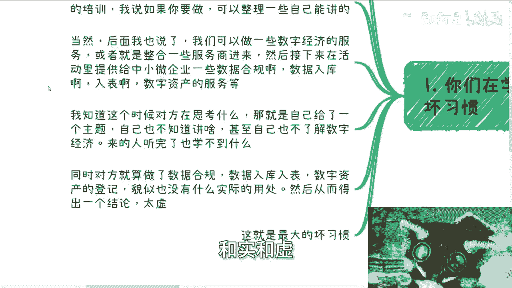

然后判断出来，就是说你认为它实的时候就有价值的，你认为他虚的时候就有就没有价值，不是的，它仅仅是在你的格局下面，你觉得它没有价值，但是你放到别的上下文，别的格局里面，它就有价值。

你为什么要否认它的价值呢，对不对，好第三点啊，我们回到社会上所有的案例，你要时我给你讲。

那么就没有利润，没有利润，那你还怎么赚钱啊，什么意思，就是我就这么跟你们讲，你说人类社会大家靠什么发展，靠什么维系关系，靠什么，你不要说跟我说靠爱靠感情啊，你妈他妈扯淡，纯他妈扯淡，对吧啊。

我在探索楚门的世界，当时第一节第二节时就说过，人类社会核心关联能够推动的整个链条是什么。

就是利益，你没有利益怎么往前推动啊，你跟我说，大家都很示好，那我告诉你这里有三个问题，第一个问题大家都很实，这件事情就反人类，你告诉我到今天为止，哪件事情人类是有共识的，哪件事情有啊有吗。

你告诉我大家都很适可能吗，不可能大家都很怎么样都不可能对吧，这是第一点，第二点，人你人与人之间没有利益驱动，这件事情怎么往前推，你怎么让大家合作，你要是跟我说，大家都用爱发电好。

那么又回到一的这个问题可能吗，你想想可能吗。

对不对啊，这是第一第二个问题，第三个问题就是说你要但凡实的话，整个一个项目没有包装，项目本身没有利益空间啊，这就好像比如说我今天要采购一个产品，你这个产品成本就20万，你就跟我说20万。

那我就问你这件事情怎么往下做，怎么往下做，就是我拿到20万，我怎么我要出20万，我怎么能找到你这么一个怎么找到你，这样你这么一个比较好的供应商呢，我我满地都是骗子，可能我怎么找到好的供应商呢。

我怎么让我的下游或者我的渠道，帮我去找供应商呢，哦我我倒贴啊，倒贴对不对啊，然后那你做这个项目，你说20万对吧，就非常实的20万好，那么一旦这个项目里面我要改一点需求。

或者说这个项目里面有些差错差错的时候，我就问你怎么办，你倒贴吗，还是你在跟我说，哎哎陈老师，那这个项目不行，这个项目这样做的话，肯定要21万20万5000对吧，怎么样没有这样做事情的，你懂吗。

就是为什么从上到下，从里到外要有非常多的利益空间，就是因为在真正落地的时候，利益空间和事情，最终的你们所认为的那些实最终所落地的价值，它玩它的最终完成度往往是成正比的，你没有利益空间，他怎么往前走啊。

你们想想看最近两年，你们仔细想看，最近两年，最近两年大家为什么过得这么苦，为什么很多人做事情没法往下做。

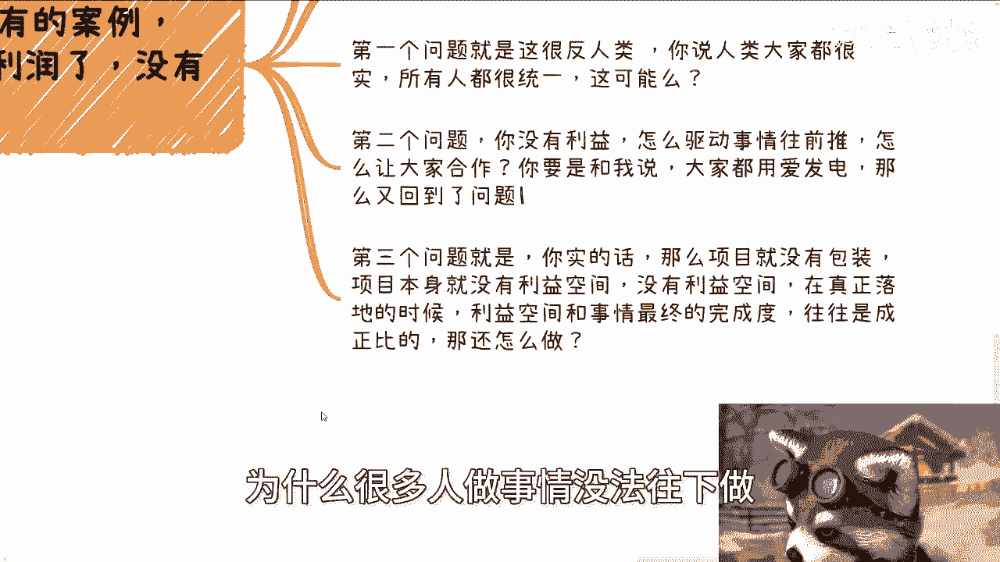

他妈的没有预算，哥哥们啊，第四啊，我们我们再回来啊。

再回来说虚根实的问题啊，就如我给出来的结论，虚根实都是有价值的，虚根实的价值都是有的，只不过你们的看是问题的角度不一样对吧。

虚是为了让事情更好地推动，实则是让事情更有价值，你就拿你就拿国内区块链跟全球的web3来讲啊，咱不说现在发展怎么样，咱也不说现在发展到底实还是虚，你我也不管你们，就是我们也不关心所有的人去看。

他是割韭菜不割韭菜啊，我就这么跟你讲，很多人觉得2016年到2019年，那段时间是非常疯狂的啊，然后数字货币也好，web3也好，非常的虚，但是啊我们就说，但是你不可否认的是，如果没有。

2016年到2019年的这个财富效应，能发展到今天吗，啊能发展到今天吗，或者我们再退1万步来讲，如果没有这些东西，今天美国和中国，或者其他各个国家有这么多的落网，就是有这么多的这个团队落网之后。

能够这些钱去充到国库吗，有吗，没有对不对，你所有事情的发展，我告诉你，各行各业都是如此，没有创造财富的效力，你怎么大力发展啊，谁去发展，你告诉我，那么靠靠爱发的发发电吗，靠政策往下引吗，没有用的。

你懂吗对吧，那你告诉我那些创造财富效应的时候，就是进去对吧，无脑进就能赚钱的虚寒实呢有意义吗，你觉得对吧，而且我告诉你们，你们但凡想要去那个赚钱的，但凡想要去追风口的，你会发现风口上都是虚的。

你比如说去年GPT用AIGC赚到钱呢，哪个使的，你告诉我哪个使的有有有实的东西吗，啊所以我就跟你们讲啊，如果你认为任何事情你只看到你认为的是更虚。

我跟你讲，你的格局就那样了啊，我我不敢说直接把你打死，说你赚不到钱，但是我跟你讲，你也只能赚到辛苦钱，你懂吗，就是你们对你来讲，你没有利益空间啊，你觉得所有东西都是虚的，那还怎么做事情对吧。

这就好像我就跟你们讲了，我们是渺小的，我们不要去跟整个社会规则去抗衡对吧，你要抗衡可以，你先去了解，先去熟悉，你先从这个规则里面赚到钱，你再去抗衡，你不要一开始就去抗衡，它没有意义的，对你有什么好处。

你想看对吧啊好啊，那就这么着啊，就这么着，那个武汉活动好吧，已经定了定了继续报名啊，然后剩下的就是职业规划，商业规划啊，然后那个叫什么融资啊，股权合同啊，然后商业计划书啊，包括你们就是自己有哪些牌。

就比如说有哪些啊啊这个这个offer啊，或者有哪些技能啊对吧，有哪些哪方哪些方向要走的，你们觉得希望通过我的视野，或者通过我的一些经历，能够帮你们更好的做好规划的啊，你们整理好问题。

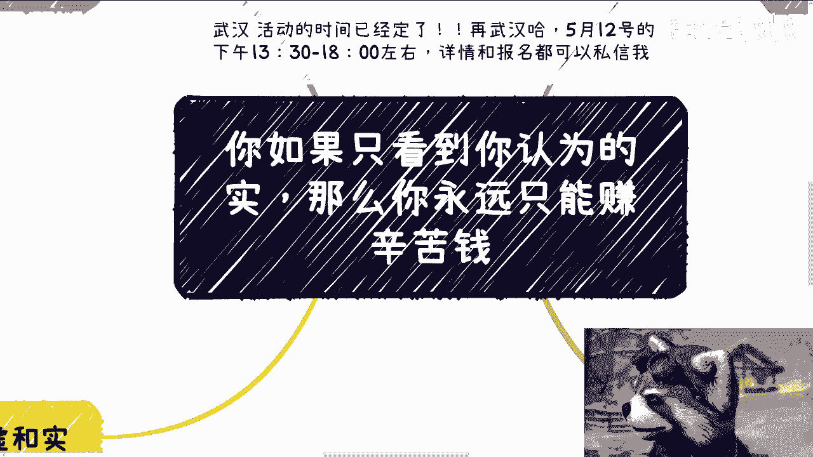