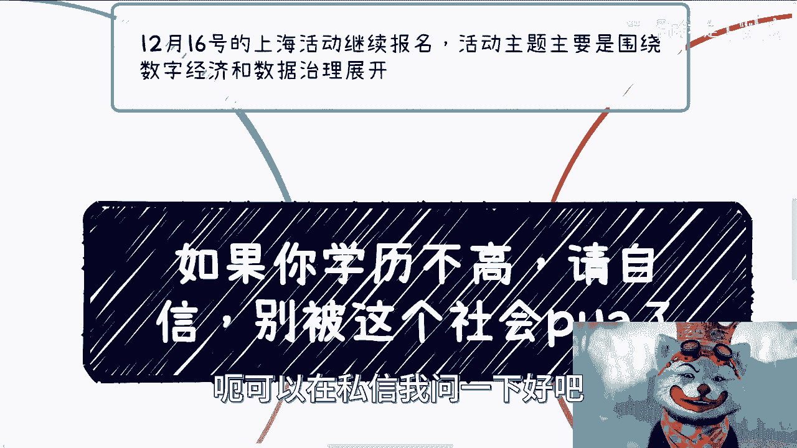
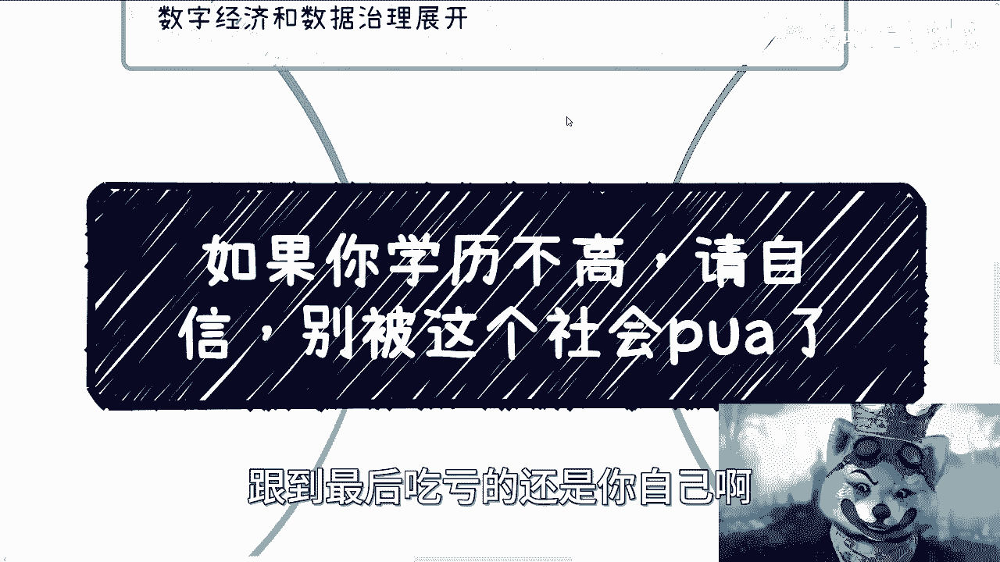
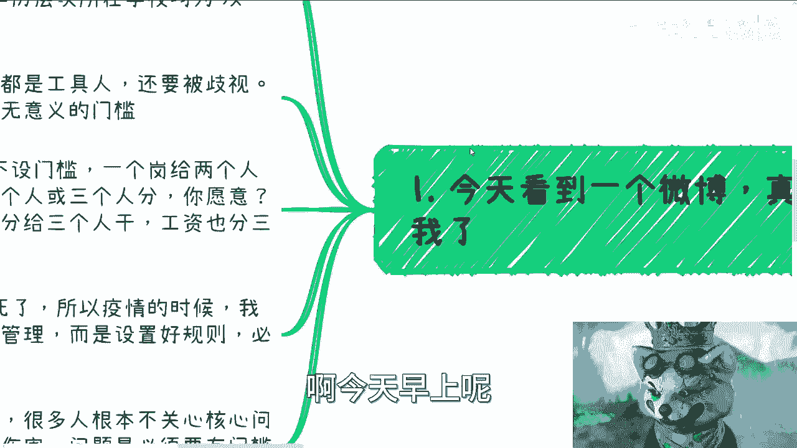
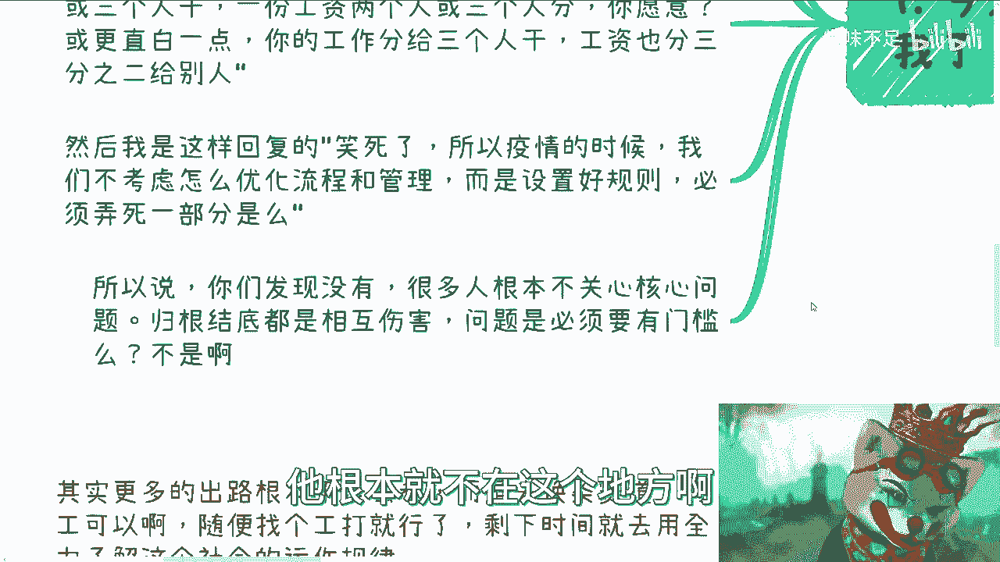
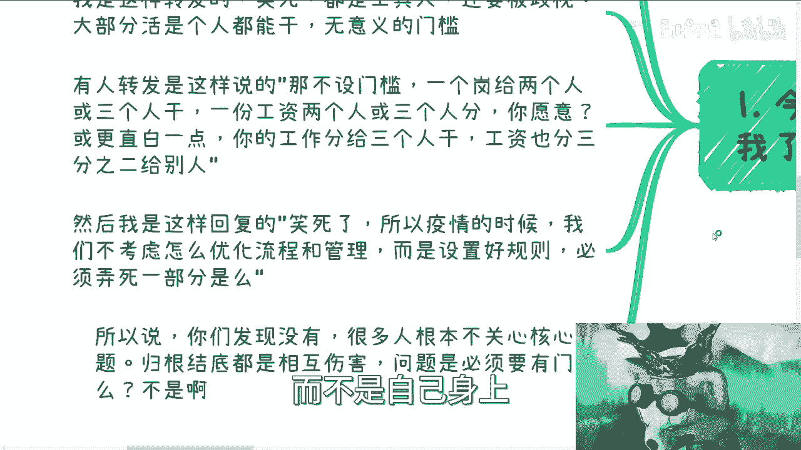
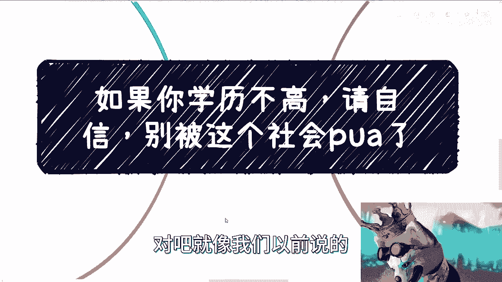
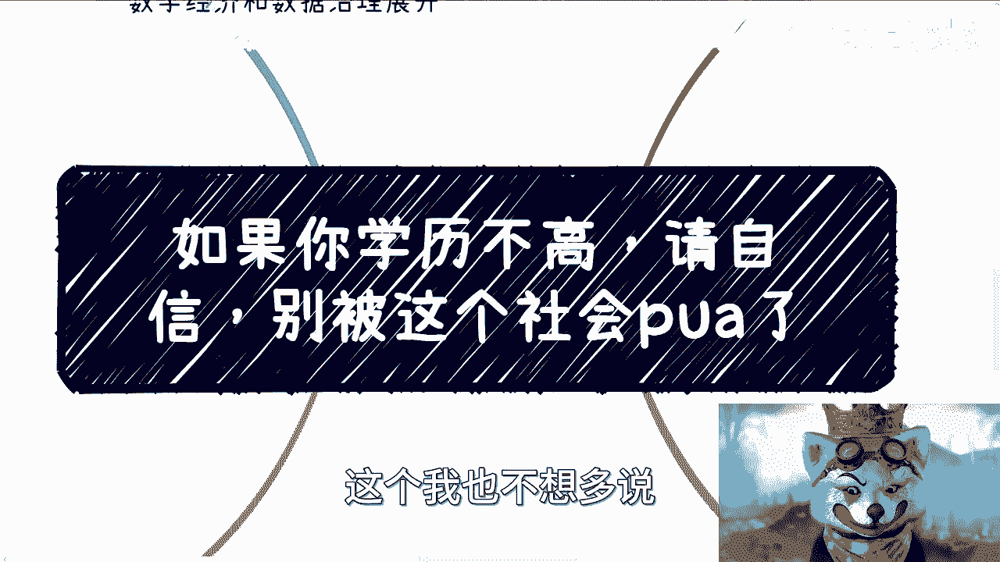

# 如果你学历不高，请自信，别被这个社会pua了 - P1 - 赏味不足 - BV1wG411v7ci

好大家好，我跟你们讲啊，今天他妈的真的非常的气愤啊。

现在我是蛤蟆区博主啊，呃首先16号上海活动继续报名啊，因为上海这个场地比较大，所以说就基本上也还是能容纳很多人的好吧，大家过来，反正也可以多交，多交个朋友，那个内容的话是这样子的，就主要是围绕数字经济。

还有数据治理展开啊。

这样子好吧，呃你们有兴趣的话，可以看一下我的动态，然后看一下那个可以再私信我问一下。

好吧，呃我为什么很不开心呢，是因为今天早上微博啊刷到一个东西啊，我先说一下主题啊，我觉得如果你学历不高，请你自信啊，也不要一天到晚去钻牛角尖，就要让自己学历变得高啊，我觉得没有必要啊。

没有被完全是没有必要被这个社会PUA，一点必要都没有，你但凡想得清楚你就去提升，你想不清楚你就想办法去想清楚，这才是根本对吧，你所有事情去跟风跟跟。

到最后吃亏的还是你自己呀，没有区别的呀，啊今天早上呢是这样子的啊。

我跟你讲，看到一个微博，真的笑死我了，呃袁博是这样的，他说被困在第一学历的年轻人啊，打破正面隐形的墙，对吧好啊，他说你感受过第一学历歧视吗，对吧，怎么样怎么样怎么样怎么样，好啊好，我是这样转发的。

我说他妈的笑死人啊，都是工具人，就是大家其实都是资本家的工具人，还他妈要被歧视，还他妈大部分的活都是我跟你讲，大部分的活其实是个人都能干，本质上这就是无意义的门槛对吧，有意义吗，没有意义。

唯一的意义是什么，唯一唯一的意义就是PUA。

你们就这么简单啊，有的人转发是这样说的，他说这那不是门槛啊，一个岗位给两个人，两三个人干，一份工资，给两三个人分，你愿意吗，或者更直白一点对吧，你的工作分给两三个人干，工资也分给两三分之二给别人。

你们发现没有这种发言的人，我不知道他学历高不高，我也不知道他是不是记得利者，但我他妈的知道一点，就是明明大家都是打工人，明明大家都是工具人，为什么要相互伤害呢，唉问题是在这里吗，问题核心在这个地方吗。

对吧，然后我就回复了，我说他妈笑死了哦，所以疫情的时候，我说我们不考虑怎么优化流程跟管理，而是就是设置好设置好规则，然后你跟我说，他妈必须在认知二人必须死，唉就奇了怪了，真的是。

对吧唉永远的就是你会发现他们的说话，这些人根本就不关心核心问题，我跟你讲，不是坏就是蠢蠢，我是不相信的，就他妈是坏，对吧啊，归根结底都是就是相互伤害，你说问题在这个地方吗，他根本就不在这个地方啊。

所有的人都会去偷换概念，我跟你讲，就他妈的很无语，对吧哦，这种这种评论我觉得很多可能学历低的人，或者说很很多现在没有找到工作人，他看了之后就更自卑啊，更不自信啊，你甚至就在攻击他，有意义。

本来没有意义的呀，我们要让所有人明白问题出在什么地方。

而不是自己身上对吧，包括还有人刚刚这么回我，他说话也不能这么说啊，如果同一个岗位，一个98811，一个普通本科，一个大专生，你是面试官，你会选哪个好，首先你会看到这些人说话都是非常神奇的。

就是他会把一些已经PUA你的这么一个结果，变成一个原因，变成一个既定真理来跟你讨论有意义了，啊那照照我觉得照这话怎么说，反正我就这么说嘛，那你今天对吧，照这么说吧，那所有的这个呃这个赚钱的。

所有的出去能够能够生存的，富二代，那么老百姓不要活力啊，活什么东西了，对不对哦，你说优秀就优秀了啊，98811定优秀吗，普通本科一定优秀，一定不优秀吗，大专生一定不优秀吗，对吧哦，你说比较公平。

什么叫公平啊对吧，公平就是要让大家大家知道问题出在什么地方，是现在的供需比比较的悬殊，是人口比较多对吧，是企业经济不好，而不是一味的打压，说他妈的学历低的就是垃圾对吧，为什么，因为这种话让我感觉是什么。

就是让大家所有人都去卷学历，卷学历，所有的人都去卷那个工作，那这里面又有非常多的机构，非常都是生意呀，对吧好，我知道你们现在有人要要说什么对吧，你们有一部分人肯定会在想，那他妈不做这个没必要做了对吧。

只有这一条路选，那你要是愿意这么BBBPUA，那我也没话好说对吧好，我们来说第二点，我们很多时候讨论学历好的对吧，你们会发现所有的评论，所有的新闻，所有的讨论都在往好的方面说，那他妈差的呢被抛弃了啊。

不存在了，假装没有啊，我们很多时候大家都在讨论我们是什么学历，然后我们去什么公司或者怎么发展，好像这个世界上学历不好一点的就消失了一样，但事实上面肯定不是小事，而且他们占大比例啊对吧。

我觉得而是他们不知道应该怎么评论，或者说不知道应该怎么评价这些东西，因为他们往往很多很自卑啊，或者说他们原本不自卑，他们他妈的被PUA的自卑了对吧，而且他们忙忙忙忙于生计。

哪有他妈时间来评论或者冲浪呢对吧，那么那么问题来了，所有的都去提升学历，去卷工作，那这条路上本身根本就卷不上去啊，你已经是个独木桥了，你怎么卷，对吧，而且很多家庭能支撑吗。

啊你你你很多人他妈的说的轻松啊，你要去卷，你要去读啊，你不读他妈未来没出路啊，那我怎么读呢，我家庭没有钱，我怎么读啊，啊我读完就一定能保证你工作吗，有吗对吧，今年这么多研究生他妈的出来做个半年。

做个一年，然后被优化的也不占少数啦，这种话有意义，未来没有意义的，除了底层相互PUA还有什么意义呢对吧，这个社会周围的舆论亲戚都在为学学历润，大家的每次发言，每次讨论其实都在PUA。

别人也他妈在PUA自己有什么意义呢，在我看来就是底层伤害啊对吧，所以我觉得核心是什么，核心是我们得要明白，人与人的差别并不大，你不要因为说自己学历高就骄傲，就看起看不起别人，也不能因为低就贬低别人。

因为你如果是一个学历不高的人，你一定要明白很多东西，很多岗位根本不是说你做不了，也不是你低人一等，只不过就说，因为这个社会的一些莫名其妙的规则，让你没法进去做而已，你但凡进去做了他妈的几个月。

你就是熟练工，有什么区别呢，对吧，我也我之前就说过了，都是草台班子，没有区别的，啊你也一定要明白，社会上赚钱的方式多啦，并不是只有打工这一条路啊，更何况打工人所有的决定权都在别人的手上。

也都不在不在自己手上，这有什么可骄傲的呢，对吧，就像那些刚刚评论我的这些人，也许他们的学历还是可以的，那有什么可骄傲的呢，你难道不应该自卑吗，对吧，我们就说啊你除了打工，别的道路赚钱的方式也是千千万的。

剩下道路看学历的其实就很少了，或者说你随着时间推移，看学历的基本上就越来越少对吧，当然我们也得明白一点，就是不是说那条路就很好走，你两条路可能都是独木桥，都很难走，但是问题是。

你在左边这个路已经被PU了20多年了，你要再往上去卷没有意义了呀，因为你卷不过人家，你你就像刚刚那个新闻里讲的，你第一学历卷不过人家，你没法卷啊对吧，所以说在商业这条路上，在别的赚钱路上。

我们也要说一下，就说学历也许不是什么应届门槛，但他也需要一些别的东西啊，也不是说什么都没有，包括社交啊，话术啊，了解对方的需求啊，了解对方工作逻辑，了解对方关心什么，了解对方到底怎么赚钱的。

了解你自己到底想要干嘛对吧，这些反而变成非常重要的东西，而不是说你每天在里面在那边就在那边想说，我他妈要去卷学历，我要去网上卷，我拼了命往上卷，卷完我30多岁，我就觉得我我人生财富自由了，不可能的呀。

对吧，所以我觉得其实低学历的人，他更应该去了解这个社会的运作规则，因为你这样的话能给自己多一条路啊对吧，其实更多的出路根本不是去卷啊，而是说你换条赛道，你打工可以随便打个工就行，不是说你不打工对吧。

你剩下时间你剩下时间，比如说就用权力去了解这个社会的运作规则，也就是说在这个社会上，有很多人他的收入不是通过打工来的，那他怎么来的呢，对吧，你可以去了解啊对吧，不是打工人的直接收入，大家怎么赚钱的呢。

这其实是一个巨大的学科跟市场啊，你去了解你，有很多人就是他觉得啊，就是，我了解不到或者怎么样子那一样的呀，你要花时间的呀，你读书读了20多年，你难道去了解是一朝一夕吗，对吧。

那当然我们就说啊这一块是很难了解的，但是同样的另外一方面，我觉得是因为很多学历不高的人呢，可能已经20多年以来，在大在大环境，家庭或者身边的人这个影响下面，变得自卑和不自信，你知道吗。

就现在让我会感觉到很多人他原本是个正常人，他妈的现在已经被PUA的不正常了，你知道吗啊包括就会觉得就脑子里面只有学历，从而忽忽略所有别的东西，有所以我为什么之前才会说很多可怜之人，必有可恨之处。

就是他原本这个人蛮正常的，然后做着做着做着就现在已经变得不正常了，就没有办法沟通，你知道吗，就是当我在跟他说，你要去明白你要做什么，你要去挖掘你要做什么，你要去了解别人做什么的时候。

他脑子里永远只有一个想法，就是唉我学历不行啊，我我可能因为学历不行，所以我这个不行，我那个不行，我什么都不行，那你怪谁呢，对吧就我觉得本质上这就是个恶性循环，就像我们之前说的，你因为学历低。

然后被社会PUA觉得自己不行，又因为自己不行，所以想让自己行，所以要求提升学历，那我就这么跟你讲嘛，就是你但凡大概率你提升出来。

你最终还是没有什么卵用的，就这么回事，只不过你们现在你们是属于上头。

很多人就是被PUA出来的，活在一个象牙塔里面，你们不知道而已，对吧，就像我们以前说的。

人越缺什么，他越是渴望什么，但是问题是你要去看明白，你渴望这个东西到底有没有真的用处，我随便假设啊，我随便假设对吧，你们去专升本，专升硕升完对吧，海外留学，家里欠款去借钱而去读，读完之后呢，一两年后。

34年后被优化了，我请问你们怎么办，怎么办啊，怎么办，到时候是到网上来骂他妈学历没用，有用过的，没有用的呀，对不啦，真的我跟你们讲啊，就是，我觉得这个就是自己，但是呢自己呢你们得要有些。

你们需要一些外力，因为我我知道，20多年以来被PUA要改不容易的，但是我发现网上也好，真的真的就是身边人也好，真正的客观的直面这个世界，直面一些东西的人很少，他们只会用表面的东西来PUA。

你们去打击你们没有用的。

对吧，所以我是希望就是说不管你今天高还是低，你都需要客观的去看待他们，也不是看待他们，就看待这个社会，看待它的运作规则，看待很多的一些上游，下游整个的运作逻辑啊，不要盲目的自信，也不要盲目的自卑。

一点意义都没有的，因为这些事情可能在你们刚毕业一两年，两三年，你们还会觉得有点意义，但你们但凡只要到了二十七八，20 893十左右，你们就会知道，其实一切都没有用，只有你自身对这个社会了解多少。

以及你自身沉淀多少，这是唯一的有用的东西，因为这是唯一你可控的东西，而别的一切都是不可控的，好吧，行吧啊，就这么着吧，好吧嗯。

