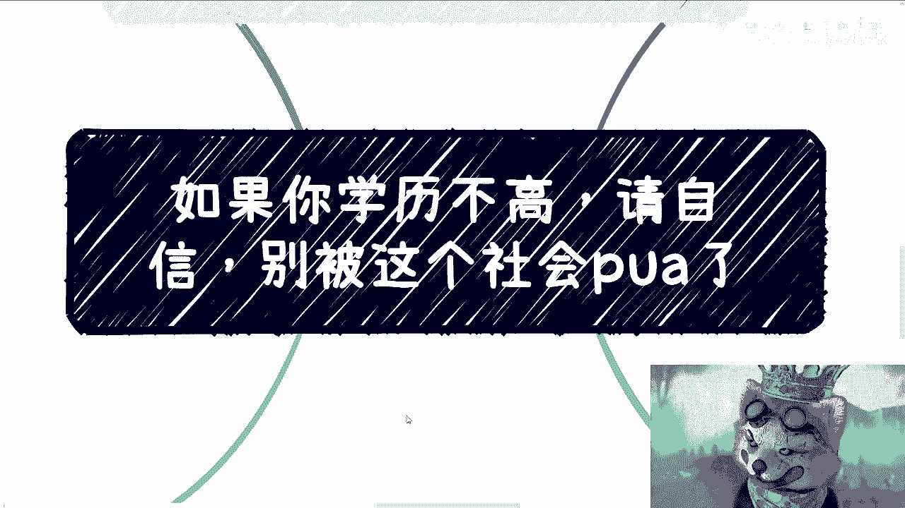

# 课程01：学历与自信 - 拒绝社会PUA 🛡️

在本节课中，我们将探讨一个普遍存在的社会现象：学历歧视与自我价值认知。我们将分析问题的核心，并讨论如何建立自信，避免陷入无意义的内卷与自我怀疑。

## 概述：问题的起源

今天早上，我在微博上看到一篇关于“第一学历歧视”的讨论，这让我感到非常气愤。这篇讨论将“第一学历”设置为一种隐形的墙，并询问人们是否感受过这种歧视。

我的转发评论是：这很可笑。大家本质上都是资本家的工具人，却还要相互歧视。大部分工作其实个人都能胜任，设置过高的学历门槛本质上并无意义。其唯一的意义可能就是进行一种“PUA”——通过制造焦虑和贬低来操控他人。

## 核心矛盾：被偷换的概念

随后，有人评论说：“那不是门槛。一个岗位给两三个人干，一份工资给两三个人分，你愿意吗？” 或者更直白地说：“你的工作分给两三个人干，工资也分出去三分之二。”

这种发言揭示了一个核心问题：明明大家都是打工人，是工具人，为什么要相互伤害？问题的核心根本不在于此。

我的回复是：这很可笑。这就好比在疫情期间，我们不思考如何优化流程和管理，而是直接制定规则说“认知二人必须死”。你会发现，这类讨论永远在回避核心问题。持这种观点的人，不是坏就是蠢，而我不相信是蠢，那很可能就是坏。归根结底，这只是在鼓励底层相互伤害。

## 深入剖析：学历与能力的迷思

以下是几种常见的、具有误导性的观点及其分析：

**观点一：学历是能力的直接证明。**

有人举例：“如果同一个岗位，一个985/211毕业生，一个普通本科生，一个大专生，你是面试官，你会选哪个？”

这种说法非常神奇。它将一个已经被PUA灌输的结果（即“高学历=优秀”）当作一个既定的真理和原因来讨论。这有意义吗？

*   **逻辑反驳**：照此逻辑，所有能赚钱、能生存的富二代，普通老百姓就都不用活了，对吗？
*   **事实反驳**：985/211一定优秀吗？普通本科一定不优秀吗？大专生一定不优秀吗？
*   **公平性**：什么是公平？公平是让大家明白，问题出在**供需失衡、人口众多、经济环境**上，而不是一味打压，说“学历低的就是垃圾”。

这种言论的目的是什么？是让所有人都去卷学历、卷工作。而这背后，存在着大量的培训机构，这是一门生意。

**观点二：除了提升学历，别无他路。**

你可能会想：“那如果不这么做，就没必要找工作了？只有这一条路可走？” 如果你愿意接受这种PUA，我也无话可说。

**观点三：社会只讨论高学历的成功者。**

你会发现，所有的评论、新闻和讨论都倾向于高学历者。那么，学历一般或较低的人呢？他们仿佛被抛弃了，假装不存在。但事实上，他们不仅存在，而且占大多数。他们往往因为自卑（或被PUA到自卑），以及忙于生计，而没有时间或意愿参与网络讨论。

那么，问题来了：如果所有人都去提升学历、卷工作，这条本就拥挤的“独木桥”还能挤上去吗？很多家庭有经济能力支撑这种“卷”吗？读完书就一定能保证找到好工作吗？今年，很多研究生毕业工作半年或一年后被“优化”的案例也不在少数。

这种言论除了导致底层相互PUA，还有什么意义？周围的舆论、亲戚的言论，每次发言和讨论，都在PUA别人，也在PUA自己。

## 建立正确认知：自信的根源

所以，核心在于我们必须明白以下几点：

1.  **人与人的差别并不大**。不要因为学历高就看不起别人，也不要因为学历低就贬低自己。
2.  **很多岗位并非你做不了**。你进不去，往往是因为社会设置了一些莫名其妙的规则，而非你能力不足。一旦获得机会，经过几个月的实践，你就能成为熟练工。我之前说过，很多地方都是“草台班子”，没有本质区别。
3.  **社会赚钱的方式多种多样**。打工并非唯一出路。更何况，打工的决定权掌握在别人手中，这有什么可骄傲的？就像那些在评论里炫耀学历的人，除了打工，他们还有什么可骄傲的？难道不应该为自己狭窄的出路感到担忧吗？
4.  **其他道路对学历的依赖较少**。在商业、创业等其他道路上，学历作为“应届生门槛”的作用会减弱。随着时间推移，看学历的情况会越来越少。当然，这些路也并非坦途，可能同样是“独木桥”。
5.  **关键在于转换赛道**。如果你在“学历-打工”这条路上已经被PUA了二十多年，且卷不过别人（例如第一学历无法改变），那么继续硬卷意义不大。此时，你应该考虑转换赛道。

## 行动指南：跳出恶性循环

对于学历不高的人，更应去了解社会的运作规则，为自己多开辟一条路。更多的出路不是继续“卷”，而是“换赛道”。

*   **你可以打工，但不必执着于“好工作”**。你可以找一份能维持生计的工作，利用业余时间去了解社会如何运作。
*   **了解非打工收入来源**。社会上有很多人的收入并非来自打工。他们是怎么赚钱的？这是一个巨大的学问和市场。了解这些需要时间，就像你读书读了二十多年一样，这不是一朝一夕能完成的。
*   **克服自卑与不自信**。很多学历不高的人，在长期的环境影响下变得自卑和不自信。他们的大脑被“学历不行”这个念头占据，从而忽略了其他所有可能性。这形成了一个恶性循环：因学历低被PUA -> 觉得自己不行 -> 想提升学历证明自己 -> 投入巨大但收效甚微 -> 再次被打击。
    *   **公式**：`自卑 -> 盲目提升学历 -> 投入与回报不成正比 -> 加深自卑`。这是一个需要被打破的循环。
*   **进行客观评估**。你需要冷静思考：你渴望的（高学历）到底有没有真正的用处？假设你借钱专升本、专升硕，留学归来，一两年后却被优化了，你该怎么办？到时候是上网骂“学历无用”吗？这没有意义。

## 总结：掌控可控的，了解不可控的

本节课我们一起学习了如何应对学历歧视和社会PUA。关键在于，无论你学历高低，都需要客观看待社会、它的运作规则以及上下游的逻辑。

*   **不要盲目自信，也不要盲目自卑**，这毫无意义。
*   这些关于学历的焦虑，可能在毕业头几年影响你，但当你到了二十七八岁甚至三十岁左右，你就会明白，这些外在标签其实都没用。
*   **唯一有用的，是你对社会了解多少，以及你自身沉淀了多少**。因为这是**你唯一可控的东西**，而其他一切（如经济环境、公司决策）都是不可控的。

希望你能摆脱PUA，建立基于自我认知和现实了解的真正自信。